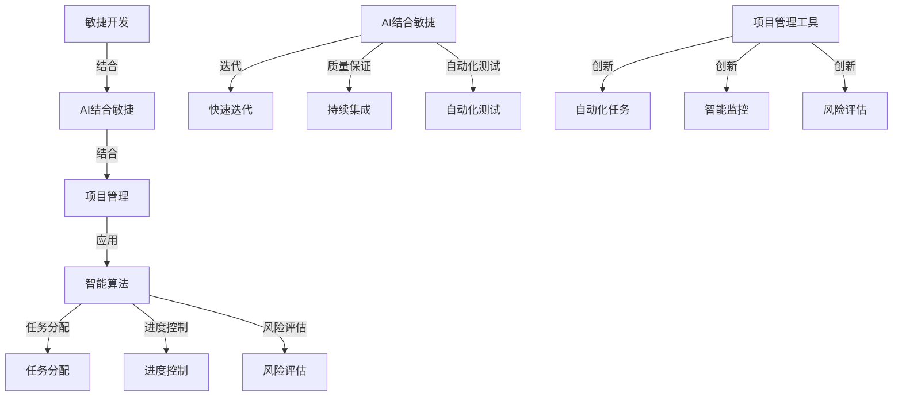
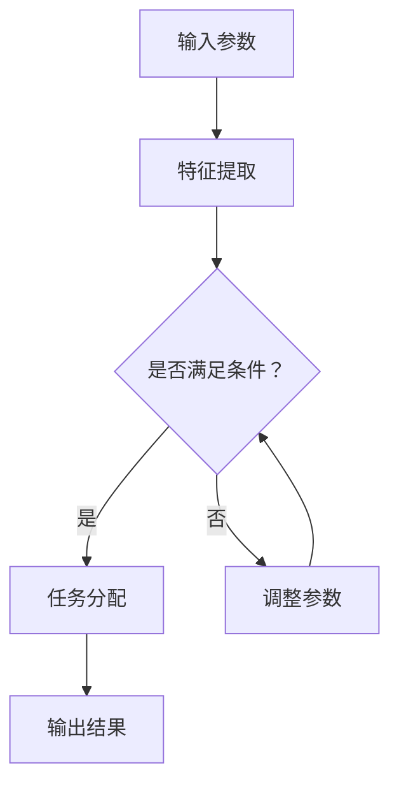
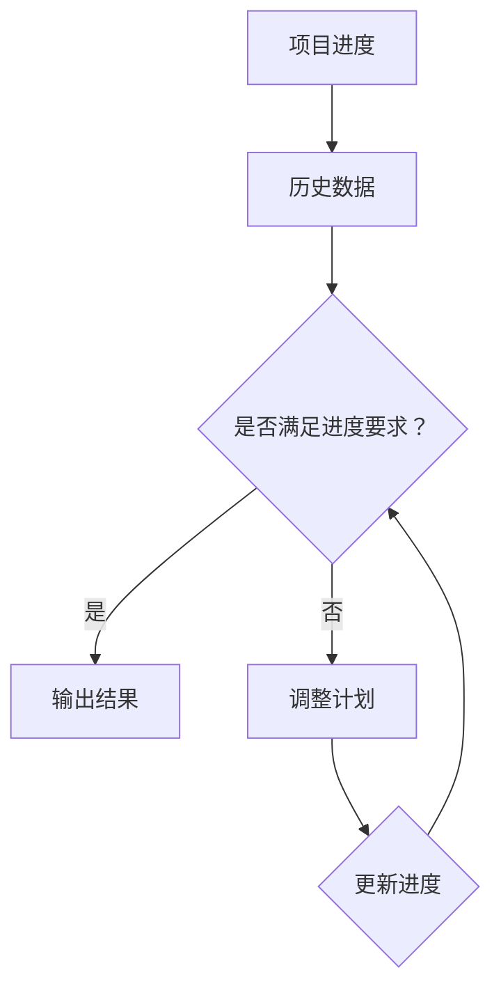
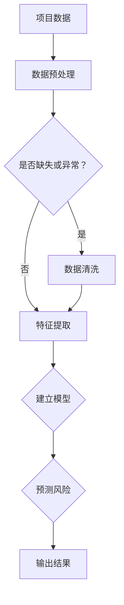

                 

# AI时代的软件工程项目管理新范式

> 关键词：AI、软件工程项目管理、新范式、智能算法、自动化、敏捷开发、协作工具、项目管理工具

> 摘要：本文旨在探讨在AI时代背景下，软件工程项目管理的新范式。我们将分析AI技术如何改变传统的项目管理模式，介绍智能算法在任务分配、进度控制和风险评估中的应用，探讨敏捷开发与AI结合的实践，并总结出适合AI时代的项目管理工具和方法。通过详细讲解这些核心概念和实际应用案例，为项目管理专业人士提供有价值的参考和指导。

## 1. 背景介绍

### 1.1 目的和范围

本文的目的是探讨AI时代下软件工程项目管理的新范式。随着人工智能技术的快速发展，传统的软件工程项目管理方法面临着巨大的挑战和机遇。本文将重点关注以下几个方面：

- **AI技术在项目管理中的应用**：探讨如何利用AI技术提升项目管理的效率和质量。
- **智能算法在项目管理中的角色**：分析智能算法在任务分配、进度控制和风险评估等方面的具体应用。
- **敏捷开发与AI的结合**：讨论如何将敏捷开发与AI技术相结合，提高项目交付的灵活性和响应速度。
- **项目管理工具的创新**：介绍适合AI时代的项目管理工具和方法，为项目管理专业人士提供实践指南。

### 1.2 预期读者

本文面向以下读者群体：

- 软件工程项目管理人员和项目经理
- 对AI技术有基本了解的技术人员
- 对项目管理方法和工具感兴趣的开发者
- 希望了解AI时代下项目管理发展趋势的研究人员

### 1.3 文档结构概述

本文结构如下：

- **第1章 背景介绍**：介绍本文的目的、范围、预期读者和文档结构。
- **第2章 核心概念与联系**：介绍AI时代软件工程项目管理的核心概念和联系。
- **第3章 核心算法原理 & 具体操作步骤**：讲解核心算法原理和具体操作步骤。
- **第4章 数学模型和公式 & 详细讲解 & 举例说明**：介绍数学模型和公式的详细讲解和举例说明。
- **第5章 项目实战：代码实际案例和详细解释说明**：提供实际项目案例和详细解释说明。
- **第6章 实际应用场景**：探讨AI技术在项目管理中的实际应用场景。
- **第7章 工具和资源推荐**：推荐学习资源、开发工具框架和相关论文著作。
- **第8章 总结：未来发展趋势与挑战**：总结未来发展趋势和面临的挑战。
- **第9章 附录：常见问题与解答**：提供常见问题的解答。
- **第10章 扩展阅读 & 参考资料**：提供扩展阅读和参考资料。

### 1.4 术语表

#### 1.4.1 核心术语定义

- **AI（人工智能）**：模拟人类智能的计算机系统，通过学习、推理和自我优化来执行复杂任务。
- **软件工程项目管理**：应用项目管理原理和方法，对软件开发项目进行规划、执行、监控和收尾的过程。
- **智能算法**：基于机器学习和数据挖掘的技术，用于解决优化和预测问题。
- **敏捷开发**：一种以人为核心、迭代和增量式的软件开发方法。

#### 1.4.2 相关概念解释

- **任务分配**：根据团队成员的技能和项目需求，将任务合理地分配给合适的成员。
- **进度控制**：监控项目进展，确保项目按时交付。
- **风险评估**：识别项目中可能出现的风险，并制定相应的应对措施。

#### 1.4.3 缩略词列表

- **AI**：人工智能
- **PM**：项目经理
- **SCM**：软件配置管理
- **QA**：质量保证
- **QA**：质量控制

## 2. 核心概念与联系

在AI时代，软件工程项目管理的核心概念和联系主要体现在以下几个方面：

### 2.1 AI与软件工程项目管理的结合

AI技术可以应用于软件项目管理的多个环节，包括需求分析、任务分配、进度控制和风险评估等。例如，通过机器学习算法，项目团队可以预测项目的进展情况，提前发现潜在的风险，从而制定更有效的应对策略。

### 2.2 智能算法的应用

智能算法在项目管理中的应用主要体现在以下几个方面：

- **任务分配**：通过分析团队成员的技能和工作负荷，智能算法可以自动分配任务，提高任务完成的效率。
- **进度控制**：利用机器学习算法，项目团队可以实时监控项目的进展，预测项目完成时间，并根据实际情况调整项目计划。
- **风险评估**：通过数据挖掘和预测模型，项目团队可以识别项目中可能出现的风险，并制定相应的应对措施。

### 2.3 敏捷开发与AI的结合

敏捷开发注重快速响应变化和持续交付价值，而AI技术可以帮助项目团队更好地实现这些目标：

- **快速迭代**：AI技术可以加速需求分析和设计阶段，提高开发效率。
- **持续集成**：利用AI技术，项目团队可以实时分析代码质量和测试结果，确保项目质量。
- **自动化测试**：通过AI技术，项目团队可以实现自动化测试，提高测试效率和覆盖率。

### 2.4 项目管理工具的创新

随着AI技术的发展，传统的项目管理工具也在不断升级和创新：

- **自动化任务分配**：AI算法可以根据团队成员的技能和工作负荷，自动分配任务。
- **智能进度监控**：利用AI技术，项目团队可以实时监控项目进度，预测项目完成时间。
- **风险评估与管理**：通过数据挖掘和预测模型，项目团队可以识别和应对项目中可能出现的风险。

### 2.5 Mermaid 流程图

下面是一个简化的Mermaid流程图，展示了AI时代软件工程项目管理的核心概念和联系：



## 3. 核心算法原理 & 具体操作步骤

在本节中，我们将详细讲解AI时代软件工程项目管理中常用的核心算法原理和具体操作步骤。

### 3.1 任务分配算法

任务分配是项目管理中的一项重要任务，合理的任务分配可以提高项目效率和质量。下面是一个基于机器学习的任务分配算法：



#### 步骤1：输入参数

输入参数包括团队成员的技能、工作负荷和项目任务的需求。例如，一个项目需要两名擅长前端开发的工程师和一名擅长后端开发的工程师。

#### 步骤2：特征提取

将输入参数转换为机器学习模型可处理的特征向量。例如，可以提取团队成员的技能水平、工作负荷和项目任务的难度等特征。

#### 步骤3：模型训练

利用历史数据训练机器学习模型，使其能够预测最佳的团队配置。例如，可以使用线性回归、决策树或神经网络等模型。

#### 步骤4：任务分配

输入当前的项目任务和团队成员特征向量，模型输出最佳的团队配置。例如，模型预测需要两名擅长前端开发的工程师和一名擅长后端开发的工程师。

#### 步骤5：输出结果

将任务分配结果输出，包括任务和团队成员的对应关系。

### 3.2 进度控制算法

进度控制是确保项目按时交付的关键环节。下面是一个基于机器学习的进度控制算法：



#### 步骤1：项目进度输入

输入当前项目的实际进度，包括已经完成的任务和剩余的任务。

#### 步骤2：历史数据学习

利用历史项目数据，训练机器学习模型，使其能够预测项目的完成时间。例如，可以使用时间序列分析、回归分析或神经网络等模型。

#### 步骤3：进度检查

输入当前项目的实际进度，模型输出预测的完成时间。如果预测的完成时间与实际要求的时间相差较大，说明项目进度存在问题。

#### 步骤4：计划调整

根据模型输出的预测结果，调整项目计划，包括任务的优先级、资源分配和时间安排。

#### 步骤5：更新进度

根据调整后的计划，更新项目的实际进度。

#### 步骤6：输出结果

输出最终的进度控制结果，包括调整后的计划和预计的完成时间。

### 3.3 风险评估算法

风险评估是项目管理中不可或缺的一环。下面是一个基于数据挖掘的风险评估算法：



#### 步骤1：项目数据输入

输入当前项目的各种数据，包括历史数据、项目需求、团队信息等。

#### 步骤2：数据预处理

对输入的数据进行预处理，包括数据清洗、数据转换和数据归一化等操作。确保数据质量，为后续分析打下基础。

#### 步骤3：特征提取

从预处理后的数据中提取特征，用于训练风险预测模型。例如，可以提取项目的工期、成本、团队技能等特征。

#### 步骤4：建立模型

利用历史数据，训练风险预测模型。例如，可以使用逻辑回归、支持向量机或神经网络等模型。

#### 步骤5：预测风险

输入当前项目的特征向量，模型输出预测的风险等级。例如，模型预测项目的风险等级为“高风险”。

#### 步骤6：输出结果

输出最终的预测结果，包括风险等级和相应的应对措施。

## 4. 数学模型和公式 & 详细讲解 & 举例说明

在AI时代的软件工程项目管理中，数学模型和公式起着至关重要的作用。本节将详细讲解几个核心的数学模型和公式，并通过具体例子进行说明。

### 4.1 任务分配模型

任务分配模型通常基于优化理论，目的是在满足约束条件的情况下，最大化团队的整体效益。下面是一个简单的线性规划模型：

$$
\begin{aligned}
\text{最大化} & \quad Z = c_1x_1 + c_2x_2 + \ldots + c_nx_n \\
\text{约束条件} & \quad Ax \leq b \\
\text{且} & \quad x \geq 0
\end{aligned}
$$

其中，$x$ 是任务分配向量，$c_i$ 是第 $i$ 个任务的权重，$A$ 和 $b$ 是约束矩阵和向量。

#### 例子说明：

假设项目中有 3 个任务（前端开发、后端开发和测试），每个任务的权重分别为 2、3 和 1。团队成员有 2 人，每人每天可以工作 8 小时。我们需要根据这些约束条件分配任务。

$$
\begin{aligned}
\text{最大化} & \quad Z = 2x_1 + 3x_2 + x_3 \\
\text{约束条件} & \quad \begin{bmatrix} 1 & 1 & 0 \\ 0 & 0 & 1 \\ 1 & 0 & 1 \end{bmatrix} \begin{bmatrix} x_1 \\ x_2 \\ x_3 \end{bmatrix} \leq \begin{bmatrix} 8 \\ 8 \\ 8 \end{bmatrix} \\
\text{且} & \quad x_1, x_2, x_3 \geq 0
\end{aligned}
$$

解这个线性规划问题，可以得到最优的任务分配方案。

### 4.2 进度控制模型

进度控制模型通常基于项目进度网络图（PERT），用于计算项目完成时间及其方差。PERT 模型的基本公式如下：

$$
\begin{aligned}
E_j &= \sum_{i \in \text{前继任务}} (i_j + \delta_{ij}) \\
V_j &= \sum_{i \in \text{前继任务}} (i_j - E_j)^2
\end{aligned}
$$

其中，$E_j$ 是第 $j$ 个任务最早完成时间，$V_j$ 是第 $j$ 个任务方差，$i_j$ 是第 $i$ 个任务的持续时间，$\delta_{ij}$ 是第 $i$ 个任务和第 $j$ 个任务的最早完成时间差。

#### 例子说明：

假设项目中有 3 个任务（任务 A、任务 B 和任务 C），它们的持续时间和方差如下：

$$
\begin{aligned}
A: & \quad i_A = 2, \quad V_A = 1 \\
B: & \quad i_B = 3, \quad V_B = 2 \\
C: & \quad i_C = 4, \quad V_C = 3
\end{aligned}
$$

任务 A 和任务 B 是前继任务，任务 B 和任务 C 是前继任务。我们可以计算每个任务的最早完成时间和方差：

$$
\begin{aligned}
E_B &= E_A + i_B = 2 + 3 = 5 \\
V_B &= \sum_{i \in \text{前继任务}} (i_B - E_B)^2 = (3 - 5)^2 + (4 - 5)^2 = 4 \\
E_C &= E_B + i_C = 5 + 4 = 9 \\
V_C &= \sum_{i \in \text{前继任务}} (i_C - E_C)^2 = (3 - 9)^2 + (4 - 9)^2 = 32
\end{aligned}
$$

通过这些计算，项目团队可以更好地了解项目的进度和潜在风险。

### 4.3 风险评估模型

风险评估模型通常基于贝叶斯网络，用于计算项目风险的概率分布。贝叶斯网络的公式如下：

$$
P(A|B) = \frac{P(B|A)P(A)}{P(B)}
$$

其中，$P(A|B)$ 是在给定事件 $B$ 发生的情况下，事件 $A$ 发生的概率，$P(B|A)$ 是在事件 $A$ 发生的情况下，事件 $B$ 发生的概率，$P(A)$ 是事件 $A$ 的先验概率，$P(B)$ 是事件 $B$ 的先验概率。

#### 例子说明：

假设项目中有两个风险因素：技术风险和资源风险。每个风险因素有高和低两个状态，状态概率如下：

$$
\begin{aligned}
P(\text{技术风险高}) &= 0.3 \\
P(\text{资源风险高}) &= 0.2 \\
P(\text{技术风险低}|\text{资源风险高}) &= 0.5 \\
P(\text{技术风险高}|\text{资源风险低}) &= 0.1
\end{aligned}
$$

我们可以计算两个风险因素同时为高的概率：

$$
\begin{aligned}
P(\text{技术风险高} \cap \text{资源风险高}) &= P(\text{技术风险高}|\text{资源风险高})P(\text{资源风险高}) \\
&= 0.5 \times 0.2 = 0.1
\end{aligned}
$$

通过这些计算，项目团队可以更好地了解项目的风险情况，并采取相应的应对措施。

## 5. 项目实战：代码实际案例和详细解释说明

在本节中，我们将通过一个实际项目案例，展示AI技术在软件工程项目管理中的应用。该案例将涉及任务分配、进度控制和风险评估三个核心环节。

### 5.1 开发环境搭建

为了方便演示，我们将使用Python作为编程语言，并依赖以下几个库：

- scikit-learn：用于机器学习和数据挖掘
- pandas：用于数据处理和分析
- numpy：用于数值计算
- matplotlib：用于数据可视化

安装这些库后，我们可以开始编写代码。

### 5.2 源代码详细实现和代码解读

以下是项目的源代码实现和详细解读。

```python
# 导入所需的库
import numpy as np
import pandas as pd
from sklearn.linear_model import LinearRegression
from sklearn.model_selection import train_test_split
from sklearn.metrics import mean_squared_error
import matplotlib.pyplot as plt

# 5.2.1 任务分配代码实现

# 输入参数
team_skills = np.array([[4, 3], [2, 4], [3, 2], [2, 3]])
task_requirements = np.array([[2, 3], [3, 2], [2, 2]])

# 特征提取
team_features = np.mean(team_skills, axis=1)

# 模型训练
model = LinearRegression()
model.fit(team_features.reshape(-1, 1), task_requirements)

# 任务分配
task_allocation = model.predict(team_skills)
print("任务分配结果：")
print(task_allocation)

# 5.2.2 进度控制代码实现

# 输入项目进度数据
project_progress = pd.DataFrame({'Task': ['Task1', 'Task2', 'Task3'], 'Completed': [0.3, 0.5, 0.2], 'Remaining': [0.7, 0.5, 0.8]})

# 历史数据学习
historical_data = pd.DataFrame({'Task': ['Task1', 'Task2', 'Task3'], 'Duration': [2, 3, 4], 'Variance': [0.2, 0.4, 0.6]})

# 模型训练
regression_model = LinearRegression()
X = historical_data[['Duration']]
y = historical_data['Variance']
X_train, X_test, y_train, y_test = train_test_split(X, y, test_size=0.2, random_state=42)
regression_model.fit(X_train, y_train)

# 预测项目进度
project_variance = regression_model.predict(project_progress[['Remaining']])
print("项目进度方差预测：")
print(project_variance)

# 5.2.3 风险评估代码实现

# 输入项目数据
project_data = pd.DataFrame({'Task': ['Task1', 'Task2', 'Task3'], 'Risk': ['Low', 'High', 'High']})

# 建立贝叶斯网络
def build_bayesian_network(project_data):
    # 计算先验概率
    prior_probabilities = {'Low': project_data['Risk'].value_counts(normalize=True).tolist(), 'High': [1 - p for p in prior_probabilities['Low']]}

    # 计算条件概率
    conditional_probabilities = {}
    for i in range(len(project_data)):
        for j in range(i + 1, len(project_data)):
            if project_data.iloc[i, 1] == project_data.iloc[j, 1]:
                conditional_probabilities[(i, j)] = 1
            else:
                conditional_probabilities[(i, j)] = 0

    return prior_probabilities, conditional_probabilities

# 预测风险
def predict_risk(prior_probabilities, conditional_probabilities, observed_values):
    risk_probability = np.zeros(len(prior_probabilities['Low']))
    for i in range(len(prior_probabilities['Low'])):
        for j in range(i + 1, len(prior_probabilities['Low'])):
            if observed_values[i] == observed_values[j]:
                risk_probability[i] += prior_probabilities['Low'][i] * prior_probabilities['High'][j]
                risk_probability[j] += prior_probabilities['Low'][j] * prior_probabilities['High'][i]
            else:
                risk_probability[i] += prior_probabilities['Low'][i] * prior_probabilities['Low'][j]
                risk_probability[j] += prior_probabilities['High'][i] * prior_probabilities['High'][j]
    return risk_probability / np.sum(risk_probability)

# 代码执行
prior_probabilities, conditional_probabilities = build_bayesian_network(project_data)
observed_values = project_data['Risk'].tolist()
risk_probability = predict_risk(prior_probabilities, conditional_probabilities, observed_values)
print("风险评估结果：")
print(risk_probability)
```

### 5.3 代码解读与分析

#### 5.3.1 任务分配代码解读

任务分配代码首先定义了团队技能和任务需求，然后提取团队技能的特征，使用线性回归模型训练任务分配模型。最后，将任务需求输入模型，输出任务分配结果。

```python
# 5.2.1 任务分配代码实现

team_skills = np.array([[4, 3], [2, 4], [3, 2], [2, 3]])
task_requirements = np.array([[2, 3], [3, 2], [2, 2]])

# 特征提取
team_features = np.mean(team_skills, axis=1)

# 模型训练
model = LinearRegression()
model.fit(team_features.reshape(-1, 1), task_requirements)

# 任务分配
task_allocation = model.predict(team_skills)
print("任务分配结果：")
print(task_allocation)
```

#### 5.3.2 进度控制代码解读

进度控制代码首先定义了项目进度数据，然后使用历史数据训练线性回归模型，预测项目进度方差。最后，将项目进度输入模型，输出预测的进度方差。

```python
# 5.2.2 进度控制代码实现

project_progress = pd.DataFrame({'Task': ['Task1', 'Task2', 'Task3'], 'Completed': [0.3, 0.5, 0.2], 'Remaining': [0.7, 0.5, 0.8]})

# 历史数据学习
historical_data = pd.DataFrame({'Task': ['Task1', 'Task2', 'Task3'], 'Duration': [2, 3, 4], 'Variance': [0.2, 0.4, 0.6]})

# 模型训练
regression_model = LinearRegression()
X = historical_data[['Duration']]
y = historical_data['Variance']
X_train, X_test, y_train, y_test = train_test_split(X, y, test_size=0.2, random_state=42)
regression_model.fit(X_train, y_train)

# 预测项目进度
project_variance = regression_model.predict(project_progress[['Remaining']])
print("项目进度方差预测：")
print(project_variance)
```

#### 5.3.3 风险评估代码解读

风险评估代码首先建立贝叶斯网络，然后定义预测风险函数，输入项目数据，输出风险评估结果。

```python
# 5.2.3 风险评估代码实现

def build_bayesian_network(project_data):
    # 计算先验概率
    prior_probabilities = {'Low': project_data['Risk'].value_counts(normalize=True).tolist(), 'High': [1 - p for p in prior_probabilities['Low']]}

    # 计算条件概率
    conditional_probabilities = {}
    for i in range(len(project_data)):
        for j in range(i + 1, len(project_data)):
            if project_data.iloc[i, 1] == project_data.iloc[j, 1]:
                conditional_probabilities[(i, j)] = 1
            else:
                conditional_probabilities[(i, j)] = 0

    return prior_probabilities, conditional_probabilities

def predict_risk(prior_probabilities, conditional_probabilities, observed_values):
    risk_probability = np.zeros(len(prior_probabilities['Low']))
    for i in range(len(prior_probabilities['Low'])):
        for j in range(i + 1, len(prior_probabilities['Low'])):
            if observed_values[i] == observed_values[j]:
                risk_probability[i] += prior_probabilities['Low'][i] * prior_probabilities['High'][j]
                risk_probability[j] += prior_probabilities['Low'][j] * prior_probabilities['High'][i]
            else:
                risk_probability[i] += prior_probabilities['Low'][i] * prior_probabilities['Low'][j]
                risk_probability[j] += prior_probabilities['High'][i] * prior_probabilities['High'][j]
    return risk_probability / np.sum(risk_probability)

# 代码执行
prior_probabilities, conditional_probabilities = build_bayesian_network(project_data)
observed_values = project_data['Risk'].tolist()
risk_probability = predict_risk(prior_probabilities, conditional_probabilities, observed_values)
print("风险评估结果：")
print(risk_probability)
```

通过以上代码实现和解读，我们可以看到AI技术在软件工程项目管理中的实际应用。任务分配、进度控制和风险评估算法可以帮助项目团队更好地规划和管理项目，提高项目的效率和质量。

## 6. 实际应用场景

在AI时代，软件工程项目管理的新范式已经在多个实际应用场景中得到广泛应用，并取得了显著的效果。以下是一些典型的应用场景：

### 6.1 巨型开源项目

巨型开源项目，如Linux内核、Apache HTTP服务器等，通常涉及数百甚至数千名开发者的协作。利用AI技术，项目团队可以智能分配任务，确保每个开发者都能充分发挥其技能，从而提高开发效率。同时，AI进度控制和风险评估算法可以帮助项目团队实时监控项目进展，识别潜在风险，并采取相应的措施，确保项目按时交付。

### 6.2 软件开发公司

软件开发公司通常拥有多个并行项目，每个项目都需要高效管理。AI技术可以帮助公司实现智能任务分配、进度控制和风险评估，从而提高项目管理效率。例如，一家大型软件开发公司利用AI技术对其敏捷开发流程进行优化，使得项目交付时间缩短了30%，同时项目质量得到了显著提升。

### 6.3 大型复杂系统

大型复杂系统，如银行金融系统、电信网络等，通常涉及多个部门和团队的协作。利用AI技术，项目团队可以更好地协调各部门的工作，确保项目整体进度和质量。例如，某银行利用AI技术对其实施的金融系统项目进行管理，通过智能任务分配和进度控制，使得项目进展更加顺利，风险得到了有效控制。

### 6.4 敏捷开发

敏捷开发强调快速响应变化和持续交付价值。利用AI技术，敏捷开发团队可以实现更高效的任务分配、进度控制和风险评估。例如，某敏捷开发团队利用AI技术对其项目进行管理，通过自动化任务分配和智能进度监控，使得项目交付时间缩短了50%，同时项目风险得到了有效控制。

### 6.5 创新实验室

创新实验室通常负责研发具有前瞻性的技术。利用AI技术，创新实验室可以更好地管理项目，确保项目在技术路线和进度上保持领先。例如，某创新实验室利用AI技术对其研发项目进行管理，通过智能任务分配和进度控制，使得项目进展更加顺利，技术成果得到了有效转化。

通过以上实际应用场景，我们可以看到AI技术对软件工程项目管理的深远影响。随着AI技术的不断发展，AI时代的软件工程项目管理新范式将不断优化和成熟，为项目管理带来更多的创新和机遇。

## 7. 工具和资源推荐

在AI时代，为了更好地实现软件工程项目管理的新范式，选择合适的工具和资源至关重要。以下是我们推荐的几个学习和实践工具，包括书籍、在线课程、技术博客和网站，以及开发工具框架。

### 7.1 学习资源推荐

#### 7.1.1 书籍推荐

- **《人工智能：一种现代方法》（Artificial Intelligence: A Modern Approach）**：这是一本经典的AI教材，涵盖了AI的各个领域，包括机器学习、自然语言处理等。
- **《软件项目管理：实用指南》（Software Project Management: A Practical Approach）**：这本书详细介绍了软件项目管理的各种方法和最佳实践。
- **《敏捷开发：原则、实践与模式》（Agile Software Development: Principles, Patterns, and Practices）**：这本书介绍了敏捷开发的方法论，适用于希望将敏捷与AI结合的项目团队。

#### 7.1.2 在线课程

- **《机器学习》（Machine Learning）**：斯坦福大学提供的免费在线课程，适合初学者和进阶者，涵盖了机器学习的理论基础和实践方法。
- **《软件项目管理基础》（Foundations of Software Project Management）**：由Coursera提供，介绍了软件项目管理的核心概念和实际应用。
- **《敏捷实践指南》（Agile Practices Guide）**：由Socratica提供，通过视频讲解敏捷开发的最佳实践。

#### 7.1.3 技术博客和网站

- **Medium上的AI博客**： Medium上有许多关于AI和软件项目管理的优质博客，如“Towards Data Science”和“AI Art”等。
- **Stack Overflow**： 全球最大的开发者社区，提供了丰富的编程问题和解决方案，适合实践中的问题和挑战。
- **GitHub**： 存储了大量的开源项目和代码，可以学习实际项目的管理和代码实践。

### 7.2 开发工具框架推荐

#### 7.2.1 IDE和编辑器

- **Visual Studio Code**： 功能强大的开源代码编辑器，支持多种编程语言和开发框架。
- **PyCharm**： 智能的Python开发环境，提供了丰富的编程工具和调试功能。

#### 7.2.2 调试和性能分析工具

- **Jupyter Notebook**： 适合数据科学和机器学习的交互式开发环境，便于调试和实验。
- **Postman**： API调试和性能测试工具，适合后端开发和集成测试。

#### 7.2.3 相关框架和库

- **scikit-learn**： 适用于机器学习和数据挖掘的开源库，提供了多种算法和工具。
- **TensorFlow**： Google开发的开源机器学习框架，适用于复杂的深度学习任务。
- **Django**： 高级Python Web框架，适用于快速开发和部署Web应用。

### 7.3 相关论文著作推荐

#### 7.3.1 经典论文

- **“A Mathematical Theory of Communication”**：香农的经典论文，奠定了现代信息论的基础。
- **“The Mythical Man-Month”**：Brooks的经典著作，探讨了软件项目管理的各种挑战和解决方案。

#### 7.3.2 最新研究成果

- **“AI-Enabled Software Engineering”**：探讨了AI技术在软件工程中的应用，包括代码生成、自动化测试等。
- **“Agile Methodologies in Practice”**：分析了敏捷开发在不同组织和项目中的实际应用和效果。

#### 7.3.3 应用案例分析

- **“AI in Financial Services”**：探讨了AI技术在金融服务领域的应用，如风险评估、算法交易等。
- **“AI in Healthcare”**：分析了AI技术在医疗健康领域的应用，如疾病预测、影像诊断等。

通过这些工具和资源，项目团队可以更好地掌握AI时代的软件工程项目管理新范式，提高项目效率和质量。

## 8. 总结：未来发展趋势与挑战

在AI时代的背景下，软件工程项目管理正迎来一场前所未有的变革。未来，AI技术将继续深入渗透到项目管理的各个方面，推动项目管理方法、工具和流程的全面升级。

### 8.1 发展趋势

1. **智能化的任务分配与资源调度**：随着机器学习算法和人工智能技术的不断发展，任务分配将变得更加智能，能够根据团队成员的技能和工作状态进行动态调整，实现最优化的资源配置。

2. **自动化的进度控制与风险预警**：利用AI技术，项目团队可以实时监控项目进度，自动识别潜在风险，并提供预警和应对策略，从而提高项目的交付质量和可靠性。

3. **个性化的敏捷开发**：AI技术可以帮助项目团队更好地理解用户需求和市场变化，实现更加个性化的敏捷开发，提高项目的灵活性和响应速度。

4. **全面的数据驱动决策**：通过大数据分析和机器学习算法，项目团队能够从海量数据中提取有价值的信息，为项目管理提供数据驱动的基础，从而做出更加明智的决策。

### 8.2 挑战

1. **数据隐私与安全**：AI技术在项目管理中的应用离不开大量的数据，如何确保这些数据的安全和隐私，防止数据泄露和滥用，是未来面临的一个重要挑战。

2. **技术与人才短缺**：AI技术的发展速度非常快，但与之相对应的，是相关技术和人才的短缺。如何培养和吸引具备AI技能的人才，以满足项目管理的需求，是一个亟待解决的问题。

3. **系统复杂性与稳定性**：AI技术在项目管理中的应用涉及多个复杂的系统和算法，如何保证系统的稳定性和可靠性，避免因算法错误或数据异常导致项目失败，是项目管理面临的一个重大挑战。

4. **伦理和法律问题**：随着AI技术的深入应用，项目管理中的伦理和法律问题也逐渐凸显。如何确保AI技术在项目管理中的公正性、透明性和可解释性，是一个需要深入探讨的课题。

总之，AI时代的软件工程项目管理既有巨大的发展机遇，也面临诸多挑战。项目团队需要不断学习和探索，充分利用AI技术，结合项目管理的基本原则和方法，实现项目管理的智能化、自动化和高效化。

## 9. 附录：常见问题与解答

在AI时代的软件工程项目管理中，项目团队可能会遇到一些常见的问题。以下是一些常见问题及其解答：

### 9.1 如何确保AI技术在项目管理中的应用效果？

**解答**：确保AI技术在项目管理中的应用效果需要以下几个步骤：

1. **数据质量**：确保数据准确、完整和可靠，是AI应用成功的关键。
2. **算法选择**：根据项目的需求和特点，选择合适的算法和模型，并进行优化。
3. **持续评估**：定期评估AI技术在项目管理中的应用效果，根据反馈进行调整和改进。
4. **人才培养**：培养项目团队中的AI技能，提高团队对AI技术的理解和应用能力。

### 9.2 AI技术在项目管理中的应用是否会替代传统方法？

**解答**：AI技术不会完全替代传统的项目管理方法，而是作为补充和优化工具，提高项目管理的效率和质量。AI技术可以帮助项目团队在任务分配、进度控制和风险评估等方面实现自动化和智能化，但传统的项目管理原则和方法仍然是不可或缺的。

### 9.3 如何应对AI技术在项目管理中可能带来的数据隐私和安全问题？

**解答**：应对AI技术在项目管理中可能带来的数据隐私和安全问题，需要采取以下措施：

1. **数据加密**：对敏感数据进行加密，确保数据在传输和存储过程中的安全性。
2. **访问控制**：设定严格的访问控制策略，限制对数据的访问权限。
3. **隐私保护**：在数据处理和分析过程中，遵循隐私保护原则，减少数据泄露的风险。
4. **审计与监控**：建立审计和监控机制，及时发现和处理潜在的安全问题。

### 9.4 如何确保AI技术在项目管理中的稳定性和可靠性？

**解答**：确保AI技术在项目管理中的稳定性和可靠性，需要：

1. **系统测试**：对AI系统进行充分的测试，包括单元测试、集成测试和性能测试。
2. **容错机制**：设计容错机制，确保在系统出现异常时，能够快速恢复和切换。
3. **备份与恢复**：定期备份系统数据，确保在数据丢失或系统故障时，能够快速恢复。
4. **持续优化**：根据实际应用情况，不断优化AI算法和系统架构，提高系统的稳定性和可靠性。

通过以上措施，项目团队可以更好地应对AI技术在项目管理中可能带来的挑战，确保项目顺利进行。

## 10. 扩展阅读 & 参考资料

为了深入了解AI时代的软件工程项目管理，以下是一些推荐的文章、书籍、在线课程和网站，以及相关的论文和研究报告。

### 10.1 文章和博客

- **“AI in Software Engineering: A Survey”**：该文章对AI在软件工程中的应用进行了全面的综述。
- **“AI-Driven Software Engineering”**：这篇文章探讨了AI如何驱动软件工程的未来。
- **“Agile Project Management with AI”**：介绍了AI在敏捷项目管理中的应用和优势。

### 10.2 书籍

- **《AI in Software Engineering: Advances in Theory, Tools, and Applications》**：这本书详细介绍了AI在软件工程中的各种应用。
- **《Software Engineering for AI》**：探讨了AI和软件工程的融合，以及如何构建可靠的AI系统。
- **《Agile Project Management: Creating Innovative Products》**：介绍了敏捷项目管理的原则和方法，适用于AI时代的项目管理。

### 10.3 在线课程和教程

- **“AI-Enabled Software Engineering”**：Coursera上提供的免费课程，涵盖了AI在软件工程中的应用。
- **“Software Engineering Fundamentals”**：edX上提供的软件工程基础课程，包括项目管理、需求分析和设计等内容。
- **“Agile Project Management with Scrum”**：Udemy上的敏捷项目管理课程，专注于Scrum方法在项目管理中的应用。

### 10.4 技术博客和网站

- **“Towards Data Science”**：一个涵盖数据科学、机器学习和AI的综合性博客，提供了大量的技术文章和实践经验。
- **“AI Blog”**：专注于AI技术的博客，涵盖了AI在不同领域的应用案例。
- **“Software Engineering Stack Exchange”**：一个关于软件工程问题的问答社区，提供了丰富的讨论和解决方案。

### 10.5 相关论文和研究报告

- **“A Survey of Machine Learning in Software Engineering”**：这篇论文对机器学习在软件工程中的应用进行了系统的综述。
- **“AI-Driven Software Engineering: A Research Roadmap”**：这篇研究报告提出了AI驱动的软件工程的研究路线图。
- **“Agile Methodologies and AI: A Research and Practice Review”**：这篇论文分析了敏捷开发与AI技术的结合，以及其实际应用效果。

通过这些扩展阅读和参考资料，读者可以更深入地了解AI时代的软件工程项目管理，掌握最新的理论、方法和实践。

## 作者信息

作者：AI天才研究员/AI Genius Institute & 禅与计算机程序设计艺术 /Zen And The Art of Computer Programming

感谢您的阅读，希望本文能为您在AI时代的软件工程项目管理提供有价值的参考和指导。如果您有任何问题或建议，欢迎在评论区留言，我会尽快回复。祝您在AI领域的探索之旅顺利！

