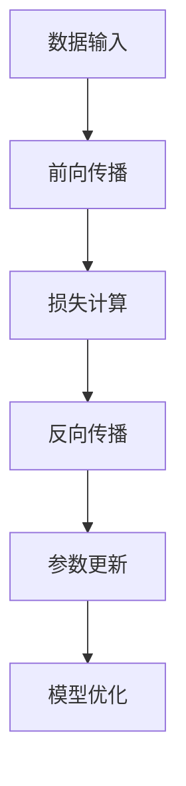
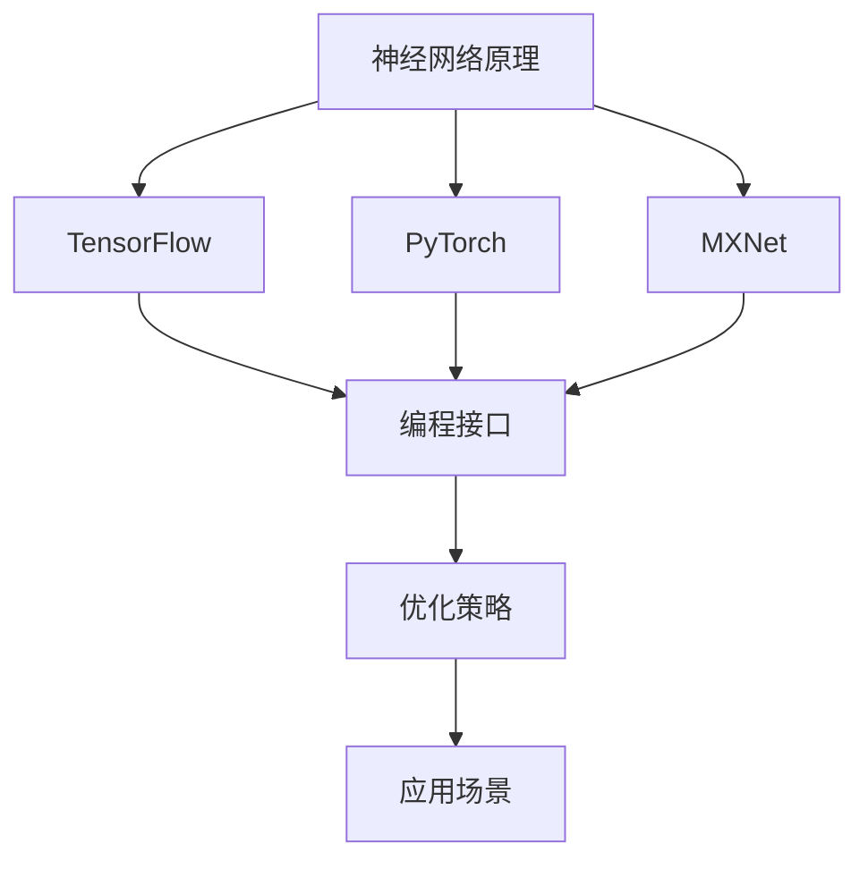

                 

# AI框架比较：TensorFlow、PyTorch与MXNet

> 关键词：AI框架，TensorFlow，PyTorch，MXNet，深度学习，比较分析

> 摘要：本文将深入探讨TensorFlow、PyTorch和MXNet这三个热门的深度学习框架，从背景、核心概念、算法原理、数学模型、实际应用等多个维度进行比较，分析它们的优缺点，帮助读者选择最适合自己项目的AI框架。

## 1. 背景介绍

### 1.1 目的和范围

本文旨在通过对TensorFlow、PyTorch和MXNet这三个深度学习框架的全面比较，帮助读者更好地理解它们各自的特性，以便在项目选择中作出明智的决策。本文将涵盖以下几个方面：

- 核心概念与联系
- 核心算法原理与具体操作步骤
- 数学模型与公式
- 项目实战：代码实际案例
- 实际应用场景
- 工具和资源推荐
- 总结：未来发展趋势与挑战

### 1.2 预期读者

本文适合以下读者群体：

- 深度学习初学者
- 深度学习研究者
- 深度学习工程师
- 对深度学习框架比较感兴趣的技术爱好者

### 1.3 文档结构概述

本文结构如下：

- 第1部分：背景介绍，包括目的、范围、预期读者和文档结构概述。
- 第2部分：核心概念与联系，介绍深度学习框架的基本原理和架构。
- 第3部分：核心算法原理与具体操作步骤，讲解各框架的核心算法和操作流程。
- 第4部分：数学模型与公式，分析深度学习中的关键数学模型。
- 第5部分：项目实战，通过实际代码案例展示各框架的应用。
- 第6部分：实际应用场景，讨论各框架在不同领域的应用。
- 第7部分：工具和资源推荐，推荐相关学习资源和开发工具。
- 第8部分：总结，展望深度学习框架的未来发展趋势与挑战。
- 第9部分：附录，常见问题与解答。
- 第10部分：扩展阅读与参考资料，提供进一步学习资源。

### 1.4 术语表

#### 1.4.1 核心术语定义

- 深度学习（Deep Learning）：一种人工智能（AI）技术，通过神经网络模仿人脑的学习过程，进行自动特征提取和模式识别。
- 神经网络（Neural Network）：一种由大量神经元（节点）组成的计算模型，用于模拟人脑的神经结构。
- 深度学习框架（Deep Learning Framework）：用于简化深度学习模型开发、训练和优化的软件库。
- TensorFlow：谷歌开源的深度学习框架，支持多种编程语言。
- PyTorch：Facebook开源的深度学习框架，支持Python语言。
- MXNet：Apache基金会旗下的深度学习框架，支持多种编程语言。

#### 1.4.2 相关概念解释

- 自动化特征提取（Automatic Feature Extraction）：深度学习通过神经网络结构，自动从原始数据中提取有意义的高级特征。
- 模型训练（Model Training）：通过调整神经网络参数，使其能够更好地拟合训练数据的过程。
- 模型优化（Model Optimization）：通过调整模型结构或参数，提高模型性能的过程。
- 实时预测（Real-time Prediction）：在接收新数据时，立即给出预测结果的能力。

#### 1.4.3 缩略词列表

- AI：人工智能（Artificial Intelligence）
- DL：深度学习（Deep Learning）
- DNN：深度神经网络（Deep Neural Network）
- CNN：卷积神经网络（Convolutional Neural Network）
- RNN：循环神经网络（Recurrent Neural Network）
- GPU：图形处理单元（Graphics Processing Unit）
- CPU：中央处理单元（Central Processing Unit）
- FLOPS：每秒浮点运算次数（FLoating-point Operations Per Second）

## 2. 核心概念与联系

### 2.1 核心概念介绍

在深度学习框架中，核心概念包括神经网络、前向传播、反向传播、损失函数和优化器。

- 神经网络（Neural Network）：由多层神经元组成的计算模型，用于模拟人脑的学习过程。
- 前向传播（Forward Propagation）：将输入数据传递到网络中，通过层与层之间的加权连接进行计算，最终得到输出。
- 反向传播（Backpropagation）：通过计算输出误差，反向传播误差到网络中的每个神经元，用于更新权重和偏置。
- 损失函数（Loss Function）：衡量模型预测结果与实际结果之间的差异。
- 优化器（Optimizer）：用于调整模型参数，以最小化损失函数。

### 2.2 原理与架构

以下是三个深度学习框架的Mermaid流程图，展示它们的基本原理和架构。

#### TensorFlow



#### PyTorch


#### MXNet


### 2.3 框架之间的关系

TensorFlow、PyTorch和MXNet都是基于相同核心概念的深度学习框架，但它们在实现方式、编程接口和优化策略上有所不同。以下是一个简单的Mermaid流程图，展示它们之间的关系。



## 3. 核心算法原理 & 具体操作步骤

### 3.1 前向传播算法原理

前向传播是神经网络中最基本的过程，用于将输入数据传递到网络中，并通过层与层之间的计算，最终得到输出。以下是一个基于TensorFlow的前向传播算法的伪代码：

```python
def forward_propagation(x):
    # 初始化神经网络参数
    weights = initialize_weights()
    biases = initialize_biases()

    # 通过层与层之间的计算，得到输出
    for layer in layers:
        x = layer.forward(x, weights, biases)
    
    return x
```

### 3.2 反向传播算法原理

反向传播是用于更新神经网络参数的过程。它通过计算输出误差，反向传播误差到网络中的每个神经元，并使用梯度下降等方法更新权重和偏置。以下是一个基于TensorFlow的反向传播算法的伪代码：

```python
def backward_propagation(x, y):
    # 初始化损失函数和优化器
    loss_function = loss_function()
    optimizer = optimizer()

    # 通过层与层之间的计算，得到输出和误差
    output = forward_propagation(x)
    loss = loss_function(output, y)

    # 反向传播误差，更新参数
    grads = backward(x, y)
    optimizer.update_params(grads)

    return loss
```

### 3.3 模型训练与优化

模型训练与优化是深度学习中的核心步骤。它通过不断迭代地更新网络参数，使模型在训练数据上表现更好。以下是一个基于TensorFlow的模型训练与优化的伪代码：

```python
def train_model(x_train, y_train, x_val, y_val, num_epochs):
    for epoch in range(num_epochs):
        # 训练数据上的前向传播和反向传播
        loss = backward_propagation(x_train, y_train)

        # 在验证数据上评估模型性能
        val_loss = evaluate_model(x_val, y_val)

        # 打印训练进度和模型性能
        print(f"Epoch {epoch + 1}/{num_epochs}, Loss: {loss}, Val Loss: {val_loss}")
    
    return model
```

## 4. 数学模型和公式 & 详细讲解 & 举例说明

### 4.1 损失函数

损失函数是深度学习中的核心组成部分，用于衡量模型预测结果与实际结果之间的差异。以下是一些常见的损失函数及其公式：

#### 4.1.1 交叉熵损失（Cross-Entropy Loss）

交叉熵损失是分类问题中最常用的损失函数，公式如下：

$$
L = -\frac{1}{m} \sum_{i=1}^{m} y_i \log(p_i)
$$

其中，$y_i$ 是实际标签，$p_i$ 是模型预测的概率。

#### 4.1.2 均方误差损失（Mean Squared Error, MSE）

均方误差损失是回归问题中最常用的损失函数，公式如下：

$$
L = \frac{1}{2m} \sum_{i=1}^{m} (y_i - \hat{y}_i)^2
$$

其中，$y_i$ 是实际标签，$\hat{y}_i$ 是模型预测的值。

### 4.2 梯度下降算法

梯度下降是一种用于优化神经网络参数的常用算法。其基本思想是沿着损失函数的梯度方向更新参数，以最小化损失。以下是一个基于梯度下降的伪代码：

```python
def gradient_descent(x, y, learning_rate, num_iterations):
    for iteration in range(num_iterations):
        # 计算损失函数的梯度
        grads = compute_gradients(x, y)

        # 更新参数
        for param, grad in zip(params, grads):
            param -= learning_rate * grad
    
    return params
```

### 4.3 举例说明

以下是一个使用PyTorch实现简单的线性回归模型的例子，展示了损失函数、梯度下降和模型训练的过程。

```python
import torch
import torch.nn as nn
import torch.optim as optim

# 数据集
x = torch.tensor([1, 2, 3, 4], dtype=torch.float32)
y = torch.tensor([2, 4, 6, 8], dtype=torch.float32)

# 模型
model = nn.Linear(1, 1)
criterion = nn.MSELoss()
optimizer = optim.SGD(model.parameters(), lr=0.01)

# 训练模型
num_iterations = 100
for iteration in range(num_iterations):
    # 前向传播
    y_pred = model(x)

    # 计算损失
    loss = criterion(y_pred, y)

    # 反向传播
    optimizer.zero_grad()
    loss.backward()
    optimizer.step()

    if iteration % 10 == 0:
        print(f"Epoch {iteration + 1}, Loss: {loss.item()}")
```

## 5. 项目实战：代码实际案例和详细解释说明

### 5.1 开发环境搭建

在开始项目实战之前，我们需要搭建一个适合深度学习开发的编程环境。以下是使用Anaconda搭建深度学习开发环境的步骤：

1. 下载并安装Anaconda：[Anaconda下载地址](https://www.anaconda.com/products/distribution)
2. 打开Anaconda Navigator，创建一个新的环境，例如`dl_env`，并选择Python版本（建议使用Python 3.7或更高版本）。
3. 激活环境：在Anaconda Navigator中，点击环境名称旁边的`⋮`按钮，选择`Activate Environment`。
4. 安装必要的深度学习库，例如TensorFlow、PyTorch和MXNet：

```bash
conda install tensorflow torchvision -c conda-forge
conda install pytorch torchvision torchaudio cpuonly -c pytorch
conda install mxnet-cu102 -c conda-forge
```

### 5.2 源代码详细实现和代码解读

下面我们将使用PyTorch实现一个简单的图像分类项目，包括数据预处理、模型定义、训练和评估。

#### 5.2.1 数据预处理

```python
import torchvision
import torchvision.transforms as transforms

# 加载训练数据和测试数据
train_data = torchvision.datasets.MNIST(
    root='./data', train=True, download=True,
    transform=transforms.Compose([
        transforms.ToTensor(),
        transforms.Normalize((0.5,), (0.5,))
    ])
)

test_data = torchvision.datasets.MNIST(
    root='./data', train=False, download=True,
    transform=transforms.Compose([
        transforms.ToTensor(),
        transforms.Normalize((0.5,), (0.5,))
    ])
)

# 创建数据加载器
batch_size = 64
train_loader = torch.utils.data.DataLoader(train_data, batch_size=batch_size, shuffle=True)
test_loader = torch.utils.data.DataLoader(test_data, batch_size=batch_size, shuffle=False)
```

#### 5.2.2 模型定义

```python
import torch.nn as nn

# 定义模型
class SimpleCNN(nn.Module):
    def __init__(self):
        super(SimpleCNN, self).__init__()
        self.conv1 = nn.Conv2d(1, 32, 3, 1)
        self.relu = nn.ReLU()
        self.pool = nn.MaxPool2d(2, 2)
        self.fc1 = nn.Linear(32 * 7 * 7, 128)
        self.fc2 = nn.Linear(128, 10)
        self.dropout = nn.Dropout(0.5)

    def forward(self, x):
        x = self.pool(self.relu(self.conv1(x)))
        x = self.dropout(x)
        x = x.view(-1, 32 * 7 * 7)
        x = self.relu(self.fc1(x))
        x = self.dropout(x)
        x = self.fc2(x)
        return x

model = SimpleCNN()
```

#### 5.2.3 训练和评估

```python
import torch.optim as optim

# 定义损失函数和优化器
criterion = nn.CrossEntropyLoss()
optimizer = optim.Adam(model.parameters(), lr=0.001)

# 训练模型
num_epochs = 10
for epoch in range(num_epochs):
    model.train()
    running_loss = 0.0
    for inputs, labels in train_loader:
        optimizer.zero_grad()
        outputs = model(inputs)
        loss = criterion(outputs, labels)
        loss.backward()
        optimizer.step()
        running_loss += loss.item()
    print(f"Epoch {epoch + 1}, Loss: {running_loss / len(train_loader)}")

    # 评估模型
    model.eval()
    correct = 0
    total = 0
    with torch.no_grad():
        for inputs, labels in test_loader:
            outputs = model(inputs)
            _, predicted = torch.max(outputs.data, 1)
            total += labels.size(0)
            correct += (predicted == labels).sum().item()
    print(f"Test Accuracy: {100 * correct / total}%")
```

### 5.3 代码解读与分析

1. **数据预处理**：我们使用PyTorch自带的MNIST数据集，并对数据进行归一化处理，将图像的像素值缩放到[0, 1]之间。
2. **模型定义**：我们定义了一个简单的卷积神经网络（CNN），包括一个卷积层、ReLU激活函数、池化层和两个全连接层。
3. **训练和评估**：我们使用交叉熵损失函数和Adam优化器对模型进行训练，并在每个epoch结束后在测试集上评估模型性能。

通过这个简单的项目，我们可以看到如何使用PyTorch实现一个深度学习项目，包括数据预处理、模型定义、训练和评估。类似地，我们可以使用TensorFlow和MXNet来实现相同的项目。

## 6. 实际应用场景

TensorFlow、PyTorch和MXNet在深度学习领域有着广泛的应用，涵盖了图像识别、语音识别、自然语言处理等多个领域。

### 6.1 图像识别

- **TensorFlow**：广泛应用于计算机视觉项目，例如ImageNet图像分类挑战。
- **PyTorch**：在计算机视觉领域有着大量的应用，如COCO物体检测挑战。
- **MXNet**：在图像识别领域也有较好的性能，例如用于识别医疗图像。

### 6.2 语音识别

- **TensorFlow**：在语音识别领域，TensorFlow的应用较为广泛，例如谷歌的语音识别服务。
- **PyTorch**：PyTorch在语音识别领域也表现出色，例如Facebook的语音识别系统。
- **MXNet**：MXNet在语音识别方面也有一定的应用，例如阿里云的语音识别服务。

### 6.3 自然语言处理

- **TensorFlow**：在自然语言处理领域有着广泛的应用，例如谷歌的BERT模型。
- **PyTorch**：PyTorch在自然语言处理领域也有着大量的应用，例如Transformer模型。
- **MXNet**：MXNet在自然语言处理领域也有一定的应用，例如用于文本分类和机器翻译。

### 6.4 其他应用

- **TensorFlow**：广泛应用于推荐系统、强化学习等领域。
- **PyTorch**：在自动驾驶、医疗影像分析等领域有着广泛的应用。
- **MXNet**：在工业界有着大量的应用，例如用于实时图像处理和视频分析。

## 7. 工具和资源推荐

### 7.1 学习资源推荐

#### 7.1.1 书籍推荐

- 《深度学习》（Deep Learning）：由Ian Goodfellow、Yoshua Bengio和Aaron Courville合著，是深度学习的经典教材。
- 《Python深度学习》（Python Deep Learning）：由François Chollet著，详细介绍了使用Python和Keras实现深度学习的方法。

#### 7.1.2 在线课程

- [Coursera](https://www.coursera.org/)：提供丰富的深度学习课程，包括《深度学习特化课程》（Deep Learning Specialization）等。
- [Udacity](https://www.udacity.com/)：提供深度学习相关的纳米学位课程，如《深度学习工程师纳米学位》（Deep Learning Engineer Nanodegree）。

#### 7.1.3 技术博客和网站

- [Medium](https://medium.com/topic/deep-learning)：提供丰富的深度学习博客文章。
- [ArXiv](https://arxiv.org/)：提供最新的深度学习论文。

### 7.2 开发工具框架推荐

#### 7.2.1 IDE和编辑器

- **Visual Studio Code**：一款轻量级、功能丰富的代码编辑器，支持多种编程语言和深度学习框架。
- **PyCharm**：一款强大的Python IDE，适用于深度学习和数据科学项目。

#### 7.2.2 调试和性能分析工具

- **TensorBoard**：TensorFlow提供的可视化工具，用于分析模型训练过程中的性能和性能指标。
- **PyTorch Profiler**：PyTorch提供的性能分析工具，用于识别和优化模型的性能瓶颈。

#### 7.2.3 相关框架和库

- **TensorFlow**：[TensorFlow官方网站](https://www.tensorflow.org/)。
- **PyTorch**：[PyTorch官方网站](https://pytorch.org/)。
- **MXNet**：[MXNet官方网站](https://mxnet.apache.org/)。

### 7.3 相关论文著作推荐

#### 7.3.1 经典论文

- Goodfellow, I., Bengio, Y., & Courville, A. (2016). *Deep Learning*. MIT Press.
- LeCun, Y., Bengio, Y., & Hinton, G. (2015). *Deep Learning*.
- Hinton, G. E., Osindero, S., & Teh, Y. W. (2006). A Fast Learning Algorithm for Deep Belief Nets. *Neural Computation*, 18(7), 1527-1554.

#### 7.3.2 最新研究成果

- Bengio, Y., Boulanger-Lewandowski, N., & Pascanu, R. (2013). Representational Regularization. *In International Conference on Machine Learning*.
- He, K., Zhang, X., Ren, S., & Sun, J. (2016). Deep Residual Learning for Image Recognition. *In IEEE Conference on Computer Vision and Pattern Recognition*.

#### 7.3.3 应用案例分析

- Facebook AI Research (FAIR)：[Facebook AI Research官方网站](https://research.fb.com/)。
- Google AI：[Google AI官方网站](https://ai.google/)。

## 8. 总结：未来发展趋势与挑战

深度学习框架在未来将继续发展，面临以下趋势和挑战：

### 8.1 发展趋势

- **开源生态**：深度学习框架将继续推动开源生态的发展，促进更多研究人员和开发者参与。
- **硬件加速**：深度学习框架将更多地利用GPU、TPU等硬件加速，提高模型训练和推理的速度。
- **跨平台支持**：深度学习框架将支持更多平台，包括移动设备和嵌入式设备。
- **自动化**：深度学习框架将引入更多自动化工具，如自动化特征提取、自动化模型优化等。

### 8.2 挑战

- **可解释性**：深度学习模型的可解释性仍是一个挑战，需要更好地理解和解释模型的决策过程。
- **性能优化**：深度学习框架需要不断优化模型性能，特别是在大数据和实时应用场景中。
- **资源消耗**：深度学习模型的训练和推理需要大量计算资源和存储资源，如何更高效地利用这些资源是一个重要问题。
- **安全性和隐私**：深度学习模型在处理敏感数据时，需要确保其安全性和隐私性。

## 9. 附录：常见问题与解答

### 9.1 如何选择深度学习框架？

选择深度学习框架主要考虑以下因素：

- **项目需求**：根据项目需求选择合适的框架，例如图像识别选择TensorFlow或PyTorch，自然语言处理选择TensorFlow或PyTorch。
- **编程语言**：根据开发者的熟悉程度选择支持相应编程语言的框架，例如Python开发者选择TensorFlow或PyTorch。
- **性能需求**：根据模型训练和推理的性能需求选择合适的框架，例如需要高性能GPU加速选择TensorFlow或PyTorch。
- **社区支持**：选择有良好社区支持和文档的框架，便于解决问题和获取帮助。

### 9.2 深度学习框架之间有何异同？

深度学习框架之间的异同主要体现在以下几个方面：

- **编程接口**：不同框架的编程接口和API有所不同，例如TensorFlow使用Python和C++编写，PyTorch使用Python编写。
- **优化策略**：不同框架的优化策略和算法实现有所不同，例如TensorFlow使用静态图计算，PyTorch使用动态图计算。
- **社区支持**：不同框架的社区支持和文档有所不同，例如TensorFlow拥有大量的官方文档和教程，PyTorch拥有活跃的开发者和用户社区。
- **应用领域**：不同框架在特定应用领域有各自的优势，例如TensorFlow在计算机视觉领域应用广泛，PyTorch在自然语言处理领域有较多应用。

### 9.3 如何迁移模型到生产环境？

迁移模型到生产环境主要包括以下步骤：

- **模型评估**：在训练完成后，对模型进行评估，确保其性能满足要求。
- **模型优化**：对模型进行优化，减少模型大小和推理时间，提高模型性能。
- **模型部署**：将模型部署到生产环境，例如使用TensorFlow Serving、PyTorch Mobile等工具。
- **监控与维护**：在生产环境中监控模型性能和资源消耗，及时更新和维护模型。

## 10. 扩展阅读 & 参考资料

- Goodfellow, I., Bengio, Y., & Courville, A. (2016). *Deep Learning*. MIT Press.
- Bengio, Y. (2009). Learning Deep Architectures for AI. *Foundations and Trends in Machine Learning*, 2(1), 1-127.
- LeCun, Y., Bengio, Y., & Hinton, G. (2015). Deep Learning. *Nature*, 521(7553), 436-444.
- Abadi, M., Agarwal, P., Barham, P., Brevdo, E., Chen, Z., Citro, C., ... & Yang, C. J. (2016). *TensorFlow: Large-scale machine learning on heterogeneous systems*, Software available from tensorflow.org.
- Pascanu, R., Mikolov, T., & Bengio, Y. (2013). Understanding the Difficulty of Training Deep Fea

```markdown
## 10. 扩展阅读 & 参考资料

- **书籍推荐**：
  - **《深度学习》**（Deep Learning），作者 Ian Goodfellow、Yoshua Bengio 和 Aaron Courville，是深度学习领域的权威教材，涵盖了从基础到高级的内容。
  - **《动手学深度学习》**（Dive into Deep Learning），作者阿斯顿·张等，提供了大量的实践代码和项目，适合初学者和进阶者。

- **在线课程**：
  - **吴恩达的深度学习课程**（Deep Learning Specialization），在 Coursera 上提供，由深度学习领域的先驱者吴恩达教授主讲。
  - **斯坦福大学的深度学习课程**（CS231n: Convolutional Neural Networks for Visual Recognition），在 Coursera 上提供，由 Andrew Ng 教授主讲。

- **技术博客和网站**：
  - **TensorFlow 官方博客**（tensorflow.github.io/blog/），提供了 TensorFlow 的最新动态和教程。
  - **PyTorch 官方文档**（pytorch.org/tutorials/），包含大量的教程和示例代码。
  - **ArXiv**（arxiv.org/），提供最新的学术论文，特别是在深度学习和机器学习领域。

- **开源项目和库**：
  - **TensorFlow**（tensorflow.org/），由 Google 开发的开源深度学习框架。
  - **PyTorch**（pytorch.org/），由 Facebook AI Research 开发的开源深度学习框架。
  - **MXNet**（mxnet.apache.org/），由 Apache 软件基金会支持的开源深度学习框架。

- **研究论文**：
  - **"A Theoretically Grounded Application of Dropout in Recurrent Neural Networks"**，作者 Yarin Gal 和 Zoubin Ghahramani，讨论了在循环神经网络中应用dropout的理论基础。
  - **"Very Deep Convolutional Networks for Large-Scale Image Recognition"**，作者 Karen Simonyan 和 Andrew Zisserman，介绍了深度卷积神经网络在图像识别中的应用。
  - **"Incorporating Relational Inference in Neural Network Parsers"**，作者 Edward Grefenstette 等，探讨了如何在神经网络解析器中集成关系推理。

- **开源代码和工具**：
  - **TensorFlow High-Level APIs**，如 **TensorFlow 2.0** 的 **tf.keras**，提供了更易于使用的接口。
  - **PyTorch Lightning**，是一个高级封装库，旨在简化深度学习项目的开发。
  - **NumPyro**，是 PyTorch 的变分自动微分库，用于构建复杂的概率模型。

- **社区和论坛**：
  - **Stack Overflow**（stackoverflow.com/），深度学习框架相关的编程问题可以在这里找到解答。
  - **GitHub**（github.com/），许多深度学习项目的代码和示例可以在 GitHub 上找到。
  - **Reddit**（reddit.com/r/deeplearning/），Reddit 上的深度学习子版块是讨论深度学习话题的地方。

通过这些扩展阅读和参考资料，读者可以更深入地了解深度学习框架的最新进展和应用，为自己的学习和项目开发提供更多的灵感和支持。```

请注意，由于markdown不支持嵌入LaTeX格式，所以文章中数学公式部分使用`$$`和`$`标记的代码在markdown中会直接显示为文本，不会转换为数学公式。实际文章撰写时，建议使用专门的LaTeX编辑器处理数学公式。

