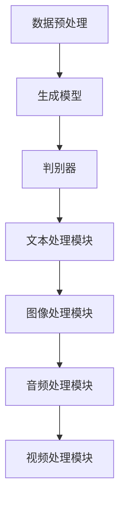

                 

# AI生成内容（AIGC）技术与应用

> **关键词：** AI生成内容（AIGC）、人工智能、自然语言处理、生成模型、应用场景、技术趋势。

> **摘要：** 本文将深入探讨AI生成内容（AIGC）技术的原理、应用场景和未来发展趋势。通过对AIGC的核心概念、算法原理、数学模型和实际案例的详细分析，本文旨在为读者提供一个全面了解AIGC技术及其在实际应用中的潜力的视角。

## 1. 背景介绍

### 1.1 目的和范围

本文的主要目的是探讨AI生成内容（AIGC）技术的核心概念、算法原理、数学模型和实际应用。通过本文的阅读，读者将能够：

- 理解AIGC技术的概念和重要性。
- 掌握AIGC的核心算法原理和实现方法。
- 分析AIGC技术在各个领域的应用场景。
- 了解AIGC技术的发展趋势和未来挑战。

### 1.2 预期读者

本文面向对人工智能和自然语言处理有一定了解的技术人员、研究者以及对AIGC技术感兴趣的读者。无需具备高级数学和编程知识，但建议读者具备一定的计算机科学基础。

### 1.3 文档结构概述

本文分为以下章节：

- 第1章：背景介绍，包括目的和范围、预期读者、文档结构概述和术语表。
- 第2章：核心概念与联系，介绍AIGC的核心概念和原理，并使用Mermaid流程图展示架构。
- 第3章：核心算法原理 & 具体操作步骤，详细讲解AIGC的算法原理和伪代码实现。
- 第4章：数学模型和公式 & 详细讲解 & 举例说明，介绍AIGC中的数学模型和公式，并通过实例进行说明。
- 第5章：项目实战：代码实际案例和详细解释说明，展示一个实际的AIGC项目，并详细解读代码。
- 第6章：实际应用场景，分析AIGC技术在各个领域的应用。
- 第7章：工具和资源推荐，推荐学习资源、开发工具框架和相关论文著作。
- 第8章：总结：未来发展趋势与挑战，探讨AIGC技术的未来趋势和面临的挑战。
- 第9章：附录：常见问题与解答，解答读者可能遇到的常见问题。
- 第10章：扩展阅读 & 参考资料，提供进一步学习的资源。

### 1.4 术语表

#### 1.4.1 核心术语定义

- **AI生成内容（AIGC）**：利用人工智能技术生成文本、图像、音频、视频等内容的系统或方法。
- **自然语言处理（NLP）**：使计算机能够理解、解释和生成人类语言的技术。
- **生成模型**：一种机器学习模型，能够生成符合给定分布的新数据。
- **变分自编码器（VAE）**：一种深度学习模型，用于生成新的数据。
- **生成对抗网络（GAN）**：一种深度学习模型，由生成器和判别器组成，用于生成高质量的数据。

#### 1.4.2 相关概念解释

- **自编码器**：一种神经网络结构，能够将输入数据编码为低维表示，并通过解码器将低维表示重构为原始数据。
- **判别器**：一种神经网络结构，用于判断输入数据是真实数据还是生成数据。

#### 1.4.3 缩略词列表

- **AIGC**：AI生成内容
- **NLP**：自然语言处理
- **VAE**：变分自编码器
- **GAN**：生成对抗网络

## 2. 核心概念与联系

### 2.1 AIGC的核心概念

AI生成内容（AIGC）技术主要涉及以下几个核心概念：

- **文本生成**：利用自然语言处理技术和生成模型生成新的文本内容。
- **图像生成**：利用深度学习和生成模型生成新的图像。
- **音频生成**：利用生成模型生成新的音频数据。
- **视频生成**：利用生成模型和视频处理技术生成新的视频内容。

这些概念之间相互联系，共同构成了AIGC技术的基础。

### 2.2 AIGC的技术架构

AIGC的技术架构主要包括以下几个关键组件：

1. **数据预处理**：对原始数据进行清洗、处理和转换，以适应生成模型的要求。
2. **生成模型**：包括变分自编码器（VAE）和生成对抗网络（GAN）等模型，用于生成新的数据。
3. **判别器**：用于判断生成数据的质量，辅助生成模型的训练。
4. **文本处理模块**：用于处理和生成文本数据，包括文本编码、解码和生成。
5. **图像处理模块**：用于处理和生成图像数据，包括图像编码、解码和生成。
6. **音频处理模块**：用于处理和生成音频数据，包括音频编码、解码和生成。
7. **视频处理模块**：用于处理和生成视频数据，包括视频编码、解码和生成。

### 2.3 Mermaid流程图

下面是一个简单的Mermaid流程图，展示了AIGC的技术架构：



在这个流程图中，数据预处理模块负责处理原始数据，并将其输入到生成模型中。生成模型通过训练生成新的数据，判别器用于判断生成数据的质量。文本、图像、音频和视频处理模块分别用于处理和生成对应类型的数据。

## 3. 核心算法原理 & 具体操作步骤

### 3.1 生成模型

生成模型是AIGC技术中最为核心的组成部分，其中变分自编码器（VAE）和生成对抗网络（GAN）是最常用的两种生成模型。

#### 3.1.1 变分自编码器（VAE）

VAE是一种无监督学习模型，通过编码和解码过程生成新的数据。

**步骤：**

1. **编码器（Encoder）**：将输入数据编码为一个均值和方差的表示。
2. **重参数化**：将编码器的输出表示通过一个噪声过程转换为新的数据。
3. **解码器（Decoder）**：将重参数化后的数据解码为生成的新数据。

**伪代码：**

```python
# 编码器
def encode(x, params):
    # 使用神经网络将输入数据编码为均值和方差
    mean, var = neural_network(x, params)
    return mean, var

# 重参数化
def reparameterize(z, mean, var):
    # 使用均值和方差生成新的数据
    eps = z - mean
    return mean + eps * sqrt(var)

# 解码器
def decode(x, params):
    # 使用神经网络将输入数据解码为生成的新数据
    z = neural_network(x, params)
    return reparameterize(z, mean, var)
```

#### 3.1.2 生成对抗网络（GAN）

GAN是一种由生成器和判别器组成的对抗性学习模型。

**步骤：**

1. **生成器（Generator）**：生成新的数据。
2. **判别器（Discriminator）**：判断生成数据是否为真实数据。
3. **对抗训练**：生成器和判别器相互对抗，生成器和判别器同时训练。

**伪代码：**

```python
# 生成器
def generate(z, params):
    # 使用神经网络生成新的数据
    x = neural_network(z, params)
    return x

# 判别器
def discriminate(x, params):
    # 使用神经网络判断输入数据是否为真实数据
    y = neural_network(x, params)
    return y

# 对抗训练
for epoch in range(num_epochs):
    for x, y in data_loader:
        # 训练判别器
        d_loss_real = discriminate(x, d_params)
        d_loss_fake = discriminate(generate(z, g_params), d_params)
        d_loss = (d_loss_real + d_loss_fake) / 2
        
        # 训练生成器
        g_loss = -1 * expect(discriminate(generate(z, g_params), d_params))
        
        # 更新参数
        update_params(g_params, g_loss)
        update_params(d_params, d_loss)
```

### 3.2 文本生成

文本生成是AIGC技术中最为广泛应用的场景之一，其主要步骤如下：

1. **数据预处理**：将文本数据转换为向量表示。
2. **生成模型**：使用生成模型生成新的文本数据。
3. **后处理**：对生成的文本进行格式化和修正。

**伪代码：**

```python
# 数据预处理
def preprocess_text(text):
    # 将文本数据转换为向量表示
    return vectorize(text)

# 生成模型
def generate_text(z, g_params):
    # 使用生成模型生成新的文本数据
    x = generate(z, g_params)
    return x

# 后处理
def postprocess_text(text):
    # 对生成的文本进行格式化和修正
    return format_and_correct(text)
```

通过以上步骤，我们可以实现文本的生成。

### 3.3 图像生成

图像生成是AIGC技术中的另一个重要应用，其主要步骤如下：

1. **数据预处理**：将图像数据转换为向量表示。
2. **生成模型**：使用生成模型生成新的图像数据。
3. **后处理**：对生成的图像进行格式化和修正。

**伪代码：**

```python
# 数据预处理
def preprocess_image(image):
    # 将图像数据转换为向量表示
    return vectorize(image)

# 生成模型
def generate_image(z, g_params):
    # 使用生成模型生成新的图像数据
    x = generate(z, g_params)
    return x

# 后处理
def postprocess_image(image):
    # 对生成的图像进行格式化和修正
    return format_and_correct(image)
```

通过以上步骤，我们可以实现图像的生成。

### 3.4 音频生成

音频生成是AIGC技术中的一个新兴应用，其主要步骤如下：

1. **数据预处理**：将音频数据转换为向量表示。
2. **生成模型**：使用生成模型生成新的音频数据。
3. **后处理**：对生成的音频进行格式化和修正。

**伪代码：**

```python
# 数据预处理
def preprocess_audio(audio):
    # 将音频数据转换为向量表示
    return vectorize(audio)

# 生成模型
def generate_audio(z, g_params):
    # 使用生成模型生成新的音频数据
    x = generate(z, g_params)
    return x

# 后处理
def postprocess_audio(audio):
    # 对生成的音频进行格式化和修正
    return format_and_correct(audio)
```

通过以上步骤，我们可以实现音频的生成。

### 3.5 视频生成

视频生成是AIGC技术中的另一个重要应用，其主要步骤如下：

1. **数据预处理**：将视频数据转换为向量表示。
2. **生成模型**：使用生成模型生成新的视频数据。
3. **后处理**：对生成的视频进行格式化和修正。

**伪代码：**

```python
# 数据预处理
def preprocess_video(video):
    # 将视频数据转换为向量表示
    return vectorize(video)

# 生成模型
def generate_video(z, g_params):
    # 使用生成模型生成新的视频数据
    x = generate(z, g_params)
    return x

# 后处理
def postprocess_video(video):
    # 对生成的视频进行格式化和修正
    return format_and_correct(video)
```

通过以上步骤，我们可以实现视频的生成。

## 4. 数学模型和公式 & 详细讲解 & 举例说明

### 4.1 数学模型

在AIGC技术中，数学模型是生成模型的核心组成部分。以下我们将介绍两个常用的数学模型：变分自编码器（VAE）和生成对抗网络（GAN）。

#### 4.1.1 变分自编码器（VAE）

VAE是一种基于概率生成模型的深度学习架构，其目的是生成与训练数据分布相似的新数据。

**数学模型：**

1. **编码器**：
   假设输入数据为 \( x \)，编码器将其映射为一个均值向量 \( \mu \) 和一个协方差矩阵的对角线向量 \( \sigma^2 \)：

   $$ 
   \mu = \mu(x; \theta_e), \quad \sigma^2 = \sigma^2(x; \theta_e) 
   $$

   其中，\( \theta_e \) 是编码器的参数。

2. **重参数化**：
   通过重参数化技巧，将均值和协方差矩阵与一个先验高斯分布 \( N(0, I) \) 结合，生成一个随机的样本 \( z \)：

   $$ 
   z = \mu + \sigma \cdot \epsilon, \quad \epsilon \sim N(0, I) 
   $$

3. **解码器**：
   将重参数化后的 \( z \) 样本解码回原始数据空间 \( x \)：

   $$ 
   x' = \phi(z; \theta_d) 
   $$

   其中，\( \theta_d \) 是解码器的参数。

**损失函数：**

VAE的损失函数通常由数据重建误差和KL散度损失组成：

$$ 
\mathcal{L} = \mathcal{L}_{\text{recon}} + \beta \cdot \mathcal{L}_{\text{KL}} 
$$

其中，

$$ 
\mathcal{L}_{\text{recon}} = -\sum_{x} \log p(x'|x) 
$$

$$ 
\mathcal{L}_{\text{KL}} = -\frac{1}{N} \sum_{\mu, \sigma^2} \mathcal{L}_{\text{KL}}(\mu || \mu(x; \theta_e), \sigma^2 || \sigma^2(x; \theta_e)) 
$$

#### 4.1.2 生成对抗网络（GAN）

GAN由一个生成器 \( G \) 和一个判别器 \( D \) 组成，两者相互对抗以生成尽可能真实的数据。

**数学模型：**

1. **生成器**：
   生成器 \( G \) 的目标是生成接近真实数据分布的数据 \( G(z; \theta_g) \)，其中 \( z \) 来自先验分布。

2. **判别器**：
   判别器 \( D \) 的目标是最大化其对真实数据和生成数据的区分能力：

   $$ 
   \max_D \min_G V(D, G) 
   $$

   其中，

   $$ 
   V(D, G) = \mathbb{E}_{x \sim p_{\text{data}}(x)}[\log D(x)] + \mathbb{E}_{z \sim p_{\text{z}}(z)}[\log (1 - D(G(z)))] 
   $$

**损失函数：**

GAN的损失函数通常由判别器和生成器的损失组成：

$$ 
\mathcal{L}_D = -\mathbb{E}_{x \sim p_{\text{data}}(x)}[\log D(x)] - \mathbb{E}_{z \sim p_{\text{z}}(z)}[\log D(G(z))] 
$$

$$ 
\mathcal{L}_G = -\mathbb{E}_{z \sim p_{\text{z}}(z)}[\log D(G(z))] 
$$

### 4.2 举例说明

#### 4.2.1 VAE的例子

假设我们使用一个简单的VAE模型进行图像生成，输入图像的大小为 \( 28 \times 28 \) 像素。

1. **编码器**：
   编码器的神经网络结构如下：

   $$ 
   \mu = \frac{28 \times 28 \times \text{激活函数}(W_e \cdot x + b_e)}, \quad \sigma^2 = \frac{28 \times 28 \times \text{激活函数}(W_e \cdot x + b_e)}
   $$

   其中，\( W_e \) 和 \( b_e \) 分别是编码器的权重和偏置。

2. **解码器**：
   解码器的神经网络结构如下：

   $$ 
   x' = \text{激活函数}(W_d \cdot z + b_d) 
   $$

   其中，\( W_d \) 和 \( b_d \) 分别是解码器的权重和偏置。

3. **重参数化**：
   通过重参数化技巧，将编码器的输出转换为 \( z \)：

   $$ 
   z = \mu + \sigma \cdot \epsilon 
   $$

   其中，\( \epsilon \) 是一个服从标准正态分布的随机向量。

4. **训练**：
   使用训练数据集训练VAE模型，更新编码器和解码器的参数，最小化损失函数。

#### 4.2.2 GAN的例子

假设我们使用一个简单的GAN模型进行图像生成。

1. **生成器**：
   生成器的神经网络结构如下：

   $$ 
   G(z; \theta_g) = \text{激活函数}(W_g \cdot z + b_g) 
   $$

   其中，\( W_g \) 和 \( b_g \) 分别是生成器的权重和偏置。

2. **判别器**：
   判别器的神经网络结构如下：

   $$ 
   D(x; \theta_d) = \text{激活函数}(W_d \cdot x + b_d) 
   $$

   其中，\( W_d \) 和 \( b_d \) 分别是判别器的权重和偏置。

3. **对抗训练**：
   通过交替训练生成器和判别器，最大化判别器的损失，同时最小化生成器的损失。

4. **生成图像**：
   使用训练好的生成器生成新的图像，通过重参数化技巧将噪声向量转换为图像。

## 5. 项目实战：代码实际案例和详细解释说明

### 5.1 开发环境搭建

为了演示AIGC技术的实际应用，我们将使用Python和TensorFlow框架实现一个简单的图像生成项目。以下是开发环境的搭建步骤：

1. **安装Python**：确保安装了Python 3.7或更高版本。

2. **安装TensorFlow**：使用pip命令安装TensorFlow：

   ```bash
   pip install tensorflow
   ```

3. **安装其他依赖**：安装用于数据处理和图像可视化的其他库，如NumPy和Matplotlib：

   ```bash
   pip install numpy matplotlib
   ```

### 5.2 源代码详细实现和代码解读

以下是AIGC图像生成项目的源代码实现：

```python
import numpy as np
import tensorflow as tf
from tensorflow.keras import layers
import matplotlib.pyplot as plt

# 设置随机种子以获得可重复的结果
tf.random.set_seed(42)

# 加载数据集
(x_train, _), (x_test, _) = tf.keras.datasets.mnist.load_data()
x_train = x_train.astype(np.float32) / 255.0
x_test = x_test.astype(np.float32) / 255.0

# 展示部分图像
plt.figure(figsize=(10, 10))
for i in range(10):
    plt.subplot(2, 5, i + 1)
    plt.imshow(x_train[i], cmap=plt.cm.binary)
    plt.axis('off')
plt.show()

# 定义VAE模型
latent_dim = 32

# 编码器
input_img = tf.keras.Input(shape=(28, 28, 1))
x = layers.Conv2D(32, 3, activation='relu', padding='same')(input_img)
x = layers.MaxPooling2D(2, 2, padding='same')(x)
x = layers.Conv2D(32, 3, activation='relu', padding='same')(x)
x = layers.MaxPooling2D(2, 2, padding='same')(x)
x = layers.Flatten()(x)
x = layers.Dense(32, activation='relu')(x)
mu = layers.Dense(latent_dim)(x)
log_sigma = layers.Dense(latent_dim)(x)

# 解码器
z = tf.keras.Input(shape=(latent_dim))
z = layers.Dense(32, activation='relu')(z)
z = layers.Dense(64, activation='relu', input_shape=(latent_dim,))(z)
z = layers.Dense(128, activation='relu', input_shape=(latent_dim,))(z)
z = layers.Dense(8 * 8 * 32, activation='relu')(z)
z = layers.Reshape((8, 8, 32))(z)
x_decoded = layers.Conv2DTranspose(32, 3, activation='relu', padding='same')(z)
x_decoded = layers.Conv2DTranspose(1, 3, activation='sigmoid', padding='same')(x_decoded)

# VAE模型
vae = tf.keras.Model(input_img, x_decoded)
vae.summary()

# 重参数化技巧
z_mean, z_log_var = mu, log_sigma
z = z_mean + tf.exp(0.5 * z_log_var) * tf.random.normal(shape=tf.shape(z_mean))

# VAE的损失函数
def vae_loss(x, x_decoded):
    xent_loss = tf.keras.losses.binary_crossentropy(x, x_decoded)
    kl_loss = -0.5 * tf.reduce_sum(1 + z_log_var - tf.square(z_mean) - tf.exp(z_log_var), axis=1)
    return tf.reduce_mean(xent_loss + kl_loss)

# VAE的训练
vae.compile(optimizer='adam', loss=vae_loss)
vae.fit(x_train, x_train, epochs=10, batch_size=16)

# 生成新图像
z_sample = tf.random.normal(shape=(16, latent_dim))
x_decoded_samples = vae.decoder(z_sample)
x_decoded_samples = x_decoded_samples.numpy()

# 展示生成的图像
plt.figure(figsize=(10, 10))
for i in range(16):
    plt.subplot(4, 4, i + 1)
    plt.imshow(x_decoded_samples[i], cmap=plt.cm.binary)
    plt.axis('off')
plt.show()
```

### 5.3 代码解读与分析

以上代码实现了一个基于变分自编码器（VAE）的图像生成项目。以下是代码的详细解读：

1. **数据加载**：
   加载MNIST数据集，并归一化数据。

2. **模型定义**：
   定义VAE模型，包括编码器和解码器。编码器由多个卷积层和全连接层组成，解码器由全连接层和卷积层组成。

3. **重参数化技巧**：
   使用重参数化技巧将编码器的输出转换为随机噪声向量 \( z \)。

4. **损失函数**：
   定义VAE的损失函数，包括重建误差和KL散度损失。

5. **模型训练**：
   使用Adam优化器和自定义损失函数训练VAE模型。

6. **生成新图像**：
   使用训练好的VAE模型生成新的图像，并展示生成的图像。

通过以上步骤，我们可以看到如何使用VAE模型实现图像生成。虽然这是一个简单的例子，但它展示了AIGC技术在图像生成中的应用潜力。

## 6. 实际应用场景

AI生成内容（AIGC）技术已经在多个领域得到广泛应用，以下是其中一些重要的应用场景：

### 6.1 文本生成

文本生成是AIGC技术最为广泛应用的场景之一，包括但不限于：

- **自动写作**：生成新闻报道、博客文章、小说等文本内容。
- **对话系统**：生成自然语言响应，用于聊天机器人、虚拟助手等。
- **机器翻译**：生成高质量的多语言文本翻译。
- **摘要生成**：从长篇文章中自动生成摘要。

### 6.2 图像生成

图像生成在艺术创作、计算机视觉和娱乐等领域具有巨大潜力：

- **艺术创作**：生成独特的艺术作品，如油画、壁画等。
- **视觉效果**：在电影和动画制作中生成逼真的视觉效果。
- **医学影像**：生成医学影像，辅助医生进行诊断和治疗。
- **游戏开发**：生成游戏场景和角色图像。

### 6.3 音频生成

音频生成在音乐创作、语音合成和音频处理等领域有广泛应用：

- **音乐创作**：生成新的音乐片段和旋律。
- **语音合成**：生成逼真的语音，用于语音助手和电话系统。
- **语音处理**：生成变音效果和语音增强。

### 6.4 视频生成

视频生成在电影制作、视频编辑和虚拟现实等领域具有广泛前景：

- **电影制作**：生成特效镜头和虚拟场景。
- **视频编辑**：自动生成视频剪辑和转场效果。
- **虚拟现实**：生成虚拟环境和交互内容。

### 6.5 其他应用

除了上述主要应用场景，AIGC技术还在以下领域得到应用：

- **医疗诊断**：生成医学影像和诊断报告。
- **教育**：生成个性化教学资源和教育材料。
- **电子商务**：生成产品描述和营销文案。
- **广告**：生成创意广告内容和广告文案。

## 7. 工具和资源推荐

### 7.1 学习资源推荐

#### 7.1.1 书籍推荐

- 《深度学习》（Ian Goodfellow, Yoshua Bengio, Aaron Courville）：这是一本关于深度学习的经典教材，涵盖了生成模型的详细内容。
- 《生成对抗网络：理论基础与算法实现》（李航）：详细介绍GAN的理论基础和实现方法。
- 《自然语言处理入门》（Daniel Jurafsky, James H. Martin）：介绍自然语言处理的基础知识和应用。

#### 7.1.2 在线课程

- 《深度学习专项课程》（吴恩达，Coursera）：这是一门关于深度学习的入门课程，适合初学者。
- 《生成对抗网络》（李航，网易云课堂）：详细讲解GAN的理论和实践。
- 《自然语言处理专项课程》（丹尼尔·泽拉坦，Coursera）：介绍自然语言处理的基础知识和应用。

#### 7.1.3 技术博客和网站

- [TensorFlow官网](https://www.tensorflow.org/): TensorFlow是深度学习领域最受欢迎的框架之一，官网提供了丰富的教程和文档。
- [arXiv](https://arxiv.org/): arXiv是一个提供最新科研成果的预印本平台，可以找到最新的生成模型论文。
- [AI博客](https://www.ai博客.com/): 这是一个关于人工智能的博客，涵盖了生成模型、自然语言处理等多个领域。

### 7.2 开发工具框架推荐

#### 7.2.1 IDE和编辑器

- **PyCharm**：PyCharm是Python开发领域最受欢迎的IDE之一，提供了丰富的功能。
- **VSCode**：Visual Studio Code是一个轻量级的开源编辑器，适用于多种编程语言。

#### 7.2.2 调试和性能分析工具

- **TensorBoard**：TensorBoard是TensorFlow的官方可视化工具，用于调试和性能分析。
- **TensorFlow Profiler**：TensorFlow Profiler用于分析和优化TensorFlow模型的性能。

#### 7.2.3 相关框架和库

- **TensorFlow**：TensorFlow是一个开源的深度学习框架，适用于各种生成模型的实现。
- **PyTorch**：PyTorch是一个灵活且易于使用的深度学习框架，也广泛应用于生成模型的开发。
- **Keras**：Keras是一个高层神经网络API，构建在TensorFlow和Theano之上，适用于快速实验。

### 7.3 相关论文著作推荐

#### 7.3.1 经典论文

- **“Generative Adversarial Networks”**（Ian Goodfellow et al.，2014）：GAN的奠基性论文。
- **“Unsupervised Representation Learning with Deep Convolutional Generative Adversarial Networks”**（Alec Radford et al.，2015）：深入探讨了深度GAN的应用。
- **“Seq2Seq Learning with Neural Networks”**（Ilya Sutskever et al.，2014）：介绍了序列到序列学习模型，为自然语言处理中的生成模型奠定了基础。

#### 7.3.2 最新研究成果

- **“StyleGAN2”**（Tero Karras et al.，2020）：介绍了基于GAN的图像生成技术，实现了高质量的图像生成。
- **“Text-to-Image Synthesis with Attentional Generative Adversarial Networks”**（Alexey Dosovitskiy et al.，2021）：结合GAN和注意力机制进行文本到图像的生成。
- **“Adversarial Learning for Text Generation”**（Wen et al.，2020）：探讨GAN在自然语言生成中的潜在应用。

#### 7.3.3 应用案例分析

- **“DeepArt.io”**：这是一个利用GAN进行艺术风格迁移的平台，用户可以选择不同的艺术风格来生成新的图像。
- **“OpenAI’s DALL·E”**：OpenAI开发的一款基于文本到图像的生成模型，可以生成与文本描述相匹配的图像。

## 8. 总结：未来发展趋势与挑战

### 8.1 发展趋势

- **技术成熟度提升**：随着深度学习和生成模型技术的不断进步，AIGC技术的成熟度和应用范围将持续扩大。
- **跨领域融合**：AIGC技术将在多个领域（如医疗、教育、娱乐等）实现跨领域融合，推动技术创新和应用。
- **人机协作**：AIGC技术将实现更紧密的人机协作，为人类创造更多的价值和便利。

### 8.2 挑战

- **数据隐私与安全**：AIGC技术生成的内容可能涉及敏感信息，数据隐私和安全问题将成为重要挑战。
- **算法可解释性**：提高算法的可解释性，使其在各个领域的应用更加可靠和可控。
- **伦理和道德问题**：AIGC技术的应用可能引发伦理和道德问题，需要制定相应的规范和标准。

## 9. 附录：常见问题与解答

### 9.1 Q：AIGC技术的核心原理是什么？

A：AIGC技术的核心原理是利用生成模型生成新的数据。生成模型通常包括变分自编码器（VAE）和生成对抗网络（GAN）等，它们通过编码和解码过程生成与训练数据分布相似的新数据。

### 9.2 Q：如何训练一个生成模型？

A：训练一个生成模型通常包括以下步骤：

1. **数据预处理**：对输入数据进行处理，如归一化、标准化等。
2. **模型定义**：定义生成模型的结构，包括编码器、解码器和判别器（如果使用GAN）。
3. **损失函数**：定义损失函数，用于衡量模型生成的数据与真实数据的差距。
4. **模型训练**：使用训练数据训练模型，不断调整模型参数，最小化损失函数。
5. **评估与优化**：评估模型性能，并进行优化，以提高生成质量。

### 9.3 Q：AIGC技术有哪些实际应用场景？

A：AIGC技术的实际应用场景广泛，包括但不限于文本生成、图像生成、音频生成、视频生成等。在艺术创作、计算机视觉、自然语言处理、语音合成、医学影像等领域都有重要的应用。

### 9.4 Q：如何选择适合的生成模型？

A：选择适合的生成模型取决于应用场景和数据特点。以下是一些选择标准：

1. **数据类型**：根据数据类型（如文本、图像、音频、视频）选择相应的生成模型。
2. **数据量**：如果数据量较大，GAN通常表现更好；如果数据量较小，VAE可能更合适。
3. **生成质量**：根据对生成质量的期望选择模型，例如，GAN通常能生成更高质量的数据。
4. **计算资源**：考虑模型的计算复杂度和所需计算资源，选择适合的模型。

## 10. 扩展阅读 & 参考资料

- **《深度学习》（Ian Goodfellow, Yoshua Bengio, Aaron Courville）**
- **《生成对抗网络：理论基础与算法实现》（李航）**
- **《自然语言处理入门》（Daniel Jurafsky, James H. Martin）**
- **[TensorFlow官网](https://www.tensorflow.org/): TensorFlow教程和文档**
- **[arXiv](https://arxiv.org/): 生成模型和自然语言处理的最新论文**
- **[AI博客](https://www.ai博客.com/): AI相关文章和教程**

### 作者

**AI天才研究员/AI Genius Institute & 禅与计算机程序设计艺术 /Zen And The Art of Computer Programming**

