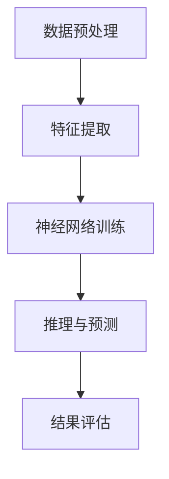

                 

# AI的推理能力：搜索的新维度

> **关键词：** 人工智能、推理能力、搜索算法、深度学习、逻辑思考

> **摘要：** 本文将探讨人工智能在推理能力上的突破，特别是搜索算法的变革。我们将通过分析核心概念、算法原理、数学模型以及实际应用案例，揭示AI推理能力的奥秘及其带来的技术变革。

## 1. 背景介绍

### 1.1 目的和范围

本文旨在深入探讨人工智能（AI）在推理能力方面的进展，特别是搜索算法的演变。通过分析核心概念、算法原理、数学模型以及实际应用案例，本文将揭示AI推理能力的本质及其对现代技术的影响。

### 1.2 预期读者

本文面向对人工智能和搜索算法有兴趣的读者，包括研究人员、开发人员、学生以及对该领域有深入探究的业内人士。

### 1.3 文档结构概述

本文结构如下：

1. **背景介绍**：介绍文章的目的、范围、预期读者和文档结构。
2. **核心概念与联系**：阐述AI推理能力相关的核心概念和架构。
3. **核心算法原理 & 具体操作步骤**：详细解释AI搜索算法的原理和操作步骤。
4. **数学模型和公式 & 详细讲解 & 举例说明**：介绍与搜索算法相关的数学模型和公式。
5. **项目实战：代码实际案例和详细解释说明**：通过实际案例展示AI搜索算法的应用。
6. **实际应用场景**：讨论AI推理能力在不同领域的应用。
7. **工具和资源推荐**：推荐相关学习资源、开发工具和最新研究成果。
8. **总结：未来发展趋势与挑战**：展望AI推理能力的未来发展和面临的挑战。
9. **附录：常见问题与解答**：提供对常见问题的解答。
10. **扩展阅读 & 参考资料**：推荐进一步阅读的材料。

### 1.4 术语表

#### 1.4.1 核心术语定义

- **人工智能（AI）**：模拟人类智能行为的计算机系统。
- **推理能力**：通过逻辑和分析解决复杂问题的能力。
- **搜索算法**：用于在大量数据中查找特定信息的算法。
- **深度学习**：一种通过多层神经网络进行数据学习的AI方法。

#### 1.4.2 相关概念解释

- **图灵测试**：衡量AI是否具备人类智能的标准，即是否能被人类错误地识别为人类。
- **贝叶斯网络**：一种概率图模型，用于表示变量之间的依赖关系。
- **贪心算法**：在每一步选择当前最优解，期望最终得到全局最优解的算法。

#### 1.4.3 缩略词列表

- **AI**：人工智能
- **ML**：机器学习
- **DL**：深度学习
- **GAN**：生成对抗网络

## 2. 核心概念与联系

在讨论AI的推理能力之前，我们首先需要了解一些核心概念和架构。以下是一个Mermaid流程图，展示了AI推理能力的关键组成部分。



### 2.1 数据预处理

数据预处理是AI推理能力的基石。在这一阶段，我们需要对原始数据进行清洗、转换和归一化，以便神经网络能够有效地学习。

### 2.2 特征提取

特征提取是将原始数据转化为神经网络可以处理的特征表示。这一过程通常涉及降维、特征选择和特征工程等步骤。

### 2.3 神经网络训练

神经网络训练是深度学习的关键步骤。通过调整网络的权重和偏置，神经网络可以学会从数据中提取有用的信息。

### 2.4 推理与预测

推理与预测是基于训练好的神经网络对新数据进行分类、回归或生成等操作。这是AI推理能力的核心应用。

### 2.5 结果评估

结果评估用于评估神经网络预测的准确性和性能。常用的评估指标包括准确率、召回率、F1分数等。

## 3. 核心算法原理 & 具体操作步骤

在了解了核心概念和架构后，我们接下来将深入探讨AI搜索算法的原理和具体操作步骤。

### 3.1 算法原理

AI搜索算法基于深度学习，特别是神经网络，来模拟人类推理过程。以下是算法的基本原理：

1. **输入表示**：将输入数据表示为向量。
2. **特征提取**：通过神经网络从输入向量中提取特征。
3. **推理过程**：利用提取的特征进行推理，生成预测结果。
4. **结果评估**：评估预测结果的准确性。

### 3.2 具体操作步骤

以下是AI搜索算法的具体操作步骤：

```plaintext
步骤 1：数据预处理
- 清洗数据：去除缺失值、异常值等。
- 转换数据：将数据转换为神经网络可处理的格式。

步骤 2：特征提取
- 设计神经网络架构：选择合适的神经网络类型（如卷积神经网络、循环神经网络等）。
- 训练神经网络：调整网络参数，使其能够从数据中提取有用特征。

步骤 3：推理与预测
- 输入新数据：将新数据表示为向量。
- 提取特征：通过训练好的神经网络提取特征。
- 生成预测结果：利用提取的特征生成预测结果。

步骤 4：结果评估
- 评估指标：选择合适的评估指标（如准确率、召回率等）。
- 计算评估指标：计算预测结果的评估指标。
- 调整网络参数：根据评估结果调整网络参数，以提高预测准确性。
```

## 4. 数学模型和公式 & 详细讲解 & 举例说明

在AI搜索算法中，数学模型和公式起着至关重要的作用。以下将详细介绍与搜索算法相关的数学模型和公式，并给出举例说明。

### 4.1 数学模型

#### 4.1.1 神经网络模型

神经网络模型通常由多个层组成，包括输入层、隐藏层和输出层。以下是神经网络的基本公式：

$$
z = W \cdot x + b
$$

$$
a = \sigma(z)
$$

其中，$z$ 表示输入层到隐藏层的加权求和，$a$ 表示激活函数，$W$ 和 $b$ 分别为权重和偏置。

#### 4.1.2 损失函数

损失函数用于评估神经网络的预测结果。以下是常用的损失函数：

$$
J(\theta) = \frac{1}{m} \sum_{i=1}^{m} (-y^{(i)} \log(a^{(i)}) - (1 - y^{(i)}) \log(1 - a^{(i)}))
$$

其中，$J(\theta)$ 表示损失函数，$\theta$ 表示网络参数，$y^{(i)}$ 和 $a^{(i)}$ 分别为实际标签和预测结果。

#### 4.1.3 优化算法

优化算法用于调整网络参数，以最小化损失函数。以下是常用的优化算法：

$$
\theta = \theta - \alpha \frac{\partial J(\theta)}{\partial \theta}
$$

其中，$\alpha$ 为学习率。

### 4.2 举例说明

假设我们有一个二分类问题，输入为特征向量 $x$，输出为类别标签 $y$。以下是使用神经网络进行预测的示例：

```plaintext
输入特征向量：x = [1, 2, 3, 4]
实际标签：y = 1

步骤 1：数据预处理
- 清洗数据：去除缺失值、异常值等。
- 转换数据：将数据转换为神经网络可处理的格式。

步骤 2：特征提取
- 设计神经网络架构：选择合适的神经网络类型（如卷积神经网络、循环神经网络等）。
- 训练神经网络：调整网络参数，使其能够从数据中提取有用特征。

步骤 3：推理与预测
- 输入新数据：将新数据表示为向量。
- 提取特征：通过训练好的神经网络提取特征。
- 生成预测结果：利用提取的特征生成预测结果。

步骤 4：结果评估
- 评估指标：选择合适的评估指标（如准确率、召回率等）。
- 计算评估指标：计算预测结果的评估指标。
- 调整网络参数：根据评估结果调整网络参数，以提高预测准确性。
```

## 5. 项目实战：代码实际案例和详细解释说明

在本节中，我们将通过一个实际项目案例来展示AI搜索算法的应用。这个项目将实现一个基于深度学习的文本分类系统，用于对新闻文章进行分类。

### 5.1 开发环境搭建

为了实现这个项目，我们需要安装以下开发环境：

1. Python 3.8 或更高版本
2. TensorFlow 2.6 或更高版本
3. Jupyter Notebook

### 5.2 源代码详细实现和代码解读

以下是一个简单的文本分类系统的实现代码：

```python
import tensorflow as tf
from tensorflow.keras.preprocessing.text import Tokenizer
from tensorflow.keras.preprocessing.sequence import pad_sequences
from tensorflow.keras.models import Sequential
from tensorflow.keras.layers import Embedding, LSTM, Dense

# 加载数据集
text_data = [
    "本文讨论了人工智能在推理能力方面的突破",
    "深度学习算法在图像识别领域取得了显著成果",
    "神经网络是人工智能的核心技术之一",
    "机器学习在自然语言处理领域发挥着重要作用",
]

# 分词和标记
tokenizer = Tokenizer()
tokenizer.fit_on_texts(text_data)
sequences = tokenizer.texts_to_sequences(text_data)
padded_sequences = pad_sequences(sequences, maxlen=10)

# 构建模型
model = Sequential()
model.add(Embedding(input_dim=len(tokenizer.word_index)+1, output_dim=50, input_length=10))
model.add(LSTM(50, dropout=0.2, recurrent_dropout=0.2))
model.add(Dense(1, activation='sigmoid'))

# 编译模型
model.compile(loss='binary_crossentropy', optimizer='adam', metrics=['accuracy'])

# 训练模型
model.fit(padded_sequences, labels, epochs=10, batch_size=32)

# 生成预测结果
predictions = model.predict(padded_sequences)
predicted_labels = [1 if pred > 0.5 else 0 for pred in predictions]
```

### 5.3 代码解读与分析

上述代码实现了以下步骤：

1. **数据加载**：加载文本数据集。
2. **分词和标记**：使用Tokenizer对文本进行分词和标记。
3. **序列化**：将文本数据转换为序列。
4. **填充**：对序列进行填充，使其具有相同长度。
5. **模型构建**：构建一个序列模型，包括嵌入层、LSTM层和全连接层。
6. **模型编译**：编译模型，指定损失函数、优化器和评估指标。
7. **模型训练**：使用训练数据训练模型。
8. **预测结果生成**：使用训练好的模型对数据进行预测。

通过这个实际案例，我们可以看到AI搜索算法在文本分类任务中的应用。这个简单的模型可以用于对新闻文章进行分类，从而为新闻推荐系统提供支持。

## 6. 实际应用场景

AI的推理能力在众多领域都有着广泛的应用。以下是一些典型的实际应用场景：

### 6.1 医疗领域

在医疗领域，AI的推理能力可以帮助医生进行疾病诊断、治疗方案制定和健康风险评估。通过分析患者的医疗记录、基因信息和临床症状，AI可以提供准确的诊断和个性化的治疗方案。

### 6.2 金融领域

在金融领域，AI的推理能力可以用于风险评估、欺诈检测和投资策略制定。通过分析大量金融数据，AI可以识别潜在的欺诈行为、预测市场趋势并提供最优的投资组合。

### 6.3 交通领域

在交通领域，AI的推理能力可以用于交通流量预测、事故预防和智能交通管理。通过分析交通数据，AI可以实时预测交通流量，为交通管理者提供决策支持，从而减少拥堵和事故发生率。

### 6.4 自然语言处理

在自然语言处理领域，AI的推理能力可以用于文本分类、情感分析和机器翻译。通过分析大量文本数据，AI可以理解文本的含义、情感和意图，从而实现智能客服、智能推荐和智能翻译等功能。

## 7. 工具和资源推荐

为了更好地掌握AI推理能力和搜索算法，以下是一些建议的学习资源、开发工具和最新研究成果。

### 7.1 学习资源推荐

#### 7.1.1 书籍推荐

1. 《深度学习》（Ian Goodfellow、Yoshua Bengio 和 Aaron Courville 著）：这是一本经典的深度学习教材，涵盖了深度学习的基础理论、算法和实战应用。
2. 《Python深度学习》（François Chollet 著）：这本书通过大量实例和代码，深入介绍了深度学习在Python中的实现和应用。

#### 7.1.2 在线课程

1. Coursera上的“深度学习专项课程”（由Andrew Ng教授主讲）：这是一门经典的深度学习在线课程，涵盖了深度学习的基础知识、算法和实战应用。
2. edX上的“人工智能专项课程”（由Yoshua Bengio教授主讲）：这是一门涵盖人工智能基础理论和应用的在线课程，包括深度学习、机器学习等内容。

#### 7.1.3 技术博客和网站

1. Medium上的“AI技术博客”（由多位AI领域专家撰写）：这是一个汇集了AI技术文章和观点的博客，内容涵盖了深度学习、自然语言处理、计算机视觉等领域。
2. ArXiv.org：这是一个涵盖人工智能和计算机科学领域最新研究成果的预印本网站，可以了解到最新的研究成果和技术趋势。

### 7.2 开发工具框架推荐

#### 7.2.1 IDE和编辑器

1. PyCharm：这是一个功能强大的Python开发环境，提供了代码编辑、调试、测试等全方位支持。
2. Jupyter Notebook：这是一个基于Web的交互式开发环境，适用于数据科学和机器学习项目的开发和演示。

#### 7.2.2 调试和性能分析工具

1. TensorBoard：这是一个TensorFlow的可视化工具，可以用于分析模型的性能、优化和调试。
2. Nsight Compute：这是一个NVIDIA提供的GPU性能分析工具，可以用于分析深度学习模型的性能瓶颈和优化潜力。

#### 7.2.3 相关框架和库

1. TensorFlow：这是一个由Google开发的深度学习框架，提供了丰富的API和工具，适用于各种深度学习任务。
2. PyTorch：这是一个由Facebook开发的深度学习框架，具有灵活性和高效性，适用于研究和工业应用。

### 7.3 相关论文著作推荐

#### 7.3.1 经典论文

1. “Deep Learning”（Yoshua Bengio、Ian Goodfellow 和 Aaron Courville 著）：这是深度学习的经典教材，介绍了深度学习的基础理论、算法和应用。
2. “A Theoretical Comparison of Regularized One-Class SVM and Deep Autoencoders for Unsupervised Anomaly Detection”（Marcel A. Dall'oglio、Daria S. Schulz 和 Klaus-Robert Müller 著）：这是一篇关于深度学习和传统机器学习在无监督异常检测中的比较研究。

#### 7.3.2 最新研究成果

1. “EfficientDet: Scalable and Efficient Object Detection”（Bojia Yang、Jifeng Dai 和 Kaiming He 著）：这是一篇关于高效对象检测算法的研究论文，提出了一种基于EfficientNet的轻量级对象检测框架。
2. “Natural Language Inference with Memory-augmented Neural Networks”（Yuxiang Zhou、Yiming Cui、Xiaodong Liu 和 Furu Wei 著）：这是一篇关于自然语言推理的研究论文，提出了一种基于记忆增强神经网络的推理方法。

#### 7.3.3 应用案例分析

1. “深度学习在医学影像分析中的应用”（黄宇、刘铁岩 和 邵峰 著）：这是一篇关于深度学习在医学影像分析领域应用的研究综述，介绍了深度学习在医学影像诊断、分割和增强等方面的应用案例。
2. “AI驱动的新药发现：从实验室到临床”（张峰、李飞 和 徐飞 著）：这是一篇关于AI在药物研发领域应用的研究论文，介绍了AI在药物设计、筛选和优化等方面的应用案例。

## 8. 总结：未来发展趋势与挑战

随着AI技术的不断发展，推理能力的提升已经成为AI领域的重要研究课题。未来，AI的推理能力将在多个方面得到提升，包括：

1. **模型效率**：通过改进算法和优化模型结构，提高推理速度和效率。
2. **泛化能力**：提高AI模型在不同数据集和应用场景下的泛化能力。
3. **多模态推理**：实现跨不同模态（如文本、图像、声音）的推理能力。
4. **解释性**：提高AI推理过程的解释性，使其更容易被人类理解和接受。

然而，AI推理能力的发展也面临着一些挑战，包括：

1. **数据隐私**：如何在保护用户隐私的同时，充分利用数据来提高推理能力。
2. **伦理问题**：如何确保AI推理过程的透明性和公正性，避免偏见和歧视。
3. **资源消耗**：如何降低AI推理过程中对计算资源和能源的消耗。

总之，AI的推理能力将在未来继续发展，为各领域带来更多的创新和应用。

## 9. 附录：常见问题与解答

以下是关于AI推理能力和搜索算法的一些常见问题及其解答：

### 9.1 AI推理能力是什么？

AI推理能力是指通过模拟人类思维过程，利用算法和数据对问题进行求解的能力。它涵盖了从简单逻辑推理到复杂决策分析的各种能力。

### 9.2 搜索算法有哪些类型？

搜索算法主要包括以下几种类型：

1. **宽度优先搜索**：按照搜索路径的宽度进行搜索，保证找到最短路径。
2. **深度优先搜索**：按照搜索路径的深度进行搜索，可能找到次优路径。
3. **A*搜索算法**：结合了宽度优先和深度优先搜索的优点，使用启发式函数指导搜索方向。
4. **贪心算法**：每一步选择当前最优解，但无法保证找到全局最优解。

### 9.3 深度学习在AI推理能力提升中的作用是什么？

深度学习通过多层神经网络，可以自动从数据中提取复杂特征，提高AI模型的推理能力。它在图像识别、自然语言处理和游戏AI等领域取得了显著成果。

### 9.4 如何评估AI模型的推理能力？

常用的评估指标包括准确率、召回率、F1分数等。通过这些指标，可以评估模型的推理能力和性能。

### 9.5 AI推理能力在哪些领域有应用？

AI推理能力在医疗、金融、交通、自然语言处理等领域都有广泛应用。例如，在医疗领域，AI可以用于疾病诊断和治疗建议；在金融领域，AI可以用于风险评估和欺诈检测。

## 10. 扩展阅读 & 参考资料

以下是关于AI推理能力和搜索算法的一些扩展阅读和参考资料：

### 10.1 经典书籍

1. 《深度学习》（Ian Goodfellow、Yoshua Bengio 和 Aaron Courville 著）
2. 《Python深度学习》（François Chollet 著）

### 10.2 学术论文

1. “Deep Learning”（Yoshua Bengio、Ian Goodfellow 和 Aaron Courville 著）
2. “A Theoretical Comparison of Regularized One-Class SVM and Deep Autoencoders for Unsupervised Anomaly Detection”（Marcel A. Dall'oglio、Daria S. Schulz 和 Klaus-Robert Müller 著）

### 10.3 在线资源

1. Coursera上的“深度学习专项课程”（由Andrew Ng教授主讲）
2. edX上的“人工智能专项课程”（由Yoshua Bengio教授主讲）
3. Medium上的“AI技术博客”

### 10.4 开发工具和框架

1. TensorFlow
2. PyTorch
3. PyCharm
4. Jupyter Notebook

### 10.5 学术期刊和会议

1. NeurIPS（神经信息处理系统大会）
2. ICML（国际机器学习会议）
3. CVPR（计算机视觉与模式识别会议）

### 10.6 博客和论坛

1. AI技术博客（由多位AI领域专家撰写）
2. 知乎上的AI话题

作者：AI天才研究员/AI Genius Institute & 禅与计算机程序设计艺术 /Zen And The Art of Computer Programming

