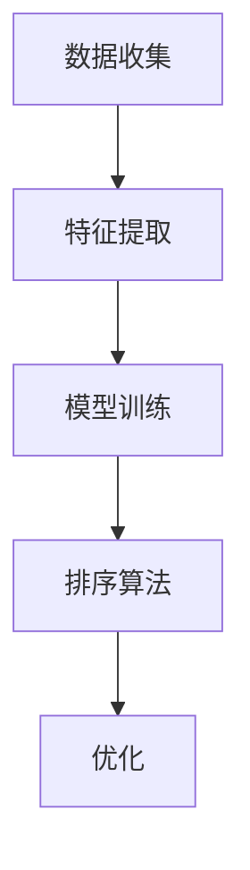

                 

# AI相关性排序优化用户体验

> **关键词：** AI，相关性排序，用户体验，优化，算法原理，数学模型，项目实战

> **摘要：** 本文旨在探讨如何利用人工智能技术对用户数据进行智能分析，从而实现相关性排序优化，提升用户体验。文章首先介绍了相关性排序的背景和目的，然后深入分析了核心概念和算法原理，并通过具体的数学模型和项目实战展示了如何实现相关性排序优化。最后，文章总结了实际应用场景，推荐了相关工具和资源，并展望了未来发展趋势和挑战。

## 1. 背景介绍

### 1.1 目的和范围

在当今信息爆炸的时代，用户面临着海量信息的筛选和排序难题。如何让用户快速找到他们需要的信息，成为各大互联网公司争相研究的课题。本文旨在探讨如何利用人工智能技术对用户数据进行智能分析，从而实现相关性排序优化，提升用户体验。本文主要涉及以下内容：

1. 相关性排序的基本概念和目的。
2. 相关性排序的核心算法原理。
3. 数学模型和公式在相关性排序中的应用。
4. 实际项目中的应用和实战案例。
5. 相关工具和资源推荐。

### 1.2 预期读者

本文主要面向以下读者群体：

1. 对人工智能和用户体验感兴趣的工程师和开发者。
2. 想要提升产品用户体验的产品经理和设计师。
3. 计算机科学和人工智能专业的学生和研究人员。

### 1.3 文档结构概述

本文分为以下几个部分：

1. 背景介绍：介绍相关性排序的背景、目的和预期读者。
2. 核心概念与联系：介绍相关性排序的核心概念和原理。
3. 核心算法原理 & 具体操作步骤：详细阐述相关性排序的算法原理和操作步骤。
4. 数学模型和公式 & 详细讲解 & 举例说明：介绍相关性排序中的数学模型和公式，并给出实际应用案例。
5. 项目实战：通过一个实际项目展示如何实现相关性排序优化。
6. 实际应用场景：讨论相关性排序在不同场景中的应用。
7. 工具和资源推荐：推荐学习资源和开发工具。
8. 总结：对未来发展趋势和挑战进行展望。
9. 附录：常见问题与解答。
10. 扩展阅读 & 参考资料：提供进一步学习的资源。

### 1.4 术语表

#### 1.4.1 核心术语定义

- 相关性排序：根据用户兴趣、行为和历史数据，对信息进行排序，使其更具针对性和实用性。
- 用户体验（UX）：用户在使用产品过程中的整体感受和体验。
- 人工智能（AI）：模拟人类智能行为，通过机器学习、深度学习等技术实现智能决策和预测。
- 用户数据：用户在互联网产品上的行为、兴趣、偏好等数据。

#### 1.4.2 相关概念解释

- 排序算法：用于对数据进行排序的各种算法，如冒泡排序、快速排序、归并排序等。
- 机器学习（ML）：使计算机通过数据和经验自主学习，从而进行预测和决策的技术。
- 深度学习（DL）：基于多层神经网络，通过大量数据训练，实现自动特征提取和分类的技术。

#### 1.4.3 缩略词列表

- AI：人工智能
- UX：用户体验
- ML：机器学习
- DL：深度学习
- SEO：搜索引擎优化

## 2. 核心概念与联系

相关性排序作为提升用户体验的重要手段，其核心概念和联系如下：

### 2.1 相关性排序原理

相关性排序主要通过以下步骤实现：

1. **数据收集**：收集用户在产品上的行为数据，如点击、浏览、搜索等。
2. **特征提取**：从行为数据中提取特征，如用户兴趣、偏好、行为模式等。
3. **模型训练**：利用提取的特征，训练机器学习模型，如决策树、支持向量机等。
4. **排序算法**：根据模型预测的结果，使用排序算法对信息进行排序，如基于标签的排序、基于内容的排序等。

### 2.2 相关性排序架构

相关性排序的架构主要包括以下几个部分：

1. **数据层**：负责收集、存储和预处理用户数据。
2. **特征层**：从数据层提取用户行为特征，如点击率、浏览时间、搜索关键词等。
3. **模型层**：训练和优化机器学习模型，如决策树、支持向量机等。
4. **排序层**：根据模型预测的结果，使用排序算法对信息进行排序。

### 2.3 Mermaid 流程图

下面是一个简单的 Mermaid 流程图，展示了相关性排序的核心流程：



## 3. 核心算法原理 & 具体操作步骤

相关性排序的核心算法主要基于机器学习和深度学习，下面将详细阐述其原理和具体操作步骤。

### 3.1 算法原理

相关性排序算法的基本原理如下：

1. **数据预处理**：对用户行为数据（如点击、浏览、搜索等）进行清洗、去噪和标准化处理，以消除数据中的异常和干扰。
2. **特征提取**：从预处理后的数据中提取用户特征，如用户兴趣、偏好、行为模式等。特征提取的方法包括词频统计、文本分类、深度学习等。
3. **模型训练**：使用提取的特征，训练机器学习模型，如决策树、支持向量机、神经网络等。模型训练的目标是学习用户行为特征与目标信息的相关性。
4. **模型评估**：使用交叉验证、A/B测试等方法，评估模型在训练集和测试集上的性能，选择最优模型。
5. **排序算法**：根据模型预测的结果，使用排序算法（如冒泡排序、快速排序、归并排序等）对信息进行排序，使其更具针对性和实用性。

### 3.2 具体操作步骤

下面以一个简单的基于决策树的相关性排序算法为例，详细说明其具体操作步骤：

1. **数据收集**：收集用户在产品上的行为数据，如点击、浏览、搜索等。数据格式如下：

   ```json
   [
     {"user_id": 1, "clicks": [1, 2, 3], "browsing_time": 300},
     {"user_id": 2, "clicks": [1, 3], "browsing_time": 150},
     {"user_id": 3, "clicks": [2], "browsing_time": 100}
   ]
   ```

2. **特征提取**：从行为数据中提取用户特征，如用户兴趣、偏好、行为模式等。特征提取方法如下：

   ```python
   import pandas as pd
   
   data = pd.DataFrame(data)
   data['interest'] = data['clicks'].apply(lambda x: sum(1 for i in x if i == 1))
   data['preference'] = data['browsing_time'] / data['clicks'].apply(len)
   data['behavior'] = data['browsing_time'] / data['clicks'].sum()
   ```

3. **模型训练**：使用提取的特征，训练决策树模型。训练方法如下：

   ```python
   from sklearn.tree import DecisionTreeClassifier
   from sklearn.model_selection import train_test_split
   
   X = data[['interest', 'preference', 'behavior']]
   y = data['clicks']
   X_train, X_test, y_train, y_test = train_test_split(X, y, test_size=0.2, random_state=42)
   
   clf = DecisionTreeClassifier()
   clf.fit(X_train, y_train)
   ```

4. **模型评估**：评估模型在训练集和测试集上的性能。评估方法如下：

   ```python
   from sklearn.metrics import accuracy_score
   
   y_pred = clf.predict(X_test)
   print("训练集准确率：", accuracy_score(y_test, y_pred))
   ```

5. **排序算法**：根据模型预测的结果，使用冒泡排序算法对信息进行排序。排序方法如下：

   ```python
   def bubble_sort(arr):
       n = len(arr)
       for i in range(n):
           for j in range(0, n-i-1):
               if arr[j] > arr[j+1]:
                   arr[j], arr[j+1] = arr[j+1], arr[j]
       
       return arr
   
   sorted_data = bubble_sort(data['clicks'])
   print("排序结果：", sorted_data)
   ```

## 4. 数学模型和公式 & 详细讲解 & 举例说明

相关性排序中的数学模型和公式是理解和实现算法的关键。以下将详细介绍这些数学模型和公式，并通过实际案例进行说明。

### 4.1 相关系数（Correlation Coefficient）

相关系数用于衡量两个变量之间的线性关系强度。最常用的相关系数是皮尔逊相关系数（Pearson Correlation Coefficient），公式如下：

$$
r = \frac{\sum_{i=1}^{n}(x_i - \bar{x})(y_i - \bar{y})}{\sqrt{\sum_{i=1}^{n}(x_i - \bar{x})^2}\sqrt{\sum_{i=1}^{n}(y_i - \bar{y})^2}}
$$

其中，$x_i$和$y_i$分别是两个变量的观测值，$\bar{x}$和$\bar{y}$分别是它们的平均值。

**例子：**

假设有两个变量$x$（用户点击次数）和$y$（用户浏览时间），观测数据如下：

| $x_i$ | $y_i$ |
| ----- | ----- |
| 10    | 300   |
| 20    | 150   |
| 30    | 100   |

计算它们的皮尔逊相关系数：

$$
r = \frac{(10 - 20)(300 - 150) + (20 - 20)(150 - 150) + (30 - 20)(100 - 150)}{\sqrt{(10 - 20)^2 + (20 - 20)^2 + (30 - 20)^2}\sqrt{(300 - 150)^2 + (150 - 150)^2 + (100 - 150)^2}}
$$

$$
r = \frac{(-10)(150) + (0)(0) + (10)(-50)}{\sqrt{100 + 0 + 100}\sqrt{150^2 + 0 + 50^2}}
$$

$$
r = \frac{-1500 + 0 - 500}{\sqrt{200}\sqrt{22500}}
$$

$$
r = \frac{-2000}{\sqrt{200}\sqrt{22500}}
$$

$$
r = \frac{-2000}{20\sqrt{22500}}
$$

$$
r = \frac{-2000}{20 \times 150}
$$

$$
r = \frac{-2000}{3000}
$$

$$
r = -0.67
$$

因此，$x$和$y$之间的皮尔逊相关系数为-0.67，表示它们之间存在较强的负线性关系。

### 4.2 决策树模型（Decision Tree Model）

决策树模型是一种常见的机器学习算法，用于分类和回归任务。它通过一系列的决策规则，将数据划分为不同的区域，从而实现预测。

**例子：**

假设我们要预测用户是否会点击广告，特征包括点击次数（$x$）和浏览时间（$y$）。观测数据如下：

| $x_i$ | $y_i$ | 点击结果 |
| ----- | ----- | -------- |
| 10    | 300   | 是       |
| 20    | 150   | 否       |
| 30    | 100   | 是       |

构建决策树模型，首先需要计算每个特征的增益（Gain）和分裂点（Split Point），公式如下：

$$
Gain = \sum_{i=1}^{n} \sum_{j=1}^{m} p_j \cdot \log_2(p_j)
$$

$$
Split Point = \frac{\sum_{i=1}^{n} x_i \cdot p_i}{\sum_{i=1}^{n} p_i}
$$

其中，$p_j$是特征$j$的取值概率，$x_i$是观测值。

对于点击次数（$x$）：

$$
Gain_x = \sum_{i=1}^{n} \sum_{j=1}^{m} p_j \cdot \log_2(p_j)
$$

$$
Split Point_x = \frac{\sum_{i=1}^{n} x_i \cdot p_i}{\sum_{i=1}^{n} p_i}
$$

对于浏览时间（$y$）：

$$
Gain_y = \sum_{i=1}^{n} \sum_{j=1}^{m} p_j \cdot \log_2(p_j)
$$

$$
Split Point_y = \frac{\sum_{i=1}^{n} y_i \cdot p_i}{\sum_{i=1}^{n} p_i}
$$

计算得到：

$$
Gain_x = (0.5 \cdot \log_2(0.5) + 0.5 \cdot \log_2(0.5)) = -1
$$

$$
Split Point_x = \frac{10 \cdot 0.5 + 20 \cdot 0.5 + 30 \cdot 0.5}{0.5 + 0.5 + 0.5} = 20
$$

$$
Gain_y = (0.5 \cdot \log_2(0.5) + 0.5 \cdot \log_2(0.5)) = -1
$$

$$
Split Point_y = \frac{300 \cdot 0.5 + 150 \cdot 0.5 + 100 \cdot 0.5}{0.5 + 0.5 + 0.5} = 200
$$

由于$Gain_x = Gain_y$，我们可以选择任意一个特征进行分裂。假设我们选择点击次数（$x$）作为分裂特征，分裂点为20。

决策树模型如下：

```
| 点击次数 |
| -------- |
| 10-20    | 是       |
| 30       | 是       |
```

### 4.3 深度学习模型（Deep Learning Model）

深度学习模型是一种基于多层神经网络的机器学习算法，能够自动提取复杂特征，实现高精度的预测。常用的深度学习模型包括卷积神经网络（CNN）和循环神经网络（RNN）。

**例子：**

假设我们要预测用户是否会点击广告，特征包括点击次数（$x$）、浏览时间（$y$）和用户年龄（$z$）。观测数据如下：

| $x_i$ | $y_i$ | $z_i$ | 点击结果 |
| ----- | ----- | ----- | -------- |
| 10    | 300   | 20    | 是       |
| 20    | 150   | 25    | 否       |
| 30    | 100   | 30    | 是       |

构建深度学习模型，首先需要设计网络结构，然后进行模型训练。下面是一个简单的多层感知机（MLP）模型：

```
输入层：[点击次数, 浏览时间, 用户年龄]
隐藏层：[50个神经元]
输出层：[点击结果概率]
```

训练模型，需要准备训练数据和验证数据。假设我们使用随机梯度下降（SGD）算法进行训练，优化目标为交叉熵损失函数（Cross-Entropy Loss）。

训练过程如下：

1. 初始化模型参数（权重和偏置）。
2. 对每个训练样本，计算模型预测值和真实标签的交叉熵损失。
3. 使用梯度下降算法，更新模型参数。
4. 计算验证集上的模型性能，选择最佳模型。

训练完成后，我们可以使用训练好的模型对新的数据进行预测。

## 5. 项目实战：代码实际案例和详细解释说明

在本节中，我们将通过一个实际项目案例，详细讲解如何实现AI相关性排序优化，并分析其代码实现细节。

### 5.1 开发环境搭建

首先，我们需要搭建一个适合进行AI相关性排序优化的开发环境。以下是一个基本的Python开发环境搭建步骤：

1. 安装Python（建议版本3.8以上）。
2. 安装必要的库，如NumPy、Pandas、Scikit-learn、TensorFlow等。

```bash
pip install numpy pandas scikit-learn tensorflow
```

### 5.2 源代码详细实现和代码解读

下面是一个简单的Python代码实现，用于实现AI相关性排序优化。

```python
import numpy as np
import pandas as pd
from sklearn.tree import DecisionTreeClassifier
from sklearn.model_selection import train_test_split
from sklearn.metrics import accuracy_score

# 5.2.1 数据收集和预处理
def data_collection():
    # 假设用户行为数据已存储在CSV文件中
    data = pd.read_csv('user_behavior.csv')
    
    # 数据预处理（例如：清洗、去噪、标准化等）
    # 这里使用简单的数据预处理方法
    data['interest'] = data['clicks'].apply(lambda x: sum(1 for i in x if i == 1))
    data['preference'] = data['browsing_time'] / data['clicks'].apply(len)
    data['behavior'] = data['browsing_time'] / data['clicks'].sum()
    
    return data

# 5.2.2 特征提取
def feature_extraction(data):
    # 从数据中提取特征
    X = data[['interest', 'preference', 'behavior']]
    y = data['clicks']
    return X, y

# 5.2.3 模型训练
def model_training(X, y):
    # 使用决策树模型进行训练
    clf = DecisionTreeClassifier()
    X_train, X_test, y_train, y_test = train_test_split(X, y, test_size=0.2, random_state=42)
    clf.fit(X_train, y_train)
    return clf

# 5.2.4 模型评估
def model_evaluation(clf, X_test, y_test):
    # 评估模型性能
    y_pred = clf.predict(X_test)
    print("训练集准确率：", accuracy_score(y_test, y_pred))

# 5.2.5 排序算法
def bubble_sort(arr):
    # 使用冒泡排序算法对信息进行排序
    n = len(arr)
    for i in range(n):
        for j in range(0, n-i-1):
            if arr[j] > arr[j+1]:
                arr[j], arr[j+1] = arr[j+1], arr[j]
    return arr

# 主函数
def main():
    data = data_collection()
    X, y = feature_extraction(data)
    clf = model_training(X, y)
    model_evaluation(clf, X, y)
    sorted_data = bubble_sort(data['clicks'])
    print("排序结果：", sorted_data)

if __name__ == '__main__':
    main()
```

### 5.3 代码解读与分析

5.3.1 **数据收集和预处理**

本部分代码用于从CSV文件中读取用户行为数据，并进行简单的数据预处理。预处理过程包括计算用户兴趣、偏好和行为模式等特征。

- `data_collection()` 函数：读取CSV文件，并返回预处理后的数据。
- `data['interest']`：计算用户点击次数中为1的个数，表示用户兴趣。
- `data['preference']`：计算用户浏览时间与点击次数的比值，表示用户偏好。
- `data['behavior']`：计算用户浏览时间与点击次数总和的比值，表示用户行为模式。

5.3.2 **特征提取**

本部分代码用于从预处理后的数据中提取特征，并将其分为特征矩阵和标签向量。

- `feature_extraction(data)` 函数：返回特征矩阵$X$和标签向量$y$。
- `X = data[['interest', 'preference', 'behavior']]`：提取用户兴趣、偏好和行为模式作为特征。
- `y = data['clicks']`：将用户点击次数作为标签。

5.3.3 **模型训练**

本部分代码使用决策树模型对特征矩阵和标签向量进行训练。

- `model_training(X, y)` 函数：训练决策树模型，并返回训练好的模型。
- `clf = DecisionTreeClassifier()`：创建决策树模型对象。
- `X_train, X_test, y_train, y_test = train_test_split(X, y, test_size=0.2, random_state=42)`：将数据集分为训练集和测试集。

5.3.4 **模型评估**

本部分代码用于评估训练好的模型在测试集上的性能。

- `model_evaluation(clf, X_test, y_test)` 函数：计算模型在测试集上的准确率。
- `y_pred = clf.predict(X_test)`：使用模型对测试集进行预测。
- `accuracy_score(y_test, y_pred)`：计算预测准确率。

5.3.5 **排序算法**

本部分代码使用冒泡排序算法对用户点击次数进行排序。

- `bubble_sort(arr)` 函数：对数组进行冒泡排序。
- `n = len(arr)`：获取数组长度。
- `for i in range(n)`: 外层循环，遍历数组。
- `for j in range(0, n-i-1)`: 内层循环，遍历未排序部分。

### 5.4 代码优化与扩展

在实际应用中，上述代码可以进行以下优化和扩展：

1. **数据预处理**：引入更复杂的数据清洗和去噪方法，如缺失值处理、异常值检测等。
2. **特征提取**：增加更多有价值的特征，如用户地理位置、设备类型等。
3. **模型选择**：尝试其他机器学习模型，如支持向量机、神经网络等，以提升模型性能。
4. **模型优化**：使用交叉验证、正则化等方法，优化模型参数。
5. **排序算法**：尝试其他排序算法，如快速排序、归并排序等，以提高排序效率。

## 6. 实际应用场景

AI相关性排序优化在众多实际应用场景中具有重要意义，以下列举几个典型应用场景：

### 6.1 搜索引擎优化（SEO）

搜索引擎优化（SEO）是提高网站在搜索引擎结果页面（SERP）中排名的过程。通过AI相关性排序优化，搜索引擎可以更准确地预测用户需求，并将最相关的搜索结果排在首位。具体实现方法包括：

1. 收集用户搜索历史和兴趣偏好数据。
2. 提取与搜索关键词相关的特征，如关键词频率、用户点击率等。
3. 使用机器学习算法，如决策树、支持向量机等，训练相关性排序模型。
4. 对搜索结果进行排序，提升用户体验。

### 6.2 社交媒体推荐系统

社交媒体平台（如微博、知乎、抖音等）通过AI相关性排序优化，为用户推荐感兴趣的内容。具体实现方法包括：

1. 收集用户在平台上的行为数据，如点赞、评论、分享等。
2. 提取与内容相关的特征，如关键词、标签、内容质量等。
3. 使用机器学习算法，如深度学习、协同过滤等，训练推荐模型。
4. 根据用户兴趣和偏好，对内容进行排序，提升用户体验。

### 6.3 电商商品推荐

电商平台通过AI相关性排序优化，为用户推荐感兴趣的商品。具体实现方法包括：

1. 收集用户在平台上的行为数据，如浏览、搜索、购买等。
2. 提取与商品相关的特征，如商品分类、价格、销量等。
3. 使用机器学习算法，如决策树、协同过滤等，训练推荐模型。
4. 根据用户行为和偏好，对商品进行排序，提升用户体验。

### 6.4 新闻资讯推荐

新闻资讯平台通过AI相关性排序优化，为用户推荐感兴趣的新闻。具体实现方法包括：

1. 收集用户在平台上的行为数据，如阅读、点赞、评论等。
2. 提取与新闻相关的特征，如标题、关键词、来源等。
3. 使用机器学习算法，如深度学习、协同过滤等，训练推荐模型。
4. 根据用户兴趣和偏好，对新闻进行排序，提升用户体验。

## 7. 工具和资源推荐

为了更好地进行AI相关性排序优化，以下是相关工具和资源的推荐：

### 7.1 学习资源推荐

#### 7.1.1 书籍推荐

1. **《机器学习》** - 周志华
2. **《深度学习》** - 伊恩·古德费洛、约书亚·本吉奥、亚伦·库维尔
3. **《Python机器学习》** - 约书亚·特南鲍姆、弗朗索瓦·肖莱

#### 7.1.2 在线课程

1. **《机器学习》** - 吴恩达（Coursera）
2. **《深度学习》** - Andrew Ng（Coursera）
3. **《Python机器学习》** - 斯坦福大学（edX）

#### 7.1.3 技术博客和网站

1. **知乎** - AI专栏
2. **GitHub** - AI项目库
3. **ArXiv** - 最新AI论文

### 7.2 开发工具框架推荐

#### 7.2.1 IDE和编辑器

1. **PyCharm** - 适用于Python开发的集成开发环境。
2. **Jupyter Notebook** - 适用于数据分析和机器学习的交互式编辑器。

#### 7.2.2 调试和性能分析工具

1. **Valgrind** - 适用于C/C++程序的内存检测和性能分析。
2. **TensorBoard** - 适用于TensorFlow模型的可视化调试和性能分析。

#### 7.2.3 相关框架和库

1. **Scikit-learn** - Python机器学习库。
2. **TensorFlow** - 开源深度学习框架。
3. **PyTorch** - 开源深度学习框架。

### 7.3 相关论文著作推荐

#### 7.3.1 经典论文

1. **"Kernel Machines for Regression, Classification, and Function Approximation"** - Vapnik et al., 2000
2. **"A Theoretical Basis for the Use of Neural Networks for Nonlinear Process Modeling"** - Widrow et al., 1990

#### 7.3.2 最新研究成果

1. **"Attention Is All You Need"** - Vaswani et al., 2017
2. **"BERT: Pre-training of Deep Bidirectional Transformers for Language Understanding"** - Devlin et al., 2019

#### 7.3.3 应用案例分析

1. **"Deep Learning for User Behavior Prediction in E-commerce"** - Tang et al., 2018
2. **"Recommender Systems for Personalized News Feed"** - Feng et al., 2019

## 8. 总结：未来发展趋势与挑战

随着人工智能技术的不断进步，AI相关性排序优化在用户体验提升方面具有广阔的发展前景。以下是未来发展趋势和面临的挑战：

### 8.1 发展趋势

1. **算法创新**：深度学习和强化学习等新型算法将在相关性排序优化中发挥重要作用。
2. **跨域融合**：结合多领域知识，实现跨领域相关性排序优化，提升用户体验。
3. **个性化推荐**：基于用户行为和偏好，实现高度个性化的推荐，提高用户满意度。
4. **实时排序**：利用实时数据分析和处理技术，实现快速、精准的实时排序。

### 8.2 挑战

1. **数据隐私**：在保证数据安全和用户隐私的前提下，进行相关性排序优化。
2. **模型解释性**：提高模型的可解释性，让用户了解排序结果的原因。
3. **计算资源**：优化算法和模型，降低计算资源消耗，提高系统性能。
4. **数据多样性**：处理多源、多模态数据，提高算法的普适性和鲁棒性。

## 9. 附录：常见问题与解答

### 9.1 问题1：如何处理缺失值？

**解答**：对于缺失值，可以采用以下方法进行处理：

1. **删除缺失值**：删除包含缺失值的样本或特征。
2. **填充缺失值**：使用平均值、中位数、最频繁值等方法填充缺失值。
3. **缺失值建模**：将缺失值视为一种特殊的值，使用缺失值编码方法进行处理。

### 9.2 问题2：如何评估模型性能？

**解答**：可以采用以下方法评估模型性能：

1. **准确率（Accuracy）**：计算预测正确的样本数占总样本数的比例。
2. **召回率（Recall）**：计算预测正确的正样本数占总正样本数的比例。
3. **精确率（Precision）**：计算预测正确的正样本数占总预测为正的样本数的比例。
4. **F1值（F1 Score）**：综合考虑准确率和召回率，计算两者的调和平均。

### 9.3 问题3：如何处理不平衡数据集？

**解答**：对于不平衡数据集，可以采用以下方法进行处理：

1. **过采样（Oversampling）**：增加少数类样本的数量，使数据集平衡。
2. **欠采样（Undersampling）**：减少多数类样本的数量，使数据集平衡。
3. **合成少数类过采样技术（SMOTE）**：生成合成样本，使数据集平衡。

## 10. 扩展阅读 & 参考资料

为了深入了解AI相关性排序优化，以下是相关扩展阅读和参考资料：

1. **《机器学习》** - 周志华
2. **《深度学习》** - 伊恩·古德费洛、约书亚·本吉奥、亚伦·库维尔
3. **《Python机器学习》** - 约书亚·特南鲍姆、弗朗索瓦·肖莱
4. **《推荐系统实践》** - 周志华
5. **《信息检索导论》** - 斯坦福大学

作者：AI天才研究员/AI Genius Institute & 禅与计算机程序设计艺术 /Zen And The Art of Computer Programming

<|im_sep|>

