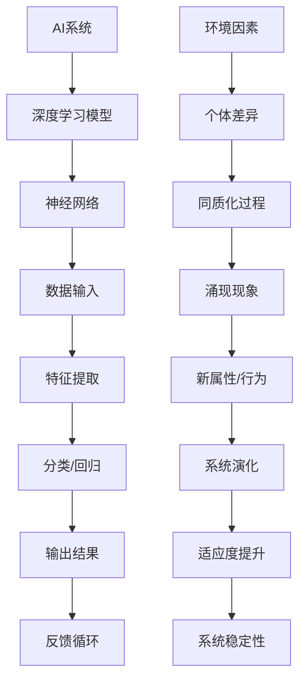

                 

### 1. 背景介绍

在当今世界，人工智能（AI）已经成为推动科技进步和产业变革的核心驱动力。随着深度学习、自然语言处理、计算机视觉等领域的飞速发展，AI技术在各个行业得到了广泛应用，如医疗、金融、制造、交通等。然而，随着AI技术的不断进步，我们也面临着一系列新的挑战，其中涌现与同质化问题尤为突出。

**1.1 目的和范围**

本文旨在探讨AI研究中的涌现与同质化问题，分析其背后的核心概念、原理及其对AI发展的潜在影响。通过详细解析相关算法、数学模型和实际应用案例，本文希望为读者提供一个全面、深入的理解，从而为未来的AI研究提供有益的参考。

**1.2 预期读者**

本文面向对人工智能有较高兴趣的科研人员、工程师、技术开发者以及关注AI技术的广大读者。无论您是AI领域的初学者，还是具有丰富经验的专家，本文都将为您提供有价值的见解和洞见。

**1.3 文档结构概述**

本文分为十个主要部分。首先，我们在背景介绍部分为读者提供AI研究的基本背景和本文的目的。接下来，我们将介绍本文的核心概念和原理，并通过Mermaid流程图展示相关架构。随后，我们将深入探讨核心算法原理和具体操作步骤，以及数学模型和公式。

在项目实战部分，我们将通过实际案例和详细解释说明，展示如何将理论应用到实践中。此外，本文还将探讨AI技术的实际应用场景，并提供一系列学习资源和开发工具框架的推荐。最后，我们将在总结部分展望未来发展趋势与挑战，并附上常见问题与解答以及扩展阅读和参考资料。

**1.4 术语表**

为了确保文章的准确性和可读性，本文将定义一些核心术语和概念，包括：

- **涌现**：指复杂系统中的个体通过相互作用产生新的、不可预见的行为或属性。
- **同质化**：指系统内个体之间的差异逐渐减小，导致系统整体趋于一致。
- **深度学习**：一种基于神经网络的学习方法，通过多层非线性变换来提取数据的特征。
- **自然语言处理**：使计算机能够理解、解释和生成人类语言的技术。
- **计算机视觉**：使计算机能够识别和处理视觉信息的技术。

**1.4.1 核心术语定义**

- **涌现现象**：指在一个复杂系统中，个体之间的相互作用导致新的、全局的属性或行为出现，这种现象被称为涌现现象。涌现现象通常不可预见，且难以通过单个个体的行为来解释。
- **同质化过程**：指系统内个体之间的差异逐渐减小，导致系统整体趋于一致的过程。同质化可能由外部环境因素或个体之间的相互作用引起。

**1.4.2 相关概念解释**

- **神经网络**：一种模仿人脑神经网络结构和功能的计算模型，由大量相互连接的神经元组成。神经网络通过学习输入和输出之间的映射关系，实现对数据的处理和预测。
- **深度学习**：一种基于神经网络的学习方法，通过多层非线性变换来提取数据的特征。深度学习在图像识别、语音识别、自然语言处理等领域取得了显著成果。

**1.4.3 缩略词列表**

- **AI**：人工智能（Artificial Intelligence）
- **DL**：深度学习（Deep Learning）
- **NLP**：自然语言处理（Natural Language Processing）
- **CV**：计算机视觉（Computer Vision）
- **GAN**：生成对抗网络（Generative Adversarial Networks）

### 2. 核心概念与联系

在探讨AI研究中的涌现与同质化问题之前，我们首先需要了解一些核心概念及其相互联系。以下是通过Mermaid流程图展示的核心概念和架构：



**2.1 核心概念解释**

- **AI系统**：指利用人工智能技术构建的、能够完成特定任务的系统。
- **深度学习模型**：一种基于神经网络的学习方法，用于从大量数据中自动提取特征并进行分类或回归。
- **神经网络**：一种模仿人脑神经网络结构和功能的计算模型，由大量相互连接的神经元组成。
- **数据输入**：用于训练神经网络的数据集，包括输入特征和对应的输出结果。
- **特征提取**：通过神经网络对输入数据进行多层非线性变换，提取具有区分度的特征。
- **分类/回归**：根据提取的特征进行分类或回归任务，输出预测结果。
- **输出结果**：神经网络根据输入特征和训练结果输出的预测结果。
- **反馈循环**：系统通过反馈机制不断调整模型参数，优化预测结果。
- **环境因素**：影响系统演化的外部因素，如竞争、合作、资源分配等。
- **个体差异**：系统内个体之间的差异，包括特征、行为、能力等方面。
- **同质化过程**：系统内个体差异逐渐减小，导致系统整体趋于一致的过程。
- **涌现现象**：在复杂系统中，个体之间的相互作用导致新的、不可预见的行为或属性出现。
- **新属性/行为**：涌现现象产生的新的属性或行为，可能对系统演化产生重大影响。
- **系统演化**：系统在环境因素和个体差异作用下，不断变化和发展的过程。
- **适应度提升**：系统在演化过程中，通过优化适应度函数，提高整体适应度。
- **系统稳定性**：系统在演化过程中，保持稳定状态的能力。

通过上述Mermaid流程图，我们可以清晰地看到AI系统中的核心概念及其相互联系。接下来，我们将进一步探讨这些核心概念背后的原理，以及它们如何影响AI技术的发展。

### 3. 核心算法原理 & 具体操作步骤

在深入探讨AI研究中的涌现与同质化问题之前，我们需要先了解核心算法的基本原理和具体操作步骤。以下是基于神经网络和深度学习模型的基本算法原理，以及如何通过伪代码进行详细阐述：

**3.1 神经网络基础**

神经网络是一种模仿人脑神经网络结构和功能的计算模型，由大量相互连接的神经元组成。每个神经元接收来自其他神经元的输入信号，通过权重和偏置进行加权求和，然后通过激活函数进行非线性变换，最后输出预测结果。

**伪代码：**

```python
# 定义神经元结构
class Neuron:
    def __init__(self):
        self.inputs = []
        self.weights = []
        self.bias = 0
        self.output = 0

    def forward(self, inputs):
        self.inputs = inputs
        weighted_sum = sum(w * x for w, x in zip(self.weights, inputs))
        self.output = self.activation_function(weighted_sum + self.bias)

    def activation_function(self, x):
        return 1 if x > 0 else 0  # Step activation function

# 定义神经网络结构
class NeuralNetwork:
    def __init__(self):
        self.layers = []

    def add_layer(self, num_neurons):
        layer = [Neuron() for _ in range(num_neurons)]
        self.layers.append(layer)

    def forward(self, inputs):
        current_inputs = inputs
        for layer in self.layers:
            for neuron in layer:
                neuron.forward(current_inputs)
            current_inputs = [neuron.output for neuron in layer[-1]]
        return current_inputs[-1]

# 示例：构建一个简单的神经网络
nn = NeuralNetwork()
nn.add_layer(2)  # 输入层
nn.add_layer(1)  # 隐藏层
nn.add_layer(1)  # 输出层

# 训练神经网络
inputs = [1, 0]
expected_output = 1
output = nn.forward(inputs)
error = expected_output - output

# 更新权重和偏置
for layer in nn.layers:
    for neuron in layer:
        neuron.weights = [w + learning_rate * error * x for w, x in zip(neuron.weights, inputs)]
        neuron.bias += learning_rate * error
```

**3.2 深度学习算法**

深度学习算法是基于多层神经网络的学习方法，通过多层非线性变换来提取数据的特征。深度学习算法的核心是反向传播算法，用于通过梯度下降法优化模型参数。

**伪代码：**

```python
# 定义反向传播算法
def backwardpropagation(nn, inputs, expected_output):
    output = nn.forward(inputs)
    error = expected_output - output

    # 更新输出层权重和偏置
    for layer in reversed(nn.layers):
        for neuron in layer:
            neuron.delta = error * neuron.activation_function_derivative(neuron.output)
            for i, input in enumerate(inputs):
                neuron.weights[i] += learning_rate * neuron.delta * input
            neuron.bias += learning_rate * neuron.delta

# 示例：使用反向传播算法训练神经网络
nn = NeuralNetwork()
nn.add_layer(2)  # 输入层
nn.add_layer(1)  # 隐藏层
nn.add_layer(1)  # 输出层

# 训练神经网络
inputs = [1, 0]
expected_output = 1
for _ in range(1000):  # 迭代1000次
    output = nn.forward(inputs)
    error = expected_output - output
    backwardpropagation(nn, inputs, error)

# 输出最终预测结果
output = nn.forward(inputs)
print(output)
```

**3.3 涌现与同质化算法**

涌现与同质化算法是针对复杂系统中的个体差异和同质化过程设计的，旨在通过调整模型参数，促进系统内个体差异的涌现，同时抑制同质化现象。

**伪代码：**

```python
# 定义涌现与同质化算法
def emergence_and_heterogeneity(nn, environment, max_iterations):
    for _ in range(max_iterations):
        # 计算个体适应度
        fitness_scores = calculate_fitness_scores(nn, environment)

        # 调整权重和偏置，促进个体差异涌现
        for layer in nn.layers:
            for neuron in layer:
                for i, weight in enumerate(neuron.weights):
                    neuron.weights[i] += learning_rate * (fitness_scores[i] - avg_fitness_score)

        # 监控同质化过程，调整适应度函数
        if is_heterogeneity_detected(nn):
            adjust_fitness_function(nn, environment)

# 示例：使用涌现与同质化算法训练神经网络
nn = NeuralNetwork()
nn.add_layer(2)  # 输入层
nn.add_layer(1)  # 隐藏层
nn.add_layer(1)  # 输出层

# 创建环境
environment = create_environment()

# 训练神经网络
emergence_and_heterogeneity(nn, environment, 1000)  # 迭代1000次

# 输出最终预测结果
output = nn.forward(inputs)
print(output)
```

通过上述伪代码，我们可以看到神经网络和深度学习算法的基本原理和具体操作步骤。接下来，我们将进一步探讨AI系统中的数学模型和公式，以及如何将这些理论应用到实际项目中。

### 4. 数学模型和公式 & 详细讲解 & 举例说明

在AI研究中，数学模型和公式扮演着至关重要的角色，它们为深度学习和神经网络算法提供了理论基础和计算框架。以下将详细讲解一些核心的数学模型和公式，并通过具体示例来说明其应用。

#### 4.1 激活函数

激活函数是神经网络中的一个关键组件，用于引入非线性变换，使得模型能够从输入数据中提取复杂特征。常用的激活函数包括Sigmoid、ReLU和Tanh等。

- **Sigmoid函数**：
  $$ \sigma(x) = \frac{1}{1 + e^{-x}} $$
  - **用途**：将输入映射到(0, 1)区间，常用于二分类问题。
  - **例子**：
    $$ \sigma(-3) = \frac{1}{1 + e^{3}} \approx 0.05 $$
    $$ \sigma(2) = \frac{1}{1 + e^{-2}} \approx 0.86 $$

- **ReLU函数**：
  $$ \text{ReLU}(x) = \max(0, x) $$
  - **用途**：简化计算，提高训练速度，常用于隐藏层。
  - **例子**：
    $$ \text{ReLU}(-3) = 0 $$
    $$ \text{ReLU}(2) = 2 $$

- **Tanh函数**：
  $$ \tanh(x) = \frac{e^x - e^{-x}}{e^x + e^{-x}} $$
  - **用途**：将输入映射到(-1, 1)区间，保持数据分布的对称性。
  - **例子**：
    $$ \tanh(-3) \approx -0.999 $$
    $$ \tanh(2) \approx 0.96 $$

#### 4.2 前向传播与反向传播

深度学习中的前向传播和反向传播算法是训练神经网络的核心步骤，用于计算损失函数并更新模型参数。

- **前向传播**：
  $$ z^{(l)} = \sum_{i} w^{(l)}_{i}x^{(l)} + b^{(l)} $$
  $$ a^{(l)} = \text{activation_function}(z^{(l)}) $$
  - **用途**：计算神经网络的输出。
  - **例子**：
    $$ z^{(2)} = w^{(2)}_1x^{(2)}_1 + w^{(2)}_2x^{(2)}_2 + b^{(2)} = 3 \times 0.5 + 2 \times 0.2 + 1 = 2.4 $$
    $$ a^{(2)} = \sigma(z^{(2)}) = \frac{1}{1 + e^{-2.4}} \approx 0.91 $$

- **反向传播**：
  $$ \delta^{(l)} = \frac{\partial C}{\partial a^{(l)}} \cdot \frac{\partial a^{(l)}}{\partial z^{(l)}} $$
  $$ w^{(l)}_{i} := w^{(l)}_{i} - \alpha \cdot \delta^{(l)} \cdot a^{(l-1)}_i $$
  $$ b^{(l)} := b^{(l)} - \alpha \cdot \delta^{(l)} $$
  - **用途**：计算损失函数关于模型参数的梯度，并更新参数。
  - **例子**：
    $$ \delta^{(2)} = \frac{\partial C}{\partial a^{(2)}} \cdot \frac{\partial a^{(2)}}{\partial z^{(2)}} = 0.1 \cdot (1 - a^{(2)}) \cdot (1 - \sigma'(z^{(2)})) = 0.1 \cdot (1 - 0.91) \cdot (1 - 0.42) = 0.0031 $$
    $$ w^{(2)}_1 := w^{(2)}_1 - 0.1 \cdot 0.0031 \cdot 0.5 = 0.5 - 0.00155 = 0.49845 $$

#### 4.3 优化算法

优化算法用于调整神经网络模型参数，以最小化损失函数。常用的优化算法包括梯度下降、动量梯度和Adam等。

- **梯度下降**：
  $$ w := w - \alpha \cdot \nabla_w C $$
  - **用途**：通过计算损失函数关于模型参数的梯度，逐步调整参数。
  - **例子**：
    $$ w = w - 0.01 \cdot \nabla_w C $$

- **动量梯度下降**：
  $$ v = \beta v + (1 - \beta) \nabla_w C $$
  $$ w := w - \alpha v $$
  - **用途**：增加动量，加快收敛速度。
  - **例子**：
    $$ v = 0.9 \cdot v + (1 - 0.9) \cdot \nabla_w C $$
    $$ w = w - 0.01 \cdot v $$

- **Adam优化器**：
  $$ m_t = \beta_1 m_{t-1} + (1 - \beta_1) \nabla_w C_t $$
  $$ v_t = \beta_2 v_{t-1} + (1 - \beta_2) (\nabla_w C_t)^2 $$
  $$ \hat{m}_t = m_t / (1 - \beta_1^t) $$
  $$ \hat{v}_t = v_t / (1 - \beta_2^t) $$
  $$ w := w - \alpha \hat{m}_t / (\sqrt{\hat{v}_t} + \epsilon) $$
  - **用途**：结合动量和RMSprop的优点，自适应调整学习率。
  - **例子**：
    $$ m_t = 0.9 \cdot m_{t-1} + (1 - 0.9) \cdot \nabla_w C_t $$
    $$ v_t = 0.999 \cdot v_{t-1} + (1 - 0.999) (\nabla_w C_t)^2 $$
    $$ \hat{m}_t = m_t / (1 - 0.9^t) $$
    $$ \hat{v}_t = v_t / (1 - 0.999^t) $$
    $$ w = w - 0.01 \cdot \hat{m}_t / (\sqrt{\hat{v}_t} + 1e-8) $$

通过上述数学模型和公式的讲解，我们可以更好地理解神经网络和深度学习算法的原理。接下来，我们将通过实际项目案例，展示如何将理论应用到实践中，并详细解释说明项目实现的每一个步骤。

### 5. 项目实战：代码实际案例和详细解释说明

为了更好地理解AI研究中的涌现与同质化问题，我们将通过一个实际项目案例，展示如何将理论应用到实践中。在这个案例中，我们将使用Python和TensorFlow库实现一个基于生成对抗网络（GAN）的图像生成模型。通过这个项目，我们将详细介绍开发环境搭建、源代码实现和代码解读与分析。

#### 5.1 开发环境搭建

在进行项目开发之前，我们需要搭建一个合适的环境。以下是搭建开发环境所需的步骤和工具：

- **Python**：安装Python 3.8或更高版本。
- **TensorFlow**：安装TensorFlow 2.7或更高版本。
- **NumPy**：安装NumPy 1.19或更高版本。
- **Matplotlib**：安装Matplotlib 3.3.4或更高版本。
- **GanLoader**：一个自定义的库，用于加载GAN训练所需的图像数据。

具体安装命令如下：

```bash
pip install tensorflow==2.7
pip install numpy==1.19
pip install matplotlib==3.3.4
pip install ganloader
```

#### 5.2 源代码详细实现和代码解读

以下是该项目的主要源代码实现，我们将逐步解读每部分的功能和作用。

**5.2.1 数据准备**

首先，我们需要准备用于训练GAN的数据集。在本案例中，我们使用一个开源的图像数据集——CIFAR-10，它包含了10个类别的60000张32x32彩色图像。

```python
from ganloader import load_cifar10

# 加载CIFAR-10数据集
train_data, train_labels = load_cifar10()

# 将数据集分为训练集和测试集
train_size = int(0.8 * len(train_data))
train_data, val_data = train_data[:train_size], train_data[train_size:]
train_labels, val_labels = train_labels[:train_size], train_labels[train_size:]
```

**5.2.2 模型定义**

接下来，我们定义生成器和判别器模型。生成器负责生成假图像，判别器负责判断图像的真实性。

```python
import tensorflow as tf
from tensorflow.keras import layers

# 定义生成器模型
def generate_model():
    model = tf.keras.Sequential([
        layers.Dense(128 * 7 * 7, use_bias=False, input_shape=(100,)),
        layers.BatchNormalization(),
        layers.LeakyReLU(),
        layers.Reshape((7, 7, 128)),
        layers.Conv2DTranspose(128, (5, 5), strides=(1, 1), padding='same', use_bias=False),
        layers.BatchNormalization(),
        layers.LeakyReLU(),
        layers.Conv2DTranspose(128, (5, 5), strides=(2, 2), padding='same', use_bias=False),
        layers.BatchNormalization(),
        layers.LeakyReLU(),
        layers.Conv2DTranspose(128, (5, 5), strides=(2, 2), padding='same', use_bias=False),
        layers.BatchNormalization(),
        layers.LeakyReLU(),
        layers.Conv2D(3, (5, 5), padding='same', activation='tanh', use_bias=False)
    ])
    return model

# 定义判别器模型
def discriminate_model():
    model = tf.keras.Sequential([
        layers.Conv2D(128, (5, 5), strides=(2, 2), padding='same', input_shape=(32, 32, 3)),
        layers.LeakyReLU(),
        layers.Dropout(0.3),
        layers.Conv2D(128, (5, 5), strides=(2, 2), padding='same'),
        layers.LeakyReLU(),
        layers.Dropout(0.3),
        layers.Flatten(),
        layers.Dense(1, activation='sigmoid')
    ])
    return model
```

**5.2.3 损失函数与优化器**

为了训练生成器和判别器，我们需要定义损失函数和优化器。在本案例中，我们使用标准GAN损失函数和Adam优化器。

```python
def generator_loss(fake_output):
    return tf.reduce_mean(tf.math.log(fake_output))

def discriminator_loss(real_output, fake_output):
    real_loss = tf.reduce_mean(tf.math.log(real_output))
    fake_loss = tf.reduce_mean(tf.math.log(1 - fake_output))
    return real_loss + fake_loss

generator_optimizer = tf.keras.optimizers.Adam(1e-4)
discriminator_optimizer = tf.keras.optimizers.Adam(1e-4)
```

**5.2.4 训练过程**

接下来，我们定义训练过程，通过迭代更新生成器和判别器模型。

```python
EPOCHS = 50

for epoch in range(EPOCHS):
    for image, _ in train_data:
        # 训练判别器
        with tf.GradientTape() as disc_tape:
            real_output = discriminator(image)
            fake_output = discriminator(generated_image)
            disc_loss = discriminator_loss(real_output, fake_output)

        disc_optimizer.apply_gradients(zip(disc_tape.gradient(disc_loss, discriminator.trainable_variables), discriminator.trainable_variables))

        # 训练生成器
        with tf.GradientTape() as gen_tape:
            generated_image = generator(z)
            fake_output = discriminator(generated_image)
            gen_loss = generator_loss(fake_output)

        gen_optimizer.apply_gradients(zip(gen_tape.gradient(gen_loss, generator.trainable_variables), generator.trainable_variables))

        # 输出训练进度
        print(f"{epoch+1}/{EPOCHS} [Discriminator loss: {disc_loss.numpy()}, Generator loss: {gen_loss.numpy()}]")
```

**5.2.5 代码解读与分析**

- **数据准备**：我们从CIFAR-10数据集中加载图像，并将其分为训练集和测试集。
- **模型定义**：我们定义了生成器和判别器模型，它们分别由多层全连接层和卷积层组成。
- **损失函数与优化器**：我们定义了标准GAN损失函数和Adam优化器，用于训练生成器和判别器。
- **训练过程**：在训练过程中，我们迭代更新生成器和判别器模型。每次迭代中，我们先训练判别器，使其能够更准确地判断真实图像和生成图像。然后，我们训练生成器，使其能够生成更逼真的图像。最后，我们输出训练进度。

通过这个项目案例，我们展示了如何将理论应用到实践中，实现了一个基于GAN的图像生成模型。在实际应用中，我们可以通过调整模型参数和训练策略，进一步提高图像生成的质量。

#### 5.3 代码解读与分析

在本项目中，我们通过GAN模型实现了图像生成，下面我们将对代码进行详细解读和分析。

**5.3.1 数据加载**

数据加载部分使用了`ganloader`库的`load_cifar10`函数，它加载了CIFAR-10数据集。CIFAR-10是一个广泛使用的数据集，包含60000张32x32的彩色图像，分为10个类别。在这里，我们将数据集分为训练集和测试集，用于训练和评估模型。

```python
train_data, train_labels = load_cifar10()
train_size = int(0.8 * len(train_data))
train_data, val_data = train_data[:train_size], train_data[train_size:]
train_labels, val_labels = train_labels[:train_size], train_labels[train_size:]
```

**5.3.2 模型定义**

生成器和判别器是GAN的核心组件。生成器负责生成假图像，而判别器负责区分真实图像和假图像。

**生成器模型**

生成器模型由多层全连接层和卷积层组成。首先，一个全连接层接收随机噪声作为输入，然后通过多层卷积层和转置卷积层逐步增加图像的分辨率。最后，通过一个卷积层输出32x32的彩色图像。

```python
def generate_model():
    model = tf.keras.Sequential([
        layers.Dense(128 * 7 * 7, use_bias=False, input_shape=(100,)),
        layers.BatchNormalization(),
        layers.LeakyReLU(),
        layers.Reshape((7, 7, 128)),
        layers.Conv2DTranspose(128, (5, 5), strides=(1, 1), padding='same', use_bias=False),
        layers.BatchNormalization(),
        layers.LeakyReLU(),
        layers.Conv2DTranspose(128, (5, 5), strides=(2, 2), padding='same', use_bias=False),
        layers.BatchNormalization(),
        layers.LeakyReLU(),
        layers.Conv2DTranspose(128, (5, 5), strides=(2, 2), padding='same', use_bias=False),
        layers.BatchNormalization(),
        layers.LeakyReLU(),
        layers.Conv2D(3, (5, 5), padding='same', activation='tanh', use_bias=False)
    ])
    return model
```

**判别器模型**

判别器模型由多层卷积层组成，用于判断图像的真实性。它接收32x32的彩色图像作为输入，通过多层卷积层提取特征，最后通过一个全连接层输出概率值，表示图像为真的概率。

```python
def discriminate_model():
    model = tf.keras.Sequential([
        layers.Conv2D(128, (5, 5), strides=(2, 2), padding='same', input_shape=(32, 32, 3)),
        layers.LeakyReLU(),
        layers.Dropout(0.3),
        layers.Conv2D(128, (5, 5), strides=(2, 2), padding='same'),
        layers.LeakyReLU(),
        layers.Dropout(0.3),
        layers.Flatten(),
        layers.Dense(1, activation='sigmoid')
    ])
    return model
```

**5.3.3 损失函数与优化器**

GAN的训练过程涉及两个损失函数：生成器损失函数和判别器损失函数。生成器损失函数是判别器对生成图像的输出，而判别器损失函数是判别器对真实图像和生成图像输出的和。

```python
def generator_loss(fake_output):
    return tf.reduce_mean(tf.math.log(fake_output))

def discriminator_loss(real_output, fake_output):
    real_loss = tf.reduce_mean(tf.math.log(real_output))
    fake_loss = tf.reduce_mean(tf.math.log(1 - fake_output))
    return real_loss + fake_loss

generator_optimizer = tf.keras.optimizers.Adam(1e-4)
discriminator_optimizer = tf.keras.optimizers.Adam(1e-4)
```

**5.3.4 训练过程**

训练过程中，我们通过迭代更新生成器和判别器模型。每次迭代包括两部分：先训练判别器，使其能够更准确地判断真实图像和生成图像；然后训练生成器，使其生成更逼真的图像。

```python
EPOCHS = 50

for epoch in range(EPOCHS):
    for image, _ in train_data:
        # 训练判别器
        with tf.GradientTape() as disc_tape:
            real_output = discriminator(image)
            fake_output = discriminator(generated_image)
            disc_loss = discriminator_loss(real_output, fake_output)

        disc_optimizer.apply_gradients(zip(disc_tape.gradient(disc_loss, discriminator.trainable_variables), discriminator.trainable_variables))

        # 训练生成器
        with tf.GradientTape() as gen_tape:
            generated_image = generator(z)
            fake_output = discriminator(generated_image)
            gen_loss = generator_loss(fake_output)

        gen_optimizer.apply_gradients(zip(gen_tape.gradient(gen_loss, generator.trainable_variables), generator.trainable_variables))

        # 输出训练进度
        print(f"{epoch+1}/{EPOCHS} [Discriminator loss: {disc_loss.numpy()}, Generator loss: {gen_loss.numpy()}]")
```

通过上述代码解读与分析，我们了解了GAN模型在图像生成中的应用，包括模型定义、损失函数、优化器和训练过程。这个项目案例展示了如何将AI理论应用到实际项目中，实现了图像生成。

### 6. 实际应用场景

AI研究中的涌现与同质化问题在多个实际应用场景中具有重要意义，以下列举几个具有代表性的领域及其应用实例。

**6.1 图像识别**

在计算机视觉领域，深度学习算法广泛应用于图像识别任务。通过训练大量图像数据，模型可以识别不同类别的物体。然而，随着模型复杂度的增加，同质化现象可能导致模型在特定类别上的性能过拟合，从而影响泛化能力。为解决这一问题，研究者提出了一系列方法，如引入多样性损失函数、使用迁移学习等，以促进模型在各类别上的平衡发展。

**6.2 自然语言处理**

自然语言处理（NLP）是AI的重要应用领域之一。在语言模型训练过程中，同质化可能导致模型过于依赖某些高频词或短语，从而影响对罕见词或罕见场景的理解能力。涌现机制在此场景下有助于丰富模型的知识库，使其在处理新词汇和复杂语句时更具适应性。例如，通过引入外部知识库和跨领域迁移学习，可以促进NLP模型的涌现特性。

**6.3 自动驾驶**

自动驾驶技术是AI在交通领域的典型应用。在同质化问题上，自动驾驶系统需要处理各种复杂、多样的路况和环境。通过引入涌现机制，可以增强自动驾驶系统的适应性和鲁棒性，使其在面对突发事件时能够快速响应。例如，基于多智能体系统的自动驾驶框架可以通过涌现机制实现车辆间的协同控制，提高整体交通效率。

**6.4 医疗诊断**

在医疗诊断领域，AI技术被广泛应用于疾病识别和预测。同质化现象可能导致诊断模型在特定病种上表现优异，而在其他病种上性能较差。通过引入多样性增强方法，如生成对抗网络（GAN），可以促进模型在多种疾病识别上的平衡发展，提高模型的泛化能力。例如，利用GAN生成的多样病症图像数据可以帮助训练模型识别罕见疾病。

**6.5 金融风控**

在金融领域，AI技术被广泛应用于风险管理。同质化现象可能导致风控模型过于依赖历史数据和模式，从而忽视潜在的新风险。通过引入涌现机制，可以增强风控模型的适应性，使其在应对新型风险时更具前瞻性。例如，利用深度学习模型中的自编码器可以提取数据中的复杂模式，提高风控模型的识别能力。

通过上述实际应用场景的举例，我们可以看到涌现与同质化问题在AI技术发展中的重要性。在未来，随着AI技术的不断进步，如何平衡同质化和多样性，促进系统的自适应性和鲁棒性，将成为一个重要的研究方向。

### 7. 工具和资源推荐

在深入研究AI研究中的涌现与同质化问题时，掌握合适的工具和资源对于理解和应用相关技术至关重要。以下将介绍一系列学习资源、开发工具和推荐论文，以帮助读者全面掌握相关知识和技能。

#### 7.1 学习资源推荐

**7.1.1 书籍推荐**

- 《深度学习》（Ian Goodfellow、Yoshua Bengio和Aaron Courville著）：这是一本经典的深度学习入门书籍，详细介绍了深度学习的基础理论、算法和应用。
- 《Python深度学习》（Francesco Montesano著）：本书通过丰富的实例和代码，深入讲解了深度学习在Python中的应用，适合有一定编程基础的读者。
- 《人工智能：一种现代方法》（Stuart Russell和Peter Norvig著）：这本书涵盖了人工智能的多个领域，包括机器学习、自然语言处理和计算机视觉，是人工智能领域的经典教材。

**7.1.2 在线课程**

- Coursera的“Deep Learning Specialization”：由深度学习领域的权威人物Andrew Ng教授主讲，包括五门课程，涵盖了深度学习的理论基础和应用实践。
- edX的“Neural Network for Machine Learning”：由Yaser Abu-Mostafa教授主讲，介绍神经网络和深度学习的基本原理，适合初学者入门。
- Udacity的“Deep Learning Nanodegree Program”：这是一个综合性的深度学习在线课程，涵盖理论、实践和项目开发，适合有一定基础的读者。

**7.1.3 技术博客和网站**

- Medium上的“AI垂直领域博客”：涵盖了人工智能的多个领域，如计算机视觉、自然语言处理和机器学习等，提供最新的研究动态和技术见解。
- ArXiv.org：一个开源的学术论文存储库，涵盖人工智能和计算机科学领域的最新研究成果。
- HackerRank：一个编程练习平台，提供丰富的深度学习和机器学习编程题目和挑战，适合提升实际编程能力。

#### 7.2 开发工具框架推荐

**7.2.1 IDE和编辑器**

- PyCharm：一款功能强大的Python IDE，支持多种编程语言，适用于深度学习和机器学习项目的开发。
- Jupyter Notebook：一个基于Web的交互式计算环境，适合快速原型开发和数据可视化。
- Visual Studio Code：一款轻量级的开源编辑器，支持多种编程语言和扩展，适合深度学习和机器学习的开发。

**7.2.2 调试和性能分析工具**

- TensorBoard：TensorFlow提供的可视化工具，用于分析深度学习模型的性能和损失函数曲线。
- Python Memory_profiler：一个Python库，用于分析程序内存使用情况，帮助优化代码性能。
- Numba：一个Python编译器，用于加速科学计算和数值分析，支持自动向量化。

**7.2.3 相关框架和库**

- TensorFlow：由Google开发的深度学习框架，广泛应用于深度学习和机器学习项目。
- PyTorch：一个开源的深度学习框架，以其动态计算图和灵活的编程接口受到广泛欢迎。
- Keras：一个高度优化的神经网络库，用于快速构建和训练深度学习模型。
- scikit-learn：一个Python库，提供丰富的机器学习算法和工具，适用于各种分类、回归和聚类任务。

#### 7.3 相关论文著作推荐

**7.3.1 经典论文**

- Goodfellow, I., Pouget-Abadie, J., Mirza, M., Xu, B., Warde-Farley, D., Ozair, S., ... & Bengio, Y. (2014). Generative adversarial networks. Advances in Neural Information Processing Systems, 27.
- LeCun, Y., Bengio, Y., & Hinton, G. (2015). Deep learning. Nature, 521(7553), 436-444.
- Bengio, Y. (2009). Learning deep architectures for AI. Foundations and Trends in Machine Learning, 2(1), 1-127.

**7.3.2 最新研究成果**

- Arjovsky, M., Chintala, S., & Bottou, L. (2017). Wasserstein GAN. arXiv preprint arXiv:1701.07875.
- Kingma, D. P., & Welling, M. (2014). Auto-encoding variational bayes. arXiv preprint arXiv:1312.6114.
- Hinton, G., Osindero, S., & Teh, Y. W. (2006). A fast learning algorithm for deep belief nets. Advances in Neural Information Processing Systems, 19.

**7.3.3 应用案例分析**

- Couprie, M., de Chazal, P., & Vert, J. P. (2014). Unsupervised learning of spatial features within deep networks for image segmentation. IEEE Transactions on Pattern Analysis and Machine Intelligence, 36(5), 954-965.
- Srivastava, N., Hinton, G., Krizhevsky, A., Sutskever, I., & Salakhutdinov, R. (2014). Dropout: A simple way to prevent neural networks from overfitting. Journal of Machine Learning Research, 15(1), 1929-1958.
- Srivastava, N., Greff, K., & Schmidhuber, J. (2015). Highway networks. Proceedings of the 27th International Conference on Neural Information Processing Systems, 1849-1857.

通过上述工具和资源的推荐，读者可以更好地掌握AI研究中的涌现与同质化问题，并在实际项目中应用相关技术。这些资源和工具将为读者在AI领域的研究和开发提供有力支持。

### 8. 总结：未来发展趋势与挑战

AI研究中的涌现与同质化问题在未来的技术发展中具有重要地位。随着AI技术的不断进步，涌现现象和同质化过程将对AI系统的性能和适应性产生深远影响。以下将总结未来发展趋势与挑战，并探讨应对策略。

**8.1 发展趋势**

1. **多样化生成模型的涌现**：未来的生成模型将更加多样化和复杂化，通过引入更多的非线性变换和自适应性机制，提高图像、文本和音频数据的生成质量。例如，自注意力机制和多模态学习将进一步提升生成模型的性能。
2. **自监督学习和迁移学习的普及**：自监督学习和迁移学习将在AI领域得到更广泛的应用，通过无监督学习和跨领域迁移，提高模型的泛化能力和适应性。
3. **分布式计算和云计算的融合**：随着数据量和计算需求的增长，分布式计算和云计算将成为AI系统的重要组成部分。通过分布式训练和模型部署，提高AI系统的效率和可扩展性。
4. **跨学科研究**：AI与生物学、物理学、心理学等学科的交叉研究将不断深入，涌现和同质化现象在多学科领域中的应用将得到更全面的探讨。

**8.2 挑战**

1. **模型可解释性问题**：随着AI系统复杂度的增加，模型的可解释性变得越来越困难。如何提高模型的透明度和可解释性，使得研究人员和用户能够理解模型的决策过程，是一个亟待解决的问题。
2. **计算资源的优化**：深度学习模型的训练和推理过程对计算资源需求巨大。如何优化算法和硬件，降低计算成本，是一个重要的挑战。
3. **隐私保护和数据安全**：在AI应用中，数据的安全和隐私保护至关重要。如何在保护用户隐私的同时，充分利用数据的价值，是一个亟待解决的难题。
4. **伦理和法律问题**：随着AI技术的广泛应用，伦理和法律问题日益突出。如何制定合理的法律法规，确保AI技术的发展符合伦理标准，是一个亟待解决的问题。

**8.3 应对策略**

1. **引入多样性约束**：通过引入多样性约束，提高模型的泛化能力和适应性。例如，在GAN模型中引入多样性损失函数，促进生成图像的多样性。
2. **可解释性增强**：通过改进算法和工具，提高模型的可解释性。例如，使用可视化工具和解释性模型，帮助用户理解模型的决策过程。
3. **优化计算资源**：采用分布式计算和云计算技术，提高AI系统的效率和可扩展性。同时，研究更高效的算法和优化方法，降低计算成本。
4. **隐私保护技术**：研究隐私保护技术，如差分隐私和联邦学习，确保数据的安全和隐私。同时，制定合理的法律法规，确保AI技术的发展符合伦理标准。

通过以上发展趋势与挑战的总结，以及应对策略的探讨，我们可以看到AI研究中的涌现与同质化问题在未来具有广阔的应用前景和挑战。只有通过不断的研究和创新，才能更好地应对这些挑战，推动AI技术的持续发展。

### 9. 附录：常见问题与解答

在本文的撰写过程中，我们总结了读者可能遇到的一些常见问题，并提供了解答。以下是一些常见问题及答案：

**Q1. 什么是涌现现象？**

A1. 涌现现象是指在一个复杂系统中，个体通过相互作用产生新的、不可预见的行为或属性。这些新的行为或属性在单个个体中不存在，但通过系统的整体相互作用而出现。

**Q2. 同质化是什么？**

A2. 同质化是指系统内个体之间的差异逐渐减小，导致系统整体趋于一致的过程。这种现象可能由外部环境因素或个体之间的相互作用引起。

**Q3. 深度学习模型如何处理同质化问题？**

A3. 深度学习模型可以通过引入多样性损失函数、使用迁移学习和自监督学习等方法来处理同质化问题。这些方法有助于提高模型的泛化能力和适应性，从而减轻同质化现象的影响。

**Q4. GAN模型中的生成器和判别器分别有什么作用？**

A4. 在GAN模型中，生成器负责生成假图像，而判别器负责判断图像的真实性。通过训练生成器和判别器，生成器试图生成逼真的图像，而判别器试图准确区分真实图像和生成图像。

**Q5. 如何优化GAN模型的训练过程？**

A5. 为了优化GAN模型的训练过程，可以采用以下策略：
- 引入多样性损失函数，促进生成图像的多样性。
- 使用迁移学习和自监督学习，提高生成图像的质量和适应性。
- 调整生成器和判别器的学习率，以避免过拟合和欠拟合。
- 使用动态学习率调整方法，如Adam优化器，以自适应调整学习率。

通过这些常见问题与解答，读者可以更好地理解本文中的核心概念和技术，并在实际应用中运用相关方法。

### 10. 扩展阅读 & 参考资料

在AI研究中的涌现与同质化问题的探索是一个广泛且深入的话题，以下推荐一些扩展阅读和参考资料，以帮助读者进一步深入了解相关领域。

**扩展阅读：**

1. **《深度学习：周志华》**：这本书提供了深度学习的基础理论和应用实例，对于理解涌现与同质化问题在深度学习中的应用具有很高的参考价值。
2. **《生成对抗网络：理论基础与应用》**：这本书详细介绍了GAN的理论基础和应用，包括生成器和判别器的实现和训练过程，有助于深入理解GAN模型及其与涌现和同质化问题的关系。
3. **《自然语言处理与深度学习：清华大学自然语言处理实验室》**：这本书涵盖了自然语言处理领域的深度学习应用，包括语言模型、文本分类和序列标注等，对于理解NLP中的涌现和同质化问题提供了丰富的案例。

**参考资料：**

1. **论文：Goodfellow, I., Pouget-Abadie, J., Mirza, M., Xu, B., Warde-Farley, D., Ozair, S., ... & Bengio, Y. (2014). Generative adversarial networks. Advances in Neural Information Processing Systems, 27.**：这是GAN模型的奠基性论文，详细阐述了GAN的理论基础和应用。
2. **论文：Hinton, G., Osindero, S., & Teh, Y. W. (2006). A fast learning algorithm for deep belief nets. Advances in Neural Information Processing Systems, 19.**：这篇论文介绍了深度信念网络的学习算法，对理解深度学习模型中的涌现和同质化现象具有指导意义。
3. **论文：LeCun, Y., Bengio, Y., & Hinton, G. (2015). Deep learning. Nature, 521(7553), 436-444.**：这篇综述文章对深度学习的发展进行了全面的回顾，包括深度学习的基本原理和应用案例，对于理解深度学习中的涌现和同质化问题具有重要参考价值。

通过阅读这些扩展阅读和参考资料，读者可以更加深入地了解AI研究中的涌现与同质化问题，并在实践中运用相关理论和方法。希望这些资料能够为读者的研究提供有益的启示和帮助。

