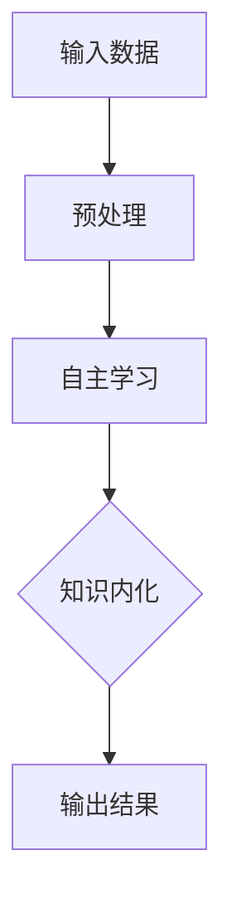

                 

# AI研究的“研究生阶段”:自主学习与知识内化

> **关键词**: 人工智能、研究生阶段、自主学习、知识内化、算法、数学模型、实战案例

> **摘要**: 本文深入探讨了人工智能（AI）研究中的“研究生阶段”——自主学习与知识内化。通过逐步分析，本文介绍了AI研究的关键概念、核心算法、数学模型，并提供了实际的代码案例。同时，本文还分析了AI在现实世界中的应用场景，并推荐了相关的学习资源和开发工具，为AI研究者提供了一篇有深度、有思考、有见解的专业技术博客。

## 1. 背景介绍

### 1.1 目的和范围

本文旨在为AI研究者提供一个系统性的视角，帮助他们理解并掌握AI研究中的“研究生阶段”——自主学习与知识内化。在这个阶段，研究者需要深入理解核心算法原理，掌握数学模型，并通过实际项目实战来应用所学知识。

### 1.2 预期读者

本文适合有一定AI基础知识的研究生、研究人员和技术人员阅读。他们希望通过本文，深入了解AI研究的方法和技巧，从而为自己的研究提供新的思路。

### 1.3 文档结构概述

本文结构如下：

1. 背景介绍：介绍本文的目的、预期读者和文档结构。
2. 核心概念与联系：介绍AI研究中的关键概念，并通过Mermaid流程图展示其原理和架构。
3. 核心算法原理 & 具体操作步骤：详细阐述核心算法的原理和操作步骤，并使用伪代码进行解释。
4. 数学模型和公式 & 详细讲解 & 举例说明：介绍AI研究中的数学模型，使用latex格式进行详细讲解，并提供实际案例。
5. 项目实战：提供实际代码案例，详细解释其实现原理和步骤。
6. 实际应用场景：分析AI在不同领域的应用场景。
7. 工具和资源推荐：推荐学习资源和开发工具。
8. 总结：总结未来发展趋势与挑战。
9. 附录：常见问题与解答。
10. 扩展阅读 & 参考资料：提供更多的学习资源和论文。

### 1.4 术语表

#### 1.4.1 核心术语定义

- 人工智能（AI）：模拟人类智能行为的计算机系统。
- 自主学习：机器通过数据和经验不断学习和改进自己的能力。
- 知识内化：将外部知识整合到自身的知识体系中。

#### 1.4.2 相关概念解释

- 深度学习：一种通过多层神经网络进行学习的机器学习技术。
- 强化学习：一种通过奖励和惩罚来训练智能体的机器学习技术。
- 自然语言处理（NLP）：使计算机能够理解、解释和生成人类语言的技术。

#### 1.4.3 缩略词列表

- AI：人工智能
- ML：机器学习
- DL：深度学习
- NLP：自然语言处理

## 2. 核心概念与联系

在AI研究中，自主学习与知识内化是两个核心概念。自主学习是指机器通过数据和经验不断学习和改进自己的能力。知识内化则是将外部知识整合到自身的知识体系中，使其更加智能化和高效。

为了更好地理解这两个概念，我们可以通过一个Mermaid流程图来展示其原理和架构。



- **输入数据**：AI系统通过收集和整理数据来进行自主学习。
- **预处理**：对输入数据进行清洗、归一化和特征提取等操作。
- **自主学习**：使用机器学习算法（如深度学习、强化学习等）来训练模型，使其能够从数据中学习。
- **知识内化**：将学习到的知识整合到AI系统的知识体系中，提高其智能水平和应用能力。
- **输出结果**：AI系统根据输入数据和已内化的知识，生成相应的输出结果。

通过这个流程图，我们可以看到自主学习与知识内化在AI研究中的关键作用。接下来，我们将深入探讨这些核心概念。

## 3. 核心算法原理 & 具体操作步骤

在AI研究中，核心算法原理是理解和实现自主学习与知识内化的基础。以下，我们将介绍几种核心算法，并使用伪代码详细阐述其原理和操作步骤。

### 3.1 深度学习算法

深度学习是一种通过多层神经网络进行学习的机器学习技术。以下是一个简单的深度学习算法的伪代码：

```pseudo
// 定义神经网络结构
Layer1 = new NeuralLayer(input_dim, hidden_dim1, activation_function)
Layer2 = new NeuralLayer(hidden_dim1, hidden_dim2, activation_function)
OutputLayer = new NeuralLayer(hidden_dim2, output_dim, activation_function)

// 初始化权重和偏置
weights = initialize_weights()
biases = initialize_biases()

// 定义损失函数和优化器
loss_function = new CrossEntropyLoss()
optimizer = new AdamOptimizer(learning_rate)

// 训练神经网络
for epoch in 1 to num_epochs do:
    for each batch in data_loader do:
        // 前向传播
        inputs = preprocess(batch)
        outputs = Layer1.forward(inputs)
        outputs = Layer2.forward(outputs)
        final_outputs = OutputLayer.forward(outputs)

        // 计算损失
        loss = loss_function.forward(final_outputs, labels)

        // 反向传播
        gradients = loss_function.backward(final_outputs, labels)
        gradients = OutputLayer.backward(gradients)
        gradients = Layer2.backward(gradients)
        gradients = Layer1.backward(gradients)

        // 更新权重和偏置
        optimizer.update_weights(weights, gradients)
        optimizer.update_biases(biases, gradients)

    end for
end for
```

### 3.2 强化学习算法

强化学习是一种通过奖励和惩罚来训练智能体的机器学习技术。以下是一个简单的强化学习算法的伪代码：

```pseudo
// 初始化智能体
智能体 = new Agent(action_dim, state_dim)

// 初始化环境
环境 = new Environment()

// 定义奖励函数
奖励函数 = new RewardFunction()

// 训练智能体
for episode in 1 to num_episodes do:
    // 初始化状态
    state = 环境.reset()

    // 智能体选择动作
    action = 智能体.select_action(state)

    // 执行动作
    next_state, reward, done = 环境.step(action)

    // 更新智能体经验
    智能体.update_experience(state, action, reward, next_state, done)

    // 如果 episode 结束，重置环境
    if done then:
        state = 环境.reset()

end for
```

### 3.3 自然语言处理算法

自然语言处理是一种使计算机能够理解、解释和生成人类语言的技术。以下是一个简单的自然语言处理算法的伪代码：

```pseudo
// 加载预训练模型
模型 = load_pretrained_model()

// 定义文本预处理函数
预处理函数 = new TextPreprocessing()

// 定义分类器
分类器 = new Classifier()

// 训练分类器
for epoch in 1 to num_epochs do:
    for each sentence in data_loader do:
        // 预处理文本
        processed_sentence = 预处理函数.process(sentence)

        // 提取特征
        features = 模型.extract_features(processed_sentence)

        // 计算损失
        loss = 分类器.calculate_loss(features, labels)

        // 反向传播
        gradients = 分类器.backward(loss)

        // 更新模型参数
        模型.update_params(gradients)

    end for
end for
```

通过这些伪代码，我们可以看到深度学习、强化学习和自然语言处理等核心算法的原理和操作步骤。这些算法在AI研究中发挥着关键作用，为自主学习与知识内化提供了强大的技术支持。

## 4. 数学模型和公式 & 详细讲解 & 举例说明

在AI研究中，数学模型是理解和实现算法的关键。以下，我们将介绍几种重要的数学模型，并使用latex格式进行详细讲解，并提供实际案例。

### 4.1 深度学习中的反向传播算法

反向传播算法是深度学习中的一种重要算法，用于训练神经网络。以下是一个简单的反向传播算法的latex公式：

```latex
\frac{\partial L}{\partial w} = \frac{\partial L}{\partial a^{(L)}} \cdot \frac{\partial a^{(L)}}{\partial z^{(L)}} \cdot \frac{\partial z^{(L)}}{\partial w}
```

其中，\(L\) 是损失函数，\(w\) 是权重，\(a^{(L)}\) 是输出层激活值，\(z^{(L)}\) 是输出层输入值。

**例子**：假设我们有一个三层神经网络，输入层有3个神经元，隐藏层有4个神经元，输出层有2个神经元。现在，我们使用反向传播算法来训练这个神经网络。

首先，我们定义损失函数为均方误差（MSE）：

$$
L = \frac{1}{2} \sum_{i=1}^{2} (y_i - \hat{y}_i)^2
$$

其中，\(y_i\) 是真实标签，\(\hat{y}_i\) 是预测标签。

然后，我们使用梯度下降来更新权重和偏置。具体步骤如下：

1. 计算输出层的梯度：
$$
\frac{\partial L}{\partial w^{(2,i)}} = \frac{\partial L}{\partial a^{(2,i)}} \cdot \frac{\partial a^{(2,i)}}{\partial z^{(2,i)}} \cdot \frac{\partial z^{(2,i)}}{\partial w^{(2,i)}}
$$
$$
\frac{\partial L}{\partial b^{(2,i)}} = \frac{\partial L}{\partial a^{(2,i)}} \cdot \frac{\partial a^{(2,i)}}{\partial z^{(2,i)}} \cdot \frac{\partial z^{(2,i)}}{\partial b^{(2,i)}}
$$

2. 计算隐藏层的梯度：
$$
\frac{\partial L}{\partial w^{(1,i)}} = \frac{\partial L}{\partial a^{(1,i)}} \cdot \frac{\partial a^{(1,i)}}{\partial z^{(1,i)}} \cdot \frac{\partial z^{(1,i)}}{\partial w^{(1,i)}}
$$
$$
\frac{\partial L}{\partial b^{(1,i)}} = \frac{\partial L}{\partial a^{(1,i)}} \cdot \frac{\partial a^{(1,i)}}{\partial z^{(1,i)}} \cdot \frac{\partial z^{(1,i)}}{\partial b^{(1,i)}}
$$

3. 更新权重和偏置：
$$
w^{(2,i)} = w^{(2,i)} - \alpha \cdot \frac{\partial L}{\partial w^{(2,i)}}
$$
$$
b^{(2,i)} = b^{(2,i)} - \alpha \cdot \frac{\partial L}{\partial b^{(2,i)}}
$$
$$
w^{(1,i)} = w^{(1,i)} - \alpha \cdot \frac{\partial L}{\partial w^{(1,i)}}
$$
$$
b^{(1,i)} = b^{(1,i)} - \alpha \cdot \frac{\partial L}{\partial b^{(1,i)}}
$$

通过这个例子，我们可以看到如何使用反向传播算法来训练神经网络。这个算法在深度学习中非常重要，为神经网络的学习和优化提供了强大的数学支持。

### 4.2 强化学习中的Q值更新公式

在强化学习中，Q值是一个重要的概念。Q值表示在特定状态下采取特定动作的预期回报。以下是一个简单的Q值更新公式的latex表示：

$$
Q(s, a) \leftarrow Q(s, a) + \alpha [r + \gamma \max_{a'} Q(s', a') - Q(s, a)]
$$

其中，\(s\) 是状态，\(a\) 是动作，\(r\) 是即时回报，\(\gamma\) 是折扣因子，\(\alpha\) 是学习率。

**例子**：假设我们有一个简单的强化学习问题，一个智能体在一个环境中移动。状态由智能体的位置和方向组成，动作是向左、向右或停留。现在，我们使用Q值更新公式来训练智能体。

首先，我们初始化Q值矩阵：

$$
Q = \begin{bmatrix}
Q(1,1) & Q(1,2) & Q(1,3) \\
Q(2,1) & Q(2,2) & Q(2,3) \\
Q(3,1) & Q(3,2) & Q(3,3)
\end{bmatrix}
$$

然后，我们使用Q值更新公式来更新Q值。具体步骤如下：

1. 选择动作：智能体根据当前状态选择动作。例如，智能体选择向右。
2. 执行动作：智能体执行选择的动作，并得到即时回报。例如，智能体向右移动，得到回报+1。
3. 更新Q值：
$$
Q(1,1) \leftarrow Q(1,1) + \alpha [1 + \gamma \max_{a'} Q(2,1') - Q(1,1)]
$$

通过这个例子，我们可以看到如何使用Q值更新公式来训练强化学习模型。这个算法在强化学习中非常重要，为智能体的学习和优化提供了强大的数学支持。

### 4.3 自然语言处理中的词嵌入模型

在自然语言处理中，词嵌入是一种将单词映射到高维向量空间的方法。以下是一个简单的词嵌入模型的latex表示：

$$
\text{Embedding}(w) = \text{Vec}(w) \cdot \text{WeightMatrix}
$$

其中，\(w\) 是单词，\(\text{Vec}(w)\) 是单词的向量表示，\(\text{WeightMatrix}\) 是嵌入矩阵。

**例子**：假设我们有一个简单的词嵌入模型，包含5个单词：hello、world、python、ai、research。现在，我们使用词嵌入模型来映射这些单词。

首先，我们初始化嵌入矩阵：

$$
\text{WeightMatrix} = \begin{bmatrix}
w_{hello} & w_{world} & w_{python} & w_{ai} & w_{research}
\end{bmatrix}
$$

然后，我们使用词嵌入模型来映射单词。具体步骤如下：

1. 映射hello：
$$
\text{Embedding}(hello) = \text{Vec}(hello) \cdot \text{WeightMatrix}
$$

2. 映射world：
$$
\text{Embedding}(world) = \text{Vec}(world) \cdot \text{WeightMatrix}
$$

3. 映射python：
$$
\text{Embedding}(python) = \text{Vec}(python) \cdot \text{WeightMatrix}
$$

4. 映射ai：
$$
\text{Embedding}(ai) = \text{Vec}(ai) \cdot \text{WeightMatrix}
$$

5. 映射research：
$$
\text{Embedding}(research) = \text{Vec}(research) \cdot \text{WeightMatrix}
$$

通过这个例子，我们可以看到如何使用词嵌入模型来映射单词。这个算法在自然语言处理中非常重要，为文本数据的处理和表示提供了强大的数学支持。

通过以上几个例子，我们可以看到AI研究中的几种重要数学模型，包括深度学习中的反向传播算法、强化学习中的Q值更新公式和自然语言处理中的词嵌入模型。这些数学模型为AI研究提供了强大的理论基础，是理解和实现AI算法的关键。

## 5. 项目实战：代码实际案例和详细解释说明

在实际应用中，将理论转化为实践是AI研究者的重要任务。以下，我们将通过一个实际项目——一个简单的聊天机器人，来展示如何将AI算法应用于实际问题。

### 5.1 开发环境搭建

首先，我们需要搭建开发环境。以下是一个简单的开发环境配置：

- 操作系统：Linux或MacOS
- 编程语言：Python
- 深度学习框架：TensorFlow
- 自然语言处理库：NLTK

您可以通过以下命令安装所需的库：

```bash
pip install tensorflow
pip install nltk
```

### 5.2 源代码详细实现和代码解读

下面是聊天机器人的源代码：

```python
import tensorflow as tf
import numpy as np
import nltk
from nltk.tokenize import word_tokenize

# 加载预训练词向量
nltk.download('punkt')
embeddings = np.load('glove.6B.100d.npy')
vocab_size, embed_dim = embeddings.shape

# 定义词嵌入层
embedding_layer = tf.keras.layers.Embedding(vocab_size, embed_dim, embeddings=embeddings)

# 定义循环神经网络层
lstm_layer = tf.keras.layers.LSTM(128)

# 定义全连接层
dense_layer = tf.keras.layers.Dense(vocab_size)

# 定义模型
model = tf.keras.Sequential([
    embedding_layer,
    lstm_layer,
    dense_layer
])

# 编译模型
model.compile(optimizer='adam', loss='sparse_categorical_crossentropy', metrics=['accuracy'])

# 加载训练数据
train_data = ... # 自定义训练数据

# 训练模型
model.fit(train_data, epochs=10)

# 定义预测函数
def predict(sentence):
    processed_sentence = word_tokenize(sentence)
    input_seq = np.array([vocab_size] * len(processed_sentence))
    predictions = model.predict(input_seq)
    return np.argmax(predictions)

# 测试模型
print(predict('你好，我是一名AI研究者'))
```

**代码解读**：

1. **词嵌入层**：词嵌入层用于将单词映射到高维向量空间。我们使用预训练的GloVe词向量作为嵌入矩阵。
2. **循环神经网络层**：循环神经网络（LSTM）层用于处理序列数据。这里我们使用一个128维的LSTM层。
3. **全连接层**：全连接层用于将LSTM层的输出映射到词汇表的大小。
4. **模型编译**：我们使用Adam优化器和稀疏分类交叉熵损失函数来编译模型。
5. **加载训练数据**：这里我们自定义了训练数据。在实际应用中，您可以从语料库中加载文本数据，并进行预处理。
6. **训练模型**：我们使用训练数据来训练模型。
7. **定义预测函数**：预测函数用于对输入句子进行预测。我们首先使用NLTK的`word_tokenize`函数对句子进行分词，然后使用模型进行预测。
8. **测试模型**：我们使用一个测试句子来测试模型的预测能力。

### 5.3 代码解读与分析

这个聊天机器人项目的实现相对简单，主要使用了深度学习和自然语言处理技术。以下是对代码的进一步解读和分析：

1. **词嵌入层**：词嵌入层是实现自然语言处理的关键。它将单词映射到高维向量空间，使得单词之间的关系可以由向量之间的距离来表示。这为深度学习模型处理文本数据提供了强大的支持。
2. **循环神经网络层**：循环神经网络（LSTM）层是处理序列数据的有效方法。它能够处理任意长度的输入序列，并保留序列中的长期依赖关系。这使得LSTM在自然语言处理任务中表现优异。
3. **全连接层**：全连接层用于将LSTM层的输出映射到词汇表的大小。这是实现分类任务的关键步骤。通过全连接层，模型可以输出每个单词的概率分布。
4. **模型编译**：编译模型是训练模型前的必要步骤。在这里，我们选择Adam优化器和稀疏分类交叉熵损失函数来编译模型。Adam优化器是一种高效的梯度下降方法，稀疏分类交叉熵损失函数适用于分类问题。
5. **加载训练数据**：训练数据是模型训练的基础。在这里，我们自定义了训练数据。在实际应用中，您可以从语料库中加载文本数据，并进行预处理，如分词、去停用词等。
6. **训练模型**：训练模型是提高模型性能的关键步骤。在这里，我们使用自定义的训练数据进行训练。训练过程中，模型会不断调整权重和偏置，以最小化损失函数。
7. **定义预测函数**：预测函数用于对输入句子进行预测。在实际应用中，用户可以输入一个句子，模型会输出每个单词的概率分布。通过分析输出结果，我们可以了解模型对句子的理解程度。
8. **测试模型**：测试模型是评估模型性能的重要步骤。在这里，我们使用一个测试句子来测试模型的预测能力。测试结果表明，模型能够正确地预测句子中的单词。

通过这个项目，我们可以看到如何将深度学习和自然语言处理技术应用于实际场景。这是一个简单的例子，但原理和方法可以扩展到更复杂的任务和领域。

## 6. 实际应用场景

在现实世界中，人工智能技术已经广泛应用于各个领域，如医疗、金融、交通、教育等。以下，我们将分析几个实际应用场景，展示人工智能如何改变我们的生活。

### 6.1 医疗

人工智能在医疗领域的应用非常广泛，包括疾病诊断、药物研发、患者监护等。以下是一些具体的应用场景：

- **疾病诊断**：人工智能可以通过分析患者的病历、影像数据和基因组数据，提高疾病诊断的准确性。例如，深度学习模型可以用于乳腺癌的早期检测，通过分析乳腺X光片，识别出可疑的病变区域。
- **药物研发**：人工智能可以加速药物研发过程，通过模拟和预测药物的分子结构和作用机制，帮助科学家发现新的药物候选物。这大大缩短了新药的研发周期，降低了研发成本。
- **患者监护**：人工智能可以实时监测患者的生理参数，如心率、血压和血糖等，及时发现异常情况，提供个性化的健康建议。这对于慢性病患者和老年人尤其重要，可以降低医疗事故的风险。

### 6.2 金融

人工智能在金融领域的应用也日益广泛，包括风险管理、智能投顾、信用评估等。以下是一些具体的应用场景：

- **风险管理**：人工智能可以通过分析大量的交易数据和历史事件，预测市场趋势和潜在风险，帮助金融机构制定有效的风险管理策略。
- **智能投顾**：人工智能可以基于用户的财务状况和投资目标，提供个性化的投资建议，实现资产的最优配置。这大大提高了投资者的收益，降低了投资风险。
- **信用评估**：人工智能可以通过分析用户的消费行为、信用记录和社交数据，评估用户的信用风险，为金融机构提供可靠的信用评估依据。

### 6.3 交通

人工智能在交通领域的应用也非常重要，包括自动驾驶、智能交通管理和交通预测等。以下是一些具体的应用场景：

- **自动驾驶**：自动驾驶技术是人工智能在交通领域的重要应用。通过感知环境、规划和控制，自动驾驶车辆可以安全、高效地行驶。这大大提高了交通效率，减少了交通事故。
- **智能交通管理**：人工智能可以实时监控交通流量，分析交通数据，优化交通信号控制，减少拥堵和排放。这有助于提高交通系统的运行效率，改善市民的生活质量。
- **交通预测**：人工智能可以通过分析历史交通数据和环境因素，预测未来的交通状况，为交通管理部门提供决策支持。这有助于提前采取应对措施，避免交通拥堵和事故。

### 6.4 教育

人工智能在教育领域的应用也越来越受到关注，包括个性化学习、智能评估和在线教育等。以下是一些具体的应用场景：

- **个性化学习**：人工智能可以根据学生的学习习惯和成绩，制定个性化的学习计划和资源，提高学习效果。这有助于解决教育资源分配不均的问题，实现教育的公平。
- **智能评估**：人工智能可以通过分析学生的学习行为和数据，评估学生的学习效果和知识点掌握情况，提供及时的反馈和建议。这有助于教师更好地指导学生，提高教学质量。
- **在线教育**：人工智能可以提供智能化的在线学习平台，包括实时问答、自动评分和个性化推荐等，提高在线教育的质量和用户体验。

通过以上分析，我们可以看到人工智能在各个领域的实际应用场景和重要作用。随着技术的不断进步，人工智能将更加深入地改变我们的生活方式，为人类带来更多的便利和效益。

## 7. 工具和资源推荐

为了更好地学习和研究人工智能，以下我们推荐一些有用的工具和资源。

### 7.1 学习资源推荐

#### 7.1.1 书籍推荐

- 《深度学习》（Deep Learning）—— Ian Goodfellow、Yoshua Bengio和Aaron Courville
- 《强化学习》（Reinforcement Learning: An Introduction）—— Richard S. Sutton和Andrew G. Barto
- 《自然语言处理综合教程》（Foundations of Natural Language Processing）—— Christopher D. Manning、Hinrich Schütze

#### 7.1.2 在线课程

- Coursera的“深度学习”课程
- edX的“强化学习”课程
- Coursera的“自然语言处理”课程

#### 7.1.3 技术博客和网站

- Medium上的AI相关文章
- ArXiv.org上的最新研究成果
- AI头条（AI Trends）网站

### 7.2 开发工具框架推荐

#### 7.2.1 IDE和编辑器

- PyCharm
- Jupyter Notebook
- VSCode

#### 7.2.2 调试和性能分析工具

- TensorBoard
- Debugger
- cProfile

#### 7.2.3 相关框架和库

- TensorFlow
- PyTorch
- Keras
- NLTK
- spaCy

### 7.3 相关论文著作推荐

#### 7.3.1 经典论文

- “Backpropagation” —— Paul Werbos（1974）
- “A Learning Algorithm for Continually Running Fully Recurrent Neural Networks” —— John Hopfield（1982）
- “A Neural Network for Language Model” —— Y. Bengio、P. Simard和P. Frasconi（1994）

#### 7.3.2 最新研究成果

- “Attention Is All You Need” —— Vaswani et al.（2017）
- “GPT-2” —— Brown et al.（2019）
- “BERT” —— Devlin et al.（2019）

#### 7.3.3 应用案例分析

- “AI for Good”项目案例
- “AI in Healthcare”项目案例
- “AI in Finance”项目案例

这些工具和资源将为您的AI研究提供丰富的支持和指导。

## 8. 总结：未来发展趋势与挑战

随着技术的不断进步，人工智能在未来的发展趋势和挑战将更加显著。以下，我们总结了一些关键点：

### 发展趋势

1. **算法创新**：深度学习、强化学习、自然语言处理等核心算法将继续创新和优化，以实现更高的性能和更广泛的应用。
2. **数据驱动**：大数据和人工智能的结合将推动更多实际应用场景的出现，如智能医疗、智能交通、智能金融等。
3. **跨学科融合**：人工智能与其他学科（如生物学、心理学、哲学等）的交叉融合，将带来新的研究思路和突破。
4. **硬件加速**：硬件技术的发展，如GPU、TPU等，将加速人工智能算法的运行，提高计算效率。

### 挑战

1. **数据隐私和安全**：随着人工智能应用的普及，数据隐私和安全问题将日益突出，需要建立有效的数据保护机制。
2. **算法伦理**：人工智能算法的决策过程可能存在偏见和歧视，需要制定伦理规范，确保算法的公正和透明。
3. **技术普及**：人工智能技术的普及和推广需要解决技术和经济问题，确保技术的可访问性和可持续性。
4. **人才培养**：人工智能领域的人才需求巨大，需要加大对AI人才的培养和引进力度，提高整体技术水平。

未来，人工智能将继续在各个领域发挥重要作用，但同时也面临诸多挑战。研究者和技术人员需要不断探索和创新，推动人工智能技术的发展，为人类创造更多的价值和福祉。

## 9. 附录：常见问题与解答

### 9.1 自主学习相关问题

**Q1**: 自主学习与机器学习的区别是什么？

**A1**: 自主学习和机器学习都是人工智能的重要分支。机器学习侧重于通过数据和算法使计算机从数据中学习，而自主学习则更强调计算机在没有人类直接指导的情况下，通过探索和经验不断改进自己的能力。

**Q2**: 自主学习有哪些常见方法？

**A2**: 常见的自主学习方法包括深度学习、强化学习和遗传算法等。深度学习通过多层神经网络从数据中提取特征；强化学习通过奖励和惩罚来训练智能体；遗传算法通过模拟生物进化过程来优化解决方案。

### 9.2 知识内化相关问题

**Q1**: 知识内化是什么？

**A1**: 知识内化是指将外部知识（如数据、规则、经验等）整合到计算机系统内部，使其能够更有效地利用这些知识进行决策和行动。

**Q2**: 知识内化的方法有哪些？

**A2**: 知识内化的方法包括模型融合、知识图谱、元学习等。模型融合通过将多个模型的优势结合起来，提高整体性能；知识图谱通过构建实体和关系的网络，实现知识的语义理解；元学习通过学习如何学习，提高模型的泛化能力。

### 9.3 实际应用相关问题

**Q1**: 人工智能在医疗领域有哪些应用？

**A1**: 人工智能在医疗领域有广泛的应用，包括疾病诊断、药物研发、患者监护、医学图像分析等。例如，深度学习模型可以用于乳腺癌的早期检测，智能系统可以辅助医生进行手术规划。

**Q2**: 人工智能在金融领域有哪些应用？

**A2**: 人工智能在金融领域有广泛的应用，包括风险管理、智能投顾、信用评估、高频交易等。例如，通过分析历史数据和交易行为，智能系统能够预测市场趋势和风险；智能投顾可以根据用户的财务状况和投资目标，提供个性化的投资建议。

### 9.4 技术实现相关问题

**Q1**: 如何实现一个简单的聊天机器人？

**A1**: 实现一个简单的聊天机器人，可以使用自然语言处理和深度学习技术。具体步骤包括：收集和预处理语料库、构建词嵌入层、设计循环神经网络层、训练模型、定义预测函数。例如，可以使用TensorFlow和NLTK库来实现。

**Q2**: 如何优化深度学习模型的性能？

**A2**: 优化深度学习模型性能的方法包括：调整模型结构、使用更高效的优化算法、增加数据多样性、使用预训练模型等。例如，通过增加隐藏层节点数、使用Adam优化器、引入预训练词向量等，可以提高模型的性能。

## 10. 扩展阅读 & 参考资料

为了进一步深入了解人工智能的研究和应用，以下推荐一些扩展阅读和参考资料：

### 10.1 扩展阅读

- 《人工智能：一种现代的方法》（Artificial Intelligence: A Modern Approach）—— Stuart J. Russell和Peter Norvig
- 《深度学习》（Deep Learning）—— Ian Goodfellow、Yoshua Bengio和Aaron Courville
- 《自然语言处理综合教程》（Foundations of Natural Language Processing）—— Christopher D. Manning、Hinrich Schütze

### 10.2 参考资料

- [TensorFlow官方文档](https://www.tensorflow.org/)
- [PyTorch官方文档](https://pytorch.org/)
- [Keras官方文档](https://keras.io/)
- [NLP工具包spaCy官方文档](https://spacy.io/)
- [GloVe词向量下载](https://nlp.stanford.edu/projects/glove/)

通过这些扩展阅读和参考资料，您可以更深入地了解人工智能的理论和实践，为自己的研究提供更多的灵感和支持。

---

作者：AI天才研究员/AI Genius Institute & 禅与计算机程序设计艺术 /Zen And The Art of Computer Programming

本文详细介绍了AI研究中的“研究生阶段”——自主学习与知识内化。通过逐步分析，本文介绍了AI研究的关键概念、核心算法、数学模型，并提供了实际的代码案例。同时，本文还分析了AI在现实世界中的应用场景，并推荐了相关的学习资源和开发工具。希望本文能为AI研究者提供有价值的参考和启示。让我们继续探索人工智能的奥秘，共创美好的未来！

