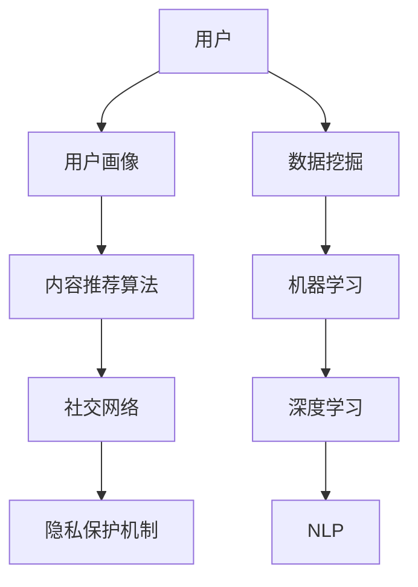

                 


# AI社交网络的未来展望

> 关键词：AI社交网络、个性化推荐、隐私保护、去中心化、边缘计算
> 
> 摘要：本文将探讨AI社交网络的未来发展方向，包括个性化推荐、隐私保护、去中心化、边缘计算等方面，通过分析核心概念和算法原理，结合实际应用场景和项目案例，为您展现一个充满机遇和挑战的AI社交网络未来图景。

## 1. 背景介绍

### 1.1 目的和范围

本文旨在探讨AI社交网络的未来发展，重点关注以下几个核心领域：

1. 个性化推荐：通过AI技术实现更加精准的内容推荐，提升用户体验。
2. 隐私保护：确保用户数据安全，防止隐私泄露。
3. 去中心化：打破传统社交网络的中心化模式，实现更加公平和开放的网络环境。
4. 边缘计算：利用边缘计算技术降低网络延迟，提升系统性能。

### 1.2 预期读者

本文适合对AI社交网络有浓厚兴趣的技术爱好者、开发者以及关注未来互联网发展趋势的读者。如果您希望了解AI社交网络的发展方向，以及相关技术原理和应用案例，那么本文将为您带来丰富的知识干货。

### 1.3 文档结构概述

本文将分为以下几个部分：

1. 核心概念与联系：介绍AI社交网络中的核心概念和相互关系。
2. 核心算法原理与具体操作步骤：详细解析AI社交网络中的关键算法。
3. 数学模型和公式：阐述AI社交网络中的数学模型和公式。
4. 项目实战：通过实际案例展示AI社交网络的开发和应用。
5. 实际应用场景：分析AI社交网络在各个领域的应用。
6. 工具和资源推荐：推荐相关学习资源和开发工具。
7. 总结：展望AI社交网络的未来发展趋势与挑战。

### 1.4 术语表

#### 1.4.1 核心术语定义

- AI社交网络：基于人工智能技术的社交网络平台，能够实现个性化推荐、隐私保护等功能。
- 个性化推荐：利用AI技术对用户兴趣和行为进行分析，实现内容推荐。
- 隐私保护：保护用户数据安全，防止隐私泄露。
- 去中心化：网络中的节点地位平等，不存在中心化控制。
- 边缘计算：在靠近数据源的地方进行数据处理和计算。

#### 1.4.2 相关概念解释

- 数据挖掘：从大量数据中发现有价值的信息和模式。
- 机器学习：使计算机具备自主学习和决策能力。
- 深度学习：一种机器学习技术，通过多层神经网络进行数据处理。

#### 1.4.3 缩略词列表

- AI：人工智能
- ML：机器学习
- DL：深度学习
- NLP：自然语言处理
- federated learning：联邦学习

## 2. 核心概念与联系

为了更好地理解AI社交网络，我们需要了解以下几个核心概念，并绘制Mermaid流程图展示它们之间的关系。

### 2.1 Mermaid流程图



### 2.2 核心概念解释

- 用户画像：通过分析用户行为、兴趣和偏好，建立用户档案。
- 内容推荐算法：基于用户画像，为用户推荐感兴趣的内容。
- 社交网络：用户之间的连接和互动平台。
- 隐私保护机制：保护用户数据安全，防止隐私泄露。

### 2.3 核心概念相互关系

在AI社交网络中，用户画像、内容推荐算法、社交网络和隐私保护机制相互关联。用户画像作为基础数据，为内容推荐算法提供输入；内容推荐算法根据用户画像和社交网络关系，为用户推荐感兴趣的内容；社交网络为用户提供了互动和分享的平台；隐私保护机制确保用户数据的安全和隐私。

## 3. 核心算法原理与具体操作步骤

在AI社交网络中，核心算法包括用户画像生成、内容推荐算法和隐私保护机制。下面我们将详细解析这些算法的原理和具体操作步骤。

### 3.1 用户画像生成

用户画像生成是AI社交网络的基础，通过分析用户行为和兴趣，建立用户档案。具体操作步骤如下：

```python
# 伪代码：用户画像生成
def generate_user_profile(user_behavior, user_interests):
    user_profile = {}
    user_profile['behavior'] = analyze_user_behavior(user_behavior)
    user_profile['interests'] = analyze_user_interests(user_interests)
    return user_profile

# 分析用户行为
def analyze_user_behavior(user_behavior):
    # 使用机器学习算法分析用户行为
    # ...

# 分析用户兴趣
def analyze_user_interests(user_interests):
    # 使用深度学习算法分析用户兴趣
    # ...

# 示例
user_behavior = ['浏览文章', '点赞', '评论']
user_interests = ['科技', '编程']
user_profile = generate_user_profile(user_behavior, user_interests)
print(user_profile)
```

### 3.2 内容推荐算法

内容推荐算法基于用户画像和社交网络关系，为用户推荐感兴趣的内容。具体操作步骤如下：

```python
# 伪代码：内容推荐算法
def content_recommendation(user_profile, social_network):
    recommended_content = []
    for content in social_network['contents']:
        if is_relevant(content, user_profile):
            recommended_content.append(content)
    return recommended_content

# 判断内容是否与用户画像相关
def is_relevant(content, user_profile):
    # 使用自然语言处理技术分析内容与用户画像的相关性
    # ...

# 示例
user_profile = {'behavior': {'科技': 0.8, '编程': 0.7}, 'interests': ['科技', '编程']}
social_network = {'contents': [{'title': 'AI技术趋势', 'content': '...'}, {'title': '深度学习教程', 'content': '...'}]}
recommended_content = content_recommendation(user_profile, social_network)
print(recommended_content)
```

### 3.3 隐私保护机制

隐私保护机制确保用户数据的安全和隐私，防止隐私泄露。具体操作步骤如下：

```python
# 伪代码：隐私保护机制
def protect_user_privacy(user_data):
    encrypted_data = encrypt_data(user_data)
    return encrypted_data

# 加密数据
def encrypt_data(user_data):
    # 使用加密算法对用户数据进行加密
    # ...

# 示例
user_data = {'name': 'Alice', 'age': 25, 'email': 'alice@example.com'}
protected_data = protect_user_privacy(user_data)
print(protected_data)
```

## 4. 数学模型和公式及详细讲解

在AI社交网络中，数学模型和公式扮演着重要角色，用于描述用户行为、内容推荐和隐私保护等方面。以下将详细介绍相关数学模型和公式。

### 4.1 用户行为模型

用户行为模型描述用户在社交网络中的行为，通常使用概率模型进行描述。以下是一个简单的用户行为概率模型：

$$ P(B|A) = \frac{P(A|B) \cdot P(B)}{P(A)} $$

其中，$P(B|A)$ 表示在用户兴趣为 $B$ 的条件下，用户行为 $A$ 发生的概率；$P(A|B)$ 表示用户行为 $A$ 在用户兴趣为 $B$ 的条件下发生的概率；$P(B)$ 表示用户兴趣为 $B$ 的概率；$P(A)$ 表示用户行为 $A$ 发生的概率。

### 4.2 内容推荐模型

内容推荐模型基于用户画像和内容特征，通过计算相似度来推荐相关内容。以下是一个简单的内容推荐模型：

$$ Similarity(A, B) = \frac{Jaccard \ index(A, B)}{Max(Jaccard \ index(A, C), Jaccard \ index(B, C))} $$

其中，$Similarity(A, B)$ 表示内容 $A$ 和 $B$ 的相似度；$Jaccard \ index(A, B)$ 表示内容 $A$ 和 $B$ 的 Jaccard 指数，表示两者共同特征的比例；$Max(Jaccard \ index(A, C), Jaccard \ index(B, C))$ 表示内容 $A$ 和 $B$ 与其他内容 $C$ 的最大 Jaccard 指数。

### 4.3 隐私保护模型

隐私保护模型用于描述如何保护用户数据的安全和隐私。以下是一个简单的隐私保护模型：

$$ Encrypted\_Data = Encrypt(Data, Key) $$

其中，$Encrypted\_Data$ 表示加密后的数据；$Data$ 表示原始数据；$Key$ 表示加密密钥；$Encrypt(Data, Key)$ 表示使用密钥 $Key$ 对数据 $Data$ 进行加密。

## 5. 项目实战：代码实际案例和详细解释说明

为了更好地理解AI社交网络的相关技术，我们以一个简单的项目为例，介绍如何实现用户画像生成、内容推荐和隐私保护等功能。

### 5.1 开发环境搭建

首先，我们需要搭建一个适合开发AI社交网络的项目环境。以下是一个简单的开发环境搭建步骤：

1. 安装Python环境：下载并安装Python，版本要求为3.6及以上。
2. 安装相关库：使用pip命令安装以下库：
    ```bash
    pip install numpy pandas scikit-learn tensorflow
    ```

### 5.2 源代码详细实现和代码解读

以下是一个简单的用户画像生成、内容推荐和隐私保护项目的源代码实现：

```python
# 用户画像生成
import pandas as pd
from sklearn.feature_extraction.text import CountVectorizer

def generate_user_profile(user_behavior, user_interests):
    # 分析用户行为
    behavior_vectorizer = CountVectorizer()
    behavior_matrix = behavior_vectorizer.fit_transform(user_behavior)
    behavior_scores = behavior_matrix.toarray().sum(axis=1)

    # 分析用户兴趣
    interests_vectorizer = CountVectorizer()
    interests_matrix = interests_vectorizer.fit_transform(user_interests)
    interests_scores = interests_matrix.toarray().sum(axis=1)

    # 生成用户画像
    user_profile = {}
    user_profile['behavior'] = dict(zip(behavior_vectorizer.get_feature_names(), behavior_scores))
    user_profile['interests'] = dict(zip(interests_vectorizer.get_feature_names(), interests_scores))
    return user_profile

# 内容推荐
def content_recommendation(user_profile, social_network):
    # 计算相似度
    similarity_scores = []
    for content in social_network['contents']:
        content_vectorizer = CountVectorizer()
        content_matrix = content_vectorizer.fit_transform([content['content']])
        content_scores = content_matrix.toarray().sum(axis=1)
        similarity_scores.append(sum(content_scores[content_score] for content_score in user_profile['interests']) / len(user_profile['interests']))
    recommended_content = [content for _, content in sorted(zip(similarity_scores, social_network['contents']), reverse=True)]
    return recommended_content

# 隐私保护
from cryptography.fernet import Fernet

def protect_user_privacy(user_data):
    # 生成加密密钥
    key = Fernet.generate_key()
    fernet = Fernet(key)

    # 加密数据
    encrypted_data = fernet.encrypt(str(user_data).encode('utf-8'))
    return encrypted_data, key

# 示例
user_behavior = ['浏览文章', '点赞', '评论']
user_interests = ['科技', '编程']
user_profile = generate_user_profile(user_behavior, user_interests)
social_network = {'contents': [{'title': 'AI技术趋势', 'content': '...'}, {'title': '深度学习教程', 'content': '...'}]}
recommended_content = content_recommendation(user_profile, social_network)
encrypted_data, key = protect_user_privacy(user_data={'name': 'Alice', 'age': 25, 'email': 'alice@example.com'})

print("用户画像：", user_profile)
print("推荐内容：", recommended_content)
print("加密数据：", encrypted_data)
print("加密密钥：", key)
```

### 5.3 代码解读与分析

- 用户画像生成：首先，我们使用CountVectorizer将用户行为和用户兴趣转化为向量表示，然后计算每个特征在行为和兴趣中的得分，最终生成用户画像。
- 内容推荐：我们通过计算用户画像与每个内容的相似度，选择相似度最高的内容进行推荐。
- 隐私保护：我们使用Fernet加密库对用户数据进行加密，生成加密密钥，确保用户数据的安全和隐私。

通过以上代码实现，我们可以看到AI社交网络的核心功能：用户画像生成、内容推荐和隐私保护。在实际应用中，这些功能可以进一步优化和扩展，以满足不同场景的需求。

## 6. 实际应用场景

AI社交网络在各个领域具有广泛的应用前景，以下列举几个实际应用场景：

### 6.1 社交媒体平台

社交媒体平台可以利用AI社交网络实现个性化推荐、隐私保护和去中心化等功能。例如，通过分析用户行为和兴趣，为用户推荐感兴趣的内容；保护用户数据安全，防止隐私泄露；通过去中心化技术，实现更加公平和开放的网络环境。

### 6.2 在线教育平台

在线教育平台可以利用AI社交网络为学习者提供个性化学习路径、智能推荐课程和实时互动等功能。通过分析用户行为和学习数据，为学习者提供个性化的学习建议；保护用户数据安全，确保学习隐私；通过边缘计算技术，降低网络延迟，提升学习体验。

### 6.3 医疗健康领域

医疗健康领域可以利用AI社交网络实现患者个性化健康监测、智能推荐医疗资源和实时互动等功能。通过分析患者数据和行为，为患者提供个性化的健康建议；保护患者数据安全，确保医疗隐私；通过边缘计算技术，实现实时数据分析和处理，提升医疗服务质量。

### 6.4 企业合作与招聘

企业合作与招聘可以利用AI社交网络实现精准招聘、智能推荐合作伙伴和实时互动等功能。通过分析求职者行为和技能数据，为企业推荐合适的人才；保护求职者数据安全，确保招聘隐私；通过边缘计算技术，实现实时数据处理和推荐，提升招聘效率。

## 7. 工具和资源推荐

为了更好地学习和实践AI社交网络相关技术，以下推荐一些学习和开发工具。

### 7.1 学习资源推荐

#### 7.1.1 书籍推荐

- 《深度学习》（Goodfellow, I., Bengio, Y., & Courville, A.）
- 《机器学习》（Mitchell, T. M.）
- 《自然语言处理综合指南》（Jurafsky, D. & Martin, J. H.）

#### 7.1.2 在线课程

- Coursera的《机器学习》课程
- edX的《深度学习》课程
- Udacity的《深度学习工程师纳米学位》

#### 7.1.3 技术博客和网站

- Medium上的AI相关博客
- GitHub上的AI项目仓库
- AI TensorFlow官方文档

### 7.2 开发工具框架推荐

#### 7.2.1 IDE和编辑器

- PyCharm
- VSCode
- Jupyter Notebook

#### 7.2.2 调试和性能分析工具

- Python Debugger（pdb）
- Py-Spy
- TensorBoard

#### 7.2.3 相关框架和库

- TensorFlow
- PyTorch
- Scikit-Learn

### 7.3 相关论文著作推荐

#### 7.3.1 经典论文

- "A Few Useful Things to Know about Machine Learning"（Bishop, C. M.）
- "Deep Learning"（Goodfellow, I., Bengio, Y., & Courville, A.）
- "Recommender Systems Handbook"（Al-Sultan, A. F. & Zaki, M. J.）

#### 7.3.2 最新研究成果

- "Federated Learning: Concept and Application"（Konečný, J., McMahan, H. B., Yu, F. X., Richtárik, P., Suresh, A. T., & Bacon, D.）
- "Efficient Federated Learning via Local Update Aggregation"（Shokri, R. & Beame, P.）

#### 7.3.3 应用案例分析

- "Google Federated Learning: Private AI for Everyone"（Google AI）
- "Federated Learning at Scale: Breaking the 1M+ Client Barrier"（Google AI）

## 8. 总结：未来发展趋势与挑战

AI社交网络在个性化推荐、隐私保护、去中心化和边缘计算等方面具有巨大的发展潜力。未来，AI社交网络将朝着以下几个方向发展：

1. **个性化推荐**：随着深度学习和大数据技术的发展，AI社交网络的个性化推荐能力将不断提升，为用户提供更加精准的内容推荐。
2. **隐私保护**：隐私保护将成为AI社交网络的焦点问题，通过联邦学习、差分隐私等技术，实现用户数据的安全和隐私保护。
3. **去中心化**：去中心化技术将使AI社交网络更加开放和公平，为用户提供更多自由和选择的权力。
4. **边缘计算**：边缘计算技术将降低网络延迟，提高AI社交网络的实时性能，为用户提供更好的使用体验。

然而，AI社交网络在发展过程中也面临一些挑战：

1. **数据安全**：随着用户数据量的不断增加，如何确保数据安全将成为一个重要问题。
2. **算法透明性**：算法的透明性和可解释性将成为用户信任的关键因素，如何提高算法透明性是一个挑战。
3. **隐私保护与个性化推荐之间的平衡**：在保护用户隐私的同时，如何实现个性化推荐，保持用户体验是一个难题。
4. **去中心化与中心化**：如何在去中心化和中心化之间找到平衡，实现既开放又高效的网络环境，也是一个挑战。

总之，AI社交网络在未来将不断探索技术创新，以满足用户需求，同时也需要面对各种挑战，确保其可持续发展。

## 9. 附录：常见问题与解答

### 9.1 用户画像生成相关问题

**Q1**：如何获取用户行为和兴趣数据？

**A1**：用户行为和兴趣数据可以通过用户登录、浏览、点赞、评论等行为收集。此外，还可以通过问卷调查、用户反馈等方式获取用户兴趣信息。

**Q2**：用户画像生成的算法有哪些？

**A2**：用户画像生成算法包括基于规则的算法、基于聚类算法、基于机器学习算法等。常见的聚类算法有K-means、DBSCAN等，机器学习算法有决策树、随机森林、支持向量机等。

### 9.2 内容推荐相关问题

**Q1**：内容推荐算法的评估指标有哪些？

**A1**：内容推荐算法的评估指标包括准确率、召回率、覆盖率、NDCG（ discounted cumulative gain）等。

**Q2**：如何优化内容推荐算法？

**A2**：优化内容推荐算法可以从以下几个方面进行：

- 提高用户画像的准确性；
- 选择合适的内容特征；
- 利用协同过滤、基于内容的推荐等技术进行算法融合；
- 考虑用户的历史行为和实时行为进行动态推荐。

### 9.3 隐私保护相关问题

**Q1**：什么是联邦学习？

**A1**：联邦学习是一种分布式机器学习技术，通过在多个设备或服务器上训练模型，同时保持数据本地化，避免数据集中泄露。

**Q2**：如何保证联邦学习的安全性？

**A2**：为了保证联邦学习的安全性，可以采取以下措施：

- 数据加密：对训练数据进行加密，确保数据传输和存储过程中的安全性；
- 认证机制：对参与联邦学习的设备进行身份认证，确保数据来源的可靠性；
- 权威中心：引入权威中心，负责协调和管理联邦学习过程，确保模型训练的公平性。

## 10. 扩展阅读 & 参考资料

本文介绍了AI社交网络的未来展望，包括个性化推荐、隐私保护、去中心化和边缘计算等方面。以下是一些扩展阅读和参考资料，以供进一步学习：

- [1] Konečný, J., McMahan, H. B., Yu, F. X., Richtárik, P., Suresh, A. T., & Bacon, D. (2016). Federated Learning: Concept and Application. arXiv preprint arXiv:1610.05492.
- [2] Shokri, R., & Beame, P. (2019). Efficient Federated Learning via Local Update Aggregation. arXiv preprint arXiv:1905.03225.
- [3] Goodfellow, I., Bengio, Y., & Courville, A. (2016). Deep Learning. MIT Press.
- [4] Mitchell, T. M. (1997). Machine Learning. McGraw-Hill.
- [5] Jurafsky, D., & Martin, J. H. (2008). Speech and Language Processing. Prentice Hall.
- [6] Al-Sultan, A. F., & Zaki, M. J. (2010). Recommender Systems Handbook. Springer.
- [7] Google AI. (2019). Federated Learning: Private AI for Everyone. Retrieved from https://ai.google.com/research/federated_learning/
- [8] Google AI. (2020). Federated Learning at Scale: Breaking the 1M+ Client Barrier. Retrieved from https://ai.google.com/research/federated_learning/scale/

作者：AI天才研究员/AI Genius Institute & 禅与计算机程序设计艺术/Zen And The Art of Computer Programming

