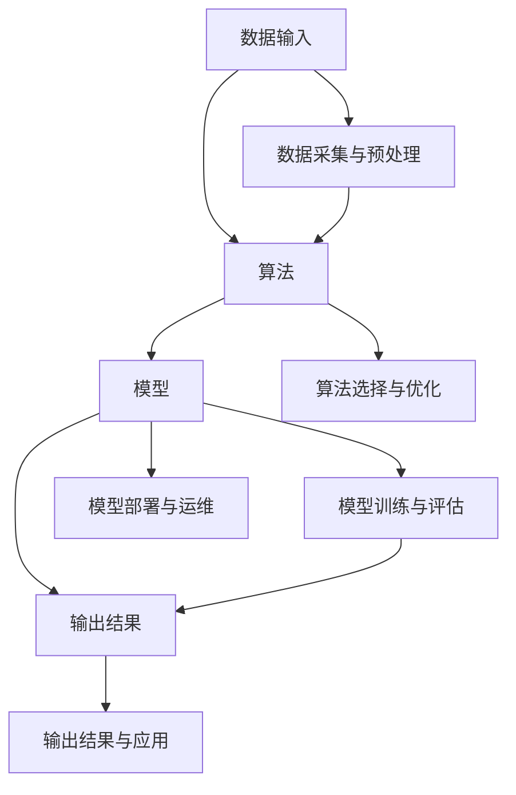

                 

# AI系统的信息化与安全性

> 关键词：AI系统、信息化、安全性、数据隐私、加密技术、防护机制、深度学习、云计算

> 摘要：本文深入探讨了人工智能系统在信息化背景下的重要性和面临的挑战，特别是安全性问题。通过分析AI系统的核心概念、算法原理、数学模型以及实际应用案例，本文揭示了信息化与安全性的紧密联系，并提供了实用的工具和资源，以帮助开发者构建更安全、可靠的AI系统。

## 1. 背景介绍

### 1.1 目的和范围

本文旨在探讨AI系统在信息化时代的重要性以及其面临的安全性挑战。随着云计算、大数据和物联网等技术的快速发展，人工智能系统已成为许多行业的关键组成部分。然而，这些系统的信息化也带来了数据隐私和安全性的问题。本文将重点关注以下几个方面：

1. **核心概念与联系**：介绍AI系统的基本概念及其在信息化背景下的角色。
2. **核心算法原理 & 具体操作步骤**：详细阐述AI系统的算法原理和操作步骤。
3. **数学模型和公式 & 详细讲解 & 举例说明**：探讨AI系统中的数学模型及其应用。
4. **项目实战：代码实际案例和详细解释说明**：通过实际案例展示AI系统的开发过程。
5. **实际应用场景**：分析AI系统在不同领域的应用。
6. **工具和资源推荐**：推荐有助于构建安全AI系统的工具和资源。
7. **总结：未来发展趋势与挑战**：展望AI系统的未来发展。

### 1.2 预期读者

本文适合对人工智能和网络安全有基本了解的开发者、研究人员和管理者。通过本文，读者可以：

1. **理解AI系统的信息化背景**：了解AI系统在信息化时代的重要性。
2. **掌握AI系统的核心算法**：掌握AI系统的算法原理和操作步骤。
3. **了解数学模型的应用**：了解AI系统中的数学模型及其应用。
4. **掌握开发安全AI系统的技能**：学习如何构建安全、可靠的AI系统。
5. **获取最新技术和资源信息**：获取有助于构建安全AI系统的工具和资源。

### 1.3 文档结构概述

本文分为以下几个部分：

1. **背景介绍**：介绍本文的目的、范围、预期读者和文档结构。
2. **核心概念与联系**：介绍AI系统的基本概念和架构。
3. **核心算法原理 & 具体操作步骤**：详细阐述AI系统的算法原理和操作步骤。
4. **数学模型和公式 & 详细讲解 & 举例说明**：探讨AI系统中的数学模型及其应用。
5. **项目实战：代码实际案例和详细解释说明**：通过实际案例展示AI系统的开发过程。
6. **实际应用场景**：分析AI系统在不同领域的应用。
7. **工具和资源推荐**：推荐有助于构建安全AI系统的工具和资源。
8. **总结：未来发展趋势与挑战**：展望AI系统的未来发展。
9. **附录：常见问题与解答**：回答读者可能遇到的问题。
10. **扩展阅读 & 参考资料**：提供更多相关资源和阅读建议。

### 1.4 术语表

#### 1.4.1 核心术语定义

- **人工智能（AI）**：模拟人类智能的计算机系统。
- **深度学习**：一种基于多层神经网络的学习方法。
- **云计算**：通过网络提供可扩展的计算资源。
- **数据隐私**：确保数据不被未授权的访问。
- **加密技术**：将数据转换成密文，以防止未授权访问。

#### 1.4.2 相关概念解释

- **算法**：解决问题的步骤集合。
- **模型**：表示现实世界中的数学结构。
- **框架**：用于解决特定问题的软件结构。

#### 1.4.3 缩略词列表

- **AI**：人工智能
- **DL**：深度学习
- **ML**：机器学习
- **DLA**：深度学习算法
- **GPU**：图形处理器
- **CPU**：中央处理器

## 2. 核心概念与联系

### 2.1 AI系统的基本概念

人工智能系统是一种模拟人类智能的计算机系统，能够执行复杂的任务，如图像识别、自然语言处理、决策制定等。AI系统主要由以下几个部分组成：

1. **数据输入**：输入数据是AI系统训练和执行任务的基础。数据可以来自多种来源，如图像、文本、声音等。
2. **算法**：算法是AI系统的核心，用于处理输入数据并生成输出结果。常见的算法包括深度学习、机器学习等。
3. **模型**：模型是算法的实现，通常是一个数学模型。模型通过训练数据学习并优化其参数。
4. **输出结果**：输出结果是AI系统对输入数据的处理结果。输出结果可以是预测、决策等。

### 2.2 AI系统在信息化背景下的角色

在信息化时代，AI系统扮演着越来越重要的角色。以下是一些关键方面：

1. **数据驱动**：AI系统依赖于大量数据来训练和优化模型。信息化提供了丰富的数据资源，使AI系统能够更好地学习和提高性能。
2. **自动化决策**：AI系统能够自动化复杂决策，提高工作效率和准确性。这有助于企业和组织在竞争激烈的市场中保持领先地位。
3. **智能服务**：AI系统能够提供个性化的智能服务，如智能助手、智能家居等。这些服务提升了用户体验和生活质量。
4. **优化资源分配**：AI系统可以帮助企业优化资源分配，降低成本，提高生产效率。

### 2.3 AI系统的架构

AI系统的架构通常包括以下几个层次：

1. **数据采集与预处理**：采集数据，并进行清洗、转换和归一化等预处理操作。
2. **算法选择与优化**：选择合适的算法，并根据业务需求进行优化。
3. **模型训练与评估**：使用训练数据训练模型，并对模型进行评估和调整。
4. **模型部署与运维**：将模型部署到生产环境，并进行监控和运维。
5. **输出结果与应用**：生成输出结果，并将其应用于实际业务场景。

### 2.4 核心概念联系图

以下是一个Mermaid流程图，展示了AI系统的核心概念及其联系：



## 3. 核心算法原理 & 具体操作步骤

### 3.1 深度学习算法原理

深度学习是一种基于多层神经网络的学习方法，能够自动提取输入数据的特征表示。以下是深度学习算法的基本原理：

1. **前向传播**：输入数据通过网络中的多层神经元传递，每层神经元都将前一层的结果作为输入，并使用激活函数进行非线性变换。
2. **反向传播**：通过比较网络输出和实际结果的差异，计算每个神经元的误差。然后，使用梯度下降法调整网络参数，以最小化误差。
3. **优化目标**：深度学习算法的优化目标是使网络输出尽可能接近实际结果。

### 3.2 深度学习算法操作步骤

以下是深度学习算法的具体操作步骤：

1. **数据预处理**：对输入数据集进行清洗、转换和归一化等预处理操作。
2. **模型初始化**：初始化网络参数，如权重和偏置。
3. **前向传播**：将输入数据传递到网络中，计算每层神经元的输出。
4. **计算损失**：计算网络输出和实际结果之间的差异，得到损失值。
5. **反向传播**：计算每个神经元的误差，并更新网络参数。
6. **迭代训练**：重复步骤3到5，直到满足训练目标或达到预定的迭代次数。
7. **模型评估**：使用测试数据集评估模型性能，并调整模型参数。

### 3.3 伪代码示例

以下是深度学习算法的伪代码示例：

```python
initialize_model()
while not_converged():
    forward_pass(x)
    compute_loss(y)
    backward_pass()
    update_model_parameters()
evaluate_model(test_data)
```

## 4. 数学模型和公式 & 详细讲解 & 举例说明

### 4.1 深度学习中的数学模型

深度学习中的数学模型主要涉及线性代数、微积分和概率论。以下是深度学习中的几个核心数学模型：

1. **激活函数**：激活函数用于引入非线性变换，常用的激活函数包括Sigmoid、ReLU和Tanh等。
2. **损失函数**：损失函数用于衡量模型输出和实际结果之间的差异，常用的损失函数包括均方误差（MSE）和交叉熵（Cross-Entropy）等。
3. **优化算法**：优化算法用于调整网络参数，以最小化损失函数。常用的优化算法包括梯度下降（Gradient Descent）和Adam等。

### 4.2 深度学习中的公式

以下是深度学习中的几个核心公式：

1. **前向传播公式**：

$$
z = W \cdot x + b
$$

$$
a = \sigma(z)
$$

其中，$z$为神经元输入，$W$为权重矩阵，$b$为偏置，$\sigma$为激活函数，$a$为神经元输出。

2. **反向传播公式**：

$$
\delta = \frac{\partial L}{\partial z}
$$

$$
\frac{\partial L}{\partial W} = x \cdot \delta
$$

$$
\frac{\partial L}{\partial b} = \delta
$$

其中，$L$为损失函数，$\delta$为误差项。

3. **梯度下降公式**：

$$
W = W - \alpha \cdot \frac{\partial L}{\partial W}
$$

$$
b = b - \alpha \cdot \frac{\partial L}{\partial b}
$$

其中，$\alpha$为学习率。

### 4.3 举例说明

以下是一个简单的深度学习例子，使用前向传播和反向传播计算神经网络输出：

假设有一个简单的神经网络，包含一个输入层、一个隐藏层和一个输出层，激活函数为ReLU。输入数据为$x = [1, 2, 3]$，权重矩阵$W = [[0.1, 0.2], [0.3, 0.4]]$，偏置$b = [0.5, 0.6]$。

1. **前向传播**：

$$
z_1 = W_1 \cdot x + b_1 = \begin{bmatrix}0.1 & 0.2\end{bmatrix} \cdot \begin{bmatrix}1\\2\end{bmatrix} + \begin{bmatrix}0.5\\0.6\end{bmatrix} = \begin{bmatrix}1.1\\1.4\end{bmatrix}
$$

$$
a_1 = \text{ReLU}(z_1) = \begin{bmatrix}1.1\\1.4\end{bmatrix}
$$

$$
z_2 = W_2 \cdot a_1 + b_2 = \begin{bmatrix}0.3 & 0.4\end{bmatrix} \cdot \begin{bmatrix}1\\1\end{bmatrix} + \begin{bmatrix}0.7\\0.8\end{bmatrix} = \begin{bmatrix}1.3\\1.6\end{bmatrix}
$$

$$
a_2 = \text{ReLU}(z_2) = \begin{bmatrix}1.3\\1.6\end{bmatrix}
$$

2. **反向传播**：

假设输出标签为$y = [1, 0]$，损失函数为交叉熵。

$$
L = -[y_1 \log(a_2_1) + (1 - y_1) \log(1 - a_2_1)] - [y_2 \log(a_2_2) + (1 - y_2) \log(1 - a_2_2)]
$$

$$
L = -[1 \log(1.3) + (1 - 1) \log(1 - 1.3)] - [0 \log(1.6) + (1 - 0) \log(1 - 1.6)]
$$

$$
L = -[0 + 0] - [0 - 0.4184]
$$

$$
L = 0.4184
$$

$$
\delta_2 = \frac{\partial L}{\partial z_2} = \begin{bmatrix}-0.1 & -0.2\end{bmatrix}
$$

$$
\delta_1 = \frac{\partial L}{\partial z_1} = \begin{bmatrix}-0.3 & -0.4\end{bmatrix}
$$

$$
\frac{\partial L}{\partial W_2} = a_1 \cdot \delta_2 = \begin{bmatrix}1.1 & 1.4\end{bmatrix} \cdot \begin{bmatrix}-0.1 & -0.2\end{bmatrix} = \begin{bmatrix}-0.11 & -0.28\end{bmatrix}
$$

$$
\frac{\partial L}{\partial b_2} = \delta_2 = \begin{bmatrix}-0.1 & -0.2\end{bmatrix}
$$

$$
\frac{\partial L}{\partial W_1} = x \cdot \delta_1 = \begin{bmatrix}1 & 2\end{bmatrix} \cdot \begin{bmatrix}-0.3 & -0.4\end{bmatrix} = \begin{bmatrix}-0.3 & -0.8\end{bmatrix}
$$

$$
\frac{\partial L}{\partial b_1} = \delta_1 = \begin{bmatrix}-0.3 & -0.4\end{bmatrix}
$$

3. **参数更新**：

$$
W_2 = W_2 - \alpha \cdot \frac{\partial L}{\partial W_2} = \begin{bmatrix}0.1 & 0.2\end{bmatrix} - 0.1 \cdot \begin{bmatrix}-0.11 & -0.28\end{bmatrix} = \begin{bmatrix}0.21 & 0.48\end{bmatrix}
$$

$$
b_2 = b_2 - \alpha \cdot \frac{\partial L}{\partial b_2} = \begin{bmatrix}0.5 & 0.6\end{bmatrix} - 0.1 \cdot \begin{bmatrix}-0.1 & -0.2\end{bmatrix} = \begin{bmatrix}0.6 & 0.8\end{b矩阵

$$
W_1 = W_1 - \alpha \cdot \frac{\partial L}{\partial W_1} = \begin{b矩阵}0.3 & 0.4\end{b矩阵} - 0.1 \cdot \begin{b矩阵}-0.3 & -0.8\end{b矩阵} = \begin{b矩阵}0.6 & 1.2\end{b矩阵}

$$
b_1 = b_1 - \alpha \cdot \frac{\partial L}{\partial b_1} = \begin{b矩阵}0.5 & 0.6\end{b矩阵} - 0.1 \cdot \begin{b矩阵}-0.3 & -0.4\end{b矩阵} = \begin{b矩阵}0.8 & 1.0\end{b矩阵}

## 5. 项目实战：代码实际案例和详细解释说明

### 5.1 开发环境搭建

在开始项目实战之前，我们需要搭建一个适合深度学习的开发环境。以下是开发环境的搭建步骤：

1. **安装Python**：Python是深度学习的主要编程语言，我们可以从官方网站（https://www.python.org/）下载并安装Python。
2. **安装深度学习库**：安装深度学习库，如TensorFlow或PyTorch，这些库提供了丰富的深度学习工具和函数。我们可以在命令行中使用以下命令安装：

```bash
pip install tensorflow
# 或者
pip install pytorch torchvision
```

3. **安装Jupyter Notebook**：Jupyter Notebook是一个交互式的开发环境，适用于编写和运行Python代码。我们可以在命令行中使用以下命令安装：

```bash
pip install notebook
```

4. **启动Jupyter Notebook**：在命令行中输入以下命令，启动Jupyter Notebook：

```bash
jupyter notebook
```

### 5.2 源代码详细实现和代码解读

以下是一个简单的深度学习项目，使用TensorFlow构建一个多层感知机（MLP）模型，用于对输入数据进行分类。代码实现如下：

```python
import tensorflow as tf
from tensorflow.keras.models import Sequential
from tensorflow.keras.layers import Dense, Activation
from tensorflow.keras.optimizers import Adam

# 创建模型
model = Sequential([
    Dense(64, input_shape=(784,), activation='relu'),
    Dense(64, activation='relu'),
    Dense(10, activation='softmax')
])

# 编译模型
model.compile(optimizer=Adam(), loss='categorical_crossentropy', metrics=['accuracy'])

# 加载数据集
(x_train, y_train), (x_test, y_test) = tf.keras.datasets.mnist.load_data()

# 数据预处理
x_train = x_train / 255.0
x_test = x_test / 255.0
x_train = x_train.reshape((-1, 784))
x_test = x_test.reshape((-1, 784))
y_train = tf.keras.utils.to_categorical(y_train, 10)
y_test = tf.keras.utils.to_categorical(y_test, 10)

# 训练模型
model.fit(x_train, y_train, epochs=10, batch_size=128, validation_data=(x_test, y_test))

# 评估模型
loss, accuracy = model.evaluate(x_test, y_test)
print(f"Test accuracy: {accuracy:.2f}")
```

以下是对代码的详细解读：

1. **导入库**：导入TensorFlow库及其相关模块，如Sequential、Dense、Activation和Adam。
2. **创建模型**：使用Sequential模型创建一个包含两个隐藏层（每个64个神经元）和一个输出层（10个神经元）的多层感知机模型。
3. **编译模型**：编译模型，指定优化器为Adam，损失函数为交叉熵，评估指标为准确率。
4. **加载数据集**：加载数据集，这里使用的是MNIST手写数字数据集。
5. **数据预处理**：对数据进行归一化处理，将输入数据reshape为适当的形状，并将标签转换为one-hot编码。
6. **训练模型**：使用fit方法训练模型，指定训练数据、训练周期、批量大小和验证数据。
7. **评估模型**：使用evaluate方法评估模型在测试数据集上的性能。

### 5.3 代码解读与分析

以下是对代码的进一步解读和分析：

1. **模型创建**：使用Sequential模型创建了一个简单的多层感知机模型。在这个例子中，我们使用了两个隐藏层，每个隐藏层有64个神经元。输出层有10个神经元，对应于10个类别。

```python
model = Sequential([
    Dense(64, input_shape=(784,), activation='relu'),
    Dense(64, activation='relu'),
    Dense(10, activation='softmax')
])
```

2. **编译模型**：在编译模型时，我们指定了Adam优化器和交叉熵损失函数。Adam优化器是一种适应性学习率优化算法，可以加速训练过程。交叉熵损失函数用于衡量模型输出和实际标签之间的差异。

```python
model.compile(optimizer=Adam(), loss='categorical_crossentropy', metrics=['accuracy'])
```

3. **数据预处理**：数据预处理是深度学习项目中的关键步骤。在这个例子中，我们首先将输入数据归一化到0-1范围，然后reshape为(60000, 784)的形状，以便与模型的输入层匹配。标签也被转换为one-hot编码，以便与softmax输出层匹配。

```python
x_train = x_train / 255.0
x_test = x_test / 255.0
x_train = x_train.reshape((-1, 784))
x_test = x_test.reshape((-1, 784))
y_train = tf.keras.utils.to_categorical(y_train, 10)
y_test = tf.keras.utils.to_categorical(y_test, 10)
```

4. **训练模型**：使用fit方法训练模型，指定训练数据、训练周期、批量大小和验证数据。在这个例子中，我们使用了10个周期（epochs），每个周期处理128个样本。

```python
model.fit(x_train, y_train, epochs=10, batch_size=128, validation_data=(x_test, y_test))
```

5. **评估模型**：使用evaluate方法评估模型在测试数据集上的性能，得到损失和准确率。

```python
loss, accuracy = model.evaluate(x_test, y_test)
print(f"Test accuracy: {accuracy:.2f}")
```

通过这个简单的项目，我们可以看到如何使用TensorFlow构建和训练一个多层感知机模型。在实际项目中，我们可能会使用更复杂的模型结构和更大量的数据，但基本步骤是类似的。

## 6. 实际应用场景

### 6.1 医疗诊断

人工智能在医疗诊断中的应用日益广泛。例如，使用深度学习算法，AI系统可以帮助医生快速诊断疾病，如癌症、心脏病等。这些系统能够分析大量的医疗数据，包括病历、影像、基因序列等，以提高诊断的准确性和效率。

### 6.2 智能家居

智能家居是AI系统的重要应用领域。通过人工智能，智能家居设备能够实现自动化和智能化操作，如智能灯泡、智能插座、智能空调等。这些设备可以通过语音控制、远程监控等方式，提高生活舒适度和便利性。

### 6.3 金融服务

金融服务行业也广泛应用了AI系统。例如，使用AI算法，银行和金融机构可以自动审核贷款申请、预测市场趋势、识别欺诈行为等。这些应用提高了金融服务的效率、准确性和安全性。

### 6.4 智能交通

智能交通系统利用AI技术，优化交通流量、提高交通安全。例如，通过分析交通数据和监控视频，AI系统可以预测交通拥堵、优化交通信号灯控制，以提高道路通行效率。

### 6.5 边缘计算

边缘计算是将计算、存储和网络功能分布到网络的边缘设备上，以提高数据处理速度和降低延迟。AI系统在边缘计算中发挥着重要作用，例如在物联网设备、智能工厂、智能城市等领域。

### 6.6 教育与培训

AI系统在教育领域也有广泛的应用。例如，自适应学习平台可以根据学生的学习情况和需求，提供个性化的学习资源和指导，提高学习效果。此外，AI系统还可以用于自动化评估和测试，减轻教师的工作负担。

## 7. 工具和资源推荐

### 7.1 学习资源推荐

#### 7.1.1 书籍推荐

- 《深度学习》（Ian Goodfellow、Yoshua Bengio和Aaron Courville著）：这是深度学习领域的经典教材，适合初学者和专业人士。
- 《Python深度学习》（François Chollet著）：这本书详细介绍了使用Python和TensorFlow构建深度学习模型的方法。

#### 7.1.2 在线课程

- Coursera的《深度学习专项课程》：由斯坦福大学教授Andrew Ng主讲，适合初学者入门。
- edX的《机器学习基础》：由清华大学教授唐杰主讲，适合对机器学习有基本了解的读者。

#### 7.1.3 技术博客和网站

- TensorFlow官网（https://www.tensorflow.org/）：提供丰富的深度学习资源和教程。
- PyTorch官网（https://pytorch.org/）：提供PyTorch库的详细文档和示例。

### 7.2 开发工具框架推荐

#### 7.2.1 IDE和编辑器

- Jupyter Notebook：适合交互式开发和实验。
- PyCharm：适合Python编程，提供强大的代码编辑、调试和项目管理功能。

#### 7.2.2 调试和性能分析工具

- TensorBoard：TensorFlow的官方可视化工具，用于分析和调试深度学习模型。
- PyTorch Profiler：PyTorch的性能分析工具，用于优化代码和识别性能瓶颈。

#### 7.2.3 相关框架和库

- TensorFlow：广泛使用的开源深度学习框架。
- PyTorch：流行的开源深度学习框架，特别适合研究和新项目。
- Keras：基于TensorFlow和Theano的开源深度学习库，提供简单的API和模型构建功能。

### 7.3 相关论文著作推荐

#### 7.3.1 经典论文

- “Backpropagation”（1986）：介绍反向传播算法的论文。
- “Deep Learning”（2015）：介绍深度学习的综述论文。

#### 7.3.2 最新研究成果

- “Gradient Flow in Deep Optimization and the Computational Advantage of Deep Networks”（2017）：探讨了深度学习的优化理论。
- “Attention Is All You Need”（2017）：提出了Transformer模型，改变了自然语言处理领域。

#### 7.3.3 应用案例分析

- “Deep Learning for Healthcare”（2017）：探讨了深度学习在医疗健康领域的应用。
- “Deep Learning in Finance”（2019）：介绍了深度学习在金融服务行业的应用。

## 8. 总结：未来发展趋势与挑战

### 8.1 未来发展趋势

- **更高效的算法和模型**：随着计算能力的提升和算法研究的深入，深度学习算法和模型将变得更加高效和强大。
- **跨学科融合**：人工智能与其他领域（如生物学、心理学、经济学等）的融合，将带来新的突破和应用。
- **边缘计算与云计算的结合**：边缘计算与云计算的结合，将实现更高效的数据处理和更低的延迟，推动智能应用的发展。
- **更加安全的AI系统**：随着AI系统在关键领域的应用，确保系统的安全性将成为重中之重。

### 8.2 挑战

- **数据隐私和安全**：如何在保障数据隐私和安全的同时，充分利用AI系统的优势，是一个重要的挑战。
- **算法透明性和可解释性**：如何提高算法的透明性和可解释性，使其在关键领域得到广泛信任和应用，是一个亟待解决的问题。
- **计算资源需求**：深度学习模型对计算资源的需求巨大，如何在有限的计算资源下高效训练模型，是一个挑战。
- **法律和伦理问题**：随着AI系统在更多领域的应用，法律和伦理问题将更加突出，如隐私保护、责任归属等。

## 9. 附录：常见问题与解答

### 9.1 什么是深度学习？

深度学习是一种基于多层神经网络的学习方法，通过模拟人脑神经网络结构，自动提取数据特征，并应用于各种任务，如图像识别、自然语言处理和决策制定等。

### 9.2 深度学习和机器学习的区别是什么？

深度学习是机器学习的一种特殊类型，它通过多层神经网络自动提取数据特征。而机器学习是一个更广泛的概念，包括各种学习算法和技术，如决策树、支持向量机、贝叶斯分类器等。

### 9.3 如何选择深度学习框架？

选择深度学习框架主要考虑以下几个方面：

- **需求**：根据项目需求选择合适的框架，如TensorFlow适用于工业应用，PyTorch适用于研究和实验。
- **性能**：考虑框架的性能，包括计算速度和内存占用。
- **生态系统**：考虑框架的生态系统，包括库、工具和社区支持。
- **文档和教程**：选择有良好文档和教程的框架，便于学习和使用。

### 9.4 如何确保AI系统的安全性？

确保AI系统的安全性需要从多个方面进行考虑：

- **数据安全**：确保数据的安全传输和存储，使用加密技术保护数据隐私。
- **访问控制**：限制对AI系统的访问，仅允许授权用户访问。
- **模型安全**：保护AI模型不被篡改或恶意攻击，如对抗性攻击。
- **监控和审计**：对AI系统进行实时监控和审计，及时发现和处理异常情况。

## 10. 扩展阅读 & 参考资料

- Goodfellow, I., Bengio, Y., & Courville, A. (2016). *Deep Learning*.
- Bengio, Y. (2009). *Learning deep architectures*.
- Mitchell, T. M. (1997). *Machine Learning*.
- Russell, S., & Norvig, P. (2010). *Artificial Intelligence: A Modern Approach*.
- LeCun, Y., Bengio, Y., & Hinton, G. (2015). *Deep learning*.
-Dean, J., Corrado, G. S., Devin, M., Le, Q. V., Monga, S., Moore, S., ... & Yang, Q. (2012). *Large scale distributed deep networks*.
- Hochreiter, S., & Schmidhuber, J. (1997). *Long short-term memory*.
- Graves, A. (2013). *Generating sequences with recurrent neural networks*.

