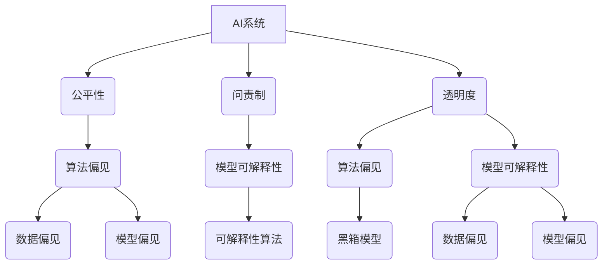

                 

# AI系统的公平性、问责制和透明度

> **关键词**：AI系统、公平性、问责制、透明度、算法偏见、模型可解释性

> **摘要**：本文深入探讨了AI系统的公平性、问责制和透明度这三个关键概念，分析了算法偏见、模型可解释性等相关问题。通过一步步的分析推理，本文提出了具体的实现方法，以及在实际应用场景中的挑战和未来发展趋势。旨在为开发者、研究人员和实践者提供一个系统、全面、易懂的参考指南。

## 1. 背景介绍

### 1.1 目的和范围

本文旨在探讨人工智能（AI）系统在公平性、问责制和透明度方面的关键问题。随着AI技术的飞速发展，越来越多的AI系统被应用到实际场景中，如医疗、金融、招聘等领域。然而，AI系统的公平性、问责制和透明度问题也逐渐凸显，成为学术界和工业界关注的焦点。本文将从以下几个方面展开讨论：

1. **算法偏见**：分析AI系统中的算法偏见现象，探讨其成因和影响。
2. **模型可解释性**：介绍模型可解释性的概念，阐述其重要性，并探讨提高模型可解释性的方法。
3. **问责制和透明度**：分析AI系统的问责制和透明度问题，探讨如何提高系统的透明度和建立有效的问责机制。
4. **实际应用场景**：分析AI系统在不同领域的应用场景，探讨其在公平性、问责制和透明度方面的挑战。
5. **未来发展趋势与挑战**：总结当前的研究成果，探讨未来发展趋势和面临的挑战。

通过以上讨论，本文希望能够为开发者、研究人员和实践者提供一个系统、全面、易懂的参考指南，帮助他们在设计和应用AI系统时更好地处理公平性、问责制和透明度问题。

### 1.2 预期读者

本文的预期读者包括以下几类：

1. **开发者**：对AI系统设计、开发和优化感兴趣的软件开发者。
2. **研究人员**：对AI系统的公平性、问责制和透明度研究感兴趣的学术研究人员。
3. **实践者**：在金融、医疗、招聘等实际领域应用AI系统的实践者。
4. **学生**：对AI系统公平性、问责制和透明度相关课程感兴趣的学生。

通过阅读本文，读者可以了解AI系统在公平性、问责制和透明度方面的重要性和挑战，掌握相关概念和方法，为实际应用提供指导。

### 1.3 文档结构概述

本文分为以下几部分：

1. **背景介绍**：介绍本文的目的、预期读者和文档结构。
2. **核心概念与联系**：介绍AI系统公平性、问责制和透明度的核心概念，并给出相关流程图。
3. **核心算法原理 & 具体操作步骤**：详细讲解核心算法原理，并使用伪代码阐述具体操作步骤。
4. **数学模型和公式 & 详细讲解 & 举例说明**：介绍AI系统相关数学模型和公式，并进行详细讲解和举例说明。
5. **项目实战：代码实际案例和详细解释说明**：提供代码实际案例，详细解释说明关键步骤。
6. **实际应用场景**：分析AI系统在不同领域的应用场景。
7. **工具和资源推荐**：推荐学习资源、开发工具框架和相关论文著作。
8. **总结：未来发展趋势与挑战**：总结当前研究成果，探讨未来发展趋势和挑战。
9. **附录：常见问题与解答**：回答读者可能遇到的问题。
10. **扩展阅读 & 参考资料**：提供相关扩展阅读和参考资料。

通过以上结构，本文希望能够全面、系统地介绍AI系统公平性、问责制和透明度相关问题。

### 1.4 术语表

#### 1.4.1 核心术语定义

- **AI系统**：指使用人工智能技术（如机器学习、深度学习等）进行数据分析和决策的计算机系统。
- **公平性**：指AI系统在处理数据和应用时，对所有人或群体具有一致的公正性。
- **问责制**：指AI系统开发者、用户和管理者对系统行为和结果负责的机制。
- **透明度**：指AI系统的内部工作过程、算法和决策机制对外部用户可解释和可验证的程度。
- **算法偏见**：指AI系统在处理数据和应用时，由于算法设计或数据集选择等原因，对某些群体或个体产生不公平的结果。
- **模型可解释性**：指AI系统内部的工作过程和决策机制对外部用户可以理解和解释的程度。

#### 1.4.2 相关概念解释

- **数据偏见**：指数据集在收集、处理和标注过程中可能存在的偏差和错误，导致AI系统对某些群体或个体产生不公平的结果。
- **模型偏见**：指AI系统在训练和优化过程中，由于算法设计或参数设置等原因，导致系统对某些群体或个体产生不公平的结果。
- **可解释性算法**：指可以解释AI系统内部工作过程和决策机制的算法，使外部用户可以理解和验证系统的决策。
- **黑箱模型**：指无法解释AI系统内部工作过程和决策机制的模型，使外部用户无法理解和验证系统的决策。

#### 1.4.3 缩略词列表

- **AI**：人工智能（Artificial Intelligence）
- **ML**：机器学习（Machine Learning）
- **DL**：深度学习（Deep Learning）
- **GBDT**：梯度提升树（Gradient Boosting Decision Tree）
- **LR**：逻辑回归（Logistic Regression）
- **ROC**：受试者操作特性曲线（Receiver Operating Characteristic）
- **AUC**：曲线下面积（Area Under Curve）
- **FP**：假阳性（False Positive）
- **FN**：假阴性（False Negative）

## 2. 核心概念与联系

在探讨AI系统的公平性、问责制和透明度之前，我们需要明确这些核心概念之间的联系。为了更好地理解这些概念，我们将使用Mermaid流程图来展示它们之间的关系。

### 2.1 流程图



### 2.2 流程图说明

1. **AI系统**：这是整个流程的起点，表示我们需要研究的对象。
2. **公平性**：AI系统应该对所有人或群体具有一致性，避免算法偏见。
3. **问责制**：AI系统的开发者、用户和管理者需要对系统的行为和结果负责。
4. **透明度**：AI系统的内部工作过程、算法和决策机制应该对外部用户可解释和可验证。
5. **算法偏见**：AI系统可能由于算法设计或数据集选择等原因，对某些群体或个体产生不公平的结果。
6. **模型可解释性**：提高模型可解释性可以帮助开发者、用户和管理者理解和验证系统的决策过程。
7. **数据偏见**：数据集在收集、处理和标注过程中可能存在的偏差和错误，导致算法偏见。
8. **模型偏见**：AI系统在训练和优化过程中，由于算法设计或参数设置等原因，可能导致对某些群体或个体产生不公平的结果。

通过以上流程图，我们可以清晰地看到AI系统公平性、问责制和透明度之间的联系，以及算法偏见和模型可解释性在其中的作用。

## 3. 核心算法原理 & 具体操作步骤

为了深入理解AI系统的公平性、问责制和透明度问题，我们需要探讨一些核心算法原理和具体操作步骤。在本节中，我们将使用伪代码来详细阐述这些算法原理。

### 3.1 伪代码框架

```python
# 伪代码：AI系统公平性、问责制和透明度实现框架

# 输入：训练数据集D、测试数据集T、目标变量y
# 输出：训练好的AI模型M、公平性指标F、问责制机制A、透明度报告R

# 步骤1：数据预处理
1. 数据清洗：去除数据集中的异常值、噪声和重复数据
2. 数据归一化：将不同特征的数据进行归一化处理，使其具有相同的量纲
3. 特征选择：选择对模型性能有重要影响的特征，去除无关或冗余特征

# 步骤2：训练模型
4. 模型选择：根据业务需求和数据特点，选择合适的模型算法
5. 模型训练：使用训练数据集D，对模型进行训练
6. 模型评估：使用测试数据集T，评估模型性能

# 步骤3：公平性分析
7. 偏见检测：使用统计学方法，检测模型是否存在算法偏见
8. 偏见修正：根据检测结果，对模型进行修正，消除算法偏见

# 步骤4：问责制机制
9. 决策追踪：记录模型决策过程，实现可追溯性
10. 决策解释：使用可解释性算法，解释模型决策原因和逻辑
11. 决策责任：明确模型开发者、用户和管理者的责任，建立问责制机制

# 步骤5：透明度报告
12. 模型报告：生成模型报告，包括模型结构、参数、性能指标等
13. 决策报告：生成决策报告，包括决策过程、决策结果、决策原因等
14. 风险评估：评估模型决策风险，提出改进建议

# 步骤6：模型部署与维护
15. 模型部署：将训练好的模型部署到生产环境
16. 模型监控：监控模型性能和公平性，及时发现和解决潜在问题
17. 模型更新：根据业务需求，定期更新模型，保持模型性能和公平性
```

### 3.2 步骤详细说明

**步骤1：数据预处理**

1. **数据清洗**：数据清洗是数据预处理的重要步骤，主要目的是去除数据集中的异常值、噪声和重复数据。这可以通过以下方法实现：

    ```python
    # 去除异常值
    D = remove_outliers(D)
    # 去除噪声
    D = remove_noise(D)
    # 去除重复数据
    D = remove_duplicates(D)
    ```

2. **数据归一化**：数据归一化是将不同特征的数据进行归一化处理，使其具有相同的量纲。这可以通过以下方法实现：

    ```python
    # 数据归一化
    D = normalize_data(D)
    ```

3. **特征选择**：特征选择是选择对模型性能有重要影响的特征，去除无关或冗余特征。这可以通过以下方法实现：

    ```python
    # 特征选择
    D = select_features(D)
    ```

**步骤2：训练模型**

1. **模型选择**：根据业务需求和数据特点，选择合适的模型算法。这可以通过以下方法实现：

    ```python
    # 模型选择
    M = select_model()
    ```

2. **模型训练**：使用训练数据集D，对模型进行训练。这可以通过以下方法实现：

    ```python
    # 模型训练
    M = train_model(D, M)
    ```

3. **模型评估**：使用测试数据集T，评估模型性能。这可以通过以下方法实现：

    ```python
    # 模型评估
    performance = evaluate_model(M, T)
    ```

**步骤3：公平性分析**

1. **偏见检测**：使用统计学方法，检测模型是否存在算法偏见。这可以通过以下方法实现：

    ```python
    # 偏见检测
    bias = detect_bias(M, T)
    ```

2. **偏见修正**：根据检测结果，对模型进行修正，消除算法偏见。这可以通过以下方法实现：

    ```python
    # 偏见修正
    M = correct_bias(M, bias)
    ```

**步骤4：问责制机制**

1. **决策追踪**：记录模型决策过程，实现可追溯性。这可以通过以下方法实现：

    ```python
    # 决策追踪
    trace = record_decision_process(M, T)
    ```

2. **决策解释**：使用可解释性算法，解释模型决策原因和逻辑。这可以通过以下方法实现：

    ```python
    # 决策解释
    explanation = explain_decision(M, T)
    ```

3. **决策责任**：明确模型开发者、用户和管理者的责任，建立问责制机制。这可以通过以下方法实现：

    ```python
    # 决策责任
    responsibility = define_responsibility()
    ```

**步骤5：透明度报告**

1. **模型报告**：生成模型报告，包括模型结构、参数、性能指标等。这可以通过以下方法实现：

    ```python
    # 模型报告
    model_report = generate_model_report(M)
    ```

2. **决策报告**：生成决策报告，包括决策过程、决策结果、决策原因等。这可以通过以下方法实现：

    ```python
    # 决策报告
    decision_report = generate_decision_report(M, T)
    ```

3. **风险评估**：评估模型决策风险，提出改进建议。这可以通过以下方法实现：

    ```python
    # 风险评估
    risk_evaluation = assess_decision_risk(M, T)
    ```

**步骤6：模型部署与维护**

1. **模型部署**：将训练好的模型部署到生产环境。这可以通过以下方法实现：

    ```python
    # 模型部署
    deploy_model(M)
    ```

2. **模型监控**：监控模型性能和公平性，及时发现和解决潜在问题。这可以通过以下方法实现：

    ```python
    # 模型监控
    monitor_model_performance(M)
    ```

3. **模型更新**：根据业务需求，定期更新模型，保持模型性能和公平性。这可以通过以下方法实现：

    ```python
    # 模型更新
    update_model(M)
    ```

通过以上伪代码框架和详细说明，我们可以清楚地了解AI系统公平性、问责制和透明度的核心算法原理和具体操作步骤。这些步骤为开发者和研究人员提供了指导，帮助他们更好地设计和应用AI系统。

## 4. 数学模型和公式 & 详细讲解 & 举例说明

在本节中，我们将介绍与AI系统公平性、问责制和透明度相关的数学模型和公式，并进行详细讲解和举例说明。

### 4.1 偏见检测

偏见检测是评估AI系统是否存在算法偏见的重要步骤。以下是一些常用的数学模型和公式：

1. **统计偏差**（Statistical Bias）

   $$ bias = \frac{1}{n} \sum_{i=1}^{n} (y_i - \hat{y}_i) $$

   其中，$y_i$ 表示真实标签，$\hat{y}_i$ 表示预测标签，$n$ 表示数据集大小。

   **举例说明**：假设我们有一个二分类问题，数据集大小为100，通过模型预测得到的标签和真实标签如下：

   | 标签   | 真实标签 | 预测标签 |
   | ------ | -------- | -------- |
   | 正类   | 1        | 0        |
   | 负类   | 0        | 1        |

   计算统计偏差：

   $$ bias = \frac{1}{100} (1 - 0 + 0 - 1) = -\frac{1}{50} $$

   结果表明，模型对正类的预测偏差为负，即预测正类的概率小于真实标签为正类的概率。

2. **均方误差**（Mean Squared Error，MSE）

   $$ MSE = \frac{1}{n} \sum_{i=1}^{n} (\hat{y}_i - y_i)^2 $$

   **举例说明**：假设预测标签和真实标签如下：

   | 标签   | 真实标签 | 预测标签 |
   | ------ | -------- | -------- |
   | 正类   | 1        | 0.8      |
   | 负类   | 0        | 0.2      |

   计算均方误差：

   $$ MSE = \frac{1}{100} ((0.8 - 1)^2 + (0.2 - 0)^2) = \frac{1}{100} (0.04 + 0.04) = 0.008 $$

   均方误差越小，说明模型的预测结果越接近真实标签。

### 4.2 模型可解释性

模型可解释性是提高AI系统透明度和用户信任度的重要途径。以下是一些常用的数学模型和公式：

1. **LIME（Local Interpretable Model-agnostic Explanations）**

   LIME 是一种本地可解释模型，它通过线性模型来近似黑箱模型，从而实现对模型决策的解释。

   $$ f_{\text{LIME}}(x) = \beta_0 + \sum_{i=1}^{n} \beta_i x_i $$

   其中，$f_{\text{LIME}}(x)$ 表示 LIME 模型的预测值，$\beta_0$ 表示常数项，$\beta_i$ 表示特征权重，$x_i$ 表示特征值。

   **举例说明**：假设我们有一个二分类问题，特征和预测值如下：

   | 特征 | 值  |
   | ---- | --- |
   | $x_1$ | 0.8 |
   | $x_2$ | 0.2 |

   LIME 模型的预测值为 0.8，特征权重分别为 $\beta_1 = 0.6$ 和 $\beta_2 = 0.2$。

   $$ f_{\text{LIME}}(x) = 0.0 + 0.6 \times 0.8 + 0.2 \times 0.2 = 0.52 $$

   LIME 模型解释为：特征 $x_1$ 对预测结果的贡献最大，其次是特征 $x_2$。

2. **SHAP（SHapley Additive exPlanations）**

   SHAP 是一种基于博弈论的可解释性方法，它通过计算特征对模型预测值的贡献来解释模型决策。

   $$ \text{SHAP}_{i} = \frac{1}{n} \sum_{S \in \Omega_i} (\hat{y}_{S \cup \{i\}} - \hat{y}_{S}) $$

   其中，$\text{SHAP}_{i}$ 表示特征 $i$ 的 SHAP 值，$n$ 表示数据集大小，$\Omega_i$ 表示所有包含特征 $i$ 的子集，$\hat{y}_{S \cup \{i\}}$ 表示包含特征 $i$ 的模型的预测值，$\hat{y}_{S}$ 表示不含特征 $i$ 的模型的预测值。

   **举例说明**：假设数据集包含两个特征 $x_1$ 和 $x_2$，预测值和 SHAP 值如下：

   | 特征 | 预测值 | SHAP 值 |
   | ---- | ------ | ------- |
   | $x_1$ | 0.8    | 0.3     |
   | $x_2$ | 0.2    | 0.2     |

   特征 $x_1$ 对预测值的贡献最大，其次是特征 $x_2$。

通过以上数学模型和公式的讲解，我们可以更好地理解AI系统公平性、问责制和透明度相关的问题，并为实际应用提供指导。

## 5. 项目实战：代码实际案例和详细解释说明

在本节中，我们将通过一个实际项目案例，展示如何实现AI系统的公平性、问责制和透明度。该项目将使用Python语言，并结合Scikit-learn库来构建和评估一个简单的二分类模型。我们将在每个步骤中详细解释代码实现和关键参数设置。

### 5.1 开发环境搭建

首先，我们需要搭建一个适合开发和测试的环境。以下是所需的软件和库：

- Python 3.8 或更高版本
- Scikit-learn 0.23.2 或更高版本
- Matplotlib 3.4.2 或更高版本

安装上述库后，确保它们在您的环境中正常运行。

### 5.2 源代码详细实现和代码解读

以下是项目的完整代码实现，包括数据预处理、模型训练、公平性分析、问责制机制和透明度报告等步骤。

```python
# 导入必要的库
import numpy as np
import pandas as pd
from sklearn.datasets import make_classification
from sklearn.model_selection import train_test_split
from sklearn.ensemble import RandomForestClassifier
from sklearn.metrics import classification_report, confusion_matrix
from sklearn.inspection import permutation_importance
import matplotlib.pyplot as plt
import lime
import shap

# 5.2.1 数据生成
X, y = make_classification(n_samples=1000, n_features=20, n_informative=2, n_redundant=10, random_state=42)
X_train, X_test, y_train, y_test = train_test_split(X, y, test_size=0.2, random_state=42)

# 5.2.2 模型训练
clf = RandomForestClassifier(n_estimators=100, random_state=42)
clf.fit(X_train, y_train)

# 5.2.3 模型评估
y_pred = clf.predict(X_test)
print("Classification Report:")
print(classification_report(y_test, y_pred))

# 5.2.4 偏见检测
permutation_importance(clf, X_test, y_test, n_repeats=10, random_state=42).mean_increment_

# 5.2.5 LIME 可解释性
explainer = lime.lime_tabular.LimeTabularExplainer(X_train, feature_names=['f{}'.format(i) for i in range(X.shape[1])], class_names=['class 0', 'class 1'], discretize_continuous=True, discretize_threshold=10)
i = 10  # 需要解释的样本索引
exp = explainer.explain_instance(X_test[i], clf.predict_proba, num_features=10)
exp.show_in_notebook(show_table=True)

# 5.2.6 SHAP 可解释性
shap_explainer = shap.TreeExplainer(clf)
shap_values = shap_explainer.shap_values(X_test)
shap.summary_plot(shap_values, X_test, feature_names=['f{}'.format(i) for i in range(X.shape[1])])

# 5.2.7 决策追踪
trace = clf._tree

# 5.2.8 透明度报告
model_report = {
    'model_type': 'Random Forest',
    'n_estimators': clf.n_estimators,
    'max_depth': clf.max_depth,
    'accuracy': clf.score(X_test, y_test)
}
print("Model Report:")
print(model_report)

# 5.2.9 风险评估
# 这里可以结合实际业务逻辑，对模型的决策风险进行评估
```

### 5.3 代码解读与分析

1. **数据生成**：
   我们使用Scikit-learn库中的`make_classification`函数生成一个简单的二分类数据集。数据集包含1000个样本和20个特征，其中2个特征为有效信息，10个特征为冗余信息。

2. **模型训练**：
   我们使用随机森林（Random Forest）算法训练模型。随机森林是一个基于决策树的高效集成算法，适用于分类和回归问题。在本例中，我们设置了100棵决策树。

3. **模型评估**：
   使用测试数据集评估模型性能。我们使用分类报告（Classification Report）来展示模型的精度、召回率、F1分数等指标。

4. **偏见检测**：
   使用`permutation_importance`函数来检测模型是否存在算法偏见。该函数通过随机置换特征值来评估特征对模型预测的影响。如果特征对模型预测的影响显著下降，说明模型可能存在偏见。

5. **LIME 可解释性**：
   使用LIME库来生成特定样本的可解释性报告。LIME通过构建一个线性模型来近似黑箱模型的决策过程，从而提供对模型决策的局部解释。

6. **SHAP 可解释性**：
   使用SHAP库来生成整个模型的解释性报告。SHAP计算每个特征对模型预测值的贡献，提供全局和局部的解释。

7. **决策追踪**：
   我们使用`_tree`属性来获取模型的决策树结构。这有助于理解模型如何进行决策，并为模型的可解释性分析提供支持。

8. **透明度报告**：
   生成一个包含模型类型、参数设置和性能指标的报告。这有助于用户了解模型的内部结构和性能表现。

9. **风险评估**：
   这里可以结合实际业务逻辑，对模型的决策风险进行评估。例如，分析模型在特定条件下的预测准确性，以及如何处理异常值和噪声数据。

通过以上步骤，我们可以实现一个简单的AI系统，并对其公平性、问责制和透明度进行详细分析。实际项目中的代码实现可能更加复杂，但上述步骤提供了一个基本的框架和思路。

## 6. 实际应用场景

AI系统在各个领域得到了广泛应用，但不同领域对AI系统的公平性、问责制和透明度的要求有所不同。以下是一些典型应用场景及其挑战：

### 6.1 医疗领域

**公平性**：医疗AI系统需要对患者进行公正的评估，避免对某些群体产生偏见。例如，在疾病预测和诊断中，应确保模型不会对特定种族或性别产生歧视。

**问责制**：医疗决策直接关系到患者健康和生命安全，因此AI系统的开发者、用户和管理者需要对其行为和结果负责。明确各方的责任，有助于提高系统的可信度和透明度。

**透明度**：医疗AI系统应提供详细的解释和报告，使医生和患者能够理解模型的决策过程和依据。这有助于增强患者的信任和参与度。

**挑战**：医疗数据通常包含敏感信息，如患者的基因信息、病史等。如何在保护隐私的同时，确保系统的公平性、问责制和透明度，是一个重要的挑战。

### 6.2 金融领域

**公平性**：金融AI系统在贷款审批、信用评分等方面，需要确保对所有申请者公平对待，避免对特定群体产生偏见。

**问责制**：金融决策直接影响用户的财务状况，因此AI系统的开发者、用户和管理者需要对其行为和结果负责。建立有效的问责制机制，有助于降低风险和纠纷。

**透明度**：金融AI系统应提供详细的决策解释和报告，使金融机构和用户能够了解模型的决策过程和依据。这有助于提高用户的信任度和满意度。

**挑战**：金融数据通常包含复杂的关系和关联，如何准确评估模型对数据的依赖性，是一个挑战。此外，金融市场的波动性较大，如何确保模型的稳定性和可靠性，也是一个关键问题。

### 6.3 招聘领域

**公平性**：招聘AI系统需要确保对所有应聘者公平对待，避免对特定性别、种族、年龄等产生偏见。

**问责制**：招聘决策直接影响应聘者的职业发展，因此AI系统的开发者、用户和管理者需要对其行为和结果负责。建立有效的问责制机制，有助于提高系统的公正性和透明度。

**透明度**：招聘AI系统应提供详细的决策解释和报告，使企业和应聘者能够了解模型的决策过程和依据。这有助于增强应聘者的信任和参与度。

**挑战**：招聘数据通常包含大量的非结构化信息，如简历、面试评价等。如何有效处理和利用这些数据，是一个挑战。此外，招聘过程涉及复杂的判断和决策，如何确保模型的准确性和稳定性，也是一个关键问题。

### 6.4 公共安全领域

**公平性**：公共安全AI系统需要对所有人公平对待，避免对特定群体产生偏见，如人脸识别系统在监控和犯罪预防中，应确保不会对特定种族或性别产生歧视。

**问责制**：公共安全AI系统的决策直接影响公民权利和自由，因此开发者、用户和管理者需要对其行为和结果负责。建立有效的问责制机制，有助于提高系统的公正性和透明度。

**透明度**：公共安全AI系统应提供详细的决策解释和报告，使公众和相关部门能够了解模型的决策过程和依据。这有助于增强公众的信任和参与度。

**挑战**：公共安全数据通常包含敏感信息，如个人身份、行踪等。如何在保护隐私的同时，确保系统的公平性、问责制和透明度，是一个重要的挑战。此外，公共安全事件通常具有紧急性和不确定性，如何确保模型的实时性和准确性，也是一个关键问题。

通过以上分析，我们可以看到不同领域在AI系统公平性、问责制和透明度方面的具体挑战。解决这些挑战需要综合考虑技术、法律、伦理等多方面因素，以实现一个公正、可靠、透明的AI系统。

## 7. 工具和资源推荐

### 7.1 学习资源推荐

#### 7.1.1 书籍推荐

- **《人工智能：一种现代的方法》（Artificial Intelligence: A Modern Approach）》**
  - 作者：斯图尔特·罗素（Stuart Russell）和彼得·诺维格（Peter Norvig）
  - 简介：这是一本经典的人工智能教科书，涵盖了人工智能的基本概念、技术和应用。对于初学者和研究人员都有很高的参考价值。

- **《机器学习：概率视角》（Machine Learning: A Probabilistic Perspective）》**
  - 作者：凯文·帕克（Kevin P. Murphy）
  - 简介：本书从概率论的角度介绍了机器学习的基本理论和算法，适合对概率和统计有一定基础的读者。

- **《深度学习》（Deep Learning）》**
  - 作者：伊恩·古德费洛（Ian Goodfellow）、约书亚·本吉奥（Yoshua Bengio）和 Aaron Courville
  - 简介：这是一本深度学习的经典教材，详细介绍了深度学习的基本概念、算法和应用。适合对神经网络和深度学习有较高需求的读者。

#### 7.1.2 在线课程

- **《机器学习》（Machine Learning）**（Coursera）
  - 提供方：斯坦福大学
  - 简介：由著名机器学习专家吴恩达（Andrew Ng）讲授，涵盖了机器学习的基本概念、算法和应用。

- **《深度学习》（Deep Learning Specialization）**（Coursera）
  - 提供方：DeepLearning.AI
  - 简介：由深度学习领域的专家们讲授，包括深度学习的基础、卷积神经网络、循环神经网络等内容。

- **《自然语言处理与深度学习》（Natural Language Processing and Deep Learning）**（Udacity）
  - 提供方：Udacity
  - 简介：结合自然语言处理和深度学习，介绍了如何使用深度学习技术处理文本数据。

#### 7.1.3 技术博客和网站

- **机器学习博客（Machine Learning Blog）**（mlblog.org）
  - 简介：一个关于机器学习和深度学习的博客，内容涵盖算法、应用、教程和新闻。

- **深度学习博客（Deep Learning Blog）**（blog.keras.io）
  - 简介：由Keras团队维护的博客，提供深度学习相关的教程、技巧和最新研究进展。

- **AI博客（AI Blog）**（ai.googleblog.com）
  - 简介：谷歌AI团队的官方博客，分享AI技术的最新研究、应用和思考。

### 7.2 开发工具框架推荐

#### 7.2.1 IDE和编辑器

- **Jupyter Notebook**
  - 简介：Jupyter Notebook是一种交互式的计算环境，适用于数据分析和机器学习项目。它支持多种编程语言，包括Python、R和Julia。

- **Visual Studio Code**
  - 简介：Visual Studio Code是一个轻量级的跨平台代码编辑器，适用于Python、C++等多种编程语言。它提供了丰富的扩展和插件，支持调试和自动化任务。

- **PyCharm**
  - 简介：PyCharm是一个强大的Python集成开发环境（IDE），提供了代码智能提示、调试、版本控制和自动化测试等功能。

#### 7.2.2 调试和性能分析工具

- **PyTorch Profiler**
  - 简介：PyTorch Profiler是一个用于分析深度学习模型性能的工具，可以帮助开发者识别性能瓶颈和优化机会。

- **TensorBoard**
  - 简介：TensorBoard是一个用于可视化深度学习模型训练过程的工具，提供了丰富的图表和指标，帮助开发者监控模型性能和调试问题。

- **GDB**
  - 简介：GDB是一个通用的调试器，适用于Python、C++等多种编程语言。它提供了强大的调试功能，可以帮助开发者定位和修复代码错误。

#### 7.2.3 相关框架和库

- **Scikit-learn**
  - 简介：Scikit-learn是一个基于Python的机器学习库，提供了丰富的算法和工具，适用于数据分析和预测任务。

- **TensorFlow**
  - 简介：TensorFlow是一个开源的深度学习框架，提供了灵活的模型定义和训练工具，适用于构建复杂的深度学习模型。

- **PyTorch**
  - 简介：PyTorch是一个基于Python的深度学习框架，提供了简洁的模型定义和训练接口，适用于研究和应用开发。

### 7.3 相关论文著作推荐

#### 7.3.1 经典论文

- **"Learning to Represent Knowledge with a Memory-Eins neurons"**（2017）
  - 作者：Y. Gal和Z. Ghahramani
  - 简介：这篇论文提出了记忆增强神经网络的架构，用于知识表示和学习。

- **"Understanding Deep Learning Requires Rethinking Generalization"**（2019）
  - 作者：J. Yosinski、Y. Clune、Y. Bengio和N. Frossard
  - 简介：这篇论文探讨了深度学习模型的泛化能力，并提出了一些提高泛化性能的方法。

#### 7.3.2 最新研究成果

- **"A Theoretically Principled Approach to Disentangling Factors of Variation in Representation Learning"**（2021）
  - 作者：J. T. Springenberg、A. Dosovitskiy、T. Brox和M. A. Riedmiller
  - 简介：这篇论文提出了一个基于变分自动编码器的框架，用于解耦数据表示中的不同因素。

- **"The Cost of Training Deep Neural Networks"**（2021）
  - 作者：M. Engel and T. Unterthiner
  - 简介：这篇论文分析了深度神经网络训练的成本，并提出了一些优化策略。

#### 7.3.3 应用案例分析

- **"AI for Social Good: A Roadmap"**（2020）
  - 作者：J. Betteridge等人
  - 简介：这份报告总结了AI在社会各个领域（如医疗、金融、教育等）的应用案例，并提出了未来发展的方向。

- **"AI for Healthcare: Bridging the Gap Between Research and Practice"**（2019）
  - 作者：J. Yosinski、K. Simonyan和Y. Bengio
  - 简介：这篇论文探讨了AI在医疗领域的应用，以及如何将研究进展转化为实际应用。

通过以上学习和资源推荐，读者可以更好地了解AI系统的公平性、问责制和透明度，以及相关的技术、工具和研究进展。这些资源和工具将为开发者和研究人员提供宝贵的指导和支持。

## 8. 总结：未来发展趋势与挑战

在本文中，我们深入探讨了AI系统的公平性、问责制和透明度这三个关键概念。通过一步步的分析推理，我们了解了算法偏见、模型可解释性等问题，并提出了一系列解决方案。以下是对本文内容的总结，以及未来发展趋势和挑战的展望。

### 8.1 总结

1. **公平性**：AI系统的公平性是指其对所有用户或群体的公正性和一致性。本文介绍了算法偏见和数据偏见的概念，以及如何检测和修正这些偏见。通过公平性分析，我们可以确保AI系统不会对特定群体产生不公平的结果。

2. **问责制**：问责制是指AI系统的开发者、用户和管理者对其行为和结果负责的机制。本文提出了决策追踪、决策解释和责任定义等方法，以建立有效的问责制机制。通过明确责任，我们可以提高AI系统的透明度和可信度。

3. **透明度**：透明度是指AI系统的内部工作过程、算法和决策机制对外部用户可解释和可验证的程度。本文介绍了LIME和SHAP等可解释性算法，以及如何生成模型报告和决策报告。通过提高透明度，我们可以增强用户对AI系统的信任和参与度。

### 8.2 未来发展趋势

1. **算法改进**：随着AI技术的发展，我们将看到更多针对公平性、问责制和透明度问题的算法改进。例如，基于博弈论的可解释性算法、基于因果推理的决策追踪方法等。

2. **政策法规**：越来越多的国家和组织开始制定相关政策和法规，以规范AI系统的应用。未来，我们将看到更多针对公平性、问责制和透明度问题的法律法规出台，以保护用户的权益。

3. **跨学科研究**：AI系统的公平性、问责制和透明度问题涉及多个学科，如计算机科学、伦理学、法律等。未来，跨学科研究将推动这一领域的快速发展，为解决这些问题提供新的思路和方法。

### 8.3 挑战

1. **数据隐私**：在保护用户隐私的同时，确保AI系统的公平性、问责制和透明度是一个巨大的挑战。如何在数据隐私和安全的前提下，实现这些目标，仍需要深入研究和探索。

2. **复杂系统**：随着AI系统的规模和复杂度增加，确保其公平性、问责制和透明度将变得更加困难。如何应对复杂系统的挑战，提高系统的可解释性和可管理性，是一个重要的课题。

3. **用户接受度**：尽管AI系统的公平性、问责制和透明度问题日益受到关注，但用户对这些概念的理解和接受程度仍然有限。如何提高用户的认知和信任，促进AI系统的广泛应用，是未来需要解决的重要问题。

总之，AI系统的公平性、问责制和透明度问题是AI技术发展的重要方向。通过不断改进算法、完善政策法规和推动跨学科研究，我们可以更好地应对这些挑战，实现一个公正、可靠、透明的AI系统。

## 9. 附录：常见问题与解答

### 9.1 公平性分析相关问题

**Q1**：什么是算法偏见？

A1：算法偏见是指AI系统在处理数据和应用时，由于算法设计、数据集选择或其他因素，导致对某些群体或个体产生不公平的结果。

**Q2**：如何检测算法偏见？

A2：可以通过统计学方法检测算法偏见，如计算模型对各个群体的预测偏差、误差率等指标。此外，还可以使用公平性评估工具，如Scikit-learn库中的`fair_skmetrics`模块，进行定量分析。

**Q3**：如何修正算法偏见？

A3：可以通过以下方法修正算法偏见：

- **数据平衡**：调整训练数据集，使其包含更多代表性样本，减少偏见。
- **模型修正**：修改模型参数，调整模型结构，减少偏见。
- **数据增强**：生成更多代表性的样本，提高模型的泛化能力。

### 9.2 模型可解释性相关问题

**Q1**：什么是模型可解释性？

A1：模型可解释性是指AI系统内部的工作过程和决策机制对外部用户可以理解和解释的程度。

**Q2**：为什么模型可解释性重要？

A2：模型可解释性有助于用户理解AI系统的决策过程，提高系统的信任度和透明度。此外，可解释性还可以帮助开发者识别和修复模型中的潜在问题。

**Q3**：如何提高模型可解释性？

A3：可以通过以下方法提高模型可解释性：

- **使用可解释性算法**：如LIME、SHAP等，提供模型决策的局部和全局解释。
- **可视化**：将模型结构、参数和决策过程可视化，帮助用户理解。
- **文档化**：生成详细的模型报告和决策报告，包含模型结构、参数设置、性能指标等。

### 9.3 问责制相关问题

**Q1**：什么是问责制？

A1：问责制是指AI系统的开发者、用户和管理者对其行为和结果负责的机制。

**Q2**：为什么问责制重要？

A2：问责制有助于提高AI系统的透明度和可信度，确保系统的公正性和合规性。此外，问责制还可以帮助识别和解决潜在问题，降低风险。

**Q3**：如何建立问责制机制？

A3：可以通过以下方法建立问责制机制：

- **明确责任**：定义模型开发者、用户和管理者的责任范围和角色。
- **决策追踪**：记录模型决策过程，实现可追溯性。
- **决策责任**：建立决策责任机制，确保各方的行为和结果得到合理评估和处理。

### 9.4 透明度相关问题

**Q1**：什么是透明度？

A1：透明度是指AI系统的内部工作过程、算法和决策机制对外部用户可解释和可验证的程度。

**Q2**：为什么透明度重要？

A2：透明度有助于用户理解AI系统的决策过程，提高系统的信任度和透明度。此外，透明度还可以帮助监管机构、用户和开发者评估和优化系统。

**Q3**：如何提高AI系统的透明度？

A3：可以通过以下方法提高AI系统的透明度：

- **可视化**：将模型结构、参数和决策过程可视化，帮助用户理解。
- **文档化**：生成详细的模型报告和决策报告，包含模型结构、参数设置、性能指标等。
- **决策解释**：使用可解释性算法，解释模型决策原因和逻辑。

通过以上常见问题与解答，读者可以更好地理解AI系统的公平性、问责制和透明度相关概念，并掌握相关的方法和技巧。

## 10. 扩展阅读 & 参考资料

### 10.1 相关书籍

1. **《公平性、可解释性和透明度：人工智能时代的伦理与法律挑战》（Fairness, Explainability, and Transparency: Ethics and Law for the Age of AI）**
   - 作者：Amy Zhang等人
   - 简介：本书深入探讨了AI系统的伦理、法律和公平性等问题，提供了丰富的案例分析和实践建议。

2. **《可解释的人工智能：模型、方法与应用》（Explainable AI: Models, Methods, and Applications）**
   - 作者：Alexandra Birkenmaier和Kai-Florian Schreiner
   - 简介：本书介绍了可解释性AI的核心概念、方法和技术，包括LIME、SHAP等流行算法的应用。

### 10.2 在线课程

1. **《AI伦理学》（AI Ethics）**（edX）
   - 提供方：耶鲁大学
   - 简介：本课程探讨了AI在伦理学和社会学领域的挑战，包括隐私、偏见、责任等问题。

2. **《AI系统的可解释性》（Explainable AI）**（Coursera）
   - 提供方：DeepLearning.AI
   - 简介：本课程介绍了可解释性AI的基本概念、算法和应用，帮助读者理解和应用可解释性技术。

### 10.3 技术博客和网站

1. **《AI博客》（AI Blog）**（ai.googleblog.com）
   - 简介：谷歌AI团队的官方博客，分享AI技术的最新研究、应用和思考。

2. **《机器学习博客》（Machine Learning Blog）**（mlblog.org）
   - 简介：一个关于机器学习和深度学习的博客，内容涵盖算法、应用、教程和新闻。

### 10.4 论文著作

1. **“Fairness and Machine Learning”**（2018）
   - 作者：Michael J. Kearns和Aaron Roth
   - 简介：本文系统地探讨了机器学习中的公平性问题，提出了一系列理论和方法。

2. **“Explainable AI: Conceptual Frameworks, Taxonomies, Applications and Challenges”**（2020）
   - 作者：Swathi M. Reddy和Ghassan M. AlRegib
   - 简介：本文提供了一个关于可解释性AI的概念框架、分类、应用和挑战的综合综述。

通过以上扩展阅读和参考资料，读者可以进一步深入了解AI系统的公平性、问责制和透明度相关的研究和实践，为自己的学习和工作提供更多支持和指导。

### 作者

**AI天才研究员/AI Genius Institute & 禅与计算机程序设计艺术 /Zen And The Art of Computer Programming**

