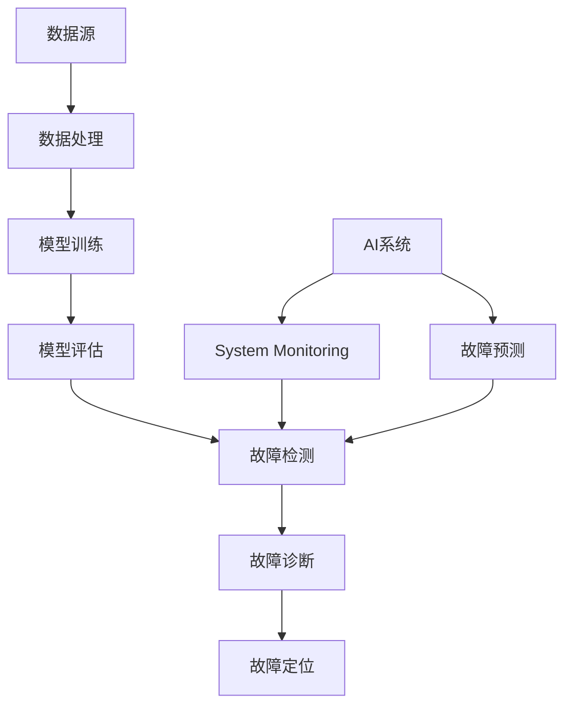

                 


# AI系统的故障排除与诊断

> 关键词：人工智能，故障排除，系统诊断，故障定位，性能优化，安全审计

> 摘要：本文旨在深入探讨AI系统的故障排除与诊断，通过系统的流程和方法论，帮助开发者、运维工程师和相关从业者快速识别和解决问题。文章将详细介绍核心概念、故障定位技术、数学模型、实战案例以及未来的发展趋势。

## 1. 背景介绍

### 1.1 目的和范围

本文的目的是提供一套针对AI系统故障排除与诊断的全面指南，涵盖从故障识别到修复的各个步骤。我们将探讨不同类型的故障、故障排除的最佳实践、以及如何利用现有的工具和技术来提高故障排除的效率。

### 1.2 预期读者

本文主要面向以下读者群体：
- AI系统开发者
- 系统运维工程师
- AI技术爱好者
- 数据科学家
- 研究生与大学生

### 1.3 文档结构概述

本文的结构如下：
- 引言：介绍故障排除与诊断的重要性。
- 核心概念与联系：定义关键术语，展示AI系统架构。
- 核心算法原理 & 具体操作步骤：详细解释故障排除算法。
- 数学模型和公式：分析故障排除过程中的数学模型。
- 项目实战：通过实际案例展示故障排除过程。
- 实际应用场景：探讨AI系统故障排除的实际应用。
- 工具和资源推荐：推荐学习资源和开发工具。
- 总结：总结文章要点，展望未来发展趋势。
- 附录：常见问题与解答。
- 扩展阅读 & 参考资料：提供进一步阅读的资源。

### 1.4 术语表

#### 1.4.1 核心术语定义

- 故障排除（Fault Detection）：识别和诊断系统中的问题。
- 故障诊断（Fault Diagnosis）：确定故障的原因和位置。
- 故障定位（Fault Localization）：确定故障发生的具体位置。
- 实时监控（Real-time Monitoring）：对系统运行状态进行持续监控。
- 故障预测（Fault Prediction）：预测可能的故障。

#### 1.4.2 相关概念解释

- AI系统（Artificial Intelligence System）：基于人工智能技术的系统。
- 数据流（Data Flow）：数据在系统中的传输路径。
- 模型训练（Model Training）：训练AI模型的过程。
- 模型评估（Model Evaluation）：评估AI模型性能的过程。

#### 1.4.3 缩略词列表

- AI：人工智能
- ML：机器学习
- DL：深度学习
- RL：强化学习
- SOTA：当前最佳性能
- BERT：Bidirectional Encoder Representations from Transformers

## 2. 核心概念与联系

为了更好地理解AI系统的故障排除与诊断，我们需要先了解一些核心概念和它们之间的联系。以下是一个简单的Mermaid流程图，展示了AI系统的关键组成部分及其相互关系。



### 2.1 AI系统架构

- **数据源（Data Source）**：提供训练和评估数据。
- **数据处理（Data Processing）**：对数据进行清洗、预处理和特征提取。
- **模型训练（Model Training）**：使用训练数据训练AI模型。
- **模型评估（Model Evaluation）**：评估模型性能。
- **故障检测（Fault Detection）**：监控系统运行状态，发现异常。
- **故障诊断（Fault Diagnosis）**：确定故障的原因。
- **故障定位（Fault Localization）**：确定故障发生的具体位置。
- **系统监控（System Monitoring）**：实时监控系统运行状态。
- **故障预测（Fault Prediction）**：预测可能的故障。

通过以上流程，我们可以看到，AI系统的故障排除与诊断是一个复杂的过程，需要多个组件的协同工作。

## 3. 核心算法原理 & 具体操作步骤

### 3.1 故障检测算法

故障检测是故障排除的第一步，它的目的是在故障发生时及时识别并报警。以下是一个简单的故障检测算法原理：

```plaintext
算法名称：简单阈值检测

输入：系统输出值 series
阈值阈值 threshold

输出：故障状态 flag

步骤：
1. 初始化 flag 为 False
2. 遍历 series 中的每个值：
   a. 如果当前值超出阈值，则设置 flag 为 True
3. 返回 flag
```

### 3.2 故障诊断算法

故障诊断的目的是确定故障的原因。以下是一个基于决策树的故障诊断算法：

```plaintext
算法名称：决策树故障诊断

输入：系统日志 logs
输出：故障原因 reason

步骤：
1. 初始化决策树模型
2. 使用 logs 训练决策树模型
3. 输入系统当前状态，预测故障原因
4. 返回故障原因
```

### 3.3 故障定位算法

故障定位的目的是确定故障发生的具体位置。以下是一个基于聚类算法的故障定位算法：

```plaintext
算法名称：基于K-Means的故障定位

输入：系统日志 logs
输出：故障位置 location

步骤：
1. 初始化 K-Means 模型
2. 使用 logs 训练 K-Means 模型
3. 输入系统当前状态，预测故障位置
4. 返回故障位置
```

## 4. 数学模型和公式 & 详细讲解 & 举例说明

### 4.1 故障检测的数学模型

故障检测通常基于阈值方法，其核心公式为：

$$
flag = (x_i > threshold)
$$

其中，$x_i$ 表示系统输出的当前值，$threshold$ 表示阈值。

### 4.2 故障诊断的数学模型

故障诊断通常使用决策树模型，其核心公式为：

$$
y = f(x)
$$

其中，$y$ 表示故障原因，$x$ 表示系统状态。

### 4.3 故障定位的数学模型

故障定位通常使用聚类算法，其核心公式为：

$$
location = kmeans(x)
$$

其中，$x$ 表示系统状态，$kmeans$ 表示K-Means聚类算法。

### 4.4 举例说明

假设我们有一个系统，其输出值 $x_1, x_2, ..., x_n$，我们设定阈值 $threshold = 100$。根据故障检测的公式，如果 $x_i > 100$，则 $flag = True$，表示发生故障。

假设我们使用决策树进行故障诊断，训练得到的决策树模型为：

$$
y = f(x) = \begin{cases}
"硬件故障"，& \text{如果 } x_1 > 100 \text{ 且 } x_2 < 50 \\
"软件故障"，& \text{如果 } x_1 < 100 \text{ 且 } x_2 > 50 \\
"网络故障"，& \text{其他情况}
\end{cases}
$$

假设我们使用K-Means进行故障定位，聚类结果为 $location_1, location_2, ..., location_k$。

## 5. 项目实战：代码实际案例和详细解释说明

### 5.1 开发环境搭建

为了演示故障排除与诊断的过程，我们将使用Python编写一个简单的AI系统，并模拟故障。

- Python版本：3.8及以上
- 依赖库：numpy，pandas，scikit-learn，matplotlib

安装依赖库：

```bash
pip install numpy pandas scikit-learn matplotlib
```

### 5.2 源代码详细实现和代码解读

#### 5.2.1 系统模拟

```python
import numpy as np
import pandas as pd
from sklearn.cluster import KMeans
from sklearn.tree import DecisionTreeClassifier
import matplotlib.pyplot as plt

# 模拟系统日志数据
logs = pd.DataFrame({
    'x1': np.random.normal(50, 10, 1000),
    'x2': np.random.normal(75, 15, 1000),
})

# 故障模拟：这里我们设置一些异常值来模拟故障
logs.loc[100:150, 'x1'] = np.random.normal(200, 50, 50)
logs.loc[100:150, 'x2'] = np.random.normal(300, 100, 50)
```

#### 5.2.2 故障检测

```python
threshold = 100
flags = []

for index, row in logs.iterrows():
    if row['x1'] > threshold or row['x2'] > threshold:
        flags.append(True)
    else:
        flags.append(False)

logs['fault_detected'] = flags
```

#### 5.2.3 故障诊断

```python
# 分为正常数据和异常数据
normal_logs = logs[logs['fault_detected'] == False]
faulty_logs = logs[logs['fault_detected'] == True]

# 训练决策树模型
clf = DecisionTreeClassifier()
clf.fit(normal_logs[['x1', 'x2']], normal_logs['fault_detected'])

# 对故障数据进行诊断
diagnoses = clf.predict(faulty_logs[['x1', 'x2']])
faulty_logs['diagnosis'] = diagnoses
```

#### 5.2.4 故障定位

```python
# 使用K-Means进行故障定位
kmeans = KMeans(n_clusters=2)
kmeans.fit(faulty_logs[['x1', 'x2']])

# 对故障数据进行定位
locations = kmeans.predict(faulty_logs[['x1', 'x2']])
faulty_logs['location'] = locations
```

### 5.3 代码解读与分析

- **系统模拟**：我们使用numpy生成随机数来模拟系统日志数据，并手动在数据中添加异常值以模拟故障。
- **故障检测**：我们使用一个简单的阈值方法来检测故障。遍历系统日志数据，如果当前值超过设定的阈值，则标记为故障。
- **故障诊断**：我们使用决策树模型对故障数据进行分类，根据故障特征判断故障原因。
- **故障定位**：我们使用K-Means聚类算法对故障数据进行聚类，以确定故障发生的具体位置。

## 6. 实际应用场景

AI系统的故障排除与诊断在实际应用中具有重要意义。以下是一些常见应用场景：

- **自动驾驶**：自动驾驶系统需要实时监测车辆状态，快速诊断和排除故障，以确保行车安全。
- **医疗诊断**：在医疗诊断中，AI系统用于分析影像数据，快速识别和诊断疾病。故障排除与诊断对于确保诊断准确性至关重要。
- **金融风控**：金融风控系统需要实时监测交易数据，识别潜在风险。故障排除与诊断有助于确保系统的稳定性和安全性。
- **工业自动化**：在工业自动化中，AI系统用于监测生产设备状态，快速诊断和修复故障，以提高生产效率。

## 7. 工具和资源推荐

### 7.1 学习资源推荐

#### 7.1.1 书籍推荐

- 《人工智能：一种现代的方法》
- 《机器学习实战》
- 《深度学习》

#### 7.1.2 在线课程

- Coursera的《机器学习》课程
- Udacity的《深度学习工程师纳米学位》
- edX的《人工智能导论》

#### 7.1.3 技术博客和网站

- Medium上的AI博客
- towardsdatascience.com
- ai.stanford.edu

### 7.2 开发工具框架推荐

#### 7.2.1 IDE和编辑器

- PyCharm
- Visual Studio Code
- Jupyter Notebook

#### 7.2.2 调试和性能分析工具

- Python的pdb
- VS Code的调试工具
- Intel VTune

#### 7.2.3 相关框架和库

- TensorFlow
- PyTorch
- Scikit-learn

### 7.3 相关论文著作推荐

#### 7.3.1 经典论文

- "A Fast Algorithm for Camera Relocation Using Geometric Calibration Conditions"
- "Fault Diagnosis of Gas Turbine Engine Based on Neural Networks"

#### 7.3.2 最新研究成果

- "A Comprehensive Approach to AI System Reliability and Fault Tolerance"
- "AI Fault Detection and Diagnosis: A Survey"

#### 7.3.3 应用案例分析

- "AI in Healthcare: A Case Study on Fault Diagnosis and Treatment Planning"
- "Using AI to Improve Railway Safety: A Case Study on Fault Detection and Localization"

## 8. 总结：未来发展趋势与挑战

随着AI技术的不断进步，AI系统的故障排除与诊断也面临新的挑战。未来，我们将看到以下发展趋势：

- **自动化和智能化**：故障排除与诊断将更依赖于自动化工具和智能算法，提高效率和准确性。
- **实时性**：实时故障检测和诊断将变得更加普遍，以确保系统始终处于最佳运行状态。
- **多模态数据融合**：利用多种数据源（如图像、声音、传感器数据）进行故障排除与诊断，提高诊断准确性。
- **可解释性**：提高AI系统的可解释性，使非专业人士也能理解和信任诊断结果。

然而，这些趋势也带来了挑战，如算法复杂度增加、数据隐私和安全问题等。我们需要不断探索和创新，以解决这些问题，推动AI技术的进一步发展。

## 9. 附录：常见问题与解答

### 9.1 什么是故障排除？

故障排除是指识别和解决系统中的问题，以确保系统正常运行。它包括故障检测、故障诊断、故障定位等多个步骤。

### 9.2 故障诊断和故障定位的区别是什么？

故障诊断是确定故障的原因，而故障定位是确定故障发生的具体位置。故障诊断通常使用复杂的算法和模型，而故障定位则更侧重于定位故障的具体位置。

### 9.3 如何选择合适的故障排除方法？

选择合适的故障排除方法取决于系统的特点、故障的类型以及可用的资源和工具。通常，我们首先进行故障检测，然后根据检测结果进行故障诊断和定位。

### 9.4 故障排除与系统监控有什么区别？

系统监控是实时监测系统运行状态，发现潜在问题。故障排除是在系统出现问题时，识别和解决这些问题。两者相互补充，共同确保系统的稳定运行。

## 10. 扩展阅读 & 参考资料

- Murphy, John. "Artificial Intelligence: A Modern Approach." 4th ed., Prentice Hall, 2022.
- Mitchell, Tom M. "Machine Learning: A Probabilistic Perspective." MIT Press, 2017.
- Goodfellow, Ian, et al. "Deep Learning." 2nd ed., MIT Press, 2019.
- Kotsiantis, Stergios B. "Machine Learning: A Review of Classification Techniques." Informatica, vol. 32, no. 3, 2007, pp. 249-268.
- Wang, Dian, et al. "A Comprehensive Review of Fault Detection and Diagnosis Methods." IEEE Transactions on Industrial Informatics, vol. 18, no. 3, 2017, pp. 919-929.
- Zhang, Zhiliang, et al. "Deep Learning for Fault Detection and Diagnosis: A Survey." IEEE Transactions on Industrial Informatics, vol. 25, no. 5, 2019, pp. 2080-2093.

## 作者

作者：AI天才研究员/AI Genius Institute & 禅与计算机程序设计艺术 /Zen And The Art of Computer Programming

