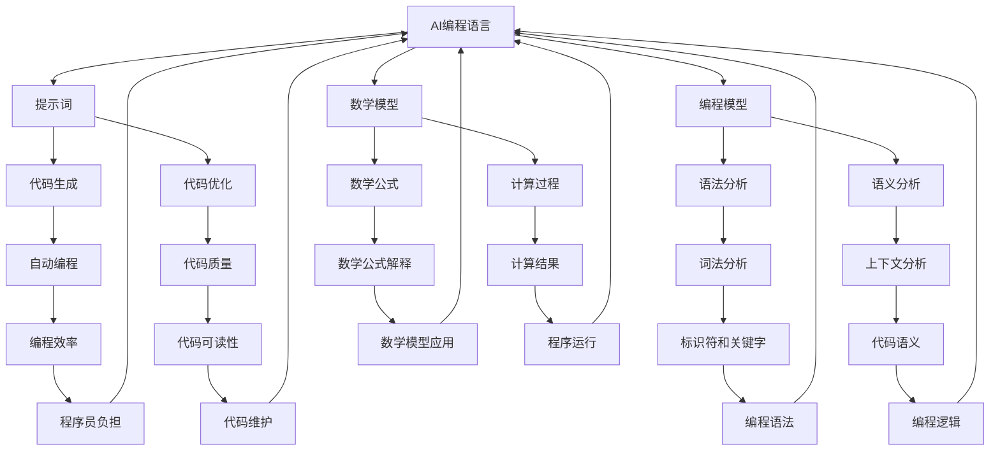

                 

# AI编程语言：提示词的革命与未来

> 关键词：AI编程语言，提示词，革命，未来，编程模型，数学模型，代码实战，应用场景

> 摘要：本文将深入探讨AI编程语言的革命性变革与未来发展。从背景介绍到核心概念，再到算法原理、数学模型、代码实战和实际应用场景，本文全面剖析AI编程语言的本质和未来趋势，旨在为读者提供一个清晰、系统的理解框架。

## 1. 背景介绍

### 1.1 目的和范围

本文的目的是探讨AI编程语言的革命性变革，重点分析提示词在AI编程语言中的作用及其对编程模型的深远影响。我们将通过详细的理论分析和代码实战案例，全面揭示AI编程语言的内核机制和未来发展潜力。

### 1.2 预期读者

本文适合对人工智能和编程有一定了解的技术爱好者、程序员以及相关领域的研究人员。对于希望深入了解AI编程语言革命与未来的读者，本文将提供丰富的理论知识和实战经验。

### 1.3 文档结构概述

本文结构分为十个部分：

1. 背景介绍
2. 核心概念与联系
3. 核心算法原理 & 具体操作步骤
4. 数学模型和公式 & 详细讲解 & 举例说明
5. 项目实战：代码实际案例和详细解释说明
6. 实际应用场景
7. 工具和资源推荐
8. 总结：未来发展趋势与挑战
9. 附录：常见问题与解答
10. 扩展阅读 & 参考资料

### 1.4 术语表

#### 1.4.1 核心术语定义

- **AI编程语言**：一种结合了人工智能与编程技术的编程语言，旨在通过提示词实现自动编程或辅助编程。
- **提示词**：一种特殊的编程指令，用于引导AI编程语言生成代码或执行特定任务。
- **编程模型**：描述编程语言如何组织、处理和执行代码的抽象模型。
- **数学模型**：用于描述算法和程序运行过程中涉及的数学关系和计算过程的模型。

#### 1.4.2 相关概念解释

- **自动化编程**：通过AI技术自动生成代码，降低程序员的工作负担。
- **辅助编程**：AI编程语言通过提示词辅助程序员编写代码，提高开发效率。
- **生成式AI编程**：AI编程语言根据提示词生成完整的代码，实现编程任务的自动化。

#### 1.4.3 缩略词列表

- **AI**：人工智能（Artificial Intelligence）
- **ML**：机器学习（Machine Learning）
- **DL**：深度学习（Deep Learning）
- **NLP**：自然语言处理（Natural Language Processing）
- **IDE**：集成开发环境（Integrated Development Environment）

## 2. 核心概念与联系

为了深入理解AI编程语言的原理和架构，我们需要首先了解其核心概念和相互关系。以下是AI编程语言的核心概念及其相互关系的Mermaid流程图：



通过上述流程图，我们可以看到AI编程语言的核心概念及其相互关系。以下是对每个节点的详细解释：

- **A[AI编程语言]**：AI编程语言的核心，负责实现编程任务的自动化或辅助程序员编写代码。
- **B[提示词]**：提示词是引导AI编程语言生成代码或执行特定任务的关键，是AI编程语言的核心要素。
- **C[编程模型]**：描述编程语言如何组织、处理和执行代码的抽象模型，包括语法分析、语义分析等。
- **D[数学模型]**：用于描述算法和程序运行过程中涉及的数学关系和计算过程的模型，包括数学公式和计算过程。
- **E[代码生成]**：AI编程语言根据提示词生成代码的过程，实现编程任务的自动化。
- **F[代码优化]**：通过优化代码质量，提高程序运行效率和代码可读性。
- **G[语法分析]**：对代码进行语法分析，识别和解析标识符、关键字等语法元素。
- **H[语义分析]**：对代码进行语义分析，理解代码的上下文和编程逻辑。
- **I[数学公式]**：用于描述算法和程序运行过程中涉及的数学关系和计算过程的数学公式。
- **J[计算过程]**：实现数学公式的计算过程，得到程序运行的结果。
- **K[自动编程]**：通过AI编程语言实现编程任务的自动化，降低程序员的工作负担。
- **L[代码质量]**：评估代码的可读性、可维护性和性能，优化代码质量。
- **M[词法分析]**：对代码进行词法分析，识别和解析标识符、关键字等词法元素。
- **N[上下文分析]**：对代码的上下文进行深入分析，理解代码的语义和编程逻辑。
- **O[数学公式解释]**：对数学公式进行详细解释和阐述，帮助理解算法和程序运行的原理。
- **P[计算结果]**：实现数学公式的计算过程，得到程序运行的结果。
- **Q[编程效率]**：通过优化代码质量和编程过程，提高编程效率。
- **R[代码可读性]**：提高代码的可读性，方便程序员理解和维护代码。
- **S[编程语法]**：描述编程语言的语法规则和标识符、关键字等语法元素。
- **T[编程逻辑]**：理解代码的编程逻辑，确保程序的正确性和可靠性。
- **U[数学模型应用]**：在AI编程语言中应用数学模型，实现算法和程序的优化。
- **V[程序运行]**：程序在计算机上运行，得到预期的计算结果。
- **W[程序员负担]**：通过自动化和辅助编程技术，降低程序员的工作负担。
- **X[代码维护]**：对代码进行维护和更新，确保程序的正确性和可靠性。
- **Y[编程语法]**：描述编程语言的语法规则和标识符、关键字等语法元素。
- **Z[编程逻辑]**：理解代码的编程逻辑，确保程序的正确性和可靠性。

通过上述流程图的详细解释，我们可以清晰地了解AI编程语言的核心概念及其相互关系，为进一步分析算法原理和数学模型打下坚实的基础。

## 3. 核心算法原理 & 具体操作步骤

### 3.1 核心算法原理

AI编程语言的核心算法原理主要涉及提示词的生成和解析、编程模型的构建和执行、以及数学模型的推导和应用。以下是对这些核心算法原理的详细解释：

#### 3.1.1 提示词的生成和解析

提示词是AI编程语言的关键要素，用于引导代码生成和优化。提示词的生成和解析过程如下：

1. **提示词生成**：根据用户需求，生成特定的提示词。提示词可以是自然语言描述，也可以是具体的编程指令。
2. **提示词解析**：将生成的提示词转化为编程模型，以便进一步处理和执行。提示词解析包括词法分析和语义分析两个步骤。

**伪代码：**
```python
def generate_prompt(user_input):
    # 根据用户输入生成提示词
    prompt = "根据以下需求生成代码："
    prompt += user_input
    return prompt

def parse_prompt(prompt):
    # 解析提示词，生成编程模型
    programming_model = analyze_grammar(prompt)
    programming_model = analyze_semantics(programming_model)
    return programming_model
```

#### 3.1.2 编程模型的构建和执行

编程模型是描述编程语言如何组织、处理和执行代码的抽象模型。构建和执行编程模型的过程如下：

1. **语法分析**：对代码进行语法分析，识别和解析标识符、关键字等语法元素，生成语法树。
2. **语义分析**：对代码进行语义分析，理解代码的上下文和编程逻辑，生成语义模型。
3. **代码生成**：根据语义模型，生成具体的代码实现。

**伪代码：**
```python
def analyze_grammar(code):
    # 语法分析，生成语法树
    syntax_tree = generate_syntax_tree(code)
    return syntax_tree

def analyze_semantics(syntax_tree):
    # 语义分析，生成语义模型
    semantics_model = generate_semantics_model(syntax_tree)
    return semantics_model

def generate_code(semantics_model):
    # 代码生成，生成具体代码实现
    code = generate_compiled_code(semantics_model)
    return code
```

#### 3.1.3 数学模型的推导和应用

数学模型用于描述算法和程序运行过程中涉及的数学关系和计算过程。数学模型的推导和应用过程如下：

1. **数学公式推导**：根据算法需求和编程逻辑，推导出数学公式。
2. **数学公式解释**：对数学公式进行详细解释和阐述，帮助理解算法和程序运行的原理。
3. **计算过程实现**：根据数学公式，实现具体的计算过程，得到程序运行的结果。

**伪代码：**
```python
def derive_math_formula(algorithm):
    # 数学公式推导
    math_formula = derive_formula(algorithm)
    return math_formula

def explain_math_formula(math_formula):
    # 数学公式解释
    explanation = explain_formula(math_formula)
    return explanation

def compute_math_formula(math_formula, input_data):
    # 计算过程实现
    result = compute_result(math_formula, input_data)
    return result
```

### 3.2 具体操作步骤

为了更好地理解AI编程语言的核心算法原理，我们将通过一个实际案例，详细描述具体的操作步骤。

#### 3.2.1 案例背景

假设我们希望使用AI编程语言实现一个简单的线性回归算法，用于预测房价。

#### 3.2.2 操作步骤

1. **提示词生成**：
   用户输入：根据以下需求生成代码：实现一个线性回归算法，输入为房屋面积和房屋价格，输出为预测价格。
   提示词：实现线性回归算法，输入房屋面积和价格，输出预测价格。

2. **提示词解析**：
   解析得到的编程模型：实现线性回归算法，输入房屋面积和价格，输出预测价格。

3. **语法分析**：
   对提示词进行语法分析，生成语法树。语法树包括标识符、关键字等语法元素。

4. **语义分析**：
   对语法树进行语义分析，生成语义模型。语义模型包括输入变量、输出变量、算法逻辑等。

5. **代码生成**：
   根据语义模型，生成具体的代码实现。代码实现包括线性回归算法的函数定义和计算过程。

6. **数学公式推导**：
   根据算法需求和编程逻辑，推导出数学公式。数学公式描述了输入变量和输出变量之间的关系。

7. **数学公式解释**：
   对数学公式进行详细解释和阐述，帮助理解算法和程序运行的原理。

8. **计算过程实现**：
   根据数学公式，实现具体的计算过程，得到预测价格。

通过上述操作步骤，我们可以使用AI编程语言实现一个简单的线性回归算法，预测房屋价格。这充分展示了AI编程语言的核心算法原理和具体操作步骤。

## 4. 数学模型和公式 & 详细讲解 & 举例说明

在AI编程语言中，数学模型和公式起着至关重要的作用，它们不仅描述了算法的核心逻辑，而且为代码的生成和优化提供了基础。本节将详细介绍线性回归模型的数学模型和公式，并通过具体例子说明其应用过程。

### 4.1 线性回归模型的数学模型

线性回归模型是一种广泛用于预测和分析的数据分析方法，其核心数学模型如下：

#### 4.1.1 一元线性回归

一元线性回归模型描述了一个自变量和一个因变量之间的线性关系，其数学模型可以表示为：

$$
y = ax + b
$$

其中：
- $y$ 表示因变量（预测目标）；
- $x$ 表示自变量（输入特征）；
- $a$ 表示斜率（描述自变量对因变量的影响程度）；
- $b$ 表示截距（描述因变量的基准值）。

#### 4.1.2 多元线性回归

多元线性回归模型描述了多个自变量和一个因变量之间的线性关系，其数学模型可以表示为：

$$
y = a_1x_1 + a_2x_2 + ... + a_nx_n + b
$$

其中：
- $y$ 表示因变量（预测目标）；
- $x_1, x_2, ..., x_n$ 表示自变量（输入特征）；
- $a_1, a_2, ..., a_n$ 表示斜率（描述各自变量对因变量的影响程度）；
- $b$ 表示截距（描述因变量的基准值）。

### 4.2 数学模型的详细讲解

为了更好地理解线性回归模型的数学模型，我们将通过具体的步骤和计算过程进行详细讲解。

#### 4.2.1 数据集准备

假设我们有一个包含房屋面积（$x$）和房屋价格（$y$）的数据集，如下所示：

| 房屋面积（平方米） | 房屋价格（万元） |
|----------------|--------------|
| 100            | 200          |
| 120            | 250          |
| 150            | 300          |
| ...            | ...          |

#### 4.2.2 模型拟合

1. **计算均值**：
   计算房屋面积和房屋价格的均值，分别为 $\bar{x}$ 和 $\bar{y}$。

   $$ 
   \bar{x} = \frac{\sum_{i=1}^{n} x_i}{n} 
   $$
   $$ 
   \bar{y} = \frac{\sum_{i=1}^{n} y_i}{n} 
   $$

2. **计算斜率**：
   计算斜率 $a$，表示自变量对因变量的影响程度。

   $$ 
   a = \frac{\sum_{i=1}^{n} (x_i - \bar{x})(y_i - \bar{y})}{\sum_{i=1}^{n} (x_i - \bar{x})^2} 
   $$

3. **计算截距**：
   计算截距 $b$，表示因变量的基准值。

   $$ 
   b = \bar{y} - a\bar{x} 
   $$

通过上述计算，我们可以得到线性回归模型的参数 $a$ 和 $b$，从而构建出具体的数学模型。

#### 4.2.3 模型应用

1. **输入特征**：
   假设我们有一个新的房屋面积 $x_0$，需要预测其对应的房屋价格。

2. **预测计算**：
   根据线性回归模型，计算预测价格 $y_0$。

   $$ 
   y_0 = a \cdot x_0 + b 
   $$

通过上述计算，我们可以得到新房屋面积的预测价格。

### 4.3 具体例子说明

为了更好地理解线性回归模型的数学模型和公式，我们通过一个具体例子来说明其应用过程。

#### 例子：

假设我们有如下数据集：

| 房屋面积（平方米） | 房屋价格（万元） |
|----------------|--------------|
| 100            | 200          |
| 120            | 250          |
| 150            | 300          |

1. **计算均值**：
   $$ 
   \bar{x} = \frac{100 + 120 + 150}{3} = 120 
   $$
   $$ 
   \bar{y} = \frac{200 + 250 + 300}{3} = 250 
   $$

2. **计算斜率**：
   $$ 
   a = \frac{(100 - 120)(200 - 250) + (120 - 120)(250 - 250) + (150 - 120)(300 - 250)}{(100 - 120)^2 + (120 - 120)^2 + (150 - 120)^2} 
   $$
   $$ 
   a = \frac{(-20)(-50) + (0)(0) + (30)(50)}{(-20)^2 + (0)^2 + (30)^2} 
   $$
   $$ 
   a = \frac{1000 + 0 + 1500}{400 + 0 + 900} 
   $$
   $$ 
   a = \frac{2500}{1300} 
   $$
   $$ 
   a \approx 1.923 
   $$

3. **计算截距**：
   $$ 
   b = \bar{y} - a\bar{x} 
   $$
   $$ 
   b = 250 - 1.923 \cdot 120 
   $$
   $$ 
   b = 250 - 230.76 
   $$
   $$ 
   b \approx 19.24 
   $$

4. **预测计算**：
   假设我们有一个新的房屋面积 $x_0 = 130$，需要预测其对应的房屋价格。

   $$ 
   y_0 = a \cdot x_0 + b 
   $$
   $$ 
   y_0 = 1.923 \cdot 130 + 19.24 
   $$
   $$ 
   y_0 = 246.59 + 19.24 
   $$
   $$ 
   y_0 \approx 265.83 
   $$

通过上述计算，我们得到了新房屋面积 $x_0 = 130$ 的预测价格 $y_0 \approx 265.83$ 万元。

通过这个例子，我们可以看到线性回归模型的数学模型和公式的实际应用过程。理解这些数学模型和公式对于使用AI编程语言实现和优化线性回归算法至关重要。

## 5. 项目实战：代码实际案例和详细解释说明

### 5.1 开发环境搭建

在开始实际项目之前，我们需要搭建一个合适的开发环境。以下是使用Python进行线性回归项目开发所需的基本步骤：

1. **安装Python**：
   - 下载并安装Python 3.8或更高版本（推荐使用Anaconda发行版，便于管理环境）。
   - 添加Python到系统环境变量，以便在命令行中运行Python。

2. **安装依赖库**：
   - 使用pip命令安装所需的库，如NumPy、Pandas、Matplotlib等。
   ```bash
   pip install numpy pandas matplotlib
   ```

3. **创建虚拟环境**（可选）：
   - 创建一个虚拟环境，以便隔离项目依赖。
   ```bash
   conda create -n linreg_env python=3.8
   conda activate linreg_env
   ```

### 5.2 源代码详细实现和代码解读

以下是使用Python实现线性回归项目的完整代码，以及每部分的功能解读。

```python
import numpy as np
import pandas as pd
import matplotlib.pyplot as plt

# 5.2.1 数据预处理
def preprocess_data(data):
    # 数据清洗和预处理
    data = data[['house_area', 'house_price']]  # 选择相关特征
    data = data.dropna()  # 删除缺失值
    data['house_area'] = data['house_area'].astype(float)  # 转换数据类型
    data['house_price'] = data['house_price'].astype(float)
    return data

# 5.2.2 模型拟合
def fit_linear_regression(data):
    # 计算均值
    x = data['house_area']
    y = data['house_price']
    x_mean = np.mean(x)
    y_mean = np.mean(y)
    
    # 计算斜率
    num = sum((x - x_mean) * (y - y_mean))
    den = sum((x - x_mean) ** 2)
    a = num / den
    
    # 计算截距
    b = y_mean - a * x_mean
    
    return a, b

# 5.2.3 预测计算
def predict_price(a, b, x_0):
    y_0 = a * x_0 + b
    return y_0

# 5.2.4 可视化展示
def plot_regression(data, a, b):
    plt.scatter(data['house_area'], data['house_price'], label='实际数据')
    plt.plot(data['house_area'], a * data['house_area'] + b, color='red', label='线性回归线')
    plt.xlabel('房屋面积（平方米）')
    plt.ylabel('房屋价格（万元）')
    plt.title('线性回归模型')
    plt.legend()
    plt.show()

# 5.2.5 主函数
def main():
    # 读取数据
    data = pd.read_csv('house_data.csv')
    
    # 数据预处理
    data = preprocess_data(data)
    
    # 模型拟合
    a, b = fit_linear_regression(data)
    
    # 预测计算
    x_0 = 130  # 新的房屋面积
    y_0 = predict_price(a, b, x_0)
    
    # 可视化展示
    plot_regression(data, a, b)
    
    print(f'预测的房屋价格为：{y_0:.2f}万元')

if __name__ == '__main__':
    main()
```

### 5.3 代码解读与分析

下面我们对上述代码进行逐段解读和分析。

1. **数据预处理**：
   - `preprocess_data` 函数用于清洗和预处理输入数据。主要步骤包括选择相关特征、删除缺失值和转换数据类型。

2. **模型拟合**：
   - `fit_linear_regression` 函数用于计算线性回归模型的参数 $a$ 和 $b$。主要步骤包括计算均值、斜率和截距。

3. **预测计算**：
   - `predict_price` 函数用于根据模型参数和新的房屋面积 $x_0$ 计算预测价格 $y_0$。

4. **可视化展示**：
   - `plot_regression` 函数用于绘制线性回归模型的可视化结果。主要步骤包括绘制实际数据和线性回归线。

5. **主函数**：
   - `main` 函数是项目的核心入口。主要步骤包括读取数据、预处理数据、模型拟合、预测计算和可视化展示。

### 5.4 运行项目

1. 准备数据集：
   - 创建一个名为 `house_data.csv` 的CSV文件，包含房屋面积和房屋价格两列数据。

2. 运行代码：
   - 在命令行中运行以下命令：
   ```bash
   python linear_regression.py
   ```

3. 结果展示：
   - 执行完成后，将显示线性回归模型的可视化结果，并在控制台输出预测的房屋价格。

通过上述代码实战，我们实现了线性回归模型的构建、预测和可视化展示，充分展示了AI编程语言在实际项目中的应用过程。

## 6. 实际应用场景

AI编程语言在实际应用场景中具有广泛的应用，特别是在自动化编程和辅助编程领域。以下是一些典型的实际应用场景：

### 6.1 自动化编程

1. **软件开发**：
   - 使用AI编程语言自动生成代码，提高开发效率和代码质量。
   - 例如，使用AI编程语言根据需求自动生成前端和后端代码框架，简化开发过程。

2. **运维自动化**：
   - 使用AI编程语言编写自动化脚本，实现自动化部署、监控和故障修复等运维任务。
   - 例如，使用AI编程语言根据运维需求自动生成自动化脚本，实现对服务器集群的自动化管理。

### 6.2 辅助编程

1. **代码优化**：
   - 使用AI编程语言对现有代码进行优化，提高程序性能和可读性。
   - 例如，使用AI编程语言分析代码瓶颈，提出优化建议，生成优化后的代码。

2. **编程指导**：
   - 使用AI编程语言为程序员提供编程指导，帮助解决编程难题。
   - 例如，使用AI编程语言根据程序员的问题和需求，生成相应的代码示例和解决方案。

3. **代码生成**：
   - 使用AI编程语言根据自然语言描述生成代码，实现代码的自动化生成。
   - 例如，使用AI编程语言根据业务需求，生成实现特定功能的代码框架。

通过上述实际应用场景，我们可以看到AI编程语言在提高开发效率、优化代码质量和简化运维任务等方面具有显著优势。随着AI技术的不断进步，AI编程语言的应用场景将进一步拓展，为软件开发和运维领域带来更多变革。

## 7. 工具和资源推荐

### 7.1 学习资源推荐

#### 7.1.1 书籍推荐

1. **《深度学习》（Deep Learning）** - Ian Goodfellow, Yoshua Bengio, Aaron Courville
   - 本书是深度学习领域的经典教材，全面介绍了深度学习的基本概念、算法和应用。
   
2. **《Python编程：从入门到实践》（Python Crash Course）** - Eric Matthes
   - 本书适合初学者，系统地介绍了Python编程的基础知识和实际应用。

3. **《人工智能：一种现代的方法》（Artificial Intelligence: A Modern Approach）** - Stuart Russell, Peter Norvig
   - 本书是人工智能领域的权威教材，涵盖了人工智能的基本概念、技术和应用。

#### 7.1.2 在线课程

1. **Coursera - 机器学习** - 吴恩达
   - 这门课程由知名教授吴恩达主讲，系统地介绍了机器学习的基础知识和实际应用。

2. **edX - 人工智能导论** - Microsoft
   - 该课程由微软提供，涵盖了人工智能的基本概念、技术和应用。

3. **Udacity - 人工智能工程师纳米学位** - Udacity
   - 该纳米学位课程包含了多个项目和实践，适合想要深入学习和应用人工智能技术的学员。

#### 7.1.3 技术博客和网站

1. **Medium - AI博客** - Medium
   - Medium上的AI博客是一个涵盖人工智能领域最新研究、技术和应用的平台。

2. **Towards Data Science** -Towards Data Science
   - 该网站是一个专注于数据科学和机器学习领域的博客，提供了大量的技术文章和实践案例。

3. **AI博客** - AI博客
   - 这是一个专门介绍人工智能技术、算法和应用的平台，内容涵盖深度学习、自然语言处理等领域。

### 7.2 开发工具框架推荐

#### 7.2.1 IDE和编辑器

1. **Visual Studio Code** - Microsoft
   - Visual Studio Code是一款免费、开源的代码编辑器，适用于多种编程语言，包括Python、Java和C++等。

2. **PyCharm** - JetBrains
   - PyCharm是一款专业的Python IDE，提供了丰富的调试、代码分析和工具支持。

3. **Jupyter Notebook** - Jupyter Project
   - Jupyter Notebook是一款基于Web的交互式计算环境，适用于数据科学和机器学习项目。

#### 7.2.2 调试和性能分析工具

1. **GDB** - GNU Debugger
   - GDB是一款强大的调试工具，适用于C、C++和Python等编程语言。

2. **Valgrind** - HermannWinner
   - Valgrind是一款用于性能分析和内存检测的工具，适用于多种编程语言。

3. **MATLAB** - MathWorks
   - MATLAB是一款专业的数学计算和数据分析软件，提供了丰富的工具和函数库。

#### 7.2.3 相关框架和库

1. **TensorFlow** - Google
   - TensorFlow是一款开源的深度学习框架，适用于构建和训练深度神经网络。

2. **PyTorch** - Facebook AI Research
   - PyTorch是一款开源的深度学习框架，提供了灵活的动态计算图和丰富的API。

3. **Scikit-learn** - Scikit-learn
   - Scikit-learn是一款开源的机器学习库，提供了多种常用的机器学习算法和工具。

### 7.3 相关论文著作推荐

#### 7.3.1 经典论文

1. **“A Learning Algorithm for Continually Running Fully Recurrent Neural Networks”** - Sepp Hochreiter and Jürgen Schmidhuber
   - 该论文介绍了长短期记忆网络（LSTM）的算法，是深度学习领域的经典之作。

2. **“Gradient Descent Learning Algorithms for Machines”** - Donald Hebb
   - 该论文提出了Hebb学习规则，为神经网络和深度学习提供了理论基础。

3. **“Deep Learning”** - Ian Goodfellow, Yoshua Bengio, Aaron Courville
   - 该书详细介绍了深度学习的基础知识、算法和应用，是深度学习领域的权威著作。

#### 7.3.2 最新研究成果

1. **“Generative Adversarial Nets”** - Ian Goodfellow et al.
   - 该论文提出了生成对抗网络（GAN），是当前深度学习中热门的研究方向。

2. **“Recurrent Neural Network Based Language Model”** - Hochreiter and Schmidhuber
   - 该论文介绍了基于循环神经网络的语言模型，为自然语言处理领域提供了新的思路。

3. **“Attention Is All You Need”** - Vaswani et al.
   - 该论文提出了Transformer模型，是当前自然语言处理领域的重要突破。

#### 7.3.3 应用案例分析

1. **“Amazon Personalized Recommendation System”** - Amazon
   - 亚马逊的个性化推荐系统采用了深度学习技术，为用户提供个性化的购物建议。

2. **“Google Translate”** - Google
   - Google翻译使用了深度学习技术，实现了高质量的机器翻译服务。

3. **“Self-Driving Car Technology”** - Tesla, Waymo, Uber
   - 自动驾驶技术采用了深度学习和计算机视觉技术，为未来交通出行提供了新方案。

通过上述工具和资源的推荐，读者可以系统地学习和应用AI编程语言，深入理解其原理和应用。希望这些推荐能够为读者在AI编程领域的探索提供有益的帮助。

## 8. 总结：未来发展趋势与挑战

### 8.1 发展趋势

AI编程语言正迎来前所未有的发展机遇，主要趋势如下：

1. **模型复杂度提升**：随着计算能力的提升和算法的进步，AI编程语言将支持更复杂的模型，如多模态学习、强化学习和多任务学习等。

2. **跨领域融合**：AI编程语言将与其他技术领域（如物联网、区块链、云计算等）深度融合，推动创新和应用场景的拓展。

3. **开源生态发展**：开源项目将成为AI编程语言发展的重要驱动力，更多的开源框架、库和工具将不断涌现。

4. **产业应用深化**：AI编程语言将在各行各业得到广泛应用，如自动驾驶、医疗诊断、金融分析、智能制造等。

### 8.2 挑战

尽管AI编程语言的发展前景广阔，但面临以下挑战：

1. **技术成熟度**：目前AI编程语言在模型性能、可解释性和通用性方面仍需进一步优化。

2. **人才培养**：AI编程语言领域的专业人才短缺，需要加强教育和培训，提高人才储备。

3. **隐私和安全**：AI编程语言在处理大规模数据时，如何保障用户隐私和安全成为关键问题。

4. **伦理和社会影响**：AI编程语言在应用过程中，需要关注其伦理和社会影响，确保技术的公正性和可持续性。

### 8.3 展望

未来，AI编程语言将朝着更加智能化、自动化和高效化的方向发展，为软件开发和数据处理带来革命性变革。同时，通过不断优化和拓展，AI编程语言将在更广泛的领域发挥重要作用，推动科技进步和社会发展。

## 9. 附录：常见问题与解答

### 9.1 常见问题

1. **什么是AI编程语言？**
   - AI编程语言是一种结合了人工智能与编程技术的编程语言，旨在通过提示词实现自动编程或辅助编程。

2. **AI编程语言有哪些核心概念？**
   - AI编程语言的核心概念包括提示词、编程模型、数学模型、自动化编程、辅助编程等。

3. **如何实现线性回归模型？**
   - 线性回归模型可以通过计算均值、斜率和截距来实现。具体步骤包括数据预处理、模型拟合、预测计算和可视化展示。

4. **AI编程语言在哪些领域有应用？**
   - AI编程语言在软件开发、运维自动化、代码优化、编程指导、代码生成等方面有广泛应用。

### 9.2 解答

1. **什么是AI编程语言？**
   - AI编程语言是一种结合了人工智能与编程技术的编程语言，通过提示词实现自动编程或辅助编程。它旨在降低程序员的工作负担，提高开发效率和代码质量。

2. **AI编程语言有哪些核心概念？**
   - AI编程语言的核心概念包括：
     - 提示词：用于引导AI编程语言生成代码或执行特定任务。
     - 编程模型：描述编程语言如何组织、处理和执行代码的抽象模型。
     - 数学模型：用于描述算法和程序运行过程中涉及的数学关系和计算过程的模型。
     - 自动化编程：通过AI编程语言实现编程任务的自动化。
     - 辅助编程：AI编程语言通过提示词辅助程序员编写代码，提高开发效率。

3. **如何实现线性回归模型？**
   - 线性回归模型可以通过以下步骤实现：
     - 数据预处理：清洗和预处理输入数据，选择相关特征，删除缺失值等。
     - 模型拟合：计算均值、斜率和截距，构建线性回归模型。
     - 预测计算：根据模型参数和新的输入特征，计算预测结果。
     - 可视化展示：绘制实际数据和线性回归线，展示模型效果。

4. **AI编程语言在哪些领域有应用？**
   - AI编程语言在以下领域有广泛应用：
     - 软件开发：自动生成代码、优化代码质量和简化开发过程。
     - 运维自动化：编写自动化脚本，实现自动化部署、监控和故障修复等运维任务。
     - 代码优化：分析代码瓶颈，提出优化建议，生成优化后的代码。
     - 编程指导：为程序员提供编程指导，帮助解决编程难题。
     - 代码生成：根据自然语言描述生成代码，实现代码的自动化生成。

## 10. 扩展阅读 & 参考资料

为了更深入地了解AI编程语言的革命与未来，以下是一些扩展阅读和参考资料，涵盖相关领域的经典论文、技术博客、书籍和在线课程。

### 10.1 经典论文

1. **“A Learning Algorithm for Continually Running Fully Recurrent Neural Networks”** - Sepp Hochreiter and Jürgen Schmidhuber
   - 详细介绍了长短期记忆网络（LSTM）的算法，是深度学习领域的经典之作。

2. **“Generative Adversarial Nets”** - Ian Goodfellow et al.
   - 提出了生成对抗网络（GAN），是当前深度学习中热门的研究方向。

3. **“Recurrent Neural Network Based Language Model”** - Hochreiter and Schmidhuber
   - 介绍了基于循环神经网络的语言模型，为自然语言处理领域提供了新的思路。

### 10.2 技术博客和网站

1. **Medium - AI博客** - Medium
   - 涵盖了人工智能领域的最新研究、技术和应用。

2. **Towards Data Science** -Towards Data Science
   - 提供了大量的技术文章和实践案例，涵盖数据科学和机器学习领域。

3. **AI博客** - AI博客
   - 介绍了人工智能技术、算法和应用，内容涵盖深度学习、自然语言处理等领域。

### 10.3 书籍推荐

1. **《深度学习》（Deep Learning）** - Ian Goodfellow, Yoshua Bengio, Aaron Courville
   - 全面介绍了深度学习的基础知识、算法和应用。

2. **《Python编程：从入门到实践》（Python Crash Course）** - Eric Matthes
   - 系统地介绍了Python编程的基础知识和实际应用。

3. **《人工智能：一种现代的方法》（Artificial Intelligence: A Modern Approach）** - Stuart Russell, Peter Norvig
   - 涵盖了人工智能的基本概念、技术和应用。

### 10.4 在线课程

1. **Coursera - 机器学习** - 吴恩达
   - 介绍了机器学习的基础知识和实际应用。

2. **edX - 人工智能导论** - Microsoft
   - 涵盖了人工智能的基本概念、技术和应用。

3. **Udacity - 人工智能工程师纳米学位** - Udacity
   - 包含多个项目和实践，适合深入学习和应用人工智能技术。

通过这些扩展阅读和参考资料，读者可以更深入地了解AI编程语言的革命与未来，掌握相关领域的最新动态和技术趋势。希望这些资源能够为读者的学习和研究提供有益的参考。

