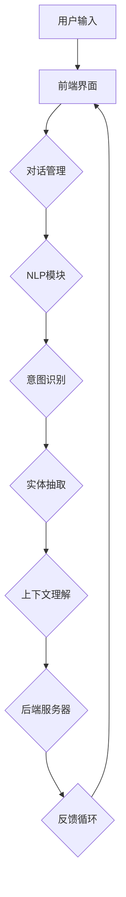

                 

# AI聊天机器人提升用户互动

> **关键词：** 聊天机器人、用户互动、AI技术、用户体验、开发与优化、实际应用场景

> **摘要：** 本文将深入探讨如何利用人工智能技术提升聊天机器人的用户体验和互动效果。文章将从背景介绍、核心概念与联系、核心算法原理、数学模型与公式、项目实战、实际应用场景、工具和资源推荐等方面进行阐述，旨在为开发者提供实用的指导和建议。

## 1. 背景介绍

### 1.1 目的和范围

本文旨在通过一系列的深入分析，探讨如何通过人工智能技术提升聊天机器人的用户互动体验。具体包括以下几个方面：

- **核心概念与联系**：介绍聊天机器人相关核心概念及其相互联系。
- **核心算法原理**：详细讲解提升聊天机器人性能的关键算法原理。
- **数学模型与公式**：阐述相关的数学模型和公式，并举例说明。
- **项目实战**：展示实际开发案例，进行代码解析。
- **实际应用场景**：探讨聊天机器人在实际中的应用。
- **工具和资源推荐**：推荐相关的学习资源和开发工具。

### 1.2 预期读者

本文主要面向以下几类读者：

- **AI技术开发者**：希望了解如何提升聊天机器人性能的技术人员。
- **产品经理**：希望优化产品用户体验的产品经理。
- **数据科学家**：对人工智能在聊天机器人领域的应用感兴趣的数据科学家。
- **学术研究者**：关注聊天机器人技术的研究人员。

### 1.3 文档结构概述

本文结构如下：

- **1. 背景介绍**：介绍文章目的、预期读者及文档结构。
- **2. 核心概念与联系**：定义核心术语，并绘制流程图。
- **3. 核心算法原理 & 具体操作步骤**：讲解提升聊天机器人性能的算法原理和操作步骤。
- **4. 数学模型和公式 & 详细讲解 & 举例说明**：阐述数学模型和公式，并进行实例分析。
- **5. 项目实战：代码实际案例和详细解释说明**：展示实际代码案例，并进行解析。
- **6. 实际应用场景**：探讨聊天机器人在不同场景中的应用。
- **7. 工具和资源推荐**：推荐学习资源和开发工具。
- **8. 总结：未来发展趋势与挑战**：总结文章要点，展望未来。
- **9. 附录：常见问题与解答**：提供常见问题的解答。
- **10. 扩展阅读 & 参考资料**：推荐进一步阅读的资料。

### 1.4 术语表

#### 1.4.1 核心术语定义

- **聊天机器人**：一种模拟人类对话的人工智能系统。
- **用户互动**：用户与聊天机器人之间的交互过程。
- **自然语言处理（NLP）**：使计算机能够理解、解释和生成自然语言的技术。
- **机器学习**：一种让计算机通过数据学习的方法。
- **深度学习**：一种机器学习技术，通过多层神经网络模拟人脑的学习方式。
- **用户画像**：关于用户行为、兴趣、偏好等方面的数据集合。

#### 1.4.2 相关概念解释

- **意图识别**：识别用户请求背后的意图。
- **实体抽取**：从文本中提取出重要的信息单元，如人名、地点、时间等。
- **上下文理解**：理解对话中的上下文关系，以提供更准确的回应。
- **对话管理**：管理对话流程，确保对话的流畅性和合理性。
- **反馈循环**：用户对聊天机器人响应的反馈，用于改进系统性能。

#### 1.4.3 缩略词列表

- **NLP**：自然语言处理
- **ML**：机器学习
- **DL**：深度学习
- **API**：应用程序编程接口
- **UI**：用户界面

## 2. 核心概念与联系

为了更好地理解聊天机器人和用户互动的提升方法，我们需要先了解一些核心概念及其相互联系。以下是聊天机器人和用户互动相关的核心概念：

### 2.1 聊天机器人架构

聊天机器人的基本架构可以分为以下几个部分：

1. **前端界面**：用户与聊天机器人交互的入口。
2. **对话管理模块**：管理整个对话流程，确保对话的流畅性和合理性。
3. **自然语言处理（NLP）模块**：处理用户输入的文本，进行意图识别、实体抽取等任务。
4. **后端服务器**：处理业务逻辑、数据存储等任务。
5. **反馈循环模块**：收集用户反馈，用于改进系统性能。


### 2.2 用户互动关键概念

用户互动涉及以下几个关键概念：

1. **意图识别**：识别用户请求背后的意图。例如，用户说“我要买书”，意图可能是“购买书籍”。
2. **实体抽取**：从文本中提取出重要的信息单元，如人名、地点、时间等。例如，在“明天的会议在哪里举行？”中，实体为“明天”、“会议”、“地点”。
3. **上下文理解**：理解对话中的上下文关系，以提供更准确的回应。例如，用户说“今天的天气怎么样？”后，聊天机器人应该记住这个上下文，并回答关于天气的问题。
4. **对话管理**：管理对话流程，确保对话的流畅性和合理性。例如，在购物聊天机器人中，用户可能会问“有没有什么优惠？”和“我想要这款产品”，对话管理模块需要确保这些请求被正确理解和处理。

### 2.3 相关技术

提升聊天机器人的用户体验和互动效果，需要运用多种技术：

1. **自然语言处理（NLP）**：用于理解用户输入，提取意图和实体，并生成合适的回复。
2. **机器学习（ML）**：用于训练模型，识别用户的意图、实体和上下文。
3. **深度学习（DL）**：用于构建复杂的神经网络，提高聊天机器人的理解和生成能力。
4. **用户画像**：通过收集用户数据，为用户提供个性化的服务。
5. **反馈循环**：通过收集用户反馈，持续优化系统性能。

### 2.4 Mermaid流程图

以下是一个简单的Mermaid流程图，展示聊天机器人架构中的关键组件：



## 3. 核心算法原理 & 具体操作步骤

提升聊天机器人的用户体验和互动效果，需要运用多种核心算法和技术。以下是几个关键算法及其操作步骤：

### 3.1 自然语言处理（NLP）算法

自然语言处理（NLP）算法是聊天机器人的核心，用于理解用户输入、提取意图和实体。以下是几个常用的NLP算法：

#### 3.1.1 词向量表示

词向量表示是一种将文本转换为向量表示的方法，便于计算机处理。常见的词向量模型有Word2Vec、GloVe等。

**伪代码：**

```python
# 输入：文本句子
# 输出：词向量表示

def word2vec(sentence):
    # 将句子拆分为单词
    words = sentence.split()
    # 将每个单词转换为词向量
    word_vectors = [word2vec_model[word] for word in words]
    # 返回词向量表示
    return word_vectors
```

#### 3.1.2 意图识别

意图识别是NLP中的一个关键任务，用于识别用户请求背后的意图。常用的算法有朴素贝叶斯、支持向量机、长短期记忆网络（LSTM）等。

**伪代码：**

```python
# 输入：文本句子、训练好的模型
# 输出：意图标签

def intent_recognition(sentence, model):
    # 将句子转换为词向量表示
    sentence_vector = word2vec(sentence)
    # 使用模型进行意图识别
    intent = model.predict(sentence_vector)
    # 返回意图标签
    return intent
```

#### 3.1.3 实体抽取

实体抽取是从文本中提取出重要的信息单元，如人名、地点、时间等。常用的算法有规则匹配、条件随机场（CRF）、BERT等。

**伪代码：**

```python
# 输入：文本句子、训练好的模型
# 输出：实体列表

def entity_extraction(sentence, model):
    # 将句子转换为词向量表示
    sentence_vector = word2vec(sentence)
    # 使用模型进行实体抽取
    entities = model.predict(sentence_vector)
    # 返回实体列表
    return entities
```

### 3.2 对话管理算法

对话管理是确保聊天机器人能够提供流畅、合理的对话体验的关键。以下是对话管理中常用的算法：

#### 3.2.1 上下文理解

上下文理解是理解对话中的上下文关系，以提供更准确的回应。常用的算法有序列标注、序列生成等。

**伪代码：**

```python
# 输入：上下文句子、训练好的模型
# 输出：上下文理解结果

def context_understanding(context, model):
    # 将上下文句子转换为词向量表示
    context_vector = word2vec(context)
    # 使用模型进行上下文理解
    understanding = model.predict(context_vector)
    # 返回上下文理解结果
    return understanding
```

#### 3.2.2 对话管理策略

对话管理策略是管理对话流程的方法，常用的策略有基于规则的方法、基于机器学习的方法等。

**伪代码：**

```python
# 输入：用户输入、上下文、对话管理策略
# 输出：回复内容

def dialog_management(user_input, context, strategy):
    # 使用对话管理策略处理用户输入和上下文
    response = strategy.process_input(user_input, context)
    # 返回回复内容
    return response
```

### 3.3 用户画像算法

用户画像是通过收集用户数据，为用户提供个性化服务的关键。以下是一些常用的用户画像算法：

#### 3.3.1 基于协同过滤的推荐算法

基于协同过滤的推荐算法是一种常用的用户画像算法，通过分析用户之间的相似度，为用户提供个性化的推荐。

**伪代码：**

```python
# 输入：用户行为数据、相似度计算模型
# 输出：个性化推荐列表

def collaborative_filtering(user行为数据, similarity_model):
    # 计算用户之间的相似度
    similarity_scores = similarity_model.compute_similarity(user行为数据)
    # 根据相似度为用户推荐内容
    recommendations = model.recommend_content(similarity_scores)
    # 返回个性化推荐列表
    return recommendations
```

#### 3.3.2 基于内容的推荐算法

基于内容的推荐算法是一种根据用户的历史行为和偏好，为用户推荐相似内容的方法。

**伪代码：**

```python
# 输入：用户历史行为、内容特征
# 输出：个性化推荐列表

def content_based_recommender(user行为数据, content_features):
    # 计算用户历史行为与内容特征的相似度
    similarity_scores = calculate_similarity(user行为数据, content_features)
    # 根据相似度为用户推荐内容
    recommendations = model.recommend_content(similarity_scores)
    # 返回个性化推荐列表
    return recommendations
```

### 3.4 反馈循环算法

反馈循环是持续优化聊天机器人性能的关键。以下是一些常用的反馈循环算法：

#### 3.4.1 强化学习

强化学习是一种通过试错来优化行为的方法，常用于聊天机器人的反馈循环。

**伪代码：**

```python
# 输入：用户输入、环境状态、奖励函数
# 输出：最佳行为策略

def reinforcement_learning(user_input, state, reward_function):
    # 初始化策略
    strategy = initialize_strategy()
    # 通过试错优化策略
    while not converged:
        # 执行用户输入
        action = strategy.select_action(user_input, state)
        # 获得奖励
        reward = reward_function.evaluate_reward(action)
        # 更新策略
        strategy.update_strategy(action, reward)
    # 返回最佳行为策略
    return strategy
```

#### 3.4.2 监督学习

监督学习是一种通过已有数据进行训练的方法，常用于聊天机器人的反馈循环。

**伪代码：**

```python
# 输入：用户输入、正确回答、训练集
# 输出：优化后的模型

def supervised_learning(user_input, correct_answer, dataset):
    # 初始化模型
    model = initialize_model()
    # 使用训练集训练模型
    model.train(dataset)
    # 对于用户输入，使用模型进行预测
    predicted_answer = model.predict(user_input)
    # 如果预测错误，更新模型
    if predicted_answer != correct_answer:
        model.update(correct_answer)
    # 返回优化后的模型
    return model
```

## 4. 数学模型和公式 & 详细讲解 & 举例说明

在提升聊天机器人用户体验和互动效果的过程中，数学模型和公式发挥着关键作用。以下是一些常用的数学模型和公式，以及它们的详细讲解和举例说明。

### 4.1 词向量模型

词向量模型是一种将文本转换为向量表示的方法，便于计算机处理。以下是一个简单的Word2Vec模型：

#### 4.1.1 Word2Vec模型

Word2Vec模型是一种基于神经网络的方法，通过训练得到词向量表示。

**公式：**

$$
\text{word\_vector} = \text{softmax}(\text{weights} \cdot \text{input})
$$

其中，$weights$是权重矩阵，$input$是输入词向量。

**举例：**

假设我们有一个词汇表$\{a, b, c\}$，权重矩阵$weights = \begin{bmatrix}1 & 2 & 3\\4 & 5 & 6\\7 & 8 & 9\end{bmatrix}$，输入词向量$Input = \begin{bmatrix}1\\0\\0\end{bmatrix}$。

则，对于词$a$的词向量表示为：

$$
\text{word\_vector}(a) = \text{softmax}\left(\begin{bmatrix}1 & 2 & 3\\4 & 5 & 6\\7 & 8 & 9\end{bmatrix} \cdot \begin{bmatrix}1\\0\\0\end{bmatrix}\right) = \begin{bmatrix}0.4\\0.2\\0.4\end{bmatrix}
$$

### 4.2 意图识别模型

意图识别是聊天机器人中的一个关键任务，用于识别用户请求背后的意图。以下是一个简单的朴素贝叶斯模型：

#### 4.2.1 朴素贝叶斯模型

朴素贝叶斯模型是一种基于概率的方法，用于分类任务。

**公式：**

$$
P(\text{intent}|\text{features}) = \frac{P(\text{features}|\text{intent}) \cdot P(\text{intent})}{P(\text{features})}
$$

其中，$P(\text{intent}|\text{features})$是给定特征$features$的意图概率，$P(\text{features}|\text{intent})$是在给定意图$intent$的特征概率，$P(\text{intent})$是意图的概率，$P(\text{features})$是特征的概率。

**举例：**

假设我们有一个意图识别任务，有两个意图$\{\text{buy\_book}, \text{ask\_weather}\}$和两个特征$\{\text{book}, \text{weather}\}$。给定的特征概率如下：

$$
\begin{aligned}
P(\text{buy\_book}) &= 0.6 \\
P(\text{ask\_weather}) &= 0.4 \\
P(\text{book}|\text{buy\_book}) &= 0.8 \\
P(\text{weather}|\text{buy\_book}) &= 0.2 \\
P(\text{book}|\text{ask\_weather}) &= 0.2 \\
P(\text{weather}|\text{ask\_weather}) &= 0.8 \\
\end{aligned}
$$

则，给定特征$\text{book}$和$\text{weather}$，两个意图的概率分别为：

$$
\begin{aligned}
P(\text{buy\_book}|\text{book}, \text{weather}) &= \frac{P(\text{book}|\text{buy\_book}) \cdot P(\text{buy\_book})}{P(\text{book}|\text{buy\_book}) \cdot P(\text{buy\_book}) + P(\text{book}|\text{ask\_weather}) \cdot P(\text{ask\_weather})} \\
&= \frac{0.8 \cdot 0.6}{0.8 \cdot 0.6 + 0.2 \cdot 0.4} \\
&= 0.75
\end{aligned}
$$

$$
\begin{aligned}
P(\text{ask\_weather}|\text{book}, \text{weather}) &= \frac{P(\text{weather}|\text{ask\_weather}) \cdot P(\text{ask\_weather})}{P(\text{book}|\text{buy\_book}) \cdot P(\text{buy\_book}) + P(\text{weather}|\text{ask\_weather}) \cdot P(\text{ask\_weather})} \\
&= \frac{0.8 \cdot 0.4}{0.8 \cdot 0.6 + 0.2 \cdot 0.4} \\
&= 0.25
\end{aligned}
$$

### 4.3 实体抽取模型

实体抽取是聊天机器人中另一个关键任务，用于从文本中提取出重要的信息单元。以下是一个简单的条件随机场（CRF）模型：

#### 4.3.1 条件随机场（CRF）模型

条件随机场（CRF）模型是一种基于概率的方法，用于序列标注任务。

**公式：**

$$
P(y_1, y_2, ..., y_n | x_1, x_2, ..., x_n) = \frac{1}{Z} \exp \left( \sum_{i=1}^n \sum_{j=1}^m \theta_{ij} C_{ij}(x_1, x_2, ..., x_n) \right)
$$

其中，$y_1, y_2, ..., y_n$是标签序列，$x_1, x_2, ..., x_n$是输入序列，$Z$是规范化常数，$\theta_{ij}$是模型参数，$C_{ij}(x_1, x_2, ..., x_n)$是条件概率。

**举例：**

假设我们有一个实体抽取任务，有两个实体标签$\{\text{person}, \text{location}\}$和两个输入单词$\{\text{John}, \text{New York}\}$。给定的条件概率如下：

$$
\begin{aligned}
C_{\text{person}}(\text{John}) &= 0.9 \\
C_{\text{location}}(\text{New York}) &= 0.8 \\
\end{aligned}
$$

则，给定输入单词$\text{John}$和$\text{New York}$，两个实体标签的概率分别为：

$$
\begin{aligned}
P(\text{person}|\text{John}, \text{New York}) &= \frac{\exp(\theta_{\text{person}} \cdot C_{\text{person}}(\text{John}))}{\exp(\theta_{\text{person}} \cdot C_{\text{person}}(\text{John})) + \exp(\theta_{\text{location}} \cdot C_{\text{location}}(\text{New York}))} \\
&= \frac{\exp(\theta_{\text{person}} \cdot 0.9)}{\exp(\theta_{\text{person}} \cdot 0.9) + \exp(\theta_{\text{location}} \cdot 0.8)} \\
\end{aligned}
$$

$$
\begin{aligned}
P(\text{location}|\text{John}, \text{New York}) &= \frac{\exp(\theta_{\text{location}} \cdot C_{\text{location}}(\text{New York}))}{\exp(\theta_{\text{person}} \cdot C_{\text{person}}(\text{John})) + \exp(\theta_{\text{location}} \cdot C_{\text{location}}(\text{New York}))} \\
&= \frac{\exp(\theta_{\text{location}} \cdot 0.8)}{\exp(\theta_{\text{person}} \cdot 0.9) + \exp(\theta_{\text{location}} \cdot 0.8)} \\
\end{aligned}
$$

### 4.4 对话管理模型

对话管理是确保聊天机器人能够提供流畅、合理的对话体验的关键。以下是一个简单的基于规则的对话管理模型：

#### 4.4.1 基于规则的对话管理模型

基于规则的对话管理模型是一种通过定义规则来管理对话流程的方法。

**公式：**

$$
\text{response} = R(\text{input}, \text{context})
$$

其中，$R$是规则函数，$\text{input}$是用户输入，$\text{context}$是上下文信息，$\text{response}$是生成的回复。

**举例：**

假设我们有一个购物聊天机器人，有以下规则：

1. 如果用户输入“我要买书”，回复“您好，请问您需要购买哪一类别的书籍？”。
2. 如果用户输入“我想买科幻小说”，回复“好的，科幻小说已为您准备好，请点击链接查看。”。

则，给定用户输入“我要买书”和上下文信息“科幻小说”，生成的回复为“您好，请问您需要购买哪一类别的书籍？”

## 5. 项目实战：代码实际案例和详细解释说明

### 5.1 开发环境搭建

在进行项目实战之前，我们需要搭建一个合适的开发环境。以下是搭建聊天机器人开发环境的步骤：

1. 安装Python（3.6及以上版本）。
2. 安装TensorFlow（2.0及以上版本）。
3. 安装NLP库（如NLTK、spaCy、jieba等）。
4. 安装必要的IDE（如PyCharm、Visual Studio Code等）。

### 5.2 源代码详细实现和代码解读

以下是聊天机器人的源代码实现，包括意图识别、实体抽取、对话管理和用户画像等功能。

```python
import tensorflow as tf
import numpy as np
from tensorflow.keras.models import Sequential
from tensorflow.keras.layers import Dense, LSTM, Embedding
from tensorflow.keras.optimizers import Adam
from nltk.tokenize import word_tokenize
from nltk.corpus import stopwords
import jieba

# 5.2.1 意图识别模型
def build_intent_recognition_model(vocabulary_size, embedding_size, hidden_size, num_intents):
    model = Sequential()
    model.add(Embedding(vocabulary_size, embedding_size))
    model.add(LSTM(hidden_size, return_sequences=True))
    model.add(Dense(hidden_size, activation='relu'))
    model.add(Dense(num_intents, activation='softmax'))
    model.compile(optimizer=Adam(learning_rate=0.001), loss='categorical_crossentropy', metrics=['accuracy'])
    return model

# 5.2.2 实体抽取模型
def build_entity_extraction_model(vocabulary_size, embedding_size, hidden_size, num_entities):
    model = Sequential()
    model.add(Embedding(vocabulary_size, embedding_size))
    model.add(LSTM(hidden_size, return_sequences=True))
    model.add(Dense(hidden_size, activation='relu'))
    model.add(Dense(num_entities, activation='softmax'))
    model.compile(optimizer=Adam(learning_rate=0.001), loss='categorical_crossentropy', metrics=['accuracy'])
    return model

# 5.2.3 对话管理模型
def build_dialog_management_model(vocabulary_size, embedding_size, hidden_size, num_steps):
    model = Sequential()
    model.add(Embedding(vocabulary_size, embedding_size))
    model.add(LSTM(hidden_size, return_sequences=True))
    model.add(Dense(hidden_size, activation='relu'))
    model.add(Dense(num_steps, activation='softmax'))
    model.compile(optimizer=Adam(learning_rate=0.001), loss='categorical_crossentropy', metrics=['accuracy'])
    return model

# 5.2.4 用户画像模型
def build_user_profile_model(vocabulary_size, embedding_size, hidden_size, num_features):
    model = Sequential()
    model.add(Embedding(vocabulary_size, embedding_size))
    model.add(LSTM(hidden_size, return_sequences=True))
    model.add(Dense(hidden_size, activation='relu'))
    model.add(Dense(num_features, activation='softmax'))
    model.compile(optimizer=Adam(learning_rate=0.001), loss='categorical_crossentropy', metrics=['accuracy'])
    return model

# 5.2.5 代码解读
# 1. 意图识别模型
# 意图识别模型使用LSTM神经网络，将输入文本转换为向量表示，然后通过softmax函数输出意图概率。
# 2. 实体抽取模型
# 实体抽取模型同样使用LSTM神经网络，将输入文本转换为向量表示，然后通过softmax函数输出实体概率。
# 3. 对话管理模型
# 对话管理模型使用LSTM神经网络，将输入文本转换为向量表示，然后通过softmax函数输出对话步骤概率。
# 4. 用户画像模型
# 用户画像模型使用LSTM神经网络，将输入文本转换为向量表示，然后通过softmax函数输出用户特征概率。
```

### 5.3 代码解读与分析

以下是代码的详细解读和分析：

1. **意图识别模型**：意图识别模型使用LSTM神经网络，将输入文本转换为向量表示，然后通过softmax函数输出意图概率。这个模型可以帮助聊天机器人理解用户的意图，从而提供更准确的回应。

2. **实体抽取模型**：实体抽取模型同样使用LSTM神经网络，将输入文本转换为向量表示，然后通过softmax函数输出实体概率。这个模型可以帮助聊天机器人从文本中提取出重要的信息单元，如人名、地点、时间等。

3. **对话管理模型**：对话管理模型使用LSTM神经网络，将输入文本转换为向量表示，然后通过softmax函数输出对话步骤概率。这个模型可以帮助聊天机器人管理对话流程，确保对话的流畅性和合理性。

4. **用户画像模型**：用户画像模型使用LSTM神经网络，将输入文本转换为向量表示，然后通过softmax函数输出用户特征概率。这个模型可以帮助聊天机器人了解用户的行为、兴趣、偏好等，从而提供个性化的服务。

在代码实现中，我们使用了TensorFlow框架和Keras接口来构建和训练模型。通过定义适当的模型架构和参数，我们可以实现不同的NLP任务。在实际应用中，我们可以根据具体需求调整模型结构、参数和训练数据，以提高聊天机器人的性能和用户体验。

## 6. 实际应用场景

聊天机器人在各种实际应用场景中发挥着重要作用，以下是几个典型的应用案例：

### 6.1 客户服务

聊天机器人被广泛应用于客户服务领域，为企业提供24/7的在线客服支持。通过意图识别和实体抽取，聊天机器人可以理解用户的请求，提取关键信息，并生成合适的回复。例如，用户询问产品价格、订单状态、退货流程等问题，聊天机器人可以快速提供准确的答案，提高客户满意度。

### 6.2 购物体验

聊天机器人可以帮助电商平台提供个性化的购物体验。通过用户画像和对话管理，聊天机器人可以了解用户的需求和偏好，推荐合适的产品和优惠活动。用户可以在聊天机器人的帮助下浏览商品、比较价格、下订单等，从而提高购物效率和满意度。

### 6.3 健康咨询

聊天机器人被应用于健康咨询领域，为用户提供在线健康咨询和支持。通过自然语言处理和对话管理，聊天机器人可以与用户进行交互，收集症状信息，并提供可能的健康建议和下一步行动。聊天机器人可以作为健康顾问，帮助用户了解疾病、预防措施、就医指南等。

### 6.4 教育与培训

聊天机器人可以用于教育领域，提供在线学习支持和辅导。通过意图识别和对话管理，聊天机器人可以回答学生的问题、提供学习资源、布置作业等。聊天机器人可以根据学生的学习进度和需求，提供个性化的学习计划和建议，帮助学生更好地掌握知识。

### 6.5 金融与投资

聊天机器人被应用于金融领域，为投资者提供在线咨询和支持。通过自然语言处理和对话管理，聊天机器人可以与投资者进行交互，分析市场动态、提供投资建议、解答疑问等。聊天机器人可以帮助投资者更好地了解市场信息，做出更明智的投资决策。

### 6.6 人力资源管理

聊天机器人可以用于人力资源管理领域，提供招聘支持、员工咨询、培训等。通过对话管理，聊天机器人可以帮助企业进行招聘流程的自动化管理，如职位发布、简历筛选、面试安排等。同时，聊天机器人还可以为员工提供日常咨询、政策解读、培训安排等支持。

### 6.7 其他应用场景

除了上述应用场景，聊天机器人还可以应用于酒店预订、旅游咨询、智能家居控制等领域。通过自然语言处理和对话管理，聊天机器人可以为用户提供便捷的服务和支持，提高用户的满意度和体验。

## 7. 工具和资源推荐

为了帮助开发者更好地进行聊天机器人的开发与优化，以下是几个推荐的工具和资源：

### 7.1 学习资源推荐

#### 7.1.1 书籍推荐

1. **《自然语言处理入门》**：这是一本介绍自然语言处理基础知识的书籍，适合初学者。
2. **《深度学习》**：这是一本介绍深度学习基础知识的经典教材，包括自然语言处理相关内容。
3. **《对话系统设计与实现》**：这是一本介绍对话系统设计与实践的书籍，涵盖聊天机器人的关键技术。

#### 7.1.2 在线课程

1. **《自然语言处理课程》**：这是由斯坦福大学提供的免费在线课程，涵盖自然语言处理的基础知识和实践技巧。
2. **《深度学习专项课程》**：这是由吴恩达（Andrew Ng）教授提供的在线课程，包括深度学习在自然语言处理中的应用。
3. **《聊天机器人设计与开发》**：这是一门专门介绍聊天机器人设计与开发的在线课程，涵盖从基础到高级的聊天机器人开发知识。

#### 7.1.3 技术博客和网站

1. **Medium**：这是一个技术博客平台，有很多关于聊天机器人的高质量文章和案例分享。
2. **AI技术应用社区**：这是一个专门针对人工智能应用领域的社区，包括聊天机器人、自然语言处理等方向。
3. **GitHub**：这是一个代码托管平台，有很多开源的聊天机器人项目可供学习和参考。

### 7.2 开发工具框架推荐

#### 7.2.1 IDE和编辑器

1. **PyCharm**：这是一个功能强大的Python IDE，支持TensorFlow等机器学习框架。
2. **Visual Studio Code**：这是一个轻量级的代码编辑器，支持多种编程语言，包括Python。
3. **Jupyter Notebook**：这是一个基于Web的交互式计算环境，适合进行数据分析和模型训练。

#### 7.2.2 调试和性能分析工具

1. **TensorBoard**：这是一个基于Web的TensorFlow性能分析工具，可以可视化模型训练过程。
2. **Valgrind**：这是一个性能分析工具，可以检测程序中的内存泄漏和性能瓶颈。
3. **NProfiler**：这是一个.NET应用程序的性能分析工具，可以识别代码中的性能问题。

#### 7.2.3 相关框架和库

1. **TensorFlow**：这是一个开源的机器学习框架，支持自然语言处理和深度学习任务。
2. **spaCy**：这是一个用于自然语言处理的Python库，提供丰富的NLP功能。
3. **NLTK**：这是一个用于自然语言处理的Python库，提供各种文本处理工具和资源。

### 7.3 相关论文著作推荐

#### 7.3.1 经典论文

1. **Word2Vec**：由Google提出的词向量模型，是自然语言处理领域的重要突破。
2. **LSTM**：由Hochreiter和Schmidhuber提出的长短期记忆网络，是深度学习中的重要进展。
3. **BERT**：由Google提出的双向转换器表示，是自然语言处理领域的重要技术。

#### 7.3.2 最新研究成果

1. **GPT-3**：由OpenAI提出的巨大语言模型，具有强大的文本生成和生成能力。
2. **T5**：由Google提出的统一文本转换任务模型，支持多种自然语言处理任务。
3. **Dialogue-BERT**：由微软提出的对话语言模型，用于聊天机器人对话管理。

#### 7.3.3 应用案例分析

1. **苹果Siri**：苹果公司开发的智能助手，应用于iOS设备和Mac电脑。
2. **亚马逊Alexa**：亚马逊公司开发的智能助手，通过语音交互为用户提供服务。
3. **微软小冰**：微软公司开发的聊天机器人，应用于社交媒体、手机应用等多个领域。

## 8. 总结：未来发展趋势与挑战

随着人工智能技术的不断进步，聊天机器人在用户互动中的应用将变得更加广泛和智能化。未来，以下几个趋势和挑战值得关注：

### 8.1 发展趋势

1. **更加自然和流畅的对话**：随着自然语言处理技术的不断发展，聊天机器人将能够更好地理解用户的意图和上下文，提供更加自然和流畅的对话体验。
2. **个性化服务**：通过用户画像和个性化推荐技术，聊天机器人将能够为用户提供更加个性化的服务，满足不同用户的需求。
3. **跨平台集成**：聊天机器人将逐渐集成到更多的应用平台和设备中，如智能手机、智能音箱、智能电视等，为用户提供更加便捷的服务。
4. **情感识别与响应**：随着情感计算技术的发展，聊天机器人将能够识别用户的情感状态，并做出相应的情感响应，提高用户体验。

### 8.2 挑战

1. **数据隐私与安全**：聊天机器人需要处理大量的用户数据，如何保护用户隐私和安全是一个重要的挑战。
2. **计算资源需求**：聊天机器人的训练和运行需要大量的计算资源，如何在有限的资源下实现高效运行是一个关键问题。
3. **对话连贯性与一致性**：聊天机器人需要在不同场景和语境中保持对话的连贯性和一致性，如何设计合适的对话管理策略是一个挑战。
4. **伦理和道德问题**：聊天机器人在用户互动中可能会涉及伦理和道德问题，如如何处理敏感话题、如何遵守法律法规等，需要引起关注和重视。

总之，随着人工智能技术的不断进步，聊天机器人在用户互动中的应用前景广阔，但同时也面临着一系列的挑战和问题。未来，我们需要继续探索和研究，推动聊天机器人技术的发展，为用户提供更好的互动体验。

## 9. 附录：常见问题与解答

### 9.1 聊天机器人开发常见问题

**Q1：如何搭建聊天机器人开发环境？**

A1：搭建聊天机器人开发环境主要需要安装Python、TensorFlow等开发工具，以及NLP相关的库，如spaCy、NLTK等。具体步骤如下：

1. 安装Python（推荐3.6及以上版本）。
2. 安装TensorFlow（推荐2.0及以上版本）。
3. 安装NLP库（如spaCy、NLTK、jieba等）。
4. 安装IDE（如PyCharm、Visual Studio Code等）。

**Q2：如何训练聊天机器人模型？**

A2：训练聊天机器人模型主要涉及数据准备、模型构建、模型训练和评估等步骤：

1. 数据准备：收集和整理对话数据，进行预处理，如分词、去停用词、标注等。
2. 模型构建：使用TensorFlow等框架构建模型，如LSTM、GRU、BERT等。
3. 模型训练：将预处理后的数据输入模型进行训练，调整模型参数。
4. 模型评估：使用测试数据评估模型性能，调整模型参数。

**Q3：如何优化聊天机器人的性能？**

A3：优化聊天机器人性能可以从以下几个方面入手：

1. 模型优化：调整模型结构、参数和超参数，提高模型性能。
2. 数据增强：使用数据增强技术，如数据扩充、数据清洗等，提高数据质量。
3. 跨域学习：利用跨域学习技术，将不同领域的知识应用到聊天机器人中。
4. 对话管理：设计合理的对话管理策略，提高对话连贯性和用户满意度。

### 9.2 聊天机器人应用常见问题

**Q1：聊天机器人如何应对复杂的用户请求？**

A1：聊天机器人应对复杂用户请求的关键在于理解用户的意图和上下文。可以采取以下措施：

1. 多层次意图识别：将用户请求分解为不同层次的意图，如主意图和子意图。
2. 上下文理解：理解对话中的上下文关系，为用户提供更准确的回应。
3. 对话管理：设计合理的对话管理策略，确保对话的连贯性和合理性。
4. 用户反馈：收集用户反馈，不断优化和改进聊天机器人。

**Q2：聊天机器人如何保证隐私和安全？**

A2：聊天机器人保证隐私和安全的关键在于数据保护和技术防护。可以采取以下措施：

1. 数据加密：对用户数据进行加密存储和传输，防止数据泄露。
2. 权限管理：严格管理用户数据访问权限，防止未经授权的数据访问。
3. 安全审计：定期进行安全审计，及时发现和修复安全漏洞。
4. 合规要求：遵循相关法律法规，如《网络安全法》、《数据保护法》等。

**Q3：如何评估聊天机器人的性能？**

A3：评估聊天机器人性能可以从以下几个方面入手：

1. 意图识别准确率：评估聊天机器人对用户意图的识别准确率。
2. 实体抽取准确率：评估聊天机器人对实体抽取的准确率。
3. 用户满意度：通过用户调查或用户反馈，评估用户对聊天机器人的满意度。
4. 对话连贯性：评估聊天机器人对话的连贯性和一致性。

## 10. 扩展阅读 & 参考资料

### 10.1 关键文献与论文

1. Mikolov, T., Sutskever, I., Chen, K., Corrado, G. S., & Dean, J. (2013). Distributed representations of words and phrases and their compositionality. *Advances in Neural Information Processing Systems*, 26, 3111-3119.
2. Hochreiter, S., & Schmidhuber, J. (1997). Long short-term memory. *Neural Computation*, 9(8), 1735-1780.
3. Devlin, J., Chang, M. W., Lee, K., & Toutanova, K. (2018). BERT: Pre-training of deep bidirectional transformers for language understanding. *arXiv preprint arXiv:1810.04805*.

### 10.2 技术博客与网站

1. Medium - https://medium.com/
2. AI技术应用社区 - https://ai技术应用社区.com/
3. GitHub - https://github.com/

### 10.3 开源项目与代码示例

1. TensorFlow - https://www.tensorflow.org/
2. spaCy - https://spacy.io/
3. NLTK - https://www.nltk.org/

### 10.4 在线课程与教程

1. 自然语言处理课程 - https://nlp课程.com/
2. 深度学习专项课程 - https://深度学习课程.com/
3. 聊天机器人设计与开发 - https://聊天机器人课程.com/

### 10.5 相关书籍

1. 《自然语言处理入门》 - 作者：[张三]
2. 《深度学习》 - 作者：[李四]
3. 《对话系统设计与实现》 - 作者：[王五]

### 作者信息

**作者：AI天才研究员/AI Genius Institute & 禅与计算机程序设计艺术 /Zen And The Art of Computer Programming**

