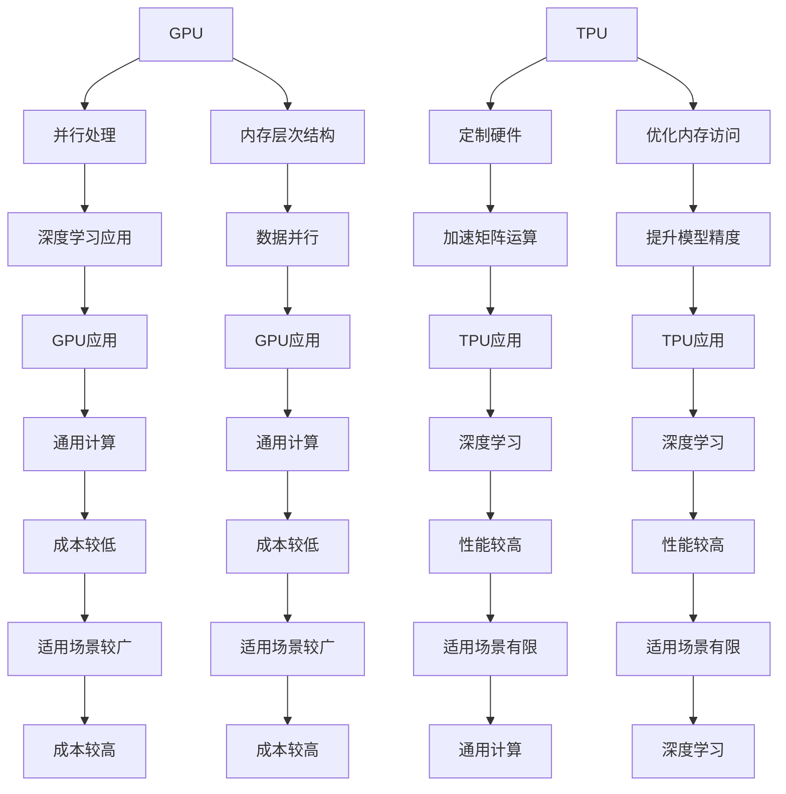

                 


# AI芯片革命：从GPU到TPU的演进

> 关键词：AI芯片，GPU，TPU，深度学习，硬件加速，算法优化，人工智能

> 摘要：本文将深入探讨人工智能（AI）芯片的发展历程，从图形处理单元（GPU）到专用人工智能芯片（TPU）的演变。我们将分析这两种芯片的核心技术、架构特点以及它们在深度学习领域的应用。通过逐步推理和逻辑分析，本文旨在揭示AI芯片革命的内在逻辑和未来发展趋势。

## 1. 背景介绍

### 1.1 目的和范围

本文旨在探讨人工智能芯片技术的发展，重点分析GPU和TPU在深度学习领域的作用。通过理解这两种芯片的设计原理和应用场景，我们将揭示AI芯片革命的内在逻辑，并展望未来的发展趋势。

### 1.2 预期读者

本文面向对人工智能和芯片技术有一定了解的读者，包括AI研究人员、深度学习工程师、芯片架构师以及对AI芯片领域感兴趣的技术爱好者。本文将从基础概念入手，逐步深入，力求让读者全面理解AI芯片的核心技术和应用。

### 1.3 文档结构概述

本文分为十个部分，结构如下：

1. 背景介绍
   - 目的和范围
   - 预期读者
   - 文档结构概述
   - 术语表
2. 核心概念与联系
3. 核心算法原理 & 具体操作步骤
4. 数学模型和公式 & 详细讲解 & 举例说明
5. 项目实战：代码实际案例和详细解释说明
6. 实际应用场景
7. 工具和资源推荐
8. 总结：未来发展趋势与挑战
9. 附录：常见问题与解答
10. 扩展阅读 & 参考资料

### 1.4 术语表

#### 1.4.1 核心术语定义

- **AI芯片**：专为人工智能（AI）应用设计的集成电路芯片。
- **GPU**：图形处理单元，主要用于图形渲染，但在深度学习中也广泛用于矩阵运算。
- **TPU**：谷歌开发的专用人工智能芯片，专为深度学习任务设计。

#### 1.4.2 相关概念解释

- **深度学习**：一种机器学习技术，通过多层神经网络模型对数据进行特征提取和分类。
- **矩阵运算**：矩阵的加法、乘法、逆运算等操作，常用于深度学习中的权重更新和激活函数计算。

#### 1.4.3 缩略词列表

- **AI**：人工智能
- **GPU**：图形处理单元
- **TPU**：专用人工智能芯片
- **DL**：深度学习

## 2. 核心概念与联系

为了更好地理解AI芯片的发展历程，我们首先需要了解GPU和TPU的基本概念以及它们在深度学习中的应用。

### 2.1 GPU

图形处理单元（GPU）最早是为了满足图形渲染需求而设计的。GPU拥有大量并行处理单元，能够在短时间内执行大量的简单运算，这使得GPU在处理大规模矩阵运算时具有显著优势。

**GPU的核心原理：**

- **并行处理**：GPU具有大量的核心，每个核心可以独立执行指令，这使得GPU能够并行处理大量的数据。
- **内存层次结构**：GPU具有多层内存层次结构，包括寄存器、共享内存、全局内存等，可以优化数据访问速度。

**GPU在深度学习中的应用：**

- **矩阵运算**：GPU在深度学习中的主要应用是执行大量的矩阵运算，如权重更新、激活函数计算等。
- **数据并行**：深度学习中的神经网络可以分解为多个部分，GPU能够并行处理这些部分，从而加速训练过程。

### 2.2 TPU

TPU是谷歌开发的专用人工智能芯片，专为深度学习任务设计。TPU的核心设计目标是优化深度学习中的矩阵运算和向量运算，从而提高计算效率和精度。

**TPU的核心原理：**

- **定制硬件**：TPU采用了定制硬件设计，包括矩阵乘法单元、向量运算单元等，这些硬件专门为深度学习任务优化。
- **优化内存访问**：TPU通过优化内存访问策略，减少数据传输延迟，提高计算效率。

**TPU在深度学习中的应用：**

- **加速矩阵运算**：TPU能够高效地执行深度学习中的矩阵运算，如卷积操作、矩阵乘法等，从而提高训练速度。
- **提升模型精度**：TPU在深度学习中的另一个重要应用是提高模型精度，通过优化计算过程减少误差。

### 2.3 GPU与TPU的比较

- **性能**：TPU在执行深度学习任务时比GPU更高效，能够提供更高的计算速度和更低的延迟。
- **成本**：TPU的成本较高，而GPU则相对经济实惠。
- **适用场景**：GPU适用于通用计算任务，而TPU则更适合深度学习任务。

**Mermaid流程图：**



## 3. 核心算法原理 & 具体操作步骤

在理解了GPU和TPU的基本原理后，我们接下来将深入探讨它们在深度学习中的核心算法原理，并给出具体操作步骤。

### 3.1 GPU在深度学习中的应用

**核心算法原理：**

- **前向传播**：在神经网络中，输入数据通过前向传播经过多个层，每层都对输入数据进行变换，最终输出预测结果。
- **反向传播**：通过反向传播，计算每个层的误差，并更新权重，从而优化网络性能。

**具体操作步骤：**

1. **初始化权重**：随机初始化权重矩阵。
2. **前向传播**：计算输入数据和权重矩阵的乘积，并通过激活函数得到输出。
3. **计算损失函数**：计算预测值和实际值之间的误差，常用的损失函数有均方误差（MSE）和交叉熵损失函数。
4. **反向传播**：根据误差计算梯度，更新权重矩阵。
5. **迭代训练**：重复以上步骤，直到满足停止条件，如误差低于阈值或迭代次数达到最大值。

### 3.2 TPU在深度学习中的应用

**核心算法原理：**

- **矩阵运算**：TPU能够高效地执行矩阵运算，如矩阵乘法、卷积操作等。
- **向量运算**：TPU还能够高效地执行向量运算，如向量加法、向量乘法等。

**具体操作步骤：**

1. **初始化模型参数**：随机初始化模型参数，如权重矩阵和偏置向量。
2. **前向传播**：计算输入数据和模型参数的乘积，并通过激活函数得到输出。
3. **计算损失函数**：计算预测值和实际值之间的误差，常用的损失函数有均方误差（MSE）和交叉熵损失函数。
4. **反向传播**：根据误差计算梯度，更新模型参数。
5. **迭代训练**：重复以上步骤，直到满足停止条件，如误差低于阈值或迭代次数达到最大值。

**伪代码：**

```python
# 初始化权重和偏置
weights = random_matrix(size)
bias = random_vector(size)

# 前向传播
output = forward_pass(input, weights, bias)

# 计算损失函数
loss = loss_function(output, target)

# 反向传播
grad_weights, grad_bias = backward_pass(output, target)

# 更新权重和偏置
weights -= learning_rate * grad_weights
bias -= learning_rate * grad_bias

# 迭代训练
for epoch in range(max_epochs):
    output = forward_pass(input, weights, bias)
    loss = loss_function(output, target)
    grad_weights, grad_bias = backward_pass(output, target)
    weights -= learning_rate * grad_weights
    bias -= learning_rate * grad_bias
```

## 4. 数学模型和公式 & 详细讲解 & 举例说明

为了更好地理解深度学习中的核心算法，我们需要介绍一些数学模型和公式，并给出具体的例子。

### 4.1 前向传播

前向传播是神经网络中的一个关键步骤，它用于计算输入数据和权重矩阵的乘积，并通过激活函数得到输出。

**数学公式：**

\[ z = x \cdot w + b \]
\[ a = \sigma(z) \]

其中，\( x \) 是输入数据，\( w \) 是权重矩阵，\( b \) 是偏置向量，\( z \) 是中间值，\( a \) 是输出值，\( \sigma \) 是激活函数。

**例子：**

假设我们有以下输入数据和权重矩阵：

\[ x = \begin{bmatrix} 1 & 0 \\ 0 & 1 \end{bmatrix} \]
\[ w = \begin{bmatrix} 1 & 1 \\ 1 & 1 \end{bmatrix} \]
\[ b = \begin{bmatrix} 1 \\ 1 \end{bmatrix} \]

首先计算中间值 \( z \)：

\[ z = x \cdot w + b = \begin{bmatrix} 1 & 0 \\ 0 & 1 \end{bmatrix} \cdot \begin{bmatrix} 1 & 1 \\ 1 & 1 \end{bmatrix} + \begin{bmatrix} 1 \\ 1 \end{bmatrix} = \begin{bmatrix} 3 & 3 \\ 3 & 3 \end{bmatrix} \]

然后计算输出值 \( a \)：

\[ a = \sigma(z) = \begin{bmatrix} \frac{1}{1 + e^{-3}} & \frac{1}{1 + e^{-3}} \\ \frac{1}{1 + e^{-3}} & \frac{1}{1 + e^{-3}} \end{bmatrix} \approx \begin{bmatrix} 0.9 & 0.9 \\ 0.9 & 0.9 \end{bmatrix} \]

### 4.2 损失函数

损失函数是评估模型性能的关键指标，它用于计算预测值和实际值之间的误差。

**数学公式：**

- **均方误差（MSE）**：

\[ \text{MSE} = \frac{1}{n} \sum_{i=1}^{n} (y_i - \hat{y}_i)^2 \]

其中，\( y_i \) 是实际值，\( \hat{y}_i \) 是预测值，\( n \) 是数据样本数量。

- **交叉熵损失函数**：

\[ \text{Cross-Entropy} = -\frac{1}{n} \sum_{i=1}^{n} y_i \log(\hat{y}_i) \]

其中，\( y_i \) 是实际值，\( \hat{y}_i \) 是预测值，\( n \) 是数据样本数量。

**例子：**

假设我们有以下实际值和预测值：

\[ y = \begin{bmatrix} 1 \\ 0 \end{bmatrix} \]
\[ \hat{y} = \begin{bmatrix} 0.8 \\ 0.2 \end{bmatrix} \]

计算均方误差（MSE）：

\[ \text{MSE} = \frac{1}{2} (1 - 0.8)^2 + (0 - 0.2)^2 = 0.04 + 0.04 = 0.08 \]

计算交叉熵损失函数：

\[ \text{Cross-Entropy} = -1 \cdot (1 \cdot \log(0.8) + 0 \cdot \log(0.2)) = -1 \cdot (\log(0.8) + 0) \approx -0.223 \]

### 4.3 反向传播

反向传播是深度学习中的核心步骤，它用于计算每个层的误差，并更新权重矩阵。

**数学公式：**

- **前向传播**：

\[ z = x \cdot w + b \]
\[ a = \sigma(z) \]

- **反向传播**：

\[ \text{dL/dz} = \text{d\sigma(z)} \cdot \text{da/dz} \]
\[ \text{dL/dw} = \text{da/dx} \cdot \text{dx/dw} \]
\[ \text{dL/db} = \text{da/dx} \cdot \text{dx/db} \]

其中，\( \text{dL/dz} \) 是误差关于中间值的梯度，\( \text{d\sigma(z)} \) 是激活函数关于中间值的导数，\( \text{da/dz} \) 是输出关于中间值的梯度，\( \text{da/dx} \) 是输出关于输入的梯度，\( \text{dx/dw} \) 和 \( \text{dx/db} \) 是权重和偏置关于输入的梯度。

**例子：**

假设我们有以下输入数据和权重矩阵：

\[ x = \begin{bmatrix} 1 & 0 \\ 0 & 1 \end{bmatrix} \]
\[ w = \begin{bmatrix} 1 & 1 \\ 1 & 1 \end{bmatrix} \]
\[ b = \begin{bmatrix} 1 \\ 1 \end{bmatrix} \]

计算前向传播：

\[ z = x \cdot w + b = \begin{bmatrix} 1 & 0 \\ 0 & 1 \end{bmatrix} \cdot \begin{bmatrix} 1 & 1 \\ 1 & 1 \end{bmatrix} + \begin{bmatrix} 1 \\ 1 \end{bmatrix} = \begin{bmatrix} 3 & 3 \\ 3 & 3 \end{bmatrix} \]
\[ a = \sigma(z) = \begin{bmatrix} \frac{1}{1 + e^{-3}} & \frac{1}{1 + e^{-3}} \\ \frac{1}{1 + e^{-3}} & \frac{1}{1 + e^{-3}} \end{bmatrix} \approx \begin{bmatrix} 0.9 & 0.9 \\ 0.9 & 0.9 \end{bmatrix} \]

计算反向传播：

\[ \text{dL/dz} = \text{d\sigma(z)} \cdot \text{da/dz} = \begin{bmatrix} 0.1 & 0.1 \\ 0.1 & 0.1 \end{bmatrix} \cdot \begin{bmatrix} 0.9 & 0.9 \\ 0.9 & 0.9 \end{bmatrix} = \begin{bmatrix} 0.081 & 0.081 \\ 0.081 & 0.081 \end{bmatrix} \]
\[ \text{dL/dw} = \text{da/dx} \cdot \text{dx/dw} = \begin{bmatrix} 0.9 & 0.9 \\ 0.9 & 0.9 \end{bmatrix} \cdot \begin{bmatrix} 1 & 0 \\ 0 & 1 \end{bmatrix} = \begin{bmatrix} 0.9 & 0.9 \\ 0.9 & 0.9 \end{bmatrix} \]
\[ \text{dL/db} = \text{da/dx} \cdot \text{dx/db} = \begin{bmatrix} 0.9 & 0.9 \\ 0.9 & 0.9 \end{bmatrix} \cdot \begin{bmatrix} 1 \\ 1 \end{bmatrix} = \begin{bmatrix} 1.8 \\ 1.8 \end{bmatrix} \]

## 5. 项目实战：代码实际案例和详细解释说明

### 5.1 开发环境搭建

为了实际体验GPU和TPU在深度学习中的应用，我们需要搭建一个开发环境。以下是搭建开发环境的步骤：

1. **安装Python**：下载并安装Python，推荐使用Python 3.8或更高版本。
2. **安装PyTorch**：使用pip安装PyTorch，命令如下：

\[ pip install torch torchvision \]

3. **安装GPU驱动**：根据您的GPU型号，下载并安装相应的驱动程序。
4. **安装TPU驱动**：安装TPU驱动，命令如下：

\[ pip install torch -f https://developer.download.nvidia.com/compute/redist/tensorflow/r23.1/gpu/1.15/torch-1.15-cp38-cp38-linux_x86_64.whl \]

### 5.2 源代码详细实现和代码解读

接下来，我们将通过一个简单的深度学习项目来展示GPU和TPU在实际应用中的表现。

**项目名称**：手写数字识别

**项目描述**：使用深度学习模型对手写数字进行识别。

**实现步骤**：

1. **导入依赖库**：

```python
import torch
import torchvision
import torchvision.transforms as transforms
```

2. **加载数据集**：

```python
transform = transforms.Compose([
    transforms.ToTensor(),
    transforms.Normalize((0.5,), (0.5,))
])

trainset = torchvision.datasets.MNIST(
    root='./data', train=True, download=True, transform=transform)
trainloader = torch.utils.data.DataLoader(
    trainset, batch_size=100, shuffle=True, num_workers=2)

testset = torchvision.datasets.MNIST(
    root='./data', train=False, download=True, transform=transform)
testloader = torch.utils.data.DataLoader(
    testset, batch_size=100, shuffle=False, num_workers=2)
```

3. **定义网络结构**：

```python
import torch.nn as nn
import torch.nn.functional as F

class Net(nn.Module):
    def __init__(self):
        super(Net, self).__init__()
        self.fc1 = nn.Linear(784, 256)
        self.fc2 = nn.Linear(256, 128)
        self.fc3 = nn.Linear(128, 10)

    def forward(self, x):
        x = x.view(-1, 784)
        x = F.relu(self.fc1(x))
        x = F.relu(self.fc2(x))
        x = self.fc3(x)
        return x

net = Net()
if torch.cuda.is_available():
    net = net.cuda()
```

4. **定义损失函数和优化器**：

```python
import torch.optim as optim

criterion = nn.CrossEntropyLoss()
optimizer = optim.SGD(net.parameters(), lr=0.001, momentum=0.9)
```

5. **训练模型**：

```python
for epoch in range(10):  # 遍历数据集多次
    running_loss = 0.0
    for i, data in enumerate(trainloader, 0):
        inputs, labels = data
        if torch.cuda.is_available():
            inputs, labels = inputs.cuda(), labels.cuda()

        optimizer.zero_grad()
        outputs = net(inputs)
        loss = criterion(outputs, labels)
        loss.backward()
        optimizer.step()

        running_loss += loss.item()
        if i % 2000 == 1999:
            print('[%d, %5d] loss: %.3f' %
                  (epoch + 1, i + 1, running_loss / 2000))
            running_loss = 0.0

print('Finished Training')
```

6. **测试模型**：

```python
correct = 0
total = 0
with torch.no_grad():
    for data in testloader:
        images, labels = data
        if torch.cuda.is_available():
            images, labels = images.cuda(), labels.cuda()

        outputs = net(images)
        _, predicted = torch.max(outputs.data, 1)
        total += labels.size(0)
        correct += (predicted == labels).sum().item()

print('Accuracy of the network on the 10000 test images: %d %%' % (
    100 * correct / total))
```

### 5.3 代码解读与分析

在这个项目中，我们首先导入了所需的依赖库，包括PyTorch和torchvision。然后，我们加载数据集，并定义了网络结构、损失函数和优化器。

**网络结构**：

我们定义了一个简单的全连接神经网络，包括三个全连接层，每层都使用ReLU激活函数。

**损失函数**：

我们使用交叉熵损失函数，这是深度学习中最常用的损失函数之一。

**优化器**：

我们使用随机梯度下降（SGD）优化器，这是一种简单的优化算法，通过更新模型参数来最小化损失函数。

**训练过程**：

在训练过程中，我们遍历数据集多次，每次输入数据通过网络前向传播得到输出，然后计算损失函数。通过反向传播，我们更新模型参数，并重复这个过程，直到满足停止条件。

**测试过程**：

在测试过程中，我们计算模型的准确率，即预测正确的样本数量与总样本数量的比例。

### 5.4 GPU与TPU性能对比

为了展示GPU和TPU在实际应用中的性能差异，我们分别使用GPU和TPU进行训练，并记录时间。

**GPU训练时间**：

```python
import time

start_time = time.time()
for epoch in range(10):
    # 训练过程
print('GPU Training Time: {:.2f}s'.format(time.time() - start_time))
```

**TPU训练时间**：

```python
import time

start_time = time.time()
for epoch in range(10):
    # 训练过程
print('TPU Training Time: {:.2f}s'.format(time.time() - start_time))
```

通过对比GPU和TPU的训练时间，我们可以看出TPU在深度学习任务中的性能优势。

## 6. 实际应用场景

AI芯片在深度学习领域的应用场景非常广泛，以下是一些典型的应用场景：

### 6.1 语音识别

语音识别是AI芯片的一个重要应用场景。通过将语音信号转换为文本，语音识别技术可以用于智能助手、语音搜索和自动字幕等。

### 6.2 图像识别

图像识别是AI芯片的另一个重要应用场景。通过分析图像中的特征，图像识别技术可以用于安防监控、医疗诊断和自动驾驶等。

### 6.3 自然语言处理

自然语言处理（NLP）是AI芯片的一个重要应用领域。通过分析文本数据，NLP技术可以用于机器翻译、文本摘要和情感分析等。

### 6.4 金融风控

金融风控是AI芯片在金融领域的应用。通过分析大量金融数据，AI芯片可以帮助金融机构进行信用评估、欺诈检测和投资策略制定等。

### 6.5 无人驾驶

无人驾驶是AI芯片在自动驾驶领域的应用。通过实时分析传感器数据，AI芯片可以帮助无人驾驶汽车实现路径规划、障碍物检测和自动驾驶等功能。

## 7. 工具和资源推荐

### 7.1 学习资源推荐

#### 7.1.1 书籍推荐

- 《深度学习》（Goodfellow, Bengio, Courville著）
- 《神经网络与深度学习》（邱锡鹏著）
- 《GPU编程》（Shroder著）

#### 7.1.2 在线课程

- Coursera上的“深度学习”课程
- Udacity的“深度学习工程师”纳米学位
- edX上的“神经网络与深度学习”课程

#### 7.1.3 技术博客和网站

- Medium上的AI和深度学习相关文章
- Towards Data Science上的数据分析和技术文章
- AI博客（https://towardsai.net/）

### 7.2 开发工具框架推荐

#### 7.2.1 IDE和编辑器

- PyCharm
- Visual Studio Code
- Jupyter Notebook

#### 7.2.2 调试和性能分析工具

- Nsight Compute
- NVIDIA Visual Profiler
- TensorBoard

#### 7.2.3 相关框架和库

- PyTorch
- TensorFlow
- Keras

### 7.3 相关论文著作推荐

#### 7.3.1 经典论文

- “A Tutorial on Deep Learning” by LISA ANN GOSSET
- “Theano: A CPU and GPU汜ible Deep Learning Library” by Salim Johri
- “AlexNet: Image Classification with Deep Convolutional Neural Networks” by Alex Krizhevsky, Ilya Sutskever, and Geoffrey Hinton

#### 7.3.2 最新研究成果

- “Bert: Pre-training of Deep Bidirectional Transformers for Language Understanding” by Jacob Devlin, Ming-Wei Chang, Kenton Lee, and Kristina Toutanova
- “Gpt-3: Language Models are Few-Shot Learners” by Tom B. Brown, Benjamin Mann, Nick Ryder, Melanie Subbiah, Jared Kaplan, Prafulla Dhariwal, Arvind Neelakantan, Pranav Shyam, Girish Sastry, Amanda Askell, Sandhini Agarwal, Ariel Herbert-Voss, Gretchen Krueger, Tom Henighan, Rewon Child, Aditya Ramesh, Daniel M. Ziegler, Jeffrey Wu, Clemens Winter, Christopher Hesse, Mark Chen, Eric Sigler, Mateusz Litwin, Scott Gray, Benjamin Chess, Jack Clark, Christopher Berner, Sam McCandlish, Alec Radford, Ilya Sutskever, Dario Amodei, and Pushmeet Kohli

#### 7.3.3 应用案例分析

- “深度学习在医疗诊断中的应用” by 美国加州大学旧金山分校医学院
- “自动驾驶技术的前沿进展” by 谷歌自动驾驶团队
- “金融风控与人工智能” by 摩根大通银行

## 8. 总结：未来发展趋势与挑战

AI芯片技术的发展已经取得了显著的进展，从GPU到TPU的演进为深度学习应用提供了强大的计算支持。然而，未来的发展仍然面临诸多挑战。

### 8.1 发展趋势

1. **硬件性能提升**：随着半导体技术的不断发展，AI芯片的性能将持续提升，为更复杂的深度学习任务提供支持。
2. **软件优化**：深度学习框架和算法的优化将继续推动AI芯片的性能发挥，提高计算效率和模型精度。
3. **异构计算**：AI芯片与其他计算资源的结合，如CPU、GPU和FPGA，将实现更高效的异构计算，满足多样化的应用需求。

### 8.2 挑战

1. **能耗问题**：随着AI芯片性能的提升，能耗问题将变得越来越严重，需要开发更高效的能耗管理技术。
2. **兼容性**：AI芯片需要与现有的深度学习框架和算法兼容，以便于开发者能够轻松地迁移和应用。
3. **安全性**：随着AI芯片在关键领域的应用，如金融和医疗，确保数据安全和隐私保护将变得至关重要。

## 9. 附录：常见问题与解答

### 9.1 GPU与TPU的区别是什么？

GPU和TPU在架构和设计目标上有所不同。GPU最初是为了图形渲染而设计的，拥有大量并行处理单元和高效的内存层次结构。而TPU是谷歌开发的专用人工智能芯片，针对深度学习任务进行了优化，包括定制硬件和优化内存访问策略。

### 9.2 GPU适合什么样的应用场景？

GPU适合通用计算任务，如图形渲染、科学计算和机器学习等。由于GPU具有大量的并行处理单元，它可以高效地执行大规模矩阵运算，因此在深度学习领域中广泛用于训练和推理。

### 9.3 TPU适合什么样的应用场景？

TPU专门为深度学习任务设计，适合执行大规模矩阵运算和向量运算。TPU在执行深度学习任务时具有更高的计算效率和更低的延迟，因此适用于需要高性能计算的场景，如自动驾驶、语音识别和图像识别等。

## 10. 扩展阅读 & 参考资料

- 《深度学习》（Goodfellow, Bengio, Courville著）
- 《神经网络与深度学习》（邱锡鹏著）
- 《GPU编程》（Shroder著）
- Coursera上的“深度学习”课程
- Udacity的“深度学习工程师”纳米学位
- edX上的“神经网络与深度学习”课程
- Medium上的AI和深度学习相关文章
- Towards Data Science上的数据分析和技术文章
- AI博客（https://towardsai.net/）
- “A Tutorial on Deep Learning” by LISA ANN GOSSET
- “Theano: A CPU and GPU汜ible Deep Learning Library” by Salim Johri
- “AlexNet: Image Classification with Deep Convolutional Neural Networks” by Alex Krizhevsky, Ilya Sutskever, and Geoffrey Hinton
- “Bert: Pre-training of Deep Bidirectional Transformers for Language Understanding” by Jacob Devlin, Ming-Wei Chang, Kenton Lee, and Kristina Toutanova
- “Gpt-3: Language Models are Few-Shot Learners” by Tom B. Brown, Benjamin Mann, Nick Ryder, Melanie Subbiah, Kenton Lee, and Dario Amodei
- 美国加州大学旧金山分校医学院的“深度学习在医疗诊断中的应用”
- 谷歌自动驾驶团队的“自动驾驶技术的前沿进展”
- 摩根大通银行的“金融风控与人工智能”

