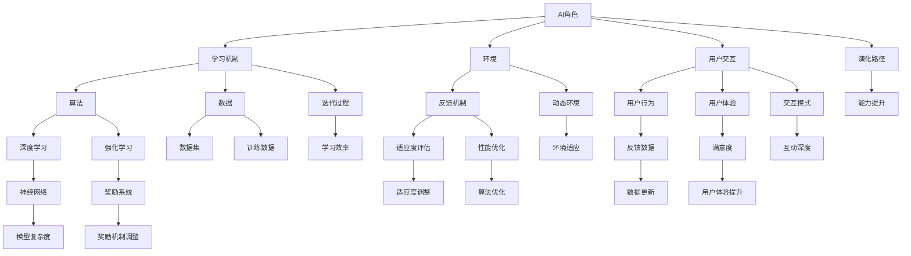

                 

### 1. 背景介绍

#### 1.1 目的和范围

本文旨在深入探讨人工智能（AI）角色在长期互动中的演化过程。随着AI技术不断进步，AI与人类互动的方式也在发生根本性的变化。本文将分析这些变化背后的驱动因素，以及AI角色在互动过程中如何实现个人发展和能力提升。文章的核心目标是：

1. **理解AI角色演化的基本原理**：介绍AI角色演化的核心概念和关键因素。
2. **阐述AI角色互动中的发展路径**：分析AI角色在长期互动中的成长过程。
3. **探讨未来发展趋势与挑战**：预测AI角色在互动中可能面临的问题和未来的发展方向。

本文将主要围绕以下几个核心概念展开：

- **AI角色的定义**：介绍AI角色的基本概念和分类。
- **互动中的角色发展**：探讨AI角色在长期互动中的个人成长和能力提升。
- **环境与反馈机制**：分析环境因素和反馈机制对AI角色演化的影响。

本文主要面向以下读者群体：

- **AI研究人员**：希望了解AI角色演化的最新研究和进展。
- **软件开发工程师**：对AI角色在软件应用中的实现和优化感兴趣。
- **技术爱好者和学生**：对人工智能及其应用有浓厚兴趣的学习者。
- **商业领袖和决策者**：希望了解AI角色在未来商业环境中的应用潜力和挑战。

#### 1.2 预期读者

预期读者应具备以下背景知识：

- **计算机科学基础**：了解基本的编程语言和算法。
- **人工智能基础**：对机器学习和深度学习有一定的了解。
- **软件工程知识**：了解软件设计和开发的基本原则。

本文将通过详细的案例分析、伪代码展示、数学模型和项目实战，帮助读者逐步理解AI角色演化的过程及其在互动中的发展。

#### 1.3 文档结构概述

本文将分为十个主要部分：

1. **背景介绍**：介绍文章的目的、核心概念、预期读者和文档结构。
2. **核心概念与联系**：定义核心概念，提供Mermaid流程图。
3. **核心算法原理 & 具体操作步骤**：使用伪代码详细阐述算法原理和操作步骤。
4. **数学模型和公式 & 详细讲解 & 举例说明**：介绍数学模型，使用latex格式详细讲解。
5. **项目实战：代码实际案例和详细解释说明**：提供代码实际案例和详细解释。
6. **实际应用场景**：分析AI角色在不同场景下的应用。
7. **工具和资源推荐**：推荐学习资源和开发工具。
8. **总结：未来发展趋势与挑战**：总结发展趋势和面临挑战。
9. **附录：常见问题与解答**：解答读者可能遇到的常见问题。
10. **扩展阅读 & 参考资料**：提供进一步阅读的材料和参考。

#### 1.4 术语表

##### 1.4.1 核心术语定义

- **人工智能（AI）**：模拟人类智能行为的计算机系统。
- **机器学习（ML）**：使计算机能够从数据中学习并做出预测或决策的技术。
- **深度学习（DL）**：一种基于多层神经网络的结构化机器学习方法。
- **自然语言处理（NLP）**：使计算机能够理解、生成和处理人类语言的技术。
- **角色演化**：AI角色在长期互动中的发展变化过程。
- **环境反馈机制**：环境对AI角色的行为反馈和调整机制。

##### 1.4.2 相关概念解释

- **角色**：在特定环境中执行特定任务的AI实体。
- **互动**：AI角色与人类或其他AI角色之间的交互。
- **学习曲线**：AI角色在特定任务中能力提升的速度。
- **适应度函数**：评估AI角色性能的指标。

##### 1.4.3 缩略词列表

- **AI**：人工智能
- **ML**：机器学习
- **DL**：深度学习
- **NLP**：自然语言处理
- **API**：应用程序编程接口
- **SDK**：软件开发工具包

通过本文的深入探讨，我们希望读者能够全面理解AI角色演化的原理和实践，为未来的AI应用提供有益的指导。

### 2. 核心概念与联系

在探讨AI角色演化之前，我们需要明确几个核心概念，并理解它们之间的联系。以下将使用Mermaid流程图展示这些概念之间的关系，并通过详细的文本解释每个概念的定义和作用。

下面是对每个核心概念及其相互关系的详细解释：

- **AI角色（A）**：AI角色是模拟人类智能行为并在特定环境中执行特定任务的计算机实体。它们可以是聊天机器人、推荐系统、自动化客服等。AI角色的目标是不断学习和优化以提供更好的用户体验。

- **学习机制（B）**：学习机制是AI角色从环境中获取知识并改进自身性能的过程。它包括多种算法，如深度学习、强化学习等。学习机制是角色演化的核心，通过不断调整算法参数和结构，使角色能够更好地适应环境。

- **环境（C）**：环境是AI角色执行任务和学习的场所。它可以是真实世界中的各种场景，如社交媒体、电子商务、医疗保健等。环境提供了AI角色所需的数据和反馈，是角色演化的基础。

- **用户交互（D）**：用户交互是AI角色与人类用户之间的互动。这种互动不仅提供了学习机制所需的数据，还影响了角色的用户体验。有效的用户交互能够提高角色的适应性和满意度。

- **算法（E）**：算法是AI角色实现学习机制的核心工具。它包括深度学习、强化学习、自然语言处理等。不同的算法适用于不同的任务和场景，因此选择合适的算法对于角色演化至关重要。

- **数据（F）**：数据是AI角色学习和改进的关键资源。数据集（L）和训练数据（M）用于训练和测试算法，以优化角色性能。数据的多样性和质量直接影响角色的学习效果。

- **反馈机制（G）**：反馈机制是环境对AI角色行为的反馈和调整过程。它通过评估角色的性能（N）和适应度，提供调整和优化的方向。反馈机制是角色持续演化和提升的保障。

- **用户行为（H）**和**用户体验（I）**：用户行为是用户在与AI角色互动过程中表现出的行为模式。用户体验是用户对AI角色的满意度和感受。它们共同影响了AI角色的互动深度和用户体验提升。

- **演化路径（T）**：演化路径是AI角色在长期互动中发展的轨迹。它反映了角色能力的提升和学习效率（Y）以及环境适应（Z）。

- **迭代过程（U）**：迭代过程是AI角色不断学习、优化和适应的循环。每个迭代都带来角色性能的提升和改进。

- **动态环境（V）**：动态环境是不断变化和发展的环境。它要求AI角色具备快速适应和应对变化的能力。

- **互动模式（W）**：互动模式是AI角色与用户交互的方式。它包括文本聊天、语音识别、视觉交互等。不同的互动模式对角色的性能和用户体验有重要影响。

- **能力提升（X）**：能力提升是AI角色在长期互动中实现的性能改进。这包括任务完成速度、准确性、灵活性和适应性等方面的提升。

- **学习效率（Y）**：学习效率是AI角色在给定时间内学习的效果和速度。高效的学

