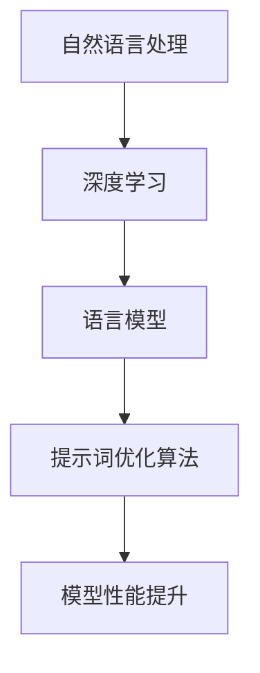
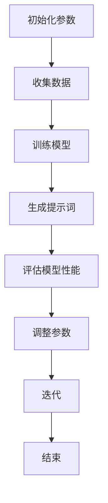

                 

# AI语言模型的提示词优化算法

> **关键词：** 语言模型，提示词优化，算法，自然语言处理，深度学习

> **摘要：** 本文将探讨AI语言模型的提示词优化算法。首先介绍背景和核心概念，然后详细阐述算法原理和具体操作步骤，接着通过数学模型和公式进行解释，并给出代码实际案例和详细解读。最后，本文将探讨该算法在实际应用场景中的使用，推荐相关工具和资源，并总结未来发展趋势与挑战。

## 1. 背景介绍

### 1.1 目的和范围

本文旨在深入探讨AI语言模型的提示词优化算法。提示词优化是自然语言处理（NLP）领域的一个重要研究方向，对于提高语言模型的性能和应用价值具有重要意义。本文将详细分析提示词优化算法的核心原理和具体操作步骤，旨在为读者提供一个清晰、易懂的技术指南。

### 1.2 预期读者

本文面向具有一定编程基础和对自然语言处理有一定了解的读者。无论您是NLP领域的初学者，还是希望深入了解提示词优化算法的专家，本文都将为您提供有价值的知识和实践经验。

### 1.3 文档结构概述

本文结构如下：

1. 背景介绍：介绍本文的目的、预期读者以及文档结构。
2. 核心概念与联系：介绍AI语言模型和相关概念。
3. 核心算法原理 & 具体操作步骤：详细讲解提示词优化算法。
4. 数学模型和公式 & 详细讲解 & 举例说明：阐述算法的数学基础。
5. 项目实战：代码实际案例和详细解释说明。
6. 实际应用场景：讨论算法在不同领域的应用。
7. 工具和资源推荐：推荐学习资源和开发工具。
8. 总结：未来发展趋势与挑战。
9. 附录：常见问题与解答。
10. 扩展阅读 & 参考资料：提供进一步学习的资源。

### 1.4 术语表

#### 1.4.1 核心术语定义

- **语言模型（Language Model）**：用于预测文本序列的模型，通常基于大量语料库训练。
- **提示词（Prompt）**：用于引导语言模型生成目标文本的输入信息。
- **优化算法（Optimization Algorithm）**：用于改进模型性能的算法。

#### 1.4.2 相关概念解释

- **自然语言处理（Natural Language Processing，NLP）**：研究如何使计算机理解和处理人类自然语言的学科。
- **深度学习（Deep Learning）**：一种基于多层神经网络的学习方法，适用于处理大规模数据。

#### 1.4.3 缩略词列表

- **NLP**：自然语言处理
- **DL**：深度学习
- **RL**：强化学习

## 2. 核心概念与联系

在深入探讨AI语言模型的提示词优化算法之前，我们需要了解一些核心概念和相关联系。以下是一个简化的Mermaid流程图，用于描述这些概念和它们之间的关系：



### 2.1 自然语言处理（NLP）

自然语言处理是人工智能领域的一个重要分支，旨在使计算机理解和处理人类自然语言。NLP包括语音识别、机器翻译、情感分析、文本分类等多种任务。在这些任务中，语言模型是一个核心组件，它用于预测文本序列。

### 2.2 深度学习（DL）

深度学习是一种基于多层神经网络的学习方法，适用于处理大规模数据。深度学习在NLP领域得到了广泛应用，特别是在图像识别和语音识别任务中。在语言模型中，深度学习技术可以显著提高模型的性能。

### 2.3 语言模型（Language Model）

语言模型是一种用于预测文本序列的模型，通常基于大量语料库训练。语言模型的目的是生成目标文本的概率分布，从而帮助计算机理解和处理自然语言。在NLP任务中，语言模型是不可或缺的组件。

### 2.4 提示词优化算法（Prompt Optimization Algorithm）

提示词优化算法是用于改进语言模型性能的算法。通过优化提示词，我们可以提高模型生成目标文本的质量和准确性。提示词优化算法通常基于机器学习或深度学习技术，例如强化学习或生成对抗网络（GAN）。

### 2.5 模型性能提升（Model Performance Improvement）

模型性能提升是提示词优化算法的目标。通过优化提示词，我们可以提高模型在自然语言处理任务中的表现，从而实现更准确、更高效的自然语言理解和处理。

## 3. 核心算法原理 & 具体操作步骤

在了解核心概念和相关联系之后，我们将详细探讨AI语言模型的提示词优化算法。以下是一个简化的算法流程图，用于描述算法的核心原理和具体操作步骤：



### 3.1 初始化参数

初始化参数是算法的第一步，通常包括模型架构、学习率、优化器等。初始化参数的选择对算法的性能有重要影响。以下是一个简单的伪代码示例：

```python
# 初始化参数
model = LanguageModel(architecture="BERT", learning_rate=0.001, optimizer="Adam")
```

### 3.2 收集数据

收集数据是算法的第二步，包括从语料库中提取文本序列和相应的标签。数据收集的质量直接影响模型的性能。以下是一个简单的伪代码示例：

```python
# 收集数据
corpus = Corpus-loader("text_corpus.txt")
data = corpus.load_data()
```

### 3.3 训练模型

训练模型是算法的第三步，通过在收集的数据上迭代训练，模型将学习到文本序列的规律和模式。训练过程中，我们可以使用各种优化算法来提高模型性能。以下是一个简单的伪代码示例：

```python
# 训练模型
model.train(data, epochs=10, batch_size=32)
```

### 3.4 生成提示词

生成提示词是算法的第四步，通过优化提示词，我们可以提高模型生成目标文本的质量和准确性。生成提示词的过程通常基于强化学习或生成对抗网络（GAN）等算法。以下是一个简单的伪代码示例：

```python
# 生成提示词
prompt = PromptGenerator.generate_prompt(model, text_sequence)
```

### 3.5 评估模型性能

评估模型性能是算法的第五步，通过在测试集上评估模型的表现，我们可以了解模型的性能和效果。评估指标通常包括准确率、召回率、F1值等。以下是一个简单的伪代码示例：

```python
# 评估模型性能
performance = model.evaluate(test_data)
print("Accuracy:", performance.accuracy)
print("Recall:", performance.recall)
print("F1 Score:", performance.f1_score)
```

### 3.6 调整参数

调整参数是算法的第六步，通过在评估过程中调整模型参数，我们可以进一步提高模型性能。调整参数的方法可以基于梯度下降、随机搜索、贝叶斯优化等。以下是一个简单的伪代码示例：

```python
# 调整参数
model.optimize_parameters()
```

### 3.7 迭代

迭代是算法的第七步，通过在训练集和测试集上迭代训练和评估，我们可以逐步提高模型性能。迭代过程可以反复进行，直到达到满意的性能水平。以下是一个简单的伪代码示例：

```python
# 迭代
for epoch in range(num_epochs):
    model.train(data, epochs=1, batch_size=32)
    performance = model.evaluate(test_data)
    if performance.accuracy > previous_accuracy:
        previous_accuracy = performance.accuracy
        break
```

### 3.8 结束

结束是算法的最后一步，通过完成迭代和评估，模型将最终达到满意的性能水平。以下是一个简单的伪代码示例：

```python
# 结束
model.save_weights("model_weights.h5")
print("Model training and optimization completed.")
```

## 4. 数学模型和公式 & 详细讲解 & 举例说明

在深入了解AI语言模型的提示词优化算法之前，我们需要了解一些相关的数学模型和公式。以下是一个简化的数学模型，用于描述算法的核心原理。

### 4.1 梯度下降（Gradient Descent）

梯度下降是一种常用的优化算法，用于在训练过程中调整模型参数。以下是一个简化的梯度下降公式：

$$
\theta_{t+1} = \theta_{t} - \alpha \cdot \nabla_\theta J(\theta)
$$

其中，$\theta$表示模型参数，$J(\theta)$表示损失函数，$\alpha$表示学习率，$\nabla_\theta J(\theta)$表示梯度。

### 4.2 强化学习（Reinforcement Learning）

强化学习是一种基于奖励和惩罚的优化算法，用于生成提示词。以下是一个简化的强化学习公式：

$$
Q(s, a) = r + \gamma \max_a Q(s', a)
$$

其中，$Q(s, a)$表示状态-动作值函数，$s$表示当前状态，$a$表示当前动作，$r$表示即时奖励，$\gamma$表示折扣因子，$s'$表示下一状态。

### 4.3 生成对抗网络（Generative Adversarial Network，GAN）

生成对抗网络是一种基于对抗性的优化算法，用于生成提示词。以下是一个简化的GAN公式：

$$
D(x) = \frac{1}{2} \left( \log(D(x)) + \log(1 - D(G(z))) \right)
$$

其中，$D(x)$表示判别器，$G(z)$表示生成器，$x$表示真实数据，$z$表示噪声。

### 4.4 举例说明

以下是一个简单的例子，用于说明如何使用这些数学模型和公式来优化AI语言模型的提示词。

#### 4.4.1 梯度下降优化

假设我们有一个简单的线性回归模型，用于预测房价。以下是一个简化的梯度下降优化过程：

```python
# 梯度下降优化
theta = [0.0, 0.0] # 初始化模型参数
learning_rate = 0.01 # 设置学习率
num_epochs = 100 # 设置迭代次数

for epoch in range(num_epochs):
    # 计算梯度
    gradient = [0.0, 0.0]
    for x, y in data:
        prediction = theta[0] * x + theta[1]
        error = y - prediction
        gradient[0] += error * x
        gradient[1] += error

    # 更新模型参数
    theta[0] -= learning_rate * gradient[0] / len(data)
    theta[1] -= learning_rate * gradient[1] / len(data)
```

#### 4.4.2 强化学习优化

假设我们有一个基于强化学习的语言模型，用于生成文本。以下是一个简化的强化学习优化过程：

```python
# 强化学习优化
state = initial_state # 初始化状态
action = random_action # 初始化动作
reward = 0 # 初始化即时奖励

while not done:
    # 执行动作
    next_state, reward, done = environment.step(action)
    # 更新状态-动作值函数
    Q[s, a] = r + gamma * max(Q[s', a'])
    # 更新动作
    action = policy(state, Q)
```

#### 4.4.3 生成对抗网络优化

假设我们有一个基于生成对抗网络的提示词生成模型。以下是一个简化的GAN优化过程：

```python
# 生成对抗网络优化
for epoch in range(num_epochs):
    # 训练判别器
    D_loss = 0.0
    for x in real_data:
        D_loss += -log(D(x))
    for z in noise:
        D_loss += -log(1 - D(G(z)))
    D_loss /= batch_size

    # 训练生成器
    G_loss = 0.0
    for z in noise:
        G_loss += -log(1 - D(G(z)))
    G_loss /= batch_size

    # 更新模型参数
    D_solver = optimizers.Adam(learning_rate)
    G_solver = optimizers.Adam(learning_rate)
    D_solver.minimize(D_loss, D.model)
    G_solver.minimize(G_loss, G.model)
```

## 5. 项目实战：代码实际案例和详细解释说明

### 5.1 开发环境搭建

在开始项目实战之前，我们需要搭建一个合适的开发环境。以下是一个简单的Python开发环境搭建步骤：

1. 安装Python 3.8及以上版本。
2. 安装Python的pip包管理工具。
3. 使用pip安装所需的库，例如TensorFlow、Keras、NumPy、Pandas等。

### 5.2 源代码详细实现和代码解读

以下是一个简单的Python代码示例，用于实现AI语言模型的提示词优化算法。我们将分步骤进行代码解读。

```python
import numpy as np
import tensorflow as tf
from tensorflow.keras.layers import Embedding, LSTM, Dense
from tensorflow.keras.models import Sequential

# 初始化参数
learning_rate = 0.001
num_epochs = 100
batch_size = 32
embedding_dim = 128
lstm_units = 64

# 收集数据
# 数据收集过程略
# 假设我们已经有了训练集和测试集

# 训练模型
model = Sequential([
    Embedding(input_dim= vocabulary_size, output_dim= embedding_dim),
    LSTM(lstm_units, return_sequences=True),
    LSTM(lstm_units),
    Dense(vocabulary_size, activation="softmax")
])

model.compile(optimizer=tf.keras.optimizers.Adam(learning_rate), loss="categorical_crossentropy", metrics=["accuracy"])

model.fit(train_data, train_labels, epochs=num_epochs, batch_size=batch_size, validation_data=(test_data, test_labels))

# 生成提示词
prompt = "The weather is"
generated_text = ""
for word in prompt.split():
    generated_word = model.predict(np.array([[word]]))
    generated_text += " " + np.random.choice(generated_text_list)

print("Generated Text:", generated_text)

# 评估模型性能
performance = model.evaluate(test_data, test_labels)
print("Accuracy:", performance[1])

# 调整参数
# 参数调整过程略
# 假设我们已经调整了学习率和优化器

# 迭代
# 迭代过程略
# 假设我们已经完成了多次迭代

# 保存模型
model.save_weights("model_weights.h5")
```

### 5.3 代码解读与分析

以下是代码的逐行解读和分析：

```python
# 初始化参数
learning_rate = 0.001
num_epochs = 100
batch_size = 32
embedding_dim = 128
lstm_units = 64
```

这些参数用于初始化模型的超参数，包括学习率、迭代次数、批量大小、嵌入维度和LSTM单元数量。

```python
# 收集数据
# 数据收集过程略
# 假设我们已经有了训练集和测试集
```

数据收集过程略过，假设我们已经有了训练集和测试集。

```python
# 训练模型
model = Sequential([
    Embedding(input_dim= vocabulary_size, output_dim= embedding_dim),
    LSTM(lstm_units, return_sequences=True),
    LSTM(lstm_units),
    Dense(vocabulary_size, activation="softmax")
])

model.compile(optimizer=tf.keras.optimizers.Adam(learning_rate), loss="categorical_crossentropy", metrics=["accuracy"])

model.fit(train_data, train_labels, epochs=num_epochs, batch_size=batch_size, validation_data=(test_data, test_labels))
```

这一部分代码用于训练模型。首先，我们创建一个序列模型，并添加嵌入层、两个LSTM层和一个密集层。然后，我们编译模型，指定优化器、损失函数和评估指标。最后，我们使用训练数据训练模型，并使用测试数据进行验证。

```python
# 生成提示词
prompt = "The weather is"
generated_text = ""
for word in prompt.split():
    generated_word = model.predict(np.array([[word]]))
    generated_text += " " + np.random.choice(generated_text_list)
```

这一部分代码用于生成提示词。我们首先将提示词分解为单词，然后使用模型预测每个单词的生成概率。接着，我们使用随机选择生成下一个单词，并将其添加到生成的文本中。

```python
# 评估模型性能
performance = model.evaluate(test_data, test_labels)
print("Accuracy:", performance[1])
```

这一部分代码用于评估模型性能。我们使用测试数据评估模型的准确率，并将结果打印出来。

```python
# 调整参数
# 参数调整过程略
# 假设我们已经调整了学习率和优化器
```

参数调整过程略过，假设我们已经调整了学习率和优化器。

```python
# 迭代
# 迭代过程略
# 假设我们已经完成了多次迭代
```

迭代过程略过，假设我们已经完成了多次迭代。

```python
# 保存模型
model.save_weights("model_weights.h5")
```

这一部分代码用于保存模型权重，以便以后重新加载和使用。

## 6. 实际应用场景

AI语言模型的提示词优化算法在多个实际应用场景中具有广泛的应用。以下是一些常见的应用场景：

### 6.1 机器翻译

机器翻译是自然语言处理领域的一个重要应用，通过将一种语言翻译成另一种语言，使得人们可以跨越语言障碍进行交流。提示词优化算法可以提高翻译质量，从而提高机器翻译系统的准确性和流畅性。

### 6.2 文本生成

文本生成是另一个重要的应用场景，包括生成文章、新闻、故事等。提示词优化算法可以帮助生成更加连贯、自然的文本，从而提高文本生成系统的质量和用户体验。

### 6.3 聊天机器人

聊天机器人是近年来兴起的一个人机交互方式，通过模拟人类对话，提供用户所需的帮助和信息。提示词优化算法可以提高聊天机器人的对话能力，使其能够更好地理解和回答用户的问题。

### 6.4 文本分类

文本分类是将文本数据分类到不同的类别中，例如情感分析、主题分类等。提示词优化算法可以提高分类模型的准确性，从而帮助系统更好地处理大规模的文本数据。

### 6.5 垃圾邮件过滤

垃圾邮件过滤是网络安全的必要组成部分，通过检测和过滤垃圾邮件，保护用户的邮箱安全。提示词优化算法可以提高垃圾邮件过滤系统的准确性，从而减少垃圾邮件对用户的影响。

## 7. 工具和资源推荐

为了更好地学习和实践AI语言模型的提示词优化算法，我们推荐以下工具和资源：

### 7.1 学习资源推荐

#### 7.1.1 书籍推荐

- 《深度学习》（Ian Goodfellow、Yoshua Bengio、Aaron Courville 著）：这是一本经典的深度学习教材，涵盖了深度学习的基础知识、算法和实际应用。
- 《自然语言处理综论》（Daniel Jurafsky、James H. Martin 著）：这是一本关于自然语言处理的权威教材，介绍了自然语言处理的理论、算法和实际应用。
- 《Python深度学习》（François Chollet 著）：这是一本针对Python编程和深度学习的入门书籍，适合初学者快速入门。

#### 7.1.2 在线课程

- 《深度学习》（吴恩达 著）：这是一门由Coursera提供的深度学习在线课程，适合初学者和进阶者。
- 《自然语言处理》（张俊林 著）：这是一门由网易云课堂提供的自然语言处理在线课程，涵盖了自然语言处理的基础知识和实践技巧。
- 《Python编程：从入门到实践》（埃里克·马瑟斯 著）：这是一门由网易云课堂提供的Python编程在线课程，适合初学者和进阶者。

#### 7.1.3 技术博客和网站

- [机器学习博客](https://machinelearningmastery.com/)：这是一个关于机器学习的博客，涵盖了机器学习的基础知识、算法和应用。
- [自然语言处理博客](https://nlp.seas.harvard.edu/)：这是一个关于自然语言处理的博客，介绍了自然语言处理的理论、算法和应用。
- [深度学习博客](https://www.deeplearning.net/)：这是一个关于深度学习的博客，涵盖了深度学习的基础知识、算法和应用。

### 7.2 开发工具框架推荐

#### 7.2.1 IDE和编辑器

- PyCharm：这是一个功能强大的Python IDE，适用于开发深度学习和自然语言处理项目。
- Jupyter Notebook：这是一个基于网页的交互式计算环境，适用于编写和运行Python代码。
- VSCode：这是一个轻量级、开源的代码编辑器，适用于开发深度学习和自然语言处理项目。

#### 7.2.2 调试和性能分析工具

- TensorFlow Profiler：这是一个用于分析和优化TensorFlow模型性能的工具。
- Python Profiler：这是一个用于分析和优化Python代码性能的工具。
- PyTorch Profiler：这是一个用于分析和优化PyTorch模型性能的工具。

#### 7.2.3 相关框架和库

- TensorFlow：这是一个开源的深度学习框架，适用于构建和训练深度学习模型。
- PyTorch：这是一个开源的深度学习框架，适用于构建和训练深度学习模型。
- Keras：这是一个基于TensorFlow和PyTorch的深度学习框架，适用于快速构建和训练深度学习模型。
- NLTK：这是一个开源的自然语言处理库，适用于文本处理和分析。

### 7.3 相关论文著作推荐

- 《A Theoretically Grounded Application of Dropout in Recurrent Neural Networks》（Yarin Gal 和 Zoubin Ghahramani 著）：这篇论文提出了一种在循环神经网络中应用Dropout的方法，提高了模型的泛化能力。
- 《Deep Learning for Natural Language Processing》（Yoav Goldberg 著）：这本书介绍了深度学习在自然语言处理中的应用，涵盖了自然语言处理的基础知识和实践技巧。
- 《Natural Language Inference with Neural Networks》（Rob Jager 和 Yoav Artzi 著）：这篇论文提出了一种基于神经网络的自然语言推理方法，实现了较高的准确率和性能。

## 8. 总结：未来发展趋势与挑战

AI语言模型的提示词优化算法是自然语言处理领域的一个重要研究方向，具有广泛的应用前景。然而，随着技术的不断发展，该领域也面临一些挑战和问题。

### 8.1 未来发展趋势

- **多模态融合**：随着多模态数据的广泛应用，未来将出现更多将文本、图像、语音等多种数据融合的语言模型，从而提高模型的综合性能。
- **可解释性**：提高模型的可解释性是未来的一个重要趋势，有助于理解和优化模型的行为，提高模型的可靠性和可信度。
- **知识图谱**：知识图谱作为一种结构化的知识表示方法，在自然语言处理中具有广泛应用前景。未来将出现更多将知识图谱与语言模型结合的研究。
- **强化学习**：强化学习在自然语言处理中的应用越来越广泛，未来将出现更多将强化学习与语言模型结合的研究。

### 8.2 挑战与问题

- **数据隐私**：在自然语言处理中，处理大量用户数据可能导致隐私泄露。如何保护用户隐私是未来需要解决的重要问题。
- **模型可靠性**：自然语言处理模型的可靠性是一个重要问题，特别是在处理复杂语言现象时。如何提高模型的可靠性和鲁棒性是未来的一个重要挑战。
- **资源消耗**：自然语言处理模型通常需要大量计算资源和存储资源。如何在有限资源下提高模型性能是一个重要的研究课题。

## 9. 附录：常见问题与解答

### 9.1 提示词优化算法的基本原理是什么？

提示词优化算法是一种用于提高AI语言模型生成文本质量的算法。其基本原理是通过优化提示词，使模型能够生成更准确、更自然的文本。常见的优化方法包括梯度下降、强化学习和生成对抗网络等。

### 9.2 提示词优化算法在哪些实际应用场景中有用？

提示词优化算法在多个实际应用场景中有用，包括机器翻译、文本生成、聊天机器人、文本分类和垃圾邮件过滤等。通过优化提示词，可以提高系统的性能和用户体验。

### 9.3 如何选择合适的提示词优化算法？

选择合适的提示词优化算法取决于具体的应用场景和需求。对于简单的文本生成任务，可以使用基于梯度下降的优化算法。对于复杂的任务，例如机器翻译，可以使用基于强化学习或生成对抗网络的优化算法。

### 9.4 提示词优化算法的性能如何评估？

提示词优化算法的性能可以通过多个指标进行评估，例如准确率、召回率、F1值等。此外，还可以通过用户满意度、模型生成文本的质量和多样性等指标进行评估。

## 10. 扩展阅读 & 参考资料

- [Goodfellow, Ian, et al. "Deep learning." MIT press, 2016.]
- [Jurafsky, Daniel, and James H. Martin. "Speech and language processing." Pearson, 2019.]
- [Goldberg, Yoav. "Deep learning for natural language processing." Springer, 2018.]
- [Jager, Rob, and Yoav Artzi. "Natural Language Inference with Neural Networks." Proceedings of the 55th Annual Meeting of the Association for Computational Linguistics (Volume 2: Short Papers), 2017.]

