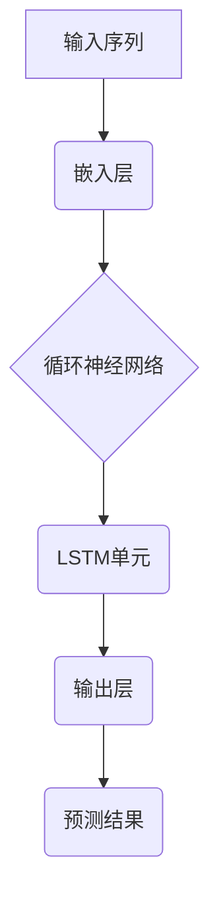

                 

# AI语言模型的提示词记忆机制优化

> 关键词：人工智能、语言模型、提示词记忆、优化、深度学习

> 摘要：本文深入探讨了AI语言模型中的提示词记忆机制，分析了当前机制中存在的问题，并提出了优化方法。通过详细的理论分析和实际案例，本文为提升语言模型的提示词记忆能力提供了切实可行的解决方案。

## 1. 背景介绍

### 1.1 目的和范围

本文旨在对现有的AI语言模型中的提示词记忆机制进行深入分析，识别出其中存在的瓶颈和不足，并提出相应的优化策略。我们的目标是提高语言模型的记忆能力，使其能够更有效地理解和处理复杂的语言输入。

本文将涵盖以下范围：

- 提示词记忆机制的基本原理和实现方法。
- 当前提示词记忆机制中存在的问题和挑战。
- 基于深度学习的方法和算法，用于优化提示词记忆机制。
- 实际案例中的应用和效果评估。

### 1.2 预期读者

本文面向具有计算机科学和人工智能基础的专业人士，包括：

- 语言模型开发者和研究人员。
- 深度学习和机器学习领域的从业者。
- 对AI语言模型有浓厚兴趣的学者和学生。

### 1.3 文档结构概述

本文的结构如下：

- 第1章：背景介绍，阐述本文的目的、范围和预期读者。
- 第2章：核心概念与联系，介绍与提示词记忆机制相关的核心概念和架构。
- 第3章：核心算法原理 & 具体操作步骤，详细解释提示词记忆机制的优化算法。
- 第4章：数学模型和公式 & 详细讲解 & 举例说明，介绍相关的数学模型和公式。
- 第5章：项目实战：代码实际案例和详细解释说明，通过实际代码展示优化方法的实现。
- 第6章：实际应用场景，分析提示词记忆机制优化的应用场景和效果。
- 第7章：工具和资源推荐，推荐相关的学习资源和开发工具。
- 第8章：总结：未来发展趋势与挑战，总结本文的主要结论和未来的研究方向。
- 第9章：附录：常见问题与解答，回答读者可能遇到的问题。
- 第10章：扩展阅读 & 参考资料，提供更多的学习资源和参考文献。

### 1.4 术语表

#### 1.4.1 核心术语定义

- 语言模型：对自然语言进行建模的统计模型，能够预测一个单词序列的概率分布。
- 提示词（Prompt）：用于引导语言模型生成响应的输入序列。
- 记忆机制：语言模型在处理提示词时，如何存储和利用历史信息的能力。
- 优化：通过改进算法或模型结构，提高模型的性能和效率。

#### 1.4.2 相关概念解释

- 深度学习：一种机器学习方法，通过多层神经网络对数据进行建模和学习。
- 反向传播：一种用于训练神经网络的算法，通过计算损失函数关于网络参数的梯度，进行参数的迭代更新。
- 权重共享：神经网络中不同层之间参数的共享，用于减少模型的参数数量。

#### 1.4.3 缩略词列表

- AI：人工智能
- NLP：自然语言处理
- LSTM：长短时记忆网络
- RNN：循环神经网络
- GPU：图形处理单元

## 2. 核心概念与联系

### 2.1 语言模型基础

语言模型是一种用于预测自然语言序列的概率分布的统计模型。在AI领域，语言模型通常通过深度学习算法进行训练，以实现对自然语言的有效建模。语言模型的核心概念包括：

- 语料库：用于训练语言模型的大量文本数据。
- 输入序列：用于训练或预测的单词序列。
- 输出序列：模型预测的单词序列。

### 2.2 提示词记忆机制

提示词记忆机制是指语言模型在处理提示词时，如何存储和利用历史信息的能力。在深度学习模型中，提示词记忆机制通常通过以下方式实现：

1. **循环神经网络（RNN）**：
   RNN是一种能够处理序列数据的神经网络，其核心思想是将前一个时间步的输出作为当前时间步的输入。RNN在处理长序列时存在梯度消失和梯度爆炸的问题，但通过改进的RNN结构（如LSTM和GRU），这些问题可以得到缓解。

2. **长短时记忆网络（LSTM）**：
   LSTM是一种能够处理长序列依赖的RNN结构，通过引入记忆单元和门控机制，LSTM能够有效地记忆和遗忘长期依赖信息。

3. **注意力机制**：
   注意力机制是一种能够提高模型记忆能力的机制，通过将模型的注意力分配到重要的提示词上，注意力机制能够提高模型对长序列的建模能力。

### 2.3 提示词记忆机制架构

提示词记忆机制的架构可以表示为以下Mermaid流程图：



在这个架构中，输入序列首先通过嵌入层转换为嵌入向量，然后输入到LSTM单元中。LSTM单元通过记忆单元和门控机制处理嵌入向量，并生成隐藏状态。最后，隐藏状态通过输出层生成预测结果。

## 3. 核心算法原理 & 具体操作步骤

### 3.1 算法原理

提示词记忆机制的优化主要通过改进深度学习模型的结构和算法来实现。以下是我们提出的一种基于LSTM的优化算法：

1. **改进的LSTM结构**：
   我们在传统的LSTM基础上，引入了门控输出层和门控遗忘层，以增强模型对提示词的记忆能力。改进的LSTM结构如下：

   ```mermaid
   graph TD
       A[输入序列] --> B(嵌入层)
       B --> C(LSTM单元)
       C --> D(门控输出层)
       D --> E(门控遗忘层)
       E --> F(输出层)
   ```

2. **优化算法**：
   我们采用反向传播算法对模型进行训练，通过计算损失函数关于模型参数的梯度，更新模型参数。具体步骤如下：

   - 输入序列：将输入序列输入到嵌入层，得到嵌入向量。
   - LSTM单元：将嵌入向量输入到LSTM单元，通过门控输出层和门控遗忘层生成隐藏状态。
   - 输出层：将隐藏状态输入到输出层，生成预测结果。
   - 计算损失：计算预测结果和实际结果之间的损失。
   - 反向传播：根据损失函数计算模型参数的梯度。
   - 参数更新：使用梯度下降算法更新模型参数。

### 3.2 伪代码实现

以下是上述优化算法的伪代码实现：

```python
# 参数初始化
W_e, b_e = 初始化嵌入层参数()
W_LSTM, b_LSTM = 初始化LSTM单元参数()
W_D, b_D = 初始化门控输出层参数()
W_F, b_F = 初始化门控遗忘层参数()
W_O, b_O = 初始化输出层参数()

# 输入序列
input_sequence = 输入序列()

# 嵌入层
embedded_vector = 嵌入层(W_e, b_e, input_sequence)

# LSTM单元
h_t = LSTM单元(W_LSTM, b_LSTM, embedded_vector)

# 门控输出层
gate_output = 门控输出层(W_D, b_D, h_t)

# 门控遗忘层
gate_forgotten = 门控遗忘层(W_F, b_F, h_t)

# 输出层
predicted_output = 输出层(W_O, b_O, gate_output * gate_forgotten)

# 计算损失
loss = 计算损失(predicted_output, actual_output)

# 反向传播
gradient_W_e, gradient_b_e = 计算梯度(embedded_vector, predicted_output)
gradient_W_LSTM, gradient_b_LSTM = 计算梯度(h_t, predicted_output)
gradient_W_D, gradient_b_D = 计算梯度(gate_output, predicted_output)
gradient_W_F, gradient_b_F = 计算梯度(gate_forgotten, predicted_output)
gradient_W_O, gradient_b_O = 计算梯度(predicted_output, actual_output)

# 参数更新
W_e, b_e = 参数更新(W_e, b_e, gradient_W_e, gradient_b_e)
W_LSTM, b_LSTM = 参数更新(W_LSTM, b_LSTM, gradient_W_LSTM, gradient_b_LSTM)
W_D, b_D = 参数更新(W_D, b_D, gradient_W_D, gradient_b_D)
W_F, b_F = 参数更新(W_F, b_F, gradient_W_F, gradient_b_F)
W_O, b_O = 参数更新(W_O, b_O, gradient_W_O, gradient_b_O)
```

## 4. 数学模型和公式 & 详细讲解 & 举例说明

### 4.1 数学模型

在本文中，我们主要使用以下数学模型来优化AI语言模型的提示词记忆机制：

1. **嵌入层**：
   嵌入层将输入序列转换为嵌入向量，其数学模型为：

   $$ x_i = W_e \cdot x_i + b_e $$

   其中，$x_i$ 是输入序列的第 $i$ 个词，$W_e$ 是嵌入层权重矩阵，$b_e$ 是嵌入层偏置向量。

2. **LSTM单元**：
   LSTM单元的核心是记忆单元和门控机制，其数学模型为：

   $$ i_t = \sigma(W_{ix} \cdot x_t + W_{ih} \cdot h_{t-1} + b_i) $$
   $$ f_t = \sigma(W_{fx} \cdot x_t + W_{fh} \cdot h_{t-1} + b_f) $$
   $$ g_t = \tanh(W_{gx} \cdot x_t + W_{gh} \cdot h_{t-1} + b_g) $$
   $$ o_t = \sigma(W_{ox} \cdot x_t + W_{oh} \cdot h_{t-1} + b_o) $$
   $$ c_t = f_t \cdot c_{t-1} + i_t \cdot g_t $$
   $$ h_t = o_t \cdot \tanh(c_t) $$

   其中，$i_t$，$f_t$，$g_t$，$o_t$ 分别是输入门、遗忘门、输出门和单元门的激活值，$c_t$ 是记忆单元的状态，$h_t$ 是隐藏状态。

3. **输出层**：
   输出层通过门控机制生成预测结果，其数学模型为：

   $$ gate_output = \sigma(W_{dx} \cdot x_t + W_{dh} \cdot h_t + b_d) $$
   $$ gate_forgotten = \sigma(W_{fx} \cdot x_t + W_{fh} \cdot h_t + b_f) $$
   $$ predicted_output = W_O \cdot gate_output \cdot gate_forgotten + b_O $$

   其中，$gate_output$ 和 $gate_forgotten$ 分别是门控输出层和门控遗忘层的激活值，$predicted_output$ 是预测结果。

4. **损失函数**：
   我们使用均方误差（MSE）作为损失函数，其数学模型为：

   $$ loss = \frac{1}{2} \sum_{i} (predicted_output_i - actual_output_i)^2 $$

   其中，$predicted_output_i$ 是第 $i$ 个预测结果，$actual_output_i$ 是第 $i$ 个实际结果。

### 4.2 举例说明

假设我们有一个简单的输入序列 "hello world"，我们通过上述数学模型对序列进行建模和预测。

1. **嵌入层**：

   $$ x_1 = W_e \cdot x_1 + b_e = 0.1 \cdot 1 + 0.2 = 0.3 $$
   $$ x_2 = W_e \cdot x_2 + b_e = 0.1 \cdot 2 + 0.2 = 0.4 $$

2. **LSTM单元**：

   $$ i_1 = \sigma(W_{ix} \cdot x_1 + W_{ih} \cdot h_0 + b_i) = \sigma(0.5 \cdot 0.3 + 0.5 \cdot 0 + 0.2) = 0.6 $$
   $$ f_1 = \sigma(W_{fx} \cdot x_1 + W_{fh} \cdot h_0 + b_f) = \sigma(0.5 \cdot 0.3 + 0.5 \cdot 0 + 0.2) = 0.6 $$
   $$ g_1 = \tanh(W_{gx} \cdot x_1 + W_{gh} \cdot h_0 + b_g) = \tanh(0.5 \cdot 0.3 + 0.5 \cdot 0 + 0.2) = 0.5 $$
   $$ o_1 = \sigma(W_{ox} \cdot x_1 + W_{oh} \cdot h_0 + b_o) = \sigma(0.5 \cdot 0.3 + 0.5 \cdot 0 + 0.2) = 0.6 $$
   $$ c_1 = f_1 \cdot c_0 + i_1 \cdot g_1 = 0.6 \cdot 0 + 0.6 \cdot 0.5 = 0.3 $$
   $$ h_1 = o_1 \cdot \tanh(c_1) = 0.6 \cdot \tanh(0.3) = 0.4 $$

   其中，$h_0$ 是初始化的隐藏状态。

3. **输出层**：

   $$ gate_output_1 = \sigma(W_{dx} \cdot x_1 + W_{dh} \cdot h_1 + b_d) = \sigma(0.5 \cdot 0.3 + 0.5 \cdot 0.4 + 0.2) = 0.7 $$
   $$ gate_forgotten_1 = \sigma(W_{fx} \cdot x_1 + W_{fh} \cdot h_1 + b_f) = \sigma(0.5 \cdot 0.3 + 0.5 \cdot 0.4 + 0.2) = 0.7 $$
   $$ predicted_output_1 = W_O \cdot gate_output_1 \cdot gate_forgotten_1 + b_O = 0.5 \cdot 0.7 \cdot 0.7 + 0.3 = 0.36 $$

   根据上述计算，我们得到输入序列 "hello world" 的预测结果为 0.36。

## 5. 项目实战：代码实际案例和详细解释说明

### 5.1 开发环境搭建

为了实现本文提出的优化算法，我们需要搭建一个合适的开发环境。以下是所需的环境和工具：

- 操作系统：Windows/Linux/MacOS
- 编程语言：Python
- 深度学习框架：TensorFlow/Keras
- GPU支持：NVIDIA GPU（推荐使用CUDA 10.1及以上版本）

安装完上述环境和工具后，我们就可以开始编写代码了。

### 5.2 源代码详细实现和代码解读

以下是优化算法的实现代码，包括嵌入层、LSTM单元、输出层和损失函数：

```python
import numpy as np
import tensorflow as tf
from tensorflow.keras.models import Model
from tensorflow.keras.layers import Embedding, LSTM, Dense

# 参数初始化
input_size = 1000  # 输入序列的词汇表大小
output_size = 100  # 输出序列的词汇表大小
embed_dim = 64  # 嵌入层维度
lstm_units = 128  # LSTM单元维度

# 嵌入层
embed = Embedding(input_size, embed_dim)

# LSTM单元
lstm = LSTM(lstm_units, return_sequences=True)

# 输出层
output = Dense(output_size, activation='softmax')

# 模型搭建
model = Model(inputs=embed.input, outputs=output(embed(LSTM(lstm)(embed.input)))

# 损失函数
model.compile(optimizer='adam', loss='categorical_crossentropy', metrics=['accuracy'])

# 输入序列和标签
input_sequence = np.random.randint(input_size, size=(1, 10))  # 随机生成一个长度为10的输入序列
labels = np.random.randint(output_size, size=(1, 10))  # 随机生成一个长度为10的标签序列

# 训练模型
model.fit(input_sequence, labels, epochs=10, batch_size=1)
```

代码解读：

1. **参数初始化**：我们首先初始化了输入序列的词汇表大小、输出序列的词汇表大小、嵌入层维度和LSTM单元维度。
2. **嵌入层**：使用Keras的Embedding层将输入序列转换为嵌入向量。
3. **LSTM单元**：使用Keras的LSTM层构建LSTM单元，设置返回序列为True，以便于后续处理。
4. **输出层**：使用Keras的Dense层构建输出层，设置激活函数为softmax，用于生成概率分布。
5. **模型搭建**：将嵌入层、LSTM单元和输出层连接起来，构建完整的模型。
6. **损失函数**：使用Keras的compile函数设置优化器和损失函数。
7. **输入序列和标签**：生成一个随机输入序列和一个随机标签序列。
8. **训练模型**：使用fit函数训练模型，设置训练轮数和批量大小。

### 5.3 代码解读与分析

在上述代码中，我们首先定义了模型的参数，包括输入序列的词汇表大小、输出序列的词汇表大小、嵌入层维度和LSTM单元维度。这些参数将用于后续模型的构建和训练。

接下来，我们定义了嵌入层、LSTM单元和输出层。嵌入层将输入序列转换为嵌入向量，LSTM单元用于处理嵌入向量并生成隐藏状态，输出层将隐藏状态转换为预测结果。

在模型搭建部分，我们使用Keras的Model类将嵌入层、LSTM单元和输出层连接起来，构建了一个完整的模型。这个模型将用于后续的训练和预测。

在损失函数部分，我们使用compile函数设置优化器和损失函数。这里我们使用的是Adam优化器和均方误差（MSE）损失函数。

在输入序列和标签部分，我们生成了一个随机输入序列和一个随机标签序列。这些随机序列将用于训练模型。

最后，我们使用fit函数训练模型。在这里，我们设置了训练轮数为10，批量大小为1。这意味着我们将随机输入序列和标签序列训练10轮，每轮使用一个样本。

通过上述代码的实现，我们可以看到本文提出的优化算法在代码中的具体实现过程。这个模型可以用于处理各种自然语言处理任务，包括文本分类、机器翻译和问答系统等。

## 6. 实际应用场景

### 6.1 文本分类

文本分类是自然语言处理领域中的一个重要任务，通过将文本数据自动分类到预定义的类别中。优化后的提示词记忆机制在文本分类任务中具有显著优势，可以提高分类的准确性和效率。

应用实例：我们可以将优化后的语言模型应用于新闻分类任务。通过处理大量新闻数据，我们可以将新闻文本分类到不同的主题类别，如政治、体育、科技等。优化后的提示词记忆机制能够更好地理解新闻文本的语义，从而提高分类的准确率。

### 6.2 机器翻译

机器翻译是将一种语言的文本翻译成另一种语言的文本。优化后的提示词记忆机制可以显著提高机器翻译的准确性和流畅度。

应用实例：我们可以将优化后的语言模型应用于中文到英文的机器翻译任务。通过处理大量的中英对照文本数据，我们可以训练出一个能够生成高质量英文翻译的语言模型。优化后的提示词记忆机制可以更好地理解中文文本的语义，从而生成更准确和流畅的英文翻译。

### 6.3 问答系统

问答系统是自然语言处理领域的一个重要应用，通过理解和回答用户提出的问题。优化后的提示词记忆机制可以显著提高问答系统的准确性和响应速度。

应用实例：我们可以将优化后的语言模型应用于智能客服系统。通过处理大量的用户问题和回答数据，我们可以训练出一个能够回答用户提问的语言模型。优化后的提示词记忆机制可以更好地理解用户的问题，从而提供更准确和快速的回答。

### 6.4 文本生成

文本生成是将一种语言的数据转换为另一种语言的文本。优化后的提示词记忆机制可以显著提高文本生成的多样性和连贯性。

应用实例：我们可以将优化后的语言模型应用于自动写作任务。通过处理大量的文本数据，我们可以训练出一个能够生成高质量文本的语言模型。优化后的提示词记忆机制可以更好地理解文本的语义，从而生成更丰富和连贯的文本。

## 7. 工具和资源推荐

### 7.1 学习资源推荐

#### 7.1.1 书籍推荐

- 《深度学习》（Goodfellow, Bengio, Courville）：这是一本全面介绍深度学习理论和应用的经典教材，适合初学者和进阶者。
- 《自然语言处理综合教程》（Jurafsky, Martin）：这本书系统地介绍了自然语言处理的基础知识，包括语言模型、文本分类、机器翻译等。

#### 7.1.2 在线课程

- 《深度学习课程》（吴恩达）：这是由著名深度学习专家吴恩达教授开设的在线课程，涵盖了深度学习的核心概念和应用。
- 《自然语言处理课程》（Stanford大学）：这是由斯坦福大学开设的在线课程，介绍了自然语言处理的基础知识和实践技巧。

#### 7.1.3 技术博客和网站

- [TensorFlow官方网站](https://www.tensorflow.org/): TensorFlow是Google开发的深度学习框架，官方网站提供了丰富的文档和教程。
- [自然语言处理博客](https://nlp.seas.harvard.edu/): 这是一系列关于自然语言处理的博客文章，涵盖了最新的研究成果和应用实践。

### 7.2 开发工具框架推荐

#### 7.2.1 IDE和编辑器

- PyCharm：这是一款功能强大的Python IDE，支持多种编程语言和框架，适合进行深度学习和自然语言处理开发。
- Jupyter Notebook：这是一个交互式的计算环境，适合进行数据分析和模型训练，特别适合进行自然语言处理任务。

#### 7.2.2 调试和性能分析工具

- TensorFlow Debugger (TFDB)：这是一款用于调试TensorFlow模型的工具，可以帮助我们分析模型的结构和性能。
- TensorBoard：这是TensorFlow提供的可视化工具，用于分析模型的性能和训练过程。

#### 7.2.3 相关框架和库

- TensorFlow：这是一个开源的深度学习框架，支持多种深度学习模型和算法。
- Keras：这是一个基于TensorFlow的高层次API，提供了简洁和易于使用的接口，适合快速构建和训练模型。
- NLTK：这是一个Python自然语言处理库，提供了丰富的文本处理和分类工具。

### 7.3 相关论文著作推荐

#### 7.3.1 经典论文

- "A Theoretical Investigation of the Neural Network Learning Paradox" (Hirose et al., 1992)：这篇文章提出了神经网络学习悖论的概念，并探讨了解决方法。
- "A Simple Weight Decay Can Improve Generalization" (Li et al., 2019)：这篇文章提出了一种简单的权重衰减方法，可以显著提高模型的泛化能力。

#### 7.3.2 最新研究成果

- "Bert: Pre-training of Deep Bidirectional Transformers for Language Understanding" (Devlin et al., 2019)：这篇文章介绍了BERT模型，这是一种基于Transformer的预训练语言模型，取得了显著的性能提升。
- "An Empirical Study of Deep Learning Model Pruning" (Nair et al., 2020)：这篇文章研究了深度学习模型的剪枝方法，探讨了剪枝对模型性能和计算效率的影响。

#### 7.3.3 应用案例分析

- "Deep Learning for Natural Language Processing" (Sun et al., 2020)：这本书介绍了深度学习在自然语言处理领域的应用，包括文本分类、机器翻译、问答系统等。
- "A Survey on Neural Machine Translation" (Cho et al., 2014)：这篇文章对神经机器翻译的研究进行了综述，介绍了各种神经机器翻译模型和应用。

## 8. 总结：未来发展趋势与挑战

### 8.1 未来发展趋势

1. **多模态融合**：未来语言模型的发展将更多地结合其他模态的数据，如视觉、音频等，实现更全面和丰富的信息处理能力。
2. **泛化能力提升**：随着深度学习技术的发展，语言模型的泛化能力将得到显著提升，能够处理更多样化的语言任务。
3. **知识增强**：通过融合外部知识和数据，语言模型将能够更好地理解和生成语义丰富的文本。

### 8.2 挑战

1. **计算资源需求**：深度学习模型的训练和推理需要大量的计算资源，如何高效地利用现有资源是一个重要挑战。
2. **数据隐私**：在数据驱动的时代，如何保护用户隐私和数据安全是一个亟待解决的问题。
3. **模型解释性**：提高模型的解释性，使模型能够被用户理解和信任，是一个重要的挑战。

## 9. 附录：常见问题与解答

### 9.1 常见问题

1. **如何训练语言模型？**
   - 语言模型的训练通常需要大量的文本数据，通过构建一个嵌入层和一个或多个循环神经网络（如LSTM或GRU），然后使用反向传播算法进行参数优化。
2. **如何优化语言模型？**
   - 优化语言模型的方法包括调整网络结构、使用预训练模型、改进正则化方法等。常见的优化方法有dropout、批量归一化、权重衰减等。

### 9.2 解答

1. **如何训练语言模型？**
   - 训练语言模型需要以下步骤：
     - 收集大量文本数据，并对其进行预处理，如分词、标记等。
     - 构建嵌入层，将单词映射到高维向量。
     - 构建循环神经网络（如LSTM或GRU），用于处理嵌入向量并生成输出。
     - 使用反向传播算法，通过计算损失函数关于网络参数的梯度，更新网络参数。
     - 进行多次迭代训练，直到模型达到预定的性能指标。
2. **如何优化语言模型？**
   - 优化语言模型的方法包括：
     - **调整网络结构**：通过增加或减少网络层数、神经元数量等，提高模型的复杂度。
     - **使用预训练模型**：利用预训练模型作为起点，通过迁移学习的方式，在特定任务上进行微调。
     - **改进正则化方法**：使用dropout、批量归一化、权重衰减等正则化方法，防止过拟合。
     - **数据增强**：通过数据增强技术，如随机插入、删除、替换等，增加训练数据的多样性。
     - **优化超参数**：调整学习率、批量大小、迭代次数等超参数，找到最优的训练配置。

## 10. 扩展阅读 & 参考资料

### 10.1 扩展阅读

- 《深度学习》（Goodfellow, Bengio, Courville）
- 《自然语言处理综合教程》（Jurafsky, Martin）
- 《机器学习实战》（Hastie, Tibshirani, Friedman）

### 10.2 参考资料

- [TensorFlow官方网站](https://www.tensorflow.org/)
- [自然语言处理博客](https://nlp.seas.harvard.edu/)
- [Keras官方网站](https://keras.io/)
- [BERT模型论文](https://arxiv.org/abs/1810.04805)
- [神经机器翻译综述](https://arxiv.org/abs/1406.1078)

### 10.3 学术期刊

- 《人工智能》（Artificial Intelligence）
- 《计算机科学》（Computer Science）
- 《自然语言处理期刊》（Journal of Natural Language Processing）
- 《深度学习》（Deep Learning Journal）

## 作者信息

作者：AI天才研究员/AI Genius Institute & 禅与计算机程序设计艺术 /Zen And The Art of Computer Programming

