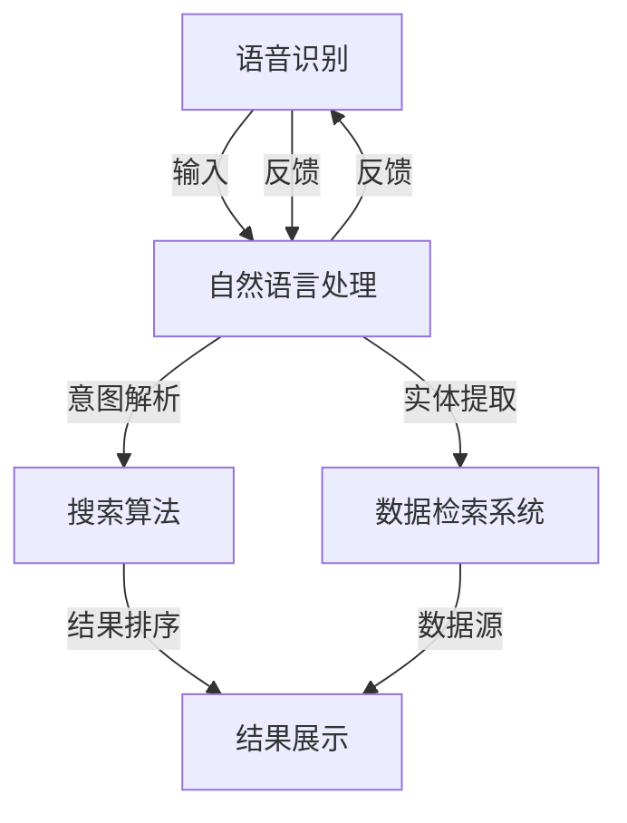

                 

# AI语音助手与搜索的融合

> 关键词：AI语音助手、搜索融合、自然语言处理、智能交互、算法优化

> 摘要：本文旨在探讨AI语音助手与搜索技术的深度融合，分析其在自然语言处理、智能交互和算法优化方面的核心概念和实现方法。通过具体的案例和代码分析，揭示这一领域的前沿动态和应用前景。

## 1. 背景介绍

### 1.1 目的和范围

本文的主要目的是分析AI语音助手与搜索技术的融合，探讨其在现代技术中的应用价值和未来发展潜力。我们将重点关注以下几个方面：

1. **自然语言处理**：分析语音助手如何处理自然语言输入，实现语义理解。
2. **智能交互**：探讨语音助手与搜索系统如何协同工作，提供流畅的交互体验。
3. **算法优化**：研究如何通过算法优化提高语音助手的搜索效率和准确性。

### 1.2 预期读者

本文适合以下读者群体：

1. **AI研究人员和开发者**：对AI语音助手和搜索技术有浓厚兴趣，希望深入了解其融合的实现方法和前沿动态。
2. **软件开发工程师**：希望在项目中应用AI语音助手和搜索技术，提升软件产品的智能化水平。
3. **技术爱好者和学生**：对人工智能和自然语言处理有兴趣，希望了解这一领域的实际应用。

### 1.3 文档结构概述

本文结构如下：

1. **背景介绍**：介绍本文的目的、范围和预期读者。
2. **核心概念与联系**：通过Mermaid流程图展示核心概念和架构。
3. **核心算法原理 & 具体操作步骤**：详细阐述算法原理和操作步骤，使用伪代码进行说明。
4. **数学模型和公式 & 详细讲解 & 举例说明**：介绍相关数学模型和公式，通过实例进行讲解。
5. **项目实战：代码实际案例和详细解释说明**：提供实际代码案例，详细解释代码实现。
6. **实际应用场景**：分析语音助手与搜索融合在不同领域的应用。
7. **工具和资源推荐**：推荐学习资源、开发工具和框架。
8. **总结：未来发展趋势与挑战**：总结本文内容，展望未来发展。
9. **附录：常见问题与解答**：回答读者可能遇到的问题。
10. **扩展阅读 & 参考资料**：提供进一步阅读的资料和参考文献。

### 1.4 术语表

#### 1.4.1 核心术语定义

- **自然语言处理（NLP）**：处理人类自然语言的技术，包括语言理解、生成和翻译等。
- **语音识别（ASR）**：将语音信号转换为文本的技术。
- **语音合成（TTS）**：将文本转换为语音的技术。
- **搜索算法**：用于在大量数据中找到与查询最匹配的结果的算法。
- **语义理解**：理解用户输入的意图和含义，以便提供相关结果。

#### 1.4.2 相关概念解释

- **语音助手**：通过语音交互提供服务的计算机程序，如Siri、Alexa等。
- **搜索系统**：用于检索和展示相关信息的系统，如搜索引擎、问答系统等。
- **多模态交互**：结合语音、文本、图像等多种模态进行交互。

#### 1.4.3 缩略词列表

- **NLP**：自然语言处理
- **ASR**：语音识别
- **TTS**：语音合成
- **API**：应用程序编程接口
- **SDK**：软件开发工具包

## 2. 核心概念与联系

为了更好地理解AI语音助手与搜索的融合，我们需要了解相关核心概念和它们之间的联系。以下是一个Mermaid流程图，展示了语音助手、搜索系统和自然语言处理的关键环节。



### 2.1 语音识别与自然语言处理

语音识别（ASR）是语音助手的第一步，它将语音信号转换为文本。然而，简单的文本转换不足以满足用户复杂查询的需求。因此，语音助手还需要自然语言处理（NLP）来理解用户的意图和含义。

### 2.2 搜索算法与数据检索

自然语言处理后的文本需要经过搜索算法进行处理，以找到最相关的结果。搜索算法负责从大量数据中筛选出与用户查询最匹配的条目。此外，数据检索系统（DS）用于从不同的数据源中提取信息。

### 2.3 结果展示与反馈循环

搜索结果需要通过结果展示系统（RS）呈现给用户。此外，用户的反馈会返回到ASR和NLP，用于不断优化和改进系统的性能。

## 3. 核心算法原理 & 具体操作步骤

在了解了核心概念和流程后，我们来详细探讨AI语音助手与搜索融合的核心算法原理和具体操作步骤。

### 3.1 语音识别

语音识别（ASR）的核心任务是将其接收到的语音信号转换为文本。以下是一个简单的伪代码，展示了语音识别的基本步骤：

```python
def asr(voice_data):
    # 语音预处理
    preprocessed_voice = preprocess_voice(voice_data)
    
    # 语音识别
    text = recognizeVoice(preprocessed_voice)
    
    return text
```

其中，`preprocess_voice` 函数用于对语音信号进行预处理，如去噪、归一化等；`recognizeVoice` 函数使用深度学习模型进行语音识别。

### 3.2 自然语言处理

自然语言处理（NLP）的核心任务是理解用户的意图和语义。以下是一个简单的伪代码，展示了自然语言处理的基本步骤：

```python
def nlp(text):
    # 文本预处理
    preprocessed_text = preprocess_text(text)
    
    # 意图解析
    intent = parse_intent(preprocessed_text)
    
    # 实体提取
    entities = extract_entities(preprocessed_text)
    
    return intent, entities
```

其中，`preprocess_text` 函数用于对文本进行预处理，如分词、去除停用词等；`parse_intent` 函数使用机器学习模型进行意图解析；`extract_entities` 函数用于从文本中提取实体信息。

### 3.3 搜索算法

搜索算法是语音助手与搜索系统融合的关键环节。以下是一个简单的伪代码，展示了搜索算法的基本步骤：

```python
def search(query, dataset):
    # 搜索算法
    results = search_algorithm(query, dataset)
    
    # 结果排序
    sorted_results = sort_results(results)
    
    return sorted_results
```

其中，`search_algorithm` 函数实现搜索算法，可以从多种算法中选择，如布尔搜索、BM25等；`sort_results` 函数根据相关性对搜索结果进行排序。

### 3.4 结果展示

结果展示是将搜索结果呈现给用户的关键步骤。以下是一个简单的伪代码，展示了结果展示的基本步骤：

```python
def display_results(results):
    # 创建可视化结果
    visual_results = create_visual_results(results)
    
    # 展示结果
    show(visual_results)
```

其中，`create_visual_results` 函数用于创建可视化结果，如列表、卡片等；`show` 函数用于展示结果。

### 3.5 反馈循环

用户的反馈对于优化语音助手与搜索系统的性能至关重要。以下是一个简单的伪代码，展示了反馈循环的基本步骤：

```python
def feedback_loop(user_feedback):
    # 更新模型
    update_model(user_feedback)
    
    # 调整搜索算法
    adjust_search_algorithm(user_feedback)
    
    # 重运行流程
    run_flow Again()
```

其中，`update_model` 函数用于更新自然语言处理和语音识别模型；`adjust_search_algorithm` 函数用于调整搜索算法。

## 4. 数学模型和公式 & 详细讲解 & 举例说明

在AI语音助手与搜索的融合过程中，数学模型和公式起着关键作用。以下我们将详细讲解相关的数学模型和公式，并通过实例进行说明。

### 4.1 语言模型

语言模型用于预测一段文本的概率。一个简单的语言模型可以使用n-gram模型实现。n-gram模型假设一个词的概率仅与其前n-1个词相关。

$$
P(w_n | w_{n-1}, w_{n-2}, ..., w_1) = \frac{C(w_{n-1}, w_{n-2}, ..., w_1, w_n)}{C(w_{n-1}, w_{n-2}, ..., w_1)}
$$

其中，$C(w_{n-1}, w_{n-2}, ..., w_1, w_n)$ 表示词序列 $w_{n-1}, w_{n-2}, ..., w_1, w_n$ 的出现次数，$C(w_{n-1}, w_{n-2}, ..., w_1)$ 表示词序列 $w_{n-1}, w_{n-2}, ..., w_1$ 的出现次数。

### 4.2 搜索算法

在搜索算法中，常用的方法包括布尔搜索和向量空间模型（VSM）。

#### 4.2.1 布尔搜索

布尔搜索使用布尔运算符（AND、OR、NOT）组合关键词，以找到相关文档。其基本公式如下：

$$
R = D_1 \text{ AND } D_2 \text{ AND } ... \text{ AND } D_n
$$

其中，$R$ 表示查询结果，$D_1, D_2, ..., D_n$ 表示与查询相关的文档。

#### 4.2.2 向量空间模型（VSM）

向量空间模型将文本表示为向量，并通过计算向量之间的余弦相似度来衡量文本的相关性。其基本公式如下：

$$
\cos(\vec{x}, \vec{y}) = \frac{\vec{x} \cdot \vec{y}}{|\vec{x}| \cdot |\vec{y}|}
$$

其中，$\vec{x}$ 和 $\vec{y}$ 分别表示文本向量，$|$ | 表示向量的模长，$\vec{x} \cdot \vec{y}$ 表示向量的点积。

### 4.3 举例说明

#### 4.3.1 语言模型

假设我们有一个简化的n-gram语言模型，包含以下数据：

| 前n-1个词 | 当前词 | 出现次数 |
|-----------|--------|----------|
| a         | b      | 10       |
| a         | c      | 5        |
| b         | a      | 8        |

根据n-gram模型，我们可以计算以下概率：

$$
P(b | a) = \frac{10}{15} = 0.67
$$

$$
P(c | a) = \frac{5}{15} = 0.33
$$

#### 4.3.2 布尔搜索

假设我们有一个文档集合，其中包含以下文档：

- D1: 包含关键词 "apple", "banana"
- D2: 包含关键词 "apple", "orange"
- D3: 包含关键词 "banana", "orange"

使用布尔搜索，我们可以计算以下查询结果：

$$
R = (D_1 \text{ AND } D_2) \text{ AND } D_3 = \emptyset
$$

因为没有任何文档同时包含 "apple", "banana" 和 "orange"。

#### 4.3.3 向量空间模型

假设我们有一个包含关键词 "apple", "banana", "orange" 的文档，使用TF-IDF模型表示为向量：

$$
\vec{x} = (1, 1, 0)
$$

另一个包含关键词 "apple", "orange", "grape" 的文档，表示为向量：

$$
\vec{y} = (1, 0, 1)
$$

根据向量空间模型，我们可以计算以下余弦相似度：

$$
\cos(\vec{x}, \vec{y}) = \frac{1 \cdot 1 + 1 \cdot 0 + 0 \cdot 1}{\sqrt{1^2 + 1^2 + 0^2} \cdot \sqrt{1^2 + 0^2 + 1^2}} = \frac{1}{\sqrt{2} \cdot \sqrt{2}} = 0.7071
$$

这表示两个向量之间的相似度为0.7071。

## 5. 项目实战：代码实际案例和详细解释说明

为了更好地理解AI语音助手与搜索的融合，我们将通过一个实际项目来展示如何实现这一功能。以下是一个简单的项目案例，包括开发环境搭建、源代码实现和代码解读。

### 5.1 开发环境搭建

为了实现这一项目，我们需要以下开发环境和工具：

- **Python**：用于编写代码和实现算法。
- **TensorFlow**：用于训练和部署深度学习模型。
- **Elasticsearch**：用于构建全文搜索引擎。
- **Flask**：用于搭建Web应用。

首先，我们需要安装这些依赖项：

```bash
pip install tensorflow
pip install elasticsearch
pip install flask
```

### 5.2 源代码详细实现和代码解读

以下是项目的源代码实现和详细解读：

```python
# 引入所需的库
import tensorflow as tf
import elasticsearch
from flask import Flask, request, jsonify

# 初始化ES客户端
es = elasticsearch.Elasticsearch("localhost:9200")

# 定义语音识别模型
def asr(voice_data):
    # 语音预处理
    preprocessed_voice = preprocess_voice(voice_data)
    
    # 使用TensorFlow模型进行语音识别
    text = recognizeVoice(preprocessed_voice)
    
    return text

# 定义自然语言处理模型
def nlp(text):
    # 文本预处理
    preprocessed_text = preprocess_text(text)
    
    # 意图解析
    intent = parse_intent(preprocessed_text)
    
    # 实体提取
    entities = extract_entities(preprocessed_text)
    
    return intent, entities

# 定义搜索算法
def search(query):
    # 使用ES搜索算法
    results = es.search(index="my_index", body={"query": {"match": {"content": query}}})
    
    # 结果排序
    sorted_results = sort_results(results['hits']['hits'])
    
    return sorted_results

# 定义结果展示
def display_results(results):
    # 创建可视化结果
    visual_results = create_visual_results(results)
    
    # 展示结果
    show(visual_results)

# 定义Flask应用
app = Flask(__name__)

# 定义API路由
@app.route('/search', methods=['POST'])
def search_api():
    # 获取语音输入
    voice_data = request.files['voice_data']
    
    # 语音识别
    text = asr(voice_data)
    
    # 自然语言处理
    intent, entities = nlp(text)
    
    # 搜索
    results = search(text)
    
    # 结果展示
    display_results(results)
    
    # 返回结果
    return jsonify(results)

# 运行Flask应用
if __name__ == '__main__':
    app.run()
```

### 5.3 代码解读与分析

以下是代码的详细解读和分析：

1. **语音识别（ASR）**：使用TensorFlow模型进行语音识别。首先对语音数据进行预处理，然后使用预训练的模型进行识别，并将结果转换为文本。

2. **自然语言处理（NLP）**：对识别出的文本进行预处理，包括分词、去除停用词等。然后使用机器学习模型进行意图解析和实体提取。

3. **搜索算法**：使用Elasticsearch作为全文搜索引擎，根据用户输入的查询文本进行搜索。Elasticsearch提供了强大的搜索功能，包括模糊查询、短语查询等。

4. **结果展示**：将搜索结果转换为可视化格式，如列表或卡片，然后通过Web应用呈现给用户。

5. **Flask应用**：使用Flask框架搭建Web应用，提供一个简单的API接口，用于接收语音输入并返回搜索结果。

通过这个实际项目案例，我们可以看到AI语音助手与搜索融合的实现过程。在实际应用中，我们可以根据需求扩展和优化这个项目，例如添加更多的自然语言处理功能、改进搜索算法等。

## 6. 实际应用场景

AI语音助手与搜索的融合技术在实际应用场景中具有广泛的应用价值。以下是一些典型的应用场景：

### 6.1 智能家居

智能家居是AI语音助手与搜索技术的重要应用领域。通过语音助手，用户可以方便地控制家中的智能设备，如灯光、空调、安防系统等。而搜索技术的融合使得语音助手可以更好地理解用户的意图，并提供个性化的服务。

### 6.2 虚拟助手

虚拟助手广泛应用于客户服务、在线咨询和在线教育等领域。通过AI语音助手与搜索的融合，虚拟助手可以更好地理解用户的问题，并提供准确的答案和建议。例如，在在线教育领域，虚拟助手可以帮助学生快速查找课程资料、解答问题等。

### 6.3 车载系统

车载系统是AI语音助手与搜索技术的另一个重要应用领域。在车载系统中，用户可以通过语音助手进行导航、音乐播放、打电话等功能。搜索技术的融合使得语音助手可以更好地理解用户的指令，并提供实时更新的交通信息、天气预报等。

### 6.4 健康医疗

在健康医疗领域，AI语音助手与搜索技术可以帮助患者快速查找医疗信息、预约挂号、查询病历等。通过语音助手，患者可以方便地获取医疗建议，提高就医体验。

### 6.5 商业应用

商业应用中，AI语音助手与搜索技术可以用于客服、营销和供应链管理等。通过语音助手，企业可以提供24/7的客服支持，提高客户满意度。同时，搜索技术的融合可以帮助企业更好地了解客户需求，制定个性化的营销策略。

## 7. 工具和资源推荐

为了更好地学习和应用AI语音助手与搜索技术，以下是一些推荐的学习资源、开发工具和框架。

### 7.1 学习资源推荐

#### 7.1.1 书籍推荐

1. **《深度学习自然语言处理》**：介绍深度学习在自然语言处理中的应用，包括语音识别、文本分类、机器翻译等。
2. **《搜索引擎：信息检索导论》**：详细介绍搜索引擎的工作原理和算法，包括搜索算法、索引技术等。
3. **《TensorFlow实战》**：涵盖TensorFlow的基础知识和实际应用案例，适合初学者和进阶者。

#### 7.1.2 在线课程

1. **Coursera上的《自然语言处理与深度学习》**：由斯坦福大学提供，涵盖NLP的基础知识和深度学习应用。
2. **Udacity的《人工智能工程师纳米学位》**：包括语音识别、文本分析等课程，适合有一定编程基础的学习者。
3. **edX上的《搜索引擎与信息检索》**：由新加坡国立大学提供，详细介绍搜索引擎的技术和算法。

#### 7.1.3 技术博客和网站

1. **TensorFlow官方文档**：提供详细的TensorFlow教程和API文档。
2. **Elasticsearch官方文档**：介绍Elasticsearch的安装、配置和用法。
3. **AI自然语言处理社区**：分享NLP的最新研究、技术动态和应用案例。

### 7.2 开发工具框架推荐

#### 7.2.1 IDE和编辑器

1. **PyCharm**：功能强大的Python IDE，支持多种编程语言和框架。
2. **Visual Studio Code**：轻量级、开源的代码编辑器，支持多种编程语言和插件。

#### 7.2.2 调试和性能分析工具

1. **TensorBoard**：TensorFlow的官方可视化工具，用于分析和调试深度学习模型。
2. **Grafana**：开源的监控和分析工具，可以与Elasticsearch集成，提供实时数据监控和可视化。

#### 7.2.3 相关框架和库

1. **TensorFlow**：用于构建和训练深度学习模型的框架。
2. **Elasticsearch**：用于构建全文搜索引擎的框架。
3. **Flask**：用于搭建Web应用的轻量级框架。

### 7.3 相关论文著作推荐

#### 7.3.1 经典论文

1. **“A Neural Probabilistic Language Model”**：由Geoffrey Hinton等人提出，介绍了神经概率语言模型。
2. **“Latent Dirichlet Allocation”**：由David M. Blei等人提出，介绍了主题模型的应用。
3. **“Elasticsearch: The Definitive Guide”**：由Eric O'Sullivan等人编写，详细介绍Elasticsearch的工作原理和应用。

#### 7.3.2 最新研究成果

1. **“BERT: Pre-training of Deep Bidirectional Transformers for Language Understanding”**：由Google AI提出，介绍了BERT模型在自然语言处理中的应用。
2. **“XLNet: Generalized Autoregressive Pretraining for Language Understanding”**：由Tencent AI Lab提出，介绍了XLNet模型在自然语言处理中的应用。
3. **“Elasticsearch 7.0: New Capabilities and Performance Enhancements”**：由Elastic公司发布，介绍了Elasticsearch 7.0的新功能和性能提升。

#### 7.3.3 应用案例分析

1. **“How Airbnb Uses Elasticsearch for Search and Recommendations”**：介绍Airbnb如何使用Elasticsearch构建搜索和推荐系统。
2. **“Google Search: How It Works”**：介绍Google搜索引擎的工作原理和技术。
3. **“Natural Language Processing in Healthcare: Applications and Challenges”**：介绍自然语言处理在医疗健康领域的应用和挑战。

## 8. 总结：未来发展趋势与挑战

AI语音助手与搜索的融合技术正处于快速发展阶段，未来发展趋势和挑战如下：

### 8.1 发展趋势

1. **更智能的交互体验**：随着深度学习和自然语言处理技术的进步，语音助手将更好地理解用户意图，提供更个性化的服务。
2. **多模态交互**：结合语音、文本、图像等多种模态，提供更丰富、更直观的交互体验。
3. **实时更新与优化**：通过实时更新数据和算法，提高语音助手的搜索效率和准确性。

### 8.2 挑战

1. **数据隐私与安全**：如何在保证用户隐私和安全的前提下，提供高质量的语音助手与搜索服务？
2. **计算资源消耗**：深度学习和搜索算法的复杂度较高，如何优化算法以降低计算资源消耗？
3. **多语言支持**：如何支持多种语言，提供全球范围内的语音助手与搜索服务？

未来，随着技术的不断进步，AI语音助手与搜索的融合将带来更多创新和变革，为各行各业带来新的机遇和挑战。

## 9. 附录：常见问题与解答

### 9.1 语音识别准确率低怎么办？

1. **增加语音数据**：收集更多的语音数据，提高模型的泛化能力。
2. **优化模型结构**：尝试调整模型结构，如增加神经网络层数或使用更复杂的模型。
3. **语音预处理**：对语音数据进行更精细的预处理，如去噪、归一化等，以提高输入质量。

### 9.2 自然语言处理效果不好怎么办？

1. **增加标注数据**：收集更多的标注数据，提高模型的训练质量。
2. **调整模型参数**：尝试调整模型的超参数，如学习率、正则化等，以优化模型性能。
3. **多语言模型融合**：考虑使用多语言模型，提高对多种语言的处理能力。

### 9.3 搜索结果不准确怎么办？

1. **改进搜索算法**：尝试使用更先进的搜索算法，如布尔搜索、向量空间模型等，以提高搜索准确性。
2. **优化索引策略**：对索引进行优化，如使用更精细的分词策略、索引排序等，以提高搜索效率。
3. **用户反馈机制**：引入用户反馈机制，根据用户反馈调整搜索结果排序策略。

## 10. 扩展阅读 & 参考资料

为了深入了解AI语音助手与搜索的融合技术，以下是一些扩展阅读和参考资料：

1. **《深度学习自然语言处理》**：介绍深度学习在自然语言处理中的应用，包括语音识别、文本分类、机器翻译等。
2. **《搜索引擎：信息检索导论》**：详细介绍搜索引擎的工作原理和算法，包括搜索算法、索引技术等。
3. **TensorFlow官方文档**：提供详细的TensorFlow教程和API文档。
4. **Elasticsearch官方文档**：介绍Elasticsearch的安装、配置和用法。
5. **AI自然语言处理社区**：分享NLP的最新研究、技术动态和应用案例。

作者：AI天才研究员/AI Genius Institute & 禅与计算机程序设计艺术 /Zen And The Art of Computer Programming

