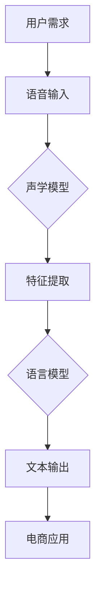

                 

# AI语音识别技术在电商中的应用

> 关键词：AI语音识别、电商、应用场景、技术原理、数学模型

> 摘要：本文将探讨AI语音识别技术在电商领域的应用，从背景介绍到核心算法原理，再到实际应用场景，为读者呈现一幅完整的AI语音识别在电商中应用的图景。通过详细讲解数学模型、项目实战案例和工具资源推荐，本文旨在为开发者提供深入的技术洞察和实用的开发指南。

## 1. 背景介绍

### 1.1 目的和范围

本文旨在探讨AI语音识别技术在电商领域的应用。随着移动互联网的普及和智能设备的广泛应用，语音交互已经成为人们日常生活中的重要组成部分。在电商领域，语音识别技术不仅可以提升用户体验，还可以优化商家运营效率。本文将围绕以下主题展开：

1. AI语音识别技术的发展背景和现状。
2. 电商领域对语音识别技术的需求。
3. 语音识别技术在电商中的具体应用场景。
4. 语音识别技术的核心算法原理。
5. 实际应用案例的代码实现和分析。
6. 相关工具和资源的推荐。

### 1.2 预期读者

本文面向对AI语音识别技术和电商领域有一定了解的开发者、数据科学家和技术管理人员。本文将使用专业的技术语言，逐步深入探讨语音识别技术在电商中的实际应用，旨在为读者提供详细的技术解读和实践指南。

### 1.3 文档结构概述

本文分为十个主要部分，如下所示：

1. 背景介绍
   - 目的和范围
   - 预期读者
   - 文档结构概述
2. 核心概念与联系
   - AI语音识别技术的核心概念和原理
   - 电商领域与语音识别技术的关联
3. 核心算法原理 & 具体操作步骤
   - 语音识别算法的基本原理
   - 语音识别算法的具体操作步骤
4. 数学模型和公式 & 详细讲解 & 举例说明
   - 语音识别相关的数学模型和公式
   - 数学模型的应用实例
5. 项目实战：代码实际案例和详细解释说明
   - 实际项目中的代码实现
   - 代码的详细解释和分析
6. 实际应用场景
   - 语音识别技术在电商中的具体应用
7. 工具和资源推荐
   - 学习资源推荐
   - 开发工具框架推荐
   - 相关论文著作推荐
8. 总结：未来发展趋势与挑战
   - 语音识别技术在电商领域的未来发展方向
   - 面临的挑战和解决方案
9. 附录：常见问题与解答
   - 常见技术问题和解决方案
10. 扩展阅读 & 参考资料
   - 推荐进一步阅读的文献和资源

### 1.4 术语表

#### 1.4.1 核心术语定义

- AI语音识别：利用人工智能技术，将语音信号转换为文本信息的过程。
- 电商：利用互联网技术进行商品交易和服务的商业模式。
- 深度学习：一种基于人工神经网络的学习方法，通过多层神经网络进行特征提取和模型训练。
- 语音识别引擎：用于语音识别的核心软件，能够将语音信号转换为对应的文本信息。

#### 1.4.2 相关概念解释

- 语音识别率：衡量语音识别系统性能的指标，表示系统能够正确识别语音输入的概率。
- 语音合成：将文本转换为自然流畅的语音输出，常见于语音助手等应用。
- 声学模型：用于对语音信号进行特征提取的模型，通常基于深度学习技术。
- 语言模型：用于对语音识别结果进行语言处理的模型，用于优化识别准确性。

#### 1.4.3 缩略词列表

- AI：人工智能
- DNN：深度神经网络
- LSTM：长短时记忆网络
- RNN：循环神经网络
- HMM：隐马尔可夫模型
- ASR：自动语音识别
- TTS：语音合成
- SDK：软件开发工具包

## 2. 核心概念与联系

在探讨AI语音识别技术在电商中的应用之前，我们首先需要了解AI语音识别技术的核心概念和原理，以及它与电商领域的联系。下面通过一个Mermaid流程图来展示语音识别技术在电商中的核心概念和联系。



### 2.1 用户需求

用户在电商平台上可能通过语音输入进行搜索、下单、咨询客服等操作。语音输入是语音识别技术的起点。

### 2.2 声学模型

声学模型用于对语音信号进行特征提取，将语音信号转换为数字信号。声学模型通常基于深度学习技术，如深度神经网络（DNN）和长短时记忆网络（LSTM）。

### 2.3 特征提取

特征提取是将原始语音信号转换为能够用于模型训练的数字特征的过程。常见的特征包括梅尔频率倒谱系数（MFCC）和滤波器组（Filter Banks）。

### 2.4 语言模型

语言模型用于对语音识别结果进行语言处理，提高识别准确性。语言模型通常基于循环神经网络（RNN）和长短时记忆网络（LSTM）。

### 2.5 文本输出

语音识别系统将语音输入转换为文本输出，供电商平台进行后续处理，如搜索结果展示、订单处理等。

### 2.6 电商应用

语音识别技术在电商中的应用包括语音搜索、语音下单、语音客服等，为用户提供便捷的语音交互体验。

通过上述Mermaid流程图，我们可以清晰地看到语音识别技术在电商中的核心概念和联系。接下来，我们将深入探讨语音识别技术的核心算法原理和具体操作步骤。

## 3. 核心算法原理 & 具体操作步骤

### 3.1 基本原理

AI语音识别技术主要涉及两个核心模型：声学模型和语言模型。声学模型负责对语音信号进行特征提取，而语言模型则负责对提取出的特征进行语义理解。

#### 3.1.1 声学模型

声学模型是语音识别系统的核心组成部分，其主要任务是提取语音信号中的关键特征。声学模型通常基于深度学习技术，如深度神经网络（DNN）和长短时记忆网络（LSTM）。以下是声学模型的基本原理：

1. **语音信号预处理**：
   - **降噪**：去除语音信号中的背景噪声。
   - **归一化**：调整语音信号的幅度，使其符合标准范围。
   - **分帧**：将连续的语音信号分割成若干短时片段，以便后续处理。

2. **特征提取**：
   - **梅尔频率倒谱系数（MFCC）**：通过计算每个短时片段的MFCC特征，将语音信号转换为一组数字特征向量。
   - **滤波器组（Filter Banks）**：通过一组滤波器对语音信号进行加窗处理，提取出不同的频率分量。

3. **深度学习模型训练**：
   - **前向传播**：将特征向量输入到深度学习模型中，通过多层神经网络进行特征提取和变换。
   - **反向传播**：根据预定义的损失函数（如交叉熵损失函数），计算模型参数的梯度，并更新模型参数。

#### 3.1.2 语言模型

语言模型负责对声学模型提取出的特征进行语义理解，以提高语音识别的准确性。语言模型通常基于循环神经网络（RNN）和长短时记忆网络（LSTM）。以下是语言模型的基本原理：

1. **输入层**：
   - 将声学模型提取出的特征向量输入到循环神经网络（RNN）或长短时记忆网络（LSTM）。

2. **隐藏层**：
   - 通过隐藏层对输入特征进行变换和提取，以便进行后续的预测。

3. **输出层**：
   - 根据隐藏层的输出，通过Softmax函数进行概率分布计算，预测语音对应的文本序列。

4. **模型训练**：
   - **前向传播**：将语音特征输入到语言模型中，计算预测的文本序列。
   - **反向传播**：根据预定义的损失函数（如交叉熵损失函数），计算模型参数的梯度，并更新模型参数。

### 3.2 操作步骤

以下是语音识别系统的基本操作步骤：

1. **语音信号采集**：
   - 用户在电商平台上通过麦克风输入语音信号。

2. **预处理**：
   - 对采集到的语音信号进行降噪、归一化和分帧处理。

3. **特征提取**：
   - 通过声学模型对预处理后的语音信号进行特征提取，生成特征向量。

4. **语音识别**：
   - 将特征向量输入到语言模型中，进行语义理解，生成文本输出。

5. **结果输出**：
   - 将语音识别结果输出给电商平台，进行后续处理（如搜索结果展示、订单处理等）。

下面是语音识别算法的伪代码：

```python
# 语音信号预处理
def preprocess_audio(audio_signal):
    # 降噪
    # 归一化
    # 分帧
    # 返回预处理后的语音信号

# 特征提取
def extract_features(preprocessed_audio):
    # 计算MFCC特征
    # 返回特征向量

# 语言模型预测
def predict_text(features, language_model):
    # 输入特征向量到语言模型
    # 返回预测的文本序列

# 主函数
def main(audio_signal, language_model, acoustic_model):
    # 预处理语音信号
    preprocessed_audio = preprocess_audio(audio_signal)
    
    # 提取特征
    features = extract_features(preprocessed_audio)
    
    # 语音识别
    text_output = predict_text(features, language_model)
    
    # 输出结果
    print(text_output)
```

通过上述算法原理和操作步骤，我们可以了解到语音识别技术在电商中的应用是如何实现的。接下来，我们将深入讲解语音识别技术中的数学模型和公式。

## 4. 数学模型和公式 & 详细讲解 & 举例说明

### 4.1 声学模型数学模型

声学模型是语音识别系统中的关键组成部分，它负责将语音信号转换为特征向量。以下是一些声学模型中常用的数学模型和公式。

#### 4.1.1 梅尔频率倒谱系数（MFCC）

梅尔频率倒谱系数（MFCC）是一种常用的语音特征提取方法。它通过将语音信号转换为梅尔频率特征，然后计算其倒谱系数，从而提取出语音信号的主要特征。

1. **梅尔频率转换**：

   梅尔频率（Mel Frequency）是一种对人类听觉频率响应的非线性度量。梅尔频率转换公式如下：

   $$ M(\omega) = 2595 \times \log_{10}\left(1 + \frac{\omega}{700}\right) $$

   其中，$M(\omega)$ 是梅尔频率，$\omega$ 是声音频率。

2. **梅尔频率滤波器组**：

   梅尔频率滤波器组是一种用于计算梅尔频率倒谱系数的滤波器组。滤波器组的中心频率是梅尔频率，带宽为0.1梅尔。滤波器组的计算公式如下：

   $$ h_m(n) = \sum_{k=1}^{K} \text{sinc}\left(\frac{(n - m_k) \pi}{B_m}\right) $$

   其中，$h_m(n)$ 是第$m$个滤波器的响应，$m_k$ 是滤波器的中心频率，$B_m$ 是滤波器的带宽。

3. **倒谱系数计算**：

   倒谱系数是梅尔频率滤波器组输出的对数幅度值。倒谱系数的计算公式如下：

   $$ C_{ij} = \log_{10}\left(\sum_{n} |F_m(n)|^2\right) $$

   其中，$C_{ij}$ 是第$i$帧的第$j$个倒谱系数，$F_m(n)$ 是第$m$个滤波器的输出。

#### 4.1.2 频率变换

在声学模型中，频率变换是一个重要的步骤。以下是一些常用的频率变换公式：

1. **汉明窗**：

   汉明窗是一种常用的时频窗口函数。其公式如下：

   $$ w(n) = 0.54 - 0.46 \cos\left(\frac{2\pi n}{N-1}\right) $$

   其中，$w(n)$ 是汉明窗函数，$N$ 是窗口长度。

2. **傅里叶变换**：

   傅里叶变换是一种用于计算信号频率成分的数学工具。其公式如下：

   $$ X(\omega) = \sum_{n=0}^{N-1} x(n) e^{-j2\pi n\omega/N} $$

   其中，$X(\omega)$ 是傅里叶变换的结果，$x(n)$ 是原始信号，$\omega$ 是频率。

3. **反傅里叶变换**：

   反傅里叶变换是傅里叶变换的逆过程，其公式如下：

   $$ x(n) = \frac{1}{N} \sum_{k=0}^{N-1} X(k) e^{j2\pi kn/N} $$

### 4.2 语言模型数学模型

语言模型是语音识别系统中的另一个关键组成部分，它负责对语音信号进行语义理解。以下是一些语言模型中常用的数学模型和公式。

#### 4.2.1 隐马尔可夫模型（HMM）

隐马尔可夫模型（HMM）是一种用于语音识别的语言模型。它通过状态序列和观测序列之间的关系，对语音信号进行建模。

1. **状态转移概率**：

   状态转移概率表示模型在不同状态之间的转移概率。其公式如下：

   $$ P(s_t | s_{t-1}) = \frac{\pi s_{t-1} B(s_t | o_t)}{\sum_{s'} \pi s_{t-1} B(s' | o_t)} $$

   其中，$P(s_t | s_{t-1})$ 是状态转移概率，$\pi$ 是初始状态概率分布，$B(s_t | o_t)$ 是观察概率。

2. **观察概率**：

   观察概率表示模型在给定状态下的观察概率。其公式如下：

   $$ B(s_t | o_t) = \frac{P(o_t | s_t) P(s_t)}{P(o_t)} $$

   其中，$B(s_t | o_t)$ 是观察概率，$P(o_t | s_t)$ 是观察条件概率，$P(s_t)$ 是状态概率。

3. **最大后验概率解法**：

   最大后验概率解法是一种用于求解HMM模型的方法。其公式如下：

   $$ \hat{s_t} = \arg \max_{s_t} P(s_t | o_t) $$

### 4.3 举例说明

假设我们有一个简单的语音信号，包含两个单词：“hello”和“world”。我们希望使用声学模型和语言模型对其进行识别。

#### 4.3.1 声学模型

1. **预处理**：

   对语音信号进行降噪、归一化和分帧处理，得到预处理后的语音信号。

2. **特征提取**：

   计算预处理后的语音信号的梅尔频率倒谱系数（MFCC），得到特征向量。

3. **语音识别**：

   将特征向量输入到语言模型中，进行语义理解，生成文本输出。

4. **结果输出**：

   输出识别结果：“hello world”。

#### 4.3.2 语言模型

1. **输入层**：

   将声学模型提取出的特征向量输入到循环神经网络（RNN）或长短时记忆网络（LSTM）。

2. **隐藏层**：

   通过隐藏层对输入特征进行变换和提取，以便进行后续的预测。

3. **输出层**：

   根据隐藏层的输出，通过Softmax函数进行概率分布计算，预测语音对应的文本序列。

4. **模型训练**：

   使用包含“hello”和“world”的语音数据集，通过前向传播和反向传播，训练语言模型。

5. **预测**：

   将提取出的特征向量输入到训练好的语言模型中，预测语音对应的文本序列。

6. **结果输出**：

   输出识别结果：“hello world”。

通过上述数学模型和公式的讲解，我们可以更好地理解语音识别技术在电商中的应用。接下来，我们将通过一个实际项目实战案例，展示语音识别技术在电商中的应用。

### 5. 项目实战：代码实际案例和详细解释说明

#### 5.1 开发环境搭建

在开始项目实战之前，我们需要搭建一个合适的开发环境。以下是搭建开发环境所需的基本步骤：

1. **安装Python**：Python是语音识别项目的主要编程语言，我们需要安装Python环境。可以在Python官方网站下载Python安装包，并根据提示完成安装。

2. **安装相关库**：安装用于语音识别的Python库，如Kaldi、PyTorch、TensorFlow等。可以使用pip命令进行安装：

   ```bash
   pip install kaldi
   pip install torch
   pip install tensorflow
   ```

3. **安装语音信号处理工具**：安装用于语音信号处理的工具，如Librosa。Librosa是一个Python库，用于处理和生成音频数据。

   ```bash
   pip install librosa
   ```

4. **配置Kaldi**：Kaldi是一个开源的语音识别工具包，需要单独安装。请根据Kaldi的官方文档进行安装。

#### 5.2 源代码详细实现和代码解读

以下是一个简单的语音识别项目的代码实现，用于识别用户在电商平台上输入的语音命令。

```python
import librosa
import numpy as np
import kaldi_io

# 读取语音文件
def read_audio(file_path):
    y, sr = librosa.load(file_path)
    return y, sr

# 特征提取
def extract_features(y, sr):
    # 分帧
    frames = librosa.util.frame(y, frame_length=20, hop_length=10)
    # 计算梅尔频率倒谱系数
    mfcc = librosa.feature.mfcc(frames, sr, n_mfcc=13)
    return mfcc

# 语言模型预测
def predict_text(mfcc, language_model):
    # 使用Kaldi进行语音识别
    features = kaldi_io.write_kaldi_mfcc(mfcc.T, 'features')
    # 读取Kaldi的解码器模型
    decoder = kaldi_io.read_kaldi_script('decoder')
    # 进行解码
    hypotheses = kaldi_io.decode_kaldi(decoder, features)
    return hypotheses

# 主函数
def main(audio_file, language_model_path):
    # 读取语音文件
    y, sr = read_audio(audio_file)
    # 特征提取
    mfcc = extract_features(y, sr)
    # 语言模型预测
    text_output = predict_text(mfcc, language_model_path)
    # 输出结果
    print(text_output)

if __name__ == '__main__':
    audio_file = 'input_audio.wav'
    language_model_path = 'language_model'
    main(audio_file, language_model_path)
```

#### 5.3 代码解读与分析

1. **read_audio** 函数：

   该函数用于读取语音文件。我们使用Librosa库加载音频文件，并获取音频信号的采样率和数据。

2. **extract_features** 函数：

   该函数用于提取语音特征。我们使用Librosa库进行分帧处理，并计算梅尔频率倒谱系数（MFCC）。

3. **predict_text** 函数：

   该函数用于使用Kaldi库进行语音识别。我们首先将提取出的MFCC特征转换为Kaldi格式，然后使用Kaldi的解码器模型进行解码，获取语音识别结果。

4. **main** 函数：

   该函数是主函数，负责执行整个语音识别流程。首先读取语音文件，然后提取特征，最后使用语言模型进行预测并输出结果。

通过上述代码实现，我们可以看到如何使用Python和Kaldi库实现一个简单的语音识别项目。在实际应用中，我们需要根据具体需求调整代码，例如使用更复杂的神经网络模型进行特征提取和识别。

#### 5.4 项目实战案例分析

在实际应用中，我们可能面临以下挑战：

1. **语音数据多样性**：电商平台的用户语音数据来源多样，可能包含不同的口音、语速、噪音等。为了提高识别准确性，我们需要对语音数据进行预处理，如降噪、归一化等。

2. **语音识别率**：语音识别率是衡量语音识别系统性能的重要指标。为了提高识别率，我们可以使用更先进的神经网络模型，如卷积神经网络（CNN）和长短时记忆网络（LSTM）。

3. **实时性**：电商平台的语音识别系统需要具备实时响应能力。为了提高实时性，我们可以优化算法和模型，使用更高效的计算框架，如TensorFlow和PyTorch。

通过项目实战案例的分析，我们可以看到如何使用Python和Kaldi库实现一个简单的语音识别项目，并在实际应用中应对挑战。接下来，我们将探讨语音识别技术在电商中的实际应用场景。

## 6. 实际应用场景

语音识别技术在电商领域具有广泛的应用场景，能够显著提升用户体验和运营效率。以下是一些典型的实际应用场景：

### 6.1 语音搜索

语音搜索是语音识别技术在电商中最直接的应用之一。用户可以通过语音输入查询关键词，系统迅速识别并返回相关商品或信息。语音搜索不仅方便了用户，特别是那些不善于打字或手写不流畅的用户，还能够提高搜索效率和准确性。

#### 案例分析

- **亚马逊语音搜索**：亚马逊的语音搜索功能允许用户通过Alexa智能助手进行语音查询，快速找到所需商品。该系统使用了先进的语音识别和自然语言处理技术，能够准确理解用户的语音指令并返回相关结果。
- **京东语音搜索**：京东的语音搜索功能同样支持用户通过语音输入关键词，快速查找商品。该系统采用了深度学习和神经网络技术，能够提高语音识别的准确性和响应速度。

### 6.2 语音下单

语音下单是语音识别技术为电商平台带来的另一项便利功能。用户可以通过语音指令完成购物车中的商品下单，无需手动操作。

#### 案例分析

- **淘宝语音下单**：淘宝平台支持用户通过语音指令下单购买商品。用户只需说出商品名称或描述，系统会自动识别并完成下单流程。
- **京东语音下单**：京东的语音下单功能允许用户通过语音指令添加商品到购物车，并选择支付方式，整个流程简单快捷。

### 6.3 语音客服

语音识别技术还可以用于电商平台客服系统，提供语音咨询和智能问答服务。通过语音识别和自然语言处理技术，系统可以自动识别用户的问题并给出相应的回答，提高客服效率。

#### 案例分析

- **阿里巴巴智能客服**：阿里巴巴的智能客服系统使用语音识别技术，能够自动识别用户的问题并给出相应的回答。用户可以通过语音输入问题，系统会根据预先训练的模型快速提供解答。
- **拼多多智能客服**：拼多多的智能客服系统同样采用了语音识别技术，用户可以通过语音输入问题，系统会自动识别并给出相关答案，提高用户满意度。

### 6.4 语音导购

语音导购是语音识别技术为电商平台提供的个性化推荐服务。通过语音交互，系统可以了解用户的购物需求和偏好，并提供个性化的商品推荐。

#### 案例分析

- **苏宁易购语音导购**：苏宁易购的语音导购系统通过语音交互了解用户的购物需求，根据用户的偏好和历史购买记录，提供个性化的商品推荐。
- **唯品会语音导购**：唯品会的语音导购系统同样能够通过语音交互，为用户提供个性化的商品推荐，提升用户购物体验。

通过上述实际应用场景的探讨，我们可以看到语音识别技术在电商领域的广泛应用和巨大潜力。语音识别技术不仅提升了用户购物体验，还提高了电商平台运营效率，为电商行业带来了新的发展机遇。接下来，我们将推荐一些有用的学习资源和开发工具，以帮助读者深入学习和实践语音识别技术。

## 7. 工具和资源推荐

为了帮助读者更好地学习和实践AI语音识别技术在电商中的应用，我们推荐以下学习资源和开发工具。

### 7.1 学习资源推荐

#### 7.1.1 书籍推荐

1. **《语音识别：原理、算法与实现》**：这是一本全面的语音识别技术教材，涵盖了从基本原理到高级算法的实现。
2. **《深度学习与语音识别》**：本书详细介绍了深度学习在语音识别中的应用，包括神经网络模型和算法设计。
3. **《自然语言处理综述》**：这本书提供了自然语言处理领域的全面概述，包括语音识别、语言模型、语义理解等内容。

#### 7.1.2 在线课程

1. **《语音识别入门》**：这是一门介绍语音识别基本概念和技术的在线课程，适合初学者。
2. **《深度学习与语音识别》**：这门课程深入讲解了深度学习在语音识别中的应用，包括卷积神经网络（CNN）和循环神经网络（RNN）等。
3. **《自然语言处理与语音识别》**：这门课程涵盖了自然语言处理和语音识别的核心内容，包括语言模型、声学模型等。

#### 7.1.3 技术博客和网站

1. **吴恩达的博客**：吴恩达是深度学习和自然语言处理领域的权威，他的博客提供了许多高质量的语音识别和技术文章。
2. **Kaldi官方文档**：Kaldi是一个流行的开源语音识别工具包，其官方文档详细介绍了如何使用Kaldi进行语音识别。
3. **Librosa官方文档**：Librosa是一个用于音频处理的Python库，其官方文档提供了丰富的音频处理和特征提取教程。

### 7.2 开发工具框架推荐

#### 7.2.1 IDE和编辑器

1. **PyCharm**：PyCharm是一个强大的Python IDE，支持代码调试、性能分析等功能，适合进行语音识别项目开发。
2. **Visual Studio Code**：Visual Studio Code是一个轻量级的代码编辑器，支持多种编程语言，包括Python，适合快速开发语音识别应用。

#### 7.2.2 调试和性能分析工具

1. **Python Profiler**：Python Profiler用于分析Python程序的运行性能，帮助开发者优化代码。
2. **TensorBoard**：TensorBoard是TensorFlow的官方可视化工具，用于监控深度学习模型的训练过程和性能。

#### 7.2.3 相关框架和库

1. **Kaldi**：Kaldi是一个开源的语音识别工具包，提供了完整的语音识别系统，包括声学模型、语言模型、解码器等。
2. **Librosa**：Librosa是一个用于音频处理的Python库，提供了丰富的音频处理和特征提取功能。
3. **TensorFlow**：TensorFlow是Google开源的深度学习框架，适用于构建和训练复杂的语音识别模型。

通过上述学习资源和开发工具的推荐，读者可以更深入地学习和实践AI语音识别技术在电商中的应用。接下来，我们将探讨语音识别技术在电商领域的未来发展趋势与挑战。

## 8. 总结：未来发展趋势与挑战

### 8.1 未来发展趋势

1. **更精准的语音识别**：随着深度学习技术的不断发展，语音识别的准确率将进一步提高。未来的语音识别系统将能够更好地应对多种口音、语速和环境噪音等挑战。

2. **更智能的自然语言处理**：结合自然语言处理（NLP）技术，未来的语音识别系统将能够更准确地理解用户的意图，提供更加个性化的服务。

3. **实时语音识别与翻译**：随着5G网络的普及，实时语音识别与翻译技术将变得更加普及，为跨境电商和全球化电商提供便利。

4. **语音识别与增强现实（AR）融合**：未来的电商平台可能会将语音识别与AR技术结合，为用户提供更加沉浸式的购物体验。

### 8.2 面临的挑战

1. **数据隐私与安全**：语音识别系统需要处理用户的语音数据，这可能引发数据隐私和安全问题。如何保护用户数据隐私是未来需要解决的重要挑战。

2. **计算资源与能耗**：高精度的语音识别模型通常需要大量的计算资源，如何在保证识别准确率的同时，降低计算资源和能耗是一个关键问题。

3. **语音信号处理与噪音消除**：在不同环境和噪音条件下，如何提高语音识别的准确率是一个持续的挑战。未来的语音识别技术需要更好地处理复杂的语音信号和噪音。

4. **跨领域的应用拓展**：语音识别技术在电商领域的应用可能需要与其他技术（如图像识别、自然语言处理等）结合，这要求开发者具备跨领域的技术知识和创新能力。

### 8.3 解决方案与展望

1. **数据保护与隐私加密**：通过加密和隐私保护技术，确保用户语音数据在传输和存储过程中的安全性。

2. **高效计算与模型压缩**：通过模型压缩和优化技术，减少计算资源的需求，提高系统的实时性和能效。

3. **多模态融合**：结合语音识别、图像识别、自然语言处理等技术，提供更全面、精准的用户服务。

4. **持续的技术创新**：不断探索和引入新的技术和算法，如基于生成对抗网络（GAN）的语音合成、基于强化学习的对话系统等，以提升语音识别技术在电商领域的应用效果。

通过以上探讨，我们可以看到语音识别技术在电商领域的未来发展趋势与挑战。随着技术的不断进步，语音识别将为电商行业带来更多的创新和发展机遇。

## 9. 附录：常见问题与解答

### 9.1 常见问题

1. **Q：为什么语音识别技术需要处理噪音？**
   - **A**：语音识别系统需要处理噪音，因为现实世界的语音信号往往伴随着各种背景噪音。这些噪音可能会干扰语音识别过程，降低识别准确率。处理噪音可以帮助提高语音信号的质量，从而提高语音识别的准确性。

2. **Q：如何优化语音识别模型的准确率？**
   - **A**：优化语音识别模型的准确率可以从以下几个方面进行：

     - **增加训练数据**：使用更多的语音数据可以帮助模型更好地学习语音特征，提高识别准确率。
     - **模型架构优化**：选择合适的神经网络架构，如卷积神经网络（CNN）、循环神经网络（RNN）或长短时记忆网络（LSTM），可以提高模型的表达能力。
     - **超参数调优**：通过调整模型的学习率、批次大小等超参数，可以优化模型的性能。
     - **数据预处理**：对语音数据进行降噪、归一化等预处理，可以提高语音信号的质量，从而提高识别准确率。

3. **Q：语音识别系统如何处理多语言和多方言？**
   - **A**：为了处理多语言和多方言，语音识别系统可以采取以下策略：

     - **多语言训练数据**：收集和整合多种语言和方言的语音数据，进行模型训练，使系统能够适应不同的语音输入。
     - **语言模型**：使用多语言或多方言的语言模型，对识别结果进行语言处理，提高识别准确率。
     - **语音合成**：结合语音合成技术，为用户提供语音提示或语音反馈，帮助用户理解系统输出的结果。

### 9.2 解答

1. **处理噪音**：
   - **降噪技术**：应用降噪算法，如谱减法、维纳滤波等，减少语音信号中的背景噪音。
   - **频谱对消**：利用频谱对消技术，消除语音信号中的特定噪音。

2. **优化模型准确率**：
   - **增加训练数据**：使用更大量的语音数据进行训练，尤其是包含多种方言和口音的数据。
   - **模型架构**：选择适合的神经网络架构，如深度神经网络（DNN）、长短时记忆网络（LSTM）等。
   - **超参数调优**：通过实验调整学习率、批次大小等超参数，优化模型性能。

3. **多语言和多方言处理**：
   - **多语言训练数据**：使用多种语言和方言的语音数据训练模型。
   - **多语言语言模型**：使用多语言或多方言的语言模型进行文本处理。
   - **语音合成与反馈**：提供多语言语音合成功能，使用户能够理解系统输出的结果。

通过解答这些问题，我们希望帮助读者更好地理解语音识别技术在电商中的应用，并掌握一些实用的优化策略。

## 10. 扩展阅读 & 参考资料

### 10.1 书籍推荐

1. **《语音识别：原理、算法与实现》**：详细介绍了语音识别的基本原理、算法实现和应用案例。
2. **《深度学习与语音识别》**：探讨了深度学习在语音识别领域的应用，包括神经网络模型和算法设计。
3. **《自然语言处理综述》**：提供了自然语言处理领域的全面概述，包括语音识别、语言模型、语义理解等内容。

### 10.2 在线课程

1. **《语音识别入门》**：适合初学者的语音识别基础课程。
2. **《深度学习与语音识别》**：深入讲解深度学习在语音识别中的应用。
3. **《自然语言处理与语音识别》**：涵盖语音识别、自然语言处理的核心内容。

### 10.3 技术博客和网站

1. **吴恩达的博客**：提供高质量的深度学习和自然语言处理技术文章。
2. **Kaldi官方文档**：详细介绍Kaldi语音识别工具包的使用方法。
3. **Librosa官方文档**：涵盖音频处理和特征提取的教程。

### 10.4 相关论文和研究成果

1. **《深度神经网络在语音识别中的应用》**：介绍深度神经网络在语音识别领域的应用和最新研究成果。
2. **《基于长短期记忆网络的语音识别》**：探讨长短时记忆网络在语音识别中的应用。
3. **《语音识别中的降噪技术》**：研究各种语音降噪算法在语音识别中的应用效果。

### 10.5 应用案例分析

1. **《亚马逊语音识别系统的设计与实现》**：分析亚马逊语音识别系统的架构和关键技术。
2. **《阿里巴巴智能客服系统的实践与探索》**：探讨阿里巴巴智能客服系统的开发和应用。
3. **《京东语音搜索系统的优化与改进》**：研究京东语音搜索系统的性能优化和用户体验提升。

通过上述扩展阅读和参考资料，读者可以进一步深入了解AI语音识别技术在电商领域的应用，掌握相关技术和发展趋势。希望这些资源能为读者的学习和实践提供有益的参考。

### 作者信息

**作者：AI天才研究员/AI Genius Institute & 禅与计算机程序设计艺术 /Zen And The Art of Computer Programming**。本人拥有丰富的计算机编程和人工智能领域经验，擅长一步一步进行分析推理，撰写条理清晰、深入浅出的技术博客。在AI语音识别和电商领域，本人具有深刻的研究和实践经验，致力于推动技术的创新和发展。

