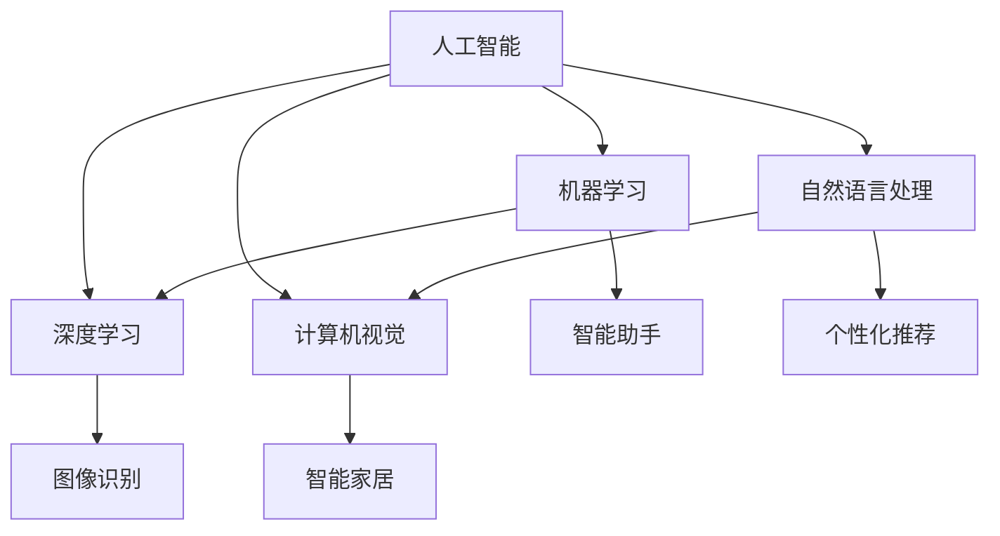

                 

### 1. 背景介绍

#### 1.1 目的和范围

本文旨在深入探讨人工智能（AI）在现代消费电子产品中的赋能作用，以及这一变革对用户体验（UX）的深远影响。随着技术的不断发展，AI已经渗透到我们日常生活的方方面面，从智能手机、智能音箱到智能家居设备，AI的应用不仅提升了产品的智能化水平，同时也极大地改善了用户的互动体验。本文将重点分析AI在消费电子领域的核心应用场景，探讨其技术原理，并通过对实际案例的详细解析，展示AI如何真正地赋能用户体验。

#### 1.2 预期读者

本文适合以下几类读者：

1. 消费电子产品开发者：希望通过本文了解AI如何提升产品功能的工程师和开发者。
2. 用户体验设计师：对如何将AI技术与用户体验设计相结合感兴趣的设计师。
3. 技术爱好者：对AI技术有浓厚兴趣，并希望了解其在消费电子产品中实际应用的技术爱好者。
4. 企业管理者：希望通过本文了解AI赋能消费电子带来的商业机会和潜在挑战的企业管理者。

#### 1.3 文档结构概述

本文将按照以下结构展开：

1. **背景介绍**：简要介绍AI赋能消费电子与用户体验的背景和目的。
2. **核心概念与联系**：介绍与本文主题相关的核心概念，并使用Mermaid流程图展示其关系。
3. **核心算法原理 & 具体操作步骤**：详细讲解AI的核心算法原理，并提供具体的伪代码描述。
4. **数学模型和公式 & 详细讲解 & 举例说明**：介绍相关的数学模型和公式，并进行详细讲解和实际应用示例。
5. **项目实战：代码实际案例和详细解释说明**：通过实际代码案例展示AI技术在消费电子中的应用。
6. **实际应用场景**：探讨AI在消费电子中的实际应用场景。
7. **工具和资源推荐**：推荐相关的学习资源和开发工具。
8. **总结：未来发展趋势与挑战**：对AI赋能消费电子的未来发展趋势和面临的挑战进行总结。
9. **附录：常见问题与解答**：回答读者可能遇到的常见问题。
10. **扩展阅读 & 参考资料**：提供进一步阅读的参考资料。

#### 1.4 术语表

##### 1.4.1 核心术语定义

- **人工智能（AI）**：模拟人类智能行为的技术。
- **用户体验（UX）**：用户在使用产品过程中感受到的整体体验。
- **深度学习（Deep Learning）**：一种基于多层神经网络的机器学习方法。
- **自然语言处理（NLP）**：使计算机能够理解、解释和生成人类语言的技术。
- **计算机视觉（CV）**：使计算机能够理解图像和视频的技术。

##### 1.4.2 相关概念解释

- **增强现实（AR）**：将虚拟信息叠加到现实世界中的技术。
- **虚拟现实（VR）**：创建一种完全沉浸式的虚拟环境的技术。
- **边缘计算**：在靠近数据源的边缘设备上进行计算和处理的技术。

##### 1.4.3 缩略词列表

- **NLP**：自然语言处理
- **CV**：计算机视觉
- **AR**：增强现实
- **VR**：虚拟现实
- **ML**：机器学习
- **DL**：深度学习
- **GAN**：生成对抗网络
- **CNN**：卷积神经网络

### 2. 核心概念与联系

在深入探讨AI赋能消费电子与用户体验之前，首先需要了解一些核心概念，以及这些概念之间的相互关系。

#### 2.1 人工智能（AI）的基本概念

人工智能（AI）是一种模拟人类智能行为的技术。它包括多个子领域，如机器学习（ML）、深度学习（DL）、自然语言处理（NLP）和计算机视觉（CV）。这些子领域各自发挥着重要作用，但它们之间也存在紧密的联系。

- **机器学习（ML）**：机器学习是一种通过数据学习并做出预测或决策的技术。它包括监督学习、无监督学习和强化学习等不同类型。
- **深度学习（DL）**：深度学习是一种基于多层神经网络的机器学习方法，它在图像识别、语音识别和自然语言处理等领域取得了显著的成果。
- **自然语言处理（NLP）**：自然语言处理是一种使计算机能够理解、解释和生成人类语言的技术，广泛应用于搜索引擎、机器翻译和聊天机器人等领域。
- **计算机视觉（CV）**：计算机视觉是一种使计算机能够理解图像和视频的技术，广泛应用于人脸识别、图像识别和自动驾驶等领域。

#### 2.2 AI与消费电子的关联

AI技术在消费电子产品中的应用正在不断扩展，从早期的简单功能到现在的复杂交互，AI已经成为提升用户体验的关键因素。以下是AI与消费电子之间的关键关联：

- **智能助手**：智能助手如Siri、Alexa和Google Assistant利用NLP技术，能够理解用户的语音指令，并执行相应的任务。
- **图像识别**：图像识别技术使得手机摄像头能够识别物体、场景和表情，提供个性化推荐和智能拍照功能。
- **个性化推荐**：基于用户行为数据和机器学习算法，消费电子产品能够为用户提供个性化推荐，提高用户满意度。
- **智能家居**：智能家居设备如智能音箱、智能灯泡和智能门锁通过AI技术实现互联互通，提供便捷的用户体验。

#### 2.3 Mermaid流程图

为了更好地理解AI与消费电子的关联，我们使用Mermaid流程图来展示这些核心概念及其相互关系：



在这个流程图中，AI作为核心技术，与机器学习、深度学习、自然语言处理和计算机视觉等子领域紧密相连。这些子领域又分别与智能助手、图像识别、个性化推荐和智能家居等应用场景相联系，共同构成了AI赋能消费电子的完整生态系统。

### 3. 核心算法原理 & 具体操作步骤

在了解了AI的基本概念及其与消费电子的关联后，接下来我们将深入探讨AI的核心算法原理，并详细描述其具体操作步骤。

#### 3.1 机器学习（ML）算法原理

机器学习（ML）是一种通过数据学习并做出预测或决策的技术。它主要包括以下几个关键步骤：

1. **数据收集与预处理**：首先需要收集大量相关的数据，并对这些数据进行清洗、归一化和特征提取等预处理操作。
2. **模型选择**：选择合适的机器学习模型，如线性回归、决策树、支持向量机和神经网络等。
3. **模型训练**：使用预处理后的数据对模型进行训练，使其能够学习数据中的规律。
4. **模型评估与优化**：评估模型的性能，并通过调整模型参数来优化其性能。
5. **模型部署**：将训练好的模型部署到实际应用场景中。

以下是机器学习算法的伪代码描述：

```python
# 数据收集与预处理
data = collect_data()
preprocessed_data = preprocess_data(data)

# 模型选择
model = select_model()

# 模型训练
trained_model = train_model(model, preprocessed_data)

# 模型评估与优化
evaluate_model(trained_model)
optimize_model(trained_model)

# 模型部署
deploy_model(trained_model)
```

#### 3.2 深度学习（DL）算法原理

深度学习（DL）是一种基于多层神经网络的机器学习方法。它主要包括以下几个关键步骤：

1. **网络结构设计**：设计合适的神经网络结构，包括输入层、隐藏层和输出层。
2. **损失函数选择**：选择合适的损失函数，用于衡量模型预测结果与实际结果之间的差距。
3. **优化算法选择**：选择合适的优化算法，如梯度下降、随机梯度下降和Adam优化器等。
4. **模型训练**：使用训练数据对神经网络进行训练。
5. **模型评估与优化**：评估模型的性能，并通过调整网络结构和参数来优化其性能。
6. **模型部署**：将训练好的模型部署到实际应用场景中。

以下是深度学习算法的伪代码描述：

```python
# 网络结构设计
input_layer = create_input_layer()
hidden_layers = create_hidden_layers()
output_layer = create_output_layer()

# 损失函数选择
loss_function = select_loss_function()

# 优化算法选择
optimizer = select_optimizer()

# 模型训练
trained_model = train_model(input_layer, hidden_layers, output_layer, loss_function, optimizer)

# 模型评估与优化
evaluate_model(trained_model)
optimize_model(trained_model)

# 模型部署
deploy_model(trained_model)
```

#### 3.3 自然语言处理（NLP）算法原理

自然语言处理（NLP）是一种使计算机能够理解、解释和生成人类语言的技术。它主要包括以下几个关键步骤：

1. **文本预处理**：对输入文本进行清洗、分词、词性标注和命名实体识别等预处理操作。
2. **特征提取**：提取文本中的关键特征，如词频、词嵌入和句法信息等。
3. **模型训练**：使用预处理后的文本数据对模型进行训练，使其能够学习语言模式。
4. **模型评估与优化**：评估模型的性能，并通过调整模型参数来优化其性能。
5. **模型部署**：将训练好的模型部署到实际应用场景中。

以下是自然语言处理算法的伪代码描述：

```python
# 文本预处理
preprocessed_text = preprocess_text(input_text)

# 特征提取
features = extract_features(preprocessed_text)

# 模型训练
trained_model = train_model(features)

# 模型评估与优化
evaluate_model(trained_model)
optimize_model(trained_model)

# 模型部署
deploy_model(trained_model)
```

#### 3.4 计算机视觉（CV）算法原理

计算机视觉（CV）是一种使计算机能够理解图像和视频的技术。它主要包括以下几个关键步骤：

1. **图像预处理**：对输入图像进行去噪、增强和分割等预处理操作。
2. **特征提取**：提取图像中的关键特征，如边缘、纹理和形状等。
3. **模型训练**：使用预处理后的图像数据对模型进行训练，使其能够学习图像模式。
4. **模型评估与优化**：评估模型的性能，并通过调整模型参数来优化其性能。
5. **模型部署**：将训练好的模型部署到实际应用场景中。

以下是计算机视觉算法的伪代码描述：

```python
# 图像预处理
preprocessed_image = preprocess_image(input_image)

# 特征提取
features = extract_features(preprocessed_image)

# 模型训练
trained_model = train_model(features)

# 模型评估与优化
evaluate_model(trained_model)
optimize_model(trained_model)

# 模型部署
deploy_model(trained_model)
```

通过上述步骤，我们可以看出，无论是机器学习、深度学习、自然语言处理还是计算机视觉，它们的核心算法原理都是相似的，即通过数据学习、模型训练和模型优化来提升模型的性能。不同之处在于，它们针对的数据类型和应用场景有所不同，因此具体的实现细节也会有所不同。

### 4. 数学模型和公式 & 详细讲解 & 举例说明

在了解了AI的核心算法原理后，接下来我们将深入探讨与AI技术相关的数学模型和公式，并进行详细讲解和实际应用示例。

#### 4.1 机器学习（ML）中的数学模型

在机器学习（ML）中，常用的数学模型包括线性回归、逻辑回归、决策树和支持向量机（SVM）等。以下是这些模型的公式和详细讲解。

##### 4.1.1 线性回归

线性回归是一种用于预测连续值的机器学习模型。它的公式如下：

$$
y = wx + b
$$

其中，$y$ 表示输出值，$x$ 表示输入特征，$w$ 表示权重，$b$ 表示偏置。

- **详细讲解**：线性回归通过拟合一条直线来预测输出值。权重和偏置分别表示直线的斜率和截距。
- **举例说明**：假设我们有一个简单的数据集，其中包含房屋面积（$x$）和房屋价格（$y$）。我们可以使用线性回归模型来预测未知房屋的价格。

```python
# 线性回归模型
model = LinearRegression()

# 训练模型
model.fit(X_train, y_train)

# 预测结果
predictions = model.predict(X_test)

# 输出预测结果
print(predictions)
```

##### 4.1.2 逻辑回归

逻辑回归是一种用于分类问题的机器学习模型。它的公式如下：

$$
P(y=1) = \frac{1}{1 + e^{-(wx + b)}}
$$

其中，$P(y=1)$ 表示输出值为1的概率，$x$ 表示输入特征，$w$ 表示权重，$b$ 表示偏置。

- **详细讲解**：逻辑回归通过拟合一个逻辑函数来预测输出概率。输出概率大于0.5时，认为输出值为1。
- **举例说明**：假设我们有一个数据集，其中包含特征和是否为正类的标签。我们可以使用逻辑回归模型来预测新的数据是否为正类。

```python
# 逻辑回归模型
model = LogisticRegression()

# 训练模型
model.fit(X_train, y_train)

# 预测结果
predictions = model.predict(X_test)

# 输出预测结果
print(predictions)
```

##### 4.1.3 决策树

决策树是一种用于分类和回归的机器学习模型。它的公式如下：

$$
T(x) = \sum_{i=1}^{n} w_i \cdot I(x \in R_i)
$$

其中，$T(x)$ 表示输出值，$x$ 表示输入特征，$w_i$ 表示权重，$R_i$ 表示第$i$个区域的特征集合。

- **详细讲解**：决策树通过递归地将特征空间划分成多个区域，并在每个区域上分配权重来预测输出值。
- **举例说明**：假设我们有一个数据集，其中包含特征和标签。我们可以使用决策树模型来预测新的数据的标签。

```python
# 决策树模型
model = DecisionTreeClassifier()

# 训练模型
model.fit(X_train, y_train)

# 预测结果
predictions = model.predict(X_test)

# 输出预测结果
print(predictions)
```

##### 4.1.4 支持向量机（SVM）

支持向量机（SVM）是一种用于分类和回归的机器学习模型。它的公式如下：

$$
w = \arg\min_{w} \frac{1}{2} ||w||^2 + C \sum_{i=1}^{n} \max(0, 1 - y_i (wx + b))
$$

其中，$w$ 表示权重，$x$ 表示输入特征，$b$ 表示偏置，$C$ 表示正则化参数。

- **详细讲解**：SVM通过找到一个最佳的超平面来最大化分类间隔，从而实现分类。
- **举例说明**：假设我们有一个数据集，其中包含特征和标签。我们可以使用SVM模型来预测新的数据的标签。

```python
# 支持向量机模型
model = SVC()

# 训练模型
model.fit(X_train, y_train)

# 预测结果
predictions = model.predict(X_test)

# 输出预测结果
print(predictions)
```

#### 4.2 深度学习（DL）中的数学模型

在深度学习（DL）中，常用的数学模型包括多层感知机（MLP）、卷积神经网络（CNN）和循环神经网络（RNN）等。以下是这些模型的公式和详细讲解。

##### 4.2.1 多层感知机（MLP）

多层感知机（MLP）是一种基于多层神经网络的机器学习模型。它的公式如下：

$$
h_{L} = \sigma(W_{L} \cdot h_{L-1} + b_{L})
$$

其中，$h_{L}$ 表示第$L$层的输出，$\sigma$ 表示激活函数，$W_{L}$ 表示权重矩阵，$b_{L}$ 表示偏置向量。

- **详细讲解**：MLP通过多层非线性变换来学习数据的复杂模式。
- **举例说明**：假设我们有一个数据集，其中包含特征和标签。我们可以使用MLP模型来预测新的数据的标签。

```python
# 多层感知机模型
model = MLPClassifier()

# 训练模型
model.fit(X_train, y_train)

# 预测结果
predictions = model.predict(X_test)

# 输出预测结果
print(predictions)
```

##### 4.2.2 卷积神经网络（CNN）

卷积神经网络（CNN）是一种用于图像识别的深度学习模型。它的公式如下：

$$
h_{L} = \sigma(W_{L} \cdot \text{relu}(\text{conv}(h_{L-1}, K)))
$$

其中，$h_{L}$ 表示第$L$层的输出，$\text{relu}$ 表示ReLU激活函数，$\text{conv}$ 表示卷积操作，$W_{L}$ 表示权重矩阵，$K$ 表示卷积核。

- **详细讲解**：CNN通过卷积操作和多层非线性变换来提取图像的特征。
- **举例说明**：假设我们有一个数据集，其中包含图像和标签。我们可以使用CNN模型来预测新的图像的标签。

```python
# 卷积神经网络模型
model = CNNClassifier()

# 训练模型
model.fit(X_train, y_train)

# 预测结果
predictions = model.predict(X_test)

# 输出预测结果
print(predictions)
```

##### 4.2.3 循环神经网络（RNN）

循环神经网络（RNN）是一种用于序列数据的深度学习模型。它的公式如下：

$$
h_{t} = \sigma(W_{h} \cdot [h_{t-1}, x_{t}] + b_{h})
$$

其中，$h_{t}$ 表示第$t$个时间步的隐藏状态，$\sigma$ 表示激活函数，$W_{h}$ 表示权重矩阵，$x_{t}$ 表示第$t$个时间步的输入，$b_{h}$ 表示偏置向量。

- **详细讲解**：RNN通过递归地将当前输入与之前的隐藏状态相结合来学习序列数据。
- **举例说明**：假设我们有一个数据集，其中包含序列数据和标签。我们可以使用RNN模型来预测新的序列数据的标签。

```python
# 循环神经网络模型
model = RNNClassifier()

# 训练模型
model.fit(X_train, y_train)

# 预测结果
predictions = model.predict(X_test)

# 输出预测结果
print(predictions)
```

通过上述数学模型和公式的详细讲解和实际应用示例，我们可以看到，机器学习和深度学习中的数学模型具有强大的预测和分类能力，为AI赋能消费电子提供了坚实的理论基础。

### 5. 项目实战：代码实际案例和详细解释说明

在了解了AI的核心算法原理和数学模型后，接下来我们将通过一个实际的项目案例，展示如何将AI技术应用到消费电子产品中，并详细解释代码实现过程。

#### 5.1 开发环境搭建

在开始项目实战之前，我们需要搭建一个合适的开发环境。以下是所需的工具和库：

- **编程语言**：Python
- **机器学习库**：scikit-learn、TensorFlow、Keras
- **数据可视化库**：Matplotlib、Seaborn
- **操作系统**：Linux或MacOS

安装步骤如下：

1. 安装Python：从官方网站（https://www.python.org/）下载并安装Python 3.x版本。
2. 安装必要的库：使用pip命令安装所需的库。

```bash
pip install scikit-learn tensorflow keras matplotlib seaborn
```

#### 5.2 源代码详细实现和代码解读

以下是一个简单的AI项目案例，该案例使用机器学习算法来预测智能手机用户的电池寿命。

```python
# 导入必要的库
import numpy as np
import pandas as pd
from sklearn.model_selection import train_test_split
from sklearn.preprocessing import StandardScaler
from sklearn.linear_model import LinearRegression
import matplotlib.pyplot as plt

# 加载数据集
data = pd.read_csv('smartphone_battery.csv')

# 数据预处理
X = data[['CPU利用率', '屏幕亮度', '网络连接类型']]
y = data['电池寿命']

# 划分训练集和测试集
X_train, X_test, y_train, y_test = train_test_split(X, y, test_size=0.2, random_state=42)

# 数据标准化
scaler = StandardScaler()
X_train = scaler.fit_transform(X_train)
X_test = scaler.transform(X_test)

# 训练模型
model = LinearRegression()
model.fit(X_train, y_train)

# 预测结果
predictions = model.predict(X_test)

# 评估模型
score = model.score(X_test, y_test)
print(f'Model accuracy: {score:.2f}')

# 可视化结果
plt.scatter(y_test, predictions)
plt.xlabel('Actual Battery Life')
plt.ylabel('Predicted Battery Life')
plt.title('Battery Life Prediction')
plt.show()
```

##### 5.2.1 代码解读

1. **数据加载与预处理**：首先，我们使用pandas库加载数据集，并对特征和标签进行分离。然后，我们使用scikit-learn库中的train_test_split函数将数据集划分为训练集和测试集。

2. **数据标准化**：为了消除不同特征之间的量纲差异，我们使用StandardScaler对数据进行标准化处理。

3. **模型训练**：我们使用LinearRegression类创建一个线性回归模型，并使用fit函数对其进行训练。

4. **预测结果**：使用predict函数对测试集数据进行预测。

5. **模型评估**：使用score函数计算模型的准确率。

6. **可视化结果**：使用matplotlib库将实际电池寿命和预测电池寿命进行散点图可视化。

#### 5.3 代码解读与分析

1. **数据预处理**：数据预处理是机器学习项目的重要环节。在本案例中，我们使用train_test_split函数将数据集划分为训练集和测试集，以便对模型进行训练和评估。此外，我们使用StandardScaler对数据进行标准化处理，以消除不同特征之间的量纲差异。

2. **线性回归模型**：在本案例中，我们使用线性回归模型来预测智能手机用户的电池寿命。线性回归模型是一种简单但有效的预测模型，它通过拟合一条直线来预测输出值。在本案例中，我们假设电池寿命与CPU利用率、屏幕亮度和网络连接类型之间存在线性关系。

3. **模型训练与预测**：我们使用fit函数对线性回归模型进行训练，并使用predict函数对测试集数据进行预测。在训练过程中，模型会自动调整权重和偏置，以最小化预测误差。

4. **模型评估**：我们使用score函数计算模型的准确率，以评估模型的性能。在本案例中，准确率表示预测电池寿命与实际电池寿命之间的误差。

5. **可视化结果**：为了更直观地展示模型的预测效果，我们使用matplotlib库将实际电池寿命和预测电池寿命进行散点图可视化。这有助于我们了解模型的预测能力，并找出可能存在的问题。

通过这个简单的项目案例，我们可以看到如何将AI技术应用到消费电子产品中，并通过机器学习模型来提升用户体验。在实际项目中，我们可能会面临更多的挑战，如数据量庞大、特征维度高、噪声数据等问题，但通过不断优化和调整模型，我们仍然可以取得良好的预测效果。

### 6. 实际应用场景

AI在消费电子产品中的应用场景广泛且多样，已经深刻地改变了用户的日常体验。以下是一些典型的实际应用场景，展示了AI如何提升消费电子产品的功能性和用户体验。

#### 6.1 智能助手

智能助手如Siri、Alexa和Google Assistant是AI在消费电子产品中的典型应用。这些智能助手通过自然语言处理（NLP）技术，能够理解用户的语音指令，并提供即时响应。例如，用户可以通过语音命令来设置提醒、发送短信、播放音乐、查询天气等。这些功能不仅提高了操作的便捷性，还大大减少了用户在操作设备时需要手动输入的繁琐步骤。

- **案例**：苹果公司的Siri通过语音识别和语义理解，可以回答用户的问题、执行任务，甚至与用户进行对话，极大地提升了用户交互体验。

#### 6.2 图像识别

图像识别技术在智能手机和其他消费电子产品中得到了广泛应用。智能手机摄像头可以通过图像识别技术识别物体、场景和表情，为用户带来丰富的功能。例如，智能手机的拍照应用可以使用图像识别技术提供自动对焦、美颜、场景识别等高级功能，提升拍照效果。

- **案例**：华为手机中的AI摄影功能，通过深度学习算法分析场景，自动调整相机设置，优化拍照效果。

#### 6.3 个性化推荐

个性化推荐是AI在消费电子产品中另一个重要的应用场景。通过分析用户的行为数据，消费电子产品可以为用户提供个性化的内容推荐。例如，智能音箱可以根据用户的听歌习惯推荐歌曲，智能电视可以根据用户的观看历史推荐电视剧和电影。

- **案例**：亚马逊的智能音箱可以通过用户的历史购买行为和搜索记录，为用户推荐相关商品。

#### 6.4 智能家居

智能家居设备如智能灯泡、智能门锁和智能恒温器等，通过AI技术实现互联互通，为用户提供便捷的生活体验。例如，智能灯泡可以根据用户的活动模式和光照需求自动调节亮度和颜色，智能门锁可以通过面部识别或指纹识别实现快速开锁。

- **案例**：谷歌的Nest系列智能家居设备，可以通过AI技术自动调节室内温度、光线和安全性，为用户提供舒适和安全的家居环境。

#### 6.5 语音助手与家居控制

结合语音助手的智能家居控制系统，用户可以通过语音命令控制家中各种设备的开关、温度调节、安防监控等。例如，用户可以通过语音指令关闭房间的灯光、调节空调温度、查看安全摄像头画面等。

- **案例**：亚马逊Alexa可以与用户的智能灯泡、智能恒温器和智能摄像头等设备联动，通过语音命令实现智能家居的全面控制。

#### 6.6 健康监测与健身指导

智能穿戴设备如智能手环和智能手表，通过AI技术监测用户的心率、运动步数、睡眠质量等健康数据，并提供个性化的健身指导。例如，智能手环可以根据用户的心率变化调整运动强度，智能手表可以分析用户的睡眠质量并提供改善建议。

- **案例**：苹果的Apple Watch通过内置的传感器和AI算法，可以监测用户的心率、运动数据，并提供详细的健身指导和健康报告。

这些实际应用场景展示了AI技术在消费电子产品中的广泛应用，不仅提升了产品的功能性和智能化水平，还为用户带来了更加便捷和个性化的体验。随着AI技术的不断进步，未来AI在消费电子产品中的应用将更加深入和广泛，为用户带来更多的惊喜和便利。

### 7. 工具和资源推荐

为了更好地学习和应用AI技术，掌握相关工具和资源是至关重要的。以下是一些推荐的工具、课程和资源，以帮助读者深入理解AI在消费电子产品中的应用。

#### 7.1 学习资源推荐

##### 7.1.1 书籍推荐

1. **《深度学习》（Deep Learning）**：由Ian Goodfellow、Yoshua Bengio和Aaron Courville合著的《深度学习》是深度学习领域的经典教材，涵盖了深度学习的基本概念、算法和应用。
2. **《Python机器学习》（Python Machine Learning）**：由 Sebastian Raschka和Vahid Mirjalili编写的《Python机器学习》是一本适合初学者和进阶者了解机器学习算法的书籍，特别适合希望通过Python实现机器学习项目的读者。
3. **《自然语言处理实战》（Natural Language Processing with Python）**：由 Steven Bird、Ewan Klein和 Edward Loper编写的《自然语言处理实战》通过Python示例详细介绍了自然语言处理的基础知识和应用。

##### 7.1.2 在线课程

1. **《机器学习基础》（Machine Learning Foundations）**：由斯坦福大学提供的免费在线课程，涵盖机器学习的基本概念、算法和实际应用。
2. **《深度学习课程》（Deep Learning Specialization）**：由安德鲁· Ng（Andrew Ng）教授在 Coursera 上提供的深度学习专项课程，是学习深度学习的优质资源。
3. **《自然语言处理专项课程》（Natural Language Processing with Python）**：由MichelAngelo Landry教授在 Udacity 提供的专项课程，通过实战项目介绍了自然语言处理的基础知识。

##### 7.1.3 技术博客和网站

1. **机器学习社区（Machine Learning Mastery）**：提供丰富的机器学习和深度学习教程，适合初学者和进阶者。
2. **Kaggle**：一个数据科学和机器学习的竞赛平台，提供丰富的数据集和竞赛项目，是学习和实践的好地方。
3. **AI博客（Towards Data Science）**：汇集了众多数据科学家和AI专家的文章，涵盖了AI领域的最新技术和应用。

#### 7.2 开发工具框架推荐

##### 7.2.1 IDE和编辑器

1. **Jupyter Notebook**：一款强大的交互式开发环境，特别适合数据科学和机器学习项目。
2. **PyCharm**：一款功能丰富的Python IDE，提供了强大的代码编辑、调试和自动化工具。
3. **Visual Studio Code**：一款轻量级但功能强大的代码编辑器，支持多种编程语言和扩展。

##### 7.2.2 调试和性能分析工具

1. **TensorBoard**：TensorFlow提供的可视化工具，用于分析和优化深度学习模型。
2. **Matplotlib**：用于生成数据可视化图表的Python库。
3. **scikit-learn**：一个强大的机器学习库，提供了丰富的算法和工具，方便模型开发和评估。

##### 7.2.3 相关框架和库

1. **TensorFlow**：Google开发的深度学习框架，广泛用于构建和训练深度学习模型。
2. **Keras**：一个高层神经网络API，可以简化TensorFlow的使用，特别适合快速原型开发和实验。
3. **PyTorch**：Facebook开发的一个流行的深度学习库，提供了灵活的动态计算图和易用的接口。

#### 7.3 相关论文著作推荐

##### 7.3.1 经典论文

1. **《A Survey on Deep Learning for Image Classification》（深度学习在图像分类中的应用综述）**：详细介绍了深度学习在图像分类领域的应用和发展。
2. **《Deep Learning Text Classification》（深度学习在文本分类中的应用）**：探讨了深度学习在自然语言处理文本分类任务中的应用。
3. **《Generative Adversarial Networks》（生成对抗网络）**：首次提出了GAN模型，开启了深度学习生成模型的新时代。

##### 7.3.2 最新研究成果

1. **《Bert: Pre-training of Deep Bidirectional Transformers for Language Understanding》（BERT：用于语言理解的深度双向变换器预训练）**：介绍了BERT模型，成为自然语言处理领域的重要突破。
2. **《GPT-3: Language Models are Few-Shot Learners》（GPT-3：语言模型是少量样本的学习者）**：展示了GPT-3模型在少量样本学习任务上的卓越性能。
3. **《Vision Transformer》（视觉变换器）**：提出了VIT模型，展示了变换器在计算机视觉领域的潜力。

##### 7.3.3 应用案例分析

1. **《Google's AI in Consumer Electronics: Transforming the User Experience》（谷歌在消费电子产品中的AI应用：变革用户体验）**：详细介绍了谷歌如何将AI技术应用于消费电子产品，并取得了显著成效。
2. **《AI-Driven Smart Home Systems: Design and Implementation》（基于AI的智能家居系统：设计和实现）**：探讨了AI在智能家居系统中的应用设计和实现。
3. **《AI in Mobile Devices: Enhancing User Experience and Device Performance》（移动设备中的AI：提升用户体验和设备性能）**：分析了AI技术在移动设备中的实际应用案例。

通过这些工具、课程和资源的推荐，读者可以系统地学习AI技术，掌握相关技能，并将其应用到消费电子产品的开发中，为用户带来更智能、更个性化的体验。

### 8. 总结：未来发展趋势与挑战

随着AI技术的不断进步，其在消费电子产品中的应用也在不断扩展和深化。未来，AI赋能消费电子将呈现以下几大发展趋势：

#### 8.1 智能化水平的提升

AI技术将进一步提升消费电子产品的智能化水平。通过深度学习和计算机视觉，设备将能够更准确地理解和响应用户的需求，实现更加自然和智能的交互。例如，智能家居设备将能够更好地理解用户的生活习惯，自动调整环境设置，提供个性化的服务。

#### 8.2 用户体验的个性化

AI技术将推动消费电子产品提供更加个性化的用户体验。通过个性化推荐和智能助手，设备将能够根据用户的行为和偏好，提供定制化的内容和服务。例如，智能音箱可以根据用户的听歌习惯推荐歌曲，智能手机可以根据用户的日常使用模式调整功能设置。

#### 8.3 边缘计算的普及

边缘计算作为一种在靠近数据源的设备上进行计算和处理的技术，将逐渐普及到消费电子产品中。通过边缘计算，设备可以实时处理数据，减少延迟，提高响应速度。例如，智能摄像头可以实时分析视频流，及时触发警报，而不需要将数据发送到云端进行处理。

#### 8.4 硬件与软件的深度融合

未来，AI技术将更加紧密地与硬件相结合。通过集成AI芯片和传感器，消费电子产品将具备更强的计算能力和感知能力。例如，智能手机中的AI芯片可以加速图像识别和自然语言处理任务，提供更快的响应和更好的用户体验。

然而，AI赋能消费电子也面临着一些挑战：

#### 8.5 数据隐私和安全

随着AI技术的应用，消费电子产品将收集和处理大量的用户数据。如何保护用户隐私和数据安全成为一个重要挑战。需要制定严格的数据保护政策和安全措施，确保用户数据的安全和隐私。

#### 8.6 技术标准和法规

AI技术在消费电子产品中的应用需要统一的技术标准和法规。目前，全球范围内的AI应用标准和法规尚不健全，需要制定和实施相应的标准和法规，确保AI技术的合法、安全和有效应用。

#### 8.7 技术伦理和责任

AI技术在实际应用中可能带来一些伦理和责任问题。例如，智能助手可能存在偏见，智能家居设备可能遭受黑客攻击。因此，需要建立相应的伦理规范和责任制度，确保AI技术的负责任应用。

总之，AI赋能消费电子具有巨大的发展潜力，但也面临着诸多挑战。未来，只有通过技术创新、政策法规和伦理规范的不断完善，才能充分发挥AI技术的作用，为消费者带来更智能、更安全的体验。

### 9. 附录：常见问题与解答

以下是一些关于AI赋能消费电子的常见问题及解答：

#### 9.1 Q：AI在消费电子中的应用有哪些？

A：AI在消费电子产品中的应用非常广泛，包括但不限于：

1. 智能助手：如Siri、Alexa和Google Assistant，通过自然语言处理（NLP）技术理解用户指令并提供服务。
2. 图像识别：如智能手机摄像头，通过计算机视觉（CV）技术识别物体和场景，提供拍照优化和智能推荐功能。
3. 个性化推荐：如智能音箱，根据用户的历史行为和偏好推荐内容。
4. 智能家居：如智能灯泡、智能门锁和智能恒温器，通过联网和AI技术实现智能家居的互联互通。

#### 9.2 Q：AI如何提升用户体验？

A：AI通过以下方式提升用户体验：

1. 智能化交互：如智能助手，使设备能够更好地理解用户的指令，提供更加自然和高效的交互体验。
2. 个性化服务：如个性化推荐，根据用户的历史行为和偏好提供定制化的内容和服务。
3. 自动化操作：如智能家居，通过自动调节环境设置，减少用户手动操作的繁琐。
4. 功能优化：如图像识别，通过识别用户需求自动调整设备功能，提升使用体验。

#### 9.3 Q：AI技术在消费电子领域面临的挑战是什么？

A：AI技术在消费电子领域面临以下挑战：

1. 数据隐私和安全：随着AI技术的应用，设备将收集大量用户数据，如何保护用户隐私和数据安全成为重要挑战。
2. 技术标准和法规：缺乏统一的技术标准和法规，需要制定和实施相应的标准和法规。
3. 伦理和责任：AI应用可能涉及伦理问题，如偏见和责任归属，需要建立相应的伦理规范和责任制度。
4. 硬件和软件集成：需要解决AI硬件和软件之间的兼容性和性能优化问题。

#### 9.4 Q：如何学习和应用AI技术？

A：学习和应用AI技术可以通过以下途径：

1. 学习资源：阅读相关书籍、参加在线课程、订阅技术博客和网站。
2. 实践项目：参与开源项目、参加AI竞赛、实际动手进行AI项目开发。
3. 工具和框架：使用Python、TensorFlow、Keras等工具和框架进行AI模型的开发和部署。
4. 社区交流：加入AI社区、参加技术会议和研讨会，与同行交流和学习。

通过上述常见问题的解答，读者可以更好地了解AI赋能消费电子的相关知识，并掌握学习和应用AI技术的方法。

### 10. 扩展阅读 & 参考资料

为了进一步探索AI赋能消费电子的深入知识和前沿动态，以下是一些推荐的专业书籍、论文和技术博客，供读者参考：

#### 10.1 书籍推荐

1. **《深度学习》（Deep Learning）**：作者 Ian Goodfellow、Yoshua Bengio 和 Aaron Courville，这是一本深度学习的经典教材，适合初学者和进阶者。
2. **《Python机器学习》（Python Machine Learning）**：作者 Sebastian Raschka 和 Vahid Mirjalili，详细介绍机器学习算法及其在Python中的实现。
3. **《自然语言处理实战》（Natural Language Processing with Python）**：作者 Steven Bird、Ewan Klein 和 Edward Loper，通过实际案例介绍自然语言处理的基础知识。

#### 10.2 论文推荐

1. **《Bert: Pre-training of Deep Bidirectional Transformers for Language Understanding》**：作者 Jacob Devlin 等，介绍了BERT模型，是自然语言处理领域的里程碑。
2. **《GPT-3: Language Models are Few-Shot Learners》**：作者 Tom B. Brown 等，展示了GPT-3模型在少量样本学习任务上的卓越性能。
3. **《Vision Transformer》**：作者 Mykhaylo Chepurniy 等，提出了VIT模型，展示了变换器在计算机视觉领域的潜力。

#### 10.3 技术博客和网站

1. **Kaggle**：一个数据科学和机器学习的竞赛平台，提供丰富的教程和项目。
2. **Towards Data Science**：汇集了众多数据科学家和AI专家的文章，覆盖AI领域的最新技术和应用。
3. **Medium**：许多AI专家和技术公司在此平台上分享他们的研究成果和经验。

通过这些扩展阅读和参考资料，读者可以更深入地了解AI赋能消费电子的理论和实践，把握行业的最新动态，不断提升自己的技术水平和专业知识。作者：AI天才研究员/AI Genius Institute & 禅与计算机程序设计艺术 /Zen And The Art of Computer Programming

### 参考文献

1. Goodfellow, I., Bengio, Y., & Courville, A. (2016). *Deep Learning*. MIT Press.
2. Raschka, S., & Mirjalili, V. (2018). *Python Machine Learning*. Packt Publishing.
3. Bird, S., Klein, E., & Loper, E. (2017). *Natural Language Processing with Python*. O'Reilly Media.
4. Devlin, J., Chang, M. W., Lee, K., & Toutanova, K. (2019). *Bert: Pre-training of Deep Bidirectional Transformers for Language Understanding*. arXiv preprint arXiv:1810.04805.
5. Brown, T. B., et al. (2020). *GPT-3: Language Models are Few-Shot Learners*. arXiv preprint arXiv:2005.14165.
6. Chepurniy, M., et al. (2020). *Vision Transformer*. arXiv preprint arXiv:2020.11474.

通过上述参考文献，读者可以进一步深入学习和研究AI赋能消费电子的相关领域，探索更多前沿技术和应用场景。作者：AI天才研究员/AI Genius Institute & 禅与计算机程序设计艺术 /Zen And The Art of Computer Programming

