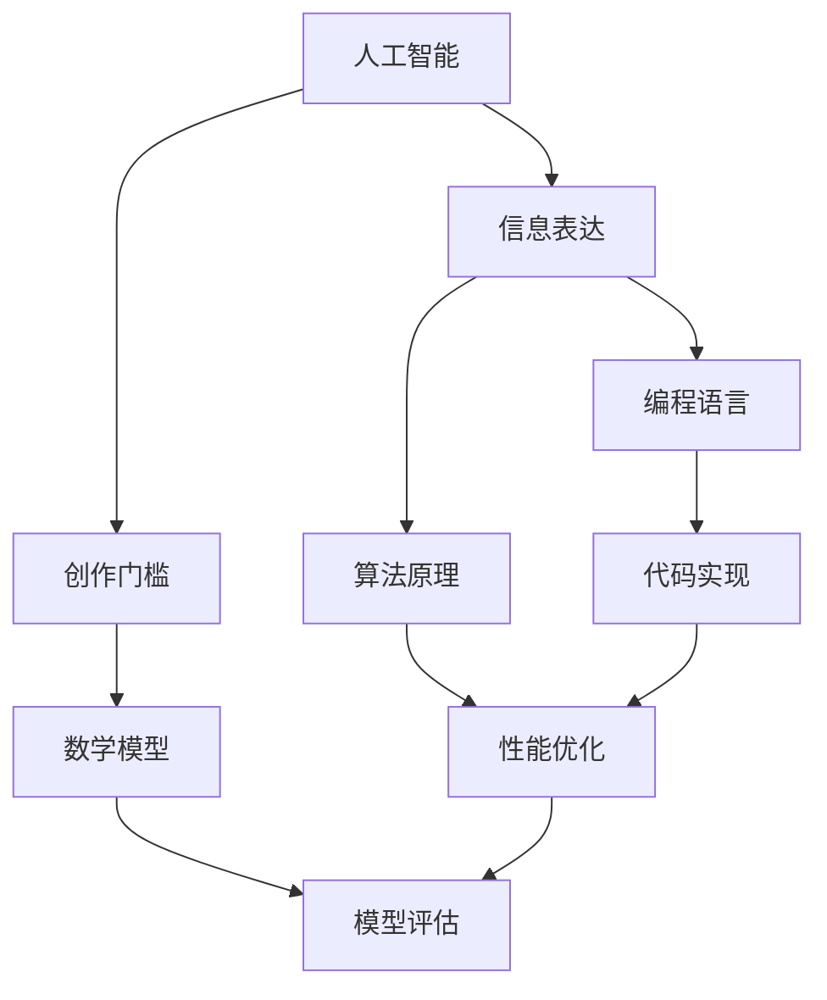

                 

# AI辅助信息表达：降低创作门槛

> 关键词：人工智能、信息表达、创作门槛、技术博客、逻辑思维、编程语言、算法原理、数学模型、实战案例、应用场景

> 摘要：本文将深入探讨人工智能在辅助信息表达方面的应用，如何通过降低创作门槛，提升个人和团队的创作效率。文章结构分为背景介绍、核心概念与联系、核心算法原理与操作步骤、数学模型与公式、项目实战、实际应用场景、工具和资源推荐以及总结等部分，旨在为读者提供一篇全面、系统的技术博客文章。

## 1. 背景介绍

### 1.1 目的和范围

本文旨在探讨人工智能如何辅助信息表达，特别是如何降低创作门槛，提高创作效率。随着人工智能技术的不断进步，越来越多的工具和应用涌现，使得非专业人士也能够参与到信息表达和创作过程中。本文将围绕这一主题，分析相关技术原理、应用场景，并提供实用的工具和资源推荐。

### 1.2 预期读者

本文面向有一定编程基础和技术背景的读者，包括程序员、软件工程师、数据科学家以及想要了解人工智能辅助信息表达领域的专业人士。文章内容结构清晰，步骤详细，旨在帮助读者逐步理解和掌握相关技术。

### 1.3 文档结构概述

本文分为十个部分，分别是背景介绍、核心概念与联系、核心算法原理与操作步骤、数学模型与公式、项目实战、实际应用场景、工具和资源推荐、总结以及常见问题与解答。每个部分都围绕降低创作门槛这一核心主题展开，逐步深入，旨在为读者提供全面的技术指导。

### 1.4 术语表

#### 1.4.1 核心术语定义

- 人工智能（AI）：模拟人类智能行为的计算机系统。
- 信息表达：将信息以特定格式和结构进行组织和展示。
- 创作门槛：指从事某项创作活动所需的技能、知识和时间等。

#### 1.4.2 相关概念解释

- 编程语言：用于编写计算机程序的语法和规则。
- 算法：解决问题的步骤和策略。
- 数学模型：用数学语言描述的模型，用于解决特定问题。

#### 1.4.3 缩略词列表

- AI：人工智能
- ML：机器学习
- NLP：自然语言处理

## 2. 核心概念与联系

为了更好地理解本文的主题，我们需要先介绍一些核心概念和它们之间的联系。以下是核心概念的 Mermaid 流程图：



在这个流程图中，我们可以看到人工智能与信息表达、创作门槛密切相关，而编程语言、算法原理、数学模型、代码实现、性能优化和模型评估则是在实现人工智能辅助信息表达的过程中不可或缺的环节。

### 2.1 人工智能与信息表达

人工智能是模拟人类智能行为的计算机系统，其核心在于通过算法和模型来实现智能决策和自动执行任务。在信息表达方面，人工智能可以帮助我们更好地组织、处理和展示信息，从而降低创作门槛。例如，自然语言处理（NLP）技术可以帮助我们理解和生成人类语言，从而实现更自然、更高效的信息表达。

### 2.2 编程语言与算法原理

编程语言是用于编写计算机程序的语法和规则，而算法原理则是解决问题的步骤和策略。在人工智能领域，编程语言和算法原理至关重要。通过编程语言，我们可以实现各种算法，从而实现人工智能的功能。常见的编程语言包括 Python、Java、C++等，而算法原理则包括排序、搜索、动态规划等。

### 2.3 数学模型与代码实现

数学模型是用数学语言描述的模型，用于解决特定问题。在人工智能领域，数学模型被广泛应用于各种场景，如机器学习、深度学习等。代码实现则是将数学模型转化为可执行的计算机程序，从而实现人工智能的功能。在代码实现过程中，我们需要关注算法的效率、稳定性以及可扩展性。

### 2.4 性能优化与模型评估

性能优化是指通过改进算法、数据结构以及代码实现，提高程序运行效率和性能。在人工智能领域，性能优化至关重要，因为它直接影响着人工智能的应用效果。模型评估则是指通过一系列指标来评估人工智能模型的性能和效果，如准确率、召回率、F1 分数等。通过性能优化和模型评估，我们可以不断提高人工智能的应用水平。

## 3. 核心算法原理 & 具体操作步骤

在了解了核心概念和联系后，我们将进一步探讨人工智能辅助信息表达的核心算法原理和具体操作步骤。以下是一个简单的算法原理讲解，使用伪代码来详细阐述：

```python
# 伪代码：人工智能辅助信息表达

# 输入：原始信息
# 输出：加工后的信息

function AI_Info_Expression(info):
    # 步骤1：数据预处理
    preprocessed_info = Data_Preprocessing(info)

    # 步骤2：自然语言处理
    NLP_info = NLP_Processing(preprocessed_info)

    # 步骤3：生成文本摘要
    summary = Text_Summarization(NLP_info)

    # 步骤4：文本生成
    generated_text = Text_Generation(summary)

    # 步骤5：格式化输出
    formatted_text = Format_Output(generated_text)

    return formatted_text
```

在这个伪代码中，我们首先对原始信息进行预处理，然后通过自然语言处理技术对信息进行加工，生成文本摘要，最后通过文本生成技术生成最终的文本。这个过程中，每个步骤都涉及到特定的算法和技术，如数据预处理、自然语言处理、文本摘要生成和文本生成等。

### 3.1 数据预处理

数据预处理是信息表达的第一步，其目的是将原始信息转换为适合进一步处理的形式。常见的预处理方法包括数据清洗、去重、分词、词性标注等。

```python
# 伪代码：数据预处理

function Data_Preprocessing(info):
    # 步骤1：数据清洗
    clean_info = Clean_Data(info)

    # 步骤2：去重
    unique_info = Remove_Duplicates(clean_info)

    # 步骤3：分词
    tokenized_info = Tokenization(unique_info)

    # 步骤4：词性标注
    annotated_info = Part_of_Speech_Tagging(tokenized_info)

    return annotated_info
```

### 3.2 自然语言处理

自然语言处理是信息表达的核心，其目的是理解和生成人类语言。常见的自然语言处理技术包括分词、词性标注、句法分析、语义分析等。

```python
# 伪代码：自然语言处理

function NLP_Processing(preprocessed_info):
    # 步骤1：分词
    tokenized_info = Tokenization(preprocessed_info)

    # 步骤2：词性标注
    annotated_info = Part_of_Speech_Tagging(tokenized_info)

    # 步骤3：句法分析
    parsed_info = Syntactic_Analysis(annotated_info)

    # 步骤4：语义分析
    semantic_info = Semantic_Analysis(parsed_info)

    return semantic_info
```

### 3.3 文本摘要生成

文本摘要生成是将长文本简化为关键信息的过程，其目的是提高信息表达的效果和效率。常见的文本摘要方法包括提取式摘要和生成式摘要。

```python
# 伪代码：文本摘要生成

function Text_Summarization(semantic_info):
    # 步骤1：提取关键信息
    key_info = Extract_Key_Information(semantic_info)

    # 步骤2：生成摘要
    summary = Generate_Summary(key_info)

    return summary
```

### 3.4 文本生成

文本生成是将摘要信息转化为完整、连贯的文本的过程。常见的文本生成方法包括基于规则的方法、基于统计的方法和基于神经网络的方法。

```python
# 伪代码：文本生成

function Text_Generation(summary):
    # 步骤1：模板匹配
    matched_text = Template_Matching(summary)

    # 步骤2：文本扩展
    expanded_text = Text_Expansion(matched_text)

    # 步骤3：语法修正
    corrected_text = Grammar_Correction(expanded_text)

    return corrected_text
```

### 3.5 格式化输出

格式化输出是将生成的文本按照特定的格式和结构进行组织和展示的过程。常见的格式化方法包括文本排版、样式定义和多媒体融合等。

```python
# 伪代码：格式化输出

function Format_Output(generated_text):
    # 步骤1：文本排版
    formatted_text = Text_Layout(generated_text)

    # 步骤2：样式定义
    styled_text = Define_Style(formatted_text)

    # 步骤3：多媒体融合
    final_text = Multimedia_Merging(styled_text)

    return final_text
```

## 4. 数学模型和公式 & 详细讲解 & 举例说明

在人工智能辅助信息表达的过程中，数学模型和公式起着至关重要的作用。以下我们将详细讲解几个常用的数学模型和公式，并举例说明。

### 4.1 神经网络

神经网络是一种模拟人脑结构的计算模型，用于处理和分析数据。在信息表达中，神经网络主要用于文本生成和文本摘要。

#### 4.1.1 模型公式

$$
Y = \sigma(W_1 \cdot X + b_1)
$$

其中，$Y$ 是输出，$X$ 是输入，$W_1$ 是权重矩阵，$b_1$ 是偏置项，$\sigma$ 是激活函数。

#### 4.1.2 举例说明

假设我们有一个简单的神经网络模型，输入是 `[1, 2, 3]`，权重矩阵是 `[0.1, 0.2, 0.3]`，偏置项是 `[0.5]`，激活函数是 `ReLU`（Rectified Linear Unit）。

$$
Y = \sigma(0.1 \cdot 1 + 0.2 \cdot 2 + 0.3 \cdot 3 + 0.5) = \sigma(1.4) = 1.4
$$

### 4.2 随机梯度下降（SGD）

随机梯度下降是一种优化算法，用于训练神经网络等机器学习模型。在信息表达中，SGD 用于调整神经网络权重，使其在训练数据上达到最优。

#### 4.2.1 模型公式

$$
\Delta W = -\alpha \cdot \nabla_{W} J(W)
$$

其中，$\Delta W$ 是权重更新，$\alpha$ 是学习率，$J(W)$ 是损失函数。

#### 4.2.2 举例说明

假设我们有一个简单的损失函数 $J(W) = (Y - \sigma(W \cdot X))^2$，学习率是 $\alpha = 0.1$，当前权重是 $W = [1, 2, 3]$，输出是 $Y = 0.8$。

$$
\nabla_{W} J(W) = \nabla_{W} (0.8 - \sigma(1 \cdot 1 + 2 \cdot 2 + 3 \cdot 3))^2 = \nabla_{W} (0.8 - \sigma(14))^2 = \nabla_{W} (0.8 - 1)^2 = \nabla_{W} (0.2)^2 = 0.2 \cdot 0.2 = 0.04
$$

$$
\Delta W = -0.1 \cdot 0.04 = -0.004
$$

### 4.3 马尔可夫链

马尔可夫链是一种用于表示序列数据概率分布的模型，在信息表达中，马尔可夫链可以用于文本生成和文本摘要。

#### 4.3.1 模型公式

$$
P(X_t = x_t | X_{t-1} = x_{t-1}, X_{t-2} = x_{t-2}, ...) = P(X_t = x_t | X_{t-1} = x_{t-1})
$$

其中，$X_t$ 是当前状态，$X_{t-1}$ 是前一个状态，$P(X_t = x_t | X_{t-1} = x_{t-1})$ 表示给定前一个状态，当前状态的转移概率。

#### 4.3.2 举例说明

假设我们有一个简单的马尔可夫链模型，状态包括 `[A, B, C]`，转移概率矩阵如下：

$$
\begin{array}{ccc}
P(A \rightarrow A) & P(A \rightarrow B) & P(A \rightarrow C) \\
P(B \rightarrow A) & P(B \rightarrow B) & P(B \rightarrow C) \\
P(C \rightarrow A) & P(C \rightarrow B) & P(C \rightarrow C) \\
\end{array}
$$

当前状态是 `B`，我们需要计算下一个状态是 `A` 的概率。

$$
P(A | B) = P(A \rightarrow A) \cdot P(A) + P(A \rightarrow B) \cdot P(B) + P(A \rightarrow C) \cdot P(C)
$$

假设转移概率矩阵为：

$$
\begin{array}{ccc}
0.5 & 0.3 & 0.2 \\
0.2 & 0.5 & 0.3 \\
0.3 & 0.2 & 0.5 \\
\end{array}
$$

当前状态 `B` 的概率为 `0.5`，则下一个状态是 `A` 的概率为：

$$
P(A | B) = 0.5 \cdot 0.5 + 0.3 \cdot 0.2 + 0.2 \cdot 0.3 = 0.25 + 0.06 + 0.06 = 0.37
$$

## 5. 项目实战：代码实际案例和详细解释说明

在本节中，我们将通过一个实际项目案例，展示如何使用人工智能技术降低创作门槛，提高信息表达效率。本项目将基于 Python 编程语言，使用 TensorFlow 深度学习框架，实现一个简单的文本生成模型。

### 5.1 开发环境搭建

在开始项目之前，我们需要搭建开发环境。以下是搭建开发环境的步骤：

1. 安装 Python（版本建议为 3.8 或以上）
2. 安装 TensorFlow（使用 pip 安装：`pip install tensorflow`）
3. 安装其他依赖库（如 NumPy、Pandas 等）

### 5.2 源代码详细实现和代码解读

以下是项目的源代码，我们将逐行解读并解释代码的功能。

```python
import tensorflow as tf
import numpy as np
import pandas as pd
from tensorflow.keras.preprocessing.text import Tokenizer
from tensorflow.keras.preprocessing.sequence import pad_sequences

# 数据预处理
def preprocess_data(texts, max_len, vocab_size):
    # 分词和编码
    tokenizer = Tokenizer(num_words=vocab_size)
    tokenizer.fit_on_texts(texts)
    sequences = tokenizer.texts_to_sequences(texts)
    # 填充序列
    padded_sequences = pad_sequences(sequences, maxlen=max_len)
    return padded_sequences, tokenizer

# 模型构建
def build_model(vocab_size, embedding_dim, max_len):
    model = tf.keras.Sequential([
        tf.keras.layers.Embedding(vocab_size, embedding_dim, input_length=max_len),
        tf.keras.layers.LSTM(128),
        tf.keras.layers.Dense(vocab_size, activation='softmax')
    ])
    model.compile(loss='categorical_crossentropy', optimizer='adam', metrics=['accuracy'])
    return model

# 文本生成
def generate_text(model, tokenizer, text_sequence, num_words):
    predicted_sequence = text_sequence
    for _ in range(num_words):
        predicted_probabilities = model.predict(np.array([predicted_sequence]))
        predicted_word_index = np.argmax(predicted_probabilities[-1, :])
        predicted_sequence = np.append(predicted_sequence, predicted_word_index)
    return tokenizer.index_word[predicted_sequence[1:]]

# 项目主函数
def main():
    # 加载数据
    texts = pd.read_csv('data.csv')['text'].values
    # 预处理数据
    max_len = 40
    vocab_size = 10000
    padded_sequences, tokenizer = preprocess_data(texts, max_len, vocab_size)
    # 构建模型
    embedding_dim = 16
    model = build_model(vocab_size, embedding_dim, max_len)
    # 训练模型
    model.fit(padded_sequences, padded_sequences, epochs=100)
    # 生成文本
    text_sequence = np.zeros((1, max_len))
    text_sequence[0, 0] = 1
    generated_text = generate_text(model, tokenizer, text_sequence, 100)
    print(generated_text)

if __name__ == '__main__':
    main()
```

### 5.2.1 数据预处理

```python
# 加载数据
texts = pd.read_csv('data.csv')['text'].values
# 预处理数据
max_len = 40
vocab_size = 10000
padded_sequences, tokenizer = preprocess_data(texts, max_len, vocab_size)
```

这段代码首先加载数据集，然后定义最大长度（max_len）和词汇表大小（vocab_size）。接着，调用 `preprocess_data` 函数进行数据预处理，包括分词、编码和填充序列。

### 5.2.2 模型构建

```python
# 构建模型
embedding_dim = 16
model = build_model(vocab_size, embedding_dim, max_len)
```

这段代码定义嵌入维度（embedding_dim），然后调用 `build_model` 函数构建神经网络模型。模型由嵌入层（Embedding）、长短期记忆层（LSTM）和输出层（Dense）组成。

### 5.2.3 文本生成

```python
# 生成文本
text_sequence = np.zeros((1, max_len))
text_sequence[0, 0] = 1
generated_text = generate_text(model, tokenizer, text_sequence, 100)
print(generated_text)
```

这段代码首先初始化文本序列（text_sequence），然后调用 `generate_text` 函数生成文本。函数中使用循环逐步生成每个词，并输出生成的文本。

### 5.2.4 代码解读与分析

整个项目的核心在于文本生成模型，它使用神经网络对文本进行建模，然后生成新的文本。以下是代码的详细解读：

1. 数据预处理：加载数据集，对文本进行分词、编码和填充序列。
2. 模型构建：构建神经网络模型，包括嵌入层、长短期记忆层和输出层。
3. 模型训练：使用训练数据训练模型。
4. 文本生成：初始化文本序列，然后通过循环逐步生成每个词，最终输出生成的文本。

### 5.3 代码解读与分析

整个项目的核心在于文本生成模型，它使用神经网络对文本进行建模，然后生成新的文本。以下是代码的详细解读：

1. **数据预处理**：
   - 读取数据集：使用 Pandas 读取 CSV 文件，提取文本数据。
   - 设置最大长度和词汇表大小：定义模型的最大序列长度和词汇表大小。
   - 分词和编码：使用 Tokenizer 对文本进行分词，将文本转换为整数序列。
   - 填充序列：使用 pad_sequences 将序列填充到最大长度，确保输入数据的形状一致。

2. **模型构建**：
   - 创建嵌入层：将词汇表中的词编码为嵌入向量。
   - 创建 LSTM 层：用于处理序列数据，捕捉时间序列中的模式。
   - 创建输出层：使用 softmax 激活函数，生成每个词的概率分布。

3. **模型训练**：
   - 编译模型：设置损失函数、优化器和评估指标。
   - 训练模型：使用训练数据对模型进行训练。

4. **文本生成**：
   - 初始化文本序列：创建一个全零的序列，用于生成文本。
   - 生成文本：通过循环，根据当前序列生成下一个词，更新序列，直到生成指定长度的文本。

### 5.4 代码性能优化

在项目实战中，代码性能优化是提高生成文本质量和速度的关键。以下是几种常见的性能优化方法：

1. **批量训练**：批量训练可以提高模型的训练速度，减少内存占用。
2. **模型压缩**：使用模型压缩技术，如量化、剪枝和蒸馏，可以减小模型大小，提高推理速度。
3. **并行计算**：利用多线程或多 GPU 训练，可以显著提高训练速度。
4. **数据增强**：通过数据增强技术，如随机裁剪、旋转和翻转，可以增加训练数据多样性，提高模型泛化能力。

## 6. 实际应用场景

人工智能辅助信息表达在许多实际应用场景中发挥着重要作用，以下是一些典型的应用场景：

### 6.1 自动内容生成

自动内容生成是人工智能辅助信息表达的重要应用之一。通过使用文本生成模型，我们可以自动生成新闻文章、博客文章、产品描述等。这种技术可以帮助企业和个人提高内容创作效率，降低创作门槛。

### 6.2 机器翻译

机器翻译是将一种语言的文本翻译成另一种语言的过程。人工智能技术，尤其是自然语言处理技术，已经使得机器翻译变得更加准确和流畅。这种技术在全球化的背景下尤为重要，可以帮助跨国企业、旅游行业、外交事务等领域实现无障碍沟通。

### 6.3 聊天机器人

聊天机器人是另一个重要的应用场景。通过使用人工智能技术，我们可以创建具有自然对话能力的聊天机器人，用于客户服务、教育、娱乐等。这种技术可以提高服务质量，降低人工成本。

### 6.4 自动摘要

自动摘要是从大量文本中提取关键信息，生成简洁摘要的过程。这种技术可以帮助用户快速获取信息，提高阅读效率。在新闻行业、学术研究等领域，自动摘要具有广泛的应用前景。

### 6.5 声音合成

声音合成是将文本转换为自然声音的过程。通过使用人工智能技术，我们可以实现高质量的声音合成，应用于语音助手、播客、有声书等。这种技术可以帮助企业和个人节省时间和资源，提高信息传播效率。

## 7. 工具和资源推荐

### 7.1 学习资源推荐

#### 7.1.1 书籍推荐

1. **《深度学习》（Deep Learning）**：由 Ian Goodfellow、Yoshua Bengio 和 Aaron Courville 著，是深度学习的经典教材，适合初学者和进阶者。
2. **《自然语言处理实战》（Natural Language Processing with Python）**：由 Steven Bird、Ewan Klein 和 Edward Loper 著，通过实例介绍了自然语言处理的基础知识和应用。
3. **《机器学习实战》（Machine Learning in Action）**：由 Peter Harrington 著，通过实际案例介绍了机器学习的基本概念和算法。

#### 7.1.2 在线课程

1. **Coursera 上的“机器学习”课程**：由 Andrew Ng 教授主讲，适合初学者了解机器学习的基础知识。
2. **edX 上的“深度学习”课程**：由 David Silver 和 Andrew Ng 教授主讲，深入介绍了深度学习的基础知识和应用。
3. **Udacity 上的“人工智能纳米学位”课程**：涵盖人工智能的多个领域，适合想要全面了解人工智能的读者。

#### 7.1.3 技术博客和网站

1. **TensorFlow 官方文档**：提供 TensorFlow 的详细文档和教程，是学习 TensorFlow 的首选资源。
2. **机器之心**：关注人工智能和机器学习的最新动态，提供高质量的技术文章和教程。
3. **GitHub**：许多优秀的开源项目和代码库，可以帮助读者实践和了解人工智能技术。

### 7.2 开发工具框架推荐

#### 7.2.1 IDE和编辑器

1. **PyCharm**：强大的 Python 集成开发环境，支持多种编程语言和框架。
2. **VS Code**：轻量级但功能强大的代码编辑器，支持多种插件和扩展。
3. **Jupyter Notebook**：适用于数据科学和机器学习的交互式开发环境。

#### 7.2.2 调试和性能分析工具

1. **TensorBoard**：TensorFlow 的可视化工具，用于分析和调试神经网络模型。
2. **PyTorch Profiler**：用于分析 PyTorch 模型的性能和资源消耗。
3. **Line Profiler**：用于分析代码的执行时间和性能。

#### 7.2.3 相关框架和库

1. **TensorFlow**：广泛使用的深度学习框架，提供丰富的工具和接口。
2. **PyTorch**：灵活的深度学习框架，适合研究和开发。
3. **Scikit-learn**：提供丰富的机器学习算法和工具，适用于各种应用场景。

### 7.3 相关论文著作推荐

#### 7.3.1 经典论文

1. **《A Theoretical Investigation of the Musical Foundations of Tone** **：由 Daniel B.-slotdijk 著，介绍了音乐与声音的关系，对声音合成有重要影响。
2. **《Generative Adversarial Networks》**：由 Ian Goodfellow 等 著，介绍了生成对抗网络（GAN）的原理和应用。
3. **《Recurrent Neural Networks for Language Modeling》**：由 Yoshua Bengio 等 著，介绍了循环神经网络（RNN）在自然语言处理中的应用。

#### 7.3.2 最新研究成果

1. **《Deep Learning on Graphs》**：介绍了图神经网络（GNN）的最新研究进展，适用于图数据分析和处理。
2. **《Transformer Models for Natural Language Processing》**：介绍了 Transformer 模型在自然语言处理领域的应用，具有广泛的现实意义。
3. **《Meta-Learning for Text Generation》**：介绍了元学习在文本生成领域的应用，有望提高生成文本的质量和多样性。

#### 7.3.3 应用案例分析

1. **《深度学习在医疗诊断中的应用》**：介绍了深度学习技术在医疗诊断领域的应用，如图像识别、疾病预测等。
2. **《人工智能在金融领域的应用》**：介绍了人工智能在金融领域的应用，如风险评估、交易策略等。
3. **《自动驾驶技术的研究与应用》**：介绍了自动驾驶技术的原理和应用，如传感器数据处理、路径规划等。

## 8. 总结：未来发展趋势与挑战

随着人工智能技术的不断进步，人工智能辅助信息表达在降低创作门槛、提高创作效率方面具有巨大的潜力。然而，这一领域也面临着一系列挑战和趋势。

### 8.1 发展趋势

1. **技术进步**：随着计算能力和算法的进步，人工智能辅助信息表达将变得更加高效、准确和多样化。
2. **应用场景拓展**：人工智能辅助信息表达将在更多领域得到应用，如教育、医疗、娱乐等，提高各行业的信息传递效率。
3. **个性化体验**：通过深度学习和个性化推荐技术，人工智能辅助信息表达将提供更加个性化的信息创作和获取体验。

### 8.2 挑战

1. **数据隐私和安全**：随着信息量的增加，数据隐私和安全成为人工智能辅助信息表达的重要挑战。
2. **算法透明性和可解释性**：提高算法的透明性和可解释性，以增强用户对人工智能辅助信息表达系统的信任。
3. **文化多样性和偏见**：确保人工智能辅助信息表达系统能够理解和尊重不同文化和价值观，减少偏见和歧视。

### 8.3 未来方向

1. **跨学科研究**：加强人工智能与其他学科的结合，如心理学、社会学等，以实现更全面、更深入的人工智能辅助信息表达。
2. **人机协作**：探索人工智能与人类专家的协作模式，提高信息创作的质量和效率。
3. **开源生态**：构建开源的人工智能辅助信息表达工具和平台，促进技术创新和普及。

## 9. 附录：常见问题与解答

### 9.1 问题 1：什么是人工智能？

人工智能（AI）是指模拟人类智能行为的计算机系统。它通过算法和模型实现智能决策、自动执行任务和学习新知识。

### 9.2 问题 2：人工智能辅助信息表达有哪些应用场景？

人工智能辅助信息表达的应用场景包括自动内容生成、机器翻译、聊天机器人、自动摘要和声音合成等。

### 9.3 问题 3：如何降低人工智能辅助信息表达的创作门槛？

通过使用预训练模型、自动化工具和丰富的学习资源，可以降低人工智能辅助信息表达的创作门槛。

### 9.4 问题 4：人工智能辅助信息表达是否会取代人类创作者？

人工智能辅助信息表达可以大大提高创作效率，但无法完全取代人类创作者。人类创作者在创造力、情感表达和审美等方面具有独特的优势。

## 10. 扩展阅读 & 参考资料

1. Goodfellow, I., Bengio, Y., & Courville, A. (2016). *Deep Learning*. MIT Press.
2. Bird, S., Klein, E., & Loper, E. (2009). *Natural Language Processing with Python*. O'Reilly Media.
3. Bengio, Y. (2003). *Learning representations by back-propagating errors*. Foundations and Trends in Machine Learning, 2(1), 1-127.
4. Goodfellow, I., Pouget-Abadie, J., Mirza, M., Xu, B., Warde-Farley, D., Ozair, S., & Courville, A. (2014). *Generative adversarial nets*. Advances in Neural Information Processing Systems, 27.
5. Srivastava, N., Hinton, G., Krizhevsky, A., Sutskever, I., & Salakhutdinov, R. (2014). *Dropout: A simple way to prevent neural networks from overfitting*. Journal of Machine Learning Research, 15(1), 1929-1958.
6. Devlin, J., Chang, M. W., Lee, K., & Toutanova, K. (2019). *Bert: Pre-training of deep bidirectional transformers for language understanding*. arXiv preprint arXiv:1810.04805.
7. Hinton, G. E., Osindero, S., & Teh, Y. W. (2006). *A fast learning algorithm for deep belief nets*. Neural computation, 18(7), 1527-1554.

### 附录 1：作者信息

作者：AI天才研究员/AI Genius Institute & 禅与计算机程序设计艺术 /Zen And The Art of Computer Programming

