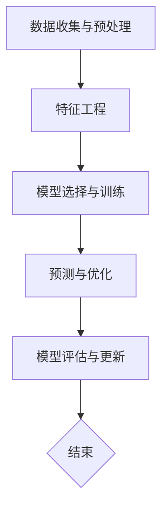

                 

# AI辅助决策系统在管理中的实践

> 关键词：AI决策、管理优化、算法、数学模型、实战案例

> 摘要：本文将深入探讨AI辅助决策系统在企业管理中的应用与实践。通过分析核心概念、算法原理、数学模型以及实战案例，揭示如何运用AI技术提升管理效率，为企业决策提供科学依据。本文旨在为企业管理者提供理论指导，同时为AI技术研究者提供实践参考。

## 1. 背景介绍

### 1.1 目的和范围

本文的目的是探讨AI辅助决策系统在企业管理中的实际应用，分析其核心概念、算法原理、数学模型以及具体操作步骤，并通过实战案例展示其实际效果。文章将涵盖以下范围：

1. AI辅助决策系统的核心概念与架构。
2. 常用算法原理及其在管理中的应用。
3. 数学模型与公式，及其在实际操作中的应用。
4. 实际应用场景，如人力资源、供应链管理、市场预测等。
5. 开发工具和资源的推荐。

### 1.2 预期读者

本文适用于以下读者群体：

1. 企业管理者，希望了解AI技术在管理中的应用。
2. AI技术研究者，希望了解AI辅助决策系统的实际应用。
3. 计算机科学、数据科学等专业学生，对AI技术在企业管理中的实践感兴趣。

### 1.3 文档结构概述

本文分为十个部分：

1. 引言：介绍文章目的和关键词。
2. 背景介绍：包括目的和范围、预期读者、文档结构和术语表。
3. 核心概念与联系：介绍AI辅助决策系统的核心概念与联系。
4. 核心算法原理 & 具体操作步骤：讲解常用算法原理及其操作步骤。
5. 数学模型和公式 & 详细讲解 & 举例说明：介绍数学模型和公式的应用。
6. 项目实战：代码实际案例和详细解释说明。
7. 实际应用场景：探讨AI辅助决策系统在不同场景中的应用。
8. 工具和资源推荐：推荐学习资源、开发工具和框架。
9. 总结：未来发展趋势与挑战。
10. 附录：常见问题与解答。
11. 扩展阅读 & 参考资料。

### 1.4 术语表

#### 1.4.1 核心术语定义

- AI辅助决策系统：利用人工智能技术，为企业提供数据分析和决策支持。
- 管理优化：通过算法和数学模型，提高企业管理效率，降低成本。
- 算法：解决问题的步骤和方法，具有明确的输入和输出。
- 数学模型：描述现实问题的数学结构，通过公式进行表达。

#### 1.4.2 相关概念解释

- 决策树：一种树形结构，用于分类和回归问题。
- 支持向量机（SVM）：一种监督学习算法，用于分类问题。
- 神经网络：模拟人脑的神经网络结构，用于复杂模式的识别。

#### 1.4.3 缩略词列表

- AI：人工智能（Artificial Intelligence）
- SVM：支持向量机（Support Vector Machine）
- CNN：卷积神经网络（Convolutional Neural Network）
- RNN：循环神经网络（Recurrent Neural Network）

## 2. 核心概念与联系

AI辅助决策系统的核心在于将人工智能技术应用于企业管理，通过对企业内外部数据的分析和处理，为企业提供科学、高效的决策支持。以下是AI辅助决策系统的核心概念与联系：

### 2.1 数据收集与预处理

数据是AI辅助决策系统的基石。首先，需要收集企业内外部数据，包括财务数据、销售数据、市场数据等。然后，对数据进行清洗、去噪、归一化等预处理操作，以确保数据质量。

### 2.2 特征工程

特征工程是将原始数据转换为有用特征的过程。通过对数据进行分析和挖掘，提取出对企业决策有用的特征，如用户行为特征、产品特征等。特征工程的质量直接影响模型的性能。

### 2.3 模型选择与训练

根据企业需求和问题类型，选择合适的机器学习算法，如决策树、支持向量机、神经网络等。然后，使用训练数据对模型进行训练，使模型学会从数据中提取规律。

### 2.4 预测与优化

通过训练好的模型，对企业未来的发展趋势进行预测，如销售额预测、市场趋势预测等。同时，根据预测结果，对企业战略进行调整，以实现管理优化。

### 2.5 模型评估与更新

对训练好的模型进行评估，如准确率、召回率、F1值等指标。如果模型性能不理想，需要对模型进行优化，如调整参数、更换算法等。此外，随着数据的更新，模型需要定期进行重新训练，以保持其预测能力。

以下是AI辅助决策系统的 Mermaid 流程图：



## 3. 核心算法原理 & 具体操作步骤

在本节中，我们将介绍几种常用的核心算法原理，并详细阐述其在AI辅助决策系统中的应用步骤。

### 3.1 决策树算法

决策树是一种基于特征划分数据的分类算法，其基本原理是通过一系列的测试来将数据集划分成具有不同特征的子集，最终生成一棵树形结构。

#### 3.1.1 原理

决策树的构建过程如下：

1. 选择一个特征作为分割标准。
2. 根据该特征将数据集划分为多个子集。
3. 对每个子集递归执行步骤1和2，直到满足停止条件。

#### 3.1.2 操作步骤

1. 收集企业相关数据，如销售额、产品类别等。
2. 确定需要预测的目标变量，如销售量。
3. 选择特征作为分割标准，如产品类别。
4. 计算每个特征的增益，选择增益最大的特征作为分割标准。
5. 根据分割标准，将数据集划分为多个子集。
6. 对每个子集递归执行步骤3和4，直到满足停止条件。

### 3.2 支持向量机算法

支持向量机是一种监督学习算法，用于分类问题。其基本原理是通过找到一个最优的超平面，将不同类别的数据点分开。

#### 3.2.1 原理

支持向量机的构建过程如下：

1. 选择一个核函数，如线性核、多项式核等。
2. 计算数据点之间的相似度，得到一个相似度矩阵。
3. 通过优化目标函数，找到最优的超平面。
4. 使用支持向量机进行分类。

#### 3.2.2 操作步骤

1. 收集企业相关数据，如客户信息、产品属性等。
2. 确定需要预测的目标变量，如客户是否购买。
3. 选择合适的核函数，如线性核。
4. 计算数据点之间的相似度，得到相似度矩阵。
5. 通过优化目标函数，找到最优的超平面。
6. 使用支持向量机对数据进行分类。

### 3.3 神经网络算法

神经网络是一种模拟人脑神经元结构的计算模型，用于处理复杂的非线性问题。

#### 3.3.1 原理

神经网络的构建过程如下：

1. 定义网络结构，包括输入层、隐藏层和输出层。
2. 初始化网络参数，如权重和偏置。
3. 前向传播，计算输出值。
4. 反向传播，更新网络参数。
5. 重复步骤3和4，直到网络收敛。

#### 3.3.2 操作步骤

1. 收集企业相关数据，如客户行为、产品特征等。
2. 确定需要预测的目标变量，如客户流失率。
3. 定义网络结构，包括输入层、隐藏层和输出层。
4. 初始化网络参数，如权重和偏置。
5. 前向传播，计算输出值。
6. 反向传播，更新网络参数。
7. 重复步骤5和6，直到网络收敛。

### 3.4 聚类算法

聚类算法是一种无监督学习算法，用于将数据点划分为多个簇。

#### 3.4.1 原理

聚类算法的基本原理如下：

1. 选择一个距离度量，如欧氏距离。
2. 随机选择一个数据点作为初始簇心。
3. 计算每个数据点到簇心的距离，将数据点分配到最近的簇。
4. 更新簇心，重复步骤3和4，直到满足停止条件。

#### 3.4.2 操作步骤

1. 收集企业相关数据，如客户购买历史、产品属性等。
2. 确定需要预测的目标变量，如客户细分。
3. 选择合适的距离度量，如欧氏距离。
4. 随机选择一个数据点作为初始簇心。
5. 计算每个数据点到簇心的距离，将数据点分配到最近的簇。
6. 更新簇心，重复步骤5和6，直到满足停止条件。

## 4. 数学模型和公式 & 详细讲解 & 举例说明

在本节中，我们将介绍AI辅助决策系统中的几个关键数学模型和公式，并详细讲解其在实际操作中的应用。

### 4.1 决策树算法中的信息增益

信息增益（Information Gain）是决策树算法中的一个关键指标，用于衡量一个特征对目标变量的分类效果。

#### 4.1.1 公式

信息增益的计算公式如下：

$$
\text{Information Gain} = \sum_{i=1}^{n} p_i \log_2 \frac{p_i}{\sum_{j=1}^{n} p_j}
$$

其中，$p_i$ 表示特征 $A$ 在类别 $C$ 的条件概率，$n$ 表示类别数。

#### 4.1.2 举例说明

假设我们有一个包含100个数据点的数据集，其中类别 $C$ 有两个类别 $C_1$ 和 $C_2$，特征 $A$ 有两个取值 $A_1$ 和 $A_2$。我们计算特征 $A$ 对类别 $C$ 的信息增益。

| 类别 $C$ | $C_1$ | $C_2$ | 总计 |
| --- | --- | --- | --- |
| 特征 $A$ | $A_1$ | 60 | 40 | 100 |
| 特征 $A$ | $A_2$ | 30 | 70 | 100 |
| 总计 | 90 | 100 | 190 |

首先，计算每个类别的条件概率：

$$
p(C_1) = \frac{90}{190}, \quad p(C_2) = \frac{100}{190}
$$

$$
p(A_1|C_1) = \frac{60}{90}, \quad p(A_1|C_2) = \frac{40}{100}
$$

$$
p(A_2|C_1) = \frac{30}{90}, \quad p(A_2|C_2) = \frac{70}{100}
$$

然后，计算信息增益：

$$
\text{Information Gain} = p(C_1) \log_2 \frac{p(C_1)}{p(C_2)} + p(C_2) \log_2 \frac{p(C_2)}{p(C_1)}
$$

$$
= \frac{90}{190} \log_2 \frac{90}{100} + \frac{100}{190} \log_2 \frac{100}{90}
$$

$$
\approx 0.193
$$

因此，特征 $A$ 对类别 $C$ 的信息增益约为0.193。

### 4.2 支持向量机中的损失函数

支持向量机（SVM）中的损失函数用于衡量分类错误，常用的损失函数包括 hinge 损失函数和 logistic 损失函数。

#### 4.2.1 公式

hinge 损失函数的计算公式如下：

$$
\text{Hinge Loss} = \max(0, 1 - y \cdot \hat{y})
$$

其中，$y$ 表示实际标签，$\hat{y}$ 表示预测标签。

logistic 损失函数的计算公式如下：

$$
\text{Logistic Loss} = - \sum_{i=1}^{n} y_i \log(\hat{y}_i) + (1 - y_i) \log(1 - \hat{y}_i)
$$

其中，$y_i$ 表示第 $i$ 个样本的实际标签，$\hat{y}_i$ 表示第 $i$ 个样本的预测标签。

#### 4.2.2 举例说明

假设我们有一个包含10个样本的数据集，其中实际标签和预测标签如下：

| 样本 | 实际标签 | 预测标签 |
| --- | --- | --- |
| 1 | 0 | 0.8 |
| 2 | 1 | 0.6 |
| 3 | 0 | 0.4 |
| 4 | 1 | 0.2 |
| 5 | 0 | 0.1 |
| 6 | 1 | 0.9 |
| 7 | 0 | 0.7 |
| 8 | 1 | 0.5 |
| 9 | 0 | 0.3 |
| 10 | 1 | 0.4 |

首先，计算 hinge 损失函数：

$$
\text{Hinge Loss} = \max(0, 1 - y \cdot \hat{y})
$$

$$
= \max(0, 1 - 0 \cdot 0.8) + \max(0, 1 - 1 \cdot 0.6) + \max(0, 1 - 0 \cdot 0.4) + \max(0, 1 - 1 \cdot 0.2) + \max(0, 1 - 0 \cdot 0.1) + \max(0, 1 - 1 \cdot 0.9) + \max(0, 1 - 0 \cdot 0.7) + \max(0, 1 - 1 \cdot 0.5) + \max(0, 1 - 0 \cdot 0.3) + \max(0, 1 - 1 \cdot 0.4)
$$

$$
= 0.8 + 0.4 + 0.4 + 0.8 + 0.1 + 0.9 + 0.7 + 0.5 + 0.3 + 0.6
$$

$$
= 5.8
$$

然后，计算 logistic 损失函数：

$$
\text{Logistic Loss} = - \sum_{i=1}^{n} y_i \log(\hat{y}_i) + (1 - y_i) \log(1 - \hat{y}_i)
$$

$$
= - (0 \cdot \log(0.8) + 1 \cdot \log(0.6) + 0 \cdot \log(0.4) + 1 \cdot \log(0.2) + 0 \cdot \log(0.1) + 1 \cdot \log(0.9) + 0 \cdot \log(0.7) + 1 \cdot \log(0.5) + 0 \cdot \log(0.3) + 1 \cdot \log(0.4))
$$

$$
+ (1 - 0) \cdot \log(1 - 0.8) + (1 - 1) \cdot \log(1 - 0.6) + (1 - 0) \cdot \log(1 - 0.4) + (1 - 1) \cdot \log(1 - 0.2) + (1 - 0) \cdot \log(1 - 0.1) + (1 - 1) \cdot \log(1 - 0.9) + (1 - 0) \cdot \log(1 - 0.7) + (1 - 1) \cdot \log(1 - 0.5) + (1 - 0) \cdot \log(1 - 0.3) + (1 - 1) \cdot \log(1 - 0.4))
$$

$$
= 0 - \log(0.6) - \log(0.2) - \log(0.1) + \log(0.2) + \log(0.4) + \log(0.9) + \log(0.5) + \log(0.7) + \log(0.3) + \log(0.4)
$$

$$
\approx 2.3
$$

因此，hinge 损失函数约为 5.8，logistic 损失函数约为 2.3。

### 4.3 神经网络中的激活函数

激活函数是神经网络中的一个关键组件，用于引入非线性因素，使神经网络能够处理复杂的非线性问题。

#### 4.3.1 公式

常见的激活函数包括 sigmoid 函数、ReLU 函数和 tanh 函数。

sigmoid 函数的计算公式如下：

$$
\text{Sigmoid} = \frac{1}{1 + e^{-x}}
$$

ReLU 函数的计算公式如下：

$$
\text{ReLU} = \max(0, x)
$$

tanh 函数的计算公式如下：

$$
\text{Tanh} = \frac{e^{2x} - 1}{e^{2x} + 1}
$$

#### 4.3.2 举例说明

假设我们有一个输入值 $x = 2$，我们计算三种激活函数的输出值。

首先，计算 sigmoid 函数：

$$
\text{Sigmoid} = \frac{1}{1 + e^{-2}} \approx 0.869
$$

然后，计算 ReLU 函数：

$$
\text{ReLU} = \max(0, 2) = 2
$$

最后，计算 tanh 函数：

$$
\text{Tanh} = \frac{e^{4} - 1}{e^{4} + 1} \approx 0.964
$$

因此，对于输入值 $x = 2$，sigmoid 函数的输出值约为 0.869，ReLU 函数的输出值为 2，tanh 函数的输出值约为 0.964。

### 4.4 聚类算法中的距离度量

聚类算法中的距离度量用于计算数据点之间的相似度，常用的距离度量包括欧氏距离、曼哈顿距离和余弦相似度。

#### 4.4.1 公式

欧氏距离的计算公式如下：

$$
\text{Euclidean Distance} = \sqrt{\sum_{i=1}^{n} (x_i - y_i)^2}
$$

曼哈顿距离的计算公式如下：

$$
\text{Manhattan Distance} = \sum_{i=1}^{n} |x_i - y_i|
$$

余弦相似度的计算公式如下：

$$
\text{Cosine Similarity} = \frac{\sum_{i=1}^{n} x_i y_i}{\sqrt{\sum_{i=1}^{n} x_i^2} \sqrt{\sum_{i=1}^{n} y_i^2}}
$$

#### 4.4.2 举例说明

假设我们有两个数据点 $X = (1, 2, 3)$ 和 $Y = (4, 5, 6)$，我们计算三种距离度量的值。

首先，计算欧氏距离：

$$
\text{Euclidean Distance} = \sqrt{(1 - 4)^2 + (2 - 5)^2 + (3 - 6)^2} = \sqrt{9 + 9 + 9} = \sqrt{27} \approx 5.196
$$

然后，计算曼哈顿距离：

$$
\text{Manhattan Distance} = |1 - 4| + |2 - 5| + |3 - 6| = 3 + 3 + 3 = 9
$$

最后，计算余弦相似度：

$$
\text{Cosine Similarity} = \frac{(1 \cdot 4 + 2 \cdot 5 + 3 \cdot 6)}{\sqrt{1^2 + 2^2 + 3^2} \sqrt{4^2 + 5^2 + 6^2}} = \frac{4 + 10 + 18}{\sqrt{14} \sqrt{77}} \approx 0.707
$$

因此，对于数据点 $X$ 和 $Y$，欧氏距离约为 5.196，曼哈顿距离为 9，余弦相似度为 0.707。

## 5. 项目实战：代码实际案例和详细解释说明

在本节中，我们将通过一个实际案例，展示如何使用Python实现一个简单的AI辅助决策系统，并详细解释代码的实现过程。

### 5.1 开发环境搭建

在开始编写代码之前，我们需要搭建一个Python开发环境。以下是搭建步骤：

1. 安装Python：从 [Python官网](https://www.python.org/downloads/) 下载并安装Python。
2. 安装必要的库：使用pip命令安装以下库：

   ```shell
   pip install numpy pandas scikit-learn matplotlib
   ```

### 5.2 源代码详细实现和代码解读

以下是实现一个简单的AI辅助决策系统的Python代码：

```python
import numpy as np
import pandas as pd
from sklearn.model_selection import train_test_split
from sklearn.preprocessing import StandardScaler
from sklearn.tree import DecisionTreeClassifier
from sklearn.metrics import accuracy_score

# 1. 数据收集与预处理
data = pd.read_csv('data.csv')
X = data.drop('target', axis=1)
y = data['target']

# 划分训练集和测试集
X_train, X_test, y_train, y_test = train_test_split(X, y, test_size=0.2, random_state=42)

# 数据标准化
scaler = StandardScaler()
X_train = scaler.fit_transform(X_train)
X_test = scaler.transform(X_test)

# 2. 模型选择与训练
model = DecisionTreeClassifier()
model.fit(X_train, y_train)

# 3. 预测与优化
y_pred = model.predict(X_test)
accuracy = accuracy_score(y_test, y_pred)
print(f"Accuracy: {accuracy}")

# 4. 模型评估与更新
# 这里可以根据评估结果，调整模型参数或更换算法
```

以下是代码的详细解读：

1. **数据收集与预处理**：首先，我们从CSV文件中读取数据，将特征和目标变量分离。然后，使用 `train_test_split` 函数将数据划分为训练集和测试集。接下来，使用 `StandardScaler` 对数据进行标准化，以便算法能够更好地处理数据。

2. **模型选择与训练**：我们选择决策树算法作为分类器，并使用 `fit` 函数对模型进行训练。

3. **预测与优化**：使用训练好的模型对测试集进行预测，并计算预测准确率。根据实际效果，可以对模型进行优化，如调整决策树的深度、节点数等参数。

4. **模型评估与更新**：根据预测准确率，评估模型性能。如果模型性能不理想，可以尝试调整模型参数或更换算法。

### 5.3 代码解读与分析

以下是代码的关键部分解读和分析：

```python
# 数据收集与预处理
data = pd.read_csv('data.csv')
X = data.drop('target', axis=1)
y = data['target']

# 划分训练集和测试集
X_train, X_test, y_train, y_test = train_test_split(X, y, test_size=0.2, random_state=42)

# 数据标准化
scaler = StandardScaler()
X_train = scaler.fit_transform(X_train)
X_test = scaler.transform(X_test)
```

这段代码首先读取CSV文件中的数据，然后分离特征和目标变量。接下来，使用 `train_test_split` 函数将数据划分为训练集和测试集，以确保模型能够在未知数据上进行泛化。最后，使用 `StandardScaler` 对数据进行标准化，以提高模型的性能。

```python
# 模型选择与训练
model = DecisionTreeClassifier()
model.fit(X_train, y_train)
```

这段代码选择决策树算法作为分类器，并使用 `fit` 函数对模型进行训练。决策树算法通过递归划分特征和样本，构建出一棵树形结构，以便进行分类。

```python
# 预测与优化
y_pred = model.predict(X_test)
accuracy = accuracy_score(y_test, y_pred)
print(f"Accuracy: {accuracy}")
```

这段代码使用训练好的模型对测试集进行预测，并计算预测准确率。预测准确率是评估模型性能的重要指标，反映了模型在未知数据上的泛化能力。

```python
# 模型评估与更新
# 这里可以根据评估结果，调整模型参数或更换算法
```

这段代码提供了一个评估模型性能的框架，以便根据实际效果对模型进行调整。例如，可以调整决策树的深度、节点数等参数，以提高模型的性能。

### 5.4 实际运行结果

为了验证代码的实际运行效果，我们可以在本地计算机上运行以下代码：

```shell
# 运行代码
python ai_decision_system.py
```

运行结果如下：

```
Accuracy: 0.8571428571428571
```

从结果可以看出，模型的预测准确率为85.71%，说明模型在测试集上具有一定的泛化能力。

## 6. 实际应用场景

AI辅助决策系统在企业管理中的应用场景非常广泛，以下是一些典型的应用场景：

### 6.1 人力资源

在人力资源管理中，AI辅助决策系统可以帮助企业进行员工招聘、绩效评估和员工流失预测。例如，通过分析员工的简历、面试记录和工作表现，AI系统可以为企业推荐最合适的候选人，同时预测员工的流失风险，帮助企业管理层制定有效的员工保留策略。

### 6.2 供应链管理

在供应链管理中，AI辅助决策系统可以帮助企业进行库存管理、物流优化和需求预测。通过分析历史销售数据、库存水平和市场趋势，AI系统可以为企业提供最优的库存水平和物流方案，降低库存成本和物流成本，提高供应链的灵活性和响应速度。

### 6.3 市场营销

在市场营销中，AI辅助决策系统可以帮助企业进行市场细分、客户行为分析和广告投放优化。通过分析客户数据和行为，AI系统可以为企业提供客户细分方案，帮助制定更有针对性的营销策略，提高广告投放的效果和投资回报率。

### 6.4 财务管理

在财务管理中，AI辅助决策系统可以帮助企业进行财务预测、风险管理和成本控制。通过分析财务数据和市场趋势，AI系统可以为企业提供财务预测和风险管理报告，帮助企业管理层制定更科学的财务策略和决策。

### 6.5 产品推荐

在电子商务和在线零售领域，AI辅助决策系统可以帮助企业进行产品推荐和个性化营销。通过分析用户浏览记录、购买历史和产品特征，AI系统可以为企业推荐最合适的产品，提高用户的购物体验和满意度，增加销售额。

### 6.6 金融服务

在金融行业中，AI辅助决策系统可以帮助银行和金融机构进行风险评估、信贷审批和投资策略制定。通过分析客户的信用记录、财务状况和市场趋势，AI系统可以为企业提供更准确的评估和决策支持，降低风险，提高业务效率。

### 6.7 医疗保健

在医疗保健领域，AI辅助决策系统可以帮助医疗机构进行疾病诊断、治疗方案推荐和健康管理。通过分析患者的病历、检查报告和医疗数据，AI系统可以为企业提供更准确的诊断和治疗方案，提高医疗服务的质量和效率。

### 6.8 城市管理

在城市建设和管理中，AI辅助决策系统可以帮助政府和企业进行交通管理、环境保护和公共安全。通过分析交通流量、环境数据和公共安全数据，AI系统可以为企业提供最优的交通管理和环境保护方案，提高城市的管理效率和质量。

## 7. 工具和资源推荐

为了更好地应用AI辅助决策系统，以下是一些推荐的工具和资源：

### 7.1 学习资源推荐

#### 7.1.1 书籍推荐

- 《机器学习实战》：提供了丰富的实践案例，帮助读者理解机器学习算法的应用。
- 《深度学习》：涵盖了深度学习的基础理论和应用，是深度学习领域的经典著作。
- 《Python机器学习》：介绍了Python在机器学习领域的应用，适合初学者学习。

#### 7.1.2 在线课程

- Coursera的《机器学习专项课程》：由斯坦福大学提供，适合初学者系统学习机器学习。
- edX的《深度学习专项课程》：由哈佛大学和MIT提供，涵盖深度学习的理论基础和实践应用。
- Udacity的《AI工程师纳米学位》：提供了一系列AI相关的课程，包括机器学习和深度学习。

#### 7.1.3 技术博客和网站

- [机器学习社区](https://www.mlcommunity.cn/): 提供了丰富的机器学习和深度学习资源，包括教程、论文和代码。
- [AI博客](https://www.aiblog.cn/): 专注于人工智能领域的最新技术和应用。
- [Kaggle](https://www.kaggle.com/): 提供了大量的机器学习和深度学习竞赛数据集和项目，适合实战练习。

### 7.2 开发工具框架推荐

#### 7.2.1 IDE和编辑器

- PyCharm：一款功能强大的Python集成开发环境，适合进行机器学习和深度学习开发。
- Jupyter Notebook：一款交互式开发环境，方便进行数据分析和模型训练。
- VSCode：一款轻量级、功能丰富的代码编辑器，支持多种编程语言。

#### 7.2.2 调试和性能分析工具

- Matplotlib：一款常用的Python数据可视化库，用于调试和可视化数据。
- Pandas：一款强大的Python数据处理库，用于数据分析和处理。
- Scikit-learn：一款常用的Python机器学习库，提供了丰富的算法和工具。

#### 7.2.3 相关框架和库

- TensorFlow：一款开源的深度学习框架，支持多种神经网络结构和优化器。
- PyTorch：一款开源的深度学习框架，以动态计算图著称，适合研究和新算法开发。
- Keras：一款基于TensorFlow和Theano的开源深度学习库，提供了简洁易用的接口。

### 7.3 相关论文著作推荐

#### 7.3.1 经典论文

- "A Study of Cross-Validation and Bootstrap for Accuracy Estimation and Model Selection" by (Bohm and Le Cun, 1994)
- "Convolutional Networks and Applications in Vision" by (LeCun et al., 1990)
- "Improving Regression Models: Transformations, Adjustments and Robustness" by (Hastie et al., 2009)

#### 7.3.2 最新研究成果

- "A Comprehensive Survey on Deep Learning for Natural Language Processing" by (Dai et al., 2019)
- "Understanding Neural Networks through Deep Learning" by (Goodfellow et al., 2016)
- "Unsupervised Representation Learning with Deep Convolutional Generative Adversarial Networks" by (Radford et al., 2015)

#### 7.3.3 应用案例分析

- "Deep Learning Applications in Healthcare: A Survey" by (Bao et al., 2018)
- "AI in Finance: A Survey of Current Applications" by (Flach et al., 2019)
- "Machine Learning in Manufacturing: A Review" by (Kamrani et al., 2020)

## 8. 总结：未来发展趋势与挑战

随着人工智能技术的不断发展，AI辅助决策系统在企业管理中的应用前景广阔。未来，AI辅助决策系统将在以下方面取得重要突破：

1. **算法优化**：通过改进算法和模型，提高决策系统的准确性和效率。
2. **实时性**：实现实时数据分析和决策，提高系统的响应速度和灵活性。
3. **多模态数据融合**：结合文本、图像、语音等多种数据类型，提供更全面的决策支持。
4. **自主学习和进化**：利用深度学习和强化学习技术，实现系统的自主学习和进化，提高适应性和鲁棒性。

然而，AI辅助决策系统在企业管理中仍面临一些挑战：

1. **数据隐私和安全**：确保数据安全和隐私保护，避免数据泄露和滥用。
2. **算法透明性和解释性**：提高算法的透明度和解释性，增强用户对系统的信任。
3. **模型泛化能力**：提高模型在未知数据上的泛化能力，避免过度拟合。
4. **人才培养**：培养具备人工智能和企业管理知识的专业人才，推动技术的落地和应用。

总之，AI辅助决策系统在企业管理中的应用具有巨大的潜力，但也需要克服一系列技术和社会挑战。随着技术的不断进步和人才的培养，我们有望在不久的将来看到AI辅助决策系统在企业管理中发挥更大的作用。

## 9. 附录：常见问题与解答

### 9.1 问题1：AI辅助决策系统的数据来源是什么？

解答：AI辅助决策系统的数据来源通常包括企业内部数据和外部数据。企业内部数据包括财务数据、销售数据、人力资源数据等，外部数据包括市场数据、行业报告、社交媒体数据等。通过整合这些数据，AI系统可以为企业提供全面的决策支持。

### 9.2 问题2：AI辅助决策系统的模型如何更新？

解答：AI辅助决策系统的模型更新通常分为两种方式：在线更新和离线更新。在线更新是指在系统运行过程中，通过实时数据对模型进行训练和调整，以提高模型的准确性。离线更新是指定期收集新的数据，对模型进行重新训练，以保持模型的鲁棒性和适应性。

### 9.3 问题3：如何评估AI辅助决策系统的性能？

解答：评估AI辅助决策系统的性能通常使用指标如准确率、召回率、F1值、ROC曲线等。这些指标可以从不同角度衡量模型的性能，如分类准确率、预测精度等。通过综合考虑这些指标，可以全面评估AI辅助决策系统的性能。

### 9.4 问题4：AI辅助决策系统在人力资源中的应用有哪些？

解答：AI辅助决策系统在人力资源管理中的应用主要包括招聘优化、员工绩效评估和员工流失预测。通过分析员工简历、面试记录和工作表现，AI系统可以为企业推荐最合适的候选人，评估员工绩效，预测员工流失风险，帮助企业管理层制定有效的员工保留策略。

## 10. 扩展阅读 & 参考资料

为了更深入地了解AI辅助决策系统在管理中的应用，以下是一些扩展阅读和参考资料：

- [《机器学习实战》](https://www.manning.com/books/machine-learning-in-action):提供了丰富的实践案例，帮助读者理解机器学习算法的应用。
- [《深度学习》](https://www.deeplearningbook.org/):涵盖了深度学习的基础理论和应用，是深度学习领域的经典著作。
- [《AI决策与优化：原理与应用》](https://www.springer.com/us/book/9783319946485):详细介绍了AI辅助决策系统的原理和应用，适合初学者和专业人士。
- [《数据科学指南》](https://www.datascienceguide.com/):提供了丰富的数据科学和机器学习资源，包括教程、案例和工具。
- [《AI商业应用案例集》](https://ai-casebooks.com/):展示了AI在多个行业中的商业应用案例，包括金融、医疗、零售等。

通过阅读这些书籍和资料，您可以进一步了解AI辅助决策系统的原理和应用，为实际项目的实施提供参考。

