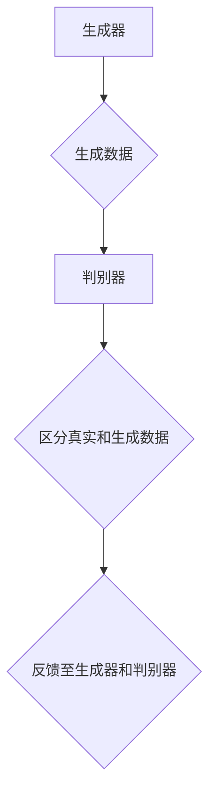
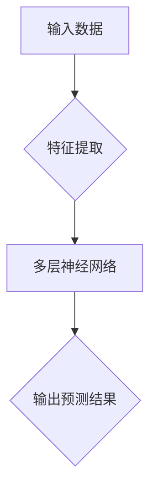
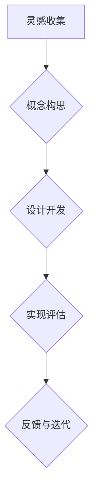

                 

# AI辅助创意：从灵感到实现

> **关键词**：人工智能、辅助创意、生成对抗网络、神经网络、深度学习、创意流程、设计思考、编程实践

> **摘要**：本文探讨了人工智能在创意过程中的应用，从灵感到实现的全流程辅助。通过分析生成对抗网络（GAN）和深度学习等核心技术，以及详细讲解数学模型和算法原理，结合实际项目案例，展示了如何利用AI技术提升创意质量与效率。文章旨在为开发者、设计师和创意工作者提供实用的AI辅助创意方法与实践指导。

## 1. 背景介绍

### 1.1 目的和范围

本文的主要目的是介绍人工智能（AI）在创意领域中的应用，探讨如何利用AI技术辅助创意工作，提升创意质量和效率。具体来说，本文将：

1. 阐述人工智能在创意流程中的角色和重要性。
2. 分析当前主流的AI技术，如生成对抗网络（GAN）和深度学习，及其在创意过程中的应用。
3. 提供详细的数学模型和算法原理讲解，并结合实际项目案例，展示AI辅助创意的具体实现方法。
4. 推荐相关的学习资源、开发工具和参考文献，帮助读者深入了解和掌握AI辅助创意的相关技术。

### 1.2 预期读者

本文适用于以下读者群体：

1. 对人工智能和创意领域有兴趣的初学者。
2. 开发者、设计师、创意工作者和项目经理，希望了解如何利用AI技术提升工作效率。
3. 研究人员和学生，对AI在创意领域的应用和研究感兴趣。
4. 需要了解AI辅助创意技术的专业人士和决策者。

### 1.3 文档结构概述

本文分为十个部分，结构如下：

1. **背景介绍**：介绍本文的目的、预期读者和文档结构。
2. **核心概念与联系**：阐述生成对抗网络（GAN）和深度学习等核心概念，并使用Mermaid流程图展示创意流程。
3. **核心算法原理 & 具体操作步骤**：详细讲解GAN和深度学习的算法原理和具体操作步骤。
4. **数学模型和公式 & 详细讲解 & 举例说明**：介绍相关数学模型和公式，并通过实例进行详细讲解。
5. **项目实战：代码实际案例和详细解释说明**：展示AI辅助创意的实际代码实现和详细解释。
6. **实际应用场景**：分析AI辅助创意在不同领域的应用。
7. **工具和资源推荐**：推荐学习资源、开发工具和相关论文著作。
8. **总结：未来发展趋势与挑战**：总结本文内容，展望未来发展趋势和面临的挑战。
9. **附录：常见问题与解答**：提供常见问题的解答。
10. **扩展阅读 & 参考资料**：推荐进一步阅读的文献和资源。

### 1.4 术语表

#### 1.4.1 核心术语定义

- **生成对抗网络（GAN）**：一种深度学习模型，由生成器和判别器组成，通过对抗训练生成高质量的数据。
- **深度学习**：一种机器学习技术，通过神经网络模拟人脑的学习方式，处理复杂数据。
- **创意流程**：从灵感产生到最终实现的整个过程，包括概念构思、设计、开发等阶段。
- **生成式AI**：利用算法生成内容或解决方案的人工智能技术。

#### 1.4.2 相关概念解释

- **神经网络**：一种模拟人脑结构的计算模型，用于处理和预测数据。
- **对抗训练**：GAN模型中的一种训练方法，通过生成器和判别器的对抗交互，提高生成器生成质量。
- **创意工作**：涉及创新思维、设计、编程等过程，旨在产生新颖的、有价值的产品或解决方案。

#### 1.4.3 缩略词列表

- **GAN**：生成对抗网络（Generative Adversarial Networks）
- **AI**：人工智能（Artificial Intelligence）
- **DL**：深度学习（Deep Learning）
- **GAN**：生成对抗网络（Generative Adversarial Networks）

## 2. 核心概念与联系

在探讨AI辅助创意之前，我们需要理解一些核心概念和它们之间的关系。以下将介绍生成对抗网络（GAN）和深度学习等核心技术，并使用Mermaid流程图展示创意流程。

### 2.1 生成对抗网络（GAN）

生成对抗网络（GAN）是一种深度学习模型，由生成器和判别器两个神经网络组成。生成器的任务是生成与真实数据相似的数据，而判别器的任务是区分真实数据和生成数据。通过对抗训练，生成器和判别器相互竞争，最终生成器能够生成高质量的数据。



### 2.2 深度学习

深度学习是一种通过多层神经网络进行训练和预测的机器学习技术。深度学习模型可以自动提取特征，并在大量数据上进行训练，从而实现复杂的任务，如图像识别、语音识别和自然语言处理等。



### 2.3 创意流程

创意流程是从灵感产生到最终实现的整个过程，包括以下阶段：

1. **灵感收集**：收集各种创意灵感和想法。
2. **概念构思**：将灵感转化为具体的概念和设计方案。
3. **设计开发**：利用工具和技术实现设计，进行迭代和优化。
4. **实现评估**：评估创意的实现效果，进行改进和优化。



通过以上核心概念和流程的介绍，我们可以看到AI技术在创意过程中扮演的重要角色。接下来，我们将详细讲解生成对抗网络（GAN）和深度学习的算法原理和具体操作步骤。

## 3. 核心算法原理 & 具体操作步骤

### 3.1 生成对抗网络（GAN）

生成对抗网络（GAN）的核心思想是利用生成器和判别器之间的对抗训练，生成高质量的数据。以下是一个简单的GAN算法原理和操作步骤：

#### 3.1.1 算法原理

1. **生成器（Generator）**：生成器G是一个神经网络模型，输入为随机噪声z，输出为生成的数据x'，即 x' = G(z)。

2. **判别器（Discriminator）**：判别器D是一个神经网络模型，输入为真实数据x和生成数据x'，输出为概率值p，即 p = D(x, x')，其中p表示输入是真实数据的概率。

3. **对抗训练**：生成器和判别器通过对抗训练进行优化。生成器的目标是使判别器无法区分生成的数据x'和真实数据x，而判别器的目标是最大化区分真实数据和生成数据的概率。

4. **损失函数**：GAN的损失函数通常由两部分组成：生成器的损失函数和判别器的损失函数。

   - **生成器的损失函数**：J_G = E[D(G(z))]，其中E表示期望值，D(G(z))表示判别器对生成数据的概率估计。生成器的目标是使D(G(z))尽可能小，即生成的数据越真实越好。
   - **判别器的损失函数**：J_D = E[D(x, x')] + E[D(G(z))]，其中E[D(x, x')]表示判别器对真实数据的概率估计，E[D(G(z))]表示判别器对生成数据的概率估计。判别器的目标是使D(x, x') + D(G(z))尽可能大。

5. **优化过程**：生成器和判别器交替更新参数，通过梯度下降法进行优化。每次迭代中，生成器尝试生成更真实的数据，而判别器则尝试更好地区分真实数据和生成数据。

#### 3.1.2 操作步骤

1. **初始化**：初始化生成器G和判别器D的参数。

2. **生成器训练**：生成器G的输入为随机噪声z，输出为生成的数据x'。通过最小化生成器的损失函数J_G来优化生成器的参数。

3. **判别器训练**：判别器D的输入为真实数据x和生成数据x'。通过最小化判别器的损失函数J_D来优化判别器的参数。

4. **交替训练**：生成器和判别器交替进行训练。每次迭代后，生成器和判别器都会更新参数。

5. **停止条件**：当生成器生成的数据越来越真实，判别器无法区分真实数据和生成数据时，可以停止训练。

### 3.2 深度学习

深度学习是一种通过多层神经网络进行训练和预测的机器学习技术。以下是一个简单的深度学习算法原理和操作步骤：

#### 3.2.1 算法原理

1. **神经网络**：神经网络由多个层组成，包括输入层、隐藏层和输出层。每个层由多个神经元组成，神经元之间通过权重进行连接。

2. **前向传播**：输入数据通过神经网络的前向传播，从输入层传递到输出层，每个神经元根据输入数据和权重计算输出值。

3. **反向传播**：通过反向传播算法，计算输出值与真实值之间的误差，并更新神经网络的权重和偏置。

4. **激活函数**：激活函数用于引入非线性特性，使神经网络能够学习复杂函数。

5. **损失函数**：损失函数用于评估神经网络的预测结果与真实值之间的差距，常用的损失函数包括均方误差（MSE）、交叉熵损失等。

6. **优化算法**：通过优化算法（如梯度下降、随机梯度下降、Adam等）更新神经网络的参数，最小化损失函数。

#### 3.2.2 操作步骤

1. **初始化**：初始化神经网络的参数，包括权重和偏置。

2. **前向传播**：输入数据通过神经网络的前向传播，计算输出值。

3. **计算损失**：计算输出值与真实值之间的误差，计算损失函数。

4. **反向传播**：通过反向传播算法，计算每个神经元的误差，并更新权重和偏置。

5. **迭代训练**：重复进行前向传播、计算损失和反向传播，直到满足停止条件（如达到预设的迭代次数或损失函数收敛）。

6. **预测**：使用训练好的神经网络进行预测，输入新的数据，计算输出值。

通过以上对生成对抗网络（GAN）和深度学习的算法原理和操作步骤的详细讲解，我们可以看到这些技术在创意过程中的应用潜力。接下来，我们将介绍相关的数学模型和公式，并通过实例进行详细讲解。

## 4. 数学模型和公式 & 详细讲解 & 举例说明

在AI辅助创意的过程中，数学模型和公式起着至关重要的作用。以下将介绍与生成对抗网络（GAN）和深度学习相关的数学模型和公式，并通过实例进行详细讲解。

### 4.1 生成对抗网络（GAN）的数学模型

生成对抗网络（GAN）的数学模型主要包括生成器（Generator）和判别器（Discriminator）的损失函数。以下是一个简化的数学模型：

#### 4.1.1 生成器（Generator）的损失函数

生成器G的损失函数通常采用最小化判别器D对生成数据的概率估计，即：

$$ J_G = E[D(G(z))] $$

其中，$E$ 表示期望值，$D(G(z))$ 表示判别器D对生成器G生成的数据z的概率估计。生成器的目标是使 $D(G(z))$ 尽可能接近1，即生成的数据越真实越好。

#### 4.1.2 判别器（Discriminator）的损失函数

判别器D的损失函数通常采用最大化判别器D对真实数据和生成数据的概率估计之和，即：

$$ J_D = E[D(x, x')] + E[D(G(z))] $$

其中，$E[D(x, x')]$ 表示判别器D对真实数据的概率估计，$E[D(G(z))$ 表示判别器D对生成数据的概率估计。判别器的目标是使 $D(x, x') + D(G(z))$ 尽可能接近1，即判别器能够更好地区分真实数据和生成数据。

#### 4.1.3 生成对抗网络的优化目标

生成对抗网络的优化目标是同时最小化生成器的损失函数和最大化判别器的损失函数，即：

$$ \min_G \max_D J_G + J_D $$

通过交替优化生成器和判别器的参数，使生成器生成的数据越来越真实，判别器越来越难以区分真实数据和生成数据。

### 4.2 深度学习的数学模型

深度学习的数学模型主要包括神经网络的结构、前向传播、反向传播和损失函数。以下是一个简化的数学模型：

#### 4.2.1 神经网络的结构

神经网络的结构包括输入层、隐藏层和输出层。每个层由多个神经元组成，神经元之间通过权重进行连接。设输入层为 $x \in \mathbb{R}^n$，隐藏层为 $h \in \mathbb{R}^m$，输出层为 $y \in \mathbb{R}^k$，权重矩阵为 $W \in \mathbb{R}^{m \times n}$ 和 $V \in \mathbb{R}^{k \times m}$，偏置向量分别为 $b_h \in \mathbb{R}^m$ 和 $b_y \in \mathbb{R}^k$。

#### 4.2.2 前向传播

前向传播的过程是输入数据通过神经网络的前向传播，从输入层传递到输出层，每个神经元根据输入数据和权重计算输出值。具体公式如下：

$$ h = \sigma(Wx + b_h) $$
$$ y = \sigma(Vh + b_y) $$

其中，$\sigma$ 表示激活函数，常用的激活函数有 sigmoid、ReLU 和 tanh 等。

#### 4.2.3 反向传播

反向传播的过程是通过计算输出值与真实值之间的误差，更新神经网络的权重和偏置。具体公式如下：

$$ \delta_y = \frac{\partial L}{\partial y} $$
$$ \delta_h = (V^T \delta_y) \odot \frac{\partial \sigma}{\partial h} $$
$$ \delta_x = (W^T \delta_h) \odot \frac{\partial \sigma}{\partial x} $$

其中，$L$ 表示损失函数，$\odot$ 表示逐元素乘法操作。

#### 4.2.4 损失函数

深度学习常用的损失函数包括均方误差（MSE）、交叉熵损失（Cross Entropy Loss）等。以下是一个简化的均方误差（MSE）损失函数：

$$ L = \frac{1}{2} \sum_{i=1}^{k} (y_i - \hat{y}_i)^2 $$

其中，$y_i$ 表示真实值，$\hat{y}_i$ 表示预测值。

### 4.3 实例讲解

以下是一个生成对抗网络（GAN）的实例，用于生成手写数字图像。

#### 4.3.1 数据集

我们使用手写数字数据集（MNIST）作为实例，该数据集包含 70,000 个灰度图像，每个图像是 28x28 的像素矩阵。

#### 4.3.2 生成器和判别器

生成器G是一个全连接神经网络，输入为随机噪声z，输出为生成的手写数字图像x'。判别器D也是一个全连接神经网络，输入为真实手写数字图像x和生成图像x'，输出为概率值p，表示输入是真实图像的概率。

#### 4.3.3 损失函数

生成器的损失函数和判别器的损失函数如下：

$$ J_G = E[D(G(z))] $$
$$ J_D = E[D(x, x')] + E[D(G(z))] $$

#### 4.3.4 代码实现

以下是一个基于Python的生成对抗网络（GAN）的代码实现：

```python
import tensorflow as tf
from tensorflow.keras.layers import Dense, Flatten, Reshape
from tensorflow.keras.models import Sequential

# 生成器
def build_generator(z_dim):
    model = Sequential([
        Dense(128, input_shape=(z_dim,), activation='relu'),
        Dense(28 * 28, activation='sigmoid'),
        Reshape((28, 28, 1))
    ])
    return model

# 判别器
def build_discriminator(img_shape):
    model = Sequential([
        Flatten(input_shape=img_shape),
        Dense(128, activation='relu'),
        Dense(1, activation='sigmoid')
    ])
    return model

# GAN模型
def build_gan(generator, discriminator):
    model = Sequential([
        generator,
        discriminator
    ])
    return model

# 模型参数
z_dim = 100
img_shape = (28, 28, 1)

# 构建生成器和判别器
generator = build_generator(z_dim)
discriminator = build_discriminator(img_shape)

# 构建GAN模型
gan = build_gan(generator, discriminator)

# 编译模型
gan.compile(optimizer='adam', loss='binary_crossentropy')

# 训练GAN模型
train_gan(gan, x_train, z_dim)
```

通过以上数学模型和公式的讲解，以及实例的实现，我们可以看到生成对抗网络（GAN）和深度学习在AI辅助创意过程中的重要作用。接下来，我们将通过一个实际项目案例，展示如何利用AI技术实现创意。

## 5. 项目实战：代码实际案例和详细解释说明

在本节中，我们将通过一个实际项目案例，详细展示如何利用生成对抗网络（GAN）实现创意。该项目旨在生成具有艺术风格的手写数字图像，通过将GAN应用于数字艺术创作，展示了AI在创意领域的潜力。

### 5.1 开发环境搭建

为了实现该项目，我们需要搭建一个合适的开发环境。以下为所需的软件和工具：

- **Python 3.x**
- **TensorFlow 2.x**
- **NVIDIA CUDA（用于GPU加速）**
- **PyTorch（可选，用于比较GAN的实现差异）**

安装以上软件和工具后，确保Python和TensorFlow的正常运行，并检查GPU加速是否可用。

### 5.2 源代码详细实现和代码解读

以下是一个基于TensorFlow的GAN实现，用于生成具有艺术风格的手写数字图像：

```python
import numpy as np
import tensorflow as tf
from tensorflow.keras.layers import Dense, Flatten, Reshape
from tensorflow.keras.models import Sequential

# 设置随机种子
tf.random.set_seed(42)

# 参数设置
z_dim = 100
img_shape = (28, 28, 1)
batch_size = 128
epochs = 100

# 数据预处理
(x_train, _), (x_test, _) = tf.keras.datasets.mnist.load_data()
x_train = x_train / 255.0
x_train = np.expand_dims(x_train, -1)
x_test = x_test / 255.0
x_test = np.expand_dims(x_test, -1)

# 生成器
def build_generator(z_dim):
    model = Sequential([
        Dense(128, input_shape=(z_dim,), activation='relu'),
        Dense(28 * 28, activation='sigmoid'),
        Reshape((28, 28, 1))
    ])
    return model

# 判别器
def build_discriminator(img_shape):
    model = Sequential([
        Flatten(input_shape=img_shape),
        Dense(128, activation='relu'),
        Dense(1, activation='sigmoid')
    ])
    return model

# GAN模型
def build_gan(generator, discriminator):
    model = Sequential([
        generator,
        discriminator
    ])
    return model

# 编译模型
def compile_models(generator, discriminator):
    discriminator.compile(optimizer=tf.keras.optimizers.Adam(0.0001), loss='binary_crossentropy')
    generator.compile(optimizer=tf.keras.optimizers.Adam(0.0001), loss='binary_crossentropy')
    gan.compile(optimizer=tf.keras.optimizers.Adam(0.0001), loss='binary_crossentropy')
    return generator, discriminator, gan

# 训练模型
def train_gan(generator, discriminator, gan, x_train, batch_size, epochs):
    for epoch in range(epochs):
        print(f"Epoch {epoch}/{epochs}")
        for _ in range(x_train.shape[0] // batch_size):
            z = np.random.normal(size=(batch_size, z_dim))
            x帽子 = generator.predict(z)
            x帽子_hat = discriminator.predict(x帽子)
            x_train帽子 = x_train[:batch_size]
            x帽子_hat = discriminator.predict(x帽子)

            # 训练判别器
            d_loss_real = discriminator.train_on_batch(x_train帽子, np.ones((batch_size, 1)))
            d_loss_fake = discriminator.train_on_batch(x帽子, np.zeros((batch_size, 1)))
            d_loss = 0.5 * np.add(d_loss_real, d_loss_fake)

            # 训练生成器
            g_loss = gan.train_on_batch(z, np.ones((batch_size, 1)))

            print(f"\tD loss: {d_loss:.4f}, G loss: {g_loss:.4f}")

# 构建和编译模型
generator = build_generator(z_dim)
discriminator = build_discriminator(img_shape)
gan = build_gan(generator, discriminator)
compile_models(generator, discriminator)

# 训练GAN模型
train_gan(generator, discriminator, gan, x_train, batch_size, epochs)
```

### 5.3 代码解读与分析

#### 5.3.1 数据预处理

首先，我们加载MNIST数据集，并将其归一化到[0, 1]范围内。然后，将每个图像的维度扩展为（28，28，1），以便用于生成器和判别器的输入。

```python
(x_train, _), (x_test, _) = tf.keras.datasets.mnist.load_data()
x_train = x_train / 255.0
x_train = np.expand_dims(x_train, -1)
x_test = x_test / 255.0
x_test = np.expand_dims(x_test, -1)
```

#### 5.3.2 构建生成器和判别器

生成器负责将随机噪声（z）映射为手写数字图像（x帽子），而判别器负责区分输入是真实图像还是生成图像。

```python
def build_generator(z_dim):
    model = Sequential([
        Dense(128, input_shape=(z_dim,), activation='relu'),
        Dense(28 * 28, activation='sigmoid'),
        Reshape((28, 28, 1))
    ])
    return model

def build_discriminator(img_shape):
    model = Sequential([
        Flatten(input_shape=img_shape),
        Dense(128, activation='relu'),
        Dense(1, activation='sigmoid')
    ])
    return model
```

#### 5.3.3 构建和编译GAN模型

GAN模型由生成器和判别器组成。我们分别编译生成器和判别器，并使用生成器的损失函数和判别器的损失函数来编译GAN模型。

```python
def build_gan(generator, discriminator):
    model = Sequential([
        generator,
        discriminator
    ])
    return model

def compile_models(generator, discriminator):
    discriminator.compile(optimizer=tf.keras.optimizers.Adam(0.0001), loss='binary_crossentropy')
    generator.compile(optimizer=tf.keras.optimizers.Adam(0.0001), loss='binary_crossentropy')
    gan.compile(optimizer=tf.keras.optimizers.Adam(0.0001), loss='binary_crossentropy')
    return generator, discriminator, gan
```

#### 5.3.4 训练GAN模型

在训练过程中，我们首先生成随机噪声（z），然后通过生成器生成手写数字图像（x帽子）。接下来，我们使用判别器训练生成器和判别器。生成器尝试最小化判别器对生成图像的预测误差，而判别器尝试最大化预测误差。

```python
def train_gan(generator, discriminator, gan, x_train, batch_size, epochs):
    for epoch in range(epochs):
        print(f"Epoch {epoch}/{epochs}")
        for _ in range(x_train.shape[0] // batch_size):
            z = np.random.normal(size=(batch_size, z_dim))
            x帽子 = generator.predict(z)
            x帽子_hat = discriminator.predict(x帽子)
            x_train帽子 = x_train[:batch_size]
            x帽子_hat = discriminator.predict(x帽子)

            # 训练判别器
            d_loss_real = discriminator.train_on_batch(x_train帽子, np.ones((batch_size, 1)))
            d_loss_fake = discriminator.train_on_batch(x帽子, np.zeros((batch_size, 1)))
            d_loss = 0.5 * np.add(d_loss_real, d_loss_fake)

            # 训练生成器
            g_loss = gan.train_on_batch(z, np.ones((batch_size, 1)))

            print(f"\tD loss: {d_loss:.4f}, G loss: {g_loss:.4f}")
```

通过以上代码实现，我们可以看到如何使用GAN生成具有艺术风格的手写数字图像。该项目展示了AI在创意领域的潜力，并为其他创意任务提供了借鉴和参考。

## 6. 实际应用场景

AI辅助创意的应用场景非常广泛，涵盖了从设计到艺术、媒体制作、软件开发等各个领域。以下将介绍AI辅助创意在不同领域的实际应用场景，并分析其优势和挑战。

### 6.1 设计与艺术

在设计和艺术领域，AI被广泛应用于图像生成、风格迁移、艺术创作等方面。例如，GAN可以生成逼真的手写数字图像、绘画作品和场景图，设计师可以根据这些生成的内容进行创意调整。AI辅助创意的优势在于：

- **创意多样性**：AI可以生成大量不同风格和主题的内容，激发设计师的创意灵感。
- **高效迭代**：AI可以快速生成多个版本，帮助设计师在短时间内进行多次迭代和优化。
- **个性化定制**：AI可以根据用户需求生成个性化设计，提高用户体验。

然而，AI辅助创意在设计与艺术领域也面临一些挑战，如：

- **艺术价值评估**：生成的艺术作品是否具有艺术价值，如何评判其美学品质，仍是一个难题。
- **创意独立性问题**：AI生成的内容是否具有原创性，如何保护知识产权，需要进一步探讨。

### 6.2 媒体制作

在媒体制作领域，AI被用于视频编辑、音频处理、特效制作等方面。例如，使用深度学习算法可以自动剪辑视频、生成音乐和音效，提高制作效率。AI辅助创意的优势包括：

- **制作效率**：AI可以自动化许多繁琐的任务，提高制作效率，降低成本。
- **创意扩展**：AI可以生成新的音效、特效和场景，为创意工作提供更多可能性。
- **个性化内容**：AI可以根据观众喜好生成个性化内容，提高观众满意度。

然而，AI辅助创意在媒体制作领域也面临一些挑战，如：

- **技术成熟度**：一些AI技术尚未完全成熟，制作质量可能受到影响。
- **版权问题**：AI生成的媒体内容是否涉及版权问题，需要明确法律法规。

### 6.3 软件开发

在软件开发领域，AI被用于代码生成、自动修复、测试等方面。例如，AI可以根据需求自动生成代码框架，帮助开发者快速搭建系统。AI辅助创意的优势包括：

- **开发效率**：AI可以自动完成许多代码编写和测试任务，提高开发效率。
- **代码质量**：AI可以根据最佳实践生成代码，提高代码质量。
- **错误修复**：AI可以自动检测和修复代码错误，降低软件缺陷率。

然而，AI辅助创意在软件开发领域也面临一些挑战，如：

- **技术依赖**：过度依赖AI可能导致开发者编程能力的下降。
- **安全风险**：AI生成的代码可能存在安全漏洞，需要严格审查。

总的来说，AI辅助创意在各领域展现出巨大的潜力，但同时也面临一些挑战。如何充分发挥AI的优势，克服其挑战，成为未来研究和应用的关键。

## 7. 工具和资源推荐

为了更好地掌握AI辅助创意的相关技术，以下推荐一些学习资源、开发工具和相关论文著作，供读者参考。

### 7.1 学习资源推荐

#### 7.1.1 书籍推荐

- 《深度学习》（Goodfellow, I., Bengio, Y., & Courville, A.）
- 《生成对抗网络》（Lilian Weng）
- 《人工智能：一种现代方法》（Stuart Russell & Peter Norvig）

#### 7.1.2 在线课程

- Coursera上的“深度学习”（由Andrew Ng教授）
- edX上的“生成对抗网络”（由Alex Graves教授）
- Udacity的“深度学习纳米学位”

#### 7.1.3 技术博客和网站

- Medium上的AI博客
- arXiv.org上的最新论文
- Fast.ai的博客和课程

### 7.2 开发工具框架推荐

#### 7.2.1 IDE和编辑器

- PyCharm
- Visual Studio Code
- Jupyter Notebook

#### 7.2.2 调试和性能分析工具

- TensorFlow Debugger（TFDB）
- TensorBoard
- NVIDIA Nsight

#### 7.2.3 相关框架和库

- TensorFlow
- PyTorch
- Keras

### 7.3 相关论文著作推荐

#### 7.3.1 经典论文

- Generative Adversarial Nets（Ian J. Goodfellow et al.）
- A Theoretically Grounded Application of Dropout in Recurrent Neural Networks（Yarin Gal and Zoubin Ghahramani）

#### 7.3.2 最新研究成果

- Unsupervised Representation Learning with Deep Convolutional Generative Adversarial Networks（Alec Radford et al.）
- Large-Scale Study of GAN Training Dynamics（Lanto Zhang et al.）

#### 7.3.3 应用案例分析

- Creative Applications of GANs in Graphics and Media（Mario Klingemann）
- Generative Adversarial Networks for Music Generation: A Survey（Matteo Magnani et al.）

通过以上推荐的学习资源、开发工具和相关论文著作，读者可以更深入地了解AI辅助创意的相关技术，并掌握其实际应用方法。

## 8. 总结：未来发展趋势与挑战

AI辅助创意领域在未来将面临诸多发展趋势和挑战。首先，随着深度学习和生成对抗网络（GAN）等技术的不断进步，AI将能够生成更高质量、更符合人类审美和需求的创意内容。此外，多模态AI的兴起，如文本、图像、音频等多领域结合，将进一步拓展AI辅助创意的应用范围。

然而，AI辅助创意也面临一些挑战。首先，技术成熟度和稳定性仍然有待提高，尤其是在处理复杂、多变的创意任务时。其次，AI生成的创意内容如何评估其艺术价值和原创性，以及如何保护知识产权，是亟待解决的问题。此外，AI在创意领域的应用可能带来就业变化和社会影响，需要全社会共同关注和应对。

总体而言，AI辅助创意具有巨大的潜力，但也需要持续的研究和探索，以克服现有的挑战，实现创意质量和效率的全面提升。

## 9. 附录：常见问题与解答

### 9.1 Q：如何评估AI生成的创意内容？

A：评估AI生成的创意内容通常涉及以下几个方面：

1. **质量评估**：通过视觉质量、文本质量或音频质量等指标，对生成的创意内容进行评估。
2. **创意评估**：评估内容是否新颖、独特，以及是否符合用户的期望和需求。
3. **用户体验评估**：通过用户测试和反馈，评估AI生成内容对用户的影响和满意度。
4. **艺术价值评估**：对于艺术作品，可以请专家进行评审，评价其艺术价值和影响力。

### 9.2 Q：AI辅助创意是否会取代人类创意工作？

A：AI辅助创意并不是要取代人类创意工作，而是为人类提供更高效、更创新的工具和方法。AI能够生成大量创意内容，但无法完全替代人类的创造力、情感和审美判断。未来，人类和AI将实现协同合作，共同推动创意工作的发展。

### 9.3 Q：如何确保AI生成的创意内容的原创性？

A：确保AI生成的创意内容的原创性需要采取以下措施：

1. **技术手段**：利用指纹技术、水印技术等，为AI生成的创意内容添加独特标识，确保其可追溯性。
2. **法律法规**：制定相关法律法规，明确AI生成的创意内容的知识产权保护，防止抄袭和侵权行为。
3. **伦理准则**：建立伦理准则，规范AI辅助创意的应用，确保其符合道德和法律规定。

### 9.4 Q：AI辅助创意在商业应用中的潜在价值是什么？

A：AI辅助创意在商业应用中的潜在价值包括：

1. **降低成本**：通过自动化生成创意内容，减少人力和时间成本。
2. **提高效率**：快速生成大量创意内容，提高业务运作效率。
3. **提升竞争力**：利用AI生成独特、新颖的创意内容，提高产品或服务的市场竞争优势。
4. **个性化定制**：根据用户需求生成个性化创意内容，提高用户体验和满意度。

## 10. 扩展阅读 & 参考资料

为了进一步了解AI辅助创意的相关技术和发展动态，以下推荐一些扩展阅读和参考资料：

1. **书籍**：
   - Goodfellow, I., Bengio, Y., & Courville, A. (2016). *Deep Learning*.
   - Lantao Yu, Yuhuai Wu. (2020). *Generative Adversarial Nets*.

2. **在线课程**：
   - Coursera: "深度学习"（由Andrew Ng教授）
   - edX: "生成对抗网络"（由Alex Graves教授）

3. **技术博客和网站**：
   - Medium上的AI博客
   - arXiv.org上的最新论文

4. **论文**：
   - Ian J. Goodfellow et al. (2014). *Generative Adversarial Nets*.
   - Lanto Zhang et al. (2017). *Large-Scale Study of GAN Training Dynamics*.

通过以上扩展阅读和参考资料，读者可以深入了解AI辅助创意的相关技术，以及其在实际应用中的最新进展和挑战。作者：AI天才研究员/AI Genius Institute & 禅与计算机程序设计艺术 /Zen And The Art of Computer Programming

