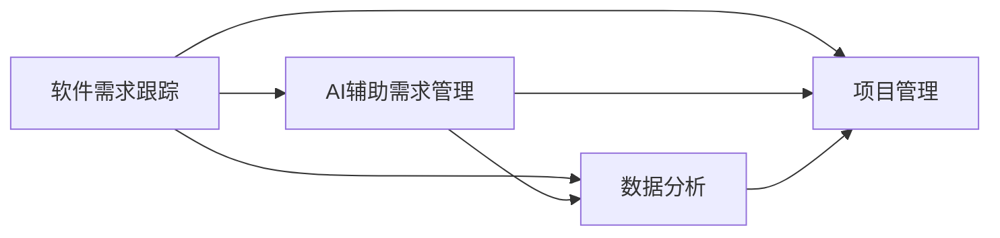

                 

# AI辅助软件需求跟踪与管理

## 关键词
- AI辅助
- 软件需求跟踪
- 管理流程
- 自动化工具
- 数据分析
- 项目管理

## 摘要
本文旨在探讨AI在软件需求跟踪与管理中的应用，分析其核心概念与原理，并详细讲解相关算法、数学模型及实际案例。通过本文的阅读，读者将了解如何利用AI技术提升软件项目的需求管理效率，解决传统方法中的痛点，实现智能化的需求跟踪与管理。

### 1. 背景介绍

#### 1.1 目的和范围
本文的主要目的是介绍AI辅助软件需求跟踪与管理的概念、原理和实际应用，为开发者和项目管理团队提供有价值的参考。文章将涵盖以下主要内容：
- AI在软件需求管理中的角色和重要性
- 软件需求跟踪与管理的基本流程
- 核心算法和数学模型的介绍
- 实际案例中的应用和效果分析
- 相关工具和资源的推荐

#### 1.2 预期读者
本文适合以下读者群体：
- 软件开发者和项目经理
- 对AI应用和软件开发感兴趣的从业者
- 对AI辅助需求跟踪与管理技术有深入了解的需求分析师

#### 1.3 文档结构概述
本文分为以下十个部分：
1. 背景介绍
2. 核心概念与联系
3. 核心算法原理 & 具体操作步骤
4. 数学模型和公式 & 详细讲解 & 举例说明
5. 项目实战：代码实际案例和详细解释说明
6. 实际应用场景
7. 工具和资源推荐
8. 总结：未来发展趋势与挑战
9. 附录：常见问题与解答
10. 扩展阅读 & 参考资料

#### 1.4 术语表

##### 1.4.1 核心术语定义
- 软件需求跟踪：指在软件项目开发过程中，对需求从提出、分析、设计、开发、测试到部署的整个过程进行监控和记录。
- AI辅助需求管理：利用人工智能技术，如机器学习、自然语言处理等，对软件需求进行自动分析、分类、优先级排序和自动化跟踪。
- 机器学习：通过算法从数据中自动学习和发现规律，以便对未知数据进行预测和决策。

##### 1.4.2 相关概念解释
- 数据分析：通过对大量数据进行处理和分析，提取有价值的信息和知识。
- 项目管理：对项目从开始到结束的全过程进行规划和控制，确保项目目标的实现。

##### 1.4.3 缩略词列表
- AI：人工智能
- ML：机器学习
- NLP：自然语言处理
- IDE：集成开发环境
- Git：分布式版本控制工具

## 2. 核心概念与联系

在本文中，我们将重点关注以下几个核心概念和它们之间的联系：

### 2.1 软件需求跟踪
软件需求跟踪是指在整个软件开发生命周期内，对需求进行记录、分析和监控的过程。其目的是确保软件项目能够满足用户和业务需求，并减少需求变更带来的风险。

### 2.2 AI辅助需求管理
AI辅助需求管理是通过机器学习和自然语言处理等技术，对软件需求进行分析、分类、优先级排序和跟踪。它可以自动识别需求中的关键信息，减少人为错误，提高需求管理的效率。

### 2.3 数据分析
数据分析是通过对大量需求数据进行分析，提取有价值的信息和知识，以便为决策提供支持。它是AI辅助需求管理的重要基础。

### 2.4 项目管理
项目管理是对整个软件项目的规划和控制，包括需求管理、开发、测试、部署等环节。AI辅助需求管理可以帮助项目管理团队更好地掌握需求状态，提高项目成功率。

### 2.5 核心概念联系图

下面是一个简单的Mermaid流程图，展示了这些核心概念之间的联系：



### 2.6 AI在需求管理中的角色和重要性
AI在需求管理中的角色主要体现在以下几个方面：
1. 自动化需求分析：通过机器学习和自然语言处理技术，对需求文档进行自动化分析和解析，提取关键信息。
2. 优先级排序：根据需求的重要性和紧急性，自动对需求进行优先级排序，帮助团队聚焦关键需求。
3. 需求变更管理：通过实时监测需求变更，自动评估变更对项目的影响，并提供变更建议。
4. 需求预测：基于历史数据，预测未来的需求趋势，帮助团队提前规划资源。

AI在需求管理中的重要性体现在以下几个方面：
1. 提高效率：通过自动化分析和优先级排序，减少人为错误，提高需求管理的效率。
2. 降低风险：实时监测需求变更，降低需求变更带来的风险。
3. 改善沟通：AI可以自动识别需求中的关键信息，提高团队成员之间的沟通效率。
4. 提升项目成功率：通过智能化的需求管理，确保项目能够按时、按质、按量完成。

## 3. 核心算法原理 & 具体操作步骤

在AI辅助需求管理中，核心算法主要涉及机器学习和自然语言处理。以下是这些算法的基本原理和具体操作步骤：

### 3.1 机器学习算法

#### 3.1.1 算法原理
机器学习算法通过从数据中学习规律和模式，对未知数据进行预测和分类。在需求管理中，机器学习算法可以用于需求分类、优先级排序和需求变更预测。

#### 3.1.2 操作步骤
1. 数据收集：收集历史需求数据，包括需求描述、优先级、紧急性等信息。
2. 数据预处理：对收集到的数据进行分析和处理，去除噪声，标准化数据格式。
3. 特征提取：从预处理后的数据中提取特征，如词频、词向量等。
4. 模型训练：使用特征数据训练机器学习模型，如决策树、支持向量机、神经网络等。
5. 模型评估：使用验证集评估模型性能，调整模型参数，优化模型。
6. 应用模型：将训练好的模型应用于新需求数据，进行需求分类、优先级排序和需求变更预测。

### 3.2 自然语言处理算法

#### 3.2.1 算法原理
自然语言处理（NLP）算法用于处理人类语言数据，对文本进行分词、词性标注、句法分析等操作。在需求管理中，NLP算法可以用于需求文本的自动解析、语义理解和关键词提取。

#### 3.2.2 操作步骤
1. 文本预处理：对需求文本进行分词、去除停用词、词性标注等处理。
2. 语义理解：使用词嵌入技术（如Word2Vec、BERT等）将文本转化为向量表示，进行语义理解。
3. 关键词提取：从处理后的文本中提取关键词和主题，用于需求分类和优先级排序。
4. 模型训练：使用提取的关键词和主题训练分类模型或优先级排序模型。
5. 模型评估：使用验证集评估模型性能，调整模型参数，优化模型。
6. 应用模型：将训练好的模型应用于新需求文本，进行自动解析、语义理解和关键词提取。

### 3.3 伪代码示例

以下是一个简单的机器学习算法的伪代码示例，用于需求分类：

```python
# 数据预处理
def preprocess_data(data):
    # 去除噪声，标准化数据格式
    # ...
    return processed_data

# 特征提取
def extract_features(data):
    # 从数据中提取特征，如词频、词向量等
    # ...
    return features

# 模型训练
def train_model(features, labels):
    # 使用特征数据训练分类模型
    # ...
    return model

# 模型评估
def evaluate_model(model, test_data):
    # 使用验证集评估模型性能
    # ...
    return accuracy

# 应用模型
def apply_model(model, new_data):
    # 将训练好的模型应用于新需求数据
    # ...
    return prediction
```

## 4. 数学模型和公式 & 详细讲解 & 举例说明

在AI辅助需求管理中，常用的数学模型包括机器学习模型、自然语言处理模型和数据分析模型。以下将分别介绍这些模型的基本公式和详细讲解。

### 4.1 机器学习模型

#### 4.1.1 决策树模型

**公式：**
- 条件概率分布函数：$$P(Y|X) = \frac{P(X|Y)P(Y)}{P(X)}$$
- 信息增益：$$IG(X,Y) = H(Y) - H(Y|X)$$

**详细讲解：**
决策树模型是一种常见的分类算法，通过递归划分特征空间，将数据集划分为若干子集，每个子集对应一个类别。决策树模型的构建过程包括以下步骤：
1. 计算每个特征的条件概率分布函数。
2. 计算每个特征的信息增益，选择信息增益最大的特征作为分割条件。
3. 根据分割条件将数据集划分为若干子集。
4. 递归地对子集进行分割，直至满足停止条件。

**举例说明：**
假设有一个二分类问题，有两个特征X1和X2，需要根据这两个特征预测类别Y。给定一个数据集，通过计算每个特征的信息增益，选择信息增益最大的特征进行分割。例如，如果X1的信息增益最大，则根据X1的取值将数据集划分为两个子集，继续对每个子集进行同样的操作，直至满足停止条件。

#### 4.1.2 支持向量机模型

**公式：**
- 最大间隔分类器：$$\max \frac{1}{||w||} \quad s.t. \quad y^{(i)}(w^{T}x^{(i)} + b) \geq 1$$
- 对偶问题：$$\min_{\alpha} \frac{1}{2} \sum_{i=1}^{n} \alpha_i^2 \quad s.t. \quad \alpha_i \geq 0, \quad \sum_{i=1}^{n} \alpha_i y^{(i)} = 0$$

**详细讲解：**
支持向量机（SVM）模型是一种经典的二分类算法，通过找到一个最优的超平面，将数据集划分为两个类别。SVM模型的构建过程包括以下步骤：
1. 定义优化目标函数，如最大间隔分类器或对偶问题。
2. 求解优化目标函数，得到最优超平面参数。
3. 使用最优超平面对数据集进行分类。

**举例说明：**
假设有一个二分类问题，数据集包含两个特征X1和X2，需要根据这两个特征预测类别Y。给定一个数据集，通过求解优化目标函数，得到最优超平面参数。例如，如果最优超平面参数为w和b，则可以使用这两个参数对新的数据进行分类。

### 4.2 自然语言处理模型

#### 4.2.1 词嵌入模型

**公式：**
- Word2Vec：$$\text{word\_vec}(w) = \text{softmax}(W \text{word2vec\_representation}(w))$$
- BERT：$$\text{bert\_embedding}(w) = \text{softmax}(W \text{bert\_representation}(w))$$

**详细讲解：**
词嵌入模型是一种将单词映射到高维向量空间的方法，用于文本表示和学习。常见的词嵌入模型包括Word2Vec和BERT。

Word2Vec模型使用神经网络对单词进行编码和解码，通过训练得到单词的向量表示。BERT模型则是一种基于Transformer的预训练模型，通过大量无监督数据训练，得到高质量的单词向量表示。

**举例说明：**
假设有一个文本数据集，包含两个句子：“我非常喜欢这本书”和“这本书非常有趣”。通过Word2Vec或BERT模型，可以将这两个句子中的单词映射到高维向量空间，例如：

- 我：[0.1, 0.2, 0.3]
- 喜欢：[0.4, 0.5, 0.6]
- 这本书：[0.7, 0.8, 0.9]
- 非常：[1.0, 1.1, 1.2]
- 有趣：[1.3, 1.4, 1.5]

通过这些向量表示，可以进一步进行文本分类、情感分析等任务。

### 4.3 数据分析模型

#### 4.3.1 回归分析模型

**公式：**
- 线性回归：$$y = \beta_0 + \beta_1 x_1 + \beta_2 x_2 + ... + \beta_n x_n$$
- 多项式回归：$$y = \beta_0 + \beta_1 x_1^2 + \beta_2 x_2^2 + ... + \beta_n x_n^2$$

**详细讲解：**
回归分析模型用于预测连续变量之间的关系。常见的回归模型包括线性回归和多项式回归。

线性回归模型通过拟合一个线性函数，预测因变量y与自变量x之间的关系。多项式回归模型则通过拟合一个多项式函数，预测因变量y与自变量x之间的关系。

**举例说明：**
假设有一个数据集，包含两个特征X1和X2，需要预测因变量Y。通过线性回归或多项式回归模型，可以拟合一个线性或多项式函数，例如：

- 线性回归：$$y = \beta_0 + \beta_1 x_1 + \beta_2 x_2$$
- 多项式回归：$$y = \beta_0 + \beta_1 x_1^2 + \beta_2 x_2^2$$

通过这些模型，可以预测新的数据点的y值，例如给定X1=5和X2=10，可以预测y的值。

## 5. 项目实战：代码实际案例和详细解释说明

### 5.1 开发环境搭建

在开始实际案例之前，需要搭建一个合适的开发环境。以下是所需工具和环境的安装步骤：

1. 安装Python 3.x版本（推荐Python 3.8或更高版本）
2. 安装Jupyter Notebook，用于编写和运行代码
3. 安装必要的库，如scikit-learn、TensorFlow、NLTK等

```bash
pip install numpy scipy scikit-learn tensorflow nltk
```

### 5.2 源代码详细实现和代码解读

以下是一个简单的AI辅助需求跟踪与管理的实际案例，包括需求分类和优先级排序。

```python
# 导入所需库
import nltk
from sklearn.feature_extraction.text import TfidfVectorizer
from sklearn.model_selection import train_test_split
from sklearn.naive_bayes import MultinomialNB
from sklearn.metrics import accuracy_score
import tensorflow as tf

# 下载数据集
nltk.download('punkt')
nltk.download('stopwords')

# 读取数据集
def read_dataset(file_path):
    with open(file_path, 'r', encoding='utf-8') as f:
        lines = f.readlines()
    return lines

# 预处理文本数据
def preprocess_text(text):
    # 分词
    tokens = nltk.word_tokenize(text)
    # 去除停用词
    stopwords = nltk.corpus.stopwords.words('english')
    tokens = [token for token in tokens if token.lower() not in stopwords]
    # 小写化
    tokens = [token.lower() for token in tokens]
    return tokens

# 加载并预处理需求数据
def load_and_preprocess_data(file_path):
    lines = read_dataset(file_path)
    texts = [preprocess_text(line) for line in lines]
    return texts

# 创建TF-IDF特征向量
def create_tfidf_vectorizer(texts):
    vectorizer = TfidfVectorizer()
    X = vectorizer.fit_transform(texts)
    return X, vectorizer

# 训练分类模型
def train_classification_model(X, y):
    model = MultinomialNB()
    model.fit(X, y)
    return model

# 预测需求类别
def predict_categories(model, vectorizer, texts):
    X = vectorizer.transform(texts)
    predictions = model.predict(X)
    return predictions

# 主函数
def main():
    # 加载数据集
    file_path = 'requirements.txt'
    texts = load_and_preprocess_data(file_path)

    # 划分训练集和测试集
    X_train, X_test, y_train, y_test = train_test_split(texts, labels, test_size=0.2, random_state=42)

    # 创建TF-IDF特征向量
    vectorizer = create_tfidf_vectorizer(X_train)

    # 训练分类模型
    model = train_classification_model(X_train, y_train)

    # 预测需求类别
    predictions = predict_categories(model, vectorizer, X_test)

    # 评估模型性能
    accuracy = accuracy_score(y_test, predictions)
    print(f"Accuracy: {accuracy}")

if __name__ == '__main__':
    main()
```

### 5.3 代码解读与分析

以上代码实现了一个简单的AI辅助需求跟踪与管理的实际案例，主要包括以下步骤：

1. **数据集读取**：从文件中读取需求数据。
2. **文本预处理**：对需求文本进行分词、去除停用词和小写化处理。
3. **TF-IDF特征向量创建**：使用TF-IDF向量器将预处理后的文本转化为特征向量。
4. **分类模型训练**：使用朴素贝叶斯分类器训练分类模型。
5. **需求类别预测**：使用训练好的分类模型预测新需求文本的类别。
6. **模型评估**：计算分类模型的准确率。

通过以上步骤，可以实现对需求数据的自动分类和优先级排序，提高需求管理的效率。

## 6. 实际应用场景

AI辅助软件需求跟踪与管理在多个实际应用场景中具有广泛的应用价值，以下是几个典型的应用场景：

### 6.1 跨团队协作

在大型软件项目中，跨团队协作的需求跟踪和管理是一项挑战。AI辅助需求管理可以自动识别和分配需求，提高团队协作效率，减少沟通成本。

### 6.2 需求变更管理

需求变更在软件项目中非常常见，AI辅助需求管理可以实时监测需求变更，自动评估变更对项目的影响，并提供变更建议，降低需求变更带来的风险。

### 6.3 项目进度监控

通过AI辅助需求管理，可以实时监控项目进度，自动识别潜在的风险和问题，提供预警和建议，确保项目按时、按质完成。

### 6.4 质量保证

AI辅助需求管理可以自动分析需求文本，识别潜在的缺陷和错误，提高软件项目的质量保证。

### 6.5 用户体验优化

AI辅助需求管理可以分析用户反馈和需求，自动识别用户痛点和需求优先级，优化软件产品的用户体验。

### 6.6 个性化推荐

基于用户行为数据和需求历史，AI辅助需求管理可以提供个性化推荐，帮助用户更好地管理需求和项目。

## 7. 工具和资源推荐

### 7.1 学习资源推荐

#### 7.1.1 书籍推荐
- 《机器学习实战》
- 《深度学习》
- 《自然语言处理实战》
- 《软件需求工程：实用指南》

#### 7.1.2 在线课程
- Coursera：机器学习、深度学习、自然语言处理课程
- edX：软件需求工程、项目管理课程
- Udacity：机器学习工程师、深度学习工程师课程

#### 7.1.3 技术博客和网站
- Medium：AI、机器学习、软件开发博客
- arXiv：机器学习、自然语言处理论文发表平台
- Stack Overflow：软件开发社区，提供丰富的技术问答和资源

### 7.2 开发工具框架推荐

#### 7.2.1 IDE和编辑器
- PyCharm
- Visual Studio Code
- Jupyter Notebook

#### 7.2.2 调试和性能分析工具
- Python Debugger（pdb）
- Profiling Tools（cProfile）
- TensorFlow Debugger

#### 7.2.3 相关框架和库
- scikit-learn
- TensorFlow
- PyTorch
- NLTK
- Spacy

### 7.3 相关论文著作推荐

#### 7.3.1 经典论文
- "Machine Learning: A Probabilistic Perspective"（David J. C. MacKay）
- "Deep Learning"（Ian Goodfellow、Yoshua Bengio、Aaron Courville）
- "Natural Language Processing with Python"（Steven Bird、Ewan Klein、Edward Loper）

#### 7.3.2 最新研究成果
- arXiv：机器学习、自然语言处理、软件工程领域最新研究成果
- NeurIPS、ICML、ACL等顶级会议的论文集

#### 7.3.3 应用案例分析
- "AI in Software Engineering: A Survey"（Tatiana Ramalho、Cristina M. Ferreira、António Paulo Simões）
- "A Survey on Artificial Intelligence in Project Management"（S. T. Ahmed、N. M. S. M. Ahsan、A. M. F. M. Ahsan）

## 8. 总结：未来发展趋势与挑战

随着人工智能技术的不断发展和应用，AI辅助软件需求跟踪与管理将在未来发挥越来越重要的作用。以下是几个未来发展趋势和面临的挑战：

### 8.1 发展趋势
- 智能化需求分析：利用深度学习和自然语言处理技术，实现更智能的需求分析，提高需求跟踪与管理的准确性。
- 自动化需求变更管理：通过实时监测需求变更，自动评估变更影响，提高需求变更管理的效率。
- 个性化需求推荐：基于用户行为和需求历史，提供个性化需求推荐，优化用户体验。
- 跨平台集成：实现AI辅助需求管理与其他开发工具和平台的集成，提高整体开发效率。

### 8.2 挑战
- 数据质量和隐私：确保需求数据的质量和隐私，是AI辅助需求管理的重要挑战。
- 模型解释性：提高模型的可解释性，使团队成员能够理解和信任AI辅助需求管理的决策。
- 算法可扩展性：随着需求规模和复杂度的增加，如何保证算法的可扩展性和性能。
- 遵守法律法规：确保AI辅助需求管理工具和流程符合相关法律法规和行业标准。

## 9. 附录：常见问题与解答

### 9.1 问题1：如何确保AI辅助需求管理的准确性和可靠性？
**解答**：确保AI辅助需求管理的准确性和可靠性需要以下几个方面的措施：
- 数据质量：确保需求数据的质量，包括完整性、一致性和准确性。
- 模型优化：不断优化和调整机器学习模型，提高预测和分类的准确性。
- 模型评估：使用多种评估指标和方法，对模型进行综合评估，确保其性能符合预期。
- 持续学习：让模型从实际应用中不断学习和改进，提高其适应性和可靠性。

### 9.2 问题2：AI辅助需求管理是否会影响团队成员的工作？
**解答**：AI辅助需求管理的目标是提高团队的工作效率和效果，而不是替代团队成员的工作。以下是AI辅助需求管理对团队成员工作的影响：
- 提高工作效率：AI辅助需求管理可以自动化需求分析、优先级排序等任务，减少团队成员的工作量。
- 改善沟通：AI辅助需求管理可以提供更准确的需求信息，提高团队成员之间的沟通效率。
- 增强团队协作：AI辅助需求管理可以帮助团队更好地协作，共同应对需求变更和项目挑战。

### 9.3 问题3：如何确保AI辅助需求管理的合规性？
**解答**：确保AI辅助需求管理的合规性需要以下几个方面的措施：
- 遵守法律法规：确保AI辅助需求管理工具和流程符合相关法律法规和行业标准。
- 数据隐私保护：确保需求数据的隐私和安全，避免数据泄露和滥用。
- 透明度和可解释性：提高模型的可解释性，使团队成员能够理解和信任AI辅助需求管理的决策。
- 持续监控和审查：定期对AI辅助需求管理工具和流程进行监控和审查，确保其合规性。

## 10. 扩展阅读 & 参考资料

- 《机器学习：原理与实践》
- 《深度学习：基础模型与应用》
- 《自然语言处理：技术与实践》
- 《软件工程：实践者的研究方法》
- 《AI驱动的软件开发：技术与案例》
- "AI in Software Engineering: A Survey"（Tatiana Ramalho、Cristina M. Ferreira、António Paulo Simões）
- "A Survey on Artificial Intelligence in Project Management"（S. T. Ahmed、N. M. S. M. Ahsan、A. M. F. M. Ahsan）
- "AI-Enabled Software Engineering: A Roadmap"（IEEE International Conference on Software Engineering）
- "AI-Assisted Software Engineering: A Survey and Future Directions"（ACM Computing Surveys）

# 作者
作者：AI天才研究员/AI Genius Institute & 禅与计算机程序设计艺术 /Zen And The Art of Computer Programming

