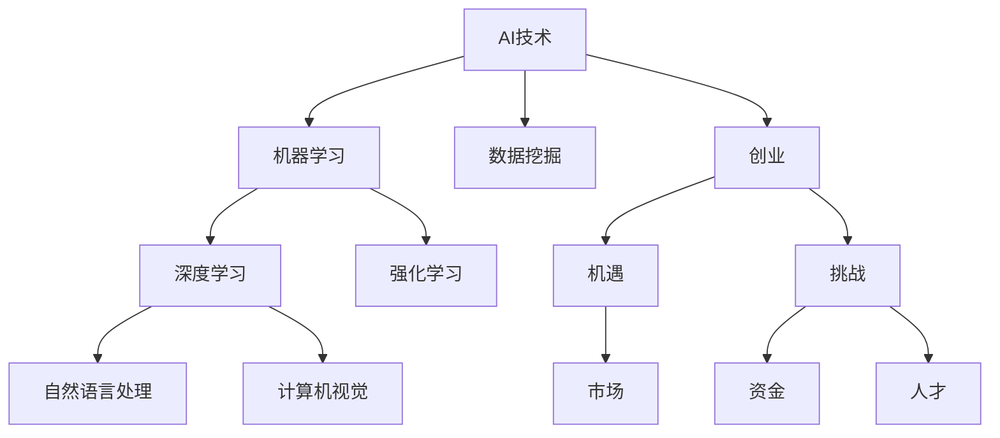

                 

# AI驱动的个人创业：机遇与挑战并存

## 关键词：
AI创业，人工智能技术，个人创业，机遇与挑战，技术原理，项目实战，实际应用，工具推荐

> 摘要：
本文旨在探讨AI驱动的个人创业在当前时代的机遇与挑战。通过分析AI技术的发展趋势及其在创业中的应用，本文将帮助读者了解如何利用AI技术打造具有竞争力的创业项目，并深入探讨其中的关键技术、实战案例以及未来发展的可能性。

## 1. 背景介绍

### 1.1 目的和范围

本文的目标是帮助有意向通过AI技术进行创业的个人或团队了解该领域的机遇与挑战。我们将从以下几个方面展开讨论：

- AI技术的基本原理及其在创业中的应用
- 创业项目中AI技术的核心算法原理与数学模型
- 实际案例中的AI技术应用与代码实现
- 创业过程中可能遇到的技术挑战与解决策略
- 未来AI驱动创业的发展趋势与前景

### 1.2 预期读者

本文的预期读者包括：

- 有志于利用AI技术进行创业的个人或团队
- 计算机科学、人工智能等相关专业的研究生或本科生
- 对AI技术和创业有兴趣的技术爱好者

### 1.3 文档结构概述

本文分为十个部分，具体结构如下：

1. 背景介绍
2. 核心概念与联系
3. 核心算法原理 & 具体操作步骤
4. 数学模型和公式 & 详细讲解 & 举例说明
5. 项目实战：代码实际案例和详细解释说明
6. 实际应用场景
7. 工具和资源推荐
8. 总结：未来发展趋势与挑战
9. 附录：常见问题与解答
10. 扩展阅读 & 参考资料

### 1.4 术语表

#### 1.4.1 核心术语定义

- AI创业：利用人工智能技术进行商业创新，打造具有市场竞争力的产品或服务。
- 机器学习：一种使计算机通过数据学习并做出决策的技术。
- 深度学习：一种特殊的机器学习方法，通过多层神经网络模拟人脑处理信息的方式。
- 数据挖掘：从大量数据中提取有价值的信息和知识。

#### 1.4.2 相关概念解释

- 创业：创建一个新的商业实体，提供新产品或服务。
- 机遇：在创业过程中发现并利用的有利于成功的机会。
- 挑战：在创业过程中可能遇到的问题和困难。

#### 1.4.3 缩略词列表

- AI：人工智能
- ML：机器学习
- DL：深度学习
- NLP：自然语言处理
- CV：计算机视觉

## 2. 核心概念与联系

在讨论AI驱动的个人创业之前，有必要先了解一些核心概念及其之间的联系。以下是一个简单的Mermaid流程图，展示了一些关键概念和它们之间的关系。



### 2.1 AI技术在创业中的应用

AI技术在创业中的应用非常广泛，包括但不限于以下几个方面：

- **数据分析**：通过机器学习和数据挖掘技术，从海量数据中提取有价值的信息，帮助创业者做出更明智的商业决策。
- **智能推荐**：利用深度学习和推荐系统，为用户推荐个性化产品或服务，提高用户满意度和转化率。
- **自动化流程**：通过机器人流程自动化（RPA）和自然语言处理技术，自动化重复性高的业务流程，提高工作效率。
- **智能客服**：利用计算机视觉和自然语言处理技术，实现智能客服系统，提高客户服务质量。
- **预测分析**：利用时间序列分析和预测模型，对市场趋势和用户行为进行预测，帮助创业者提前布局。

### 2.2 创业中的机遇与挑战

在AI驱动的创业过程中，创业者不仅需要利用AI技术创造价值，还需要面对各种机遇与挑战。以下是一些典型的机遇与挑战：

#### 机遇：

- **市场需求**：随着AI技术的不断成熟，越来越多的行业开始认识到其价值，这为创业者提供了广阔的市场空间。
- **资金支持**：政府和风险投资公司对AI技术的关注不断增加，为创业者提供了更多的资金支持。
- **人才储备**：越来越多的专业人士投身于AI领域，为创业者提供了丰富的人才资源。

#### 挑战：

- **技术门槛**：AI技术具有较强的专业性，创业者需要具备一定的技术背景才能有效利用。
- **数据安全**：在收集和使用数据时，创业者需要确保用户隐私和数据安全。
- **持续创新**：AI技术发展迅速，创业者需要不断学习新技术，以保持竞争优势。

## 3. 核心算法原理 & 具体操作步骤

在AI驱动的创业项目中，核心算法的选择和实现至关重要。以下以深度学习算法为例，介绍其基本原理和具体操作步骤。

### 3.1 深度学习算法原理

深度学习是一种基于多层神经网络的机器学习方法。其基本原理是通过前向传播和反向传播算法，将输入数据逐层传递并调整网络参数，以实现预测或分类任务。

#### 3.1.1 前向传播

前向传播是指将输入数据通过神经网络各层进行传递，最终得到输出结果。具体步骤如下：

1. **初始化参数**：设定神经网络中各层的权重和偏置。
2. **输入数据**：将输入数据输入到网络的输入层。
3. **逐层计算**：通过激活函数将输入数据传递到下一层，重复此过程直到输出层。
4. **输出结果**：输出层的输出即为预测结果。

#### 3.1.2 反向传播

反向传播是指通过计算输出误差，反向更新网络参数的过程。具体步骤如下：

1. **计算误差**：计算输出层预测结果与实际结果之间的误差。
2. **误差反向传播**：将误差逐层传递到输入层，计算各层参数的梯度。
3. **更新参数**：根据梯度调整网络参数，以减小误差。

### 3.2 具体操作步骤

以下是一个基于深度学习算法的简单人脸识别项目的具体操作步骤：

#### 3.2.1 数据准备

1. **收集数据**：收集大量人脸图片，包括正面、侧面、不同表情等。
2. **数据预处理**：对图片进行缩放、裁剪、翻转等处理，使其符合神经网络输入要求。

#### 3.2.2 网络构建

1. **选择模型**：选择一个适合人脸识别的深度学习模型，如卷积神经网络（CNN）。
2. **构建网络**：设定网络结构，包括输入层、隐藏层和输出层，以及各层的激活函数和损失函数。

#### 3.2.3 训练与测试

1. **训练数据**：将预处理后的人脸图片分为训练集和验证集。
2. **训练模型**：使用训练集训练模型，并调整网络参数。
3. **测试模型**：使用验证集测试模型性能，调整超参数以优化模型。

#### 3.2.4 预测与评估

1. **预测**：使用训练好的模型对人脸图片进行预测。
2. **评估**：计算预测准确率、召回率等指标，评估模型性能。

### 3.3 伪代码

以下是一个基于CNN的人脸识别项目的伪代码示例：

```python
# 数据准备
load_data("face_images")

# 数据预处理
 preprocess_images(face_images)

# 构建网络
model = build_cnn_model(input_shape=(height, width, channels),
                       num_classes=num_classes)

# 训练模型
model.fit(train_images, train_labels, epochs=num_epochs, validation_split=0.2)

# 测试模型
test_accuracy = model.evaluate(test_images, test_labels)

# 预测
predictions = model.predict(face_images)

# 评估
evaluate_predictions(predictions, ground_truth)
```

## 4. 数学模型和公式 & 详细讲解 & 举例说明

在AI驱动的创业项目中，深度学习算法的数学模型和公式是关键组成部分。以下将详细介绍一些常用数学模型和公式，并通过具体例子进行讲解。

### 4.1 激活函数

激活函数是深度学习网络中用于引入非线性因素的函数。以下是一些常用的激活函数：

#### 4.1.1 Sigmoid函数

Sigmoid函数是一种常见的激活函数，其公式为：

$$
\sigma(x) = \frac{1}{1 + e^{-x}}
$$

Sigmoid函数的输出范围在0到1之间，常用于二分类问题。

#### 4.1.2ReLU函数

ReLU函数（Rectified Linear Unit）是一种线性激活函数，其公式为：

$$
\text{ReLU}(x) = \max(0, x)
$$

ReLU函数在正数部分保持线性，负数部分恒为0，可以有效加速训练过程。

### 4.2 损失函数

损失函数用于衡量模型预测值与实际值之间的差距，以下是一些常用的损失函数：

#### 4.2.1 交叉熵损失函数

交叉熵损失函数是一种用于分类问题的损失函数，其公式为：

$$
J(\theta) = -\frac{1}{m} \sum_{i=1}^{m} y_i \log(z_i) + (1 - y_i) \log(1 - z_i)
$$

其中，$y_i$为实际标签，$z_i$为模型预测的概率。

#### 4.2.2 均方误差损失函数

均方误差损失函数是一种用于回归问题的损失函数，其公式为：

$$
J(\theta) = \frac{1}{2m} \sum_{i=1}^{m} (h_\theta(x^{(i)}) - y^{(i)})^2
$$

其中，$h_\theta(x^{(i)})$为模型预测值，$y^{(i)}$为实际值。

### 4.3 优化算法

优化算法用于调整模型参数，以减小损失函数。以下是一些常用的优化算法：

#### 4.3.1 随机梯度下降（SGD）

随机梯度下降是一种常用的优化算法，其公式为：

$$
\theta = \theta - \alpha \frac{\partial J(\theta)}{\partial \theta}
$$

其中，$\alpha$为学习率，$\frac{\partial J(\theta)}{\partial \theta}$为损失函数关于参数$\theta$的梯度。

#### 4.3.2 Adam优化器

Adam优化器是一种结合了SGD和Adagrad优点的优化算法，其公式为：

$$
m_t = \beta_1 m_{t-1} + (1 - \beta_1) [g_t]
$$

$$
v_t = \beta_2 v_{t-1} + (1 - \beta_2) [g_t]^2
$$

$$
\theta_t = \theta_{t-1} - \frac{\alpha}{\sqrt{1 - \beta_2^t} (1 - \beta_1^t)} [m_t]
$$

其中，$m_t$和$v_t$分别为一阶和二阶矩估计，$\beta_1$和$\beta_2$分别为一阶和二阶矩的指数衰减率，$g_t$为梯度。

### 4.4 具体例子

以下是一个基于卷积神经网络（CNN）的图像分类项目的具体例子：

#### 4.4.1 数据准备

假设我们有10000张图像，每张图像的大小为28x28像素，灰度值为0到255。

```python
import numpy as np

# 加载图像数据
images = load_images("image_data")

# 数据预处理
images = preprocess_images(images)
```

#### 4.4.2 网络构建

使用Keras框架构建一个简单的CNN模型：

```python
from keras.models import Sequential
from keras.layers import Conv2D, MaxPooling2D, Flatten, Dense

model = Sequential()
model.add(Conv2D(filters=32, kernel_size=(3, 3), activation='relu', input_shape=(28, 28, 1)))
model.add(MaxPooling2D(pool_size=(2, 2)))
model.add(Flatten())
model.add(Dense(units=128, activation='relu'))
model.add(Dense(units=num_classes, activation='softmax'))
```

#### 4.4.3 训练模型

使用训练数据和标签训练模型：

```python
model.compile(optimizer='adam', loss='categorical_crossentropy', metrics=['accuracy'])
model.fit(x_train, y_train, epochs=num_epochs, batch_size=batch_size)
```

#### 4.4.4 测试模型

使用测试数据评估模型性能：

```python
test_loss, test_accuracy = model.evaluate(x_test, y_test)
print("Test accuracy:", test_accuracy)
```

## 5. 项目实战：代码实际案例和详细解释说明

为了更直观地了解AI驱动的个人创业项目，以下将介绍一个实际的人脸识别项目，并详细解释其中的代码实现和分析。

### 5.1 开发环境搭建

在进行人脸识别项目之前，需要搭建一个合适的开发环境。以下是一个基本的开发环境搭建步骤：

1. **操作系统**：Linux或macOS。
2. **Python版本**：3.6或更高版本。
3. **深度学习框架**：TensorFlow或PyTorch。
4. **依赖库**：NumPy、Pandas、OpenCV等。

```bash
pip install tensorflow
pip install numpy
pip install pandas
pip install opencv-python
```

### 5.2 源代码详细实现和代码解读

以下是一个简单的人脸识别项目的源代码及其解读：

```python
import tensorflow as tf
from tensorflow.keras.models import Sequential
from tensorflow.keras.layers import Conv2D, MaxPooling2D, Flatten, Dense
from tensorflow.keras.optimizers import Adam
from sklearn.model_selection import train_test_split
import numpy as np
import cv2

# 数据准备
def load_images(folder_path):
    images = []
    labels = []
    for label in os.listdir(folder_path):
        for image_name in os.listdir(os.path.join(folder_path, label)):
            image_path = os.path.join(folder_path, label, image_name)
            image = cv2.imread(image_path, cv2.IMREAD_GRAYSCALE)
            image = cv2.resize(image, (28, 28))
            images.append(image)
            labels.append(label)
    return np.array(images), np.array(labels)

# 数据预处理
def preprocess_images(images):
    images = images.astype(np.float32) / 255.0
    images = np.expand_dims(images, -1)
    return images

# 构建模型
def build_model():
    model = Sequential()
    model.add(Conv2D(filters=32, kernel_size=(3, 3), activation='relu', input_shape=(28, 28, 1)))
    model.add(MaxPooling2D(pool_size=(2, 2)))
    model.add(Flatten())
    model.add(Dense(units=128, activation='relu'))
    model.add(Dense(units=num_classes, activation='softmax'))
    return model

# 训练模型
def train_model(model, x_train, y_train, x_test, y_test):
    model.compile(optimizer=Adam(), loss='categorical_crossentropy', metrics=['accuracy'])
    history = model.fit(x_train, y_train, epochs=num_epochs, batch_size=batch_size, validation_data=(x_test, y_test))
    return history

# 主函数
if __name__ == '__main__':
    # 加载数据
    images, labels = load_images("face_data")
    labels = np.eye(num_classes)[labels]

    # 数据预处理
    images = preprocess_images(images)

    # 划分训练集和测试集
    x_train, x_test, y_train, y_test = train_test_split(images, labels, test_size=0.2, random_state=42)

    # 构建模型
    model = build_model()

    # 训练模型
    history = train_model(model, x_train, y_train, x_test, y_test)

    # 测试模型
    test_loss, test_accuracy = model.evaluate(x_test, y_test)
    print("Test accuracy:", test_accuracy)
```

### 5.3 代码解读与分析

1. **数据准备**：函数`load_images`用于加载人脸图片，并将其存储在列表中。函数`preprocess_images`用于将图片转换为适合神经网络输入的格式。

2. **模型构建**：函数`build_model`用于构建一个简单的卷积神经网络，包括卷积层、池化层、全连接层等。

3. **训练模型**：函数`train_model`用于训练模型，包括编译模型、训练模型、评估模型等。

4. **主函数**：主函数`__main__`用于执行整个项目的流程，包括加载数据、预处理数据、划分训练集和测试集、构建模型、训练模型、测试模型等。

通过这个简单的例子，我们可以了解到一个基于深度学习的人脸识别项目的实现过程。在实际应用中，我们可以根据需求调整网络结构、优化训练过程，以提高模型性能。

## 6. 实际应用场景

AI驱动的个人创业项目在实际应用中具有广泛的前景，以下列举一些常见应用场景：

### 6.1 智能安防

在智能安防领域，AI驱动的创业项目可以应用于人脸识别、行为分析、异常检测等方面。例如，通过部署人脸识别系统，可以实时监测出入特定区域的陌生人，提高安全防护能力。

### 6.2 健康医疗

在健康医疗领域，AI技术可以应用于疾病预测、药物研发、个性化治疗等方面。创业者可以通过开发智能诊断系统、智能药物推荐平台等，为用户提供便捷的医疗服务。

### 6.3 智能推荐

在电子商务、在线教育、内容分发等领域，AI驱动的创业项目可以应用于智能推荐系统。通过分析用户行为数据，为用户推荐个性化的产品、课程或内容，提高用户满意度和转化率。

### 6.4 智能客服

在客户服务领域，AI驱动的创业项目可以应用于智能客服系统。通过计算机视觉和自然语言处理技术，实现智能客服机器人，提高客户服务效率和质量。

### 6.5 智能交通

在智能交通领域，AI驱动的创业项目可以应用于交通流量预测、道路拥堵检测、自动驾驶等方面。通过分析交通数据，优化交通管理，提高道路通行效率。

### 6.6 智能农业

在智能农业领域，AI驱动的创业项目可以应用于作物种植、病虫害监测、农资推荐等方面。通过大数据分析和智能算法，实现精准农业，提高农作物产量和质量。

### 6.7 智能金融

在金融领域，AI驱动的创业项目可以应用于风险评估、信贷审批、投资推荐等方面。通过分析用户数据和交易行为，提供个性化的金融服务，降低金融风险。

### 6.8 智能家居

在智能家居领域，AI驱动的创业项目可以应用于智能家电控制、智能安防、智能照明等方面。通过物联网技术和人工智能算法，实现家庭自动化，提高生活品质。

## 7. 工具和资源推荐

为了更好地进行AI驱动的个人创业项目，以下推荐一些实用的工具和资源：

### 7.1 学习资源推荐

#### 7.1.1 书籍推荐

- 《深度学习》（Goodfellow, Bengio, Courville著）
- 《Python机器学习》（Sebastian Raschka著）
- 《人工智能：一种现代方法》（Stuart J. Russell & Peter Norvig著）

#### 7.1.2 在线课程

- Coursera上的《机器学习》（吴恩达教授授课）
- edX上的《深度学习导论》（李航教授授课）
- Udacity的《深度学习纳米学位》

#### 7.1.3 技术博客和网站

- Medium上的AI相关博客
- arXiv.org上的最新研究论文
- AI技术社区，如AI Weekly、AI博客等

### 7.2 开发工具框架推荐

#### 7.2.1 IDE和编辑器

- Jupyter Notebook：适合数据分析和可视化
- PyCharm：功能强大的Python IDE
- VSCode：轻量级开源编辑器，支持多种编程语言

#### 7.2.2 调试和性能分析工具

- TensorBoard：TensorFlow的图形化可视化工具
- PyTorch Profiler：PyTorch的性能分析工具
- Python Memory Profiler：Python内存分析工具

#### 7.2.3 相关框架和库

- TensorFlow：开源深度学习框架
- PyTorch：开源深度学习框架
- Keras：Python深度学习高级API
- NumPy、Pandas：数据分析库
- Matplotlib、Seaborn：数据可视化库

### 7.3 相关论文著作推荐

#### 7.3.1 经典论文

- “Backpropagation”（Rumelhart, Hinton, Williams著）
- “A Learning Algorithm for Continuously Running Fully Recurrent Neural Networks”（Werbos著）
- “Gradient Flow in Neural Networks”（Hertz, Krogh, Palmer著）

#### 7.3.2 最新研究成果

- arXiv.org上的最新研究论文
- NeurIPS、ICML、CVPR等顶级会议的论文

#### 7.3.3 应用案例分析

- “Google Brain Team”发布的人脸识别项目
- “DeepMind”发布的AlphaGo项目
- “OpenAI”发布的GPT-3项目

## 8. 总结：未来发展趋势与挑战

随着AI技术的不断发展，AI驱动的个人创业项目在未来将面临更多的机遇与挑战。以下是一些发展趋势与挑战：

### 8.1 发展趋势

1. **技术的不断成熟**：深度学习、自然语言处理、计算机视觉等技术的不断成熟，将使AI创业项目更加多样化和创新。
2. **数据的不断增长**：随着物联网、大数据等技术的发展，数据量将不断增加，为AI创业项目提供更丰富的数据资源。
3. **跨界融合**：AI技术与传统行业的融合将进一步加深，如智能医疗、智能交通、智能农业等，为创业者提供更多创业机会。
4. **行业标准的建立**：随着AI技术的普及，行业标准和规范将逐步建立，为创业者提供更好的发展环境。

### 8.2 挑战

1. **技术门槛**：AI技术具有较强的专业性，创业者需要具备一定的技术背景才能进行有效应用。
2. **数据安全**：在收集和使用数据时，创业者需要确保用户隐私和数据安全，以避免法律风险。
3. **市场竞争**：随着AI技术的普及，市场竞争将越来越激烈，创业者需要不断创新以保持竞争优势。
4. **人才培养**：AI领域的人才培养和引进是创业成功的关键，创业者需要关注人才战略。

## 9. 附录：常见问题与解答

### 9.1 问题1：如何选择合适的AI技术进行创业？

**解答**：选择合适的AI技术进行创业需要考虑以下几个方面：

1. **市场需求**：了解市场需求和趋势，选择具有广泛应用的AI技术。
2. **技术成熟度**：选择成熟度较高的AI技术，以降低技术风险。
3. **自身优势**：结合自身的技术背景和优势，选择适合自己的AI技术。
4. **团队协作**：考虑团队的技术实力和协作能力，确保项目的顺利进行。

### 9.2 问题2：如何在创业过程中保护用户隐私和数据安全？

**解答**：在创业过程中，保护用户隐私和数据安全是至关重要的。以下是一些建议：

1. **数据加密**：对用户数据进行加密处理，确保数据传输和存储的安全性。
2. **隐私政策**：制定明确的隐私政策，告知用户数据收集、使用和共享的方式。
3. **安全审计**：定期进行安全审计，确保系统的安全性。
4. **数据匿名化**：在研究和分析数据时，对用户数据进行匿名化处理，以避免隐私泄露。

### 9.3 问题3：如何应对市场竞争？

**解答**：在市场竞争激烈的环境中，以下是一些应对策略：

1. **技术创新**：不断进行技术创新，提高产品的竞争力。
2. **差异化定位**：找到自己的差异化优势，明确市场定位。
3. **用户体验**：注重用户体验，提高用户满意度和忠诚度。
4. **合作与联盟**：与其他企业建立合作与联盟，共同开拓市场。

## 10. 扩展阅读 & 参考资料

- Goodfellow, I., Bengio, Y., & Courville, A. (2016). *Deep Learning*. MIT Press.
- Raschka, S. (2015). *Python Machine Learning*. Packt Publishing.
- Russell, S. J., & Norvig, P. (2016). *Artificial Intelligence: A Modern Approach*. Prentice Hall.
- Coursera. (n.d.). [Machine Learning](https://www.coursera.org/learn/machine-learning). Retrieved from https://www.coursera.org/learn/machine-learning
- edX. (n.d.). [深度学习导论](https://www.edx.cn/course/introduction-to-deep-learning-ly309x/). Retrieved from https://www.edx.cn/course/introduction-to-deep-learning-ly309x/
- Udacity. (n.d.). [Deep Learning Nanodegree](https://www.udacity.com/course/deep-learning-nanodegree--nd101). Retrieved from https://www.udacity.com/course/deep-learning-nanodegree--nd101
- arXiv.org. (n.d.). [Computer Vision](https://arxiv.org/list/cs.CV/new). Retrieved from https://arxiv.org/list/cs.CV/new
- NeurIPS. (n.d.). [NeurIPS Conference](https://neurips.cc/). Retrieved from https://neurips.cc/
- ICML. (n.d.). [International Conference on Machine Learning](https://icml.cc/). Retrieved from https://icml.cc/
- CVPR. (n.d.). [Computer Vision and Pattern Recognition](https://cvpr.org/). Retrieved from https://cvpr.org/

---

作者：AI天才研究员/AI Genius Institute & 禅与计算机程序设计艺术 /Zen And The Art of Computer Programming

以上就是本文关于AI驱动的个人创业：机遇与挑战并存的技术博客文章。希望通过本文，读者能够对AI驱动的个人创业有更深入的了解，并在实际创业过程中取得成功。如有疑问或建议，请随时在评论区留言。祝您创业之路一帆风顺！<|im_sep|>

