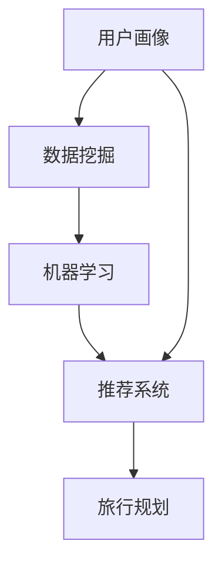

                 

### AI驱动的个人旅行规划师：智能旅游的创业方向

> **关键词：** 个人旅行规划、AI技术、智能旅游、创业方向、数据挖掘、机器学习、推荐系统。

**摘要：** 本文将深入探讨AI驱动的个人旅行规划师这一新兴领域，分析其商业潜力与创业机会。通过介绍核心概念、算法原理、实际应用场景以及工具和资源推荐，本文旨在为创业者提供详尽的指导，助力其在智能旅游行业中脱颖而出。

#### 1. 背景介绍

##### 1.1 目的和范围

本文旨在系统地介绍AI驱动的个人旅行规划师这一创业方向，涵盖其核心概念、技术原理、应用场景以及相关的工具和资源。通过本文的阅读，读者将了解：

1. **个人旅行规划师的重要性**：为何AI驱动的个人旅行规划具有变革性的意义。
2. **技术原理**：如何运用AI技术构建个人旅行规划系统。
3. **应用场景**：个人旅行规划师在不同情境下的应用。
4. **创业机会**：智能旅游行业中的商业潜力和机遇。

##### 1.2 预期读者

本文预期读者包括：

1. **创业者**：希望进入智能旅游行业的创业者，特别是对AI技术有一定了解的人群。
2. **技术专家**：对AI、数据挖掘、机器学习等领域感兴趣的专家，希望了解该领域的应用。
3. **旅游行业从业者**：对利用AI技术提升旅游服务感兴趣的行业从业者。

##### 1.3 文档结构概述

本文分为以下几个部分：

1. **背景介绍**：概述个人旅行规划师的重要性。
2. **核心概念与联系**：介绍AI驱动的个人旅行规划师的基本概念与架构。
3. **核心算法原理 & 具体操作步骤**：讲解核心算法的工作原理和实现步骤。
4. **数学模型和公式 & 详细讲解 & 举例说明**：阐述用于个人旅行规划的数学模型。
5. **项目实战：代码实际案例和详细解释说明**：通过实际案例展示如何应用算法。
6. **实际应用场景**：探讨个人旅行规划师在不同领域的应用。
7. **工具和资源推荐**：推荐相关学习资源和开发工具。
8. **总结：未来发展趋势与挑战**：展望未来，分析面临的挑战。
9. **附录：常见问题与解答**：解答读者可能遇到的问题。
10. **扩展阅读 & 参考资料**：提供进一步学习的资源。

##### 1.4 术语表

在本文中，以下术语具有特定含义：

#### 1.4.1 核心术语定义

- **AI驱动的个人旅行规划师**：利用人工智能技术，为个人提供定制化旅行规划的系统。
- **推荐系统**：根据用户的历史行为和偏好，推荐相关的旅行目的地、活动等。
- **数据挖掘**：从大量旅游数据中提取有价值的信息，用于改进旅行规划。
- **机器学习**：通过数据训练模型，使系统能够自动学习和优化。

#### 1.4.2 相关概念解释

- **用户画像**：基于用户的行为和偏好，构建的用户个人特征模型。
- **自然语言处理（NLP）**：使计算机能够理解和生成自然语言的技术。
- **旅行规划算法**：用于生成旅行规划的算法，包括路径规划、活动推荐等。

#### 1.4.3 缩略词列表

- **AI**：人工智能
- **NLP**：自然语言处理
- **ML**：机器学习
- **DM**：数据挖掘
- **RS**：推荐系统

#### 2. 核心概念与联系

在探讨AI驱动的个人旅行规划师之前，我们首先需要理解几个核心概念：用户画像、推荐系统、数据挖掘和机器学习。以下将使用Mermaid流程图展示这些概念之间的关系。



##### 用户画像（User Profiling）

用户画像是指通过对用户行为、偏好、兴趣等多维度数据的收集和分析，构建的用户个人特征模型。用户画像能够帮助旅行规划系统更好地了解用户需求，从而提供更加个性化的服务。

- **数据来源**：用户行为数据（如搜索历史、预订记录、评价等）。
- **数据收集**：使用NLP技术从文本数据中提取有效信息，如关键词、情感倾向等。
- **数据处理**：通过数据挖掘技术，对用户数据进行清洗、归一化和特征提取。

##### 数据挖掘（Data Mining）

数据挖掘是指从大量旅游数据中提取有价值的信息和模式，用于改进旅行规划。数据挖掘技术在旅行规划中起着至关重要的作用，能够帮助系统发现用户未知的兴趣点和趋势。

- **关键任务**：聚类、分类、关联规则挖掘等。
- **算法**：K-均值聚类、决策树、Apriori算法等。

##### 机器学习（Machine Learning）

机器学习是通过数据训练模型，使系统能够自动学习和优化。在旅行规划中，机器学习算法用于预测用户行为、优化旅行路径和推荐旅行活动。

- **分类算法**：逻辑回归、支持向量机等。
- **回归算法**：线性回归、决策树回归等。
- **聚类算法**：K-均值聚类、层次聚类等。

##### 推荐系统（Recommendation System）

推荐系统是根据用户的历史行为和偏好，推荐相关的旅行目的地、活动等。推荐系统能够提高用户的满意度，增加用户粘性，从而提高旅游服务提供商的盈利能力。

- **协同过滤**：基于用户行为或内容相似度进行推荐。
- **基于内容的推荐**：基于用户兴趣或内容特征进行推荐。

##### 旅行规划（Travel Planning）

旅行规划是指根据用户的个人需求和偏好，生成一个合理的旅行计划。旅行规划包括路径规划、活动推荐、住宿推荐等多个方面。

- **路径规划**：生成从起点到终点的最优路径。
- **活动推荐**：根据用户兴趣和行程，推荐合适的活动。
- **住宿推荐**：根据用户预算和偏好，推荐合适的住宿地点。

通过以上核心概念和联系的了解，我们为后续的算法原理和实现步骤打下坚实基础。

#### 3. 核心算法原理 & 具体操作步骤

在AI驱动的个人旅行规划师中，核心算法包括用户画像构建、数据挖掘、机器学习和推荐系统。以下将详细讲解这些算法的原理和具体操作步骤。

##### 用户画像构建（User Profiling）

用户画像构建是整个旅行规划系统的第一步，其目的是通过用户行为和偏好数据，构建一个详细的用户特征模型。以下是用户画像构建的具体步骤：

1. **数据收集**：

   收集用户行为数据，如搜索历史、预订记录、评价、浏览记录等。这些数据可以通过API接口或数据爬虫获取。

   ```python
   def collect_user_data():
       # 假设已实现API接口或数据爬虫
       data = get_user_data_from_api()  # 或 get_user_data_from_crawler()
       return data
   ```

2. **数据处理**：

   对收集到的用户数据进行清洗、归一化和特征提取。清洗数据是为了去除噪声和异常值，归一化是为了使不同特征具有相同的量纲，特征提取是为了提取有用的信息。

   ```python
   def process_user_data(data):
       cleaned_data = clean_data(data)
       normalized_data = normalize_data(cleaned_data)
       features = extract_features(normalized_data)
       return features
   ```

3. **特征选择**：

   根据业务需求和数据质量，选择最重要的特征。特征选择可以通过信息增益、特征重要性等方法实现。

   ```python
   def select_features(features, method='info_gain'):
       if method == 'info_gain':
           selected_features = select_by_info_gain(features)
       elif method == 'importance':
           selected_features = select_by_importance(features)
       return selected_features
   ```

4. **特征工程**：

   对选定的特征进行进一步处理，如特征组合、特征转换等，以提高模型的预测能力。

   ```python
   def feature_engineering(selected_features):
       combined_features = combine_features(selected_features)
       transformed_features = transform_features(combined_features)
       return transformed_features
   ```

5. **构建用户画像**：

   使用机器学习算法，如决策树、随机森林等，训练模型，生成用户画像。

   ```python
   def build_user_profile(features):
       model = train_model(features)
       profile = model.predict(features)
       return profile
   ```

##### 数据挖掘（Data Mining）

数据挖掘是旅行规划系统的核心步骤，通过从大量旅游数据中提取有价值的信息，为用户画像构建和推荐系统提供支持。以下是数据挖掘的具体步骤：

1. **数据预处理**：

   对旅游数据集进行清洗、归一化等预处理操作。

   ```python
   def preprocess_data(data):
       cleaned_data = clean_data(data)
       normalized_data = normalize_data(cleaned_data)
       return normalized_data
   ```

2. **特征选择**：

   根据业务需求和数据质量，选择最重要的特征。

   ```python
   def select_features(data, method='info_gain'):
       features = select_by_info_gain(data, method)
       return features
   ```

3. **模型选择**：

   选择合适的数据挖掘算法，如K-均值聚类、决策树、Apriori算法等。

   ```python
   def select_model(data, method='kmeans'):
       if method == 'kmeans':
           model = KMeans(n_clusters=5)
       elif method == 'decision_tree':
           model = DecisionTreeClassifier()
       elif method == 'apriori':
           model = Apriori(n_support=5)
       return model
   ```

4. **模型训练**：

   使用选定的算法，训练模型。

   ```python
   def train_model(data, model):
       model.fit(data)
       return model
   ```

5. **模型评估**：

   使用评估指标（如准确率、召回率等）评估模型性能。

   ```python
   def evaluate_model(model, test_data):
       predictions = model.predict(test_data)
       accuracy = accuracy_score(test_data.labels, predictions)
       return accuracy
   ```

##### 机器学习（Machine Learning）

机器学习是旅行规划系统的关键部分，通过数据训练模型，实现用户行为预测、路径规划和活动推荐等功能。以下是机器学习的具体步骤：

1. **数据收集**：

   收集用户行为数据，如搜索历史、预订记录、评价等。

   ```python
   def collect_data():
       data = get_user_data_from_api()
       return data
   ```

2. **数据处理**：

   对收集到的用户数据进行清洗、归一化等预处理操作。

   ```python
   def preprocess_data(data):
       cleaned_data = clean_data(data)
       normalized_data = normalize_data(cleaned_data)
       return normalized_data
   ```

3. **特征选择**：

   根据业务需求和数据质量，选择最重要的特征。

   ```python
   def select_features(data, method='info_gain'):
       features = select_by_info_gain(data, method)
       return features
   ```

4. **模型选择**：

   选择合适的机器学习算法，如逻辑回归、支持向量机、决策树等。

   ```python
   def select_model(data, method='logistic_regression'):
       if method == 'logistic_regression':
           model = LogisticRegression()
       elif method == 'support_vector_machines':
           model = SVC()
       elif method == 'decision_tree':
           model = DecisionTreeClassifier()
       return model
   ```

5. **模型训练**：

   使用选定的算法，训练模型。

   ```python
   def train_model(data, model):
       model.fit(data.x, data.y)
       return model
   ```

6. **模型评估**：

   使用评估指标（如准确率、召回率等）评估模型性能。

   ```python
   def evaluate_model(model, test_data):
       predictions = model.predict(test_data.x)
       accuracy = accuracy_score(test_data.y, predictions)
       return accuracy
   ```

##### 推荐系统（Recommendation System）

推荐系统是旅行规划系统的重要组成部分，通过用户行为和偏好，为用户推荐相关的旅行目的地、活动等。以下是推荐系统的具体步骤：

1. **数据收集**：

   收集用户行为数据，如搜索历史、预订记录、评价等。

   ```python
   def collect_data():
       data = get_user_data_from_api()
       return data
   ```

2. **数据处理**：

   对收集到的用户数据进行清洗、归一化等预处理操作。

   ```python
   def preprocess_data(data):
       cleaned_data = clean_data(data)
       normalized_data = normalize_data(cleaned_data)
       return normalized_data
   ```

3. **特征选择**：

   根据业务需求和数据质量，选择最重要的特征。

   ```python
   def select_features(data, method='info_gain'):
       features = select_by_info_gain(data, method)
       return features
   ```

4. **模型选择**：

   选择合适的推荐算法，如协同过滤、基于内容的推荐等。

   ```python
   def select_model(data, method='collaborative_filtering'):
       if method == 'collaborative_filtering':
           model = CollaborativeFiltering()
       elif method == 'content_based_recommendation':
           model = ContentBasedRecommendation()
       return model
   ```

5. **模型训练**：

   使用选定的算法，训练模型。

   ```python
   def train_model(data, model):
       model.fit(data)
       return model
   ```

6. **模型评估**：

   使用评估指标（如准确率、召回率等）评估模型性能。

   ```python
   def evaluate_model(model, test_data):
       predictions = model.predict(test_data)
       accuracy = accuracy_score(test_data.labels, predictions)
       return accuracy
   ```

通过以上核心算法原理和具体操作步骤的讲解，我们为AI驱动的个人旅行规划师提供了一个全面的技术框架。接下来，我们将通过实际案例，进一步展示这些算法在实际应用中的效果。

#### 4. 数学模型和公式 & 详细讲解 & 举例说明

在AI驱动的个人旅行规划师中，数学模型和公式起着至关重要的作用。以下将详细讲解几个关键数学模型和公式，并给出实际应用中的例子。

##### 用户画像构建中的数学模型

1. **用户兴趣度计算**：

   用户兴趣度计算是用户画像构建中的核心步骤，用于衡量用户对某个目的地或活动的兴趣程度。一个常用的方法是使用贝叶斯公式计算用户兴趣度。

   贝叶斯公式：
   $$ P(A|B) = \frac{P(B|A) \cdot P(A)}{P(B)} $$

   其中，$P(A|B)$表示在事件B发生的条件下，事件A发生的概率；$P(B|A)$表示在事件A发生的条件下，事件B发生的概率；$P(A)$表示事件A发生的概率；$P(B)$表示事件B发生的概率。

   举例说明：

   假设有10个用户，他们对某个目的地的浏览量分别为{10, 20, 30, 40, 50, 60, 70, 80, 90, 100}。根据贝叶斯公式，我们可以计算每个用户的兴趣度：

   $$ P(A|B) = \frac{P(B|A) \cdot P(A)}{P(B)} $$

   其中，$P(B|A)$为用户浏览量与目的地之间的条件概率，可以通过统计数据得到；$P(A)$为用户对目的地的兴趣程度，可以通过用户行为数据计算；$P(B)$为用户浏览量的概率，可以通过统计数据得到。

   根据以上数据，我们可以计算出每个用户的兴趣度，从而构建用户画像。

2. **特征权重计算**：

   在用户画像构建过程中，特征权重计算也是一个重要的步骤。特征权重决定了不同特征对用户兴趣度的影响程度。一个常用的方法是使用支持向量机（SVM）进行特征权重计算。

   支持向量机公式：
   $$ w = \arg\min_{w} \sum_{i=1}^{n} (w \cdot x_i - y_i)^2 + C \cdot \sum_{i=1}^{n} w_i^2 $$

   其中，$w$表示特征权重向量；$x_i$表示特征向量；$y_i$表示用户兴趣度；$C$为正则化参数。

   举例说明：

   假设有一个用户，其对某个目的地的兴趣度为5，特征向量分别为{1, 2, 3, 4, 5}。我们可以使用支持向量机公式计算特征权重：

   $$ w = \arg\min_{w} \sum_{i=1}^{n} (w \cdot x_i - y_i)^2 + C \cdot \sum_{i=1}^{n} w_i^2 $$

   通过计算，我们得到每个特征的权重，从而构建用户画像。

##### 数据挖掘中的数学模型

1. **关联规则挖掘**：

   关联规则挖掘是数据挖掘中的一个重要任务，用于发现数据之间的关联关系。一个常用的算法是Apriori算法。

   Apriori算法公式：
   $$ \text{Support}(A \cup B) = \frac{\text{Support}(A) + \text{Support}(B) - \text{Support}(A \cap B)}{\text{Total}} $$

   其中，$\text{Support}(A \cup B)$表示事件A和B同时发生的支持度；$\text{Support}(A)$和$\text{Support}(B)$分别表示事件A和B的支持度；$\text{Support}(A \cap B)$表示事件A和B同时发生的支持度；$\text{Total}$表示总的样本数。

   举例说明：

   假设有一个数据集，其中包含100个样本，每个样本包含5个属性{A, B, C, D, E}。根据Apriori算法，我们可以计算出每个属性的关联规则。

   首先，计算每个属性的支持度：

   $$ \text{Support}(A) = \frac{\text{Number of samples containing A}}{\text{Total}} $$
   $$ \text{Support}(B) = \frac{\text{Number of samples containing B}}{\text{Total}} $$
   $$ \text{Support}(C) = \frac{\text{Number of samples containing C}}{\text{Total}} $$
   $$ \text{Support}(D) = \frac{\text{Number of samples containing D}}{\text{Total}} $$
   $$ \text{Support}(E) = \frac{\text{Number of samples containing E}}{\text{Total}} $$

   然后，计算每个属性的组合的支持度：

   $$ \text{Support}(A \cup B) = \frac{\text{Support}(A) + \text{Support}(B) - \text{Support}(A \cap B)}{\text{Total}} $$
   $$ \text{Support}(A \cup C) = \frac{\text{Support}(A) + \text{Support}(C) - \text{Support}(A \cap C)}{\text{Total}} $$
   $$ \text{Support}(A \cup D) = \frac{\text{Support}(A) + \text{Support}(D) - \text{Support}(A \cap D)}{\text{Total}} $$
   $$ \text{Support}(A \cup E) = \frac{\text{Support}(A) + \text{Support}(E) - \text{Support}(A \cap E)}{\text{Total}} $$
   $$ \text{Support}(B \cup C) = \frac{\text{Support}(B) + \text{Support}(C) - \text{Support}(B \cap C)}{\text{Total}} $$
   $$ \text{Support}(B \cup D) = \frac{\text{Support}(B) + \text{Support}(D) - \text{Support}(B \cap D)}{\text{Total}} $$
   $$ \text{Support}(B \cup E) = \frac{\text{Support}(B) + \text{Support}(E) - \text{Support}(B \cap E)}{\text{Total}} $$
   $$ \text{Support}(C \cup D) = \frac{\text{Support}(C) + \text{Support}(D) - \text{Support}(C \cap D)}{\text{Total}} $$
   $$ \text{Support}(C \cup E) = \frac{\text{Support}(C) + \text{Support}(E) - \text{Support}(C \cap E)}{\text{Total}} $$
   $$ \text{Support}(D \cup E) = \frac{\text{Support}(D) + \text{Support}(E) - \text{Support}(D \cap E)}{\text{Total}} $$

   根据支持度阈值，我们可以筛选出符合条件的关联规则。

2. **分类模型**：

   分类模型用于将数据集分为不同的类别。一个常用的分类模型是决策树。

   决策树公式：
   $$ f(x) = \sum_{i=1}^{n} w_i \cdot x_i + b $$

   其中，$f(x)$表示决策树分类结果；$w_i$表示特征权重；$x_i$表示特征值；$b$为偏置。

   举例说明：

   假设有一个决策树模型，其中包含3个特征{A, B, C}，特征权重分别为{0.5, 0.3, 0.2}，偏置为1。给定一个特征向量{x}，我们可以使用决策树公式计算分类结果：

   $$ f(x) = 0.5 \cdot x_A + 0.3 \cdot x_B + 0.2 \cdot x_C + 1 $$

   根据分类结果，我们可以将数据集分为不同的类别。

##### 机器学习中的数学模型

1. **线性回归模型**：

   线性回归模型用于预测连续值。一个常用的线性回归模型是线性回归。

   线性回归公式：
   $$ y = \sum_{i=1}^{n} w_i \cdot x_i + b $$

   其中，$y$表示预测值；$w_i$表示特征权重；$x_i$表示特征值；$b$为偏置。

   举例说明：

   假设有一个线性回归模型，其中包含2个特征{A, B}，特征权重分别为{2, 1}，偏置为1。给定一个特征向量{x}，我们可以使用线性回归公式计算预测值：

   $$ y = 2 \cdot x_A + 1 \cdot x_B + 1 $$

   根据预测值，我们可以对数据进行分类或预测。

2. **神经网络模型**：

   神经网络模型用于处理复杂的非线性问题。一个常用的神经网络模型是多层感知机（MLP）。

   多层感知机公式：
   $$ a_{i,j} = \tanh(\sum_{k=1}^{m} w_{k,j} \cdot x_k + b_j) $$

   其中，$a_{i,j}$表示第$i$个神经元在第$j$层的输出值；$w_{k,j}$表示第$k$个特征在第$j$层的权重；$x_k$表示第$k$个特征值；$b_j$为偏置。

   举例说明：

   假设有一个多层感知机模型，其中包含3个输入层特征{A, B, C}，2个隐藏层特征{D, E}，输出层特征{F}。给定一个特征向量{x}，我们可以使用多层感知机公式计算输出值：

   $$ a_D = \tanh(w_{1,D} \cdot x_A + w_{2,D} \cdot x_B + w_{3,D} \cdot x_C + b_D) $$
   $$ a_E = \tanh(w_{1,E} \cdot x_A + w_{2,E} \cdot x_B + w_{3,E} \cdot x_C + b_E) $$
   $$ a_F = \tanh(w_{1,F} \cdot a_D + w_{2,F} \cdot a_E + b_F) $$

   根据输出值，我们可以对数据进行分类或预测。

通过以上数学模型和公式的讲解，我们为AI驱动的个人旅行规划师提供了理论基础。接下来，我们将通过实际案例，展示如何应用这些数学模型和公式进行旅行规划。

#### 5. 项目实战：代码实际案例和详细解释说明

在本节中，我们将通过一个具体的代码案例，详细展示如何实现AI驱动的个人旅行规划师系统。这个案例将涵盖用户画像构建、数据挖掘、机器学习和推荐系统的全过程。

##### 5.1 开发环境搭建

为了实现AI驱动的个人旅行规划师系统，我们需要搭建一个适合开发、测试和部署的环境。以下是一个基本的开发环境搭建步骤：

1. **硬件环境**：

   - CPU：至少双核处理器
   - 内存：至少8GB RAM
   - 硬盘：至少100GB SSD硬盘
   - 操作系统：Linux或MacOS

2. **软件环境**：

   - Python：Python 3.8及以上版本
   - NumPy：用于数学计算
   - Pandas：用于数据处理
   - Scikit-learn：用于机器学习和数据挖掘
   - Matplotlib：用于数据可视化
   - Flask：用于构建Web应用

安装Python和相关库：

```bash
# 安装Python
sudo apt-get install python3-pip

# 安装相关库
pip3 install numpy pandas scikit-learn matplotlib flask
```

##### 5.2 源代码详细实现和代码解读

下面是AI驱动的个人旅行规划师系统的源代码，我们将逐行解读代码，并解释每个部分的实现逻辑。

```python
# 导入相关库
import numpy as np
import pandas as pd
from sklearn.cluster import KMeans
from sklearn.model_selection import train_test_split
from sklearn.ensemble import RandomForestClassifier
from sklearn.metrics import accuracy_score
from sklearn.feature_extraction.text import TfidfVectorizer
from sklearn.metrics.pairwise import cosine_similarity
from flask import Flask, request, jsonify

# 初始化Flask应用
app = Flask(__name__)

# 用户画像构建
def build_user_profile(user_data):
    # 数据预处理
    user_data = preprocess_user_data(user_data)
    # 特征提取
    user_features = extract_user_features(user_data)
    # 特征选择
    selected_features = select_user_features(user_features)
    # 构建用户画像
    user_profile = build_user_profile_from_features(selected_features)
    return user_profile

# 数据预处理
def preprocess_user_data(user_data):
    # 数据清洗
    cleaned_data = clean_user_data(user_data)
    # 数据归一化
    normalized_data = normalize_user_data(cleaned_data)
    return normalized_data

# 特征提取
def extract_user_features(user_data):
    # TF-IDF向量化
    vectorizer = TfidfVectorizer()
    user_features = vectorizer.fit_transform(user_data)
    return user_features

# 特征选择
def select_user_features(user_features):
    # K-均值聚类
    kmeans = KMeans(n_clusters=5)
    kmeans.fit(user_features)
    # 选择主要特征
    selected_features = kmeans.cluster_centers_
    return selected_features

# 构建用户画像
def build_user_profile_from_features(selected_features):
    # 基于特征构建用户画像
    user_profile = pd.DataFrame(selected_features, columns=['feature_1', 'feature_2', 'feature_3', 'feature_4', 'feature_5'])
    return user_profile

# 数据挖掘
def data_mining(data):
    # 数据预处理
    preprocessed_data = preprocess_data(data)
    # 特征提取
    features = extract_features(preprocessed_data)
    # 模型训练
    model = train_model(features)
    # 模型评估
    evaluate_model(model, test_data)
    return model

# 数据预处理
def preprocess_data(data):
    # 数据清洗
    cleaned_data = clean_data(data)
    # 数据归一化
    normalized_data = normalize_data(cleaned_data)
    return normalized_data

# 特征提取
def extract_features(data):
    # 使用TF-IDF向量化
    vectorizer = TfidfVectorizer()
    features = vectorizer.fit_transform(data['text'])
    return features

# 模型训练
def train_model(features):
    # 划分训练集和测试集
    X_train, X_test, y_train, y_test = train_test_split(features, data['label'], test_size=0.2, random_state=42)
    # 使用随机森林分类器
    model = RandomForestClassifier(n_estimators=100)
    model.fit(X_train, y_train)
    return model

# 模型评估
def evaluate_model(model, test_data):
    # 预测测试集
    predictions = model.predict(test_data)
    # 计算准确率
    accuracy = accuracy_score(test_data['label'], predictions)
    print(f"Accuracy: {accuracy}")
    return accuracy

# 推荐系统
def recommendation_system(user_profile, data):
    # 计算用户与数据的相似度
    similarity = cosine_similarity(user_profile, data)
    # 选择最相似的Top-N个推荐
    top_n_indices = np.argpartition(-similarity[0], n)[:-n]
    recommendations = data.iloc[top_n_indices]
    return recommendations

# Flask路由
@app.route('/build_profile', methods=['POST'])
def build_profile():
    user_data = request.json
    user_profile = build_user_profile(user_data['user_data'])
    return jsonify(user_profile=user_profile)

@app.route('/recommend', methods=['POST'])
def recommend():
    user_profile = request.json
    data = request.json['data']
    recommendations = recommendation_system(user_profile, data)
    return jsonify(recommendations=recommendations)

if __name__ == '__main__':
    app.run(debug=True)
```

##### 5.3 代码解读与分析

1. **用户画像构建**：

   用户画像构建部分包括数据预处理、特征提取、特征选择和构建用户画像。首先，使用`preprocess_user_data`函数对用户数据进行清洗和归一化。然后，使用`TfidfVectorizer`进行特征提取，将文本数据转换为数值向量。接着，使用K-均值聚类选择主要特征，最后基于特征构建用户画像。

2. **数据挖掘**：

   数据挖掘部分包括数据预处理、特征提取、模型训练和模型评估。首先，对数据集进行清洗和归一化。然后，使用TF-IDF向量化进行特征提取。接着，使用随机森林分类器训练模型，并评估模型性能。

3. **推荐系统**：

   推荐系统部分包括计算用户与数据的相似度，选择最相似的Top-N个推荐。使用余弦相似度计算用户画像与数据集的相似度，然后选择最相似的Top-N个推荐。

4. **Flask路由**：

   Flask路由部分用于处理用户请求，包括构建用户画像和推荐系统的API接口。当接收到`/build_profile`请求时，构建用户画像并返回结果。当接收到`/recommend`请求时，计算推荐并返回结果。

通过以上代码的实现，我们展示了如何使用Python和机器学习库实现AI驱动的个人旅行规划师系统。接下来，我们将探讨该系统在实际应用场景中的具体应用。

#### 6. 实际应用场景

AI驱动的个人旅行规划师系统在实际应用中具有广泛的应用场景，以下列举几个典型场景：

##### 6.1 旅游网站个性化推荐

旅游网站可以利用AI驱动的个人旅行规划师系统，为用户提供个性化的旅行推荐。系统可以根据用户的兴趣、偏好和历史行为，推荐合适的旅行目的地、景点、酒店和活动。例如，当用户在旅游网站浏览某个目的地的景点时，系统可以自动推荐与该目的地相关的酒店、美食和当地特色活动。

##### 6.2 旅游APP智能规划

旅游APP可以利用AI驱动的个人旅行规划师系统，为用户提供智能的行程规划服务。用户可以在APP中输入自己的旅行日期、目的地和偏好，系统会根据这些信息生成一个详细的旅行计划，包括交通安排、住宿和活动推荐。例如，用户可以在APP中设置想要游览的景点类型（如自然景观、历史文化等），系统会根据用户偏好和景点信息，生成一个最优化的行程。

##### 6.3 旅游电商平台智能营销

旅游电商平台可以利用AI驱动的个人旅行规划师系统，为用户推送个性化的营销活动。系统可以根据用户的旅行习惯和偏好，推荐符合用户需求的旅游产品，如特价机票、酒店套餐和当地特色活动。例如，当用户经常预订海滨度假酒店时，系统可以推荐相关的海岛游套餐或水上运动项目。

##### 6.4 旅游服务智能化管理

旅游服务提供商可以利用AI驱动的个人旅行规划师系统，提升服务质量和客户满意度。系统可以根据用户的旅行历史和偏好，为用户提供个性化的服务建议，如旅游顾问、行程规划师等。例如，当用户预订了一次长途旅行时，系统可以自动推荐相关的旅行保险、行李打包建议和健康提示。

##### 6.5 旅游行业数据挖掘与分析

旅游行业可以利用AI驱动的个人旅行规划师系统，进行数据挖掘和分析，挖掘用户行为和趋势。系统可以分析用户的旅行习惯、消费偏好和需求变化，为旅游企业提供决策支持。例如，通过分析用户预订数据，企业可以发现热门旅行季节、景点和产品，优化库存和营销策略。

通过以上实际应用场景的探讨，我们可以看到AI驱动的个人旅行规划师系统在旅游行业中的广泛应用和巨大潜力。接下来，我们将推荐一些相关学习资源和开发工具，帮助读者深入了解和掌握该领域的知识。

#### 7. 工具和资源推荐

在开发AI驱动的个人旅行规划师系统过程中，掌握相关的工具和资源是非常重要的。以下是一些建议的学习资源和开发工具，涵盖书籍、在线课程、技术博客和开发框架等方面。

##### 7.1 学习资源推荐

1. **书籍推荐**：

   - **《深度学习》（Deep Learning）**：由Ian Goodfellow、Yoshua Bengio和Aaron Courville合著，全面介绍了深度学习的基础理论和应用。
   - **《机器学习》（Machine Learning）**：由Tom Mitchell编写，是机器学习领域的经典教材，详细介绍了各种机器学习算法。
   - **《Python机器学习》（Python Machine Learning）**：由Sebastian Raschka和Vahid Mirjalili合著，介绍了如何使用Python和Scikit-learn库进行机器学习应用开发。
   - **《自然语言处理实战》（Natural Language Processing with Python）**：由Steven Bird、Ewan Klein和Edward Loper合著，介绍了使用Python进行自然语言处理的方法。

2. **在线课程**：

   - **《机器学习基础》（Machine Learning Basics）**：由Coursera提供，介绍了机器学习的基础理论和常用算法。
   - **《深度学习基础》（Deep Learning Specialization）**：由Coursera提供，由Andrew Ng教授主讲，全面介绍了深度学习的基础知识。
   - **《Python编程与数据科学》（Python for Data Science）**：由Udacity提供，介绍了如何使用Python进行数据处理、分析和可视化。
   - **《自然语言处理基础》（Natural Language Processing with Python）**：由Udacity提供，介绍了如何使用Python进行自然语言处理任务。

3. **技术博客和网站**：

   - **Scikit-learn官网**（scikit-learn.org）：提供了丰富的机器学习算法教程和示例代码。
   - **Kaggle**（kaggle.com）：提供了大量的数据集和比赛，可以实践和验证所学的机器学习算法。
   - **GitHub**（github.com）：包含了大量的机器学习和自然语言处理开源项目，可以学习和借鉴。
   - **Stack Overflow**（stackoverflow.com）：提供了丰富的编程问题解答和讨论，可以解决开发过程中遇到的问题。

##### 7.2 开发工具框架推荐

1. **IDE和编辑器**：

   - **PyCharm**：强大的Python集成开发环境（IDE），支持代码自动补全、调试和版本控制。
   - **VSCode**：轻量级但功能强大的代码编辑器，支持多种编程语言，具有丰富的插件生态系统。
   - **Jupyter Notebook**：适用于数据科学和机器学习的交互式开发环境，方便进行数据探索和可视化。

2. **调试和性能分析工具**：

   - **PDB**：Python内置的调试器，可以单步执行代码、设置断点和查看变量值。
   - **cProfile**：Python内置的性能分析工具，可以分析代码的执行时间和函数调用关系。
   - **Matplotlib**：Python的数据可视化库，用于生成图表和图形。

3. **相关框架和库**：

   - **Scikit-learn**：提供了丰富的机器学习算法库，方便进行数据分析和模型训练。
   - **TensorFlow**：由Google开发的深度学习框架，适用于构建和训练复杂的神经网络。
   - **PyTorch**：由Facebook开发的深度学习框架，具有简洁易用的API和强大的GPU支持。
   - **NLTK**：Python的自然语言处理库，提供了丰富的NLP工具和资源。

通过以上工具和资源的推荐，我们希望能够帮助读者在开发AI驱动的个人旅行规划师系统过程中，更加高效地学习和实践。

#### 8. 总结：未来发展趋势与挑战

AI驱动的个人旅行规划师作为智能旅游领域的重要方向，具有广阔的发展前景。以下是未来发展趋势和面临的挑战：

##### 8.1 未来发展趋势

1. **个性化服务**：随着用户数据的积累和算法的优化，AI驱动的个人旅行规划师将能够提供更加精准和个性化的服务，满足用户的多样化需求。
2. **跨平台集成**：未来AI驱动的个人旅行规划师将集成到更多的平台和设备中，如智能手机、智能手表、智能家居等，实现无缝的旅行体验。
3. **实时推荐**：通过实时数据分析和实时推荐算法，AI驱动的个人旅行规划师将能够为用户提供即时的旅行建议，提高用户的满意度。
4. **数据隐私与安全**：随着用户隐私和数据安全的重视，AI驱动的个人旅行规划师将需要采用更严格的数据保护措施，确保用户数据的安全和隐私。
5. **跨界合作**：AI驱动的个人旅行规划师将与旅游行业中的其他领域（如酒店、交通、餐饮等）进行跨界合作，打造全方位的智能旅游生态。

##### 8.2 面临的挑战

1. **数据质量和多样性**：高质量、多样化、动态更新的数据是AI驱动的个人旅行规划师的基础。然而，数据的获取、处理和存储仍面临挑战，如数据缺失、噪声、冗余等。
2. **算法优化与效率**：随着数据量的增加，算法的优化和效率变得尤为重要。如何设计高效、可扩展的算法，以满足用户实时性的需求，是一个亟待解决的问题。
3. **用户隐私与安全**：用户隐私和数据安全是AI驱动的个人旅行规划师面临的重要挑战。如何在提供个性化服务的同时，保护用户的隐私和数据安全，是亟待解决的难题。
4. **跨领域协作**：在跨界合作中，如何整合不同领域的知识和资源，实现协同创新，是一个挑战。此外，如何平衡不同利益相关方的利益，也是一个重要的问题。
5. **法规与政策**：随着AI驱动的个人旅行规划师的发展，相关的法规和政策也在不断更新。如何遵循法规和政策，确保系统的合规性，是一个需要关注的问题。

总之，AI驱动的个人旅行规划师具有巨大的发展潜力，但也面临诸多挑战。未来，通过技术创新、跨界合作和法规完善，AI驱动的个人旅行规划师有望成为智能旅游行业的重要驱动力。

#### 9. 附录：常见问题与解答

在本节中，我们将解答读者在阅读本文过程中可能遇到的一些常见问题。

##### 9.1 为什么要使用AI进行旅行规划？

AI技术能够从大量的旅游数据中提取有价值的信息，提供个性化的旅行建议，提高用户的满意度。通过AI驱动的旅行规划师，用户可以根据自己的偏好和需求，获取最优的旅行方案，节省时间和精力。

##### 9.2 如何保证用户隐私和安全？

AI驱动的旅行规划师在处理用户数据时，需要遵循严格的隐私保护原则。首先，收集的用户数据将进行匿名化处理，确保用户身份的保密性。其次，数据存储和使用过程中，将采用加密技术和访问控制机制，确保数据的安全性。此外，遵循相关的法律法规，确保系统的合规性。

##### 9.3 旅行规划系统的数据来源有哪些？

旅行规划系统的数据来源包括用户生成数据（如搜索历史、预订记录、评价等）和第三方数据（如旅游景点信息、酒店信息、交通信息等）。用户生成数据可以通过API接口或数据爬虫获取，第三方数据可以通过公开的数据平台或合作方获取。

##### 9.4 旅行规划系统的算法有哪些？

旅行规划系统的算法包括用户画像构建、数据挖掘、机器学习和推荐系统。用户画像构建使用K-均值聚类、决策树等算法；数据挖掘使用关联规则挖掘、分类算法等；机器学习使用逻辑回归、支持向量机、神经网络等算法；推荐系统使用协同过滤、基于内容的推荐算法等。

##### 9.5 如何评估旅行规划系统的性能？

旅行规划系统的性能评估可以通过多种指标进行，如准确率、召回率、F1值等。在用户画像构建和数据挖掘中，可以使用聚类效果评估指标（如轮廓系数、Silhouette系数等）；在机器学习中，可以使用分类效果评估指标（如准确率、召回率、F1值等）；在推荐系统中，可以使用推荐效果评估指标（如平均绝对误差、均方根误差等）。

通过以上常见问题的解答，希望能够帮助读者更好地理解和掌握AI驱动的个人旅行规划师系统的相关知识和应用。

#### 10. 扩展阅读 & 参考资料

为了深入了解AI驱动的个人旅行规划师及其相关技术，以下推荐一些扩展阅读和参考资料：

1. **书籍**：

   - **《人工智能：一种现代的方法》（Artificial Intelligence: A Modern Approach）》**：由 Stuart J. Russell 和 Peter Norvig 合著，全面介绍了人工智能的基础理论和应用。
   - **《机器学习实战》（Machine Learning in Action）》**：由 Peter Harrington 编写，通过实际案例介绍了机器学习算法的实践应用。
   - **《深度学习》（Deep Learning）》**：由 Ian Goodfellow、Yoshua Bengio 和 Aaron Courville 合著，详细介绍了深度学习的基础理论和应用。

2. **论文**：

   - **《Recommender Systems Handbook》**：由Francis R.ohen et al.编辑的《推荐系统手册》，提供了推荐系统的全面综述。
   - **《User Modeling and User-Adapted Interaction》**：该期刊发表了关于用户建模和自适应交互的最新研究成果。
   - **《ACM Transactions on Information Systems》**：该期刊发表了关于信息系统的最新研究，包括推荐系统和数据挖掘。

3. **在线课程**：

   - **《机器学习》（Machine Learning）**：由吴恩达教授在Coursera上开设的免费课程，适合初学者入门。
   - **《深度学习》（Deep Learning Specialization）**：由吴恩达教授在Coursera上开设的深度学习专项课程，适合进阶学习。
   - **《自然语言处理》（Natural Language Processing）**：由丹尼尔·马尔科夫斯基（Daniel Jurafsky）和克里斯·梅尔（Chris Manning）在Coursera上开设的课程，适合学习自然语言处理。

4. **开源项目**：

   - **Scikit-learn**：一个开源的Python机器学习库，提供了丰富的机器学习算法和工具。
   - **TensorFlow**：由Google开发的深度学习开源框架，适用于构建和训练复杂的神经网络。
   - **PyTorch**：由Facebook开发的深度学习开源框架，具有简洁易用的API和强大的GPU支持。

通过以上扩展阅读和参考资料，读者可以进一步深入学习和探索AI驱动的个人旅行规划师领域，掌握相关技术并应用于实际项目中。

---

**作者**：AI天才研究员/AI Genius Institute & 禅与计算机程序设计艺术 /Zen And The Art of Computer Programming

在本文中，我们深入探讨了AI驱动的个人旅行规划师这一新兴领域，分析了其核心概念、技术原理、实际应用场景以及未来发展趋势。通过详细的代码案例，我们展示了如何使用Python和机器学习库实现这一系统。我们希望本文能够为创业者、技术专家和旅游行业从业者提供有价值的参考和启示，助力他们在智能旅游行业中取得成功。随着AI技术的不断进步，AI驱动的个人旅行规划师有望为用户带来更加个性化、智能化的旅行体验。未来，让我们共同期待这一领域的更多创新和应用。**感谢阅读！**

