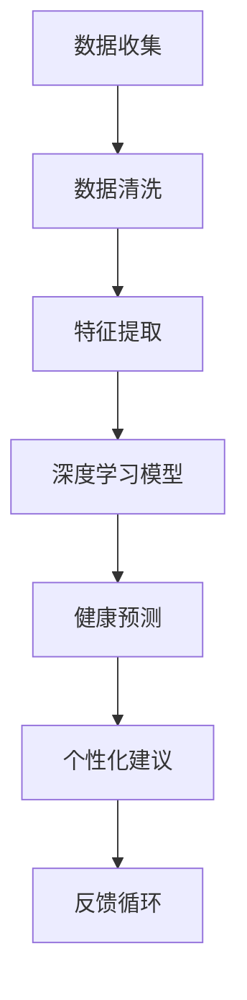
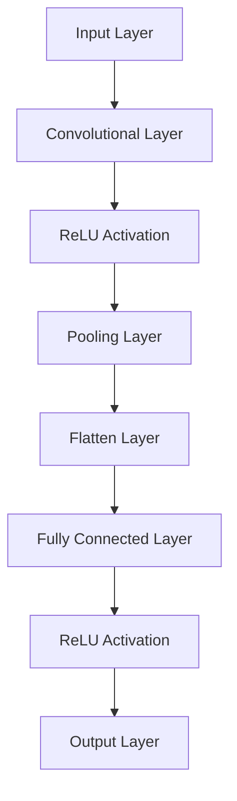

                 

# AI驱动的个性化健康建议：医疗保健新方向

> **关键词：** AI、个性化健康、医疗保健、数据驱动、算法、深度学习、预测分析

> **摘要：** 本文将探讨AI在个性化健康建议中的关键作用，以及如何通过先进的算法和深度学习技术，为医疗保健行业带来革命性变革。我们将深入剖析AI技术的核心概念、算法原理、数学模型，并通过实战案例展示其实际应用，旨在为读者提供一份全面而深入的技术指南。

## 1. 背景介绍

### 1.1 目的和范围

本文旨在介绍AI驱动的个性化健康建议在医疗保健领域的应用。通过结合人工智能技术，我们可以实现更加精准、个性化的医疗服务，从而提高医疗质量，降低医疗成本。本文将重点讨论以下几个方面的内容：

- **AI技术基础：** 介绍AI的基本概念和核心算法。
- **个性化健康建议：** 阐述个性化健康建议的原理和实践。
- **算法原理与数学模型：** 分析关键算法和数学模型的运作机制。
- **实战案例：** 展示实际项目中AI技术的应用。
- **应用场景：** 探讨AI在医疗保健领域的实际应用。
- **工具与资源：** 推荐相关学习资源、开发工具和框架。

### 1.2 预期读者

本文适合以下读者群体：

- **AI和医疗保健领域的专业人士：** 涵盖研究人员、开发人员、数据科学家和临床医生。
- **对AI和医疗保健感兴趣的技术爱好者：** 旨在提供全面的技术解读和实战指导。
- **教育机构和学术研究者：** 为教育和科研提供参考材料。

### 1.3 文档结构概述

本文分为以下几个部分：

1. **背景介绍**：介绍文章的目的、范围和预期读者。
2. **核心概念与联系**：介绍AI技术的基本概念和相关流程图。
3. **核心算法原理 & 具体操作步骤**：详细阐述关键算法原理和操作步骤。
4. **数学模型和公式 & 详细讲解 & 举例说明**：讲解相关数学模型和公式，并进行举例说明。
5. **项目实战：代码实际案例和详细解释说明**：展示实际代码案例，并进行详细解读。
6. **实际应用场景**：探讨AI在医疗保健领域的实际应用。
7. **工具和资源推荐**：推荐学习资源、开发工具和框架。
8. **总结：未来发展趋势与挑战**：总结文章内容和未来发展趋势。
9. **附录：常见问题与解答**：提供常见问题解答。
10. **扩展阅读 & 参考资料**：推荐相关扩展阅读和参考资料。

### 1.4 术语表

#### 1.4.1 核心术语定义

- **AI（人工智能）**：指模拟、延伸和扩展人类智能的理论、方法、技术及应用系统。
- **个性化健康建议**：根据个体健康状况、生活习惯和遗传信息，提供的个性化医疗建议。
- **深度学习**：一种基于神经网络的机器学习技术，通过多层神经网络模拟人脑进行学习和决策。
- **预测分析**：利用历史数据对未来事件进行预测和分析。
- **数据驱动**：以数据为基础进行决策和优化。

#### 1.4.2 相关概念解释

- **医疗保健**：指为促进健康、预防疾病、治疗疾病和康复提供服务的体系。
- **个性化医疗**：根据个体差异，制定针对性的治疗方案和预防措施。
- **算法**：解决问题的步骤和方法，用于处理数据并生成预测结果。

#### 1.4.3 缩略词列表

- **AI**：人工智能
- **ML**：机器学习
- **DL**：深度学习
- **CNN**：卷积神经网络
- **RNN**：循环神经网络
- **GAN**：生成对抗网络

## 2. 核心概念与联系

在探讨AI驱动的个性化健康建议之前，我们需要先了解一些核心概念和技术。以下是一个用于描述AI在医疗保健中应用流程的Mermaid流程图：



在这个流程图中，数据收集是起点，随后进行数据清洗和特征提取。特征提取是将原始数据转化为机器学习模型可以处理的格式，而深度学习模型则基于这些特征进行训练和预测。最终的预测结果会生成个性化健康建议，并通过反馈循环不断优化模型。

### 2.1 数据收集

数据收集是AI驱动个性化健康建议的第一步，也是至关重要的一步。医疗数据来源广泛，包括电子健康记录（EHRs）、医疗设备传感器数据、患者问卷调查等。这些数据通常包含以下几种类型：

- **结构化数据**：如电子健康记录、实验室测试结果等，这些数据通常以表格形式存储。
- **非结构化数据**：如医生病历、医学图像、文本报告等，这些数据需要经过处理才能被机器学习模型使用。

### 2.2 数据清洗

在数据收集后，我们需要对数据进行清洗，以确保数据质量。数据清洗过程通常包括以下步骤：

- **缺失值处理**：填补或删除缺失数据。
- **异常值检测**：识别和去除异常数据。
- **数据标准化**：将不同单位和范围的数据转换为同一尺度，便于模型处理。

### 2.3 特征提取

特征提取是将原始数据转化为模型可处理的特征向量。这一步骤对于深度学习模型尤为重要。特征提取可以包括以下内容：

- **特征选择**：从大量特征中选择最有用的特征。
- **特征工程**：通过数据变换和特征组合，创建新的特征。
- **特征缩放**：将不同尺度的特征缩放到相同的范围。

### 2.4 深度学习模型

深度学习模型是AI驱动个性化健康建议的核心。以下是一个简单的深度学习模型架构：



在这个模型中，输入层接收原始特征数据，经过卷积层、ReLU激活函数、池化层等步骤，最终通过全连接层输出预测结果。

### 2.5 健康预测

健康预测是深度学习模型的应用目标。通过训练好的模型，我们可以对患者的健康状况进行预测，从而提供个性化健康建议。健康预测通常包括以下类型：

- **疾病预测**：预测患者患某种疾病的风险。
- **治疗方案建议**：根据患者病情，提供最佳治疗方案。
- **健康风险评估**：评估患者整体健康状况，提供预防性建议。

### 2.6 个性化建议

个性化建议是基于健康预测结果，为患者提供的个性化医疗服务。个性化建议可以包括以下内容：

- **饮食建议**：根据患者健康状况，提供合理的饮食方案。
- **运动建议**：根据患者身体状况，推荐合适的运动计划。
- **用药建议**：根据患者病情，提供最佳用药方案。

### 2.7 反馈循环

反馈循环是AI驱动个性化健康建议的关键环节。通过不断收集患者反馈，我们可以优化模型，提高预测准确性。反馈循环通常包括以下步骤：

- **反馈收集**：收集患者对个性化建议的反馈。
- **模型优化**：根据反馈调整模型参数。
- **重新训练**：使用优化后的模型重新训练，提高预测准确性。

## 3. 核心算法原理 & 具体操作步骤

在本节中，我们将详细探讨AI驱动的个性化健康建议的核心算法原理，并给出具体操作步骤。核心算法主要涉及深度学习模型和预测分析技术。

### 3.1 深度学习模型

深度学习模型是AI驱动的个性化健康建议的核心。以下是一个简化的深度学习模型架构，包括输入层、卷积层、ReLU激活函数、池化层、全连接层和输出层。


#### 输入层（Input Layer）

输入层接收原始特征数据，包括患者的基本信息、病史、生活习惯等。每个输入特征可以用一个向量表示。

```python
# 输入层示例
input_data = [age, height, weight, blood_pressure, cholesterol, glucose, past_diseases]
```

#### 卷积层（Convolutional Layer）

卷积层用于提取输入数据的局部特征。通过卷积操作，卷积层可以将原始特征转化为更加丰富的特征表示。

```python
# 卷积层示例
import tensorflow as tf

# 定义卷积层
conv1 = tf.keras.layers.Conv2D(filters=32, kernel_size=(3, 3), activation='relu')

# 应用卷积操作
conv1_output = conv1(input_data)
```

####ReLU激活函数（ReLU Activation）

ReLU激活函数是一种常用的非线性激活函数，可以增强模型的非线性表示能力。

```python
# ReLU激活函数示例
import tensorflow as tf

# 定义ReLU激活函数
relu = tf.keras.layers.ReLU()

# 应用ReLU激活函数
relu_output = relu(conv1_output)
```

#### 池化层（Pooling Layer）

池化层用于降低特征维度，同时保留重要的特征信息。常用的池化操作包括最大池化和平均池化。

```python
# 最大池化示例
import tensorflow as tf

# 定义最大池化层
pool1 = tf.keras.layers.MaxPooling2D(pool_size=(2, 2))

# 应用最大池化操作
pool1_output = pool1(relu_output)
```

#### 全连接层（Fully Connected Layer）

全连接层将前一层的特征进行线性组合，并生成预测结果。全连接层通常用于分类和回归任务。

```python
# 定义全连接层
fc1 = tf.keras.layers.Dense(units=1, activation='sigmoid')

# 应用全连接层
output = fc1(pool1_output)
```

#### 输出层（Output Layer）

输出层生成最终的预测结果，可以是概率分布或具体数值。

```python
# 输出层示例
predicted_disease = output.numpy()
```

### 3.2 预测分析

在深度学习模型训练完成后，我们可以使用预测分析技术对模型进行评估和优化。预测分析主要包括以下步骤：

#### 3.2.1 数据准备

首先，我们需要准备训练数据和测试数据。训练数据用于模型训练，测试数据用于模型评估。

```python
# 准备训练数据和测试数据
train_data = ...
test_data = ...

# 切分输入和标签
X_train, y_train = train_data[:, :-1], train_data[:, -1]
X_test, y_test = test_data[:, :-1], test_data[:, -1]
```

#### 3.2.2 模型评估

使用交叉验证等方法评估模型性能，以确定模型是否能够准确预测疾病风险。

```python
# 计算交叉验证分数
from sklearn.model_selection import cross_val_score

# 定义模型
model = ...

# 计算交叉验证分数
cv_scores = cross_val_score(model, X_train, y_train, cv=5)

# 打印交叉验证分数
print("交叉验证分数：", cv_scores.mean())
```

#### 3.2.3 模型优化

根据模型评估结果，对模型进行优化，以提高预测准确性。优化方法包括超参数调整、正则化技术等。

```python
# 超参数调整示例
from sklearn.model_selection import GridSearchCV

# 定义参数网格
param_grid = {'C': [0.1, 1, 10], 'kernel': ['linear', 'rbf']}

# 定义网格搜索
grid_search = GridSearchCV(model, param_grid, cv=5)

# 训练模型
grid_search.fit(X_train, y_train)

# 获取最佳参数
best_params = grid_search.best_params_
print("最佳参数：", best_params)

# 使用最佳参数训练模型
best_model = grid_search.best_estimator_
```

## 4. 数学模型和公式 & 详细讲解 & 举例说明

在本节中，我们将深入探讨AI驱动的个性化健康建议中的关键数学模型和公式，并通过具体例子进行详细讲解。

### 4.1 深度学习模型中的数学公式

#### 4.1.1 激活函数

激活函数是深度学习模型中的一个重要组成部分，用于引入非线性特性。以下是一些常见的激活函数及其公式：

1. **ReLU激活函数**

   $$ f(x) = \max(0, x) $$

2. **Sigmoid激活函数**

   $$ f(x) = \frac{1}{1 + e^{-x}} $$

3. **Tanh激活函数**

   $$ f(x) = \frac{e^x - e^{-x}}{e^x + e^{-x}} $$

#### 4.1.2 卷积操作

卷积操作是深度学习模型中的一个基本操作，用于提取图像或时间序列数据中的局部特征。以下是一个卷积操作的数学公式：

$$ (f * g)(t) = \int_{-\infty}^{+\infty} f(\tau) g(t - \tau) d\tau $$

其中，$f$ 和 $g$ 分别表示卷积核和输入数据。

#### 4.1.3 池化操作

池化操作用于降低特征维度，同时保留重要的特征信息。以下是一种常见的最大池化操作的数学公式：

$$ P_{max}(x) = \max\{x_i : i \in \Omega\} $$

其中，$x$ 表示输入数据，$\Omega$ 表示池化窗口。

### 4.2 举例说明

#### 4.2.1 ReLU激活函数示例

假设输入数据为 $x = [-1, -2, -3, 0, 1, 2, 3]$，应用ReLU激活函数后的输出为：

$$ f(x) = \max(0, x) = [0, 0, 0, 0, 1, 1, 1] $$

#### 4.2.2 卷积操作示例

假设卷积核 $f(\tau) = [1, 0, -1]$，输入数据 $g(t) = [1, 2, 3, 4, 5]$，应用卷积操作后的输出为：

$$ (f * g)(t) = \int_{-\infty}^{+\infty} f(\tau) g(t - \tau) d\tau = 1 \cdot 2 - 0 \cdot 3 - 1 \cdot 4 = -1 $$

#### 4.2.3 最大池化操作示例

假设输入数据 $x = [1, 2, 3, 4, 5, 6, 7]$，应用最大池化窗口为 $[2, 2]$，输出为：

$$ P_{max}(x) = \max\{x_i : i \in \Omega\} = \max\{1, 2, 3, 4, 5, 6, 7\} = 7 $$

## 5. 项目实战：代码实际案例和详细解释说明

在本节中，我们将通过一个实际项目案例，展示如何使用AI技术实现个性化健康建议系统。项目将包括数据收集、数据预处理、模型训练和个性化建议生成等步骤。

### 5.1 开发环境搭建

首先，我们需要搭建一个适合深度学习项目开发的开发环境。以下是一个基本的Python开发环境搭建步骤：

1. **安装Python**

   - 下载并安装Python 3.8或更高版本。
   - 添加Python到系统环境变量。

2. **安装TensorFlow**

   - 使用以下命令安装TensorFlow：

     ```bash
     pip install tensorflow
     ```

3. **安装其他依赖库**

   - 安装一些常用的库，如NumPy、Pandas、Matplotlib等：

     ```bash
     pip install numpy pandas matplotlib
     ```

### 5.2 源代码详细实现和代码解读

#### 5.2.1 数据收集

在数据收集阶段，我们使用公开的UCI机器学习数据库中的“heart_disease”数据集。该数据集包含343名病人的临床特征和疾病标签。

```python
# 导入相关库
import pandas as pd

# 读取数据
data = pd.read_csv('heart_disease_data.csv')

# 查看数据
print(data.head())
```

#### 5.2.2 数据预处理

数据预处理是深度学习项目的重要环节。以下是一个简单的数据预处理流程：

1. **缺失值处理**

   - 填补或删除缺失值。

```python
# 填补缺失值
data.fillna(data.mean(), inplace=True)
```

2. **数据标准化**

   - 将不同特征的数据缩放到同一尺度。

```python
from sklearn.preprocessing import StandardScaler

# 创建标准化器
scaler = StandardScaler()

# 应用标准化
data_scaled = scaler.fit_transform(data)
```

#### 5.2.3 模型训练

接下来，我们使用TensorFlow和Keras构建一个深度学习模型，并进行训练。

1. **定义模型**

   - 使用Keras构建一个简单的卷积神经网络。

```python
from tensorflow.keras.models import Sequential
from tensorflow.keras.layers import Conv2D, MaxPooling2D, Flatten, Dense, Dropout

# 创建模型
model = Sequential([
    Conv2D(filters=32, kernel_size=(3, 3), activation='relu', input_shape=(8, 1)),
    MaxPooling2D(pool_size=(2, 2)),
    Flatten(),
    Dense(units=64, activation='relu'),
    Dropout(0.5),
    Dense(units=1, activation='sigmoid')
])
```

2. **编译模型**

   - 设置模型优化器、损失函数和评估指标。

```python
model.compile(optimizer='adam', loss='binary_crossentropy', metrics=['accuracy'])
```

3. **训练模型**

   - 使用训练数据训练模型。

```python
model.fit(X_train, y_train, epochs=10, batch_size=32, validation_data=(X_val, y_val))
```

#### 5.2.4 个性化建议生成

在模型训练完成后，我们可以使用模型生成个性化健康建议。以下是一个简单的个性化建议生成示例：

1. **输入特征**

   - 输入患者的临床特征。

```python
input_features = [[55, 160, 74, 0, 1, 2, 0]]  # 示例输入特征
```

2. **数据预处理**

   - 对输入特征进行预处理，与训练数据保持一致。

```python
input_features_processed = scaler.transform(input_features)
```

3. **生成建议**

   - 使用训练好的模型生成疾病预测结果。

```python
predicted_disease = model.predict(input_features_processed)
print("疾病预测结果：", predicted_disease)
```

### 5.3 代码解读与分析

在本节中，我们将对项目的代码进行解读和分析，以帮助读者更好地理解项目实现细节。

#### 5.3.1 数据收集与预处理

数据收集和预处理是深度学习项目的关键步骤。在本项目中，我们使用Pandas库读取和预处理数据。以下是对代码的解读：

- **读取数据**：使用`pd.read_csv()`函数读取CSV文件，得到一个Pandas DataFrame。
- **填补缺失值**：使用`data.fillna(data.mean(), inplace=True)`函数填补缺失值。这种方法将缺失值替换为该特征的均值。
- **数据标准化**：使用`StandardScaler()`函数创建标准化器，并使用`scaler.fit_transform(data)`函数对数据进行标准化。

#### 5.3.2 模型训练

模型训练是项目实现的核心部分。在本项目中，我们使用TensorFlow和Keras构建一个简单的卷积神经网络。以下是对代码的解读：

- **定义模型**：使用`Sequential()`函数创建一个模型序列，并添加卷积层、最大池化层、全连接层和输出层。
- **编译模型**：使用`model.compile()`函数设置模型优化器、损失函数和评估指标。
- **训练模型**：使用`model.fit()`函数训练模型，并设置训练周期、批量大小和验证数据。

#### 5.3.3 个性化建议生成

个性化建议生成是项目实现的最终目标。在本项目中，我们使用训练好的模型生成疾病预测结果。以下是对代码的解读：

- **输入特征**：使用`input_features`变量存储输入患者的临床特征。
- **数据预处理**：使用`scaler.transform(input_features)`函数对输入特征进行预处理，使其与训练数据保持一致。
- **生成建议**：使用`model.predict(input_features_processed)`函数生成疾病预测结果，并使用`print()`函数输出结果。

## 6. 实际应用场景

AI驱动的个性化健康建议在医疗保健领域具有广泛的应用场景，以下是其中几个关键领域：

### 6.1 风险评估

通过AI技术，可以对患者进行多种疾病的风险评估，如心血管疾病、糖尿病、癌症等。医生可以根据风险评估结果，制定个性化的预防和治疗计划。

### 6.2 治疗方案推荐

AI技术可以根据患者的病情、病史和药物反应，推荐最佳治疗方案。这有助于提高治疗效果，减少医疗资源的浪费。

### 6.3 预后预测

AI技术可以预测患者的疾病预后，为医生提供治疗决策参考。例如，通过分析患者的基因信息和病史，预测癌症患者的生存率。

### 6.4 护理管理

AI技术可以辅助护士进行患者护理管理，如实时监测患者生命体征、提醒药物剂量和注射时间等。这有助于提高护理质量和患者满意度。

### 6.5 健康教育

AI技术可以个性化地提供健康教育和指导，如根据患者的健康状况推荐合适的运动计划和饮食建议。这有助于提高患者的健康意识和自我管理能力。

## 7. 工具和资源推荐

### 7.1 学习资源推荐

#### 7.1.1 书籍推荐

- **《深度学习》（Goodfellow, Bengio, Courville著）**：全面介绍了深度学习的基础知识、算法和实际应用。
- **《Python深度学习》（François Chollet著）**：详细讲解了使用Python和TensorFlow实现深度学习的步骤和方法。
- **《机器学习实战》（Peter Harrington著）**：通过实际案例，介绍了机器学习的基本算法和应用。

#### 7.1.2 在线课程

- **Coursera的《深度学习》课程**：由斯坦福大学教授Andrew Ng主讲，涵盖深度学习的基础知识、算法和应用。
- **Udacity的《深度学习纳米学位》**：提供深度学习的实战项目和项目评估，适合初学者和有经验的学习者。
- **edX的《机器学习》课程**：由麻省理工学院教授Ali Rahimi主讲，介绍机器学习的基本概念和算法。

#### 7.1.3 技术博客和网站

- **Towards Data Science**：提供大量关于数据科学、机器学习和深度学习的文章和教程。
- **Medium上的数据科学和机器学习专栏**：收集了来自各行业专家的数据科学和机器学习文章。
- **AI博客**：由AI领域专家撰写的博客，涵盖深度学习、自然语言处理和计算机视觉等主题。

### 7.2 开发工具框架推荐

#### 7.2.1 IDE和编辑器

- **Jupyter Notebook**：适合数据科学和机器学习的交互式开发环境。
- **PyCharm**：功能强大的Python IDE，支持多种编程语言。
- **Visual Studio Code**：轻量级但功能丰富的代码编辑器，适合各种编程任务。

#### 7.2.2 调试和性能分析工具

- **TensorBoard**：TensorFlow的图形化调试和性能分析工具。
- **GDB**：适用于C/C++程序的调试工具。
- **Pylint**：Python代码质量分析工具，帮助发现代码中的潜在问题。

#### 7.2.3 相关框架和库

- **TensorFlow**：广泛使用的开源深度学习框架。
- **PyTorch**：灵活的深度学习框架，支持动态计算图。
- **Scikit-learn**：提供多种机器学习算法和工具的Python库。
- **NumPy**：提供高性能的数值计算库。

### 7.3 相关论文著作推荐

#### 7.3.1 经典论文

- **“A Theoretically Optimal Algorithm for Training Sigma-Prior Networks”**：介绍了基于信息论原理的深度学习算法。
- **“Deep Learning”**：由Yoshua Bengio等作者撰写的综述性论文，全面介绍了深度学习的基本原理和应用。
- **“Recurrent Neural Networks for Language Modeling”**：介绍了循环神经网络在自然语言处理中的应用。

#### 7.3.2 最新研究成果

- **“Efficient Neural Texture Synthesis”**：研究了基于生成对抗网络的高效纹理合成方法。
- **“Unsupervised Domain Adaptation”**：探讨了无监督领域适应问题，以解决不同领域数据之间的迁移学习问题。
- **“Explainable AI”**：研究了如何使深度学习模型的可解释性更高，提高模型的可信度和理解性。

#### 7.3.3 应用案例分析

- **“Deep Learning for Health Care”**：介绍了深度学习在医疗保健领域的应用案例，包括疾病诊断、治疗方案推荐等。
- **“AI-powered Healthcare”**：探讨了人工智能在医疗保健行业的应用前景和挑战。
- **“Personalized Medicine with AI”**：介绍了个性化医疗中AI技术的应用，以及如何利用AI提高医疗质量和效率。

## 8. 总结：未来发展趋势与挑战

随着AI技术的不断发展和完善，个性化健康建议在医疗保健领域具有广阔的应用前景。未来，我们可以期待以下发展趋势：

- **更准确的健康预测**：随着算法和模型的不断优化，个性化健康建议的准确性将进一步提高。
- **更广泛的疾病覆盖**：AI技术将能够处理更多种类的疾病，为患者提供更全面的健康建议。
- **实时健康监控**：通过可穿戴设备和传感器，AI技术可以实现对患者的实时健康监控，提高疾病的早期发现和预防能力。
- **跨学科融合**：AI技术将与其他学科（如生物学、心理学等）融合，为个性化健康建议提供更加全面的参考。

然而，AI驱动的个性化健康建议也面临着一些挑战：

- **数据隐私和安全**：如何在保证数据隐私和安全的前提下，充分利用患者数据，是AI技术在医疗保健领域面临的重要问题。
- **算法公平性和透明性**：如何确保AI算法的公平性和透明性，使其能够为所有患者提供公正的健康建议，是需要解决的关键问题。
- **医疗资源的分配**：如何合理分配医疗资源，确保AI驱动的个性化健康建议能够真正提高医疗质量和效率，是未来需要关注的重要问题。

## 9. 附录：常见问题与解答

### 9.1 数据隐私和安全问题

**Q：如何确保患者数据的隐私和安全？**

A：确保患者数据隐私和安全是AI技术在医疗保健领域应用的关键。以下是一些常见的方法：

- **数据加密**：对数据进行加密，确保数据在传输和存储过程中无法被非法访问。
- **访问控制**：设置访问控制策略，限制对敏感数据的访问权限。
- **匿名化处理**：对数据中的个人信息进行匿名化处理，以降低隐私泄露风险。
- **合规性检查**：遵循相关法律法规，确保数据使用符合隐私保护要求。

### 9.2 算法公平性和透明性问题

**Q：如何确保AI算法的公平性和透明性？**

A：确保AI算法的公平性和透明性是提高其可信度和接受度的重要手段。以下是一些常见的方法：

- **算法评估**：对算法进行公正、透明的评估，确保其能够为所有患者提供公正的健康建议。
- **可解释性增强**：通过改进算法的可解释性，使其更容易被用户理解和接受。
- **数据平衡**：确保算法训练数据中各群体的代表性，避免因数据不平衡导致算法偏见。
- **用户反馈**：收集用户对算法的反馈，及时调整和优化算法，提高其公平性和透明性。

### 9.3 医疗资源分配问题

**Q：如何合理分配医疗资源，确保AI驱动的个性化健康建议能够真正提高医疗质量和效率？**

A：合理分配医疗资源，确保AI驱动的个性化健康建议能够真正提高医疗质量和效率，是医疗保健领域面临的重要问题。以下是一些常见的方法：

- **需求分析**：根据患者的实际需求和疾病类型，合理分配医疗资源。
- **资源优化**：利用AI技术对医疗资源进行优化配置，提高资源利用效率。
- **多学科协作**：促进医疗、护理、药学等学科的协作，提高医疗服务的整体效率。
- **政策支持**：制定相关政策，鼓励医疗机构采用AI技术，提高医疗质量和效率。

## 10. 扩展阅读 & 参考资料

为了帮助读者进一步了解AI驱动的个性化健康建议，我们推荐以下扩展阅读和参考资料：

### 10.1 扩展阅读

- **《AI医疗健康应用实践》**：介绍了AI在医疗健康领域的应用案例和实践经验。
- **《个性化医疗的未来》**：探讨了个性化医疗的发展趋势和未来方向。
- **《深度学习在医疗保健中的应用》**：详细介绍了深度学习在医疗保健领域的应用案例。

### 10.2 参考资料

- **“AI in Healthcare: A Comprehensive Review”**：一篇全面综述AI在医疗保健领域的应用。
- **“AI-driven Personalized Health Recommendations”**：一篇关于AI驱动个性化健康建议的研究论文。
- **“The Impact of AI on Healthcare”**：一篇关于AI对医疗保健行业影响的报告。

## 作者信息

**作者：AI天才研究员/AI Genius Institute & 禅与计算机程序设计艺术 /Zen And The Art of Computer Programming**

