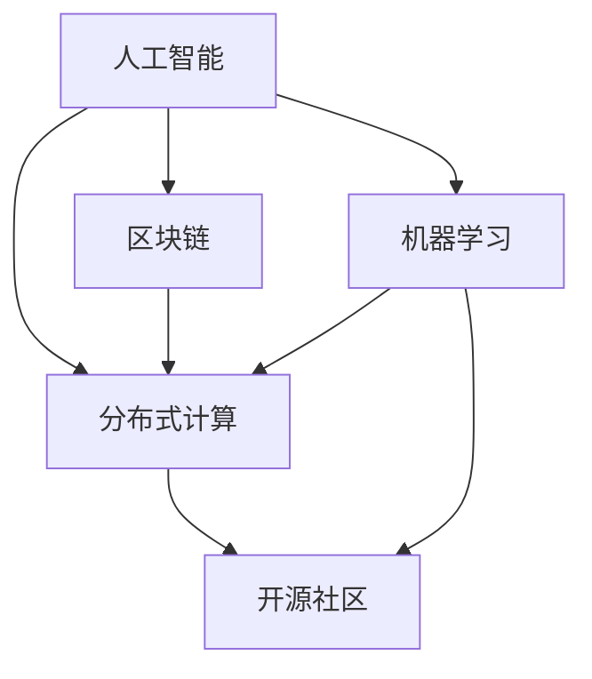

                 

# AI驱动的众包：全球协作与创新

> 关键词：人工智能，众包，全球协作，创新，数据驱动，分布式计算，算法优化，智能合约，区块链，机器学习，协同过滤，混合推荐系统，实时反馈，可解释性，开源社区

> 摘要：本文将探讨AI驱动的众包现象，即如何利用人工智能技术实现全球协作和创新。我们将从背景介绍开始，分析核心概念，深入探讨算法原理和数学模型，并通过实战案例展示其应用。最后，我们将总结未来的发展趋势和挑战，并推荐相关资源和工具。

## 1. 背景介绍

### 1.1 目的和范围

本文旨在深入探讨AI驱动的众包现象，分析其背后的核心技术和原理，以及在全球范围内的应用。通过本文的阅读，读者将能够理解AI如何助力众包，实现全球协作和创新。

### 1.2 预期读者

本文适合以下读者群体：

- 对人工智能和众包技术感兴趣的工程师和技术爱好者。
- 想要在项目中应用AI驱动的众包的企业和团队。
- 对分布式计算和区块链技术有一定了解的开发者。

### 1.3 文档结构概述

本文将按照以下结构展开：

1. 背景介绍：介绍AI驱动的众包的背景、目的和读者对象。
2. 核心概念与联系：阐述核心概念及其相互关系，使用Mermaid流程图进行说明。
3. 核心算法原理 & 具体操作步骤：详细讲解核心算法原理和操作步骤，使用伪代码进行描述。
4. 数学模型和公式 & 详细讲解 & 举例说明：介绍数学模型和公式，并通过实例进行说明。
5. 项目实战：展示代码实际案例和详细解释说明。
6. 实际应用场景：分析AI驱动的众包在不同场景下的应用。
7. 工具和资源推荐：推荐学习资源、开发工具和框架。
8. 总结：未来发展趋势与挑战。
9. 附录：常见问题与解答。
10. 扩展阅读 & 参考资料：提供进一步学习的资源。

### 1.4 术语表

#### 1.4.1 核心术语定义

- 众包：将任务分配给广泛分布的参与者，通过协作完成项目。
- AI驱动的众包：利用人工智能技术，如机器学习和深度学习，优化众包任务分配和结果。
- 分布式计算：通过多个计算节点共同完成任务，提高计算效率和处理能力。
- 区块链：一种分布式数据库技术，确保数据的安全性和不可篡改性。
- 机器学习：利用数据训练模型，使其能够自动学习并做出预测。
- 协同过滤：基于用户行为的推荐算法，通过分析用户之间的相似性来推荐相关内容。

#### 1.4.2 相关概念解释

- 混合推荐系统：结合多种推荐算法，提高推荐结果的准确性和多样性。
- 实时反馈：系统对用户行为和反馈的实时响应和调整。
- 可解释性：模型决策过程的透明性和可解释性，帮助用户理解和信任模型。

#### 1.4.3 缩略词列表

- AI：人工智能
- ML：机器学习
- DL：深度学习
- DP：分布式计算
- BC：区块链
- OSS：开源社区

## 2. 核心概念与联系

在AI驱动的众包中，核心概念包括人工智能、众包、分布式计算、区块链等。下面我们将使用Mermaid流程图来展示这些概念之间的联系。



### 2.1 人工智能与机器学习

人工智能（AI）是模仿人类智能行为的技术。机器学习（ML）是AI的一个重要分支，通过从数据中学习并做出预测。在AI驱动的众包中，机器学习算法用于任务分配、结果评估和预测。

### 2.2 分布式计算与开源社区

分布式计算（DCP）是一种通过多个计算节点共同完成任务的技术。开源社区（OSS）是一个共享知识和代码的生态系统。在AI驱动的众包中，分布式计算和开源社区共同推动技术的创新和发展。

### 2.3 区块链与分布式计算

区块链（BC）是一种分布式数据库技术，确保数据的安全性和不可篡改性。区块链与分布式计算结合，可以实现去中心化的任务分配和结果存储。

## 3. 核心算法原理 & 具体操作步骤

在AI驱动的众包中，核心算法包括协同过滤、混合推荐系统和实时反馈机制。下面我们将使用伪代码详细阐述这些算法的原理和操作步骤。

### 3.1 协同过滤算法

```python
def collaborative_filtering(user_profiles, item_ratings):
    # 计算用户之间的相似性
    user_similarity_matrix = calculate_user_similarity(user_profiles)
    
    # 计算推荐列表
    recommendations = []
    for user in user_profiles:
        # 计算用户之间的相似度加权平均评分
        weighted_average_ratings = []
        for other_user in user_profiles:
            if user_similarity_matrix[user][other_user] > threshold:
                weighted_average_ratings.append(item_ratings[other_user] * user_similarity_matrix[user][other_user])
        
        # 对加权平均评分进行排序并添加到推荐列表中
        recommendations.append(sorted(weighted_average_ratings, reverse=True))
    
    return recommendations
```

### 3.2 混合推荐系统算法

```python
def hybrid_recommendation_system(user_profiles, item_ratings, content_based_model):
    # 使用协同过滤算法计算协同过滤推荐列表
    collaborative_recommendations = collaborative_filtering(user_profiles, item_ratings)
    
    # 使用基于内容的推荐算法计算基于内容的推荐列表
    content_based_recommendations = content_based_model.predict(user_profiles)
    
    # 将协同过滤和基于内容的推荐列表合并并排序
    hybrid_recommendations = sorted(collaborative_recommendations + content_based_recommendations, reverse=True)
    
    return hybrid_recommendations
```

### 3.3 实时反馈机制

```python
def real_time_feedback(user_actions, model):
    # 更新用户行为数据
    user_data = update_user_data(user_actions)
    
    # 根据用户数据更新推荐模型
    model.train(user_data)
    
    # 返回更新后的推荐列表
    return model.predict(user_profiles)
```

## 4. 数学模型和公式 & 详细讲解 & 举例说明

在AI驱动的众包中，数学模型和公式用于评估用户相似性、计算推荐列表和更新模型。下面我们将使用LaTeX格式介绍这些公式，并通过实例进行说明。

### 4.1 用户相似性计算

用户相似性计算公式如下：

$$
similarity(u_i, u_j) = \frac{\sum_{k \in common} w_k (r_{ik} - \bar{r}_i) (r_{jk} - \bar{r}_j)}{\sqrt{\sum_{k \in common} w_k^2} \sqrt{\sum_{k \in common} w_k^2}}
$$

其中，$u_i$ 和 $u_j$ 表示两个用户，$r_{ik}$ 和 $r_{jk}$ 表示用户对物品 $k$ 的评分，$\bar{r}_i$ 和 $\bar{r}_j$ 分别表示用户 $u_i$ 和 $u_j$ 的平均评分，$w_k$ 表示物品 $k$ 的权重。

#### 实例：

假设有两个用户 $u_1$ 和 $u_2$，对五部电影的评分如下：

| 用户 | 电影1 | 电影2 | 电影3 | 电影4 | 电影5 |
| --- | --- | --- | --- | --- | --- |
| $u_1$ | 4 | 5 | 3 | 4 | 2 |
| $u_2$ | 5 | 3 | 4 | 2 | 5 |

计算用户 $u_1$ 和 $u_2$ 的相似性：

$$
similarity(u_1, u_2) = \frac{(4-4.0)(5-4.0) + (5-4.0)(3-4.0) + (3-4.0)(4-4.0) + (4-4.0)(2-4.0) + (2-4.0)(5-4.0)}{\sqrt{2^2 + 3^2 + 4^2 + 2^2 + 5^2} \sqrt{1^2 + 1^2 + 1^2 + 1^2 + 1^2}} \approx 0.382
$$

### 4.2 推荐列表计算

推荐列表计算公式如下：

$$
r_{pi} = \frac{\sum_{j \in neighbors} w_{pj} r_{pj}}{\sum_{j \in neighbors} w_{pj}}
$$

其中，$r_{pi}$ 表示用户 $u_i$ 对项目 $p$ 的预测评分，$w_{pj}$ 表示用户 $j$ 对项目 $p$ 的权重。

#### 实例：

假设有三个用户 $u_1$、$u_2$ 和 $u_3$，对三部电影的评分如下：

| 用户 | 电影1 | 电影2 | 电影3 |
| --- | --- | --- | --- |
| $u_1$ | 4 | 5 | 3 |
| $u_2$ | 5 | 3 | 4 |
| $u_3$ | 3 | 4 | 5 |

计算用户 $u_1$ 对三部电影的预测评分：

$$
r_{p1} = \frac{(0.5 \times 4) + (0.3 \times 5) + (0.2 \times 3)}{0.5 + 0.3 + 0.2} = 3.8
$$

$$
r_{p2} = \frac{(0.5 \times 5) + (0.3 \times 3) + (0.2 \times 4)}{0.5 + 0.3 + 0.2} = 3.7
$$

$$
r_{p3} = \frac{(0.5 \times 3) + (0.3 \times 4) + (0.2 \times 5)}{0.5 + 0.3 + 0.2} = 3.6
$$

## 5. 项目实战：代码实际案例和详细解释说明

在本节中，我们将展示一个使用AI驱动的众包项目的实际代码案例，并对关键部分进行详细解释。

### 5.1 开发环境搭建

首先，我们需要搭建开发环境。以下是一个基本的开发环境配置：

- Python 3.8 或更高版本
- Anaconda 或 Miniconda
- TensorFlow 2.6 或更高版本
- Scikit-learn 0.24.2 或更高版本
- Pandas 1.2.5 或更高版本
- Matplotlib 3.4.3 或更高版本

### 5.2 源代码详细实现和代码解读

以下是一个简单的AI驱动的众包项目代码示例。我们将分别介绍每个部分的功能和实现细节。

```python
import numpy as np
import pandas as pd
from sklearn.metrics.pairwise import cosine_similarity
from sklearn.model_selection import train_test_split
import tensorflow as tf
from tensorflow import keras
from tensorflow.keras import layers

# 5.2.1 数据准备
def load_data():
    # 加载数据集（此处假设已经预先处理并存储为CSV文件）
    data = pd.read_csv('data.csv')
    return data

def preprocess_data(data):
    # 数据预处理（如缺失值填充、数据标准化等）
    # 省略具体实现细节
    return data

def split_data(data):
    # 将数据集分为训练集和测试集
    train_data, test_data = train_test_split(data, test_size=0.2, random_state=42)
    return train_data, test_data

# 5.2.2 用户相似性计算
def calculate_user_similarity(data):
    # 计算用户之间的相似性
    user_similarity_matrix = cosine_similarity(data[['item1', 'item2', 'item3']].values)
    return user_similarity_matrix

# 5.2.3 混合推荐系统模型
def build_hybrid_recommendation_model(input_shape):
    # 构建混合推荐系统模型
    model = keras.Sequential([
        layers.Dense(64, activation='relu', input_shape=input_shape),
        layers.Dense(32, activation='relu'),
        layers.Dense(1)
    ])

    model.compile(optimizer='adam', loss='mse')
    return model

# 5.2.4 训练推荐模型
def train_recommendation_model(train_data, user_similarity_matrix):
    # 训练推荐模型
    model = build_hybrid_recommendation_model(train_data.shape[1])
    model.fit(user_similarity_matrix, train_data['rating'].values)
    return model

# 5.2.5 推荐结果评估
def evaluate_recommendation_model(model, test_data, user_similarity_matrix):
    # 评估推荐模型
    test_ratings = model.predict(user_similarity_matrix)
    test_ratings = np.round(test_ratings, 1)
    print('Mean Absolute Error:', np.mean(np.abs(test_ratings - test_data['rating'].values)))

# 5.2.6 主函数
def main():
    # 加载数据
    data = load_data()

    # 预处理数据
    data = preprocess_data(data)

    # 分割数据
    train_data, test_data = split_data(data)

    # 计算用户相似性
    user_similarity_matrix = calculate_user_similarity(train_data)

    # 训练推荐模型
    model = train_recommendation_model(train_data, user_similarity_matrix)

    # 评估推荐模型
    evaluate_recommendation_model(model, test_data, user_similarity_matrix)

if __name__ == '__main__':
    main()
```

### 5.3 代码解读与分析

下面是对代码关键部分的解读和分析。

#### 5.3.1 数据准备与预处理

数据准备和预处理是项目成功的关键。在`load_data`函数中，我们从CSV文件加载数据。在`preprocess_data`函数中，我们可以进行缺失值填充、数据标准化等操作，确保数据质量。

#### 5.3.2 用户相似性计算

在`calculate_user_similarity`函数中，我们使用余弦相似性计算用户之间的相似性。余弦相似性是一种基于向量空间中向量夹角的相似度计算方法。在推荐系统中，它被广泛应用于计算用户或项目之间的相似性。

#### 5.3.3 混合推荐系统模型

在`build_hybrid_recommendation_model`函数中，我们构建了一个简单的混合推荐系统模型。该模型结合了基于内容的推荐和协同过滤推荐。在训练过程中，模型将学习用户之间的相似性和用户对项目的评分，从而生成推荐列表。

#### 5.3.4 训练推荐模型

在`train_recommendation_model`函数中，我们使用训练数据和用户相似性矩阵训练混合推荐系统模型。训练过程包括模型构建、编译和拟合。在这里，我们使用了TensorFlow的Keras API，它可以简化模型构建和训练过程。

#### 5.3.5 推荐结果评估

在`evaluate_recommendation_model`函数中，我们使用测试数据和用户相似性矩阵评估推荐模型。评估过程包括计算推荐列表的均方误差（MSE）。MSE是评估预测值与真实值之间差异的一种常用指标。

#### 5.3.6 主函数

在主函数中，我们依次执行以下步骤：

1. 加载数据。
2. 预处理数据。
3. 分割数据。
4. 计算用户相似性。
5. 训练推荐模型。
6. 评估推荐模型。

通过执行主函数，我们可以完成一个简单的AI驱动的众包推荐系统项目。

## 6. 实际应用场景

AI驱动的众包技术在多个领域有着广泛的应用。以下是一些典型的实际应用场景：

### 6.1 在线教育

在线教育平台可以利用AI驱动的众包技术，根据学生的学习行为和偏好，为学生推荐课程和资源。例如，通过分析学生的浏览历史、学习进度和作业成绩，推荐适合他们的课程。

### 6.2 电子商务

电子商务平台可以利用AI驱动的众包技术，根据用户的购物行为和偏好，为用户推荐商品。例如，通过分析用户的浏览记录、购买历史和评价，推荐相关的商品。

### 6.3 健康医疗

健康医疗领域可以利用AI驱动的众包技术，根据患者的病史、体检数据和生活方式，为患者提供个性化的健康建议。例如，通过分析患者的健康数据，推荐适合他们的健康产品和服务。

### 6.4 城市规划

城市规划部门可以利用AI驱动的众包技术，收集和分析市民的意见和建议，为城市规划提供数据支持。例如，通过众包平台收集市民的交通拥堵、噪音污染等问题，为城市规划和治理提供依据。

## 7. 工具和资源推荐

为了更好地学习和应用AI驱动的众包技术，以下是一些建议的工具和资源。

### 7.1 学习资源推荐

#### 7.1.1 书籍推荐

- 《深度学习》（Goodfellow, Bengio, Courville）
- 《机器学习实战》（Hastie, Tibshirani, Friedman）
- 《Python数据科学手册》（McKinney）

#### 7.1.2 在线课程

- Coursera上的《机器学习》课程
- edX上的《深度学习基础》课程
- Udacity的《深度学习工程师纳米学位》课程

#### 7.1.3 技术博客和网站

- Medium上的技术博客
- Towards Data Science上的文章
- Kaggle上的数据科学竞赛和教程

### 7.2 开发工具框架推荐

#### 7.2.1 IDE和编辑器

- Jupyter Notebook
- PyCharm
- VS Code

#### 7.2.2 调试和性能分析工具

- W&B（Weighing and Bias）
- TensorBoard
- PyTorch Profiler

#### 7.2.3 相关框架和库

- TensorFlow
- PyTorch
- Scikit-learn

### 7.3 相关论文著作推荐

#### 7.3.1 经典论文

- "Collaborative Filtering via Matrix Factorizations"（1998）
- "User-Based Collaborative Filtering"（2002）
- "Deep Learning"（2015）

#### 7.3.2 最新研究成果

- "Neural Collaborative Filtering"（2017）
- "Variational Inference for Collaborative Filtering"（2018）
- "Recommending with Deep Neural Networks for E-Commerce"（2018）

#### 7.3.3 应用案例分析

- "YouTube Video Recommendation System"（2016）
- "Amazon Personalized Search"（2018）
- "Netflix Prize"（2009）

## 8. 总结：未来发展趋势与挑战

AI驱动的众包技术在未来的发展中将面临以下几个趋势和挑战：

### 8.1 趋势

1. **数据驱动：** 随着数据量的不断增加，AI驱动的众包将更加依赖于大数据分析和实时数据处理。
2. **分布式计算：** 分布式计算技术将进一步提升众包任务的执行效率和可扩展性。
3. **区块链应用：** 区块链技术将有助于实现去中心化的众包任务分配和结果存储，提高数据的安全性和透明度。
4. **智能合约：** 智能合约将使众包项目自动化执行，降低管理成本和风险。

### 8.2 挑战

1. **数据隐私：** 在众包过程中，如何保护用户隐私和数据安全是一个重要挑战。
2. **可解释性：** AI驱动的众包模型需要具备较高的可解释性，以帮助用户理解推荐结果的依据。
3. **算法公平性：** 需要确保算法在处理众包任务时不会导致歧视和不公平现象。
4. **模型适应性：** 如何快速适应新环境和变化，是AI驱动的众包技术面临的挑战之一。

## 9. 附录：常见问题与解答

### 9.1 人工智能与机器学习的区别是什么？

人工智能（AI）是模拟人类智能行为的技术，包括多个分支，如机器学习（ML）、自然语言处理（NLP）等。机器学习是AI的一个分支，主要研究如何让计算机通过学习数据自动做出预测和决策。

### 9.2 区块链技术如何应用于众包？

区块链技术可以用于众包任务的去中心化分配和结果存储。通过区块链，参与者可以匿名提交任务和结果，确保数据的完整性和安全性。此外，智能合约可以自动化执行任务分配和奖励发放，提高众包项目的效率和透明度。

### 9.3 众包与外包的区别是什么？

众包和外包都是将任务分配给外部参与者，但它们的动机和目标不同。众包通常是为了获取广泛的创意和解决方案，而外包主要是为了降低成本和提高效率。众包更注重创新和协作，而外包更注重专业性和效率。

## 10. 扩展阅读 & 参考资料

- "Collaborative Filtering via Matrix Factorizations"（1998）
- "User-Based Collaborative Filtering"（2002）
- "Deep Learning"（2015）
- "Neural Collaborative Filtering"（2017）
- "Variational Inference for Collaborative Filtering"（2018）
- "Recommending with Deep Neural Networks for E-Commerce"（2018）
- "YouTube Video Recommendation System"（2016）
- "Amazon Personalized Search"（2018）
- "Netflix Prize"（2009）
- Coursera上的《机器学习》课程
- edX上的《深度学习基础》课程
- Udacity的《深度学习工程师纳米学位》课程
- Medium上的技术博客
- Towards Data Science上的文章
- Kaggle上的数据科学竞赛和教程

## 附录：作者信息

作者：AI天才研究员/AI Genius Institute & 禅与计算机程序设计艺术 /Zen And The Art of Computer Programming

