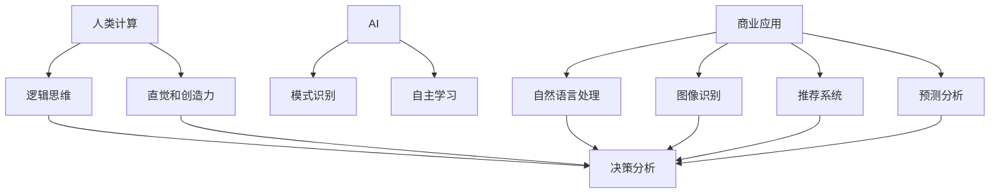

                 


# AI驱动的创新：人类计算在商业中的优势

> 关键词：AI创新、商业应用、人类计算、算法、数学模型、项目实战
>
> 摘要：本文探讨了AI在商业领域中的创新应用，分析了人类计算与AI结合带来的优势。通过详细介绍AI的核心概念、算法原理、数学模型和项目实战，揭示了AI在商业中的潜力与挑战。

## 1. 背景介绍

### 1.1 目的和范围

本文旨在探讨AI在商业领域的创新应用，分析人类计算与AI结合的优势。文章将详细阐述AI的核心概念、算法原理、数学模型和项目实战，以帮助读者理解AI在商业中的潜力与挑战。

### 1.2 预期读者

本文适合对AI和商业应用感兴趣的读者，包括但不限于AI研究员、工程师、软件开发者、创业者、企业家和投资人士。

### 1.3 文档结构概述

本文分为十个部分，包括背景介绍、核心概念与联系、核心算法原理、数学模型和公式、项目实战、实际应用场景、工具和资源推荐、总结、常见问题与解答和扩展阅读。每个部分都将详细介绍与AI在商业应用相关的知识点和实践案例。

### 1.4 术语表

#### 1.4.1 核心术语定义

- AI：人工智能（Artificial Intelligence），一种模拟人类智能的技术。
- 机器学习：一种从数据中学习规律和模式的AI方法。
- 深度学习：一种基于多层神经网络的学习方法。
- 数据挖掘：一种从大量数据中发现模式和规律的技术。
- 商业智能：利用数据分析技术，帮助企业和组织做出更明智的商业决策。

#### 1.4.2 相关概念解释

- 人类计算：指人类在商业过程中运用逻辑思维、直觉和创造力进行决策的过程。
- 数据驱动的决策：基于数据分析，利用数据洞察力进行决策的过程。

#### 1.4.3 缩略词列表

- AI：人工智能
- ML：机器学习
- DL：深度学习
- DM：数据挖掘
- BI：商业智能

## 2. 核心概念与联系

### 2.1 AI的定义与应用

人工智能（AI）是一种模拟人类智能的技术，通过算法和模型实现自主学习和决策。AI在商业领域有广泛的应用，如自然语言处理、图像识别、推荐系统、预测分析等。

### 2.2 人类计算与AI的结合

人类计算与AI的结合可以发挥各自的优势，实现更好的决策效果。人类计算能够处理复杂、模糊的问题，而AI能够处理大量数据、模式识别和预测。两者结合可以提升商业决策的准确性、效率和创造力。

### 2.3 AI在商业领域的核心应用

AI在商业领域的核心应用包括：

1. **自然语言处理**：用于文本分析、情感分析、客户服务自动化等。
2. **图像识别**：用于图像搜索、产品质量检测、安防监控等。
3. **推荐系统**：用于个性化推荐、广告投放、电商营销等。
4. **预测分析**：用于销售预测、客户流失预测、供应链优化等。

### 2.4 Mermaid流程图



## 3. 核心算法原理 & 具体操作步骤

### 3.1 机器学习算法原理

机器学习算法是通过学习数据中的规律，从而进行预测或分类的技术。常见的机器学习算法有：

1. **线性回归**：用于预测数值型数据。
2. **逻辑回归**：用于预测概率型数据。
3. **支持向量机（SVM）**：用于分类问题。
4. **决策树**：用于分类和回归问题。
5. **随机森林**：基于决策树的集成学习方法。
6. **神经网络**：用于复杂非线性问题的建模。

### 3.2 伪代码

```python
# 机器学习算法伪代码
def machine_learning(data, labels, algorithm):
    # 加载数据
    X, y = load_data(data, labels)
    
    # 初始化模型
    model = init_model(algorithm)
    
    # 训练模型
    model = train_model(model, X, y)
    
    # 预测
    predictions = predict(model, X)
    
    # 评估模型
    evaluate_model(predictions, y)
    
    return model
```

### 3.3 具体操作步骤

1. **数据收集与预处理**：收集数据，并进行清洗、归一化等预处理操作。
2. **特征工程**：提取有用的特征，并构建特征向量。
3. **选择算法**：根据问题类型和特性，选择合适的算法。
4. **训练模型**：使用训练数据，训练模型参数。
5. **模型评估**：使用测试数据，评估模型性能。
6. **模型优化**：调整模型参数，提高模型性能。

## 4. 数学模型和公式 & 详细讲解 & 举例说明

### 4.1 数学模型

在机器学习中，常见的数学模型包括线性回归、逻辑回归、SVM和神经网络等。以下分别介绍这些模型的数学公式和具体操作步骤。

#### 4.1.1 线性回归

线性回归是一种预测数值型数据的模型，其数学公式为：

\[ y = \beta_0 + \beta_1x \]

其中，\( y \) 为预测值，\( x \) 为输入特征，\( \beta_0 \) 和 \( \beta_1 \) 为模型参数。

#### 4.1.2 逻辑回归

逻辑回归是一种预测概率型数据的模型，其数学公式为：

\[ P(y=1) = \frac{1}{1 + e^{-(\beta_0 + \beta_1x)}} \]

其中，\( y \) 为预测值，\( x \) 为输入特征，\( \beta_0 \) 和 \( \beta_1 \) 为模型参数。

#### 4.1.3 支持向量机（SVM）

SVM是一种分类模型，其数学公式为：

\[ w \cdot x - b = 0 \]

其中，\( w \) 为模型参数，\( x \) 为输入特征，\( b \) 为偏置。

#### 4.1.4 神经网络

神经网络是一种用于复杂非线性问题的建模方法，其数学公式为：

\[ a_{i,j} = \sigma(\sum_{k=1}^{n} w_{i,k}a_{k,j-1} + b_{i}) \]

其中，\( a_{i,j} \) 为神经元 \( i \) 在第 \( j \) 层的输出，\( \sigma \) 为激活函数，\( w_{i,k} \) 和 \( b_{i} \) 为模型参数。

### 4.2 举例说明

以下通过一个简单的线性回归例子，展示数学模型的实际应用。

#### 4.2.1 数据准备

给定以下数据集：

| x | y |
|---|---|
| 1 | 2 |
| 2 | 4 |
| 3 | 6 |

#### 4.2.2 模型训练

使用线性回归模型，训练数据集，得到模型参数：

\[ y = \beta_0 + \beta_1x \]

经过训练，得到 \( \beta_0 = 1 \) 和 \( \beta_1 = 1 \)。

#### 4.2.3 预测

使用训练好的模型，预测新的输入值 \( x = 4 \)：

\[ y = 1 + 1 \times 4 = 5 \]

预测结果为 \( y = 5 \)。

## 5. 项目实战：代码实际案例和详细解释说明

### 5.1 开发环境搭建

在开始项目实战之前，需要搭建一个合适的开发环境。以下是一个简单的开发环境搭建过程：

1. **安装Python**：下载并安装Python，版本建议为3.8及以上。
2. **安装Jupyter Notebook**：在终端执行以下命令安装Jupyter Notebook：

   ```bash
   pip install notebook
   ```

3. **安装机器学习库**：在终端执行以下命令安装常用的机器学习库：

   ```bash
   pip install numpy scipy scikit-learn matplotlib
   ```

### 5.2 源代码详细实现和代码解读

以下是一个简单的线性回归项目案例，使用Python实现：

```python
import numpy as np
import matplotlib.pyplot as plt
from sklearn.linear_model import LinearRegression

# 5.2.1 数据准备
X = np.array([[1], [2], [3]])
y = np.array([2, 4, 6])

# 5.2.2 模型训练
model = LinearRegression()
model.fit(X, y)

# 5.2.3 预测
X_new = np.array([[4]])
y_pred = model.predict(X_new)

# 5.2.4 代码解读
# 这段代码使用了scikit-learn库的线性回归模型，首先加载数据，然后使用fit方法训练模型，最后使用predict方法进行预测。

# 5.2.5 结果展示
plt.scatter(X, y)
plt.plot(X_new, y_pred, color='red')
plt.xlabel('x')
plt.ylabel('y')
plt.show()
```

### 5.3 代码解读与分析

1. **数据准备**：使用NumPy库加载输入特征 \( X \) 和标签 \( y \)。
2. **模型训练**：使用scikit-learn库的线性回归模型，调用fit方法训练模型。
3. **预测**：使用训练好的模型，调用predict方法进行预测。
4. **结果展示**：使用matplotlib库绘制散点图和预测线，展示模型效果。

## 6. 实际应用场景

AI在商业领域有广泛的应用场景，以下是一些典型的应用案例：

1. **客户服务**：使用自然语言处理技术，实现智能客服，提高客户满意度。
2. **市场预测**：使用预测分析技术，预测市场趋势，帮助企业制定更有效的营销策略。
3. **供应链优化**：使用图像识别技术，自动识别和分类产品，提高供应链效率。
4. **风险管理**：使用机器学习技术，分析历史数据，预测风险，帮助企业降低损失。

## 7. 工具和资源推荐

### 7.1 学习资源推荐

#### 7.1.1 书籍推荐

- 《人工智能：一种现代方法》
- 《深度学习》
- 《Python机器学习》

#### 7.1.2 在线课程

- Coursera的《机器学习》
- edX的《深度学习基础》
- Udacity的《深度学习纳米学位》

#### 7.1.3 技术博客和网站

- Medium上的AI博客
- ArXiv的机器学习论文库
- AI技术社区

### 7.2 开发工具框架推荐

#### 7.2.1 IDE和编辑器

- PyCharm
- Visual Studio Code
- Jupyter Notebook

#### 7.2.2 调试和性能分析工具

- Python的pdb调试器
- TensorBoard
- Numba

#### 7.2.3 相关框架和库

- TensorFlow
- PyTorch
- scikit-learn

### 7.3 相关论文著作推荐

#### 7.3.1 经典论文

- "A Mathematical Theory of Communication" by Claude Shannon
- "Backpropagation" by David E. Rumelhart, Geoffrey E. Hinton, and Ronald J. Williams

#### 7.3.2 最新研究成果

- "Deep Learning" by Ian Goodfellow, Yoshua Bengio, and Aaron Courville
- "Generative Adversarial Nets" by Ian Goodfellow et al.

#### 7.3.3 应用案例分析

- "AI in Healthcare" by Dr. Andrew Ng
- "AI in Finance" by Dr. Andrew Ng

## 8. 总结：未来发展趋势与挑战

AI在商业领域的创新应用正日益增多，未来发展趋势包括：

1. **数据隐私与安全**：随着AI技术的普及，数据隐私和安全问题将成为重点关注领域。
2. **人工智能法规**：各国政府将出台相关法规，规范AI技术的发展和应用。
3. **跨界融合**：AI技术将与更多领域实现跨界融合，推动产业升级和创新发展。

然而，AI在商业应用中仍面临以下挑战：

1. **算法透明性和解释性**：如何提高算法的透明性和解释性，使其更易于被用户接受。
2. **技术人才短缺**：AI领域的快速发展导致人才短缺，企业需要加强人才培养和引进。
3. **数据质量和多样性**：高质量和多样化的数据是AI模型训练的关键，如何获取和处理这些数据将是一个挑战。

## 9. 附录：常见问题与解答

### 9.1 什么是机器学习？

机器学习是一种从数据中学习规律和模式的技术，通过算法和模型实现自主学习和决策。

### 9.2 机器学习有哪些常见算法？

常见的机器学习算法包括线性回归、逻辑回归、支持向量机、决策树、随机森林、神经网络等。

### 9.3 AI在商业领域的应用有哪些？

AI在商业领域有广泛的应用，如客户服务、市场预测、供应链优化、风险管理等。

### 9.4 如何搭建一个机器学习项目？

搭建一个机器学习项目通常包括数据收集与预处理、特征工程、选择算法、模型训练、模型评估和模型优化等步骤。

## 10. 扩展阅读 & 参考资料

- 《人工智能：一种现代方法》
- 《深度学习》
- 《Python机器学习》
- Coursera的《机器学习》
- edX的《深度学习基础》
- Udacity的《深度学习纳米学位》
- "A Mathematical Theory of Communication" by Claude Shannon
- "Backpropagation" by David E. Rumelhart, Geoffrey E. Hinton, and Ronald J. Williams
- "Deep Learning" by Ian Goodfellow, Yoshua Bengio, and Aaron Courville
- "Generative Adversarial Nets" by Ian Goodfellow et al.
- "AI in Healthcare" by Dr. Andrew Ng
- "AI in Finance" by Dr. Andrew Ng

