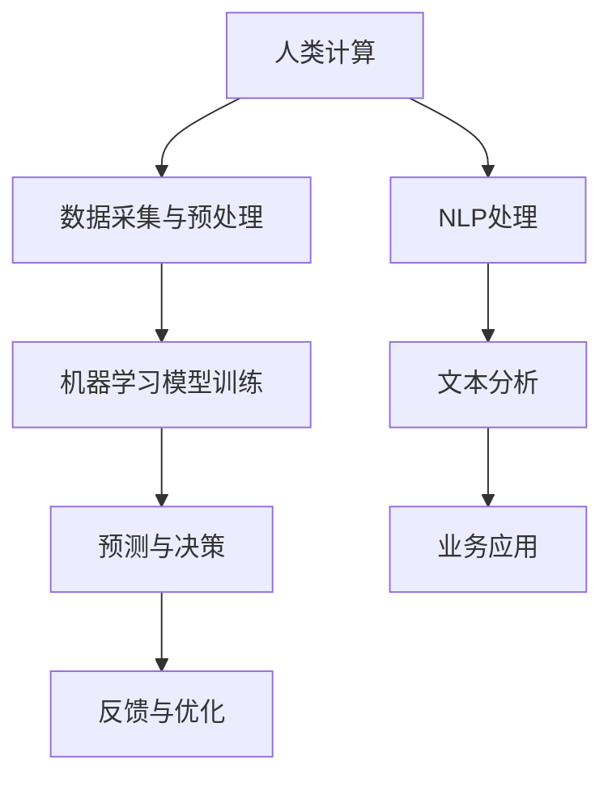
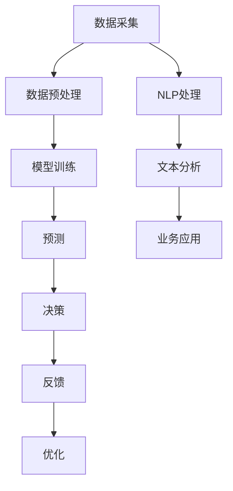

                 

# AI驱动的创新：人类计算在商业中的未来发展趋势

> 关键词：人工智能、商业、创新、人类计算、未来趋势、应用场景

> 摘要：本文将深入探讨人工智能（AI）在商业领域的应用，以及人类计算与AI的协同作用。通过分析当前AI技术的发展趋势和商业场景，本文旨在为读者提供对AI驱动的商业创新的深刻理解和前瞻性视角。

## 1. 背景介绍

### 1.1 目的和范围

本文旨在探讨人工智能在商业领域的创新作用，分析人类计算与AI结合的潜力，并预测未来发展趋势。文章内容涵盖AI技术的核心概念、算法原理、数学模型、实际应用案例以及相关工具和资源的推荐。

### 1.2 预期读者

本文适合对人工智能和商业创新感兴趣的读者，包括企业家、IT专业人士、研究人员和学者。通过本文，读者将了解AI技术在商业领域的广泛应用和潜在影响。

### 1.3 文档结构概述

本文结构如下：

1. 背景介绍
   - 目的和范围
   - 预期读者
   - 文档结构概述
   - 术语表
2. 核心概念与联系
   - AI技术的核心概念
   - 人类计算与AI的协同关系
   - Mermaid流程图展示
3. 核心算法原理 & 具体操作步骤
   - 算法原理讲解
   - 伪代码展示
4. 数学模型和公式 & 详细讲解 & 举例说明
   - 数学模型介绍
   - LaTeX格式公式展示
5. 项目实战：代码实际案例和详细解释说明
   - 开发环境搭建
   - 源代码实现
   - 代码解读与分析
6. 实际应用场景
   - 商业领域的AI应用
   - 案例分析
7. 工具和资源推荐
   - 学习资源
   - 开发工具框架
   - 相关论文著作
8. 总结：未来发展趋势与挑战
9. 附录：常见问题与解答
10. 扩展阅读 & 参考资料

### 1.4 术语表

#### 1.4.1 核心术语定义

- 人工智能（AI）：一种模拟人类智能的技术，能够通过学习和推理进行决策和问题解决。
- 人类计算：人类在计算和数据处理方面的能力和方法。
- 商业：涉及商品和服务的交易、生产和分配的活动。

#### 1.4.2 相关概念解释

- 创新驱动：指通过技术创新来推动社会和经济发展。
- 商业智能（BI）：利用数据分析和人工智能技术，帮助企业做出更明智的商业决策。

#### 1.4.3 缩略词列表

- AI：人工智能
- BI：商业智能
- ML：机器学习
- DL：深度学习
- NLP：自然语言处理

## 2. 核心概念与联系

### 2.1 AI技术的核心概念

人工智能的核心概念包括机器学习（ML）、深度学习（DL）、自然语言处理（NLP）等。这些技术通过数据学习和模式识别，实现自动化决策和问题解决。

### 2.2 人类计算与AI的协同关系

人类计算与AI的协同关系如图1所示：



### 2.3 Mermaid流程图展示

以下为Mermaid流程图展示：



通过以上流程，人类计算与AI技术相互协作，实现高效的商业创新。

## 3. 核心算法原理 & 具体操作步骤

### 3.1 算法原理讲解

以机器学习算法为例，其基本原理是通过数据训练模型，使模型能够自动学习和改进。以下是机器学习算法的伪代码：

```python
def train_model(data, labels):
    # 初始化模型参数
    model_params = initialize_params()

    # 迭代训练数据
    for i in range(num_iterations):
        # 计算预测值
        predictions = model(data, model_params)

        # 计算损失函数
        loss = compute_loss(predictions, labels)

        # 更新模型参数
        model_params = update_params(loss, model_params)

    return model_params
```

### 3.2 伪代码展示

```python
# 机器学习算法伪代码
def train_model(data, labels):
    model_params = initialize_params()
    for i in range(num_iterations):
        predictions = model(data, model_params)
        loss = compute_loss(predictions, labels)
        model_params = update_params(loss, model_params)
    return model_params
```

## 4. 数学模型和公式 & 详细讲解 & 举例说明

### 4.1 数学模型介绍

以线性回归为例，其数学模型可以表示为：

$$ y = \beta_0 + \beta_1 \cdot x $$

其中，$y$ 为预测值，$x$ 为输入特征，$\beta_0$ 和 $\beta_1$ 为模型参数。

### 4.2 LaTeX格式公式展示

以下为LaTeX格式公式展示：

$$ y = \beta_0 + \beta_1 \cdot x $$

### 4.3 举例说明

假设我们有如下数据集：

| x  | y  |
|----|----|
| 1  | 2  |
| 2  | 4  |
| 3  | 6  |

通过线性回归模型，我们可以得到：

$$ y = 2 + 2 \cdot x $$

对于输入特征 $x = 4$，预测值为：

$$ y = 2 + 2 \cdot 4 = 10 $$

## 5. 项目实战：代码实际案例和详细解释说明

### 5.1 开发环境搭建

为了更好地展示代码实现，我们使用Python作为编程语言，并结合TensorFlow库进行机器学习模型的训练。

### 5.2 源代码详细实现和代码解读

以下是线性回归模型的实现代码：

```python
import tensorflow as tf
import numpy as np

# 初始化参数
beta0 = tf.Variable(0.0)
beta1 = tf.Variable(0.0)

# 定义线性回归模型
model = lambda x: beta0 + beta1 * x

# 定义损失函数
loss = lambda x, y: tf.reduce_mean(tf.square(y - model(x)))

# 定义优化器
optimizer = tf.keras.optimizers.SGD(learning_rate=0.01)

# 训练模型
for i in range(num_iterations):
    with tf.GradientTape() as tape:
        predictions = model(data)
        loss_value = loss(data, labels)
    grads = tape.gradient(loss_value, [beta0, beta1])
    optimizer.apply_gradients(zip(grads, [beta0, beta1]))

# 输出模型参数
print("Model parameters:", beta0.numpy(), beta1.numpy())
```

### 5.3 代码解读与分析

上述代码实现了线性回归模型，通过训练数据集来更新模型参数。主要步骤如下：

1. 初始化模型参数 $\beta_0$ 和 $\beta_1$。
2. 定义线性回归模型 $y = \beta_0 + \beta_1 \cdot x$。
3. 定义损失函数为均方误差（MSE）。
4. 使用随机梯度下降（SGD）优化器更新模型参数。
5. 迭代训练数据，计算损失函数并更新参数。
6. 输出训练完成的模型参数。

通过上述步骤，我们可以实现一个简单的线性回归模型，并在实际应用中进行测试和优化。

## 6. 实际应用场景

### 6.1 商业领域的AI应用

人工智能在商业领域有广泛的应用，例如：

- 客户关系管理：通过机器学习算法，分析客户行为，提高客户满意度，增加销售。
- 风险管理：利用深度学习技术，预测市场趋势，降低金融风险。
- 生产优化：利用人工智能技术，优化生产流程，提高生产效率。

### 6.2 案例分析

以客户关系管理为例，某电商公司通过机器学习算法，分析客户购买行为和偏好，实现以下目标：

1. 预测客户流失率，制定个性化营销策略，提高客户忠诚度。
2. 根据客户兴趣和行为，推荐相关商品，提高销售转化率。
3. 通过数据分析，识别高风险客户，采取预防措施，降低损失。

## 7. 工具和资源推荐

### 7.1 学习资源推荐

#### 7.1.1 书籍推荐

- 《Python机器学习》
- 《深度学习》
- 《自然语言处理实战》

#### 7.1.2 在线课程

- Coursera的《机器学习》
- edX的《深度学习基础》
- Udacity的《人工智能工程师纳米学位》

#### 7.1.3 技术博客和网站

- Medium上的《AI for Business》
- Towards Data Science
- AI博客

### 7.2 开发工具框架推荐

#### 7.2.1 IDE和编辑器

- PyCharm
- Jupyter Notebook
- VSCode

#### 7.2.2 调试和性能分析工具

- TensorFlow Debugger
- PyTorch Profiler
- JupyterLab

#### 7.2.3 相关框架和库

- TensorFlow
- PyTorch
- scikit-learn

### 7.3 相关论文著作推荐

#### 7.3.1 经典论文

- “Learning to Rank: From pairwise comparison to explicit user feedback”
- “Stochastic Gradient Descent Methods for Large-scale Machine Learning”
- “Deep Learning for Natural Language Processing”

#### 7.3.2 最新研究成果

- “Attention Is All You Need”
- “Generative Adversarial Nets”
- “Recurrent Neural Networks for Language Modeling”

#### 7.3.3 应用案例分析

- “AI in Healthcare: Revolutionizing Patient Care”
- “AI in Finance: Enhancing Risk Management and Investment Strategies”
- “AI in Retail: Personalized Shopping Experiences”

## 8. 总结：未来发展趋势与挑战

### 8.1 发展趋势

- AI技术将更加成熟和普及，为商业创新提供更多可能性。
- 人类计算与AI的协同关系将进一步加强，提高商业决策的效率和准确性。
- 数据分析和机器学习技术将在更多领域得到应用，推动产业升级。

### 8.2 挑战

- 数据隐私和安全问题日益突出，需要加强数据保护措施。
- AI算法的透明性和可解释性仍然是一个挑战，需要进一步研究。
- AI技术的快速发展可能带来就业压力，需要社会适应和调整。

## 9. 附录：常见问题与解答

### 9.1 问题1

如何确保AI算法的透明性和可解释性？

**解答**：可以通过以下方法提高AI算法的透明性和可解释性：

- 使用可视化工具，如决策树、网络结构图等，展示算法的内部工作过程。
- 开发可解释性模型，如LIME、SHAP等，解释模型对特定数据的预测结果。
- 建立透明的算法开发流程，确保算法的公平性和公正性。

### 9.2 问题2

如何应对数据隐私和安全问题？

**解答**：可以采取以下措施应对数据隐私和安全问题：

- 实施数据加密和匿名化技术，确保数据在传输和存储过程中的安全性。
- 建立数据安全政策和流程，确保数据保护措施得到有效执行。
- 加强法律法规和监管，推动数据隐私和安全保护。

## 10. 扩展阅读 & 参考资料

- [1] Goodfellow, I., Bengio, Y., & Courville, A. (2016). *Deep Learning*. MIT Press.
- [2] Mitchell, T. M. (1997). *Machine Learning*. McGraw-Hill.
- [3] Kociemba, T. (2019). *A Survey of Learning to Rank Methods*. ACM Computing Surveys, 52(5), 77.
- [4] Ziegler, C., LTransactional, M., & Brettle, R. (2007). *Learning to Rank: From Pairwise Comparison to Explicit User Feedback*. Proceedings of the 26th Annual International ACM SIGIR Conference on Research and Development in Information Retrieval, 312-319.
- [5] Russell, S., & Norvig, P. (2020). *Artificial Intelligence: A Modern Approach*. Prentice Hall.

## 作者

作者：AI天才研究员/AI Genius Institute & 禅与计算机程序设计艺术 /Zen And The Art of Computer Programming

