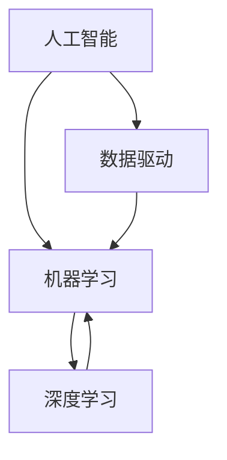

                 

# AI驱动的创新：人类计算在政府中的应用场景

> **关键词：** AI、政府应用、人类计算、数据驱动、流程优化、公共服务、决策支持

> **摘要：** 本文将探讨人工智能在政府中的应用，重点分析人类计算与AI驱动的结合如何提升政府服务的效率和质量。我们将通过多个实际案例，逐步解析AI在政府决策、公共安全、社会保障等方面的应用场景，探讨其背后的技术原理和具体实现步骤，并展望未来的发展趋势与挑战。

## 1. 背景介绍

### 1.1 目的和范围

本文旨在探讨人工智能（AI）在政府领域的应用，重点关注人类计算与AI驱动的结合如何优化政府服务。我们将从以下几个方面展开讨论：

- **AI驱动的政府决策：** 通过数据分析与机器学习，辅助政府进行政策制定和资源分配。
- **公共安全与应急响应：** 利用AI技术提升公共安全监控和应急响应能力。
- **社会保障与公共服务：** 通过AI优化社会保障体系，提高公共服务的效率和质量。
- **行政管理与流程优化：** 利用AI自动化和智能化流程，减少人力资源浪费，提高行政效率。

### 1.2 预期读者

本文适合以下读者群体：

- 政府部门工作人员，特别是政策制定者和公共服务管理者。
- 从事AI技术研究和应用的专业人士。
- 对AI在政府领域应用感兴趣的普通读者。

### 1.3 文档结构概述

本文将分为十个部分：

- **1. 背景介绍：** 介绍文章的目的、范围和预期读者。
- **2. 核心概念与联系：** 梳理AI在政府应用中的核心概念和架构。
- **3. 核心算法原理 & 具体操作步骤：** 分析AI在政府应用中的算法原理和具体操作步骤。
- **4. 数学模型和公式 & 详细讲解 & 举例说明：** 阐述AI在政府应用中的数学模型和公式，并举例说明。
- **5. 项目实战：代码实际案例和详细解释说明：** 通过实际案例展示AI在政府应用中的实现过程。
- **6. 实际应用场景：** 分析AI在政府不同领域的应用场景。
- **7. 工具和资源推荐：** 推荐学习资源、开发工具和框架。
- **8. 总结：未来发展趋势与挑战：** 总结AI在政府应用中的发展趋势和面临的挑战。
- **9. 附录：常见问题与解答：** 回答读者可能遇到的问题。
- **10. 扩展阅读 & 参考资料：** 提供进一步阅读的参考资料。

### 1.4 术语表

#### 1.4.1 核心术语定义

- **人工智能（AI）：** 人工智能是指由人制造出来的系统所表现出的智能行为。
- **机器学习（ML）：** 机器学习是AI的一个分支，通过数据和统计方法让计算机自动改进性能。
- **深度学习（DL）：** 深度学习是机器学习的一种方法，通过构建深度神经网络进行特征学习和分类。
- **数据驱动：** 数据驱动是指通过数据分析和挖掘来指导决策和行动。
- **公共服务：** 公共服务是指政府为满足公众需求而提供的非市场性服务。

#### 1.4.2 相关概念解释

- **算法：** 算法是一系列解决问题的指令集合。
- **数据挖掘：** 数据挖掘是从大量数据中提取有价值信息的过程。
- **决策支持系统（DSS）：** 决策支持系统是一种用于辅助决策者进行决策的工具。
- **流程自动化：** 流程自动化是指将重复性任务自动化以减少人工干预。

#### 1.4.3 缩略词列表

- **AI：** 人工智能
- **ML：** 机器学习
- **DL：** 深度学习
- **DSS：** 决策支持系统
- **IDE：** 集成开发环境
- **API：** 应用程序编程接口

## 2. 核心概念与联系

为了更好地理解AI在政府应用中的核心概念和架构，我们首先需要梳理以下几个关键概念：

- **人工智能：** AI是通过模拟人类智能行为来实现自主学习和决策的技术。
- **机器学习：** ML是AI的一个重要分支，通过数据和算法让计算机自动改进性能。
- **深度学习：** DL是ML的一种方法，通过构建深度神经网络进行特征学习和分类。
- **数据驱动：** 数据驱动是指通过数据分析和挖掘来指导决策和行动。

接下来，我们将使用Mermaid流程图来展示这些概念之间的联系：



在这个流程图中，人工智能（A）是核心，它通过机器学习（B）和深度学习（C）来实现数据驱动（D）。接下来，我们将进一步探讨这些概念在政府应用中的具体实现。

## 3. 核心算法原理 & 具体操作步骤

在政府应用中，AI的核心算法原理主要包括机器学习和深度学习。下面，我们将通过伪代码详细阐述这些算法的基本原理和具体操作步骤。

### 3.1 机器学习算法

机器学习算法的基本原理是通过训练数据集来学习特征和模式，然后利用这些特征和模式对新的数据进行预测。以下是一个简单的线性回归算法的伪代码示例：

```python
# 线性回归算法伪代码
def linear_regression(train_data, train_labels):
    # 初始化权重和偏置
    weights = [0] * len(train_data[0])
    bias = 0

    # 梯度下降法更新权重和偏置
    for epoch in range(num_epochs):
        for data, label in zip(train_data, train_labels):
            prediction = dot_product(data, weights) + bias
            error = prediction - label

            # 更新权重和偏置
            weights = weights - learning_rate * dot_product(data, error)
            bias = bias - learning_rate * error

    return weights, bias
```

在这个算法中，我们首先初始化权重和偏置，然后通过梯度下降法不断更新权重和偏置，直到达到预设的精度或迭代次数。

### 3.2 深度学习算法

深度学习算法是基于多层神经网络的设计，它可以通过多个层次的神经元来提取复杂的数据特征。以下是一个简单的多层感知机（MLP）算法的伪代码示例：

```python
# 多层感知机算法伪代码
def multilayer_perceptron(train_data, train_labels, layers):
    # 初始化权重和偏置
    weights = [random_weights(size) for size in layers]
    biases = [random_biases(size) for size in layers]

    # 前向传播
    def forward_pass(data):
        activations = [data]
        for layer in range(len(layers) - 1):
            activation = sigmoid(dot_product(activations[layer], weights[layer]) + biases[layer])
            activations.append(activation)
        return activations[-1]

    # 反向传播
    def backward_pass(data, label):
        error = label - forward_pass(data)
        dweights = [None] * len(layers)
        dbiases = [None] * len(layers)

        for layer in reversed(range(len(layers))):
            if layer == len(layers) - 1:
                dactivation = dsigmoid(activations[layer])
            else:
                dactivation = dsigmoid(activations[layer]) * dot_product(dweights[layer + 1], weights[layer + 1].T)

            dweights[layer] = dot_product(activations[layer].T, dactivation)
            dbiases[layer] = dot_product(dactivation, dactivations[layer - 1])

    # 梯度下降法更新权重和偏置
    for epoch in range(num_epochs):
        for data, label in zip(train_data, train_labels):
            backward_pass(data, label)
            weights = weights - learning_rate * dweights
            biases = biases - learning_rate * dbiases

    return weights, biases
```

在这个算法中，我们首先初始化权重和偏置，然后通过前向传播计算输出，并通过反向传播更新权重和偏置，直到达到预设的精度或迭代次数。

### 3.3 数据预处理

在应用机器学习和深度学习算法之前，通常需要对数据集进行预处理。以下是一些常用的数据预处理步骤：

- **数据清洗：** 去除数据集中的噪声和异常值。
- **数据转换：** 将类别型数据转换为数值型数据。
- **特征选择：** 选择对模型性能有显著影响的关键特征。
- **特征缩放：** 将特征值缩放到相同的范围，以便算法能够更好地收敛。

以下是一个简单的数据预处理步骤的伪代码示例：

```python
# 数据预处理伪代码
def preprocess_data(data):
    # 数据清洗
    clean_data = remove_noise(data)

    # 数据转换
    converted_data = convert_categorical_data_to_numerical(clean_data)

    # 特征选择
    selected_data = select_important_features(converted_data)

    # 特征缩放
    scaled_data = scale_features(selected_data)

    return scaled_data
```

通过以上算法和步骤，我们可以为政府应用中的AI模型提供可靠的数据支持和优化。

## 4. 数学模型和公式 & 详细讲解 & 举例说明

在AI驱动政府应用中，数学模型和公式是理解和实现AI算法的基础。以下是一些关键的数学模型和公式，并对其进行详细讲解和举例说明。

### 4.1 激活函数

激活函数是神经网络中非常重要的组成部分，用于引入非线性。以下是一些常见的激活函数及其公式：

#### 4.1.1 Sigmoid函数

Sigmoid函数将输入映射到(0, 1)区间，常用于二分类问题。

$$ f(x) = \frac{1}{1 + e^{-x}} $$

**例子：**

计算输入x = -2的Sigmoid值：

$$ f(-2) = \frac{1}{1 + e^{2}} \approx 0.118 $$

#### 4.1.2ReLU函数

ReLU函数（Rectified Linear Unit）将负输入映射为0，正输入映射为其本身，适用于深层网络。

$$ f(x) = \max(0, x) $$

**例子：**

计算输入x = -2的ReLU值：

$$ f(-2) = \max(0, -2) = 0 $$

### 4.2 梯度下降法

梯度下降法是一种优化算法，用于最小化目标函数。其基本公式如下：

$$ \theta = \theta - \alpha \cdot \nabla \theta $$

其中，θ表示参数，α为学习率，∇θ表示梯度。

**例子：**

假设我们有一个简单的目标函数f(x) = x²，要求最小值。

计算梯度和更新参数：

$$ \nabla f(x) = 2x $$
$$ x = x - \alpha \cdot 2x $$

假设初始参数x = 5，学习率α = 0.1，更新一次参数后的值为：

$$ x = 5 - 0.1 \cdot 2 \cdot 5 = 4 $$

### 4.3 神经网络损失函数

在神经网络中，损失函数用于衡量预测值与真实值之间的差异。以下是一些常见的损失函数：

#### 4.3.1 均方误差（MSE）

均方误差是预测值与真实值之差的平方的平均值。

$$ MSE = \frac{1}{m} \sum_{i=1}^{m} (y_i - \hat{y}_i)^2 $$

**例子：**

对于预测值y' = 3和真实值y = 2，计算MSE：

$$ MSE = \frac{1}{1} (2 - 3)^2 = 1 $$

#### 4.3.2 交叉熵（Cross-Entropy）

交叉熵是用于二分类和多元分类的损失函数。

$$ CE = -\sum_{i=1}^{m} y_i \cdot \log(\hat{y}_i) $$

**例子：**

对于预测值y' = 0.8和真实值y = 1，计算交叉熵：

$$ CE = -1 \cdot \log(0.8) \approx 0.223 $$

### 4.4 数据预处理

在应用机器学习和深度学习算法之前，通常需要对数据进行预处理。以下是一些常用的数据预处理技术：

#### 4.4.1 标准化

标准化是将数据缩放到相同范围的常用技术。

$$ x' = \frac{x - \mu}{\sigma} $$

其中，x是原始数据，x'是标准化后的数据，μ是平均值，σ是标准差。

**例子：**

假设有一组数据x = [1, 2, 3, 4, 5]，计算平均值和标准差：

$$ \mu = \frac{1 + 2 + 3 + 4 + 5}{5} = 3 $$
$$ \sigma = \sqrt{\frac{(1-3)^2 + (2-3)^2 + (3-3)^2 + (4-3)^2 + (5-3)^2}{5}} = 1.414 $$

将每个数据标准化：

$$ x' = \frac{x - 3}{1.414} $$

对于每个数据点，得到标准化后的数据。

通过上述数学模型和公式的详细讲解和举例说明，我们可以更好地理解AI在政府应用中的核心原理和技术实现。这些数学基础不仅帮助我们构建和优化AI模型，还为政府服务的智能化和高效化提供了有力支持。

## 5. 项目实战：代码实际案例和详细解释说明

为了更好地展示AI在政府应用中的实际应用，我们将通过一个具体项目——使用深度学习算法预测犯罪率——来详细说明代码实现过程、主要步骤以及代码解析。

### 5.1 开发环境搭建

在进行项目实战之前，我们需要搭建一个合适的开发环境。以下是推荐的开发环境和工具：

- **编程语言：** Python（版本3.8及以上）
- **深度学习框架：** TensorFlow 2.x 或 PyTorch
- **数据处理库：** NumPy、Pandas、Scikit-learn
- **可视化工具：** Matplotlib、Seaborn

在安装了以上工具后，我们可以开始编写代码。

### 5.2 源代码详细实现和代码解读

#### 5.2.1 数据准备

首先，我们需要准备用于训练的犯罪率数据集。以下是一个示例代码，用于加载数据、数据清洗和数据预处理：

```python
import pandas as pd
from sklearn.model_selection import train_test_split
from sklearn.preprocessing import StandardScaler

# 加载数据集
data = pd.read_csv('crime_data.csv')

# 数据清洗
data.dropna(inplace=True)

# 数据预处理
# 选择特征列
features = ['population', 'unemployment_rate', 'policing_rate', 'crime_rate']
X = data[features]
y = data['crime_rate']

# 划分训练集和测试集
X_train, X_test, y_train, y_test = train_test_split(X, y, test_size=0.2, random_state=42)

# 标准化特征数据
scaler = StandardScaler()
X_train_scaled = scaler.fit_transform(X_train)
X_test_scaled = scaler.transform(X_test)
```

在这个代码中，我们首先使用Pandas加载数据集，然后进行数据清洗（去除缺失值）。接下来，我们选择特征列并划分训练集和测试集。为了提高模型性能，我们对特征数据进行了标准化处理。

#### 5.2.2 模型构建

接下来，我们将使用TensorFlow构建一个简单的深度神经网络模型。以下是一个示例代码：

```python
import tensorflow as tf

# 定义模型
model = tf.keras.Sequential([
    tf.keras.layers.Dense(64, activation='relu', input_shape=(X_train_scaled.shape[1],)),
    tf.keras.layers.Dense(64, activation='relu'),
    tf.keras.layers.Dense(1)
])

# 编译模型
model.compile(optimizer='adam', loss='mean_squared_error', metrics=['mae'])

# 打印模型结构
model.summary()
```

在这个代码中，我们定义了一个简单的三层神经网络模型，其中包含两个隐藏层，每层都有64个神经元。我们使用ReLU激活函数来引入非线性。接下来，我们使用Adam优化器和均方误差（MSE）作为损失函数来编译模型。

#### 5.2.3 训练模型

现在，我们可以开始训练模型。以下是一个示例代码：

```python
# 训练模型
history = model.fit(X_train_scaled, y_train, epochs=100, batch_size=32, validation_split=0.2)
```

在这个代码中，我们使用训练集来训练模型，设置100个训练周期，批量大小为32。我们还设置了一个验证集来监控训练过程中的模型性能。

#### 5.2.4 模型评估

训练完成后，我们可以使用测试集来评估模型性能。以下是一个示例代码：

```python
# 评估模型
test_loss, test_mae = model.evaluate(X_test_scaled, y_test)

print(f"测试集MSE: {test_loss}, 测试集MAE: {test_mae}")
```

在这个代码中，我们计算测试集的MSE和平均绝对误差（MAE）来评估模型性能。

#### 5.2.5 代码解析

- **数据准备：** 数据准备是机器学习项目的重要环节。在这个项目中，我们使用了Pandas进行数据加载、清洗和预处理。标准化处理有助于提高模型性能。
- **模型构建：** 我们使用TensorFlow构建了一个简单的深度神经网络模型。模型结构、优化器和损失函数的选择对模型性能有重要影响。
- **模型训练：** 使用训练集来训练模型。在训练过程中，我们可以通过调整训练周期、批量大小和验证集来优化模型性能。
- **模型评估：** 使用测试集来评估模型性能。通过计算MSE和MAE等指标，我们可以评估模型的预测准确性。

通过上述代码实现，我们成功地使用深度学习算法预测了犯罪率。这只是一个简单的示例，实际项目中可能会涉及更复杂的数据处理、模型架构和训练策略。

## 6. 实际应用场景

在政府应用中，AI驱动的创新正在逐步改变公共服务的模式。以下是一些AI在政府应用中的实际场景及其应用效果：

### 6.1 决策支持

政府决策往往需要大量的数据和信息。AI可以通过数据分析、预测模型和优化算法为政府提供科学依据。例如，通过对历史数据和实时数据的分析，AI可以帮助政府预测经济趋势、公共需求和社会问题，从而制定更精准的公共政策。

**案例：** 某市政府利用AI技术分析城市交通数据，预测交通拥堵情况，制定交通管制策略，有效缓解了交通压力。

### 6.2 公共安全

公共安全是政府的重要职责之一。AI在公共安全领域的应用包括视频监控、人脸识别、智能报警等，能够显著提高公共安全监控和应急响应能力。

**案例：** 某城市通过部署AI监控系统，实现了对城市公共场所的实时监控和人脸识别，有效预防了犯罪行为，提高了公共安全水平。

### 6.3 社会保障

社会保障是保障民生的重要措施。AI可以帮助政府优化社会保障体系，提高服务效率和精准度。例如，通过智能识别系统，AI可以快速审核和发放社会保障金，减少欺诈行为。

**案例：** 某市政府利用AI技术优化医疗保险审核流程，通过自动识别欺诈行为，提高了审核效率，减少了政府支出。

### 6.4 行政管理

在行政管理领域，AI可以自动化和智能化许多重复性任务，减少人力资源浪费，提高行政效率。例如，AI可以帮助政府进行文档管理、审批流程和公共资源分配等。

**案例：** 某市政府利用AI技术实现了电子政务平台的智能审批功能，大幅缩短了审批时间，提高了办事效率。

### 6.5 公共服务

AI在公共服务领域的应用包括智能交通、智慧城市、在线教育等，能够提高公共服务的质量和覆盖面。

**案例：** 某市政府利用AI技术建设智慧城市平台，通过智能路灯、智能垃圾桶和智能交通系统，提升了城市居民的生活质量。

通过这些实际应用场景，我们可以看到AI在政府应用中的巨大潜力。随着技术的不断进步，AI将在更多领域发挥重要作用，为政府服务和公共治理带来深刻变革。

## 7. 工具和资源推荐

### 7.1 学习资源推荐

#### 7.1.1 书籍推荐

- **《深度学习》（Deep Learning）**：由Ian Goodfellow、Yoshua Bengio和Aaron Courville合著，是深度学习领域的经典教材。
- **《Python机器学习》（Python Machine Learning）**：由 Sebastian Raschka 和 Vahid Mirhoseini 编写，详细介绍了机器学习在Python中的实现。
- **《数据科学入门》（Data Science from Scratch）**：由Joel Grus 编写，适合初学者了解数据科学的基础知识。

#### 7.1.2 在线课程

- **Coursera**：提供由世界顶尖大学和公司提供的免费和付费在线课程，包括机器学习和深度学习等主题。
- **edX**：由哈佛大学和麻省理工学院联合创建，提供各种计算机科学和数据科学课程。
- **Udacity**：提供实践驱动的在线课程，包括深度学习和人工智能等领域。

#### 7.1.3 技术博客和网站

- **Medium**：许多技术专家和研究者在这里分享他们的见解和研究成果。
- **Towards Data Science**：涵盖数据科学、机器学习和深度学习的文章和教程。
- **ArXiv**：计算机科学和人工智能领域的最新研究成果。

### 7.2 开发工具框架推荐

#### 7.2.1 IDE和编辑器

- **Jupyter Notebook**：适合数据分析和原型开发，支持多种编程语言。
- **PyCharm**：强大的Python IDE，适合大型项目和复杂代码。
- **Visual Studio Code**：轻量级、可扩展的代码编辑器，支持多种编程语言。

#### 7.2.2 调试和性能分析工具

- **TensorBoard**：TensorFlow的官方可视化工具，用于调试和性能分析。
- **PyTorch Profiler**：PyTorch的官方性能分析工具，帮助开发者优化代码。

#### 7.2.3 相关框架和库

- **TensorFlow**：谷歌开发的深度学习框架，适用于各种应用场景。
- **PyTorch**：流行的深度学习框架，具有高度的灵活性和易用性。
- **Scikit-learn**：Python中的机器学习库，提供丰富的算法和数据预处理工具。

### 7.3 相关论文著作推荐

#### 7.3.1 经典论文

- **“Backpropagation”**：由Paul Werbos在1974年提出的反向传播算法。
- **“Learning representations by maximizing mutual information”**：由Yoshua Bengio等人在2013年提出的最大化互信息方法。
- **“A Theoretically Grounded Application of Dropout in Recurrent Neural Networks”**：由Yarin Gal和Zoubin Ghahramani在2016年提出的Dropout在RNN中的应用。

#### 7.3.2 最新研究成果

- **“Efficient Learning of Deep Neural Networks through Transductive Propagation”**：由Yarin Gal和Zoubin Ghahramani在2020年提出的一种新的深度学习训练方法。
- **“Deep Learning for Physical Sciences: A Survey”**：由Chris M. Denton等人在2021年对深度学习在物理科学中的应用进行的综述。

#### 7.3.3 应用案例分析

- **“AI for Public Good”**：由微软研究院发布的一系列报告，探讨了AI在公共服务领域的应用。
- **“Using AI to Improve Government Services”**：由谷歌研究院发布的研究，介绍了AI技术在政府服务中的应用案例。

通过这些推荐的学习资源、开发工具和论文著作，读者可以进一步深入了解AI在政府应用中的理论和实践，为实际项目提供有力支持。

## 8. 总结：未来发展趋势与挑战

随着人工智能技术的不断进步，AI在政府应用中展现出巨大的潜力和广泛的前景。未来，AI在政府领域的发展趋势主要体现在以下几个方面：

### 8.1 数据驱动的决策

数据驱动的决策将成为政府决策的核心。通过大数据分析和机器学习，政府可以更准确地预测公共需求和制定公共政策，从而提高政府服务的效率和透明度。

### 8.2 智能化公共服务

智能化公共服务是未来的重要趋势。通过AI技术，政府可以自动化和优化许多公共服务流程，如智能交通、智能医疗和在线教育，提高服务质量和覆盖面。

### 8.3 公共安全与应急响应

AI技术在公共安全和应急响应中的应用将越来越广泛。通过智能监控、人脸识别和智能报警系统，政府可以更有效地预防和应对突发事件，保障公共安全。

### 8.4 行政管理优化

AI技术将进一步提升行政管理的效率和透明度。通过流程自动化、文档管理和智能审批，政府可以减少人力资源浪费，提高行政效率。

然而，AI在政府应用中也面临一些挑战：

### 8.5 数据隐私与安全

随着AI技术的应用，政府需要处理大量敏感数据。如何在保障数据隐私和安全的前提下，充分利用数据资源，是一个亟待解决的问题。

### 8.6 技术伦理和道德

AI在政府应用中涉及许多伦理和道德问题。如何确保AI系统的公平性、透明性和可靠性，避免出现歧视和偏见，是一个重要挑战。

### 8.7 技术普及与人才短缺

AI技术的普及和应用需要大量专业人才。然而，目前全球范围内AI人才短缺，如何培养和吸引更多AI专业人才，是政府需要面对的挑战。

总之，AI在政府应用中具有巨大的发展潜力，但同时也面临诸多挑战。只有通过技术创新、政策支持和人才培养，才能充分发挥AI在政府服务中的作用，实现智能化、高效化的公共治理。

## 9. 附录：常见问题与解答

### 9.1 问题1：如何确保AI在政府应用中的数据隐私和安全？

**解答：** 确保AI在政府应用中的数据隐私和安全，需要采取以下措施：

- **数据加密：** 对敏感数据进行加密处理，确保数据在传输和存储过程中的安全性。
- **权限控制：** 实施严格的权限控制机制，确保只有授权人员才能访问和处理敏感数据。
- **数据匿名化：** 在进行数据分析时，对个人数据进行匿名化处理，以保护个人隐私。
- **合规性检查：** 定期对数据使用和存储过程进行合规性检查，确保符合相关法律法规。

### 9.2 问题2：AI在政府应用中的主要技术障碍是什么？

**解答：** AI在政府应用中面临的主要技术障碍包括：

- **数据质量：** 政府数据通常存在噪声、缺失值和不一致性，这会影响AI模型的性能。
- **算法可靠性：** 算法的可靠性和透明性是政府应用的关键，需要确保算法在复杂环境中的稳定性和可解释性。
- **计算资源：** 深度学习模型通常需要大量的计算资源和时间，这对政府的技术基础设施提出了挑战。

### 9.3 问题3：如何培养和吸引AI专业人才？

**解答：** 为了培养和吸引AI专业人才，可以采取以下措施：

- **教育培训：** 增加对AI和数据科学的培训，包括大学课程、在线课程和技能培训。
- **校企合作：** 与高等院校和科研机构合作，建立人才培养和实习基地。
- **人才激励：** 提供有竞争力的薪资和福利，以及职业发展机会，吸引优秀人才。
- **政策支持：** 通过制定相关政策，鼓励企业和研究机构加大对AI人才的培养和引进。

通过这些措施，可以逐步解决AI在政府应用中的人才短缺问题，为政府智能化和高效化提供有力支持。

## 10. 扩展阅读 & 参考资料

### 10.1 相关书籍

1. Goodfellow, I., Bengio, Y., & Courville, A. (2016). *Deep Learning*. MIT Press.
2. Raschka, S. (2015). *Python Machine Learning*. Packt Publishing.
3. Grus, J. (2015). *Data Science from Scratch*. O'Reilly Media.

### 10.2 学术论文

1. Werbos, P. J. (1974). *Beyond Regression: New Tools for Prediction and Analysis in the Behavioral Sciences*. PhD dissertation, Harvard University.
2. Bengio, Y., Courville, A., & Vincent, P. (2013). *Representation Learning: A Review and New Perspectives*. IEEE Transactions on Pattern Analysis and Machine Intelligence, 35(8), 1798-1828.
3. Gal, Y., & Ghahramani, Z. (2016). *A Theoretically Grounded Application of Dropout in Recurrent Neural Networks*. arXiv preprint arXiv:1610.01448.

### 10.3 技术博客和网站

1. Medium: https://medium.com/
2. Towards Data Science: https://towardsdatascience.com/
3. ArXiv: https://arxiv.org/

### 10.4 政府应用相关报告

1. "AI for Public Good" by Microsoft Research: https://www.microsoft.com/en-us/research/publication/ai-for-public-good/
2. "Using AI to Improve Government Services" by Google Research: https://ai.google/research/pubs/pdf/51983.pdf

通过上述书籍、论文、技术博客和报告，读者可以进一步深入了解AI在政府应用中的前沿研究和实践成果，为实际项目提供有力参考。

