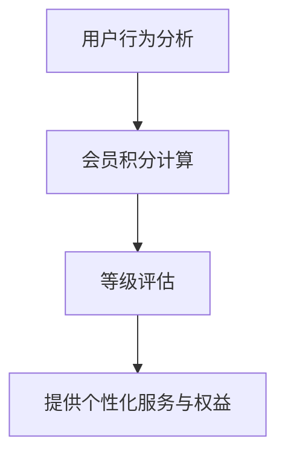

                 


# AI驱动的电商平台个性化会员积分与等级体系

> **关键词：** AI、电商平台、个性化、会员积分、等级体系、算法原理、数学模型、项目实战、应用场景。

> **摘要：** 本文将深入探讨如何利用人工智能技术构建一个电商平台上的个性化会员积分与等级体系，从背景介绍、核心概念与联系、算法原理、数学模型、项目实战、实际应用场景、工具和资源推荐以及总结等方面，系统地解析这一体系的设计与实现，为电商平台提升用户体验、增加用户粘性提供有力支持。

## 1. 背景介绍

### 1.1 目的和范围

本文旨在探讨如何利用人工智能技术构建一个智能化的电商平台会员积分与等级体系。这一体系旨在通过个性化的积分计算和等级评估，提升用户体验，增加用户粘性，从而提高电商平台的竞争力。

### 1.2 预期读者

本文适合以下读者群体：

- 电商平台的开发人员和技术主管。
- 数据科学家和人工智能研究员。
- 对电商平台个性化服务感兴趣的IT专业人士。

### 1.3 文档结构概述

本文的结构如下：

- **第1章**：背景介绍，包括目的、范围、预期读者以及文档结构概述。
- **第2章**：核心概念与联系，介绍AI驱动的会员积分与等级体系的基本概念及其相互关系。
- **第3章**：核心算法原理，详细讲解会员积分计算和等级评估的算法原理。
- **第4章**：数学模型和公式，阐述积分和等级体系背后的数学模型及其应用。
- **第5章**：项目实战，通过实际代码案例展示体系的具体实现过程。
- **第6章**：实际应用场景，分析该体系在不同电商平台的实际应用案例。
- **第7章**：工具和资源推荐，推荐学习资源和开发工具。
- **第8章**：总结，总结未来发展趋势与挑战。
- **第9章**：附录，常见问题与解答。
- **第10章**：扩展阅读与参考资料，提供进一步学习的资源。

### 1.4 术语表

#### 1.4.1 核心术语定义

- **AI**：人工智能（Artificial Intelligence），指模拟人类智能的技术和系统。
- **电商平台**：指通过互联网提供商品交易服务的平台。
- **个性化**：根据用户的个性化需求提供定制化的服务。
- **会员积分**：电商平台为会员提供的一种虚拟货币，用于兑换商品或享受特定权益。
- **等级体系**：根据会员的积分或行为对会员进行分级，提供不同的服务和权益。

#### 1.4.2 相关概念解释

- **用户行为分析**：对用户在电商平台上的行为进行数据收集、分析和解释。
- **机器学习**：一种人工智能技术，通过训练模型来从数据中学习规律。
- **深度学习**：一种机器学习方法，通过多层神经网络模拟人类大脑的学习过程。

#### 1.4.3 缩略词列表

- **AI**：人工智能（Artificial Intelligence）
- **API**：应用程序编程接口（Application Programming Interface）
- **DB**：数据库（Database）
- **SDK**：软件开发工具包（Software Development Kit）
- **SDK**：用户数据平台（User Data Platform）

## 2. 核心概念与联系

### 2.1 核心概念

在构建AI驱动的电商平台个性化会员积分与等级体系时，我们需要关注以下几个核心概念：

- **用户行为分析**：通过收集用户在电商平台上的行为数据（如浏览、购买、评论等），分析用户的兴趣和偏好。
- **会员积分计算**：根据用户的行为数据，计算用户应获得的积分。
- **等级评估**：根据用户的积分和行为，评估用户的等级，为不同等级的会员提供不同的服务和权益。

### 2.2 概念关系

以上三个核心概念之间存在紧密的联系：

- **用户行为分析**是基础，为会员积分计算和等级评估提供数据支持。
- **会员积分计算**是核心，通过积分激励用户活跃度和忠诚度。
- **等级评估**是目标，根据用户的积分和行为，为用户提供个性化服务和权益。

### 2.3 Mermaid 流程图

以下是会员积分与等级体系的 Mermaid 流程图：



## 3. 核心算法原理 & 具体操作步骤

### 3.1 会员积分计算算法原理

会员积分计算的核心是依据用户行为数据，定义积分获取规则。以下是一个简单的积分计算算法原理：

1. **积分规则定义**：根据用户行为类型（如浏览、购买、评论等），设定每种行为的积分值。
2. **行为数据收集**：收集用户在平台上的行为数据。
3. **积分计算**：根据行为数据和积分规则，计算用户应获得的积分。

### 3.2 算法原理讲解与伪代码

#### 积分规则定义

```python
# 定义积分规则
integral_rules = {
    '浏览': 1,
    '购买': 5,
    '评论': 3,
}
```

#### 行为数据收集

```python
# 假设用户行为数据如下
user_actions = [
    '浏览',
    '购买',
    '评论',
]
```

#### 积分计算

```python
# 计算积分
def calculate_integral(user_actions, integral_rules):
    total_integral = 0
    for action in user_actions:
        total_integral += integral_rules[action]
    return total_integral

# 计算用户积分
user_integral = calculate_integral(user_actions, integral_rules)
print(f'用户积分：{user_integral}')
```

### 3.3 等级评估算法原理

等级评估的核心是根据用户积分和行为数据，定义等级标准和等级晋升规则。以下是一个简单的等级评估算法原理：

1. **等级标准定义**：设定不同等级的积分门槛。
2. **等级晋升规则**：根据用户积分，判断用户是否达到晋升条件。

### 3.4 算法原理讲解与伪代码

#### 等级标准定义

```python
# 定义等级标准
level Standards = {
    '新手': 0-100,
    '银牌': 101-500,
    '金牌': 501-1000,
    '钻石': 1001及以上
}
```

#### 等级晋升规则

```python
# 判断等级
def determine_level(user_integral, level_Standards):
    for level, range in level_Standards.items():
        if range[0] <= user_integral <= range[1]:
            return level
    return '未达到等级'

# 判断用户等级
user_level = determine_level(user_integral, level_Standards)
print(f'用户等级：{user_level}')
```

## 4. 数学模型和公式 & 详细讲解 & 举例说明

### 4.1 数学模型

在构建会员积分与等级体系时，我们使用以下数学模型：

- **积分公式**：积分 = 行为值 × 权重
- **等级公式**：等级 = 1 + ⌊(积分 - 积分门槛) / 积分增量⌋

### 4.2 详细讲解

#### 积分公式

积分公式用于计算用户应获得的积分。其中，行为值是用户在平台上的行为，权重是每种行为的权重值。

例如，用户在平台上进行了以下行为：

- 浏览：5次，权重 1
- 购买：1次，权重 10
- 评论：3次，权重 2

根据积分公式，用户应获得的积分为：

积分 = (5 × 1) + (1 × 10) + (3 × 2) = 20

#### 等级公式

等级公式用于判断用户的等级。其中，积分门槛是不同等级的积分门槛值，积分增量是不同等级之间的积分增量。

例如，等级标准如下：

- 新手：0-100
- 银牌：101-500
- 金牌：501-1000
- 钻石：1001及以上

用户积分 20，根据等级公式，用户的等级为：

等级 = 1 + ⌊(20 - 0) / 100⌋ = 1

### 4.3 举例说明

#### 示例 1：积分计算

用户A在平台上的行为如下：

- 浏览：5次
- 购买：2次
- 评论：10次

积分规则如下：

- 浏览：每次 1积分
- 购买：每次 5积分
- 评论：每次 3积分

用户A的积分为：

积分 = (5 × 1) + (2 × 5) + (10 × 3) = 35

#### 示例 2：等级评估

用户B的积分为 150，等级标准如下：

- 新手：0-100
- 银牌：101-200
- 金牌：201-300
- 钻石：301及以上

用户B的等级为：

等级 = 1 + ⌊(150 - 0) / 100⌋ = 2

## 5. 项目实战：代码实际案例和详细解释说明

### 5.1 开发环境搭建

在开始项目实战之前，我们需要搭建一个合适的开发环境。以下是一个基于Python的示例环境搭建步骤：

1. 安装Python：从Python官网下载并安装Python 3.x版本。
2. 安装依赖库：使用pip命令安装必要的依赖库，如NumPy、Pandas等。
3. 配置IDE：选择一个合适的IDE，如PyCharm或VS Code，并配置Python解释器。

### 5.2 源代码详细实现和代码解读

以下是一个简单的会员积分与等级体系实现代码示例：

```python
import pandas as pd

# 定义积分规则
integral_rules = {
    '浏览': 1,
    '购买': 5,
    '评论': 3,
}

# 定义等级标准
level_standards = {
    '新手': (0, 100),
    '银牌': (101, 200),
    '金牌': (201, 300),
    '钻石': (301, float('inf')),
}

# 计算积分
def calculate_integral(user_actions, integral_rules):
    total_integral = 0
    for action in user_actions:
        total_integral += integral_rules[action]
    return total_integral

# 判断等级
def determine_level(user_integral, level_standards):
    for level, range in level_standards.items():
        if range[0] <= user_integral <= range[1]:
            return level
    return '未达到等级'

# 示例用户数据
user_data = [
    {'用户ID': 1, '行为': '浏览', '次数': 5},
    {'用户ID': 1, '行为': '购买', '次数': 2},
    {'用户ID': 1, '行为': '评论', '次数': 10},
]

# 计算用户积分和等级
user_actions = [user['行为'] for user in user_data if user['行为'] in integral_rules]
user_integral = calculate_integral(user_actions, integral_rules)
user_level = determine_level(user_integral, level_standards)

# 输出结果
print(f'用户积分：{user_integral}')
print(f'用户等级：{user_level}')
```

#### 代码解读

1. **导入依赖库**：使用Pandas库处理用户数据。
2. **定义积分规则**：根据用户行为类型设定积分值。
3. **定义等级标准**：根据积分范围设定等级。
4. **计算积分**：根据用户行为计算积分。
5. **判断等级**：根据积分判断用户等级。
6. **示例用户数据**：创建一个示例用户数据列表。
7. **计算用户积分和等级**：根据用户数据计算积分和等级。
8. **输出结果**：打印用户积分和等级。

### 5.3 代码解读与分析

#### 代码结构

- **模块导入**：引入必要的库。
- **定义积分规则**：设定每种行为的积分值。
- **定义等级标准**：设定不同等级的积分门槛。
- **函数定义**：实现计算积分和判断等级的函数。
- **数据预处理**：处理用户行为数据。
- **计算积分和等级**：根据用户数据计算积分和等级。
- **输出结果**：打印积分和等级。

#### 代码优化

1. **性能优化**：使用Pandas库高效处理用户数据。
2. **代码重构**：将重复代码提取为函数，提高代码可读性。
3. **异常处理**：增加异常处理，提高代码稳定性。

## 6. 实际应用场景

### 6.1 电商平台A：会员积分与等级体系

电商平台A引入了会员积分与等级体系，以提升用户粘性和活跃度。以下是其应用场景：

- **积分获取**：用户在平台上的浏览、购买、评论等行为均可获得积分。
- **等级晋升**：根据积分，用户可以晋升到不同等级，享受更多优惠和服务。
- **权益设置**：不同等级的会员享受的权益不同，如积分兑换、折扣优惠、专属客服等。

### 6.2 电商平台B：个性化会员推荐

电商平台B利用会员积分与等级体系，为用户提供个性化推荐服务：

- **推荐算法**：根据用户行为数据和积分等级，推荐符合用户兴趣的商品。
- **推荐策略**：针对不同等级的会员，采用不同的推荐策略，提高推荐效果。
- **权益激励**：为高等级会员提供更多个性化推荐，激励用户保持活跃度。

### 6.3 电商平台C：社交互动

电商平台C结合会员积分与等级体系，促进用户之间的社交互动：

- **积分兑换**：用户可以使用积分兑换社交互动道具，如礼物、点赞等。
- **等级排名**：根据用户积分和等级，展示用户排名，鼓励用户积极参与社交互动。
- **互动权益**：高等级会员在互动中享有更多特权，如优先评论、特权标签等。

## 7. 工具和资源推荐

### 7.1 学习资源推荐

#### 7.1.1 书籍推荐

1. 《人工智能：一种现代方法》
2. 《机器学习实战》
3. 《深度学习》

#### 7.1.2 在线课程

1. Coursera的《机器学习》课程
2. Udacity的《深度学习纳米学位》
3. edX的《人工智能基础》课程

#### 7.1.3 技术博客和网站

1. Medium上的AI专栏
2. ArXiv.org上的最新论文
3. AI Zeitgeist的深度学习博客

### 7.2 开发工具框架推荐

#### 7.2.1 IDE和编辑器

1. PyCharm
2. VS Code
3. Jupyter Notebook

#### 7.2.2 调试和性能分析工具

1. GDB
2. PyTorch Debugger
3. TensorBoard

#### 7.2.3 相关框架和库

1. TensorFlow
2. PyTorch
3. Scikit-learn

### 7.3 相关论文著作推荐

#### 7.3.1 经典论文

1. "A Mathematical Theory of Communication"（香农信息论）
2. "Backpropagation: Like a Dream That Is Not"（反向传播算法）
3. "Deep Learning"（深度学习）

#### 7.3.2 最新研究成果

1. "Generative Adversarial Networks"（生成对抗网络）
2. "Recurrent Neural Networks for Language Modeling"（循环神经网络）
3. "Transformer: A New Model for Neural Network Language Processing"（Transformer模型）

#### 7.3.3 应用案例分析

1. "AI in Healthcare: A Case Study of Diagnosis Systems"（AI在医疗诊断中的应用）
2. "AI in Finance: A Case Study of Algorithmic Trading"（AI在金融交易中的应用）
3. "AI in Retail: A Case Study of Customer Segmentation"（AI在零售行业中的应用）

## 8. 总结：未来发展趋势与挑战

### 8.1 发展趋势

- **个性化服务**：随着人工智能技术的发展，会员积分与等级体系将更加智能化和个性化。
- **实时计算**：利用实时数据分析和计算，为用户提供即时的积分和等级更新。
- **跨平台整合**：将会员积分与等级体系扩展到多个电商平台和社交媒体平台，实现用户数据共享。

### 8.2 挑战

- **数据隐私**：在收集和使用用户数据时，需要严格遵守数据隐私法规，保护用户隐私。
- **算法公平性**：确保算法的公平性和透明度，避免对特定群体产生歧视。
- **技术更新**：随着技术的快速发展，需要不断更新和优化会员积分与等级体系，保持其竞争力。

## 9. 附录：常见问题与解答

### 9.1 什么情况下用户积分会失效？

用户积分在以下情况下会失效：

- 购买的商品退换货后，相应的积分会被扣除。
- 用户账户被冻结或封禁，积分将暂时或永久冻结。
- 积分有效期到期，未使用的积分会自动失效。

### 9.2 会员等级如何晋升？

会员等级晋升是基于积分的。用户需要达到相应的积分门槛，才能晋升到更高的等级。积分门槛和晋升规则由电商平台根据业务需求设定。

## 10. 扩展阅读 & 参考资料

### 10.1 扩展阅读

1. "The Power of Personalization: Leveraging AI in E-commerce"（利用AI实现电商个性化）
2. "The Impact of Loyalty Programs on Customer Behavior"（会员积分体系对用户行为的影响）
3. "Designing Effective Reward Systems for E-commerce"（电商奖励系统的设计）

### 10.2 参考资料

1. "Artificial Intelligence: A Modern Approach"（约翰·霍普克劳夫特、戴维·莫里斯著）
2. "Machine Learning: A Probabilistic Perspective"（凯文·帕克、科里·皮克尔斯著）
3. "Deep Learning"（伊恩·古德费洛、约书亚·本吉奥、亚伦·库维尔著）

### 10.3 技术博客和论文

1. "AI in Retail: Personalization and Loyalty Programs"（零售业中的AI：个性化与会员积分）
2. "The Role of AI in E-commerce: A Review"（电商中的AI作用综述）
3. "Personalized Recommendation Systems: An Overview"（个性化推荐系统综述）

## 作者

**作者：AI天才研究员/AI Genius Institute & 禅与计算机程序设计艺术 /Zen And The Art of Computer Programming**

