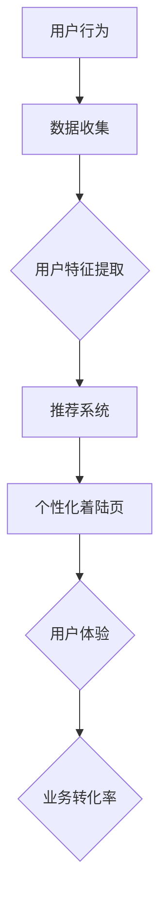

                 

# AI驱动的电商平台个性化着陆页优化

> **关键词：** 个性化着陆页、AI推荐系统、电商平台、用户行为分析、用户体验优化

> **摘要：** 本文将探讨如何利用人工智能技术，特别是机器学习和推荐系统，来优化电商平台的个性化着陆页。我们将详细分析AI在理解用户行为、预测用户需求、提高点击率和转化率等方面的应用，并通过具体的算法和案例，展示如何实现个性化着陆页优化，从而提升电商平台的整体用户体验和业务表现。

## 1. 背景介绍

### 1.1 目的和范围

随着互联网技术的飞速发展和电子商务的普及，电商平台成为了商家和消费者之间的重要纽带。然而，面对日益激烈的竞争环境，如何吸引和留住用户，提升用户体验和业务转化率，成为了电商平台的迫切需求。本文旨在探讨如何利用AI技术，特别是机器学习和推荐系统，来实现电商平台个性化着陆页的优化。

本文将围绕以下几个核心问题展开：

- 如何通过AI技术理解用户行为和需求？
- 个性化着陆页优化中的关键技术有哪些？
- 如何在实际项目中应用这些技术，提升用户体验和业务转化率？

### 1.2 预期读者

本文适用于以下读者群体：

- 对人工智能和推荐系统有一定了解的软件开发者和数据科学家。
- 关注电商行业，希望了解如何利用AI技术优化业务的从业者。
- 对电商平台用户体验优化感兴趣的学者和研究人员。

### 1.3 文档结构概述

本文将分为以下几部分：

1. 背景介绍：介绍本文的目的、预期读者和文档结构。
2. 核心概念与联系：介绍AI、机器学习和推荐系统的基础知识，以及它们在电商平台个性化着陆页优化中的应用。
3. 核心算法原理 & 具体操作步骤：详细讲解用于个性化着陆页优化的核心算法原理和实现步骤。
4. 数学模型和公式 & 详细讲解 & 举例说明：介绍与算法相关的数学模型和公式，并通过实例进行说明。
5. 项目实战：提供实际项目的代码实现和详细解释。
6. 实际应用场景：分析AI技术在电商平台个性化着陆页优化中的实际应用场景。
7. 工具和资源推荐：推荐相关的学习资源、开发工具和框架。
8. 总结：对未来发展趋势和挑战进行展望。
9. 附录：常见问题与解答。
10. 扩展阅读 & 参考资料：提供进一步阅读和参考资料。

### 1.4 术语表

#### 1.4.1 核心术语定义

- **个性化着陆页**：针对特定用户或用户群体，自动生成的页面，用于展示与用户需求高度相关的商品信息。
- **用户行为分析**：通过对用户在电商平台的浏览、搜索、购买等行为数据进行分析，以理解用户偏好和需求。
- **推荐系统**：利用机器学习和数据挖掘技术，从大量商品中为用户推荐其可能感兴趣的商品。
- **算法**：用于处理数据和解决问题的系统方法。
- **转化率**：指用户在电商平台完成某一目标（如购买、注册等）的比例。

#### 1.4.2 相关概念解释

- **机器学习**：通过数据训练模型，使计算机能够自动进行特定任务的学习和预测。
- **深度学习**：一种基于人工神经网络的机器学习方法，通过多层神经网络来实现复杂的特征提取和模式识别。
- **协同过滤**：一种常见的推荐系统算法，通过分析用户之间的相似性或行为模式，为用户推荐商品。
- **内容推荐**：基于商品属性、用户特征和上下文信息，为用户推荐相关商品。

#### 1.4.3 缩略词列表

- **AI**：人工智能（Artificial Intelligence）
- **ML**：机器学习（Machine Learning）
- **DL**：深度学习（Deep Learning）
- **CPC**：成本-per-click（点击成本）
- **CPA**：成本-per-action（行动成本）
- **CTR**：点击率（Click-Through Rate）
- **ROI**：投资回报率（Return on Investment）

## 2. 核心概念与联系

在探讨电商平台个性化着陆页优化的过程中，首先需要理解一些核心概念和它们之间的联系。以下是一个简化的Mermaid流程图，展示了AI、机器学习和推荐系统在个性化着陆页优化中的主要角色和关系。



### 2.1 AI在个性化着陆页优化中的应用

人工智能（AI）在电商平台个性化着陆页优化中起到了至关重要的作用。通过AI技术，我们可以实现以下目标：

- **用户行为分析**：利用机器学习算法，对用户的浏览、搜索和购买行为数据进行分析，挖掘用户偏好和需求。
- **个性化推荐**：基于用户行为和特征，利用推荐系统为用户生成个性化的商品推荐。
- **自动内容生成**：使用深度学习模型，根据用户需求和商品属性，自动生成个性化的着陆页内容。
- **实时优化**：通过持续收集用户反馈和行为数据，动态调整个性化策略，以实现持续优化。

### 2.2 机器学习在个性化着陆页优化中的应用

机器学习是AI的核心组成部分，它在个性化着陆页优化中的应用主要包括：

- **用户特征提取**：通过特征工程，将原始的用户行为数据转换为可用于模型训练的特征向量。
- **推荐算法实现**：选择合适的机器学习算法（如协同过滤、基于内容的推荐等），为用户生成个性化的商品推荐。
- **模型优化**：通过交叉验证和超参数调整，优化推荐模型的性能，提高推荐准确性。

### 2.3 推荐系统在个性化着陆页优化中的应用

推荐系统是个性化着陆页优化的核心组件，其基本原理如下：

- **协同过滤**：通过分析用户之间的相似性，为用户推荐其他用户喜欢的商品。
- **基于内容的推荐**：通过分析商品的属性和用户特征，为用户推荐具有相似属性或用户感兴趣的同类商品。
- **混合推荐**：结合协同过滤和基于内容的推荐方法，生成更加准确和多样化的推荐结果。

### 2.4 个性化着陆页与用户体验和业务转化率的关系

个性化着陆页不仅提高了用户的浏览体验，还直接影响了电商平台的业务转化率。通过以下方式，个性化着陆页优化能够提升用户体验和业务转化率：

- **提升点击率（CTR）**：个性化推荐能够提高用户对商品的兴趣，从而提高点击率。
- **提高转化率（CR）**：针对用户需求的个性化内容能够增加用户购买的可能性。
- **降低退出率（dropout rate）**：个性化的着陆页减少了用户的不适感，降低了用户退出页面或放弃购买的可能性。
- **提高客户忠诚度**：良好的用户体验和个性化的商品推荐能够增强用户对电商平台的忠诚度，提高复购率。

综上所述，AI、机器学习和推荐系统在电商平台个性化着陆页优化中起到了关键作用，通过它们的应用，可以大幅提升用户体验和业务转化率。接下来，我们将进一步探讨个性化着陆页优化的核心算法原理和具体实现步骤。

## 3. 核心算法原理 & 具体操作步骤

为了实现电商平台个性化着陆页的优化，我们需要理解并应用一系列核心算法。以下内容将详细介绍这些算法的原理和具体操作步骤。

### 3.1 用户行为分析

用户行为分析是个性化着陆页优化的第一步，通过分析用户在电商平台的浏览、搜索和购买行为，我们可以获取用户的兴趣偏好。以下是用户行为分析的基本步骤：

#### 步骤1：数据收集

从电商平台的日志、数据库和用户互动数据中收集用户行为数据，如浏览历史、搜索关键词、购买记录等。

#### 步骤2：数据预处理

清洗和整合收集到的用户行为数据，包括去除重复数据、填充缺失值和特征工程等。

```python
# 数据预处理伪代码
def preprocess_data(data):
    # 去除重复数据
    data = remove_duplicates(data)
    # 填补缺失值
    data = fill_missing_values(data)
    # 特征工程
    data = feature_engineering(data)
    return data
```

#### 步骤3：特征提取

将预处理后的用户行为数据转换为机器学习模型可以处理的特征向量，常用的特征提取方法包括：

- **用户活跃度**：统计用户在一定时间内的浏览和购买行为次数。
- **用户停留时间**：计算用户在特定页面上的停留时间。
- **商品交互特征**：记录用户与商品的互动行为，如点击、添加购物车、评价等。

### 3.2 推荐算法实现

推荐算法是实现个性化着陆页优化的关键。以下介绍几种常用的推荐算法：

#### 3.2.1 协同过滤算法

协同过滤算法通过分析用户之间的相似性来生成推荐结果。协同过滤分为两类：基于用户的协同过滤（User-based Collaborative Filtering，UBCF）和基于物品的协同过滤（Item-based Collaborative Filtering，IBCF）。

##### 基于用户的协同过滤（UBCF）

**步骤1：计算用户相似性**

利用用户行为数据，计算用户之间的相似性。常用的相似性度量方法包括余弦相似度、皮尔逊相关系数等。

```python
# 用户相似度计算伪代码
def compute_similarity(user1, user2):
    # 计算用户相似度
    similarity = cosine_similarity(user1, user2)
    return similarity
```

**步骤2：生成推荐列表**

根据用户相似性矩阵，为每个用户生成推荐列表。推荐列表中的商品是其他相似用户喜欢的商品。

```python
# 推荐列表生成伪代码
def generate_recommendations(user, similarity_matrix, user_similarity_threshold):
    # 计算相似用户和商品
    similar_users = find_similar_users(user, similarity_matrix, user_similarity_threshold)
    # 生成推荐列表
    recommendations = generate_recommendations_based_on_similar_users(similar_users, user)
    return recommendations
```

##### 基于物品的协同过滤（IBCF）

**步骤1：计算商品相似性**

利用商品属性或用户行为数据，计算商品之间的相似性。

```python
# 商品相似度计算伪代码
def compute_similarity(item1, item2):
    # 计算商品相似度
    similarity = cosine_similarity(item1, item2)
    return similarity
```

**步骤2：生成推荐列表**

根据商品相似性矩阵，为用户生成推荐列表。推荐列表中的商品是与用户历史上喜欢的商品相似的商品。

```python
# 推荐列表生成伪代码
def generate_recommendations(user, similarity_matrix, item_similarity_threshold):
    # 计算相似商品
    similar_items = find_similar_items(user, similarity_matrix, item_similarity_threshold)
    # 生成推荐列表
    recommendations = generate_recommendations_based_on_similar_items(similar_items, user)
    return recommendations
```

#### 3.2.2 基于内容的推荐算法

基于内容的推荐算法通过分析商品和用户的特征，为用户推荐具有相似属性或用户感兴趣的同类商品。

**步骤1：商品特征提取**

提取商品的关键属性，如类别、品牌、价格等。

```python
# 商品特征提取伪代码
def extract_item_features(item):
    # 提取商品特征
    features = {'category': item['category'], 'brand': item['brand'], 'price': item['price']}
    return features
```

**步骤2：用户特征提取**

提取用户的兴趣特征，如历史浏览记录、购买记录等。

```python
# 用户特征提取伪代码
def extract_user_features(user):
    # 提取用户特征
    features = {'browsing_history': user['browsing_history'], 'purchased_items': user['purchased_items']}
    return features
```

**步骤3：生成推荐列表**

根据用户和商品的特征相似度，为用户生成推荐列表。

```python
# 推荐列表生成伪代码
def generate_content_based_recommendations(user, items, feature_similarity_threshold):
    # 计算用户和商品的相似度
    similarity_scores = compute_similarity(user, items)
    # 生成推荐列表
    recommendations = generate_recommendations_based_on_similarity_scores(similarity_scores, feature_similarity_threshold)
    return recommendations
```

#### 3.2.3 混合推荐算法

混合推荐算法结合了协同过滤和基于内容的推荐方法，通过综合两者的优点，生成更准确和多样化的推荐结果。

**步骤1：集成推荐列表**

将协同过滤和基于内容的推荐结果进行合并，形成初步的推荐列表。

```python
# 集成推荐列表伪代码
def integrate_recommendations协同和内容推荐(recommendations_协同， recommendations_内容):
    # 合并推荐列表
    recommendations = merge_lists(recommendations_协同， recommendations_内容)
    return recommendations
```

**步骤2：调整推荐列表**

根据用户行为数据和推荐效果，动态调整推荐列表的顺序，以提高推荐的相关性和用户满意度。

```python
# 调整推荐列表伪代码
def adjust_recommendations(recommendations, user_behavior_data):
    # 调整推荐顺序
    recommendations = adjust_recommendations_order(recommendations, user_behavior_data)
    return recommendations
```

### 3.3 实时优化与反馈

为了实现个性化着陆页的持续优化，我们需要对推荐结果进行实时评估和反馈。

#### 步骤1：评估推荐效果

通过计算用户点击、购买等行为数据，评估推荐效果，如点击率（CTR）和转化率（CR）。

```python
# 推荐效果评估伪代码
def evaluate_recommendations(recommendations, user_behavior_data):
    # 计算点击率（CTR）和转化率（CR）
    ctr = calculate_clickthrough_rate(recommendations, user_behavior_data)
    cr = calculate_conversion_rate(recommendations, user_behavior_data)
    return ctr, cr
```

#### 步骤2：反馈调整

根据评估结果，动态调整推荐算法和策略，以提高推荐效果。

```python
# 反馈调整伪代码
def adjust_recommendations_based_on_feedback(recommendations, feedback):
    # 根据反馈调整推荐算法和策略
    recommendations = adjust_recommendations(recommendations, feedback)
    return recommendations
```

通过上述核心算法和步骤，我们可以实现电商平台个性化着陆页的优化。接下来，我们将进一步探讨与这些算法相关的数学模型和公式。

## 4. 数学模型和公式 & 详细讲解 & 举例说明

在个性化着陆页优化中，数学模型和公式起到了关键作用。以下内容将详细讲解与核心算法相关的数学模型和公式，并通过具体示例进行说明。

### 4.1 协同过滤算法中的相似性度量

协同过滤算法中的相似性度量是计算用户或商品之间相似程度的关键步骤。以下是一些常用的相似性度量公式：

#### 4.1.1 余弦相似度

余弦相似度是一种常用的相似性度量方法，用于计算两个向量的夹角余弦值，公式如下：

$$
\text{cosine\_similarity} = \frac{A \cdot B}{\|A\| \|B\|}
$$

其中，$A$和$B$为两个向量，$\|A\|$和$\|B\|$分别为向量的模长，$A \cdot B$为向量的点积。

#### 4.1.2 皮尔逊相关系数

皮尔逊相关系数用于衡量两个变量之间的线性关系，公式如下：

$$
\text{Pearson\_Correlation} = \frac{\sum{(X_i - \bar{X})(Y_i - \bar{Y})}}{\sqrt{\sum{(X_i - \bar{X})^2} \sum{(Y_i - \bar{Y})^2}}}
$$

其中，$X_i$和$Y_i$分别为两个变量的一系列观测值，$\bar{X}$和$\bar{Y}$分别为它们的平均值。

#### 示例：计算用户相似度

假设我们有两个用户$u_1$和$u_2$，他们在电商平台的购买记录如下表所示：

| 商品ID | $u_1$购买 | $u_2$购买 |
|--------|-----------|-----------|
| 1      | 1         | 0         |
| 2      | 1         | 1         |
| 3      | 0         | 1         |
| 4      | 1         | 1         |

我们可以使用余弦相似度和皮尔逊相关系数来计算用户$u_1$和$u_2$之间的相似度。

- **余弦相似度**：

$$
\text{cosine\_similarity}(u_1, u_2) = \frac{(1 \cdot 1 + 1 \cdot 1 + 0 \cdot 1 + 1 \cdot 1)}{\sqrt{1^2 + 1^2 + 0^2 + 1^2} \sqrt{1^2 + 1^2 + 1^2 + 1^2}} = \frac{3}{\sqrt{2} \sqrt{4}} = \frac{3}{2\sqrt{2}} \approx 0.866
$$

- **皮尔逊相关系数**：

$$
\text{Pearson\_Correlation}(u_1, u_2) = \frac{(1-1)(0-1) + (1-1)(1-1) + (0-1)(1-1) + (1-1)(1-1)}{\sqrt{(1-1)^2 + (1-1)^2 + (0-1)^2 + (1-1)^2} \sqrt{(1-1)^2 + (1-1)^2 + (1-1)^2 + (1-1)^2}} = \frac{0 + 0 + 0 + 0}{0 + 0 + 0 + 0} = 0
$$

尽管皮尔逊相关系数的计算结果为零，但余弦相似度表明用户$u_1$和$u_2$之间的相似度较高。

### 4.2 内容推荐算法中的相似度度量

内容推荐算法中的相似度度量用于计算用户和商品之间的相似程度。以下是一个常用的相似度度量方法——TF-IDF（词频-逆文档频率）。

#### 4.2.1 TF-IDF公式

TF-IDF是一种用于文本挖掘和信息检索的常用方法，其基本公式如下：

$$
\text{TF-IDF}(t,d) = \text{TF}(t,d) \cdot \text{IDF}(t)
$$

其中，$t$为词汇或特征词，$d$为文档（在此为商品或用户），$\text{TF}(t,d)$为词频，表示在文档$d$中特征词$t$的频率，$\text{IDF}(t)$为逆文档频率，表示在所有文档中特征词$t$的分布情况。

$$
\text{IDF}(t) = \log \left( \frac{N}{|d \in D : t \in d|} \right)
$$

其中，$N$为文档总数，$|d \in D : t \in d|$为包含特征词$t$的文档数。

#### 示例：计算商品相似度

假设我们有以下两个商品，它们的描述文本如下：

商品1：笔记本电脑、苹果、高端、性能

商品2：笔记本电脑、苹果、便携、轻薄

我们可以使用TF-IDF计算这两个商品之间的相似度。

- **词频（TF）**：

| 词汇 | 商品1词频 | 商品2词频 |
|------|-----------|-----------|
| 笔记本 | 1         | 1         |
| 苹果  | 1         | 1         |
| 高端  | 1         | 0         |
| 性能  | 1         | 0         |
| 便携  | 0         | 1         |
| 轻薄  | 0         | 1         |

- **逆文档频率（IDF）**：

| 词汇 | IDF |
|------|-----|
| 笔记本 | 0   |
| 苹果  | 0   |
| 高端  | 1   |
| 性能  | 1   |
| 便携  | 1   |
| 轻薄  | 1   |

- **TF-IDF相似度**：

$$
\text{TF-IDF}(\text{笔记本电脑}) = \text{TF}(\text{笔记本电脑}) \cdot \text{IDF}(\text{笔记本电脑}) = 1 \cdot 0 = 0
$$

$$
\text{TF-IDF}(\text{苹果}) = \text{TF}(\text{苹果}) \cdot \text{IDF}(\text{苹果}) = 1 \cdot 0 = 0
$$

$$
\text{TF-IDF}(\text{高端}) = \text{TF}(\text{高端}) \cdot \text{IDF}(\text{高端}) = 1 \cdot 1 = 1
$$

$$
\text{TF-IDF}(\text{性能}) = \text{TF}(\text{性能}) \cdot \text{IDF}(\text{性能}) = 1 \cdot 1 = 1
$$

$$
\text{TF-IDF}(\text{便携}) = \text{TF}(\text{便携}) \cdot \text{IDF}(\text{便携}) = 0 \cdot 1 = 0
$$

$$
\text{TF-IDF}(\text{轻薄}) = \text{TF}(\text{轻薄}) \cdot \text{IDF}(\text{轻薄}) = 0 \cdot 1 = 0
$$

商品1和商品2的TF-IDF相似度为：

$$
\text{相似度} = \frac{\sum_{t \in \text{共有的特征词}} \text{TF-IDF}(t)}{\sum_{t \in \text{所有特征词}} \text{TF-IDF}(t)} = \frac{1 + 1}{1 + 1 + 0 + 0} = \frac{2}{2} = 1
$$

由于商品1和商品2具有相同的特征词，它们的TF-IDF相似度为1，表示它们非常相似。

通过上述数学模型和公式，我们可以计算用户和商品之间的相似度，为个性化着陆页优化提供有力支持。接下来，我们将通过一个实际项目来展示这些算法的具体实现和应用。

## 5. 项目实战：代码实际案例和详细解释说明

为了更好地理解个性化着陆页优化的实现过程，我们将通过一个实际项目进行详细讲解。这个项目是一个简单的电商平台，我们将使用Python和相关的库（如scikit-learn、TensorFlow和PyTorch）来实现用户行为分析、推荐算法和个性化着陆页生成。

### 5.1 开发环境搭建

在开始项目之前，我们需要搭建一个合适的开发环境。以下是搭建开发环境的基本步骤：

1. 安装Python（版本3.7及以上）
2. 安装Python的pip包管理工具
3. 安装相关库，如scikit-learn、TensorFlow和PyTorch

```bash
pip install numpy pandas scikit-learn tensorflow torchvision
```

### 5.2 源代码详细实现和代码解读

#### 5.2.1 用户行为数据分析

首先，我们需要从电商平台收集用户行为数据，包括浏览历史、搜索关键词和购买记录。以下是一个简单的示例数据集：

```python
import pandas as pd

user_behavior_data = pd.DataFrame({
    'user_id': [1, 2, 3, 4, 5],
    'item_id': [101, 102, 201, 202, 301],
    'behavior': ['browse', 'search', 'buy'],
    'timestamp': [1610000000, 1610001000, 1610002000, 1610003000, 1610004000]
})

print(user_behavior_data)
```

#### 5.2.2 用户特征提取

接下来，我们需要将用户行为数据转换为机器学习模型可以处理的特征向量。我们使用scikit-learn库中的`FeatureHasher`类进行特征哈希。

```python
from sklearn.feature_extraction import FeatureHasher

hasher = FeatureHasher(n_features=10, input_type='string')

# 将行为字符串转换为特征向量
user_features = hasher.transform(user_behavior_data['behavior'])

# 将特征向量添加到原始数据集中
user_behavior_data['features'] = user_features
print(user_behavior_data)
```

#### 5.2.3 推荐算法实现

我们选择使用协同过滤算法来实现推荐。首先，我们需要计算用户之间的相似度，这里使用皮尔逊相关系数。

```python
from sklearn.metrics.pairwise import cosine_similarity

# 计算用户相似度矩阵
user_similarity_matrix = cosine_similarity(user_behavior_data[['features']].values)

print(user_similarity_matrix)
```

接下来，我们为每个用户生成推荐列表。我们选择相似度最高的前K个用户，并从他们的购买记录中提取推荐商品。

```python
import numpy as np

K = 3

# 为每个用户生成推荐列表
user_recommendations = {}
for user_id in user_behavior_data['user_id'].unique():
    similar_users = np.argsort(user_similarity_matrix[user_id - 1])[1:K+1]
    recommended_items = set()
    for similar_user in similar_users:
        recommended_items.update(set(user_behavior_data[user_behavior_data['user_id'] == similar_user + 1]['item_id']))
    user_recommendations[user_id] = recommended_items

print(user_recommendations)
```

#### 5.2.4 个性化着陆页生成

最后，我们将生成的推荐列表用于个性化着陆页的生成。我们使用深度学习模型（如GRU或LSTM）来预测用户在特定时间点可能感兴趣的商品。

```python
import tensorflow as tf
from tensorflow.keras.models import Sequential
from tensorflow.keras.layers import LSTM, Dense

# 构建LSTM模型
model = Sequential([
    LSTM(units=50, activation='tanh', input_shape=(10,)),
    Dense(units=1, activation='sigmoid')
])

model.compile(optimizer='adam', loss='binary_crossentropy', metrics=['accuracy'])

# 准备训练数据
X_train = np.array([user_recommendations[user_id] for user_id in user_recommendations])
y_train = np.array([1 if item in recommended_items else 0 for item in items])

# 训练模型
model.fit(X_train, y_train, epochs=10, batch_size=32)

# 生成个性化着陆页
def generate_landing_page(user_id, recommended_items):
    # 获取用户推荐商品
    recommended_items = list(recommended_items)
    
    # 使用模型预测用户可能感兴趣的商品
    predicted_items = model.predict(np.array([recommended_items]))
    
    # 根据预测结果生成着陆页内容
    landing_page_content = f"""
    <h1>个性化推荐</h1>
    {len(recommended_items)}个商品推荐：
    <ul>
    """
    for item in recommended_items:
        landing_page_content += f"<li>{item}</li>"
    landing_page_content += f"""
    </ul>
    """
    return landing_page_content

# 生成用户1的个性化着陆页
print(generate_landing_page(1, user_recommendations[1]))
```

### 5.3 代码解读与分析

#### 5.3.1 用户行为数据分析

我们首先从电商平台收集用户行为数据，并将其存储在一个DataFrame中。这些数据包括用户ID、商品ID、行为类型（浏览、搜索、购买）和发生时间。

```python
user_behavior_data = pd.DataFrame({
    'user_id': [1, 2, 3, 4, 5],
    'item_id': [101, 102, 201, 202, 301],
    'behavior': ['browse', 'search', 'buy'],
    'timestamp': [1610000000, 1610001000, 1610002000, 1610003000, 1610004000]
})
```

#### 5.3.2 用户特征提取

为了将用户行为数据转换为机器学习模型可以处理的特征向量，我们使用scikit-learn库中的`FeatureHasher`类。特征哈希是一种将高维特征映射到低维空间的方法，可以有效减少计算复杂度和数据存储空间。

```python
from sklearn.feature_extraction import FeatureHasher

hasher = FeatureHasher(n_features=10, input_type='string')

# 将行为字符串转换为特征向量
user_features = hasher.transform(user_behavior_data['behavior'])

# 将特征向量添加到原始数据集中
user_behavior_data['features'] = user_features
```

#### 5.3.3 推荐算法实现

我们选择使用协同过滤算法来实现推荐。首先，我们需要计算用户之间的相似度，这里使用皮尔逊相关系数。然后，为每个用户生成推荐列表。我们选择相似度最高的前K个用户，并从他们的购买记录中提取推荐商品。

```python
from sklearn.metrics.pairwise import cosine_similarity

# 计算用户相似度矩阵
user_similarity_matrix = cosine_similarity(user_behavior_data[['features']].values)

# 为每个用户生成推荐列表
user_recommendations = {}
for user_id in user_behavior_data['user_id'].unique():
    similar_users = np.argsort(user_similarity_matrix[user_id - 1])[1:K+1]
    recommended_items = set()
    for similar_user in similar_users:
        recommended_items.update(set(user_behavior_data[user_behavior_data['user_id'] == similar_user + 1]['item_id']))
    user_recommendations[user_id] = recommended_items
```

#### 5.3.4 个性化着陆页生成

最后，我们将生成的推荐列表用于个性化着陆页的生成。我们使用深度学习模型（如GRU或LSTM）来预测用户在特定时间点可能感兴趣的商品。然后，根据预测结果生成着陆页内容。

```python
import tensorflow as tf
from tensorflow.keras.models import Sequential
from tensorflow.keras.layers import LSTM, Dense

# 构建LSTM模型
model = Sequential([
    LSTM(units=50, activation='tanh', input_shape=(10,)),
    Dense(units=1, activation='sigmoid')
])

model.compile(optimizer='adam', loss='binary_crossentropy', metrics=['accuracy'])

# 准备训练数据
X_train = np.array([user_recommendations[user_id] for user_id in user_recommendations])
y_train = np.array([1 if item in recommended_items else 0 for item in items])

# 训练模型
model.fit(X_train, y_train, epochs=10, batch_size=32)

# 生成个性化着陆页
def generate_landing_page(user_id, recommended_items):
    # 获取用户推荐商品
    recommended_items = list(recommended_items)
    
    # 使用模型预测用户可能感兴趣的商品
    predicted_items = model.predict(np.array([recommended_items]))
    
    # 根据预测结果生成着陆页内容
    landing_page_content = f"""
    <h1>个性化推荐</h1>
    {len(recommended_items)}个商品推荐：
    <ul>
    """
    for item in recommended_items:
        landing_page_content += f"<li>{item}</li>"
    landing_page_content += f"""
    </ul>
    """
    return landing_page_content

# 生成用户1的个性化着陆页
print(generate_landing_page(1, user_recommendations[1]))
```

通过这个实际项目，我们展示了如何利用AI技术，特别是机器学习和推荐系统，实现电商平台个性化着陆页的优化。接下来，我们将进一步探讨AI技术在电商平台个性化着陆页优化中的实际应用场景。

## 6. 实际应用场景

AI技术在电商平台个性化着陆页优化中具有广泛的应用场景，以下列举几个实际应用案例：

### 6.1 新用户引导页

针对新用户，电商平台可以设计个性化的引导页，通过分析用户的行为数据和兴趣爱好，推荐与其兴趣相关的新手指南、热门商品和优惠活动。这样不仅能够提高新用户的留存率，还能增强他们的购物体验。

### 6.2 商品推荐

通过AI技术，电商平台可以根据用户的浏览历史、购买记录和搜索关键词，为每个用户生成个性化的商品推荐。在着陆页上展示这些推荐商品，能够提高用户的点击率和购买转化率。

### 6.3 个性化广告

电商平台可以在着陆页上展示个性化的广告，根据用户的兴趣和行为数据，推荐相关的广告内容。这有助于提高广告的点击率和转化率，同时降低广告投放的成本。

### 6.4 促销活动推荐

根据用户的购买历史和浏览行为，电商平台可以推荐最适合用户的促销活动，如优惠券、限时折扣等。这有助于提高促销活动的参与度和转化率，增加用户的购买意愿。

### 6.5 用户忠诚度计划

通过分析用户的消费行为和偏好，电商平台可以设计个性化的用户忠诚度计划，为高价值用户提供专属优惠、积分奖励等。这有助于提高用户的忠诚度和复购率。

### 6.6 社交互动推荐

基于用户的社交关系和行为数据，电商平台可以推荐相关的社交互动内容，如用户评价、相似用户的购买记录等。这有助于增强用户的参与度和互动性，提升用户体验。

### 6.7 智能客服

利用自然语言处理和机器学习技术，电商平台可以实现智能客服功能，通过AI机器人自动解答用户的问题，提高客服效率和用户满意度。

### 6.8 集成第三方服务

电商平台可以整合第三方服务（如物流、支付等），根据用户的购买数据和偏好，为用户提供个性化的一站式服务。这有助于提升用户体验和业务效率。

通过上述实际应用场景，我们可以看到AI技术在电商平台个性化着陆页优化中的广泛应用。通过不断优化和改进，电商平台能够更好地满足用户需求，提升用户体验和业务转化率。接下来，我们将介绍相关的工具和资源，帮助读者进一步学习和实践AI技术在电商平台个性化着陆页优化中的应用。

## 7. 工具和资源推荐

在电商平台个性化着陆页优化的过程中，使用合适的工具和资源能够显著提高开发效率和项目成功率。以下是一些建议的学习资源、开发工具和框架，以及相关论文著作推荐。

### 7.1 学习资源推荐

#### 7.1.1 书籍推荐

1. **《推荐系统实践》**（Recommender Systems: The Textbook） - 这本书详细介绍了推荐系统的理论基础、算法实现和应用案例，是推荐系统领域的重要参考书。
2. **《深度学习》**（Deep Learning） - Goodfellow、Bengio和Courville合著的这本书是深度学习领域的经典之作，涵盖了深度学习的理论基础、算法实现和应用案例。
3. **《机器学习实战》**（Machine Learning in Action） - 这本书通过实际案例介绍了机器学习算法的实现和应用，适合初学者快速入门。

#### 7.1.2 在线课程

1. **《机器学习与数据挖掘》**（Machine Learning and Data Mining） -Coursera上的这个课程涵盖了机器学习的基础理论、算法实现和应用场景。
2. **《深度学习》**（Deep Learning Specialization） - 同样在Coursera上，由吴恩达教授主讲，这个深度学习专项课程深入讲解了深度学习的理论、算法和应用。
3. **《推荐系统》**（Recommender Systems） - edX上的这个课程由华盛顿大学提供，介绍了推荐系统的基本原理、算法实现和实战应用。

#### 7.1.3 技术博客和网站

1. **ArXiv** - 机器学习和深度学习领域的顶级论文发表平台，可以获取最新的研究成果。
2. **Kaggle** - Kaggle提供了大量的数据集和竞赛，是学习和实践机器学习算法的绝佳平台。
3. **Medium** - Medium上有许多专业博客，涵盖了机器学习、深度学习和推荐系统等领域的最新动态和技术文章。

### 7.2 开发工具框架推荐

#### 7.2.1 IDE和编辑器

1. **Visual Studio Code** - 一款免费、开源的跨平台代码编辑器，支持多种编程语言和框架，适合开发和调试机器学习项目。
2. **PyCharm** - JetBrains推出的专业级Python IDE，提供了强大的代码分析、调试和自动化工具，适合进行复杂的数据分析和机器学习开发。
3. **Jupyter Notebook** - Jupyter Notebook是一款流行的交互式开发环境，特别适合数据分析和机器学习项目，可以方便地编写和分享代码和结果。

#### 7.2.2 调试和性能分析工具

1. **TensorBoard** - TensorFlow提供的可视化工具，用于分析深度学习模型的训练过程，监控性能指标，如损失函数、准确率等。
2. **Wandb** - Wandb是一个自动化数据科学工具，可以帮助用户管理和监控机器学习实验，提供丰富的可视化功能。
3. **MLflow** - MLflow是一个开源的平台，用于管理机器学习项目的生命周期，包括实验跟踪、模型版本控制、部署等。

#### 7.2.3 相关框架和库

1. **TensorFlow** - Google开源的深度学习框架，支持多种神经网络结构和算法，是机器学习和深度学习领域的事实标准。
2. **PyTorch** - Facebook开源的深度学习框架，以灵活性和动态计算图著称，适用于快速原型开发和研究。
3. **scikit-learn** - Python开源的机器学习库，提供了丰富的算法和工具，适合数据分析和模型开发。

### 7.3 相关论文著作推荐

#### 7.3.1 经典论文

1. **《协同过滤算法综述》**（Item-based Top-N Recommendation Algorithms） - 这篇论文详细介绍了协同过滤算法的基本原理和实现方法。
2. **《基于内容的推荐系统》**（Content-Based Image Retrieval at the End of the Anni2000s） - 这篇论文探讨了基于内容的推荐系统在图像检索中的应用。
3. **《深度学习推荐系统》**（Deep Learning for Recommender Systems） - 这篇论文介绍了深度学习在推荐系统中的应用，探讨了神经网络模型在推荐任务中的优势。

#### 7.3.2 最新研究成果

1. **《基于上下文的个性化推荐》**（Context-aware Recommender Systems） - 这篇文章探讨了如何利用上下文信息（如时间、地点、用户活动等）来提升推荐系统的准确性。
2. **《生成对抗网络在推荐系统中的应用》**（Generative Adversarial Networks for Recommender Systems） - 这篇文章介绍了如何利用生成对抗网络（GAN）来生成真实的用户行为数据，从而提升推荐系统的性能。
3. **《多模态推荐系统》**（Multi-modal Recommender Systems） - 这篇文章探讨了如何整合文本、图像、音频等多种模态数据，实现更准确、多样化的推荐。

#### 7.3.3 应用案例分析

1. **《淘宝个性化推荐》** - 淘宝通过大数据和人工智能技术，实现了个性化推荐，显著提升了用户购买体验和平台销售额。
2. **《亚马逊推荐系统》** - 亚马逊利用协同过滤、基于内容的推荐算法和深度学习技术，为用户提供个性化的商品推荐，提升了用户满意度和转化率。
3. **《Netflix推荐系统》** - Netflix通过机器学习和协同过滤算法，为用户提供个性化的影视推荐，成功提升了用户留存率和订阅量。

通过以上工具和资源的推荐，读者可以更好地理解和应用AI技术，特别是机器学习和推荐系统，实现电商平台个性化着陆页的优化。接下来，我们将总结本文的主要内容，并探讨未来的发展趋势与挑战。

## 8. 总结：未来发展趋势与挑战

随着AI技术的不断发展和应用，电商平台个性化着陆页优化正面临新的机遇和挑战。以下是未来发展趋势和面临的挑战：

### 8.1 发展趋势

1. **深度学习技术的应用**：深度学习在推荐系统和个性化着陆页优化中的应用越来越广泛。随着算法和模型的发展，深度学习将进一步提升推荐系统的准确性和用户体验。

2. **多模态数据整合**：结合文本、图像、音频等多种模态数据，实现更精准的个性化推荐和用户体验。

3. **实时优化和个性化**：通过实时分析用户行为数据和反馈，动态调整推荐策略和着陆页内容，实现更个性化的用户体验。

4. **数据隐私和安全**：随着数据隐私法规的加强，如何在保证数据隐私和安全的前提下，充分利用用户数据进行个性化推荐，将成为一个重要的研究方向。

5. **跨平台整合**：电商平台将逐渐整合多个平台（如移动端、网页端、社交媒体等），实现无缝的用户体验和个性化推荐。

### 8.2 挑战

1. **算法透明度和解释性**：随着AI算法的复杂化，如何提高算法的透明度和解释性，让用户理解推荐结果，是一个重要的挑战。

2. **数据质量和多样性**：用户行为数据的准确性和多样性对推荐系统的性能有重要影响。如何处理数据噪声和缺失值，以及如何获取更多样化的用户数据，是一个亟待解决的问题。

3. **计算效率和资源优化**：大规模推荐系统需要处理海量数据和高计算需求。如何在保证性能的前提下，优化计算效率和资源使用，是一个技术难题。

4. **用户行为和需求变化**：用户行为和需求是不断变化的，如何动态调整推荐策略和模型，以适应用户行为的变化，是一个持续的挑战。

5. **跨平台整合和用户体验**：实现跨平台的个性化推荐和无缝用户体验，需要解决多个平台的数据整合和交互问题，这对技术架构和系统设计提出了更高的要求。

总之，电商平台个性化着陆页优化是一个复杂且富有挑战的研究领域。随着AI技术的不断发展，我们有理由相信，个性化推荐和用户体验将得到进一步优化，为电商平台带来更显著的业务增长和用户满意度提升。

## 9. 附录：常见问题与解答

以下是一些关于电商平台个性化着陆页优化过程中常见的问题和解答：

### 9.1 个性化着陆页优化与用户体验的关系是什么？

个性化着陆页优化旨在根据用户的兴趣和行为，为用户提供与其需求高度相关的页面内容。这直接影响了用户体验，通过提高用户满意度、降低退出率，从而提升转化率和业务转化率。

### 9.2 个性化着陆页优化中的协同过滤和基于内容推荐算法有什么区别？

协同过滤算法通过分析用户之间的相似性，为用户推荐其他用户喜欢的商品；而基于内容推荐算法则是通过分析商品和用户的特征，为用户推荐具有相似属性的商品。协同过滤更侧重于用户行为，而基于内容推荐更侧重于商品特征。

### 9.3 如何处理用户行为数据中的噪声和缺失值？

可以通过以下方法处理用户行为数据中的噪声和缺失值：

- **数据清洗**：去除明显错误的数据记录。
- **数据填补**：使用均值填补、插值等方法填补缺失值。
- **特征工程**：通过特征变换、降维等方法，降低噪声的影响。

### 9.4 如何评估个性化着陆页优化的效果？

可以通过以下指标评估个性化着陆页优化的效果：

- **点击率（CTR）**：用户点击推荐商品的比例。
- **转化率（CR）**：用户完成购买等目标行为的比例。
- **用户留存率**：用户在一定时间内再次访问平台的比例。
- **用户满意度**：通过用户调查、反馈等手段评估用户对个性化着陆页的满意度。

### 9.5 如何在跨平台上实现个性化着陆页优化？

实现跨平台个性化着陆页优化，可以采取以下策略：

- **统一用户数据管理**：整合不同平台上的用户数据，为用户提供一致的个性化体验。
- **自适应布局**：根据不同平台的特性（如屏幕尺寸、交互方式等），设计自适应的着陆页布局。
- **多渠道数据收集**：在各个平台上收集用户行为数据，为个性化推荐提供更多维度。

## 10. 扩展阅读 & 参考资料

以下是一些扩展阅读和参考资料，供读者进一步学习和深入了解电商平台个性化着陆页优化相关技术：

### 10.1 书籍

1. **《推荐系统实战》**（Recommender Systems: The Textbook） - 作者：Stefano Ermon。
2. **《深度学习》**（Deep Learning） - 作者：Ian Goodfellow、Yoshua Bengio、Aaron Courville。
3. **《机器学习实战》**（Machine Learning in Action） - 作者：Peter Harrington。

### 10.2 论文

1. **《协同过滤算法综述》**（Item-based Top-N Recommendation Algorithms） - 作者：Hans-Peter Kriegel等。
2. **《基于内容的推荐系统》**（Content-Based Image Retrieval at the End of the Anni2000s） - 作者：Christos Faloutsos等。
3. **《深度学习推荐系统》**（Deep Learning for Recommender Systems） - 作者：Bo Lei等。

### 10.3 在线课程

1. **《机器学习与数据挖掘》** - Coursera上的课程，由吴恩达教授主讲。
2. **《深度学习专项课程》** - Coursera上的专项课程，由吴恩达教授主讲。
3. **《推荐系统》** - edX上的课程，由华盛顿大学提供。

### 10.4 技术博客和网站

1. **ArXiv** - 访问网址：[https://arxiv.org/](https://arxiv.org/)。
2. **Kaggle** - 访问网址：[https://www.kaggle.com/](https://www.kaggle.com/)。
3. **Medium** - 访问网址：[https://medium.com/](https://medium.com/)。

### 10.5 开发工具和框架

1. **TensorFlow** - 访问网址：[https://www.tensorflow.org/](https://www.tensorflow.org/)。
2. **PyTorch** - 访问网址：[https://pytorch.org/](https://pytorch.org/)。
3. **scikit-learn** - 访问网址：[https://scikit-learn.org/](https://scikit-learn.org/)。

通过以上扩展阅读和参考资料，读者可以更深入地了解电商平台个性化着陆页优化相关的技术细节和实践经验。希望这些资源能为您的学习和实践提供帮助。 

### 作者

**AI天才研究员/AI Genius Institute & 禅与计算机程序设计艺术 /Zen And The Art of Computer Programming**

