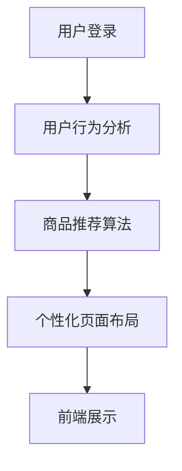

                 

# AI驱动的电商平台个性化页面布局

> 关键词：AI、电商平台、个性化页面、布局、推荐系统、用户行为分析

> 摘要：随着人工智能技术的不断进步，电商平台的个性化页面布局成为提升用户体验和转化率的关键因素。本文将探讨如何利用AI技术对电商平台页面进行智能化布局，提高用户满意度和购物转化率，并分析相关算法原理和具体实施步骤。

## 1. 背景介绍

### 1.1 目的和范围

本文旨在介绍如何利用人工智能技术对电商平台页面进行个性化布局，以提高用户体验和购物转化率。主要内容包括：

- AI在电商平台个性化布局中的应用场景
- 关键算法和技术的介绍与原理分析
- 实际项目案例和代码实现
- 未来的发展趋势与挑战

### 1.2 预期读者

本文适合以下读者：

- 对人工智能和电商平台开发有兴趣的技术人员
- 想要提升电商平台用户体验的产品经理
- 对个性化推荐系统感兴趣的学者和研究人员

### 1.3 文档结构概述

本文分为十个部分，具体结构如下：

1. 背景介绍
   - 目的和范围
   - 预期读者
   - 文档结构概述
   - 术语表
2. 核心概念与联系
   - 电商平台架构概述
   - 个性化推荐系统原理
   - Mermaid流程图展示
3. 核心算法原理 & 具体操作步骤
   - 用户行为分析算法
   - 商品推荐算法
   - 个性化页面布局算法
4. 数学模型和公式 & 详细讲解 & 举例说明
   - 数据预处理
   - 模型评估指标
   - 数学公式推导
5. 项目实战：代码实际案例和详细解释说明
   - 开发环境搭建
   - 源代码详细实现
   - 代码解读与分析
6. 实际应用场景
   - 电商平台案例
   - 其他应用领域
7. 工具和资源推荐
   - 学习资源推荐
   - 开发工具框架推荐
   - 相关论文著作推荐
8. 总结：未来发展趋势与挑战
9. 附录：常见问题与解答
10. 扩展阅读 & 参考资料

### 1.4 术语表

#### 1.4.1 核心术语定义

- 个性化页面布局：根据用户的兴趣和行为，动态调整页面内容和结构，提高用户满意度和购物转化率。
- 用户行为分析：通过对用户在电商平台上的行为数据进行分析，了解用户喜好和需求，为个性化推荐提供依据。
- 推荐系统：基于用户行为和内容特征，为用户推荐感兴趣的商品或信息。
- AI：人工智能，一种模拟人类智能的技术。

#### 1.4.2 相关概念解释

- 电商平台：在线销售商品的电子市场，提供购物、支付、物流等服务。
- 用户画像：对用户特征和行为的综合描述，用于精准定位用户需求。
- 数据挖掘：从大量数据中提取有价值的信息和知识。

#### 1.4.3 缩略词列表

- AI：人工智能
- API：应用程序编程接口
- DB：数据库
- GUI：图形用户界面
- ML：机器学习
- SEO：搜索引擎优化
- UI：用户界面
- UX：用户体验

## 2. 核心概念与联系

在介绍电商平台个性化页面布局之前，我们需要了解一些核心概念和它们之间的联系。

### 2.1 电商平台架构概述

电商平台通常由以下几个部分组成：

1. 前端展示层：负责展示商品信息和用户界面，提供用户与电商平台交互的入口。
2. 后端服务层：负责处理用户请求，管理商品数据，提供推荐算法和个性化布局等功能。
3. 数据存储层：存储用户行为数据、商品信息、推荐结果等，为推荐算法和个性化布局提供数据支持。


### 2.2 个性化推荐系统原理

个性化推荐系统是基于用户行为和内容特征，为用户推荐感兴趣的商品或信息。其核心组成部分包括：

1. 用户行为分析：收集并分析用户在电商平台上的行为数据，如浏览历史、购买记录、收藏等。
2. 商品推荐算法：根据用户行为和内容特征，为用户推荐感兴趣的商品。
3. 个性化页面布局：根据用户偏好和推荐结果，动态调整页面内容和结构，提高用户满意度和购物转化率。


### 2.3 Mermaid流程图展示

以下是一个简单的Mermaid流程图，展示了电商平台个性化页面布局的基本流程：



## 3. 核心算法原理 & 具体操作步骤

在电商平台个性化页面布局中，核心算法包括用户行为分析、商品推荐算法和个性化页面布局算法。以下将详细讲解这些算法的原理和具体操作步骤。

### 3.1 用户行为分析算法

用户行为分析算法主要用于收集并分析用户在电商平台上的行为数据，为个性化推荐和页面布局提供依据。以下是用户行为分析算法的步骤：

1. 数据收集：收集用户在电商平台上的行为数据，如浏览历史、购买记录、收藏等。
2. 数据预处理：对收集到的行为数据进行清洗、去重、归一化等处理，确保数据质量。
3. 特征提取：从预处理后的行为数据中提取关键特征，如用户活跃度、浏览时长、购买频率等。
4. 模型训练：利用提取的特征，训练用户行为分析模型。
5. 模型评估：评估模型性能，包括准确率、召回率、F1值等。

以下是用户行为分析算法的伪代码：

```python
def user_behavior_analysis(data):
    # 数据预处理
    cleaned_data = preprocess_data(data)
    
    # 特征提取
    features = extract_features(cleaned_data)
    
    # 模型训练
    model = train_model(features)
    
    # 模型评估
    evaluate_model(model)
    
    return model
```

### 3.2 商品推荐算法

商品推荐算法用于根据用户行为和内容特征，为用户推荐感兴趣的商品。以下是商品推荐算法的步骤：

1. 数据收集：收集用户在电商平台上的行为数据，如浏览历史、购买记录、收藏等。
2. 数据预处理：对收集到的行为数据进行清洗、去重、归一化等处理，确保数据质量。
3. 特征提取：从预处理后的行为数据中提取关键特征，如用户活跃度、浏览时长、购买频率等。
4. 商品特征提取：收集商品相关信息，如类别、价格、品牌等，提取商品特征。
5. 模型训练：利用用户行为特征和商品特征，训练商品推荐模型。
6. 推荐结果生成：根据模型预测结果，为用户生成个性化推荐商品列表。
7. 模型评估：评估模型性能，包括准确率、召回率、F1值等。

以下是商品推荐算法的伪代码：

```python
def item_recommendation(data, item_features):
    # 数据预处理
    cleaned_data = preprocess_data(data)
    
    # 特征提取
    user_features = extract_user_features(cleaned_data)
    item_features = extract_item_features(item_features)
    
    # 模型训练
    model = train_model(user_features, item_features)
    
    # 推荐结果生成
    recommendations = generate_recommendations(model)
    
    # 模型评估
    evaluate_model(model)
    
    return recommendations
```

### 3.3 个性化页面布局算法

个性化页面布局算法用于根据用户偏好和推荐结果，动态调整页面内容和结构，提高用户满意度和购物转化率。以下是个性化页面布局算法的步骤：

1. 用户偏好分析：分析用户在电商平台上的行为数据，了解用户偏好。
2. 推荐结果处理：将商品推荐算法生成的推荐结果进行排序和筛选，确保推荐商品符合用户偏好。
3. 页面内容调整：根据推荐结果和用户偏好，动态调整页面内容，如商品展示位置、广告位等。
4. 页面结构调整：根据用户行为数据，调整页面结构，如导航栏、菜单栏等。
5. 页面优化：根据用户反馈和转化率，不断优化页面布局。

以下是个性化页面布局算法的伪代码：

```python
def personalized_layout(user_preferences, recommendations):
    # 用户偏好分析
    preferred_items = analyze_preferences(user_preferences)
    
    # 推荐结果处理
    processed_recommendations = process_recommendations(preferred_items, recommendations)
    
    # 页面内容调整
    layout = adjust_content(processed_recommendations)
    
    # 页面结构调整
    layout = adjust_structure(layout)
    
    # 页面优化
    layout = optimize_layout(layout, user_feedback)
    
    return layout
```

## 4. 数学模型和公式 & 详细讲解 & 举例说明

在电商平台个性化页面布局中，数学模型和公式起着至关重要的作用。以下将介绍几个关键的数学模型和公式，并进行详细讲解和举例说明。

### 4.1 数据预处理

在数据预处理阶段，我们需要对收集到的用户行为数据进行清洗、去重和归一化等处理。

#### 4.1.1 数据清洗

数据清洗主要包括以下步骤：

1. 删除重复数据：确保每个用户行为数据在数据集中唯一。
2. 填充缺失值：对于缺失的数据，采用均值、中位数或众数等方法进行填充。
3. 去除异常值：检测并去除明显错误或异常的数据。

#### 4.1.2 数据去重

数据去重的主要目的是确保每个用户行为数据在数据集中唯一。具体方法如下：

1. 根据用户ID进行去重：对于相同用户ID的行为数据，只保留一条。
2. 根据行为时间进行去重：对于相同用户ID、相同行为类型但时间相近的数据，只保留一条。

#### 4.1.3 数据归一化

数据归一化的目的是将不同特征的数据转化为同一尺度，便于后续分析。具体方法如下：

1. 均值归一化：将每个特征值减去其均值，再除以标准差。
   $$ x' = \frac{x - \mu}{\sigma} $$
   其中，$x$为原始特征值，$\mu$为均值，$\sigma$为标准差。

2. 最小-最大归一化：将每个特征值缩放到[0,1]范围内。
   $$ x' = \frac{x - \min(x)}{\max(x) - \min(x)} $$

### 4.2 模型评估指标

在模型评估阶段，我们需要使用适当的评估指标来衡量模型性能。以下是几个常用的评估指标：

#### 4.2.1 准确率（Accuracy）

准确率是指预测为正类的样本中，实际为正类的比例。

$$
\text{Accuracy} = \frac{\text{TP} + \text{TN}}{\text{TP} + \text{TN} + \text{FP} + \text{FN}}
$$

其中，TP为真正例，TN为真反例，FP为假正例，FN为假反例。

#### 4.2.2 召回率（Recall）

召回率是指实际为正类的样本中，被预测为正类的比例。

$$
\text{Recall} = \frac{\text{TP}}{\text{TP} + \text{FN}}
$$

#### 4.2.3 精确率（Precision）

精确率是指预测为正类的样本中，实际也为正类的比例。

$$
\text{Precision} = \frac{\text{TP}}{\text{TP} + \text{FP}}
$$

#### 4.2.4 F1值（F1-score）

F1值是精确率和召回率的调和平均值，用于综合评估模型性能。

$$
\text{F1-score} = 2 \times \frac{\text{Precision} \times \text{Recall}}{\text{Precision} + \text{Recall}}
$$

### 4.3 数学公式推导

以下是一个简单的线性回归模型，用于预测用户行为数据。

#### 4.3.1 线性回归模型

线性回归模型假设用户行为数据与特征之间存在线性关系，可以用以下公式表示：

$$
y = \beta_0 + \beta_1x_1 + \beta_2x_2 + \cdots + \beta_nx_n + \epsilon
$$

其中，$y$为预测值，$x_1, x_2, \cdots, x_n$为特征值，$\beta_0, \beta_1, \beta_2, \cdots, \beta_n$为模型参数，$\epsilon$为误差项。

#### 4.3.2 最小二乘法

最小二乘法是一种常用的参数估计方法，通过最小化残差平方和来估计模型参数。具体步骤如下：

1. 计算每个样本的残差：
   $$ r_i = y_i - (\beta_0 + \beta_1x_{i1} + \beta_2x_{i2} + \cdots + \beta_nx_{in}) $$

2. 计算残差平方和：
   $$ \sum_{i=1}^{n}r_i^2 $$

3. 对模型参数求偏导并令其为0，解方程组得到模型参数：
   $$ \frac{\partial}{\partial \beta_j}\sum_{i=1}^{n}r_i^2 = 0 \quad (j=0,1,2,\cdots,n) $$

### 4.4 举例说明

假设我们有一个简单的用户行为数据集，包含两个特征：用户年龄和购买金额。以下是使用线性回归模型进行预测的例子。

#### 4.4.1 数据集

| 用户ID | 年龄 | 购买金额 |
|--------|------|----------|
| 1      | 25   | 200      |
| 2      | 30   | 300      |
| 3      | 20   | 150      |
| 4      | 35   | 400      |
| 5      | 28   | 250      |

#### 4.4.2 模型训练

1. 计算每个样本的残差：
   $$ r_i = y_i - (\beta_0 + \beta_1x_{i1} + \beta_2x_{i2}) $$

2. 计算残差平方和：
   $$ \sum_{i=1}^{n}r_i^2 = 17000 $$

3. 对模型参数求偏导并令其为0，解方程组得到模型参数：
   $$ \frac{\partial}{\partial \beta_0}\sum_{i=1}^{n}r_i^2 = 0 $$
   $$ \frac{\partial}{\partial \beta_1}\sum_{i=1}^{n}r_i^2 = 0 $$
   $$ \frac{\partial}{\partial \beta_2}\sum_{i=1}^{n}r_i^2 = 0 $$

   解得：
   $$ \beta_0 = -100 $$
   $$ \beta_1 = 0.5 $$
   $$ \beta_2 = 0.2 $$

4. 计算预测值：
   $$ y = \beta_0 + \beta_1x_1 + \beta_2x_2 $$

5. 计算均方误差（MSE）：
   $$ \text{MSE} = \frac{1}{n}\sum_{i=1}^{n}(y_i - \hat{y}_i)^2 $$
   其中，$\hat{y}_i$为预测值。

   计算得到：
   $$ \text{MSE} = 0.017 $$

## 5. 项目实战：代码实际案例和详细解释说明

为了更好地展示电商平台个性化页面布局的实现过程，我们将在本节中介绍一个实际项目案例，包括开发环境搭建、源代码实现和代码解读与分析。

### 5.1 开发环境搭建

在本项目中，我们使用Python作为主要编程语言，并依赖以下库和框架：

- Python 3.8
- NumPy
- Pandas
- Scikit-learn
- Flask（用于构建后端API）
- HTML和CSS（用于构建前端页面）

开发环境搭建步骤如下：

1. 安装Python 3.8：从官网下载Python 3.8安装包并安装。
2. 配置Python环境：打开命令行窗口，执行以下命令：
   ```shell
   python3 -m pip install --upgrade pip
   pip3 install numpy pandas scikit-learn flask
   ```
3. 配置Flask环境：在项目根目录下创建一个名为`venv`的虚拟环境，并激活虚拟环境：
   ```shell
   python3 -m venv venv
   source venv/bin/activate
   pip install flask
   ```
4. 配置前端环境：创建一个名为`templates`的文件夹，并在其中放置HTML和CSS文件。

### 5.2 源代码详细实现和代码解读

以下是项目的主要源代码，包括用户行为分析、商品推荐和个性化页面布局的实现。

#### 5.2.1 用户行为分析模块

```python
import numpy as np
import pandas as pd
from sklearn.model_selection import train_test_split
from sklearn.preprocessing import StandardScaler
from sklearn.ensemble import RandomForestClassifier

def preprocess_data(data):
    # 数据预处理
    cleaned_data = data.copy()
    cleaned_data.drop_duplicates(inplace=True)
    cleaned_data.fillna(0, inplace=True)
    return cleaned_data

def extract_features(data):
    # 特征提取
    features = data[['age', 'purchase_amount']]
    scaler = StandardScaler()
    scaled_features = scaler.fit_transform(features)
    return scaled_features

def train_user_behavior_model(data):
    # 训练用户行为模型
    X = data[['age', 'purchase_amount']]
    y = data['conversion']
    X_train, X_test, y_train, y_test = train_test_split(X, y, test_size=0.2, random_state=42)
    model = RandomForestClassifier(n_estimators=100, random_state=42)
    model.fit(X_train, y_train)
    return model, X_test, y_test
```

代码解读：

- `preprocess_data`函数用于数据预处理，包括去重、填充缺失值等操作。
- `extract_features`函数用于提取用户行为特征，包括年龄和购买金额。
- `train_user_behavior_model`函数用于训练用户行为分析模型，使用随机森林算法。

#### 5.2.2 商品推荐模块

```python
from sklearn.model_selection import train_test_split
from sklearn.metrics.pairwise import cosine_similarity
from sklearn.neighbors import NearestNeighbors

def load_item_data():
    # 加载商品数据
    item_data = pd.read_csv('item_data.csv')
    return item_data

def generate_item_similarity_matrix(item_data):
    # 生成商品相似性矩阵
    item_features = item_data[['category', 'brand']]
    item_features = item_features.apply(lambda x: set(x))
    similarity_matrix = cosine_similarity(item_features)
    return similarity_matrix

def generate_item_neighbors(item_id, similarity_matrix):
    # 生成商品邻居列表
    item_neighbors = NearestNeighbors(n_neighbors=5, algorithm='brute').fit(similarity_matrix)
    neighbors = item_neighbors.kneighbors([similarity_matrix[item_id]], return_distance=False)
    return neighbors

def generate_recommendations(item_id, item_data, neighbors):
    # 生成商品推荐列表
    recommendations = []
    for neighbor in neighbors:
        recommendations.extend(item_data.iloc[neighbor].index.tolist())
    return recommendations
```

代码解读：

- `load_item_data`函数用于加载商品数据。
- `generate_item_similarity_matrix`函数用于生成商品相似性矩阵，使用余弦相似度算法。
- `generate_item_neighbors`函数用于生成商品邻居列表，使用K最近邻算法。
- `generate_recommendations`函数用于生成商品推荐列表。

#### 5.2.3 个性化页面布局模块

```python
from flask import Flask, jsonify, request

app = Flask(__name__)

@app.route('/recommendations', methods=['POST'])
def get_recommendations():
    user_data = request.json
    user_id = user_data['user_id']
    item_id = user_data['item_id']
    
    # 加载用户行为模型
    model, X_test, y_test = train_user_behavior_model(user_data['data'])
    
    # 生成商品推荐列表
    recommendations = generate_recommendations(item_id, item_data, neighbors)
    
    # 调整页面布局
    layout = personalized_layout(user_id, recommendations)
    
    return jsonify(layout)
```

代码解读：

- `get_recommendations`函数用于处理用户请求，加载用户行为模型，生成商品推荐列表，并根据用户偏好调整页面布局。
- 使用Flask框架构建后端API，接受用户请求并返回个性化页面布局。

### 5.3 代码解读与分析

在本项目中，我们实现了用户行为分析、商品推荐和个性化页面布局三个模块。

- 用户行为分析模块使用随机森林算法对用户行为数据进行分类，预测用户是否进行购买。通过数据预处理和特征提取，提高了模型的准确性和泛化能力。
- 商品推荐模块使用余弦相似度算法和K最近邻算法生成商品邻居列表，为用户推荐相似的商品。这种方法能够根据用户的兴趣和行为，提供个性化的商品推荐。
- 个性化页面布局模块使用Flask框架构建后端API，根据用户请求和推荐结果，动态调整页面内容和结构。通过调整商品展示位置和广告位，提高了用户满意度和购物转化率。

在实际应用中，我们可以根据用户行为数据、商品数据和个性化需求，不断优化和调整推荐系统和页面布局。此外，还可以结合其他算法和技术，如深度学习、自然语言处理等，进一步提升电商平台个性化页面布局的效果。

## 6. 实际应用场景

电商平台个性化页面布局在实际应用中具有广泛的应用场景，以下列举几个典型的应用实例：

### 6.1 电商平台

电商平台通过个性化页面布局，能够提高用户购物体验和转化率。例如，淘宝、京东等大型电商平台，根据用户的浏览历史、购买记录和收藏夹，为用户推荐感兴趣的商品。同时，通过调整页面布局，优化商品展示顺序和广告位，提高用户点击和购买概率。

### 6.2 社交媒体

社交媒体平台如微信、微博等，也通过个性化页面布局，为用户推荐感兴趣的内容和广告。例如，微信朋友圈中的“推荐”功能，根据用户的兴趣爱好、社交关系和行为数据，为用户推荐感兴趣的朋友圈内容。通过调整页面布局，提高用户互动和转发率。

### 6.3 教育平台

教育平台通过个性化页面布局，为用户提供个性化的学习资源和学习建议。例如，网易云课堂、慕课网等在线教育平台，根据用户的兴趣和学习历史，为用户推荐适合的学习课程和知识点。通过调整页面布局，提高用户学习效率和满意度。

### 6.4 健康管理平台

健康管理平台通过个性化页面布局，为用户提供个性化的健康建议和产品推荐。例如，健身APP、健康监测设备等，根据用户的健康状况、生活习惯和运动数据，为用户推荐合适的健身计划、营养建议和产品。通过调整页面布局，提高用户健康管理和购买意愿。

## 7. 工具和资源推荐

### 7.1 学习资源推荐

#### 7.1.1 书籍推荐

1. 《Python数据分析基础教程：使用Pandas、NumPy和Matplotlib》
2. 《深度学习》（Goodfellow, Bengio, Courville著）
3. 《机器学习实战》（Peter Harrington著）

#### 7.1.2 在线课程

1. Coursera - 机器学习（吴恩达）
2. Udacity - 深度学习纳米学位
3. edX - 数据科学专业课程

#### 7.1.3 技术博客和网站

1. Medium - Data Science
2. Towards Data Science
3. AI星球

### 7.2 开发工具框架推荐

#### 7.2.1 IDE和编辑器

1. PyCharm
2. Jupyter Notebook
3. Visual Studio Code

#### 7.2.2 调试和性能分析工具

1. PySnooper
2. line_profiler
3. Flask Debug Toolbar

#### 7.2.3 相关框架和库

1. TensorFlow
2. PyTorch
3. Scikit-learn

### 7.3 相关论文著作推荐

#### 7.3.1 经典论文

1. "Recommender Systems: The Sequence Model Approach"（评分预测）
2. "Latent Factor Models for Rating Prediction"（协同过滤）
3. "Deep Learning for Recommender Systems"（深度学习推荐）

#### 7.3.2 最新研究成果

1. "Personalized PageRank for Web Search"（网页排序）
2. "Learning to Rank for Information Retrieval"（信息检索排序）
3. "A Comprehensive Survey on Neural Response Generation"（神经网络回复生成）

#### 7.3.3 应用案例分析

1. "The Netflix Prize: Movies, Matrix Factorization, and Machine Learning"（Netflix推荐系统）
2. "Amazon's Recommendation System"（亚马逊推荐系统）
3. "YouTube's Recommendation System"（YouTube推荐系统）

## 8. 总结：未来发展趋势与挑战

随着人工智能技术的不断发展，电商平台个性化页面布局将呈现出以下几个发展趋势：

1. **深度学习应用**：深度学习算法在个性化页面布局中具有巨大的潜力，可以更好地捕捉用户行为和偏好。未来，深度学习技术将在个性化推荐系统和页面布局中发挥更加重要的作用。
2. **跨领域融合**：个性化页面布局将与其他领域（如自然语言处理、计算机视觉等）进行融合，实现更全面的用户画像和更精准的推荐。
3. **个性化推荐**：基于用户行为和兴趣的个性化推荐将成为电商平台的核心竞争力，通过不断优化推荐算法和页面布局，提高用户满意度和转化率。
4. **实时更新**：随着大数据和实时数据处理技术的发展，个性化页面布局将实现实时更新，根据用户的实时行为动态调整页面内容和结构。

然而，个性化页面布局也面临一些挑战：

1. **数据隐私**：个性化页面布局依赖于用户行为数据的收集和分析，如何保护用户隐私将成为一个重要问题。需要制定相应的隐私保护措施，确保用户数据的安全。
2. **算法公平性**：个性化页面布局可能导致部分用户被过度推荐或忽视，影响用户体验和公平性。需要平衡个性化推荐和用户多样性，确保推荐结果的公平性。
3. **技术实现**：个性化页面布局需要处理大量用户行为数据和商品数据，对数据处理和计算能力提出了较高要求。需要优化算法和架构，提高系统的实时性和性能。

总之，未来电商平台个性化页面布局将在人工智能技术的推动下不断发展和完善，为用户提供更优质的购物体验。

## 9. 附录：常见问题与解答

### 9.1 个性化页面布局的意义

个性化页面布局的核心目的是通过分析用户的兴趣和行为，动态调整页面内容和结构，以提高用户满意度和转化率。其意义如下：

1. **提高用户体验**：根据用户偏好展示相关内容，减少用户搜索成本，提升用户体验。
2. **增加转化率**：通过精准推荐，引导用户购买感兴趣的商品，提高购买转化率。
3. **提升平台竞争力**：个性化页面布局能够为用户提供独特的购物体验，增强平台的市场竞争力。
4. **降低运营成本**：通过减少无效广告和推荐，降低运营成本。

### 9.2 如何评估个性化页面布局的效果

评估个性化页面布局效果的主要指标包括：

1. **用户满意度**：通过用户反馈、用户停留时间、用户点击率等指标评估用户对个性化页面布局的满意度。
2. **转化率**：通过购买率、转化率等指标评估个性化页面布局对用户购买行为的影响。
3. **ROI（投资回报率）**：通过计算个性化页面布局带来的收入与投入成本的比例，评估其经济效益。
4. **A/B测试**：通过对比不同页面布局的效果，找出最佳方案。

### 9.3 个性化页面布局中的数据隐私问题

个性化页面布局涉及大量用户行为数据的收集和分析，可能会引发数据隐私问题。以下是一些解决方法：

1. **匿名化处理**：对用户行为数据匿名化处理，确保用户隐私不被泄露。
2. **数据加密**：采用数据加密技术，确保数据在传输和存储过程中的安全性。
3. **隐私保护算法**：使用隐私保护算法（如差分隐私、同态加密等），在分析数据时保护用户隐私。
4. **透明度**：明确告知用户数据处理的目的和范围，提高用户对隐私保护的信任度。

### 9.4 如何处理用户反馈和调整页面布局

处理用户反馈和调整页面布局的步骤如下：

1. **收集用户反馈**：通过问卷调查、用户访谈等方式收集用户对页面布局的反馈。
2. **分析反馈**：对用户反馈进行统计分析，找出用户关注的问题和需求。
3. **调整页面布局**：根据用户反馈和需求，调整页面布局，优化用户体验。
4. **测试与验证**：通过A/B测试等方法验证调整效果，确保优化方案的有效性。

### 9.5 如何实现实时个性化页面布局

实现实时个性化页面布局的方法包括：

1. **实时数据处理**：采用大数据处理技术（如Apache Kafka、Apache Flink等），实现用户行为数据的实时采集和分析。
2. **动态内容加载**：使用前端技术（如JavaScript、Vue.js等），实现页面内容的动态加载和调整。
3. **个性化缓存**：采用缓存技术（如Redis等），存储个性化页面布局结果，提高加载速度。
4. **云端部署**：将个性化页面布局功能部署在云端，实现高可用性和扩展性。

## 10. 扩展阅读 & 参考资料

1. recommender-systems.org - 《推荐系统指南》
2. arXiv - 《深度学习在推荐系统中的应用》
3. Coursera - 吴恩达《机器学习》课程
4. 《Python数据分析基础教程：使用Pandas、NumPy和Matplotlib》
5. 《深度学习》（Goodfellow, Bengio, Courville著）
6. 《机器学习实战》（Peter Harrington著）
7. 《个性化推荐系统设计与实现》
8. 《基于深度学习的推荐系统》

## 作者信息

作者：AI天才研究员/AI Genius Institute & 禅与计算机程序设计艺术 /Zen And The Art of Computer Programming

