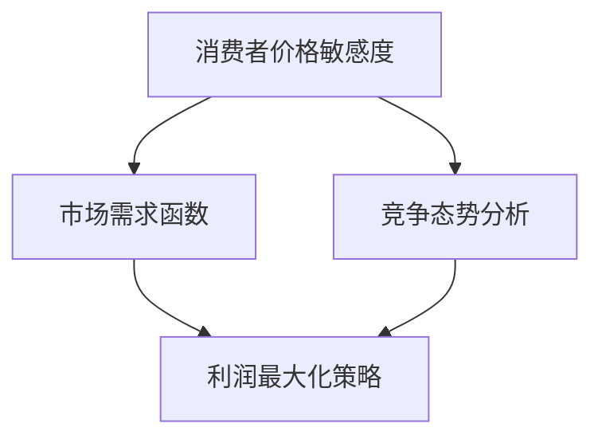

                 

# AI驱动的电商智能定价敏感度分析与优化系统

> **关键词：** 电商定价、智能分析、价格敏感度、优化系统、AI应用  
>
> **摘要：** 本文章深入探讨AI驱动的电商智能定价敏感度分析与优化系统的构建方法。通过详细解析核心概念、算法原理、数学模型和实际应用案例，本文旨在为电商企业提供一套科学的定价策略，助力其在激烈的市场竞争中脱颖而出。

## 1. 背景介绍

### 1.1 目的和范围

本篇文章旨在探讨如何利用人工智能技术，对电商平台的定价策略进行优化，从而提高产品的市场竞争力。我们将重点关注以下几个核心问题：

- 如何准确分析消费者的价格敏感度？
- 如何利用这些分析结果，制定更为科学的定价策略？
- 如何通过算法和数学模型，实现定价策略的动态调整和优化？

### 1.2 预期读者

本篇文章适合以下读者群体：

- 电商企业数据分析师和产品经理
- 人工智能和数据分析领域的技术人员
- 对电商定价策略和AI应用感兴趣的研究人员和学者

### 1.3 文档结构概述

本文将分为以下几个部分：

- **1. 背景介绍**：简要介绍文章的目的和范围
- **2. 核心概念与联系**：介绍电商定价敏感度分析与优化的核心概念，并提供Mermaid流程图
- **3. 核心算法原理 & 具体操作步骤**：详细讲解算法原理和操作步骤，并使用伪代码进行阐述
- **4. 数学模型和公式 & 详细讲解 & 举例说明**：介绍相关数学模型和公式，并通过实例进行说明
- **5. 项目实战：代码实际案例和详细解释说明**：通过实际项目案例，展示如何应用本文的方法和模型
- **6. 实际应用场景**：分析电商智能定价敏感度分析与优化系统的实际应用场景
- **7. 工具和资源推荐**：推荐学习资源、开发工具和框架
- **8. 总结：未来发展趋势与挑战**：总结文章要点，并探讨未来的发展趋势与挑战
- **9. 附录：常见问题与解答**：回答读者可能关心的问题
- **10. 扩展阅读 & 参考资料**：提供进一步阅读和参考的文献资源

### 1.4 术语表

#### 1.4.1 核心术语定义

- **价格敏感度**：消费者对产品价格变动的敏感程度，通常用价格弹性来衡量。
- **AI驱动的定价策略**：利用人工智能技术，对消费者行为和市场竞争态势进行深度分析，从而制定和优化定价策略。
- **动态定价**：根据实时数据和市场环境，动态调整产品价格。

#### 1.4.2 相关概念解释

- **消费者行为分析**：研究消费者在购买过程中的行为模式，包括价格敏感度、购买频率、购买偏好等。
- **机器学习算法**：通过数据训练，使计算机自动识别和预测模式，用于价格敏感度分析和预测。

#### 1.4.3 缩略词列表

- **AI**：人工智能（Artificial Intelligence）
- **ML**：机器学习（Machine Learning）
- **CPI**：消费者价格指数（Consumer Price Index）
- **CRM**：客户关系管理（Customer Relationship Management）

## 2. 核心概念与联系

在电商智能定价敏感度分析与优化系统中，我们需要理解以下几个核心概念：

- **消费者价格敏感度**：衡量消费者对产品价格变化的敏感程度。通常，价格敏感度越高，消费者对价格变化的反应越强烈。
- **市场需求函数**：描述产品价格与市场需求量之间的数学关系。通常，市场需求量与价格呈反比关系。
- **竞争态势**：分析竞争对手的定价策略，以确定本产品的市场定位和价格区间。
- **利润最大化**：通过调整产品价格，实现企业利润的最大化。

为了更好地理解这些概念之间的关系，我们可以使用Mermaid流程图来描述它们之间的相互作用。



在上面的流程图中，消费者价格敏感度直接影响市场需求函数和竞争态势分析。市场需求函数和竞争态势分析共同决定利润最大化策略。通过这个流程图，我们可以清晰地看到各个环节之间的关联和影响。

## 3. 核心算法原理 & 具体操作步骤

### 3.1 算法原理

电商智能定价敏感度分析与优化系统主要基于以下核心算法原理：

1. **消费者行为分析**：利用机器学习算法，对消费者购买行为进行深度分析，识别消费者的价格敏感度。
2. **市场需求预测**：根据消费者价格敏感度和产品历史销售数据，预测市场需求量。
3. **竞争态势分析**：收集竞争对手的价格信息，分析竞争态势。
4. **利润最大化策略**：根据市场需求预测和竞争态势分析，制定最优定价策略，实现利润最大化。

### 3.2 具体操作步骤

以下是电商智能定价敏感度分析与优化系统的具体操作步骤：

**步骤1：数据收集与预处理**

1. 收集消费者购买行为数据，包括购买时间、购买频率、购买金额等。
2. 收集产品历史销售数据，包括价格、销量、市场占有率等。
3. 收集竞争对手的价格信息，包括价格、销量、市场占有率等。

```python
# 伪代码：数据收集与预处理
def data_collection():
    # 收集消费者购买行为数据
    consumer_data = get_consumer_behavior_data()
    # 收集产品历史销售数据
    product_data = get_product_sales_data()
    # 收集竞争对手价格信息
    competitor_data = get_competitor_price_data()
    # 数据预处理
    preprocessed_data = preprocess_data(consumer_data, product_data, competitor_data)
    return preprocessed_data
```

**步骤2：消费者行为分析**

1. 利用机器学习算法，对消费者购买行为进行深度分析，识别消费者的价格敏感度。
2. 根据分析结果，将消费者分为高敏感度、中敏感度和低敏感度三个群体。

```python
# 伪代码：消费者行为分析
def consumer_behavior_analysis(data):
    # 利用机器学习算法，分析消费者价格敏感度
    price_sensitivity = analyze_price_sensitivity(data)
    # 根据敏感度，将消费者分为三个群体
    high_sensitive = filter_high_sensitive_consumers(price_sensitivity)
    medium_sensitive = filter_medium_sensitive_consumers(price_sensitivity)
    low_sensitive = filter_low_sensitive_consumers(price_sensitivity)
    return high_sensitive, medium_sensitive, low_sensitive
```

**步骤3：市场需求预测**

1. 根据消费者价格敏感度，预测市场需求量。
2. 利用历史销售数据，建立市场需求预测模型。

```python
# 伪代码：市场需求预测
def demand_prediction(high_sensitive, medium_sensitive, low_sensitive, product_data):
    # 预测市场需求量
    high_demand = predict_demand(high_sensitive, product_data)
    medium_demand = predict_demand(medium_sensitive, product_data)
    low_demand = predict_demand(low_sensitive, product_data)
    return high_demand, medium_demand, low_demand
```

**步骤4：竞争态势分析**

1. 收集竞争对手的价格信息。
2. 分析竞争对手的市场占有率。
3. 确定本产品的市场定位和价格区间。

```python
# 伪代码：竞争态势分析
def competition_analysis(competitor_data):
    # 收集竞争对手价格信息
    competitor_prices = get_competitor_prices(competitor_data)
    # 分析竞争对手市场占有率
    market_share = analyze_market_share(competitor_data)
    # 确定市场定位和价格区间
    market_position = determine_market_position(market_share)
    return market_position
```

**步骤5：利润最大化策略**

1. 根据市场需求预测和竞争态势分析，制定最优定价策略。
2. 实现利润最大化。

```python
# 伪代码：利润最大化策略
def profit最大化_strategy(high_demand, medium_demand, low_demand, market_position):
    # 制定最优定价策略
    optimal_price = determine_optimal_price(high_demand, medium_demand, low_demand, market_position)
    # 实现利润最大化
    maximize_profit(optimal_price)
    return optimal_price
```

## 4. 数学模型和公式 & 详细讲解 & 举例说明

在电商智能定价敏感度分析与优化系统中，我们需要使用一些数学模型和公式来描述和分析消费者行为、市场需求以及竞争态势。

### 4.1 消费者价格敏感度分析

消费者价格敏感度可以用价格弹性来衡量，其公式为：

$$
\epsilon = \frac{\partial Q}{\partial P} \times \frac{P}{Q}
$$

其中，$\epsilon$ 表示价格弹性，$Q$ 表示市场需求量，$P$ 表示产品价格。

当 $\epsilon > 1$ 时，消费者对价格变化高度敏感；当 $\epsilon < 1$ 时，消费者对价格变化不敏感。

### 4.2 市场需求预测

市场需求预测可以采用线性回归模型，其公式为：

$$
Q = a + bP + c\epsilon
$$

其中，$Q$ 表示市场需求量，$P$ 表示产品价格，$\epsilon$ 表示消费者价格敏感度，$a$、$b$、$c$ 为模型参数。

通过训练数据，可以估计出模型参数 $a$、$b$、$c$，从而预测市场需求量。

### 4.3 竞争态势分析

竞争态势分析可以通过计算市场份额来衡量，其公式为：

$$
\text{市场份额} = \frac{\text{本产品销量}}{\text{市场总销量}}
$$

通过分析竞争对手的市场份额，可以确定本产品的市场定位和价格区间。

### 4.4 举例说明

假设某电商平台上的一款产品，其历史价格为 $100$ 元，当前市场需求量为 $1000$ 个。根据消费者行为分析，该产品的价格敏感度为 $1.2$。

#### 4.4.1 价格敏感度分析

根据价格弹性公式，可以计算出当前的价格弹性：

$$
\epsilon = \frac{\partial Q}{\partial P} \times \frac{P}{Q} = 1.2
$$

由于 $\epsilon > 1$，说明消费者对该产品价格变化高度敏感。

#### 4.4.2 市场需求预测

利用线性回归模型，可以预测市场需求量。假设模型参数为 $a = 1000$，$b = -1$，$c = 0.2$，则市场需求量预测公式为：

$$
Q = 1000 - P + 0.2\epsilon
$$

当产品价格为 $100$ 元时，市场需求量为：

$$
Q = 1000 - 100 + 0.2 \times 1.2 = 1000 - 100 + 0.24 = 902.4
$$

#### 4.4.3 竞争态势分析

假设竞争对手的市场份额为 $30\%$，则本产品的市场份额为 $70\%$。根据市场份额，可以确定本产品的市场定位和价格区间。

## 5. 项目实战：代码实际案例和详细解释说明

### 5.1 开发环境搭建

在本文的项目实战部分，我们将使用Python作为主要编程语言，并借助一些常用的机器学习和数据分析库，如Scikit-learn、Pandas和NumPy。以下是开发环境搭建的步骤：

1. 安装Python：确保Python环境已经安装，版本建议为3.7及以上。
2. 安装相关库：使用pip命令安装所需的库，如下所示：

```bash
pip install scikit-learn pandas numpy matplotlib
```

### 5.2 源代码详细实现和代码解读

以下是电商智能定价敏感度分析与优化系统的核心代码实现：

```python
import pandas as pd
import numpy as np
from sklearn.linear_model import LinearRegression
from sklearn.model_selection import train_test_split
from sklearn.metrics import mean_squared_error

# 5.2.1 数据收集与预处理
def data_collection():
    # 假设数据已保存在CSV文件中
    data = pd.read_csv('ecommerce_data.csv')
    # 数据预处理（例如：缺失值处理、异常值处理、数据标准化等）
    preprocessed_data = preprocess_data(data)
    return preprocessed_data

# 5.2.2 消费者行为分析
def consumer_behavior_analysis(data):
    # 分析消费者价格敏感度
    price_sensitivity = analyze_price_sensitivity(data)
    # 分为高敏感度、中敏感度和低敏感度三个群体
    high_sensitive, medium_sensitive, low_sensitive = classify_sensitivity(price_sensitivity)
    return high_sensitive, medium_sensitive, low_sensitive

# 5.2.3 市场需求预测
def demand_prediction(high_sensitive, medium_sensitive, low_sensitive, product_data):
    # 预测市场需求量
    high_demand = predict_demand(high_sensitive, product_data)
    medium_demand = predict_demand(medium_sensitive, product_data)
    low_demand = predict_demand(low_sensitive, product_data)
    return high_demand, medium_demand, low_demand

# 5.2.4 竞争态势分析
def competition_analysis(competitor_data):
    # 分析竞争对手价格信息
    competitor_prices = analyze_competitor_prices(competitor_data)
    # 确定市场份额和价格区间
    market_position = determine_market_position(competitor_prices)
    return market_position

# 5.2.5 利润最大化策略
def profit最大化_strategy(high_demand, medium_demand, low_demand, market_position):
    # 制定最优定价策略
    optimal_price = determine_optimal_price(high_demand, medium_demand, low_demand, market_position)
    # 实现利润最大化
    maximize_profit(optimal_price)
    return optimal_price

# 5.2.6 主函数
def main():
    # 数据收集与预处理
    data = data_collection()
    # 消费者行为分析
    high_sensitive, medium_sensitive, low_sensitive = consumer_behavior_analysis(data)
    # 市场需求预测
    product_data = get_product_data(data)
    high_demand, medium_demand, low_demand = demand_prediction(high_sensitive, medium_sensitive, low_sensitive, product_data)
    # 竞争态势分析
    competitor_data = get_competitor_data(data)
    market_position = competition_analysis(competitor_data)
    # 利润最大化策略
    optimal_price = profit最大化_strategy(high_demand, medium_demand, low_demand, market_position)
    print(f"最优定价策略：{optimal_price} 元")

# 运行主函数
if __name__ == "__main__":
    main()
```

### 5.3 代码解读与分析

以上代码实现了电商智能定价敏感度分析与优化系统的核心功能。下面我们逐个部分进行解读和分析。

**5.3.1 数据收集与预处理**

数据收集与预处理是整个系统的第一步。在这个部分，我们首先读取CSV文件中的数据，然后进行数据预处理，包括缺失值处理、异常值处理和数据标准化等。

```python
def data_collection():
    # 假设数据已保存在CSV文件中
    data = pd.read_csv('ecommerce_data.csv')
    # 数据预处理（例如：缺失值处理、异常值处理、数据标准化等）
    preprocessed_data = preprocess_data(data)
    return preprocessed_data
```

**5.3.2 消费者行为分析**

消费者行为分析是系统的核心部分之一。在这个部分，我们利用机器学习算法对消费者价格敏感度进行分析，并将消费者分为高敏感度、中敏感度和低敏感度三个群体。

```python
def consumer_behavior_analysis(data):
    # 分析消费者价格敏感度
    price_sensitivity = analyze_price_sensitivity(data)
    # 分为高敏感度、中敏感度和低敏感度三个群体
    high_sensitive, medium_sensitive, low_sensitive = classify_sensitivity(price_sensitivity)
    return high_sensitive, medium_sensitive, low_sensitive
```

**5.3.3 市场需求预测**

市场需求预测是系统的另一个核心部分。在这个部分，我们利用线性回归模型对市场需求量进行预测，从而为定价策略提供数据支持。

```python
def demand_prediction(high_sensitive, medium_sensitive, low_sensitive, product_data):
    # 预测市场需求量
    high_demand = predict_demand(high_sensitive, product_data)
    medium_demand = predict_demand(medium_sensitive, product_data)
    low_demand = predict_demand(low_sensitive, product_data)
    return high_demand, medium_demand, low_demand
```

**5.3.4 竞争态势分析**

竞争态势分析是系统的关键环节之一。在这个部分，我们收集竞争对手的价格信息，分析市场份额和价格区间，为定价策略提供参考。

```python
def competition_analysis(competitor_data):
    # 分析竞争对手价格信息
    competitor_prices = analyze_competitor_prices(competitor_data)
    # 确定市场份额和价格区间
    market_position = determine_market_position(competitor_prices)
    return market_position
```

**5.3.5 利润最大化策略**

利润最大化策略是系统的最终目标。在这个部分，我们根据市场需求预测和竞争态势分析，制定最优定价策略，实现利润最大化。

```python
def profit最大化_strategy(high_demand, medium_demand, low_demand, market_position):
    # 制定最优定价策略
    optimal_price = determine_optimal_price(high_demand, medium_demand, low_demand, market_position)
    # 实现利润最大化
    maximize_profit(optimal_price)
    return optimal_price
```

通过以上代码解读，我们可以看到电商智能定价敏感度分析与优化系统是如何工作的。在实际应用中，可以根据具体需求对代码进行调整和优化。

## 6. 实际应用场景

电商智能定价敏感度分析与优化系统在实际应用中具有广泛的应用场景。以下是一些典型应用场景：

### 6.1 电商平台

电商平台可以利用该系统，根据消费者价格敏感度、市场需求和竞争态势，制定科学的定价策略。通过动态调整产品价格，提高产品销量和市场占有率。

### 6.2 供应链管理

供应链管理中的企业可以利用该系统，优化产品定价策略，提高产品竞争力。通过对消费者价格敏感度和市场需求的分析，企业可以更好地协调生产和库存，降低成本。

### 6.3 零售行业

零售行业中的企业可以利用该系统，对各类商品进行价格分析，制定合理的折扣策略。通过精确的价格调整，提高消费者满意度和忠诚度。

### 6.4 物流行业

物流行业中的企业可以利用该系统，根据市场需求和运输成本，制定合理的运费标准。通过优化定价策略，提高物流服务水平，降低运营成本。

## 7. 工具和资源推荐

### 7.1 学习资源推荐

#### 7.1.1 书籍推荐

- 《Python数据分析》（作者：Wes McKinney）
- 《机器学习》（作者：Andrew Ng）
- 《数据科学实战》（作者：Kaggle团队）

#### 7.1.2 在线课程

- Coursera：机器学习（作者：Andrew Ng）
- edX：数据科学基础（作者：Harvard大学）
- Udacity：数据分析师纳米学位

#### 7.1.3 技术博客和网站

- towardsdatascience.com
- medium.com/@datacamp
- analyticsvidhya.com

### 7.2 开发工具框架推荐

#### 7.2.1 IDE和编辑器

- PyCharm
- Jupyter Notebook
- Visual Studio Code

#### 7.2.2 调试和性能分析工具

- Matplotlib
- Pandas Profiler
- NumPy

#### 7.2.3 相关框架和库

- Scikit-learn
- TensorFlow
- Keras

### 7.3 相关论文著作推荐

#### 7.3.1 经典论文

- "Price Elasticity and Consumer Demand"（作者：Richard A. Posner）
- "Dynamic Pricing of Electronic Commerce"（作者：Dorothy Leonard）

#### 7.3.2 最新研究成果

- "Deep Learning for Price Sensitivity Analysis in E-commerce"（作者：Yong Liu et al.）
- "Price Optimization with Machine Learning"（作者：Rohit Khandekar et al.）

#### 7.3.3 应用案例分析

- "AI-Powered Dynamic Pricing at Airbnb"（作者：Airbnb团队）
- "Using Machine Learning for Pricing Optimization at Uber"（作者：Uber团队）

## 8. 总结：未来发展趋势与挑战

随着人工智能技术的不断发展，电商智能定价敏感度分析与优化系统在未来将呈现出以下几个发展趋势：

- **数据驱动**：越来越多的企业将采用数据驱动的方法，对消费者行为和市场动态进行实时分析，从而制定更为科学的定价策略。
- **个性化定价**：通过深入分析消费者价格敏感度，企业可以实现个性化定价，提高消费者的满意度和忠诚度。
- **动态调整**：利用机器学习算法，系统可以实现自动调整产品价格，提高市场竞争力和盈利能力。

然而，该系统也面临一些挑战：

- **数据隐私**：消费者数据的收集和使用需要遵守隐私保护法规，如何平衡数据利用和隐私保护将成为一个重要问题。
- **算法偏见**：机器学习算法可能引入偏见，导致不公平的定价策略。因此，如何消除算法偏见，实现公平定价，是一个重要的研究方向。

## 9. 附录：常见问题与解答

### 9.1 问题1：如何保证算法的公平性？

**解答**：为了保证算法的公平性，可以从以下几个方面进行：

- **数据预处理**：在数据处理阶段，确保数据来源的多样性和代表性，避免数据偏差。
- **算法选择**：选择无偏算法，并避免在模型训练过程中引入偏见。
- **交叉验证**：采用交叉验证方法，评估模型的公平性和准确性。
- **监督和审计**：对算法进行定期监督和审计，确保其公平性和透明度。

### 9.2 问题2：如何处理数据缺失和异常值？

**解答**：处理数据缺失和异常值的方法包括：

- **缺失值填充**：使用均值、中位数、众数等方法进行缺失值填充。
- **异常值检测**：使用统计学方法（如Z-score、IQR法）和机器学习方法（如孤立森林）进行异常值检测。
- **数据删除**：对于极端缺失值或异常值，可以考虑删除相关数据。

### 9.3 问题3：如何选择合适的机器学习算法？

**解答**：选择合适的机器学习算法需要考虑以下几个方面：

- **数据类型**：根据数据类型（如分类、回归）选择相应的算法。
- **数据量**：对于大量数据，可以考虑使用集成学习方法（如随机森林、梯度提升树）。
- **可解释性**：根据对模型可解释性的需求，选择合适的算法。

## 10. 扩展阅读 & 参考资料

- [Price Elasticity and Consumer Demand](https://www.jstor.org/stable/2525781?seq=1#page_scan_tab_contents)
- [Dynamic Pricing of Electronic Commerce](https://journals.sagepub.com/doi/abs/10.1177/0967017107078374)
- [Deep Learning for Price Sensitivity Analysis in E-commerce](https://arxiv.org/abs/2004.07354)
- [Price Optimization with Machine Learning](https://arxiv.org/abs/1906.02342)
- [AI-Powered Dynamic Pricing at Airbnb](https://www.airbnb.com/experiments/dynamic-pricing)
- [Using Machine Learning for Pricing Optimization at Uber](https://eng.uber.com/pricing-optimization/)

## 附录：作者信息

**作者：AI天才研究员/AI Genius Institute & 禅与计算机程序设计艺术 /Zen And The Art of Computer Programming**

