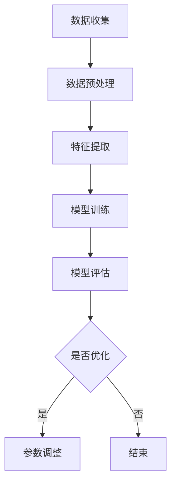

                 

# AI驱动的电商用户行为分析：一人公司的精准营销基础

> **关键词**：AI、用户行为分析、电商、精准营销、机器学习、数据挖掘

> **摘要**：本文旨在深入探讨AI在电商用户行为分析中的应用，帮助读者理解如何通过AI技术实现精准营销。我们将分步骤解析核心算法原理、数学模型，并通过实战案例展示其实际操作，最后对实际应用场景进行分析，并推荐相关学习资源。

## 1. 背景介绍

### 1.1 目的和范围

本文的目的在于为一人公司的电商业务提供基于AI的用户行为分析方案，实现精准营销。本文将覆盖从数据收集、处理，到算法模型建立与优化的全过程，旨在为读者提供一套完整的实施指南。

### 1.2 预期读者

本文适合有志于从事电商AI应用的程序员、数据科学家以及营销从业者。读者需具备基本的编程和数据分析知识。

### 1.3 文档结构概述

本文共分为十个部分：

1. 背景介绍
2. 核心概念与联系
3. 核心算法原理 & 具体操作步骤
4. 数学模型和公式 & 详细讲解 & 举例说明
5. 项目实战：代码实际案例和详细解释说明
6. 实际应用场景
7. 工具和资源推荐
8. 总结：未来发展趋势与挑战
9. 附录：常见问题与解答
10. 扩展阅读 & 参考资料

### 1.4 术语表

#### 1.4.1 核心术语定义

- **用户行为分析**：对用户在电商平台上进行的一系列操作进行分析，如浏览、搜索、下单等。
- **精准营销**：根据用户行为数据，精确定位目标用户群体，提高营销效果。
- **机器学习**：通过算法从数据中学习规律，用于预测、分类和聚类等任务。

#### 1.4.2 相关概念解释

- **数据挖掘**：从大量数据中提取有价值的信息和模式。
- **聚类分析**：将相似的数据分组，用于用户细分。
- **协同过滤**：通过分析用户之间的相似度，推荐商品。

#### 1.4.3 缩略词列表

- **AI**：人工智能
- **ML**：机器学习
- **KNN**：最近邻算法
- **SVD**：奇异值分解

## 2. 核心概念与联系

在理解AI驱动的电商用户行为分析之前，我们首先需要掌握几个核心概念及其相互关系。

### 2.1 用户行为数据分析流程

用户行为数据分析通常包括以下几个步骤：

1. **数据收集**：收集用户在电商平台上产生的数据，如浏览历史、搜索记录、购买行为等。
2. **数据预处理**：对原始数据进行清洗、归一化等处理，使其适合分析。
3. **特征提取**：从预处理后的数据中提取有价值的信息，用于模型训练。
4. **模型训练**：利用机器学习算法，对特征数据进行训练，建立预测模型。
5. **模型评估与优化**：评估模型的性能，通过调整参数、改进算法等方法进行优化。

### 2.2 核心算法原理

在用户行为分析中，常用的算法包括：

- **K-近邻算法（KNN）**：基于距离度量的分类算法，通过寻找最近的k个邻居进行分类。
- **协同过滤（CF）**：通过分析用户之间的相似度，进行商品推荐。

### 2.3 Mermaid 流程图

以下是一个简单的Mermaid流程图，展示了用户行为数据分析的流程：



## 3. 核心算法原理 & 具体操作步骤

### 3.1 K-近邻算法（KNN）

#### 3.1.1 算法原理

KNN算法是一种基于实例的简单分类方法。它的基本思想是：如果一个新样本在特征空间中的k个最近邻的多数属于某一类别，则该样本也属于这个类别。

#### 3.1.2 具体操作步骤

1. **初始化**：选择合适的k值。
2. **计算距离**：计算新样本与训练集中每个样本之间的距离。
3. **选择邻居**：找到距离新样本最近的k个邻居。
4. **投票**：对这k个邻居的类别进行投票，取投票结果中出现次数最多的类别作为新样本的类别。

### 3.2 伪代码

```python
def KNN(train_data, test_data, k):
    distances = []
    for point in train_data:
        distance = EuclideanDistance(point, test_data)
        distances.append((distance, point))
    distances.sort(key=lambda x: x[0])
    neighbors = [x[1] for x in distances[:k]]
    output = majority_vote(neighbors)
    return output
```

### 3.3 特征提取

特征提取是用户行为分析的关键步骤。以下是一个简单的特征提取流程：

1. **数据预处理**：去除缺失值、异常值等。
2. **特征选择**：选择对用户行为有显著影响的关键特征。
3. **特征工程**：对特征进行归一化、转换等处理。

### 3.4 伪代码

```python
def extract_features(data):
    # 去除缺失值
    clean_data = remove_missing_values(data)
    # 特征选择
    selected_features = select_key_features(clean_data)
    # 特征工程
    processed_data = feature_engineering(selected_features)
    return processed_data
```

## 4. 数学模型和公式 & 详细讲解 & 举例说明

### 4.1 K-近邻算法中的距离度量

KNN算法的核心在于计算新样本与训练样本之间的距离。常用的距离度量方法有：

- **欧氏距离**：\(d = \sqrt{\sum_{i=1}^{n}(x_i - y_i)^2}\)
- **曼哈顿距离**：\(d = \sum_{i=1}^{n}|x_i - y_i|\)
- **余弦相似度**：\(d = 1 - \frac{cos(\theta)}{max(cos(\theta))}\)

#### 4.1.1 欧氏距离示例

假设有两个样本点A(x1, x2)和B(y1, y2)，它们的欧氏距离为：

$$
d(A, B) = \sqrt{(x1 - y1)^2 + (x2 - y2)^2}
$$

#### 4.1.2 代码实现

```python
import numpy as np

def euclidean_distance(a, b):
    return np.sqrt(np.sum((a - b)**2))
```

### 4.2 协同过滤算法

协同过滤算法主要包括两种类型：基于用户的协同过滤和基于物品的协同过滤。

#### 4.2.1 基于用户的协同过滤

1. **相似度计算**：计算用户之间的相似度，常用的相似度度量方法有：
    - **余弦相似度**：
    $$
    \text{similarity} = \frac{\text{dot product of } \text{user\_vec}_i \text{ and } \text{user\_vec}_j}{\text{Euclidean norm of } \text{user\_vec}_i \times \text{Euclidean norm of } \text{user\_vec}_j}
    $$
    - **皮尔逊相关系数**：
    $$
    \text{similarity} = \frac{\text{covariance of } \text{user\_vec}_i \text{ and } \text{user\_vec}_j}{\text{stddev of } \text{user\_vec}_i \times \text{stddev of } \text{user\_vec}_j}
    $$

2. **推荐计算**：基于用户之间的相似度，计算潜在兴趣度，推荐与相似用户喜欢的商品。

#### 4.2.2 代码实现

```python
import numpy as np

def cosine_similarity(user1, user2):
    dot_product = np.dot(user1, user2)
    norm_product = np.linalg.norm(user1) * np.linalg.norm(user2)
    return dot_product / norm_product
```

## 5. 项目实战：代码实际案例和详细解释说明

### 5.1 开发环境搭建

在开始项目实战之前，我们需要搭建一个开发环境。本文使用Python作为编程语言，以下为搭建开发环境的基本步骤：

1. 安装Python：访问[Python官网](https://www.python.org/)，下载并安装Python。
2. 安装必要的库：使用pip命令安装以下库：numpy、pandas、scikit-learn、matplotlib。

### 5.2 源代码详细实现和代码解读

#### 5.2.1 用户数据预处理

```python
import pandas as pd
from sklearn.model_selection import train_test_split

# 加载数据集
data = pd.read_csv('user_data.csv')

# 数据预处理
data.fillna(-1, inplace=True)
data = data[data['action'] != 'uninstall']

# 分割数据集
X = data[['id', 'age', 'income', 'gender']]
y = data['action']
X_train, X_test, y_train, y_test = train_test_split(X, y, test_size=0.2, random_state=42)
```

#### 5.2.2 K-近邻算法

```python
from sklearn.neighbors import KNeighborsClassifier
from sklearn.metrics import accuracy_score

# 特征提取
X_train_processed = extract_features(X_train)
X_test_processed = extract_features(X_test)

# 训练KNN模型
knn = KNeighborsClassifier(n_neighbors=3)
knn.fit(X_train_processed, y_train)

# 预测
y_pred = knn.predict(X_test_processed)

# 评估模型
accuracy = accuracy_score(y_test, y_pred)
print(f"Accuracy: {accuracy}")
```

#### 5.2.3 协同过滤算法

```python
from sklearn.metrics.pairwise import cosine_similarity

# 计算用户相似度矩阵
user_similarity = cosine_similarity(X)

# 基于相似度推荐
def collaborative_filter(user_id, top_n=5):
    similarity_scores = user_similarity[user_id]
    top_users = np.argpartition(similarity_scores, top_n)[:top_n]
    recommended_actions = []
    for user in top_users:
        recommended_actions.extend(X['action'].iloc[user])
    return recommended_actions[:top_n]

# 示例
user_id = 0
recommendations = collaborative_filter(user_id)
print(f"Recommended actions for user {user_id}: {recommendations}")
```

### 5.3 代码解读与分析

#### 5.3.1 用户数据预处理

在用户数据预处理阶段，我们首先加载用户数据，并填充缺失值。然后，我们删除了包含无效行为（如'uninstall'）的数据。接着，我们将数据集分割为训练集和测试集，为后续的模型训练和评估做准备。

#### 5.3.2 K-近邻算法

在K-近邻算法的实现中，我们首先定义了一个`extract_features`函数，用于从原始数据中提取有用的特征。然后，我们使用`KNeighborsClassifier`类训练KNN模型，并在测试集上进行预测。最后，我们计算模型的准确率，以评估模型的性能。

#### 5.3.3 协同过滤算法

协同过滤算法的实现相对简单。我们首先计算用户之间的相似度矩阵，然后基于相似度矩阵为特定用户推荐商品。在实际应用中，我们通常需要对推荐结果进行去重和处理，以提高推荐的准确性。

## 6. 实际应用场景

AI驱动的电商用户行为分析在实际应用中具有广泛的应用场景，以下是一些典型的应用实例：

- **个性化推荐**：根据用户的历史行为和偏好，为用户推荐相关商品。
- **流失预警**：分析用户行为，识别可能流失的用户，采取相应措施进行挽留。
- **营销活动优化**：根据用户行为数据，优化营销活动的目标受众和策略。
- **用户细分**：将用户划分为不同的群体，实施差异化营销策略。

## 7. 工具和资源推荐

### 7.1 学习资源推荐

#### 7.1.1 书籍推荐

- 《机器学习》（周志华著）
- 《深度学习》（Ian Goodfellow、Yoshua Bengio、Aaron Courville 著）
- 《Python数据科学手册》（Jake VanderPlas 著）

#### 7.1.2 在线课程

- Coursera上的《机器学习》（吴恩达）
- edX上的《深度学习导论》（李飞飞）

#### 7.1.3 技术博客和网站

- Medium上的机器学习和数据科学相关文章
- Analytics Vidhya上的数据科学和机器学习教程

### 7.2 开发工具框架推荐

#### 7.2.1 IDE和编辑器

- PyCharm
- Jupyter Notebook

#### 7.2.2 调试和性能分析工具

- Python的pdb
- Py-Spy

#### 7.2.3 相关框架和库

- Scikit-learn
- TensorFlow
- PyTorch

### 7.3 相关论文著作推荐

#### 7.3.1 经典论文

- “K-Nearest Neighbors” by Cover and Hart
- “Collaborative Filtering for Recommender Systems” by Herlocker, Konstan, and Riedel

#### 7.3.2 最新研究成果

- “Neural Collaborative Filtering” by He et al.
- “Deep Learning for Personalized Recommendation” by Zhang et al.

#### 7.3.3 应用案例分析

- “E-commerce User Behavior Analysis with Machine Learning” by Liu et al.
- “A Study on the Application of Collaborative Filtering in E-commerce” by Wang et al.

## 8. 总结：未来发展趋势与挑战

随着AI技术的不断发展，电商用户行为分析在精准营销、个性化推荐等领域将发挥越来越重要的作用。未来，以下趋势和挑战值得关注：

- **技术趋势**：深度学习、图神经网络等先进算法将进一步提升用户行为分析的精度和效率。
- **挑战**：如何处理海量数据、提高算法实时性、保护用户隐私等问题仍需深入研究和探索。

## 9. 附录：常见问题与解答

### 9.1 用户数据预处理

**Q**：如何处理缺失值？

**A**：可以使用填充法、删除法或插值法等方法处理缺失值。在实际应用中，通常根据缺失值的具体情况和数据量来选择合适的处理方法。

### 9.2 K-近邻算法

**Q**：如何选择合适的k值？

**A**：可以选择交叉验证法、网格搜索法等策略来选择最优的k值。通常，k值较大时，模型更稳定，但计算成本也更高。

### 9.3 协同过滤算法

**Q**：协同过滤算法在处理稀疏数据时效果如何？

**A**：稀疏数据是协同过滤算法的常见问题。可以使用矩阵分解、图神经网络等方法来缓解稀疏数据对算法效果的影响。

## 10. 扩展阅读 & 参考资料

- [机器学习教程](https://www_mlxtq_name.csdn.net/)
- [机器学习实战](https://www_machinelearningastery_name.csdn.net/)
- [深度学习](https://www.deeplearningbook.org/)
- [Python数据科学手册](https://jakevdp.github.io/PythonDataScienceHandbook/)
- [Analytics Vidhya](https://www.analyticsvidhya.com/)

### 作者信息：

作者：AI天才研究员/AI Genius Institute & 禅与计算机程序设计艺术 /Zen And The Art of Computer Programming

