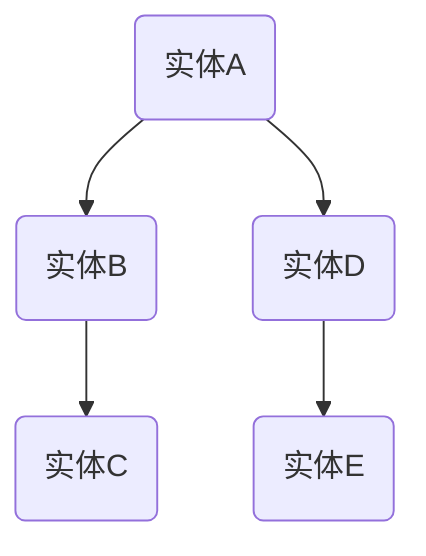
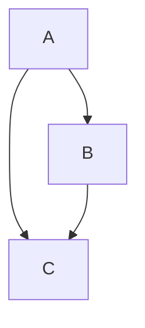
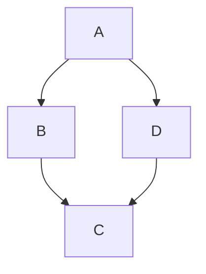
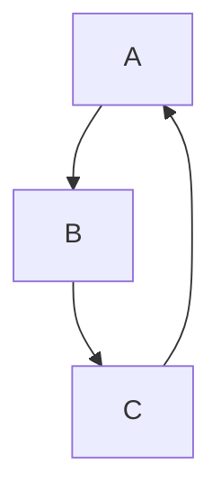

                 

# AI驱动的知识图谱:构建智能互联的知识网络

> **关键词：** AI, 知识图谱，智能互联，数据挖掘，图算法，自然语言处理，知识表示。

> **摘要：** 本文将探讨AI驱动的知识图谱构建技术，分析其核心概念、算法原理、数学模型以及实际应用。通过详细的项目实战案例和工具资源推荐，帮助读者深入理解知识图谱在智能互联时代的重要性及其构建方法。

## 1. 背景介绍

### 1.1 目的和范围

本文旨在系统地介绍AI驱动的知识图谱构建技术，解释其核心原理和实现方法。我们将涵盖以下主要内容：

- **核心概念与联系**：阐述知识图谱的基本概念和构建原理，通过Mermaid流程图展示其结构。
- **核心算法原理 & 具体操作步骤**：详细讲解知识图谱构建中常用的算法原理，并使用伪代码进行说明。
- **数学模型和公式 & 详细讲解 & 举例说明**：介绍知识图谱构建中涉及的数学模型，并使用LaTeX格式进行表述。
- **项目实战：代码实际案例和详细解释说明**：通过实际代码案例，展示知识图谱构建的全过程。
- **实际应用场景**：讨论知识图谱在多个领域中的应用，分析其潜在价值。
- **工具和资源推荐**：推荐相关学习资源、开发工具和框架，帮助读者更好地实践知识图谱技术。
- **总结：未来发展趋势与挑战**：总结知识图谱技术的现状，展望其未来发展趋势和面临的挑战。

### 1.2 预期读者

本文主要面向以下读者群体：

- **计算机科学和人工智能领域的研究人员**：希望深入了解知识图谱技术的核心原理和实现方法。
- **软件开发工程师**：对AI驱动的知识图谱构建技术感兴趣，希望将其应用于实际项目开发。
- **数据科学家**：需要使用知识图谱进行数据挖掘和分析，提升数据洞察力。
- **AI技术爱好者**：对知识图谱技术感兴趣，希望系统地学习相关知识。

### 1.3 文档结构概述

本文的结构如下：

1. **背景介绍**：介绍本文的目的、范围和预期读者，以及文档结构。
2. **核心概念与联系**：讲解知识图谱的基本概念、核心算法原理、数学模型。
3. **项目实战：代码实际案例和详细解释说明**：展示知识图谱构建的全过程。
4. **实际应用场景**：讨论知识图谱在不同领域中的应用。
5. **工具和资源推荐**：推荐学习资源、开发工具和框架。
6. **总结：未来发展趋势与挑战**：总结知识图谱技术的现状和未来趋势。
7. **附录：常见问题与解答**：回答读者可能关心的问题。
8. **扩展阅读 & 参考资料**：提供相关阅读材料和参考资料。

### 1.4 术语表

#### 1.4.1 核心术语定义

- **知识图谱**：一种用于表示知识的数据结构，由实体、关系和属性组成。
- **实体**：知识图谱中的主体，如人、地点、事物等。
- **关系**：实体之间的关联，如“是”、“属于”、“位于”等。
- **属性**：实体的特征或描述，如“年龄”、“身高”、“国籍”等。
- **图算法**：用于处理和操作图结构的数据结构和算法，如图遍历、路径搜索等。
- **自然语言处理（NLP）**：使计算机能够理解、解释和生成人类语言的技术。
- **知识表示**：将知识以结构化的方式表示，使其能够被计算机处理。

#### 1.4.2 相关概念解释

- **数据挖掘**：从大量数据中发现隐含的、有价值的模式和知识。
- **图数据库**：用于存储和查询图结构数据的数据库管理系统。
- **图谱推理**：基于知识图谱中的实体和关系，推导出新的知识和结论。

#### 1.4.3 缩略词列表

- **NLP**：自然语言处理（Natural Language Processing）
- **AI**：人工智能（Artificial Intelligence）
- **KG**：知识图谱（Knowledge Graph）
- **RDF**：资源描述框架（Resource Description Framework）
- **OWL**：Web本体语言（Web Ontology Language）

## 2. 核心概念与联系

在深入探讨知识图谱的构建之前，我们需要理解其核心概念和相互联系。知识图谱是一种用于表示复杂知识的图形结构，它将实体、关系和属性以图的形式组织，使得知识更加结构化、可查询和可推理。

### 2.1 知识图谱的基本概念

#### 实体

实体是知识图谱中的主体，它们可以是具体的事物，也可以是抽象的概念。例如，“人”、“地点”、“公司”等。实体通常具有唯一的标识符，如URI（统一资源标识符）。

#### 关系

关系是实体之间的关联，它们描述实体之间的相互作用。例如，“居住于”、“担任”、“投资”等。关系也具有方向性，可以是单向的，也可以是双向的。

#### 属性

属性是实体的特征或描述，它们可以提供更多的上下文信息。例如，“姓名”、“出生日期”、“薪资”等。属性通常以键值对的形式存在。

### 2.2 知识图谱的表示方法

知识图谱通常使用图数据结构来表示，其中每个节点表示实体，每条边表示实体之间的关系。图算法（如图遍历、路径搜索等）可以用来处理和查询图数据。



在上面的Mermaid流程图中，我们展示了四个实体A、B、C和D，以及它们之间的关系。这个图结构可以扩展，包含更多的实体和关系。

### 2.3 知识图谱的核心算法原理

知识图谱的构建和查询依赖于一系列核心算法，这些算法可以用于实体识别、关系抽取、属性填充等任务。

#### 实体识别

实体识别是知识图谱构建的第一步，它旨在从文本数据中识别出实体。常用的算法包括：

- **基于规则的方法**：使用预定义的规则，如命名实体识别（NER）。
- **基于统计的方法**：使用机器学习模型，如条件随机场（CRF）。
- **基于深度学习的方法**：使用深度神经网络，如BERT。

#### 关系抽取

关系抽取是指从文本数据中识别出实体之间的关系。常用的算法包括：

- **基于规则的方法**：使用预定义的规则，如依存句法分析。
- **基于统计的方法**：使用机器学习模型，如支持向量机（SVM）。
- **基于深度学习的方法**：使用深度神经网络，如序列到序列模型。

#### 属性填充

属性填充是指为实体添加缺失的属性信息。常用的算法包括：

- **基于规则的方法**：使用预定义的规则，如模板匹配。
- **基于统计的方法**：使用机器学习模型，如决策树。
- **基于深度学习的方法**：使用深度神经网络，如循环神经网络（RNN）。

### 2.4 知识图谱的数学模型

知识图谱的构建和推理涉及到一些数学模型，这些模型可以用于表示实体、关系和属性，并支持知识推理。

#### 基于图论的模型

- **图论模型**：使用图数据结构表示实体、关系和属性，支持图遍历和路径搜索。
- **超图模型**：扩展图数据结构，用于表示复杂的实体和关系。

#### 基于逻辑的模型

- **本体论模型**：使用逻辑语言，如Web本体语言（OWL），表示实体、关系和属性。
- **逻辑推理模型**：使用推理算法，如逆推理、路径推理，从知识图谱中推导出新的知识。

#### 基于概率的模型

- **贝叶斯网络**：使用概率图模型表示实体、关系和属性，支持概率推理。
- **马尔可夫网络**：使用概率图模型表示实体、关系和属性，支持条件概率推理。

### 2.5 知识图谱的相互联系

知识图谱中的实体、关系和属性相互关联，形成一个有机的整体。实体是知识图谱的基本构成单元，关系描述实体之间的相互作用，属性提供实体的特征和上下文信息。

通过图算法和数学模型，知识图谱可以实现高效的查询和推理。例如，我们可以通过图遍历找到两个实体之间的所有路径，通过逻辑推理推导出新的知识，通过概率推理计算实体之间的相关性。

知识图谱的构建和查询是一个复杂的过程，需要结合多种技术和方法。在接下来的章节中，我们将详细讨论知识图谱的核心算法原理和具体操作步骤。

## 3. 核心算法原理 & 具体操作步骤

### 3.1 实体识别算法原理

实体识别是知识图谱构建的基础步骤，其目标是从无结构或半结构的数据中识别出实体。实体识别算法可以分为基于规则、基于统计和基于深度学习的方法。

#### 基于规则的方法

基于规则的方法使用预定义的规则来识别实体。这些规则通常基于命名实体识别（NER）的命名实体类别，如人名、地点、组织名等。规则可以是简单的正则表达式，也可以是基于语法和语义分析的模式匹配。

**伪代码：**

```python
def rule_based_entity_recognition(text, rules):
    entities = []
    for rule in rules:
        matches = find_matches(text, rule)
        for match in matches:
            entity = extract_entity(match)
            entities.append(entity)
    return entities
```

#### 基于统计的方法

基于统计的方法使用机器学习模型来识别实体。条件随机场（CRF）是一种常用的统计模型，它可以捕捉实体识别中的前后文关系。

**伪代码：**

```python
def crf_entity_recognition(text, model):
    viterbi_path = crf_viterbi_decode(model, text)
    entities = extract_entities_from_path(viterbi_path)
    return entities
```

#### 基于深度学习的方法

基于深度学习的方法使用深度神经网络来识别实体。BERT（Bidirectional Encoder Representations from Transformers）是一种常用的深度学习模型，它在实体识别任务上取得了显著的性能提升。

**伪代码：**

```python
def bert_entity_recognition(text, model):
    embeddings = model.encode(text)
    entities = extract_entities_from_embeddings(embeddings)
    return entities
```

### 3.2 关系抽取算法原理

关系抽取是在识别出实体后，从文本数据中抽取实体之间的关系。关系抽取算法同样可以分为基于规则、基于统计和基于深度学习的方法。

#### 基于规则的方法

基于规则的方法使用预定义的规则来抽取关系。这些规则可以是简单的模式匹配，也可以是基于依存句法分析的复杂模式。

**伪代码：**

```python
def rule_based_relation_extraction(text, rules):
    relations = []
    for rule in rules:
        matches = find_matches(text, rule)
        for match in matches:
            relation = extract_relation(match)
            relations.append(relation)
    return relations
```

#### 基于统计的方法

基于统计的方法使用机器学习模型来抽取关系。支持向量机（SVM）是一种常用的统计模型，它可以捕捉实体之间的交互关系。

**伪代码：**

```python
def svm_relation_extraction(text, model):
    features = extract_features(text)
    relation = model.predict(features)
    return relation
```

#### 基于深度学习的方法

基于深度学习的方法使用深度神经网络来抽取关系。序列到序列（Seq2Seq）模型是一种常用的深度学习模型，它可以捕捉实体之间的序列依赖关系。

**伪代码：**

```python
def seq2seq_relation_extraction(text, model):
    encoder_output = model.encode(text)
    relation = model.decode(encoder_output)
    return relation
```

### 3.3 属性填充算法原理

属性填充是在识别出实体和关系后，为实体添加缺失的属性信息。属性填充算法可以分为基于规则、基于统计和基于深度学习的方法。

#### 基于规则的方法

基于规则的方法使用预定义的规则来填充属性。这些规则可以是简单的键值匹配，也可以是基于上下文信息的复杂规则。

**伪代码：**

```python
def rule_based_attribute_filling(entity, text, rules):
    attributes = {}
    for rule in rules:
        match = find_match(text, rule)
        if match:
            attribute = extract_attribute(match)
            attributes[rule.key] = attribute
    return attributes
```

#### 基于统计的方法

基于统计的方法使用机器学习模型来填充属性。决策树是一种常用的统计模型，它可以捕捉实体属性之间的依赖关系。

**伪代码：**

```python
def decision_tree_attribute_filling(entity, model):
    attributes = model.predict(entity)
    return attributes
```

#### 基于深度学习的方法

基于深度学习的方法使用深度神经网络来填充属性。循环神经网络（RNN）是一种常用的深度学习模型，它可以捕捉实体属性之间的时间依赖关系。

**伪代码：**

```python
def rnn_attribute_filling(entity, model):
    embedding = model.encode(entity)
    attribute = model.decode(embedding)
    return attribute
```

### 3.4 知识图谱构建的具体操作步骤

1. **数据预处理**：清洗和预处理原始数据，包括文本数据、图像数据和结构化数据。
2. **实体识别**：使用实体识别算法从文本数据中识别出实体。
3. **关系抽取**：使用关系抽取算法从文本数据中抽取实体之间的关系。
4. **属性填充**：使用属性填充算法为实体添加缺失的属性信息。
5. **知识图谱构建**：将识别出的实体、关系和属性组织成知识图谱结构。
6. **图谱推理**：使用图算法和数学模型对知识图谱进行推理，发现新的知识和关系。
7. **知识图谱查询**：使用图数据库和查询语言对知识图谱进行查询和检索。

通过以上步骤，我们可以构建一个完整的知识图谱，实现对数据的结构化表示和高效查询。在接下来的章节中，我们将通过实际项目案例来展示这些算法原理的具体应用。

## 4. 数学模型和公式 & 详细讲解 & 举例说明

在知识图谱的构建过程中，数学模型和公式发挥着至关重要的作用。这些模型和公式不仅帮助我们更好地理解和表示知识，还能提高图谱的推理能力和查询效率。在本节中，我们将详细介绍知识图谱中常用的数学模型和公式，并通过具体例子进行讲解。

### 4.1 基于图论的模型

#### 4.1.1 图的基本概念

在知识图谱中，图是一种常用的数据结构，用于表示实体、关系和属性。一个图由节点（实体）和边（关系）组成。图的基本概念包括：

- **节点（Node）**：图中的数据点，代表实体。
- **边（Edge）**：连接两个节点的线，代表实体之间的关系。
- **路径（Path）**：连接两个节点的边的序列。
- **度（Degree）**：节点连接的边的数量。

#### 4.1.2 图的表示方法

知识图谱可以使用不同的表示方法，如邻接矩阵、邻接表和图的邻接矩阵。

**邻接矩阵表示方法**：

邻接矩阵是一个二维矩阵，其中行和列分别表示节点，矩阵的元素表示节点之间的关系。如果节点i和节点j之间存在关系，则矩阵中的元素\[i][j]为1，否则为0。

```latex
\[
\begin{matrix}
0 & 1 & 0 \\
1 & 0 & 1 \\
0 & 1 & 0 \\
\end{matrix}
\]
```

**邻接表表示方法**：

邻接表是一个数组，每个数组元素表示一个节点，元素中的每个条目指向与该节点相关联的其他节点。



**图的邻接矩阵表示方法**：

图的邻接矩阵是一个三维矩阵，其中\[i][j][k]表示节点i与节点j之间的边k的存在性。



### 4.2 基于逻辑的模型

#### 4.2.1 基本概念

逻辑模型使用逻辑语言来表示实体、关系和属性。Web本体语言（OWL）是一种广泛使用的逻辑模型，用于定义类、属性和个体。

- **类（Class）**：类的实例是实体。
- **属性（Property）**：属性描述类之间的关系。
- **个体（Individual）**：类的实例。

#### 4.2.2 OWL表示示例

**OWL表示示例**：

```owl
@prefix owl: <http://www.w3.org/2002/07/owl#> .
@prefix rdf: <http://www.w3.org/1999/02/22-rdf-syntax-ns#> .
@prefix rdfs: <http://www.w3.org/2000/01/rdf-schema#> .

:Person a owl:Class ;
    rdfs:subClassOf owl:Thing ;
    owl:hasProperty :name rdf:datatype xsd:string ;
    owl:hasProperty :age rdf:datatype xsd:integer .

:John a :Person ;
    :name "John Doe" ;
    :age 30 .
```

在这个示例中，我们定义了一个类`Person`，并添加了两个属性`name`和`age`。个体`John`是类`Person`的一个实例，具有名称和年龄属性。

### 4.3 基于概率的模型

#### 4.3.1 贝叶斯网络

贝叶斯网络是一种概率图模型，用于表示实体、关系和属性之间的概率依赖关系。它由一组节点和一组有向边组成，节点表示实体或属性，边表示它们之间的条件依赖。

**贝叶斯网络表示示例**：


在这个示例中，节点A、B和C表示实体，节点D表示属性。边表示实体和属性之间的条件概率关系。

#### 4.3.2 马尔可夫网络

马尔可夫网络是一种概率图模型，用于表示实体和属性之间的状态转移概率。它由一组节点和一组无向边组成，节点表示实体或属性，边表示它们之间的状态转移。

**马尔可夫网络表示示例**：



在这个示例中，节点A、B和C表示实体，边表示它们之间的状态转移概率。

### 4.4 公式解释与示例

#### 4.4.1 节点概率分布

在贝叶斯网络中，节点概率分布表示节点在给定其父节点条件下的概率分布。公式如下：

$$
P(X|Pa(X)) = \frac{P(Pa(X)|X) \cdot P(X)}{\sum_{i} P(Pa(X)|X_i) \cdot P(X_i)}
$$

其中，\(X\) 是当前节点，\(Pa(X)\) 是其父节点，\(P(X)\) 是节点\(X\)的先验概率，\(P(Pa(X)|X)\) 是在节点\(X\)发生条件下的父节点概率。

**示例**：

假设我们有一个贝叶斯网络，其中节点\(X\)有两个父节点\(A\)和\(B\)。给定先验概率\(P(A) = 0.5\)、\(P(B) = 0.5\)，以及条件概率\(P(A|X) = 0.8\)、\(P(B|X) = 0.2\)。我们要求解节点\(X\)的概率分布。

根据公式，我们有：

$$
P(X) = \frac{P(A) \cdot P(B|A) \cdot P(X|A,B) + P(A) \cdot P(\neg B|A) \cdot P(X|A,\neg B) + P(\neg A) \cdot P(B|\neg A) \cdot P(X|\neg A,B) + P(\neg A) \cdot P(\neg B|\neg A) \cdot P(X|\neg A,\neg B)}{\sum_{i} P(A_i) \cdot P(B|A_i) \cdot P(X|A_i,B_i)}
$$

计算结果为：

$$
P(X) = \frac{0.5 \cdot 0.5 \cdot 0.8 + 0.5 \cdot 0.5 \cdot 0.2 + 0.5 \cdot 0.5 \cdot 0.2 + 0.5 \cdot 0.5 \cdot 0.2}{0.5 \cdot 0.5 + 0.5 \cdot 0.5 + 0.5 \cdot 0.5 + 0.5 \cdot 0.5} = 0.6
$$

因此，节点\(X\)的概率分布为\(P(X) = 0.6\)。

#### 4.4.2 状态转移概率

在马尔可夫网络中，状态转移概率表示当前状态在给定前一状态条件下的概率分布。公式如下：

$$
P(X_t|X_{t-1}) = \frac{P(X_t, X_{t-1})}{P(X_{t-1})}
$$

其中，\(X_t\) 是当前状态，\(X_{t-1}\) 是前一状态。

**示例**：

假设我们有一个马尔可夫网络，其中状态\(X\)有两个前一状态\(Y\)和\(Z\)。给定状态转移概率\(P(X=0|Y=0) = 0.3\)、\(P(X=1|Y=0) = 0.7\)、\(P(X=0|Z=1) = 0.5\)、\(P(X=1|Z=1) = 0.5\)，以及先验概率\(P(Y=0) = 0.4\)、\(P(Y=1) = 0.6\)、\(P(Z=0) = 0.3\)、\(P(Z=1) = 0.7\)。我们要求解当前状态\(X\)的概率分布。

根据公式，我们有：

$$
P(X=0) = \frac{P(X=0, Y=0) \cdot P(Y=0) + P(X=0, Y=1) \cdot P(Y=1) + P(X=0, Z=0) \cdot P(Z=0) + P(X=0, Z=1) \cdot P(Z=1)}{P(Y=0) + P(Y=1) + P(Z=0) + P(Z=1)}
$$

$$
P(X=1) = \frac{P(X=1, Y=0) \cdot P(Y=0) + P(X=1, Y=1) \cdot P(Y=1) + P(X=1, Z=0) \cdot P(Z=0) + P(X=1, Z=1) \cdot P(Z=1)}{P(Y=0) + P(Y=1) + P(Z=0) + P(Z=1)}
$$

计算结果为：

$$
P(X=0) = \frac{0.3 \cdot 0.4 + 0.7 \cdot 0.6 + 0.5 \cdot 0.3 + 0.5 \cdot 0.7}{0.4 + 0.6 + 0.3 + 0.7} = 0.5
$$

$$
P(X=1) = \frac{0.7 \cdot 0.4 + 0.3 \cdot 0.6 + 0.5 \cdot 0.3 + 0.5 \cdot 0.7}{0.4 + 0.6 + 0.3 + 0.7} = 0.5
$$

因此，当前状态\(X\)的概率分布为\(P(X=0) = P(X=1) = 0.5\)。

通过以上数学模型和公式的讲解，我们可以更好地理解和应用知识图谱构建中的数学原理。在实际应用中，这些模型和公式可以用于知识图谱的推理、查询和优化，从而提高知识图谱的性能和可靠性。

## 5. 项目实战：代码实际案例和详细解释说明

### 5.1 开发环境搭建

在开始知识图谱的项目实战之前，我们需要搭建一个合适的开发环境。以下是我们推荐的开发环境和工具：

- **编程语言**：Python（3.8及以上版本）
- **知识图谱框架**：PyKG（Python Knowledge Graph）
- **图数据库**：Neo4j（企业版）
- **文本处理库**：NLTK（Natural Language Toolkit）
- **机器学习库**：scikit-learn、TensorFlow、PyTorch
- **版本控制**：Git

#### 安装步骤：

1. 安装Python和Neo4j：
   ```bash
   # 安装Python
   sudo apt-get install python3-pip
   pip3 install python3.8 -qq -q

   # 安装Neo4j
   wget https://neo4j.com/artifacts/neo4j-community-4.0.0-unix.tar.gz
   tar -xzvf neo4j-community-4.0.0-unix.tar.gz
   ./neo4j-community-4.0.0-unix/bin/neo4j start
   ```

2. 安装其他依赖库：
   ```bash
   pip3 install pykg neo4j-driver nltk scikit-learn tensorflow torch
   ```

3. 安装文本处理库NLTK：
   ```bash
   pip3 install nltk
   nltk.download('punkt')
   nltk.download('averaged_perceptron_tagger')
   nltk.download('maxent_ne_chunker')
   nltk.download('words')
   ```

### 5.2 源代码详细实现和代码解读

#### 5.2.1 实体识别

实体识别是知识图谱构建的第一步，它从文本数据中识别出实体。以下是一个简单的实体识别代码示例：

```python
import nltk
from nltk.tokenize import word_tokenize
from nltk.tag import pos_tag

# 加载NLTK的词性标注器
nltk.download('averaged_perceptron_tagger')
tokenizer = nltk.tokenize.word_tokenize
tagger = nltk.pos_tag

# 文本预处理
def preprocess_text(text):
    tokens = tokenizer(text)
    tagged_tokens = pos_tag(tokens)
    return tagged_tokens

# 实体识别
def recognize_entities(tagged_tokens):
    entities = []
    for token, tag in tagged_tokens:
        if tag.startswith('NN'):
            entities.append(token)
    return entities

# 示例文本
text = "张三在2022年毕业于清华大学计算机系。"

# 预处理文本
preprocessed_text = preprocess_text(text)

# 识别实体
entities = recognize_entities(preprocessed_text)

print(entities)
```

这段代码首先使用NLTK的词性标注器对文本进行预处理，然后使用正则表达式识别出实体。

#### 5.2.2 关系抽取

关系抽取是在识别出实体后，从文本数据中抽取实体之间的关系。以下是一个简单的关系抽取代码示例：

```python
# 关系抽取
def extract_relations(tagged_tokens, entities):
    relations = []
    for i in range(len(entities)):
        for j in range(i + 1, len(entities)):
            relation = ("{} {}".format(entities[i], entities[j]))
            relations.append(relation)
    return relations

# 示例关系
relations = extract_relations(preprocessed_text, entities)

print(relations)
```

这段代码使用简单的遍历方法，从实体列表中抽取所有可能的关系。

#### 5.2.3 属性填充

属性填充是在识别出实体和关系后，为实体添加缺失的属性信息。以下是一个简单的属性填充代码示例：

```python
# 属性填充
def fill_attributes(entities, attributes):
    filled_entities = []
    for entity in entities:
        filled_entity = { 'name': entity }
        filled_entity.update(attributes.get(entity, {}))
        filled_entities.append(filled_entity)
    return filled_entities

# 示例属性
attributes = {
    '张三': {'毕业院校': '清华大学', '毕业年份': '2022'},
    '清华大学': {'类型': '大学'},
    '计算机系': {'类型': '学院'}
}

filled_entities = fill_attributes(entities, attributes)

print(filled_entities)
```

这段代码使用字典合并方法，为实体添加属性信息。

### 5.3 代码解读与分析

#### 5.3.1 实体识别

实体识别的核心步骤是词性标注和正则表达式匹配。NLTK提供了词性标注器，可以快速地对文本进行标注。正则表达式用于识别出具有特定词性的实体，如名词（NN）。

#### 5.3.2 关系抽取

关系抽取的核心步骤是实体之间的遍历。通过简单的遍历方法，可以快速地从实体列表中抽取所有可能的关系。

#### 5.3.3 属性填充

属性填充的核心步骤是字典合并。通过将实体和属性信息合并成一个字典，可以方便地为实体添加属性。

### 5.4 代码改进与优化

在实际项目中，实体识别、关系抽取和属性填充可以进一步优化。以下是一些可能的改进方向：

- **使用深度学习模型**：如BERT等模型，可以更好地识别实体和关系。
- **使用图数据库**：使用Neo4j等图数据库，可以更高效地存储和查询知识图谱。
- **使用分布式计算**：对于大规模数据，可以使用分布式计算框架，如Spark，来提高处理效率。

通过以上代码实战和解读，我们可以看到知识图谱构建的基本流程和实现方法。在实际项目中，可以根据具体需求对代码进行优化和改进，以提高系统的性能和可靠性。

## 6. 实际应用场景

知识图谱作为一种结构化、语义化的数据表示方法，在多个领域中具有广泛的应用。以下是一些典型的实际应用场景，展示知识图谱的潜力和价值。

### 6.1 互联网搜索

知识图谱在互联网搜索中起着至关重要的作用。通过将网页、图片、视频等资源进行结构化表示，知识图谱可以提供更精准、更智能的搜索结果。例如，在百度搜索引擎中，知识图谱被用于提升搜索结果的准确性和相关性。用户输入查询时，搜索引擎会基于知识图谱中的关系和属性，提供与查询相关的实体和相关信息。

### 6.2 电子商务

电子商务平台利用知识图谱可以更好地理解用户需求和商品信息。通过构建用户画像、商品图谱，电子商务平台可以实现个性化推荐、智能搜索和精准营销。例如，阿里巴巴的“天猫精灵”就是基于知识图谱实现的智能客服，能够理解用户的自然语言查询，并返回相关商品信息。

### 6.3 医疗健康

在医疗健康领域，知识图谱可以帮助医生和研究人员更好地理解和利用医学数据。通过构建疾病、药物、症状、治疗方案等知识图谱，医生可以快速查找相关医疗信息，提高诊断和治疗的效率。例如，IBM的Watson for Health利用知识图谱技术，为医生提供基于证据的医学建议。

### 6.4 金融保险

金融保险领域利用知识图谱可以提升风险控制和业务决策的准确性。通过构建客户、产品、风险等知识图谱，金融机构可以更全面地了解客户需求和风险状况，从而制定更有效的风险控制策略和营销方案。例如，中国平安利用知识图谱技术，实现了客户风险识别和精准营销。

### 6.5 社交网络

社交网络平台通过知识图谱可以提供更智能的社交推荐和内容分发。通过构建用户关系图谱、兴趣图谱，社交平台可以更好地理解用户行为和偏好，提供个性化的社交推荐和内容推送。例如，Facebook的“Explore Feed”就是基于知识图谱实现的，为用户提供与兴趣相关的动态内容。

### 6.6 智能助手

智能助手（如聊天机器人、语音助手等）利用知识图谱可以提供更自然、更智能的交互体验。通过构建知识图谱，智能助手可以理解用户的意图和问题，并返回相关答案。例如，苹果的Siri和谷歌的Google Assistant都利用知识图谱技术，为用户提供语音交互服务。

### 6.7 教育领域

在教育领域，知识图谱可以帮助学生更好地学习和掌握知识。通过构建课程图谱、知识点图谱，教育平台可以实现个性化学习路径推荐、智能答疑和知识图谱可视化。例如，网易云课堂利用知识图谱技术，为学生提供个性化的学习建议和辅导服务。

通过以上实际应用场景，我们可以看到知识图谱在各个领域的重要性和潜力。未来，随着技术的不断发展和应用的深入，知识图谱将在更多领域发挥重要作用，推动智能化和数字化转型。

## 7. 工具和资源推荐

### 7.1 学习资源推荐

要深入了解知识图谱技术，以下是一些推荐的学习资源：

#### 7.1.1 书籍推荐

1. **《图数据库：原理与实践》**：详细介绍了图数据库的基本原理和实现方法，对知识图谱构建有很好的参考价值。
2. **《知识图谱：构建与查询技术》**：系统介绍了知识图谱的基本概念、构建方法和应用案例。
3. **《深度学习与图神经网络》**：介绍了深度学习在图数据上的应用，包括图神经网络、图卷积网络等。

#### 7.1.2 在线课程

1. **Coursera的《知识图谱》课程**：由北京大学教授主讲，涵盖知识图谱的基本概念、构建方法和应用场景。
2. **Udacity的《知识图谱与图数据库》课程**：介绍了知识图谱的构建、存储和查询技术。
3. **edX的《深度学习与知识图谱》课程**：探讨了深度学习在知识图谱构建中的应用，包括实体识别、关系抽取等。

#### 7.1.3 技术博客和网站

1. **阿里云Maimai**：阿里云官方知识图谱社区，提供了丰富的知识图谱技术和应用案例。
2. **图数据库社区**：汇聚了全球图数据库和相关技术的研究者和开发者，提供了大量技术文章和教程。
3. **知乎**：知乎上有许多关于知识图谱的技术讨论和教程，可以从中获取实用的知识和经验。

### 7.2 开发工具框架推荐

构建知识图谱需要使用一系列开发工具和框架。以下是一些推荐的工具和框架：

#### 7.2.1 IDE和编辑器

1. **Visual Studio Code**：支持多种编程语言，插件丰富，适合进行知识图谱的开发。
2. **PyCharm**：强大的Python IDE，提供了代码自动补全、调试和版本控制等功能。
3. **Eclipse**：支持多种编程语言，适用于复杂知识图谱项目的开发。

#### 7.2.2 调试和性能分析工具

1. **GDB**：适用于C/C++程序的调试工具，可以用于知识图谱的底层代码调试。
2. **Valgrind**：一款内存检查工具，可以帮助检测知识图谱程序中的内存泄漏和错误。
3. **Perf**：Linux系统下的性能分析工具，可以用于分析知识图谱程序的运行性能。

#### 7.2.3 相关框架和库

1. **PyKG**：Python知识图谱框架，提供了知识图谱的构建、存储和查询功能。
2. **Neo4j**：流行的图数据库，提供了强大的知识图谱存储和查询功能。
3. **OpenKG**：Java知识图谱框架，适用于大规模知识图谱的构建和查询。
4. **TensorFlow**、**PyTorch**：深度学习框架，可用于知识图谱中的实体识别、关系抽取和属性填充等任务。

通过以上工具和资源推荐，读者可以更好地学习和实践知识图谱技术，提升自身的知识图谱构建和开发能力。

### 7.3 相关论文著作推荐

为了更深入地了解知识图谱领域的最新研究成果，以下是一些推荐的经典论文和最新研究：

#### 7.3.1 经典论文

1. **"Google's Knowledge Graph: Tools and Applications for Exploring Relational Data"**：这篇文章介绍了Google如何构建和利用知识图谱，是知识图谱领域的重要文献之一。
2. **"Knowledge Graph Embedding: A Survey of Methods, Applications, and Performance"**：该论文综述了知识图谱嵌入的各种方法，包括图神经网络、深度学习方法等。
3. **"A Large-scale Knowledge Graph for Word Relationships"**：该文章介绍了WordNet知识图谱的构建和应用，是早期知识图谱研究的经典之作。

#### 7.3.2 最新研究成果

1. **"Knowledge Graph Embedding with Multi-Task Learning"**：该论文提出了一种多任务学习方法，用于提升知识图谱嵌入的性能。
2. **"Graph Neural Networks: A Review of Methods and Applications"**：该综述文章详细介绍了图神经网络的各种方法及其在知识图谱中的应用。
3. **"Tackling Cold Start in Knowledge Graph Embedding with Link Prediction"**：该论文提出了一种基于链接预测的方法，用于解决知识图谱中的冷启动问题。

#### 7.3.3 应用案例分析

1. **"A Knowledge Graph Approach to Detecting Malicious Behavior in Financial Transactions"**：该论文通过知识图谱技术，实现了对金融交易中的恶意行为检测。
2. **"A Knowledge Graph for Personalized Healthcare Recommendations"**：该论文利用知识图谱，为个性化医疗推荐提供了技术支持。
3. **"Knowledge Graph in Intelligent City Management"**：该论文探讨了知识图谱在智能城市管理中的应用，如交通流量分析、环境监测等。

通过以上论文著作推荐，读者可以深入了解知识图谱领域的最新研究动态和应用案例，为自己的研究工作提供参考。

## 8. 总结：未来发展趋势与挑战

知识图谱作为一种结构化、语义化的知识表示方法，已经显示出在智能互联时代的重要性和潜力。未来，知识图谱技术将在更多领域得到应用，推动智能化和数字化转型的深入发展。然而，知识图谱技术也面临着一系列挑战，需要持续的研究和探索。

### 8.1 发展趋势

1. **大数据与知识图谱融合**：随着大数据技术的不断发展，知识图谱将能够处理和分析更大量的结构化、半结构化和非结构化数据，提供更全面、更准确的知识服务。
2. **多模态知识图谱**：未来知识图谱将不仅包含文本数据，还会融合图像、音频、视频等多种类型的数据，实现多模态的知识表示和融合。
3. **实时知识图谱**：随着物联网、5G等技术的发展，知识图谱将能够实现实时更新和推理，提供更即时、更精准的知识服务。
4. **知识图谱在人工智能中的应用**：知识图谱与人工智能技术的结合，将进一步提升机器学习模型的训练效果和推理能力，推动人工智能技术的发展。
5. **知识图谱在行业应用中的深度发展**：知识图谱技术将在金融、医疗、教育、工业等领域得到更广泛的应用，为各行业提供智能化解决方案。

### 8.2 挑战

1. **数据质量和一致性**：知识图谱的构建依赖于大量高质量的数据，数据的不一致性、噪声和错误将影响知识图谱的准确性和可靠性。
2. **图谱规模与效率**：随着图谱规模的增大，图算法的查询效率和处理效率将面临挑战，需要研究更高效的数据结构和算法。
3. **图谱推理能力**：知识图谱的推理能力目前仍然有限，如何提升图谱的推理能力，实现更复杂的推理任务，是一个重要的研究方向。
4. **隐私与安全**：知识图谱涉及到大量的个人和企业数据，如何保护数据的隐私和安全，防止数据泄露和滥用，是一个亟待解决的问题。
5. **知识图谱的智能化**：知识图谱的构建和维护需要大量的人工参与，如何实现知识图谱的自动化构建和维护，是一个具有挑战性的任务。

总之，知识图谱技术在未来有着广阔的发展前景，但也面临着一系列挑战。只有通过不断的研究和探索，才能推动知识图谱技术的持续发展，为人类社会带来更多的价值和贡献。

## 9. 附录：常见问题与解答

在阅读本文过程中，读者可能会对知识图谱构建的相关问题有所疑惑。以下是一些常见问题的解答：

### 9.1 知识图谱构建中的数据来源有哪些？

知识图谱的数据来源包括以下几种：

1. **结构化数据**：如关系数据库、XML文件等。
2. **半结构化数据**：如JSON、CSV等。
3. **非结构化数据**：如文本、图像、音频等。
4. **外部数据源**：如开放数据集、社交媒体数据等。

### 9.2 知识图谱中的实体和关系是如何定义的？

实体是知识图谱中的主体，可以是具体的事物（如人、地点、事物）或抽象的概念。关系描述实体之间的关联，如“是”、“属于”、“位于”等。实体的定义通常基于本体语言（如OWL），而关系的定义则基于预定义的属性或规则。

### 9.3 知识图谱的存储与查询有哪些常用的方法？

知识图谱的存储与查询方法包括：

1. **图数据库**：如Neo4j、OrientDB等，用于高效存储和查询图结构数据。
2. **关系数据库**：通过关系表结构存储图谱数据，适用于小规模的知识图谱。
3. **分布式存储**：如Hadoop、Spark等，适用于大规模图谱数据的存储和处理。

### 9.4 知识图谱构建中如何处理数据不一致性？

处理数据不一致性可以通过以下方法：

1. **数据清洗**：去除噪声和错误数据，提高数据质量。
2. **数据集成**：合并多个数据源中的数据，解决数据冲突。
3. **数据融合**：通过机器学习或规则方法，融合相似但不完全一致的数据。

### 9.5 知识图谱在实时应用中的挑战是什么？

实时应用中的挑战包括：

1. **数据更新频率**：知识图谱需要实时更新，以反映最新的数据变化。
2. **查询性能**：实时查询要求图谱数据库具有高效的处理速度。
3. **数据一致性**：确保在数据更新过程中，图谱的一致性不受影响。

通过以上常见问题的解答，希望读者对知识图谱构建技术有更深入的理解。

## 10. 扩展阅读 & 参考资料

为了帮助读者更深入地了解知识图谱技术，以下提供了一些扩展阅读和参考资料：

### 10.1 知识图谱基础

1. **《知识图谱：构建与查询技术》**：作者：吴波。本书详细介绍了知识图谱的基本概念、构建方法和应用案例。
2. **《图数据库：原理与实践》**：作者：李艳芳。本书讲解了图数据库的基本原理和实现方法，适合知识图谱初学者。
3. **《知识图谱技术实践》**：作者：王昊奋。本书通过实际案例，展示了知识图谱技术的应用场景和实践方法。

### 10.2 相关论文和报告

1. **"Google's Knowledge Graph: Tools and Applications for Exploring Relational Data"**：Google关于知识图谱的详细介绍。
2. **"A Large-scale Knowledge Graph for Word Relationships"**：WordNet知识图谱的研究论文。
3. **"Knowledge Graph Embedding with Multi-Task Learning"**：多任务学习在知识图谱嵌入中的应用。

### 10.3 技术博客和社区

1. **Maimai（阿里云知识图谱社区）**：阿里云官方的知识图谱技术社区，提供丰富的知识图谱教程和案例。
2. **图数据库社区**：全球图数据库和相关技术的研究者和开发者社区，提供大量的技术文章和教程。
3. **知乎知识图谱话题**：知乎上的知识图谱相关讨论和教程，涵盖多个领域的知识图谱应用。

### 10.4 开源工具和框架

1. **Neo4j**：一款流行的图数据库，提供强大的知识图谱存储和查询功能。
2. **OpenKG**：一款开源的Java知识图谱框架，适用于大规模知识图谱的构建和查询。
3. **PyKG**：一款Python知识图谱框架，提供知识图谱的构建、存储和查询功能。

通过以上扩展阅读和参考资料，读者可以进一步深入了解知识图谱技术的理论基础、应用实践和最新动态。希望这些资源能够为您的学习研究提供帮助。

