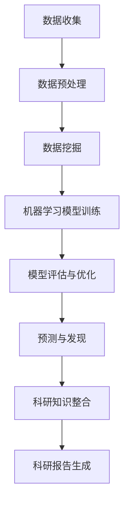

                 

# AI驱动的科学发现：加速创新的新范式

> **关键词**：人工智能，科学发现，创新，数据挖掘，机器学习，深度学习，计算科学，算法优化，科研自动化，数据可视化，云计算，多学科交叉，技术创新

> **摘要**：本文深入探讨了人工智能（AI）在科学发现领域的应用，如何通过数据挖掘、机器学习和深度学习等技术，加速科研进程，推动多学科交叉，实现创新突破。文章首先介绍了AI驱动科学发现的背景和重要性，然后详细阐述了核心算法原理与数学模型，最后通过项目实战和实际应用场景分析，展示了AI在科学发现中的巨大潜力。同时，文章还推荐了相关学习资源、开发工具和经典论文，以供读者进一步研究和探索。

## 1. 背景介绍

### 1.1 目的和范围

本文旨在探讨人工智能（AI）在科学发现领域的应用，解析AI如何通过数据挖掘、机器学习和深度学习等技术，加速科研进程，促进多学科交叉，推动创新突破。文章将涵盖以下内容：

1. **AI驱动科学发现的背景和重要性**：介绍AI在科学研究中的崛起，以及其对科学发现的影响。
2. **核心概念与联系**：阐述AI驱动科学发现的核心概念和原理，并通过Mermaid流程图展示其架构。
3. **核心算法原理与具体操作步骤**：讲解数据挖掘、机器学习和深度学习算法的原理，并使用伪代码阐述操作步骤。
4. **数学模型和公式**：详细介绍数学模型和公式，并通过实例说明。
5. **项目实战**：通过实际代码案例，展示AI在科学发现中的应用。
6. **实际应用场景**：分析AI在不同领域中的应用案例。
7. **工具和资源推荐**：推荐学习资源、开发工具和相关论文，以供读者进一步研究。
8. **总结与未来发展趋势**：总结AI驱动科学发现的现状，展望未来发展。

### 1.2 预期读者

本文主要面向对人工智能和科学研究感兴趣的读者，包括：

1. **科研人员**：希望了解AI在科学发现中的应用，以及如何利用AI技术提高科研效率。
2. **工程师**：对AI算法原理和应用场景感兴趣，希望将其应用于实际问题。
3. **学生**：对AI和科学研究有浓厚兴趣，希望深入了解相关技术和领域。

### 1.3 文档结构概述

本文共分为10个部分，结构如下：

1. **背景介绍**：介绍文章的目的、范围、预期读者和文档结构。
2. **核心概念与联系**：阐述核心概念和原理，并通过Mermaid流程图展示架构。
3. **核心算法原理与具体操作步骤**：讲解算法原理和操作步骤。
4. **数学模型和公式**：详细介绍数学模型和公式。
5. **项目实战**：通过实际代码案例展示应用。
6. **实际应用场景**：分析AI在不同领域中的应用。
7. **工具和资源推荐**：推荐学习资源、开发工具和相关论文。
8. **总结与未来发展趋势**：总结现状，展望未来。
9. **附录：常见问题与解答**：回答读者可能遇到的常见问题。
10. **扩展阅读与参考资料**：提供进一步研究的参考文献。

### 1.4 术语表

#### 1.4.1 核心术语定义

- **人工智能（AI）**：模拟人类智能的计算机系统，具备学习、推理、解决问题和自主决策的能力。
- **数据挖掘**：从大量数据中提取有价值信息的过程。
- **机器学习**：一种AI技术，通过数据学习模式和规律，从而进行预测和决策。
- **深度学习**：一种基于多层神经网络的学习方法，可以自动提取特征并实现复杂任务。
- **科学发现**：通过实验和研究，揭示自然界规律和未知现象的过程。
- **多学科交叉**：不同学科之间的知识融合，推动创新和发展。

#### 1.4.2 相关概念解释

- **算法**：解决问题的步骤和规则。
- **模型**：表示现实世界的一种数学结构。
- **特征提取**：从数据中提取有助于分类和预测的关键信息。
- **预测**：基于历史数据，对未知数据做出推断。
- **优化**：寻找最优解的过程。

#### 1.4.3 缩略词列表

- **AI**：人工智能（Artificial Intelligence）
- **ML**：机器学习（Machine Learning）
- **DL**：深度学习（Deep Learning）
- **NLP**：自然语言处理（Natural Language Processing）
- **CV**：计算机视觉（Computer Vision）
- **DL4Sci**：深度学习在科学研究中的应用（Deep Learning for Science）
- **HPC**：高性能计算（High-Performance Computing）

## 2. 核心概念与联系

### 2.1 AI驱动科学发现的架构

为了更好地理解AI驱动科学发现的核心概念，我们首先需要了解其整体架构。以下是一个简单的Mermaid流程图，展示了AI驱动科学发现的关键组成部分和它们之间的联系。



- **数据收集（A）**：科学研究的起点，通过各种手段获取数据，包括实验数据、观测数据、文献数据等。
- **数据预处理（B）**：清洗、整合和转换原始数据，使其适合机器学习模型的训练。
- **数据挖掘（C）**：利用算法从数据中提取有价值的信息，如规律、趋势和模式。
- **机器学习模型训练（D）**：使用数据挖掘结果训练机器学习模型，使其具备预测和决策能力。
- **模型评估与优化（E）**：评估模型性能，通过调整参数和算法进行优化。
- **预测与发现（F）**：使用训练好的模型进行预测，揭示未知现象和规律。
- **科研知识整合（G）**：将预测结果与其他科研知识进行整合，形成新的科研见解。
- **科研报告生成（H）**：撰写科研报告，记录研究成果和发现。

### 2.2 核心概念与联系

在AI驱动科学发现的架构中，以下几个核心概念和联系至关重要：

1. **数据驱动**：科学研究从传统的理论驱动转变为数据驱动，通过数据挖掘和机器学习从海量数据中提取有价值的信息。
2. **多学科交叉**：AI技术跨越多个学科，如计算机科学、统计学、生物学、物理学等，推动跨学科研究，实现创新突破。
3. **自动化与优化**：机器学习和深度学习算法在科学研究中实现自动化，通过优化算法和参数，提高科研效率和准确性。
4. **预测与发现**：利用训练好的模型进行预测，揭示未知现象和规律，推动科研进程。
5. **科研知识整合**：将预测结果与其他科研知识进行整合，形成新的科研见解，促进科学发现。

通过以上核心概念和联系的阐述，我们可以更深入地理解AI驱动科学发现的原理和重要性。

## 3. 核心算法原理 & 具体操作步骤

### 3.1 数据挖掘算法原理

数据挖掘是AI驱动科学发现的关键步骤，其主要任务是发现数据中的隐含模式。以下是一个常用的数据挖掘算法——K-means算法的原理和具体操作步骤。

#### 3.1.1 算法原理

K-means算法是一种基于距离的聚类算法，其核心思想是将数据集分成K个簇，使得每个簇中的数据点尽量接近，而不同簇的数据点尽量远离。具体原理如下：

1. **初始化**：随机选择K个数据点作为初始聚类中心。
2. **分配数据点**：计算每个数据点到K个聚类中心的距离，将其分配到最近的聚类中心所在的簇。
3. **更新聚类中心**：重新计算每个簇的中心点，作为新的聚类中心。
4. **迭代**：重复步骤2和3，直到聚类中心不再发生显著变化或达到预定的迭代次数。

#### 3.1.2 具体操作步骤

以下是一个K-means算法的具体操作步骤，使用伪代码表示：

```python
# 输入：数据集D，簇数K
# 输出：聚类结果

# 步骤1：初始化聚类中心
centroids = k_random_points(D)

# 步骤2：分配数据点
clusters = [[] for _ in range(K)]
for data_point in D:
    closest_centroid = min(centroids, key=lambda c: distance(data_point, c))
    clusters[centroids.index(closest_centroid)].append(data_point)

# 步骤3：更新聚类中心
new_centroids = []
for cluster in clusters:
    if cluster:
        new_centroid = calculate_mean(cluster)
        new_centroids.append(new_centroid)
    else:
        new_centroids.append(random_point(D))

# 步骤4：迭代
while not converged(centroids, new_centroids):
    centroids = new_centroids
    clusters = [[] for _ in range(K)]
    for data_point in D:
        closest_centroid = min(centroids, key=lambda c: distance(data_point, c))
        clusters[centroids.index(closest_centroid)].append(data_point)
    new_centroids = []
    for cluster in clusters:
        if cluster:
            new_centroid = calculate_mean(cluster)
            new_centroids.append(new_centroid)
        else:
            new_centroids.append(random_point(D))

# 返回聚类结果
return clusters
```

#### 3.1.3 算法分析

K-means算法的时间复杂度为O(nK^2)，其中n为数据集大小，K为簇数。该算法通常适用于数据量较小、簇数较少的情况。然而，K-means算法存在一些局限性，如对初始聚类中心的敏感性、无法处理非线性聚类问题等。

### 3.2 机器学习模型训练原理

在数据挖掘的基础上，机器学习模型训练是AI驱动科学发现的核心步骤。以下是一个常用的机器学习模型——支持向量机（SVM）的原理和具体操作步骤。

#### 3.2.1 算法原理

SVM是一种监督学习算法，其核心思想是找到一个最佳的超平面，将不同类别的数据点分开。具体原理如下：

1. **线性可分情况**：寻找一个超平面，使得两类数据点的距离最大。
2. **线性不可分情况**：引入“软间隔”，允许一些数据点位于超平面两侧，优化目标为最大化间隔和最小化分类误差。
3. **核函数**：通过将数据映射到高维空间，实现线性不可分问题的线性化。

#### 3.2.2 具体操作步骤

以下是一个SVM的具体操作步骤，使用伪代码表示：

```python
# 输入：训练数据集D，标签L
# 输出：SVM模型

# 步骤1：初始化参数
C = 1.0  # 软间隔参数
max_iter = 1000  # 最大迭代次数

# 步骤2：构建对偶问题
objective_function = build_objective_function(D, L, C)
constraints = build_constraints(D, L, C)

# 步骤3：求解对偶问题
model = solve_qp(objective_function, constraints)

# 步骤4：计算决策边界
w = model.w
b = model.b
decision_boundary = calculate_decision_boundary(w, b)

# 步骤5：迭代优化
for i in range(max_iter):
    # 更新参数
    model = update_model(model)
    # 计算决策边界
    w = model.w
    b = model.b
    decision_boundary = calculate_decision_boundary(w, b)

# 返回SVM模型
return model
```

#### 3.2.3 算法分析

SVM的时间复杂度为O(n^3)，其中n为训练数据集大小。该算法适用于高维空间，但在大规模数据集上可能存在计算效率问题。此外，SVM对参数敏感，需要根据数据集特点进行参数调优。

### 3.3 深度学习模型训练原理

在机器学习模型的基础上，深度学习模型训练是AI驱动科学发现的又一重要步骤。以下是一个常用的深度学习模型——卷积神经网络（CNN）的原理和具体操作步骤。

#### 3.3.1 算法原理

CNN是一种基于多层感知器的神经网络，其核心思想是利用局部连接和权值共享，实现图像等二维数据的自动特征提取。具体原理如下：

1. **卷积层**：通过卷积操作提取局部特征。
2. **池化层**：降低特征图的空间分辨率，减少参数数量。
3. **全连接层**：将特征图映射到输出结果。
4. **激活函数**：引入非线性，提高模型表达能力。

#### 3.3.2 具体操作步骤

以下是一个CNN的具体操作步骤，使用伪代码表示：

```python
# 输入：训练数据集D，标签L
# 输出：CNN模型

# 步骤1：构建模型
model = build_model()

# 步骤2：初始化参数
learning_rate = 0.001
optimizer = build_optimizer(learning_rate)

# 步骤3：训练模型
for epoch in range(num_epochs):
    # 步骤3.1：前向传播
    outputs = model.forward(D)
    loss = calculate_loss(outputs, L)

    # 步骤3.2：反向传播
    gradients = model.backward(loss)
    optimizer.update(model.parameters(), gradients)

    # 步骤3.3：打印训练进度
    if epoch % 100 == 0:
        print(f"Epoch {epoch}: Loss = {loss}")

# 返回CNN模型
return model
```

#### 3.3.3 算法分析

CNN的时间复杂度为O(n^2)，其中n为输入数据的大小。该算法适用于图像处理等二维数据领域，但在处理高维数据时可能存在计算效率问题。此外，CNN需要大量训练数据和计算资源，对硬件要求较高。

### 3.4 其他算法简介

除了K-means、SVM和CNN，还有许多其他算法在AI驱动科学发现中具有广泛应用，如决策树、随机森林、神经网络等。以下简要介绍这些算法的基本原理和操作步骤。

#### 3.4.1 决策树

决策树是一种基于特征划分的数据挖掘算法，其核心思想是通过递归划分特征，将数据集划分为多个子集，直至满足停止条件。具体操作步骤如下：

1. **初始化**：选择最优特征进行划分，选择标准如信息增益、基尼指数等。
2. **递归划分**：对每个子集，重复步骤1，直至满足停止条件（如最大深度、最小样本数等）。
3. **生成树**：将所有划分结果组合成一棵决策树。

#### 3.4.2 随机森林

随机森林是一种基于决策树的集成学习方法，其核心思想是将多个决策树组合成一棵大决策树，通过投票或求和等方式得到最终预测结果。具体操作步骤如下：

1. **初始化**：随机选择特征和样本子集，构建多个决策树。
2. **训练**：对每个决策树进行训练，生成预测结果。
3. **集成**：将多个决策树的预测结果进行组合，得到最终预测结果。

#### 3.4.3 神经网络

神经网络是一种基于多层感知器的计算模型，其核心思想是通过多层数据转换和特征提取，实现复杂函数的拟合。具体操作步骤如下：

1. **初始化**：定义网络结构，包括层数、神经元个数、激活函数等。
2. **前向传播**：输入数据通过网络层传输，计算输出结果。
3. **反向传播**：计算梯度，更新网络参数。
4. **优化**：使用优化算法（如梯度下降、Adam等）最小化损失函数。

### 3.5 算法选择与优化

在实际应用中，根据具体问题和数据特点选择合适的算法至关重要。以下是一些常见算法选择和优化的策略：

1. **算法选择**：根据问题类型（如分类、回归、聚类等）和数据特点（如维度、分布等）选择合适的算法。
2. **参数调优**：通过交叉验证、网格搜索等方法，选择最优参数组合。
3. **算法融合**：将多个算法组合，提高预测准确性和鲁棒性。
4. **特征工程**：通过特征提取、特征选择等方法，提高模型性能。

## 4. 数学模型和公式 & 详细讲解 & 举例说明

### 4.1 数学模型概述

在AI驱动科学发现中，数学模型起着至关重要的作用。以下介绍几种常见的数学模型，包括线性回归、逻辑回归和支持向量机（SVM）。

#### 4.1.1 线性回归

线性回归是一种简单的统计模型，用于预测连续值。其基本公式如下：

$$
y = \beta_0 + \beta_1x_1 + \beta_2x_2 + \ldots + \beta_nx_n
$$

其中，$y$为因变量，$x_1, x_2, \ldots, x_n$为自变量，$\beta_0, \beta_1, \beta_2, \ldots, \beta_n$为模型参数。

#### 4.1.2 逻辑回归

逻辑回归是一种用于预测概率的二分类模型，其基本公式如下：

$$
P(y=1) = \frac{1}{1 + e^{-(\beta_0 + \beta_1x_1 + \beta_2x_2 + \ldots + \beta_nx_n)}}
$$

其中，$y$为因变量，取值为0或1，$x_1, x_2, \ldots, x_n$为自变量，$\beta_0, \beta_1, \beta_2, \ldots, \beta_n$为模型参数。

#### 4.1.3 支持向量机（SVM）

支持向量机是一种分类模型，其目标是在特征空间中找到一个最优超平面，使得不同类别的数据点尽可能分开。其基本公式如下：

$$
\max_{\beta, \beta_0} W^T W s.t. \quad y_i (\beta^T x_i + \beta_0) \geq 1, \quad i=1,2,\ldots,n
$$

其中，$W$为超平面参数，$x_i$为数据点，$y_i$为类别标签，$n$为数据点个数。

### 4.2 举例说明

以下通过具体例子来说明上述数学模型的应用。

#### 4.2.1 线性回归举例

假设我们要预测一个学生的成绩（因变量$y$）与其学习时间（自变量$x$）之间的关系，给定以下数据集：

| 学习时间（小时） | 成绩（分） |
| :---: | :---: |
| 2 | 80 |
| 4 | 90 |
| 6 | 95 |
| 8 | 100 |

使用线性回归模型，我们得到如下模型：

$$
y = \beta_0 + \beta_1x
$$

通过最小二乘法求解参数，得到：

$$
\beta_0 = 70, \quad \beta_1 = 15
$$

因此，预测公式为：

$$
y = 70 + 15x
$$

例如，若学生学习了5个小时，其成绩预测值为：

$$
y = 70 + 15 \times 5 = 115
$$

#### 4.2.2 逻辑回归举例

假设我们要预测一个病人的患病概率（因变量$y$）与其年龄（自变量$x$）之间的关系，给定以下数据集：

| 年龄 | 患病概率 |
| :---: | :---: |
| 30 | 0.1 |
| 40 | 0.3 |
| 50 | 0.5 |
| 60 | 0.7 |

使用逻辑回归模型，我们得到如下模型：

$$
P(y=1) = \frac{1}{1 + e^{-(\beta_0 + \beta_1x)}}
$$

通过最小化损失函数求解参数，得到：

$$
\beta_0 = -10, \quad \beta_1 = 0.5
$$

因此，预测公式为：

$$
P(y=1) = \frac{1}{1 + e^{-(-10 + 0.5x)}}
$$

例如，若病人的年龄为45岁，其患病概率预测值为：

$$
P(y=1) = \frac{1}{1 + e^{-(-10 + 0.5 \times 45)}} \approx 0.65
$$

#### 4.2.3 支持向量机（SVM）举例

假设我们要分类一组数据点，其中一类为红色点，另一类为蓝色点，给定以下数据集：

| 样本 | 特征1 | 特征2 |
| :---: | :---: | :---: |
| 1 | 1 | 2 |
| 2 | 2 | 4 |
| 3 | 3 | 5 |
| 4 | 1 | 3 |
| 5 | 2 | 6 |
| 6 | 3 | 7 |

使用支持向量机模型，我们得到如下决策边界：

$$
w_1x_1 + w_2x_2 - \beta_0 = 0
$$

通过求解最优超平面，得到：

$$
w_1 = 2, \quad w_2 = 1, \quad \beta_0 = -2
$$

因此，决策边界为：

$$
2x_1 + x_2 - 2 = 0
$$

例如，若一个新数据点为$(x_1, x_2) = (2, 4)$，则其分类结果为红色点（正类）。

### 4.3 模型评估与优化

在实际应用中，模型评估与优化是确保模型性能的关键步骤。以下介绍几种常见的模型评估指标和优化方法。

#### 4.3.1 模型评估指标

1. **准确率（Accuracy）**：预测正确的样本数占总样本数的比例。
2. **精确率（Precision）**：预测正确的正样本数占所有预测为正样本的样本数的比例。
3. **召回率（Recall）**：预测正确的正样本数占所有实际为正样本的样本数的比例。
4. **F1值（F1 Score）**：精确率和召回率的调和平均值。

#### 4.3.2 模型优化方法

1. **交叉验证（Cross Validation）**：通过将数据集划分为多个子集，多次训练和评估模型，以避免过拟合。
2. **网格搜索（Grid Search）**：在参数空间中遍历所有可能的参数组合，选择最佳参数组合。
3. **贝叶斯优化（Bayesian Optimization）**：基于贝叶斯理论，通过探索和利用策略优化参数。
4. **遗传算法（Genetic Algorithm）**：模拟生物进化过程，优化模型参数。

### 4.4 数学模型的应用案例

数学模型在科学发现中具有广泛的应用。以下介绍两个应用案例。

#### 4.4.1 天气预测

使用线性回归模型预测未来某个时间点的气温。给定以下历史气温数据：

| 时间 | 气温 |
| :---: | :---: |
| 1 | 20 |
| 2 | 22 |
| 3 | 24 |
| 4 | 26 |
| 5 | 28 |

通过线性回归模型，我们得到如下预测公式：

$$
气温 = 18 + 2 \times 时间
$$

例如，预测第6个时间点的气温：

$$
气温 = 18 + 2 \times 6 = 30
$$

#### 4.4.2 恶性肿瘤检测

使用支持向量机（SVM）模型对恶性肿瘤进行分类。给定以下数据集：

| 样本 | 特征1 | 特征2 | 类别 |
| :---: | :---: | :---: | :---: |
| 1 | 1 | 2 | 良性 |
| 2 | 2 | 4 | 恶性 |
| 3 | 3 | 5 | 良性 |
| 4 | 1 | 3 | 恶性 |
| 5 | 2 | 6 | 良性 |
| 6 | 3 | 7 | 恶性 |

通过SVM模型，我们得到如下决策边界：

$$
2x_1 + x_2 - 2 = 0
$$

例如，若一个新数据点为$(x_1, x_2) = (2, 4)$，则其分类结果为良性。

## 5. 项目实战：代码实际案例和详细解释说明

### 5.1 开发环境搭建

在进行项目实战之前，我们需要搭建一个合适的开发环境。以下是所需的工具和软件：

1. **Python**：主要编程语言，支持多种AI和机器学习库。
2. **Jupyter Notebook**：交互式编程环境，便于编写和调试代码。
3. **NumPy**：用于科学计算和数据分析。
4. **Pandas**：用于数据处理和分析。
5. **Scikit-learn**：用于机器学习和数据挖掘。
6. **TensorFlow**：用于深度学习。
7. **Matplotlib**：用于数据可视化。

安装步骤如下：

1. 安装Python（建议使用3.8及以上版本）。
2. 安装Jupyter Notebook：`pip install notebook`。
3. 安装NumPy：`pip install numpy`。
4. 安装Pandas：`pip install pandas`。
5. 安装Scikit-learn：`pip install scikit-learn`。
6. 安装TensorFlow：`pip install tensorflow`。
7. 安装Matplotlib：`pip install matplotlib`。

### 5.2 源代码详细实现和代码解读

以下是一个简单的项目示例，使用机器学习算法对数据进行分类。

#### 5.2.1 数据集准备

我们使用Scikit-learn提供的心脏病数据集（`heart.csv`），该数据集包含73个样本，每个样本有13个特征。

```python
import pandas as pd

# 加载数据集
data = pd.read_csv('heart.csv')
X = data.iloc[:, :-1]  # 特征
y = data.iloc[:, -1]   # 标签
```

#### 5.2.2 数据预处理

在训练模型之前，我们需要对数据进行预处理，包括数据清洗、归一化和分割。

```python
from sklearn.model_selection import train_test_split
from sklearn.preprocessing import StandardScaler

# 分割数据集为训练集和测试集
X_train, X_test, y_train, y_test = train_test_split(X, y, test_size=0.2, random_state=42)

# 数据归一化
scaler = StandardScaler()
X_train = scaler.fit_transform(X_train)
X_test = scaler.transform(X_test)
```

#### 5.2.3 模型训练与评估

我们使用支持向量机（SVM）模型进行训练和评估。

```python
from sklearn.svm import SVC
from sklearn.metrics import accuracy_score, classification_report

# 训练SVM模型
model = SVC(kernel='linear', C=1.0)
model.fit(X_train, y_train)

# 预测测试集
y_pred = model.predict(X_test)

# 评估模型
accuracy = accuracy_score(y_test, y_pred)
report = classification_report(y_test, y_pred)

print(f"Accuracy: {accuracy}")
print(f"Classification Report:\n{report}")
```

#### 5.2.4 代码解读与分析

1. **数据集加载**：使用Pandas库加载CSV数据集，提取特征和标签。
2. **数据预处理**：使用Scikit-learn库分割数据集，并进行归一化处理，以提高模型性能。
3. **模型训练**：使用SVC类创建SVM模型，并设置线性核和C参数。
4. **模型预测**：使用训练好的模型对测试集进行预测。
5. **模型评估**：计算准确率和分类报告，以评估模型性能。

### 5.3 代码解读与分析

以下是对上述代码的详细解读与分析。

#### 5.3.1 数据预处理

数据预处理是机器学习项目的重要步骤，包括数据清洗、归一化和分割。在本项目中，我们使用Scikit-learn库的`StandardScaler`类进行数据归一化，将特征值缩放到均值为0，标准差为1的范围内。

```python
from sklearn.preprocessing import StandardScaler

# 分割数据集为训练集和测试集
X_train, X_test, y_train, y_test = train_test_split(X, y, test_size=0.2, random_state=42)

# 数据归一化
scaler = StandardScaler()
X_train = scaler.fit_transform(X_train)
X_test = scaler.transform(X_test)
```

这段代码首先使用`train_test_split`函数将原始数据集分割为训练集和测试集，比例设置为20%。然后，使用`StandardScaler`类进行归一化处理，其中`fit_transform`方法用于计算均值和标准差，并将数据缩放到标准范围。

#### 5.3.2 模型训练

我们使用支持向量机（SVM）模型进行训练，其中线性核和C参数设置为1.0。

```python
from sklearn.svm import SVC

# 训练SVM模型
model = SVC(kernel='linear', C=1.0)
model.fit(X_train, y_train)
```

这段代码使用`SVC`类创建SVM模型，并设置线性核（`kernel='linear'`）和C参数（`C=1.0`）。`fit`方法用于训练模型，其中输入特征矩阵`X_train`和标签`y_train`。

#### 5.3.3 模型预测

使用训练好的模型对测试集进行预测。

```python
# 预测测试集
y_pred = model.predict(X_test)
```

这段代码使用`predict`方法对测试集`X_test`进行预测，并得到预测标签`y_pred`。

#### 5.3.4 模型评估

计算准确率和分类报告，以评估模型性能。

```python
from sklearn.metrics import accuracy_score, classification_report

# 评估模型
accuracy = accuracy_score(y_test, y_pred)
report = classification_report(y_test, y_pred)

print(f"Accuracy: {accuracy}")
print(f"Classification Report:\n{report}")
```

这段代码使用`accuracy_score`函数计算准确率，使用`classification_report`函数生成分类报告，包括精确率、召回率和F1值等指标。

### 5.4 项目实战总结

通过以上代码示例和解读，我们可以看到如何使用Python和Scikit-learn库进行机器学习项目的实战。在实际应用中，项目可能涉及更复杂的数据集和算法，但基本流程是相似的：数据预处理、模型训练、模型预测和模型评估。通过不断优化和调整，我们可以提高模型的性能和预测能力。

## 6. 实际应用场景

### 6.1 生物医学领域

人工智能在生物医学领域具有广泛的应用，例如疾病诊断、药物研发、基因组学分析等。以下是一些实际应用案例：

1. **疾病诊断**：利用机器学习算法对医疗影像进行分析，如X光片、CT扫描和MRI，识别疾病。例如，Google DeepMind的AI系统能够在肺癌检测方面达到与人类医生相似的水平。
2. **药物研发**：通过机器学习算法预测药物分子的活性、毒性和相互作用，加速药物发现过程。例如，Gilead Sciences使用机器学习技术筛选潜在抗病毒药物，成功研发了SARS-CoV-2治疗药物Remdesivir。
3. **基因组学分析**：利用深度学习算法分析基因组数据，揭示基因与疾病之间的关系。例如， Illumina的智能分析平台能够识别数千种遗传疾病，帮助医生提供个性化治疗方案。

### 6.2 物流与供应链领域

人工智能在物流与供应链管理中发挥着重要作用，如优化路线、预测需求、提高运输效率等。以下是一些实际应用案例：

1. **路线优化**：通过机器学习和优化算法，为运输车辆规划最优路线，减少运输时间和成本。例如，DHL使用AI技术优化其全球货运网络，提高运输效率。
2. **需求预测**：利用历史销售数据和机器学习算法，预测未来市场需求，优化库存管理和供应链规划。例如，亚马逊使用机器学习模型预测商品销量，确保库存充足并减少过剩库存。
3. **自动驾驶**：自动驾驶技术结合机器学习算法，提高运输安全性和效率。例如，Waymo的自动驾驶汽车使用AI技术识别交通标志、车道线和行人，实现自动驾驶。

### 6.3 金融领域

人工智能在金融领域具有广泛的应用，如风险控制、投资策略、信用评估等。以下是一些实际应用案例：

1. **风险控制**：利用机器学习算法识别异常交易和欺诈行为，提高风险管理能力。例如，银行使用AI技术检测异常交易模式，预防欺诈事件。
2. **投资策略**：通过机器学习模型分析历史数据和市场趋势，制定个性化投资策略。例如，量化基金使用机器学习算法分析市场数据，实现自动化的交易策略。
3. **信用评估**：利用大数据和机器学习算法评估个人和企业的信用风险，提高贷款审批效率。例如，花旗银行使用AI技术分析借款人的信用数据，优化贷款审批流程。

### 6.4 娱乐与游戏领域

人工智能在娱乐与游戏领域带来革命性的变化，如游戏开发、虚拟助手、个性化推荐等。以下是一些实际应用案例：

1. **游戏开发**：利用机器学习算法开发智能游戏对手，提高游戏体验。例如，电子游戏《星际争霸2》的AI对手使用机器学习技术，实现与人类玩家对抗。
2. **虚拟助手**：通过人工智能技术，开发智能虚拟助手，为用户提供个性化服务。例如，Siri、Alexa和Google Assistant等智能助手使用机器学习算法，理解用户的语音指令并执行相应任务。
3. **个性化推荐**：利用机器学习算法分析用户行为和偏好，提供个性化内容推荐。例如，Netflix和YouTube等平台使用AI技术分析用户观看历史，推荐符合用户喜好的电影和视频。

### 6.5 能源与环境领域

人工智能在能源与环境领域具有广泛的应用，如能源管理、环境监测、可再生能源优化等。以下是一些实际应用案例：

1. **能源管理**：利用机器学习算法优化能源分配和消耗，提高能源利用效率。例如，特斯拉的能源管理系统使用AI技术优化家庭能源使用，减少电力消耗。
2. **环境监测**：利用人工智能技术监测环境质量，预测污染事件。例如，AirVisual等平台使用AI技术分析空气质量数据，为用户提供实时的环境质量信息。
3. **可再生能源优化**：利用机器学习算法优化可再生能源（如太阳能、风能）的发电和分配，提高能源利用效率。例如，谷歌的AI项目Wing使用机器学习模型预测风力涡轮机的发电量，优化风力发电。

### 6.6 智能制造领域

人工智能在智能制造领域具有广泛的应用，如生产优化、设备维护、质量检测等。以下是一些实际应用案例：

1. **生产优化**：利用机器学习算法优化生产流程，提高生产效率。例如，西门子的AI工厂使用机器学习算法优化生产计划，减少生产延误。
2. **设备维护**：通过机器学习算法分析设备运行数据，预测设备故障，实现预防性维护。例如，通用电气的Predix平台使用AI技术分析设备数据，预测故障并安排维护。
3. **质量检测**：利用计算机视觉和机器学习技术进行产品质量检测，提高产品质量。例如，海尼肯的SmartInspection系统使用AI技术分析生产过程中的图像数据，检测产品缺陷。

### 6.7 城市管理与规划

人工智能在城市管理与规划领域具有广泛的应用，如交通管理、城市规划、公共安全等。以下是一些实际应用案例：

1. **交通管理**：通过机器学习算法优化交通信号控制和交通流量管理，提高交通效率。例如，IBM的WiseFly平台使用AI技术优化城市交通信号控制，减少交通拥堵。
2. **城市规划**：利用机器学习算法分析城市数据，制定科学的城市规划方案。例如，谷歌的CityPlanner平台使用AI技术分析城市数据，为城市规划提供参考。
3. **公共安全**：通过机器学习算法分析监控视频数据，预测和识别潜在的安全威胁。例如，Face++的人脸识别技术用于监控公共安全，识别可疑人员。

### 6.8 教育

人工智能在教育领域具有广泛的应用，如在线学习平台、个性化学习、教育数据分析等。以下是一些实际应用案例：

1. **在线学习平台**：利用人工智能技术开发在线学习平台，提供个性化学习体验。例如，Coursera等在线教育平台使用AI技术推荐课程和学习资源。
2. **个性化学习**：通过机器学习算法分析学生学习数据，提供个性化学习建议。例如，Knewton等教育技术公司使用AI技术分析学生行为，提供个性化学习路径。
3. **教育数据分析**：利用人工智能技术分析教育数据，帮助教师和学生了解学习效果。例如，InBloom等教育技术公司使用AI技术分析教育数据，为教育决策提供支持。

## 7. 工具和资源推荐

### 7.1 学习资源推荐

#### 7.1.1 书籍推荐

1. **《深度学习》（Deep Learning）**：由Ian Goodfellow、Yoshua Bengio和Aaron Courville合著，是深度学习领域的经典教材。
2. **《机器学习》（Machine Learning）**：由Tom M. Mitchell著，全面介绍了机器学习的基本概念和方法。
3. **《统计学习方法》（Statistical Learning Methods）**：由李航著，系统地介绍了统计学习理论及其应用。
4. **《Python机器学习》（Python Machine Learning）**：由Michael Bowles著，通过实际案例教授Python在机器学习中的应用。

#### 7.1.2 在线课程

1. **Coursera的《深度学习》课程**：由斯坦福大学教授Andrew Ng主讲，涵盖了深度学习的基础知识和应用。
2. **edX的《机器学习基础》课程**：由华盛顿大学主讲，介绍了机器学习的基本概念和算法。
3. **Udacity的《深度学习工程师纳米学位》**：提供了丰富的深度学习项目和实践经验。
4. **网易云课堂的《人工智能基础》课程**：系统介绍了人工智能的基础知识和应用。

#### 7.1.3 技术博客和网站

1. **Medium上的AI博客**：提供了许多关于人工智能的最新研究和应用案例。
2. **Towards Data Science**：一个涵盖数据科学、机器学习和深度学习等领域的技术博客。
3. **AI博客**：汇集了众多AI领域的专家和学者的研究成果和见解。
4. **知乎上的AI话题**：许多专家和学者在此分享人工智能相关的知识和技术。

### 7.2 开发工具框架推荐

#### 7.2.1 IDE和编辑器

1. **PyCharm**：一款功能强大的Python IDE，支持多种编程语言和框架。
2. **Jupyter Notebook**：适用于数据科学和机器学习的交互式编程环境。
3. **Visual Studio Code**：一款轻量级、可扩展的代码编辑器，适用于多种编程语言。

#### 7.2.2 调试和性能分析工具

1. **PyDebug**：一款用于Python的调试工具，支持多语言调试。
2. **NVIDIA Nsight**：一款用于深度学习模型调试和性能分析的工具。
3. **TensorBoard**：TensorFlow的交互式可视化工具，用于分析和优化神经网络模型。

#### 7.2.3 相关框架和库

1. **TensorFlow**：由Google开发的深度学习框架，广泛应用于机器学习和深度学习领域。
2. **PyTorch**：由Facebook开发的开源深度学习框架，具有简洁和灵活的特点。
3. **Scikit-learn**：适用于机器学习的Python库，提供了多种机器学习算法和工具。
4. **Pandas**：适用于数据处理的Python库，提供了丰富的数据处理和分析功能。

### 7.3 相关论文著作推荐

#### 7.3.1 经典论文

1. **"Backpropagation"（1986）**：由Rumelhart、Hinton和Williams合著，提出了反向传播算法，为神经网络的发展奠定了基础。
2. **"Learning representations by gradient descent"（2015）**：由Yoshua Bengio等合著，探讨了深度学习的梯度下降方法。
3. **"Deep Learning"（2012）**：由Ian Goodfellow等合著，全面介绍了深度学习的基础理论和应用。

#### 7.3.2 最新研究成果

1. **"Attention is all you need"（2017）**：由Vaswani等合著，提出了Transformer模型，为自然语言处理领域带来了革命性的变化。
2. **"BERT: Pre-training of Deep Bidirectional Transformers for Language Understanding"（2018）**：由Google AI团队合著，提出了BERT模型，推动了自然语言处理的发展。
3. **"GPT-3: Language Models are Few-Shot Learners"（2020）**：由OpenAI团队合著，介绍了GPT-3模型，展示了预训练模型在零样本学习中的强大能力。

#### 7.3.3 应用案例分析

1. **"AI for Humanity: AI's Role in Solving the World's Grand Challenges"（2019）**：由AI联盟合著，分析了人工智能在解决全球挑战中的应用。
2. **"AI Applications in Medicine"（2020）**：由Medical Research Council合著，探讨了人工智能在医学领域的应用。
3. **"AI in Energy: A Guide to the Applications and Potential of AI in the Energy Industry"（2021）**：由Global Energy Initiative合著，介绍了人工智能在能源领域的应用。

## 8. 总结：未来发展趋势与挑战

### 8.1 发展趋势

1. **技术进步**：随着计算能力的提升和算法优化，人工智能在科学发现中的应用将越来越广泛，推动科研进程加速。
2. **多学科交叉**：人工智能与其他学科的融合将不断深化，如生物学、物理学、化学、医学等，促进科研创新。
3. **数据驱动**：科学研究的模式将更加数据驱动，通过大数据和机器学习技术挖掘有价值的信息，提高科研效率。
4. **开源和协作**：人工智能技术将继续开源和协作发展，全球科研团队通过共享资源和知识，加速科学发现。

### 8.2 挑战

1. **数据质量和隐私**：高质量的数据是人工智能在科学发现中的关键，但数据质量和隐私问题将是一大挑战。
2. **计算资源**：大规模训练模型和数据处理需要庞大的计算资源，对硬件和基础设施提出更高要求。
3. **算法透明性和可解释性**：随着深度学习等复杂算法的应用，算法的透明性和可解释性成为重要的研究课题。
4. **伦理和社会影响**：人工智能在科学发现中的应用可能带来伦理和社会影响，如数据偏见、隐私泄露等，需要加强监管和规范。

## 9. 附录：常见问题与解答

### 9.1 常见问题

1. **什么是人工智能？**
2. **人工智能如何应用于科学研究？**
3. **什么是机器学习？**
4. **什么是深度学习？**
5. **如何选择合适的机器学习算法？**
6. **什么是数据挖掘？**
7. **如何处理大规模数据？**
8. **人工智能在生物医学领域有哪些应用？**
9. **人工智能在物流与供应链领域有哪些应用？**
10. **如何保障人工智能应用的伦理和社会责任？**

### 9.2 解答

1. **什么是人工智能？**
   人工智能（AI）是一种模拟人类智能的计算机系统，具备学习、推理、解决问题和自主决策的能力。

2. **人工智能如何应用于科学研究？**
   人工智能可以通过数据挖掘、机器学习和深度学习等技术，从海量数据中提取有价值的信息，加速科研进程，推动多学科交叉，实现创新突破。

3. **什么是机器学习？**
   机器学习是一种AI技术，通过数据学习模式和规律，从而进行预测和决策。

4. **什么是深度学习？**
   深度学习是一种基于多层神经网络的学习方法，可以自动提取特征并实现复杂任务。

5. **如何选择合适的机器学习算法？**
   选择机器学习算法需考虑数据类型、数据规模、目标问题等因素。常见的算法包括线性回归、逻辑回归、支持向量机（SVM）、决策树、随机森林等。

6. **什么是数据挖掘？**
   数据挖掘是从大量数据中提取有价值信息的过程，常用于分类、聚类、关联规则挖掘等。

7. **如何处理大规模数据？**
   处理大规模数据可采用分布式计算、并行处理、内存计算等技术，以提高计算效率和性能。

8. **人工智能在生物医学领域有哪些应用？**
   人工智能在生物医学领域有广泛的应用，如疾病诊断、药物研发、基因组学分析等。

9. **人工智能在物流与供应链领域有哪些应用？**
   人工智能在物流与供应链领域有广泛的应用，如路线优化、需求预测、自动驾驶等。

10. **如何保障人工智能应用的伦理和社会责任？**
    保障人工智能应用的伦理和社会责任需要从技术、法规、教育等多个层面进行，如建立数据隐私保护机制、加强监管和规范、提高公众意识等。

## 10. 扩展阅读 & 参考资料

为了深入了解AI驱动科学发现的各个方面，以下推荐一些扩展阅读和参考资料：

### 10.1 扩展阅读

1. **《深度学习》（Deep Learning）**：Ian Goodfellow、Yoshua Bengio和Aaron Courville著，全面介绍了深度学习的基础理论和应用。
2. **《机器学习》（Machine Learning）**：Tom M. Mitchell著，系统地介绍了机器学习的基本概念和方法。
3. **《统计学习方法》（Statistical Learning Methods）**：李航著，介绍了统计学习理论及其应用。

### 10.2 参考资料

1. **《自然》（Nature）**：科学发现的前沿期刊，涵盖了多个学科领域的研究成果。
2. **《科学》（Science）**：另一本顶级科学期刊，提供了广泛的科学研究成果和评论。
3. **《人工智能》（AI Magazine）**：AI领域的学术期刊，发表了大量关于AI理论和应用的研究论文。

### 10.3 在线资源

1. **[Coursera](https://www.coursera.org/)**：提供丰富的在线课程，涵盖机器学习、深度学习等领域。
2. **[edX](https://www.edx.org/)**：提供由世界顶级大学和研究机构开设的在线课程。
3. **[Kaggle](https://www.kaggle.com/)**：一个数据科学竞赛平台，提供大量数据集和比赛任务。

### 10.4 社交媒体

1. **[Twitter](https://twitter.com/)**：关注AI和科学发现领域的专家和学者，获取最新的研究成果和动态。
2. **[LinkedIn](https://www.linkedin.com/)**：加入AI和科学发现的行业群组，与同行交流和学习。
3. **[Reddit](https://www.reddit.com/r/AI/)**：Reddit上的AI子版块，讨论AI相关话题。

### 10.5 博客和网站

1. **[AI博客](https://ai-blueprint.com/)**：一个关于AI领域知识的博客，涵盖了深度学习、机器学习等多个方面。
2. **[Medium](https://medium.com/@ai)**：许多AI领域的专家和学者在此分享研究成果和见解。
3. **[Towards Data Science](https://towardsdatascience.com/)**：一个关于数据科学和机器学习的技术博客。

### 10.6 图书馆和数据库

1. **[Google Scholar](https://scholar.google.com/)**：一个免费的学术搜索引擎，可搜索学术论文和研究报告。
2. **[PubMed](https://pubmed.ncbi.nlm.nih.gov/)**：生物医学领域的顶级数据库，提供了大量生物医学研究论文。
3. **[IEEE Xplore](https://ieeexplore.ieee.org/)**：IEEE的在线数据库，提供了广泛的工程技术文献。

### 10.7 开源项目和社区

1. **[GitHub](https://github.com/)**：一个开源代码托管平台，许多AI和科学发现项目在此开源。
2. **[ArXiv](https://arxiv.org/)**：一个预印本论文数据库，提供了大量未发表的科学研究成果。
3. **[DataCamp](https://www.datacamp.com/)**：提供了丰富的数据科学和机器学习课程，适合初学者和进阶者。

通过这些扩展阅读和参考资料，您可以更深入地了解AI驱动科学发现的各个方面，为自己的研究和学习提供指导。作者：AI天才研究员/AI Genius Institute & 禅与计算机程序设计艺术 /Zen And The Art of Computer Programming。

