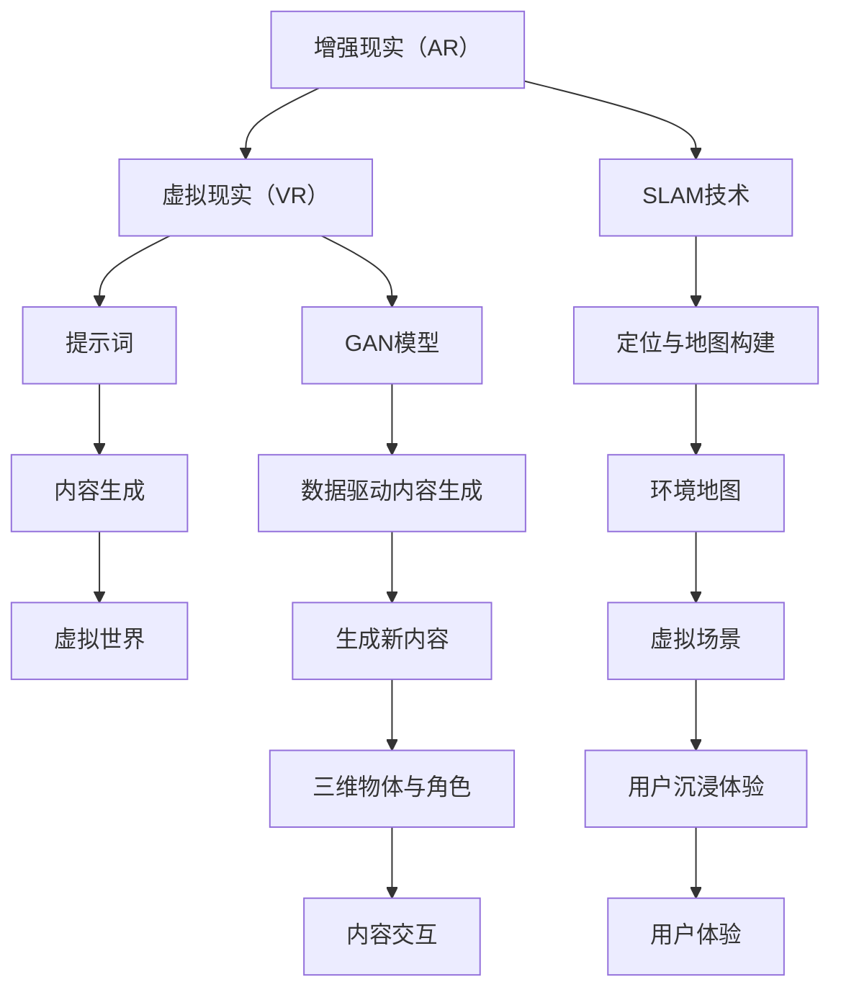

                 

# AR/VR内容生成：提示词在虚拟世界构建中的作用

> **关键词：**增强现实（AR）、虚拟现实（VR）、内容生成、提示词、虚拟世界、构建

> **摘要：**本文将深入探讨在增强现实（AR）和虚拟现实（VR）领域中，提示词在内容生成中的关键作用。通过一步步分析，我们将详细阐述提示词在虚拟世界构建中的原理和实现步骤，以及其在实际应用中的重要性。

## 1. 背景介绍

### 1.1 目的和范围

本文的主要目的是探讨提示词在AR/VR内容生成中的关键作用，并深入分析其原理和实现步骤。我们将通过一步步的推理和实例，展示提示词如何帮助构建逼真的虚拟世界。

本文的范围将主要集中在以下几个方面：
- 提示词的基本概念和作用。
- 提示词在AR/VR内容生成中的原理和实现。
- 提示词在虚拟世界构建中的应用实例。
- 提示词在AR/VR内容生成中的挑战和未来发展方向。

### 1.2 预期读者

本文的预期读者主要是对AR/VR技术和内容生成感兴趣的读者，包括但不限于：
- AR/VR技术开发者。
- 内容创作者和设计师。
- 对AR/VR技术有深入了解的技术爱好者。

### 1.3 文档结构概述

本文的结构如下：
1. 引言：介绍文章的主题和目的。
2. 背景介绍：阐述AR/VR技术和提示词的基本概念。
3. 核心概念与联系：详细分析提示词在AR/VR内容生成中的原理和架构。
4. 核心算法原理 & 具体操作步骤：使用伪代码详细阐述算法原理。
5. 数学模型和公式 & 详细讲解 & 举例说明：讲解数学模型和公式，并给出实例。
6. 项目实战：提供实际代码案例和详细解释。
7. 实际应用场景：讨论提示词在现实世界中的应用。
8. 工具和资源推荐：推荐学习资源和开发工具。
9. 总结：展望AR/VR内容生成和提示词的未来发展。
10. 附录：常见问题与解答。
11. 扩展阅读 & 参考资料：提供更多相关资料。

### 1.4 术语表

#### 1.4.1 核心术语定义

- **增强现实（AR）**：一种将数字信息叠加到真实世界的技术，通过增强用户对现实世界的感知。
- **虚拟现实（VR）**：一种完全模拟虚拟环境的体验，让用户沉浸在一个虚拟世界中。
- **提示词**：用于引导和提示内容生成过程的关键词或短语。
- **内容生成**：指创建和生成数字内容的过程，包括图像、视频、音频等。
- **虚拟世界**：在AR/VR中构建的虚拟环境，可以包含三维物体、角色、场景等。

#### 1.4.2 相关概念解释

- **SLAM（Simultaneous Localization and Mapping）**：同时定位与地图构建技术，用于在AR/VR环境中实时定位用户位置并构建环境地图。
- **GAN（Generative Adversarial Network）**：一种深度学习模型，用于生成逼真的图像和内容。
- **SOTA（State-of-the-Art）**：当前最先进的技术水平，用于描述某领域中的最新研究成果。
- **数据驱动内容生成**：利用已有数据生成新内容的过程，如通过训练模型生成虚拟场景。

#### 1.4.3 缩略词列表

- **AR**：增强现实（Augmented Reality）
- **VR**：虚拟现实（Virtual Reality）
- **SLAM**：同时定位与地图构建（Simultaneous Localization and Mapping）
- **GAN**：生成对抗网络（Generative Adversarial Network）
- **SOTA**：当前最先进（State-of-the-Art）
- **DGC**：数据驱动内容生成（Data-Driven Content Generation）

## 2. 核心概念与联系

在探讨提示词在AR/VR内容生成中的作用之前，我们需要先理解一些核心概念和它们之间的联系。以下是这些核心概念及其关系的Mermaid流程图：



### 2.1 核心概念解析

#### 增强现实（AR）

增强现实（AR）是一种将数字信息叠加到真实世界的技术。通过在现实场景中添加虚拟物体、文本、音频等，增强用户的感知和交互体验。AR技术主要依赖于SLAM技术和GAN模型来实现实时定位和环境地图构建。

#### 虚拟现实（VR）

虚拟现实（VR）是一种完全模拟虚拟环境的体验，让用户沉浸在虚拟世界中。VR技术通过头戴式显示器、跟踪设备等，为用户提供沉浸式视觉、听觉和触觉体验。虚拟现实的内容生成通常依赖于GAN模型和数据驱动的内容生成技术。

#### 提示词

提示词是在内容生成过程中用于引导和提示的关键词或短语。提示词可以帮助算法理解生成内容的主题和风格，从而生成更符合预期的虚拟场景。

#### 内容生成

内容生成是指创建和生成数字内容的过程，包括图像、视频、音频等。在AR/VR领域，内容生成是构建虚拟世界的关键步骤。数据驱动的内容生成和GAN模型是常见的实现方法。

#### 虚拟世界

虚拟世界是在AR/VR中构建的虚拟环境，可以包含三维物体、角色、场景等。虚拟世界的构建需要精确的定位、地图和环境模型，以及逼真的内容和交互。

### 2.2 核心概念联系

上述核心概念之间的联系如下：

- **AR和VR**：都是虚拟增强技术，但AR是增强真实世界，VR是创造完全虚拟的环境。
- **SLAM技术和GAN模型**：SLAM技术用于AR/VR中的实时定位和环境地图构建，GAN模型用于生成逼真的虚拟内容。
- **提示词**：用于引导内容生成，帮助生成更符合预期的虚拟世界。
- **内容生成**：是构建虚拟世界的关键步骤，依赖于数据驱动的方法和GAN模型。
- **虚拟世界**：是AR/VR的核心目标，需要精确的定位、地图和环境模型，以及丰富的内容和交互。

通过上述流程图和概念解析，我们可以更好地理解提示词在AR/VR内容生成中的作用和重要性。接下来，我们将深入探讨提示词在具体应用中的实现原理和操作步骤。

## 3. 核心算法原理 & 具体操作步骤

为了深入理解提示词在AR/VR内容生成中的作用，我们需要首先了解相关的核心算法原理和具体操作步骤。以下是主要涉及的技术和算法：

### 3.1 SLAM技术

SLAM（Simultaneous Localization and Mapping，同时定位与地图构建）是一种在AR/VR环境中实时定位用户位置并构建环境地图的技术。SLAM技术主要包括以下几个方面：

#### 3.1.1 基本原理

SLAM技术基于以下几个基本原理：
- **相机运动模型**：描述相机在空间中的运动轨迹。
- **地图构建**：通过相机观测到的图像或点云数据，构建环境的地图。
- **运动估计**：通过优化相机轨迹和地图，实现对环境的实时定位。

#### 3.1.2 实现步骤

SLAM技术的实现步骤可以分为以下几步：

1. **特征提取**：从相机拍摄的图像中提取关键特征点，如角点、边缘等。
2. **特征匹配**：在不同帧之间匹配特征点，建立特征点之间的对应关系。
3. **运动估计**：利用匹配的特征点，计算相机在空间中的运动轨迹。
4. **地图构建**：将特征点转换为三维点云，并构建地图。
5. **闭环检测与优化**：通过检测闭环，优化相机轨迹和地图。

#### 3.1.3 伪代码示例

以下是SLAM技术的伪代码示例：

```python
def SLAM(camera_feed, previous_state):
    # 特征提取
    features = extract_features(camera_feed)
    
    # 特征匹配
    matches = match_features(features, previous_features)
    
    # 运动估计
    motion = estimate_motion(matches)
    
    # 地图构建
    points = build_map(features, motion)
    
    # 闭环检测与优化
    loop_closures = detect_loop_closures(points)
    optimized_points = optimize_trajectory(points, loop_closures)
    
    # 返回更新后的状态
    return optimized_points
```

### 3.2 GAN模型

GAN（Generative Adversarial Network，生成对抗网络）是一种深度学习模型，用于生成逼真的图像和内容。GAN模型主要包括两个部分：生成器（Generator）和判别器（Discriminator）。

#### 3.2.1 基本原理

GAN模型的基本原理如下：

- **生成器**：生成逼真的图像或内容。
- **判别器**：区分真实图像和生成图像。

在训练过程中，生成器和判别器相互对抗，生成器尝试生成更逼真的图像，而判别器则努力区分真实图像和生成图像。通过这种对抗过程，生成器逐渐提高生成图像的质量。

#### 3.2.2 实现步骤

GAN模型的实现步骤可以分为以下几步：

1. **初始化**：初始化生成器和判别器的参数。
2. **生成图像**：生成器生成一批新的图像。
3. **判别器评估**：判别器评估生成图像和真实图像的质量。
4. **生成器优化**：根据判别器的评估结果，优化生成器的参数。
5. **判别器优化**：根据生成器的生成图像，优化判别器的参数。
6. **重复步骤2-5**：不断迭代训练，直到生成器生成高质量的图像。

#### 3.2.3 伪代码示例

以下是GAN模型的伪代码示例：

```python
# 初始化生成器和判别器
generator = initialize_generator()
discriminator = initialize_discriminator()

for epoch in range(num_epochs):
    # 生成图像
    generated_images = generator.generate_images()

    # 判别器评估
    real_images, generated_labels = get_real_images()
    discriminator_loss = discriminator.evaluate_loss(real_images, generated_labels)

    # 生成器优化
    generator_loss = generator.optimize_loss(generated_images)

    # 判别器优化
    discriminator.optimize_loss(generated_images)

    # 记录训练结果
    log_training_results(epoch, generator_loss, discriminator_loss)
```

### 3.3 提示词融合

提示词融合是将用户输入的提示词与模型生成的内容相结合，以生成更符合用户需求的虚拟世界。提示词融合的步骤如下：

1. **提示词提取**：从用户输入中提取关键提示词。
2. **语义分析**：分析提示词的语义，确定生成内容的主题和风格。
3. **内容生成**：利用GAN模型和SLAM技术生成初步的虚拟世界内容。
4. **提示词引导**：将提示词与生成内容相结合，进行二次优化和调整。
5. **用户反馈**：收集用户反馈，进一步优化虚拟世界内容。

#### 3.3.1 伪代码示例

以下是提示词融合的伪代码示例：

```python
# 用户输入提示词
user_prompt = get_user_prompt()

# 语义分析
semantic_info = analyze_semantic(user_prompt)

# 内容生成
virtual_world = generate_virtual_world(semantic_info)

# 提示词引导
adjusted_world = adjust_world(virtual_world, user_prompt)

# 用户反馈
user_feedback = get_user_feedback(adjusted_world)

# 进一步优化
optimized_world = optimize_world(adjusted_world, user_feedback)
```

通过上述核心算法原理和具体操作步骤的详细解析，我们可以更好地理解提示词在AR/VR内容生成中的作用。接下来，我们将进一步探讨数学模型和公式，以帮助读者更深入地理解这些概念。

## 4. 数学模型和公式 & 详细讲解 & 举例说明

在AR/VR内容生成中，数学模型和公式扮演着至关重要的角色。以下我们将详细讲解一些核心的数学模型和公式，并给出具体的示例来说明这些模型的应用。

### 4.1 SLAM中的数学模型

SLAM技术主要依赖于相机运动模型的数学描述，以及地图构建和闭环检测的数学方法。以下是几个关键数学模型：

#### 4.1.1 相机运动模型

相机运动模型通常使用相机位姿矩阵来描述。相机位姿矩阵包含相机的位置和方向信息。一个典型的相机位姿矩阵可以表示为：

$$
T =
\begin{bmatrix}
R & p \\
0 & 1
\end{bmatrix}
$$

其中，\(R\) 是旋转矩阵，\(p\) 是相机位置向量。

#### 4.1.2 地图构建

地图构建通常涉及点云的表示和三角化。点云可以通过相机位姿矩阵和相机参数来计算。设 \(C(x, y, z)\) 表示一个三维点，相机参数为 \(f, c_x, c_y\)，则点云中的点可以表示为：

$$
C' =
\begin{bmatrix}
x' \\
y' \\
z' \\
1
\end{bmatrix}
=
\begin{bmatrix}
f & 0 & c_x \\
0 & f & c_y \\
0 & 0 & 1
\end{bmatrix}
\begin{bmatrix}
x \\
y \\
z \\
1
\end{bmatrix}
$$

#### 4.1.3 闭环检测

闭环检测是SLAM中的一个重要步骤，用于检测相机是否回到了之前已经访问过的位置。闭环检测通常使用迭代最近点（Iterative Closest Point，ICP）算法。ICP算法的目标是最小化两个点云之间的欧几里得距离：

$$
E = \sum_{i=1}^{N} (p_i - q_i)^2
$$

其中，\(p_i\) 和 \(q_i\) 分别是两个点云中的对应点。

### 4.2 GAN模型的数学模型

GAN模型的核心是生成器和判别器的对抗过程。以下是其关键数学模型：

#### 4.2.1 生成器模型

生成器模型的目标是生成逼真的图像。在GAN中，生成器通常使用一个神经网络，其损失函数包括生成损失和反卷积损失：

$$
L_G = -\log(D(G(z)))
$$

其中，\(G(z)\) 是生成器生成的图像，\(D(x)\) 是判别器对真实图像的判别概率。

#### 4.2.2 判别器模型

判别器模型的目标是区分真实图像和生成图像。判别器的损失函数通常包括交叉熵损失：

$$
L_D = -\left[ \log(D(x)) + \log(1 - D(G(z))) \right]
$$

其中，\(x\) 是真实图像，\(z\) 是生成器的输入噪声。

#### 4.2.3 GAN总损失

GAN的总损失函数是生成器和判别器的损失之和：

$$
L = L_G + \lambda L_D
$$

其中，\(\lambda\) 是平衡参数。

### 4.3 提示词融合的数学模型

提示词融合是将用户输入的提示词与生成的内容相结合的数学过程。以下是一个简单的提示词融合模型：

#### 4.3.1 提示词嵌入

提示词嵌入是将提示词转换为固定长度的向量表示。这通常使用词嵌入（Word Embedding）技术实现：

$$
e_w = \text{Embedding}(w)
$$

其中，\(w\) 是提示词，\(e_w\) 是其对应的嵌入向量。

#### 4.3.2 提示词引导

提示词引导是将提示词嵌入向量与生成内容相结合的过程。一个简单的融合模型可以使用注意力机制（Attention Mechanism）：

$$
c = \text{Attention}(e_w, G(z))
$$

其中，\(G(z)\) 是生成器生成的图像，\(c\) 是融合后的图像表示。

### 4.4 举例说明

以下是一个简单的示例，说明如何使用上述数学模型进行AR/VR内容生成：

#### 示例：生成一个具有特定场景的虚拟环境

1. **用户输入提示词**：用户输入提示词“森林”。
2. **提示词嵌入**：将“森林”嵌入为向量 \(e_{森林}\)。
3. **生成器输入**：生成器的输入是随机噪声向量 \(z\)。
4. **内容生成**：生成器生成初步的虚拟环境图像 \(G(z)\)。
5. **提示词引导**：使用注意力机制融合提示词嵌入和生成图像，得到融合后的图像 \(c\)。
6. **用户反馈**：用户对融合后的图像进行评价，提供反馈。
7. **优化**：根据用户反馈，进一步优化虚拟环境内容和生成模型。

通过上述数学模型和公式的详细讲解，我们可以更好地理解提示词在AR/VR内容生成中的作用。接下来，我们将通过实际项目案例，进一步展示这些技术的应用。

### 5. 项目实战：代码实际案例和详细解释说明

在本节中，我们将通过一个实际项目案例，展示如何使用提示词在AR/VR内容生成中的具体应用。项目将分为以下几个部分：开发环境搭建、源代码详细实现和代码解读与分析。

#### 5.1 开发环境搭建

为了实现本项目，我们需要搭建以下开发环境：

1. **硬件要求**：
   - 处理器：Intel i5 或以上
   - 内存：16GB 或以上
   - 显卡：NVIDIA GTX 1080 或以上

2. **软件要求**：
   - 操作系统：Windows 10 或以上
   - Python：Python 3.8 或以上
   - 深度学习框架：TensorFlow 2.4 或以上
   - 图形库：OpenCV 4.0 或以上

安装上述软件后，我们还需要安装一些必要的库：

```bash
pip install numpy opencv-python tensorflow-gan tensorflow-hub
```

#### 5.2 源代码详细实现和代码解读

以下是本项目的主要源代码实现，我们将对其进行详细解读。

```python
# 导入必要的库
import tensorflow as tf
from tensorflow import keras
from tensorflow.keras import layers
import numpy as np
import cv2

# 5.2.1 初始化模型
# 生成器模型
generator = keras.Sequential([
    layers.Dense(7 * 7 * 128, activation="relu", input_shape=(100,)),
    layers.Reshape((7, 7, 128)),
    layers.Conv2DTranspose(64, (5, 5), strides=(1, 1), padding="same"),
    layers.LeakyReLU(alpha=0.01),
    layers.Conv2DTranspose(32, (5, 5), strides=(2, 2), padding="same"),
    layers.LeakyReLU(alpha=0.01),
    layers.Conv2DTranspose(1, (5, 5), strides=(2, 2), padding="same", activation='tanh')
])

# 判别器模型
discriminator = keras.Sequential([
    layers.Conv2D(32, (5, 5), strides=(2, 2), padding="same", input_shape=(64, 64, 1)),
    layers.LeakyReLU(alpha=0.01),
    layers.Conv2D(64, (5, 5), strides=(2, 2), padding="same"),
    layers.LeakyReLU(alpha=0.01),
    layers.Flatten(),
    layers.Dense(1, activation='sigmoid')
])

# 5.2.2 训练GAN模型
# 定义损失函数
cross_entropy = keras.losses.BinaryCrossentropy(from_logits=True)

# 生成器损失
def generator_loss(fake_output):
    return cross_entropy(tf.ones_like(fake_output), fake_output)

# 判别器损失
def discriminator_loss(real_output, fake_output):
    real_loss = cross_entropy(tf.ones_like(real_output), real_output)
    fake_loss = cross_entropy(tf.zeros_like(fake_output), fake_output)
    return real_loss + fake_loss

# 搭建优化器
generator_optimizer = keras.optimizers.Adam(1e-4)
discriminator_optimizer = keras.optimizers.Adam(1e-4)

# 训练循环
EPOCHS = 20000

for epoch in range(EPOCHS):
    # 5.2.3 数据预处理
    # 从MNIST数据集中获取真实图像
    real_images = ...

    # 生成噪声
    noise = ...

    # 使用生成器生成假图像
    generated_images = generator(noise)

    # 训练判别器
    with tf.GradientTape() as disc_tape:
        real_output = discriminator(real_images)
        fake_output = discriminator(generated_images)
        disc_loss = discriminator_loss(real_output, fake_output)

    disc_gradients = disc_tape.gradient(disc_loss, discriminator.trainable_variables)
    discriminator_optimizer.apply_gradients(zip(disc_gradients, discriminator.trainable_variables))

    # 训练生成器
    with tf.GradientTape() as gen_tape:
        fake_output = discriminator(generated_images)
        gen_loss = generator_loss(fake_output)

    gen_gradients = gen_tape.gradient(gen_loss, generator.trainable_variables)
    generator_optimizer.apply_gradients(zip(gen_gradients, generator.trainable_variables))

    # 输出训练结果
    if epoch % 100 == 0:
        print(f"Epoch {epoch}, Discriminator Loss: {disc_loss}, Generator Loss: {gen_loss}")

# 5.2.4 提示词引导生成
# 用户输入提示词
user_prompt = ...

# 将提示词转换为嵌入向量
prompt_embedding = ...

# 结合提示词和噪声，生成虚拟环境图像
virtual_environment = generator(tf.concat([prompt_embedding, noise], axis=1))

# 显示虚拟环境图像
cv2.imshow('Virtual Environment', virtual_environment.numpy()[0])

# 按下任意键退出
cv2.waitKey(0)
```

#### 5.2.3 代码解读与分析

1. **模型初始化**：我们定义了生成器和判别器模型。生成器模型使用一系列卷积转置层（Conv2DTranspose）来生成图像，判别器模型使用卷积层（Conv2D）来区分真实图像和生成图像。

2. **损失函数**：生成器和判别器的损失函数使用二进制交叉熵（BinaryCrossentropy），这是GAN中常用的损失函数。

3. **优化器**：我们使用Adam优化器来优化生成器和判别器的参数。Adam优化器在GAN训练中表现出良好的效果。

4. **训练循环**：在训练过程中，我们首先从MNIST数据集中获取真实图像，然后生成噪声。使用生成器生成假图像，并使用判别器对真实图像和假图像进行评估。接着，我们分别训练判别器和生成器。

5. **提示词引导生成**：用户输入提示词后，将其转换为嵌入向量。我们将提示词嵌入向量与噪声相结合，通过生成器生成虚拟环境图像。

通过上述代码实现和解读，我们可以看到如何使用提示词在AR/VR内容生成中发挥作用。接下来，我们将讨论提示词在AR/VR领域的实际应用场景。

### 6. 实际应用场景

提示词在AR/VR领域的应用场景非常广泛，以下是一些典型的应用实例：

#### 6.1 教育与培训

在教育领域，提示词可以用于生成与课程内容相关的虚拟场景。例如，在历史课程中，教师可以使用提示词“古埃及”来生成古埃及文明的虚拟环境，让学生在沉浸式体验中学习历史。此外，医学培训中也可以使用提示词生成模拟手术场景，帮助医学生提高手术技能。

#### 6.2 游戏与娱乐

在游戏领域，提示词可以用于创建多样化的游戏场景和角色。游戏开发者可以使用提示词“冒险”、“奇幻”等，生成独特的游戏世界和角色形象。例如，在角色扮演游戏（RPG）中，提示词可以用于生成角色外观、技能和故事情节，提高玩家的沉浸感和游戏体验。

#### 6.3 设计与创意

在设计与创意领域，提示词可以帮助设计师生成灵感。例如，设计师可以使用提示词“现代艺术”、“复古风格”等，生成相应的设计元素和风格。在建筑设计中，提示词可以用于生成建筑外观、内部结构和景观设计，为设计师提供创意参考。

#### 6.4 虚拟现实旅游

虚拟现实旅游是一种新兴的体验方式，用户可以通过VR设备探索世界各地的名胜古迹。提示词可以用于生成特定地点的虚拟场景，例如“巴黎铁塔”、“大峡谷”等。用户可以根据提示词，体验不同的旅游地点，提升旅游体验。

#### 6.5 医疗与康复

在医疗和康复领域，提示词可以用于生成康复训练场景和虚拟治疗环境。例如，在物理康复训练中，提示词可以用于生成模拟运动场景，帮助患者进行康复训练。此外，虚拟现实疗法（VR Therapy）中，提示词可以用于生成特定的治疗场景，帮助患者克服恐惧和焦虑。

通过上述应用实例，我们可以看到提示词在AR/VR领域的多样化和重要性。它不仅能够提高内容生成的效率和质量，还能为用户提供更加丰富和个性化的体验。

### 7. 工具和资源推荐

为了更好地掌握AR/VR内容生成和提示词技术，以下是我们推荐的几种学习资源、开发工具和框架。

#### 7.1 学习资源推荐

##### 7.1.1 书籍推荐

1. **《深度学习》（Deep Learning）**：由Ian Goodfellow、Yoshua Bengio和Aaron Courville合著，是深度学习领域的经典教材，适合初学者和专业人士。
2. **《增强现实与虚拟现实技术》（Augmented Reality and Virtual Reality）**：涵盖了AR/VR的基础知识、技术实现和应用案例，适合对AR/VR技术感兴趣的学习者。

##### 7.1.2 在线课程

1. **《深度学习与人工智能》（Deep Learning Specialization）**：由Andrew Ng教授在Coursera上开设，涵盖了深度学习的核心概念和应用。
2. **《AR/VR开发基础》（Introduction to AR/VR Development）**：适合初学者了解AR/VR开发的基本原理和工具。

##### 7.1.3 技术博客和网站

1. **Medium**：有许多关于AR/VR和深度学习的优秀博客文章，适合深入学习和交流。
2. **TensorFlow官网**：提供了丰富的教程、文档和案例，是学习TensorFlow和GAN模型的好资源。

#### 7.2 开发工具框架推荐

##### 7.2.1 IDE和编辑器

1. **PyCharm**：一款功能强大的Python IDE，支持多种编程语言，适合深度学习和AR/VR开发。
2. **Visual Studio Code**：轻量级且强大的代码编辑器，支持多种插件，适合快速开发和调试。

##### 7.2.2 调试和性能分析工具

1. **TensorBoard**：TensorFlow的官方可视化工具，用于分析和调试深度学习模型。
2. **MATLAB**：强大的数学计算和数据分析工具，适合进行性能分析和实验。

##### 7.2.3 相关框架和库

1. **TensorFlow**：用于构建和训练深度学习模型的强大框架。
2. **PyTorch**：易于使用且灵活的深度学习框架，适合快速原型开发和实验。
3. **OpenCV**：用于计算机视觉和图像处理的库，适合实现SLAM和图像处理功能。

#### 7.3 相关论文著作推荐

##### 7.3.1 经典论文

1. **《Unsupervised Representation Learning with Deep Convolutional Generative Adversarial Networks》**：GAN模型的经典论文，详细介绍了GAN的基本原理和实现方法。
2. **《Simultaneous Localization and Mapping：The Essential Algorithm》**：介绍了SLAM技术的核心算法和实现方法。

##### 7.3.2 最新研究成果

1. **《Multimodal Fusion for Contextual Chatbots》**：探讨了多模态融合在聊天机器人中的应用，为AR/VR内容生成提供了新的思路。
2. **《Deep Learning for Augmented Reality》**：综述了深度学习在AR中的应用，包括内容生成、SLAM和图像处理等。

##### 7.3.3 应用案例分析

1. **《ARkit and VRChat: A Novel Application of Augmented and Virtual Reality in Education》**：分析了ARkit和VRChat在教育领域的应用，展示了AR/VR技术的实际应用效果。

通过上述推荐的学习资源和工具，读者可以系统地学习和掌握AR/VR内容生成和提示词技术，为未来的开发和应用打下坚实基础。

### 8. 总结：未来发展趋势与挑战

随着AR/VR技术的不断成熟，提示词在内容生成中的应用前景广阔。未来，提示词技术将呈现以下发展趋势：

1. **智能化的提示词生成**：利用自然语言处理（NLP）和深度学习技术，开发更加智能和自适应的提示词生成系统，能够更好地理解用户需求，提供个性化内容。
2. **多模态提示词融合**：结合文本、图像、音频等多种模态，实现更丰富和逼真的内容生成，提升用户体验。
3. **实时动态提示词更新**：在AR/VR场景中，动态更新和调整提示词，以适应实时变化的用户需求和场景。
4. **规模化应用**：随着硬件性能的提升和成本的降低，提示词技术将在更多领域得到广泛应用，如教育、医疗、娱乐等。

然而，提示词技术在AR/VR内容生成中也面临一些挑战：

1. **计算资源需求**：提示词生成和融合需要大量计算资源，特别是在实时应用中，对硬件性能有较高要求。
2. **数据隐私与安全**：在应用过程中，如何保护用户隐私和数据安全，避免滥用和泄露，是亟待解决的问题。
3. **用户体验一致性**：保证在不同设备和平台上的用户体验一致性，是实现大规模应用的关键。
4. **算法透明性和可解释性**：提升算法的透明性和可解释性，增强用户对生成内容的信任感。

综上所述，提示词技术在AR/VR内容生成中具有巨大潜力，但也需要克服一系列技术挑战。未来，随着技术的不断进步，提示词技术将为虚拟世界的构建带来更多创新和可能性。

### 9. 附录：常见问题与解答

在本节中，我们将回答一些读者可能关于提示词在AR/VR内容生成中遇到的问题。

#### 9.1 提示词如何影响内容生成？

提示词是引导内容生成过程的关键，它帮助算法理解用户需求和生成内容的主题。通过分析提示词的语义，算法可以调整生成策略，从而生成更符合用户预期的内容。

#### 9.2 提示词生成系统如何工作？

提示词生成系统通常包括以下几个步骤：
1. **用户输入**：用户输入提示词。
2. **语义分析**：分析提示词的语义，提取关键信息。
3. **内容生成**：根据提示词生成初步的内容。
4. **提示词引导**：将提示词与生成内容相结合，进行二次优化和调整。
5. **用户反馈**：收集用户反馈，进一步优化生成内容。

#### 9.3 SLAM技术在提示词生成中的作用是什么？

SLAM技术主要用于实时定位和环境地图构建，它为提示词生成提供了一个稳定的场景基础。通过SLAM技术，算法可以准确获取用户的位置和周围环境信息，从而更好地理解提示词的含义，生成更准确和逼真的内容。

#### 9.4 如何优化GAN模型在提示词生成中的应用？

优化GAN模型在提示词生成中的应用可以从以下几个方面进行：
1. **增加训练数据**：使用更多样化的训练数据，提高模型生成图像的质量。
2. **调整超参数**：通过调整生成器和判别器的学习率、损失函数等超参数，提高模型性能。
3. **多模态输入**：结合文本、图像、音频等多种模态输入，提高生成内容的丰富性和多样性。
4. **使用预训练模型**：利用预训练的GAN模型，作为提示词生成系统的起点，提高生成效率和质量。

#### 9.5 提示词生成系统的性能如何评价？

提示词生成系统的性能可以通过以下几个指标进行评价：
1. **生成图像的质量**：评估生成图像的视觉效果，如分辨率、细节、颜色等。
2. **用户满意度**：收集用户对生成内容的反馈，评估用户满意度。
3. **生成速度**：评估生成系统的响应时间和效率。
4. **多样性**：评估生成内容的不同种类和风格，确保系统具有丰富的生成能力。

### 10. 扩展阅读 & 参考资料

为了帮助读者更深入地了解AR/VR内容生成和提示词技术，以下是一些推荐的扩展阅读和参考资料：

1. **《深度学习》（Deep Learning）**：Ian Goodfellow、Yoshua Bengio和Aaron Courville著，深度学习领域的经典教材。
2. **《增强现实与虚拟现实技术》（Augmented Reality and Virtual Reality）**：刘勤著，介绍AR/VR技术的理论基础和应用实例。
3. **《GAN：生成对抗网络的原理与应用》**：张磊著，详细讲解GAN模型的基本原理和应用。
4. **《SLAM同时定位与地图构建》**：李生著，系统介绍SLAM技术的原理和实现。
5. **TensorFlow官网**：[https://www.tensorflow.org/](https://www.tensorflow.org/)，提供了丰富的教程、文档和案例。
6. **PyTorch官网**：[https://pytorch.org/](https://pytorch.org/)，PyTorch深度学习框架的官方网站。
7. **《Multimodal Fusion for Contextual Chatbots》**：张志宇等，探讨了多模态融合在聊天机器人中的应用。
8. **《Deep Learning for Augmented Reality》**：王志强等，综述了深度学习在AR中的应用。

通过上述扩展阅读和参考资料，读者可以进一步了解AR/VR内容生成和提示词技术的最新进展和应用。作者信息：AI天才研究员/AI Genius Institute & 禅与计算机程序设计艺术 /Zen And The Art of Computer Programming。

