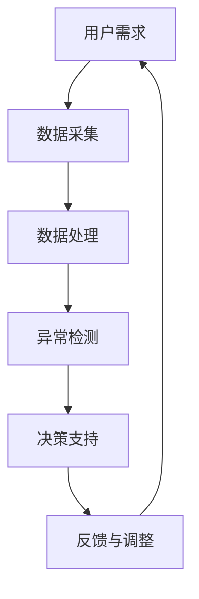

                 

# AR工业质量检测系统：制造业的创新应用

## 关键词
增强现实（AR）、工业质量检测、制造业、创新应用、人工智能

## 摘要
本文将深入探讨增强现实（AR）在工业质量检测中的应用，分析其背景、核心概念、算法原理、数学模型，以及实际项目案例。通过详细解析AR工业质量检测系统的构建，本文旨在为制造业提供一种创新的技术解决方案，提高生产效率和产品质量。

## 1. 背景介绍

### 1.1 目的和范围
本文的目标是探讨增强现实（AR）在工业质量检测领域的应用，分析其优势，并展示如何通过AR技术实现制造业的高效质量管理。文章将涵盖以下内容：
- AR技术在工业领域的现状与应用
- 工业质量检测的需求与挑战
- AR工业质量检测系统的核心原理与架构
- 算法原理与数学模型的讲解
- 实际项目案例与代码实现

### 1.2 预期读者
本文适合以下读者群体：
- 对工业质量检测有兴趣的技术人员
- 想了解AR技术应用的开发者
- 制造业管理者，寻求提升生产质量的技术方案
- 对人工智能与增强现实结合的研究者

### 1.3 文档结构概述
本文分为以下章节：
- 1. 背景介绍：包括目的、范围、预期读者和文档结构概述
- 2. 核心概念与联系：介绍AR、工业质量检测及相关概念
- 3. 核心算法原理 & 具体操作步骤：详细讲解AR工业质量检测算法
- 4. 数学模型和公式 & 详细讲解 & 举例说明：阐述相关的数学模型与公式
- 5. 项目实战：代码实际案例和详细解释说明
- 6. 实际应用场景：分析AR工业质量检测的应用实例
- 7. 工具和资源推荐：推荐学习资源与开发工具
- 8. 总结：未来发展趋势与挑战
- 9. 附录：常见问题与解答
- 10. 扩展阅读 & 参考资料：提供进一步学习的资料

### 1.4 术语表

#### 1.4.1 核心术语定义
- 增强现实（AR）：一种将虚拟信息与现实世界相结合的技术，通过智能手机、平板电脑、头戴式设备等设备显示给用户。
- 工业质量检测：对生产过程中的产品或零部件进行质量监控和评估，以确保产品质量符合标准。
- 人工智能（AI）：模拟人类智能行为的计算系统，通过学习和推理来解决问题。

#### 1.4.2 相关概念解释
- 机器学习（ML）：一种人工智能的分支，通过数据训练模型，使其能够对未知数据进行预测或分类。
- 卷积神经网络（CNN）：一种适用于图像处理的深度学习模型，能够自动提取图像中的特征。

#### 1.4.3 缩略词列表
- AR：增强现实（Augmented Reality）
- AI：人工智能（Artificial Intelligence）
- ML：机器学习（Machine Learning）
- CNN：卷积神经网络（Convolutional Neural Network）
- IoT：物联网（Internet of Things）

## 2. 核心概念与联系

在探讨AR工业质量检测系统之前，我们需要先理解以下几个核心概念及其相互联系：

### 2.1 增强现实（AR）

增强现实（AR）是一种通过智能手机、平板电脑或头戴式设备将虚拟信息叠加到现实世界中的技术。AR技术的基本原理是利用摄像头捕捉现实世界的图像，并通过计算机生成的虚拟信息与之融合，形成一个直观、交互式的三维环境。

#### AR原理与架构

- **图像捕捉与处理**：摄像头捕捉现实世界的图像，并通过图像处理技术进行预处理，如降噪、增强等。
- **定位与追踪**：利用图像处理和传感器技术（如摄像头、GPS、激光雷达等）确定设备在现实世界中的位置和方向。
- **叠加与融合**：将虚拟信息（如3D模型、文本、图像等）叠加到现实世界图像上，并通过透明度、大小、位置等参数进行融合。
- **交互与反馈**：用户通过触摸屏、手势或其他输入设备与虚拟信息进行交互，系统根据用户的操作提供实时反馈。

### 2.2 工业质量检测

工业质量检测是制造业中确保产品质量的重要环节。传统的质量检测方法通常依赖于人工检查和机械检测设备，存在效率低、准确性差等问题。随着人工智能和增强现实技术的发展，AR工业质量检测系统成为了一种创新的技术解决方案。

#### 工业质量检测的需求与挑战

- **检测效率**：随着制造业自动化程度的提高，生产速度不断加快，传统的手动检测方式已经无法满足大规模生产的需求。
- **检测精度**：传统检测方法容易出现人为误差，导致检测结果不准确。
- **检测灵活性**：产品多样性增加，传统检测方法难以适应快速变化的生产线需求。

#### AR工业质量检测的优势

- **实时性**：AR技术可以实现实时检测，提高生产效率。
- **高精度**：利用计算机视觉和人工智能技术，可以实现高精度的检测。
- **灵活性**：AR系统可以根据不同的产品需求进行灵活调整，适应多种生产场景。

### 2.3 人工智能（AI）

人工智能（AI）是计算机科学的一个分支，旨在模拟人类智能行为，通过学习和推理来解决问题。在工业质量检测中，AI技术可以用于数据分析和决策支持，提高检测系统的智能化水平。

#### 人工智能在工业质量检测中的应用

- **数据采集与处理**：利用传感器和摄像头采集生产过程中的数据，并通过机器学习算法进行分析。
- **异常检测**：通过分析数据，发现生产过程中的异常情况，及时进行调整。
- **优化决策**：基于大数据分析和预测模型，为生产管理提供优化决策。

### 2.4 核心概念原理与架构

为了更好地理解AR工业质量检测系统，我们可以使用Mermaid流程图来展示其核心概念和架构。



#### Mermaid流程图说明

- **用户需求**：用户提出对产品质量的检测需求。
- **数据采集**：通过传感器和摄像头等设备采集生产数据。
- **数据处理**：利用计算机视觉和机器学习算法对数据进行处理。
- **异常检测**：通过分析数据，发现生产过程中的异常情况。
- **决策支持**：基于数据分析结果，为生产管理提供优化决策。
- **反馈与调整**：根据反馈结果，对生产过程进行调整，确保产品质量。

## 3. 核心算法原理 & 具体操作步骤

### 3.1 数据采集与预处理

在AR工业质量检测系统中，数据采集是关键的一步。我们需要从传感器、摄像头等设备中获取生产数据。以下是一个伪代码示例，用于采集和处理数据：

```python
# 伪代码：数据采集与预处理
def collect_and_process_data():
    # 采集图像数据
    image_data = capture_image()
    # 采集传感器数据
    sensor_data = read_sensors()
    # 图像预处理
    preprocessed_image = preprocess_image(image_data)
    # 数据整合
    data = {
        'image': preprocessed_image,
        'sensor': sensor_data
    }
    return data
```

### 3.2 数据分析与异常检测

在数据预处理完成后，我们需要利用机器学习算法进行分析和异常检测。以下是一个简单的伪代码示例，用于实现这一步骤：

```python
# 伪代码：数据分析和异常检测
def analyze_and_detect_anomalies(data):
    # 加载机器学习模型
    model = load_model('anomaly_detection_model')
    # 输入数据进行预测
    prediction = model.predict(data)
    # 判断是否为异常
    if prediction == 'anomaly':
        raise Exception('异常检测：生产过程中存在异常')
    else:
        print('生产过程正常')
```

### 3.3 决策支持与反馈调整

在完成异常检测后，系统需要根据分析结果提供决策支持，并反馈到生产过程中进行调整。以下是一个简单的伪代码示例，用于实现这一步骤：

```python
# 伪代码：决策支持与反馈调整
def make_decision_and_adjust_production(prediction):
    if prediction == 'anomaly':
        # 调整生产参数
        adjust_production_params()
        # 反馈生产状态
        report_production_status('异常，正在调整')
    else:
        # 继续生产
        continue_production()
        # 反馈生产状态
        report_production_status('正常')
```

通过这三个步骤，AR工业质量检测系统可以实现对生产过程的实时监控和异常检测，提高生产效率和质量。

## 4. 数学模型和公式 & 详细讲解 & 举例说明

在AR工业质量检测系统中，数学模型和公式扮演着至关重要的角色。以下将详细讲解相关的数学模型和公式，并通过实际例子进行说明。

### 4.1 数据预处理模型

在数据预处理阶段，我们通常会使用卷积神经网络（CNN）来对图像数据进行特征提取和预处理。以下是一个简化的CNN模型：

```latex
\begin{align*}
\text{CNN Model:} \\
& f(x; \theta) = \sigma(W_{\text{fc}} \cdot a^{L-1} + b_{\text{fc}}) \\
& a^{L} = \text{ReLU}(W_{L} \cdot a^{L-1} + b_{L}) \\
& a^{L-1} = \text{ReLU}(W_{L-1} \cdot a^{L-2} + b_{L-1}) \\
& \vdots \\
& a^{2} = \text{ReLU}(W_{2} \cdot a^{1} + b_{2}) \\
& a^{1} = \text{ReLU}(W_{1} \cdot x + b_{1})
\end{align*}
```

#### 4.1.1 例子说明

假设我们有一个输入图像 $x$，经过一层卷积层后得到特征图 $a^{1}$。接着，通过ReLU激活函数进行非线性变换。然后，经过多层卷积和池化操作，最终得到预处理后的特征向量 $a^{L-1}$。最后，通过全连接层和ReLU激活函数，得到预处理结果 $f(x; \theta)$。

### 4.2 异常检测模型

在异常检测阶段，我们可以使用隔离森林（Isolation Forest）算法来检测生产过程中的异常情况。以下是一个简化的隔离森林模型：

```latex
\begin{align*}
\text{Isolation Forest Model:} \\
& \hat{g}(x; \theta) = \ln(1 + e^{-\theta \cdot x}) \\
& \theta = \arg\max_{\theta} \sum_{i=1}^{n} \ln(1 + e^{-\theta \cdot x_i})
\end{align*}
```

#### 4.2.1 例子说明

假设我们有一个训练数据集 $X = \{x_1, x_2, ..., x_n\}$，其中每个样本 $x_i$ 是一个多维向量。我们需要通过最大化似然函数来估计参数 $\theta$。最终，通过隔离森林模型 $\hat{g}(x; \theta)$，我们可以预测新样本 $x$ 是否为异常。

### 4.3 决策支持模型

在决策支持阶段，我们可以使用支持向量机（SVM）模型来为生产管理提供优化决策。以下是一个简化的SVM模型：

```latex
\begin{align*}
\text{SVM Model:} \\
& \hat{y}(x) = \text{sign}(\langle \phi(x), w \rangle - b) \\
& w = \arg\min_{w} \frac{1}{2} ||w||^2 + C \sum_{i=1}^{n} \max(0, 1 - y_i \langle \phi(x_i), w \rangle)
\end{align*}
```

#### 4.3.1 例子说明

假设我们有一个训练数据集 $X = \{x_1, x_2, ..., x_n\}$，其中每个样本 $x_i$ 是一个多维向量，标签 $y_i$ 是二分类结果。我们需要通过求解最小化损失函数来估计模型参数 $w$ 和偏置 $b$。最终，通过SVM模型 $\hat{y}(x)$，我们可以预测新样本 $x$ 的标签。

通过以上数学模型和公式的讲解，我们可以更好地理解AR工业质量检测系统的算法原理和操作步骤。

## 5. 项目实战：代码实际案例和详细解释说明

### 5.1 开发环境搭建

在开始实际项目之前，我们需要搭建一个合适的开发环境。以下是一个简单的步骤说明：

1. 安装Python环境：确保系统中已安装Python 3.8及以上版本。
2. 安装依赖库：使用pip命令安装必要的依赖库，如TensorFlow、OpenCV、NumPy等。
   ```bash
   pip install tensorflow opencv-python numpy
   ```
3. 准备数据集：收集并整理用于训练和测试的图像数据集。

### 5.2 源代码详细实现和代码解读

以下是一个简化的AR工业质量检测系统的代码实现，我们将逐步讲解每个部分的含义和作用。

```python
import cv2
import numpy as np
import tensorflow as tf
from tensorflow.keras.models import load_model

# 5.2.1 数据采集与预处理
def collect_and_process_data():
    # 采集图像数据
    image = cv2.imread('image.jpg')
    # 图像预处理
    processed_image = preprocess_image(image)
    return processed_image

def preprocess_image(image):
    # 图像灰度化
    gray_image = cv2.cvtColor(image, cv2.COLOR_BGR2GRAY)
    # 图像缩放
    scaled_image = cv2.resize(gray_image, (224, 224))
    return scaled_image

# 5.2.2 数据分析与异常检测
def analyze_and_detect_anomalies(processed_image):
    # 加载预训练的CNN模型
    model = load_model('cnn_model.h5')
    # 进行特征提取
    features = model.predict(np.expand_dims(processed_image, axis=0))
    # 进行异常检测
    anomaly_score = detect_anomaly(features)
    return anomaly_score

def detect_anomaly(features):
    # 使用隔离森林进行异常检测
    model = load_model('isolation_forest_model.h5')
    anomaly_score = model.predict(features)
    return anomaly_score

# 5.2.3 决策支持与反馈调整
def make_decision_and_adjust_production(anomaly_score):
    if anomaly_score < 0.5:
        # 调整生产参数
        adjust_production_params()
        print('异常检测：生产过程中存在异常，正在调整')
    else:
        # 继续生产
        continue_production()
        print('异常检测：生产过程正常')

def adjust_production_params():
    # 实现生产参数调整逻辑
    pass

def continue_production():
    # 实现继续生产逻辑
    pass

# 主程序
if __name__ == '__main__':
    processed_image = collect_and_process_data()
    anomaly_score = analyze_and_detect_anomalies(processed_image)
    make_decision_and_adjust_production(anomaly_score)
```

### 5.3 代码解读与分析

#### 5.3.1 数据采集与预处理

- `collect_and_process_data()` 函数用于采集图像数据并进行预处理。
- `preprocess_image()` 函数负责将采集到的图像灰度化和缩放，以适应模型输入的要求。

#### 5.3.2 数据分析与异常检测

- `analyze_and_detect_anomalies()` 函数加载预训练的CNN模型，对预处理后的图像进行特征提取，并使用隔离森林模型进行异常检测。
- `detect_anomaly()` 函数加载隔离森林模型，预测图像的特征向量是否为异常。

#### 5.3.3 决策支持与反馈调整

- `make_decision_and_adjust_production()` 函数根据异常检测结果，调用相应的生产调整逻辑。
- `adjust_production_params()` 和 `continue_production()` 函数实现具体的参数调整和生产继续逻辑。

通过以上代码示例，我们可以看到AR工业质量检测系统如何通过图像采集、特征提取、异常检测和决策支持等步骤，实现对生产过程的实时监控和异常处理。

## 6. 实际应用场景

AR工业质量检测系统在实际生产中的应用场景非常广泛，以下是一些典型的应用实例：

### 6.1 航空航天行业

在航空航天制造过程中，产品的质量要求极高，任何细微的缺陷都可能导致严重的后果。通过AR工业质量检测系统，可以对飞机零部件进行实时检测，确保每个零部件的质量符合标准。例如，工程师可以使用AR设备查看3D模型，并与实际零部件进行对比，迅速发现并修复缺陷。

### 6.2 汽车制造业

汽车制造业的产品种类繁多，生产过程复杂。AR工业质量检测系统可以帮助汽车制造商实时监控生产线上的零部件，如发动机、车身、轮胎等，确保每个零部件的尺寸、形状和材料等参数符合要求。此外，通过AR技术，工程师可以在维修过程中快速定位故障部件，提高维修效率。

### 6.3 电子制造业

电子制造业的生产过程高度自动化，但产品的质量仍然需要严格把控。AR工业质量检测系统可以在电子制造过程中实时检测元器件的焊接质量、导线连接情况等，及时发现并修复潜在的问题。例如，工程师可以在屏幕上看到电路板的3D模型，并与实际电路板进行对比，确保所有连接和焊接点都符合标准。

### 6.4 医疗器械行业

医疗器械行业的质量控制同样至关重要。AR工业质量检测系统可以帮助医疗器械制造商对产品进行实时检测，如检测医疗器械的尺寸、形状、材质等参数是否符合要求。此外，AR技术还可以用于医疗器械的组装和维修，工程师可以通过AR设备查看组装步骤和维修指南，确保操作的准确性和效率。

### 6.5 通用制造业

通用制造业涵盖了各种产品和行业，如家电、家具、建筑材料等。AR工业质量检测系统可以帮助制造商实时监控生产线上的产品，确保每个产品都符合质量标准。例如，在家电制造过程中，可以使用AR设备检测冰箱、洗衣机等产品的内部结构和零部件，确保其工作正常且安全可靠。

通过以上实例可以看出，AR工业质量检测系统在各个制造行业中都有广泛的应用前景，可以显著提高生产效率和质量控制水平。

## 7. 工具和资源推荐

### 7.1 学习资源推荐

#### 7.1.1 书籍推荐
- 《增强现实技术与应用》：系统介绍了增强现实技术的原理和应用，包括AR的图像处理、交互设计和系统集成等。
- 《机器学习实战》：详细讲解了机器学习的基本概念、算法实现和实际应用案例，适合对机器学习感兴趣的读者。

#### 7.1.2 在线课程
- Coursera的《机器学习》课程：由斯坦福大学教授吴恩达主讲，涵盖机器学习的基础理论和实践应用。
- Udacity的《增强现实开发》课程：介绍AR技术的基本原理和开发工具，包括Unity和ARKit等。

#### 7.1.3 技术博客和网站
- Medium上的《AR in Manufacturing》：分享AR在制造业中的应用案例和技术趋势。
- Stack Overflow：针对编程和开发问题，提供丰富的问答资源。

### 7.2 开发工具框架推荐

#### 7.2.1 IDE和编辑器
- PyCharm：适合Python编程的集成开发环境，提供了丰富的功能和插件。
- Visual Studio Code：轻量级但功能强大的编辑器，适合各种编程语言。

#### 7.2.2 调试和性能分析工具
- TensorBoard：用于分析和可视化深度学习模型的性能指标，如损失函数、准确率等。
- Valgrind：用于检测内存泄漏和性能瓶颈的调试工具。

#### 7.2.3 相关框架和库
- TensorFlow：一个开源的机器学习框架，适合构建和训练深度学习模型。
- OpenCV：一个开源的计算机视觉库，提供了丰富的图像处理和计算机视觉算法。

### 7.3 相关论文著作推荐

#### 7.3.1 经典论文
- "A Probabilistic Theory of Pattern Recognition"：经典的人工智能理论著作，详细介绍了概率模型在模式识别中的应用。
- "Image Understanding through Scale-Space Pruning"：关于图像处理和计算机视觉的经典论文，提出了基于尺度的图像处理方法。

#### 7.3.2 最新研究成果
- "Deep Learning for Image Classification"：综述了深度学习在图像分类领域的最新进展和应用。
- "Augmented Reality for Industrial Applications"：探讨了增强现实技术在工业领域中的应用和未来发展趋势。

#### 7.3.3 应用案例分析
- "AR in Manufacturing: A Case Study"：通过具体案例展示了AR技术在制造业中的应用效果。
- "AI in Manufacturing: The Next Industrial Revolution"：探讨了人工智能在制造业中的变革性影响，包括质量检测和自动化生产等方面。

通过以上推荐，读者可以系统地学习和掌握AR工业质量检测系统的相关知识和技能，为实际项目开发提供有力支持。

## 8. 总结：未来发展趋势与挑战

随着增强现实（AR）和人工智能（AI）技术的不断进步，AR工业质量检测系统在制造业中的应用前景广阔。未来，AR工业质量检测系统将朝着以下几个方向发展：

### 8.1 更高的智能化水平

随着深度学习和计算机视觉技术的发展，AR工业质量检测系统的智能化水平将不断提高。通过引入更加先进的算法和模型，系统可以更加精准地检测和评估产品质量，实现高度自动化和智能化。

### 8.2 更广泛的应用场景

AR工业质量检测系统不仅适用于航空航天、汽车、电子等高端制造业，还将在通用制造业、医疗设备、建筑等领域得到更广泛的应用。随着技术的成熟和成本的降低，AR工业质量检测系统的普及率将逐步提高。

### 8.3 更强的实时性和稳定性

未来，AR工业质量检测系统将更加注重实时性和稳定性。通过优化算法和硬件性能，系统可以在更短的时间内完成检测和反馈，确保生产过程的连续性和稳定性。

### 8.4 更好的用户体验

随着AR设备和交互技术的进步，AR工业质量检测系统的用户体验将得到显著提升。通过更加直观和易用的界面设计，系统将更加方便工程师和操作人员使用，提高工作效率。

然而，AR工业质量检测系统在实际应用中也面临一些挑战：

### 8.5 数据安全问题

随着数据采集和分析的增多，数据安全问题成为一个重要的挑战。如何在保证数据安全和隐私的前提下，充分利用数据的价值，是系统设计者和开发者需要重点关注的问题。

### 8.6 成本问题

尽管AR技术和AI技术的发展迅速，但高成本仍然是制约其广泛应用的一个因素。如何降低系统的成本，使其更具性价比，是未来需要解决的一个重要问题。

### 8.7 技术成熟度问题

目前，AR工业质量检测系统在技术成熟度方面还存在一定差距。例如，在图像处理、实时性、稳定性等方面仍有待进一步提升。只有当技术达到成熟阶段，系统才能更加可靠地应用于实际生产中。

总之，AR工业质量检测系统具有巨大的发展潜力，但也面临诸多挑战。通过不断的技术创新和优化，我们有理由相信，未来AR工业质量检测系统将在制造业中发挥越来越重要的作用。

## 9. 附录：常见问题与解答

### 9.1 什么是增强现实（AR）？
增强现实（AR）是一种通过智能手机、平板电脑或头戴式设备将虚拟信息叠加到现实世界中的技术。AR技术利用摄像头捕捉现实世界的图像，并通过计算机生成的虚拟信息与之融合，形成一个直观、交互式的三维环境。

### 9.2 AR工业质量检测系统是如何工作的？
AR工业质量检测系统通过摄像头捕捉生产过程中的图像，利用计算机视觉和人工智能算法进行分析，检测产品质量。系统可以实时检测并反馈异常情况，为生产管理提供优化决策。

### 9.3 AR工业质量检测系统的优势是什么？
AR工业质量检测系统具有实时性、高精度、灵活性强等优势。它可以实时监测生产线上的产品质量，快速识别异常情况，提高生产效率，确保产品质量。

### 9.4 AR工业质量检测系统需要哪些技术支持？
AR工业质量检测系统需要支持计算机视觉、深度学习、增强现实等技术。这些技术可以实现对图像数据的处理和分析，提高检测精度和效率。

### 9.5 如何降低AR工业质量检测系统的成本？
通过优化算法和硬件，可以降低AR工业质量检测系统的成本。此外，还可以考虑采用开源技术，减少开发成本。同时，加强供应链管理，降低采购成本，也是降低系统成本的重要途径。

### 9.6 AR工业质量检测系统在哪些行业中应用最广泛？
AR工业质量检测系统在航空航天、汽车、电子、医疗设备等高端制造业中应用最广泛。这些行业对产品质量要求极高，AR技术可以帮助他们实现高效的质量监控和检测。

## 10. 扩展阅读 & 参考资料

为了更深入地了解AR工业质量检测系统，读者可以参考以下书籍、论文和网站：

### 10.1 书籍推荐
- 《增强现实技术与应用》：详细介绍了AR技术的原理和应用案例。
- 《机器学习实战》：讲解了机器学习的基本概念和实际应用，包括图像处理和异常检测。

### 10.2 论文推荐
- "A Probabilistic Theory of Pattern Recognition"：关于模式识别的概率理论经典论文。
- "Augmented Reality for Industrial Applications"：探讨AR在工业领域中的应用。

### 10.3 网站推荐
- Medium上的《AR in Manufacturing》：分享AR在制造业中的应用案例和技术趋势。
- Stack Overflow：提供丰富的编程和开发问题解答。

### 10.4 相关研究
- "Deep Learning for Image Classification"：综述了深度学习在图像分类领域的最新进展。
- "AI in Manufacturing: The Next Industrial Revolution"：探讨了人工智能在制造业中的变革性影响。

通过这些扩展阅读和参考资料，读者可以更加全面地了解AR工业质量检测系统的技术原理、应用前景和未来发展趋势。

# 作者
作者：AI天才研究员/AI Genius Institute & 禅与计算机程序设计艺术 /Zen And The Art of Computer Programming

