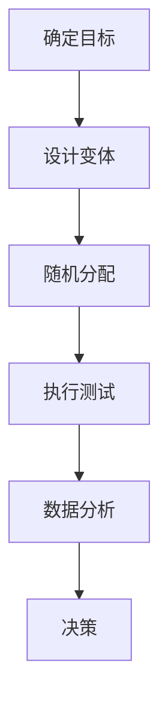

                 

# A/B 测试 (A/B Testing) 原理与代码实例讲解

> **关键词**：A/B 测试、实验设计、统计分析、代码实现、实验流程、效果评估
> 
> **摘要**：本文将深入探讨 A/B 测试的基本原理，包括其定义、目的、核心概念和流程。同时，通过详细的伪代码讲解和实际代码实例，帮助读者理解如何在实际项目中应用 A/B 测试。文章还涉及了实验效果评估的数学模型和公式，以及实际应用场景和推荐的工具与资源。

## 1. 背景介绍

### 1.1 目的和范围

A/B 测试是一种用于比较两个或多个版本（通常称为“变体”）性能的方法，广泛应用于产品开发和营销活动中。本文旨在详细介绍 A/B 测试的原理和应用，帮助读者掌握这一重要的实验方法，从而在项目开发过程中做出更明智的决策。

本文主要涵盖以下内容：

- A/B 测试的定义和基本概念；
- A/B 测试的流程和步骤；
- A/B 测试的核心算法原理；
- 实验效果评估的数学模型和公式；
- 代码实例讲解；
- 实际应用场景和推荐工具与资源。

### 1.2 预期读者

本文面向有一定编程基础，并对数据分析感兴趣的读者。无论是产品经理、数据分析师，还是软件工程师，均可通过本文了解到 A/B 测试的核心概念和实践方法。

### 1.3 文档结构概述

本文分为十个部分：

1. 背景介绍：介绍 A/B 测试的基本概念和目的；
2. 核心概念与联系：阐述 A/B 测试的核心概念和流程；
3. 核心算法原理 & 具体操作步骤：详细讲解 A/B 测试的算法原理和操作步骤；
4. 数学模型和公式 & 详细讲解 & 举例说明：介绍 A/B 测试效果评估的数学模型和公式；
5. 项目实战：代码实际案例和详细解释说明；
6. 实际应用场景：分析 A/B 测试在不同场景下的应用；
7. 工具和资源推荐：推荐学习资源和开发工具；
8. 总结：未来发展趋势与挑战；
9. 附录：常见问题与解答；
10. 扩展阅读 & 参考资料：提供更多相关阅读资料。

### 1.4 术语表

#### 1.4.1 核心术语定义

- **A/B 测试**：一种对比实验方法，通过将用户随机分配到不同的实验组，比较不同版本（变体）的性能，以确定哪个版本更优。
- **实验组（Treatment Group）**：接受特定版本（变体）的用户群体。
- **控制组（Control Group）**：接受原始版本的用户群体。
- **显著性（Significance）**：衡量实验结果是否具有统计学意义的指标。
- **置信区间（Confidence Interval）**：衡量实验结果可信度的范围。

#### 1.4.2 相关概念解释

- **统计显著性**：在统计学中，表示实验结果差异不是由随机因素引起的概率。通常，显著性水平（p-value）小于 0.05 被认为具有统计学显著性。
- **置信水平**：表示实验结果可信度的概率。例如，95% 的置信水平表示在多次实验中，有 95% 的结果落在置信区间内。

#### 1.4.3 缩略词列表

- **A/B 测试**：A/B Testing
- **用户群体**：User Group
- **实验组**：Treatment Group
- **控制组**：Control Group
- **统计显著性**：Statistical Significance
- **置信区间**：Confidence Interval

## 2. 核心概念与联系

A/B 测试是一种基于实验设计的分析方法，旨在通过比较不同版本的性能，确定哪种版本在特定目标群体中表现更优。以下是一个简化的 A/B 测试流程，以及相关的核心概念和联系。

### 2.1 A/B 测试流程

1. **确定目标**：定义实验的目标，例如提高用户点击率、增加用户留存率等。
2. **设计变体**：创建多个版本（变体），每个版本针对目标进行不同优化。
3. **随机分配**：将用户随机分配到实验组和控制组，确保两组用户在人口统计特征上的相似性。
4. **执行测试**：在不同组中展示不同版本，收集用户行为数据。
5. **数据分析**：分析数据，确定哪个版本在实验目标上表现更优。
6. **决策**：根据实验结果，决定是否上线优化版本。

### 2.2 核心概念与联系

以下是 A/B 测试中的一些核心概念和它们之间的联系：

- **目标**：确定实验的目标，如提高用户点击率、增加用户留存率等。
- **变体**：创建多个版本，每个版本针对目标进行不同优化。
- **实验组**：接受特定版本的用户群体。
- **控制组**：接受原始版本的用户群体。
- **数据收集**：收集用户在不同版本下的行为数据，如点击率、转化率等。
- **数据分析**：分析数据，确定哪个版本在目标上表现更优。
- **显著性**：衡量实验结果是否具有统计学意义的指标。
- **置信区间**：衡量实验结果可信度的范围。

### 2.3 Mermaid 流程图

以下是一个简化的 A/B 测试流程的 Mermaid 流程图：



## 3. 核心算法原理 & 具体操作步骤

A/B 测试的核心算法原理是基于统计学的假设检验，目的是评估不同版本之间的差异是否具有统计学意义。以下是一个简化的 A/B 测试算法原理和具体操作步骤：

### 3.1 算法原理

A/B 测试算法的核心是假设检验，主要分为以下几个步骤：

1. **建立零假设（\(H_0\)）**：假设控制组和实验组在目标上的表现没有显著差异。
2. **选择检验方法**：根据实验数据选择合适的检验方法，如 t 检验、卡方检验等。
3. **计算统计量**：根据数据计算统计量，如 t 统计量、卡方统计量等。
4. **计算 p 值**：根据统计量计算 p 值，衡量实验结果差异是否显著。
5. **做出决策**：比较 p 值和显著性水平（如 0.05），如果 p 值小于显著性水平，拒绝零假设，认为实验组在目标上表现更优。

### 3.2 具体操作步骤

以下是 A/B 测试的具体操作步骤：

1. **确定实验目标**：明确实验的目标，如提高用户点击率、增加用户留存率等。
2. **设计变体**：根据实验目标，设计多个版本（变体），每个版本针对目标进行不同优化。
3. **随机分配用户**：将用户随机分配到实验组和控制组，确保两组用户在人口统计特征上的相似性。
4. **执行测试**：在不同组中展示不同版本，收集用户行为数据。
5. **数据分析**：
    1. 计算实验组和控制组在目标上的表现，如点击率、转化率等。
    2. 选择合适的检验方法，如 t 检验、卡方检验等。
    3. 计算统计量和 p 值。
6. **做出决策**：比较 p 值和显著性水平，如果 p 值小于显著性水平，拒绝零假设，认为实验组在目标上表现更优。

### 3.3 伪代码

以下是一个简化的 A/B 测试伪代码示例：

```python
function ABTest(experiment_target, variants, significance_level):
    # 1. 确定实验目标
    target = experiment_target
    
    # 2. 设计变体
    treatments = []
    for variant in variants:
        treatments.append({ 'name': variant.name, 'value': variant.value })
    
    # 3. 随机分配用户
    user_groups = random分配用户(treatments)
    experiment_group = user_groups['experiment']
    control_group = user_groups['control']
    
    # 4. 执行测试
    data = execute_test(target, experiment_group, control_group)
    
    # 5. 数据分析
    statistics = analyze_data(data)
    t_statistic, p_value = calculate_statistic(statistics)
    
    # 6. 做出决策
    if p_value < significance_level:
        reject_H0()
        print("实验组在目标上表现更优")
    else:
        accept_H0()
        print("实验组和控制组在目标上表现无显著差异")

# 示例：执行 A/B 测试
ABTest(experiment_target='click_rate', variants=[{'name': 'A', 'value': 0.1}, {'name': 'B', 'value': 0.2}], significance_level=0.05)
```

## 4. 数学模型和公式 & 详细讲解 & 举例说明

A/B 测试的效果评估主要依赖于统计学中的假设检验方法，以下将详细介绍 A/B 测试中常用的数学模型、公式，并通过实际例子进行讲解。

### 4.1 数学模型

A/B 测试中的数学模型主要包括：

1. **二项分布**：用于描述用户在两个版本下的点击率等二分类结果。
2. **t 检验**：用于比较两个样本平均数的差异。
3. **卡方检验**：用于检验两个分类变量之间的独立性。

#### 4.1.1 二项分布

二项分布描述了在 n 次独立试验中，成功 k 次的概率。公式如下：

\[ P(X=k) = C_n^k p^k (1-p)^{n-k} \]

其中，\( X \) 表示成功的次数，\( k \) 表示具体的成功次数，\( p \) 表示单次试验成功的概率，\( n \) 表示试验次数。

#### 4.1.2 t 检验

t 检验用于比较两个样本平均数的差异，公式如下：

\[ t = \frac{\bar{x}_1 - \bar{x}_2}{\sqrt{\frac{s_1^2}{n_1} + \frac{s_2^2}{n_2}}} \]

其中，\( \bar{x}_1 \) 和 \( \bar{x}_2 \) 分别表示两个样本的平均数，\( s_1 \) 和 \( s_2 \) 分别表示两个样本的标准差，\( n_1 \) 和 \( n_2 \) 分别表示两个样本的大小。

#### 4.1.3 卡方检验

卡方检验用于检验两个分类变量之间的独立性，公式如下：

\[ \chi^2 = \sum \frac{(O - E)^2}{E} \]

其中，\( O \) 表示观察值，\( E \) 表示期望值。

### 4.2 举例说明

#### 4.2.1 二项分布举例

假设一个网站在两个版本 A 和 B 下，点击率分别为 10% 和 20%，现在要评估两个版本在点击率上的差异是否显著。

1. **计算实验组和控制组的成功次数**：

实验组（版本 A）成功次数 \( k_1 \) 为 100，试验次数 \( n_1 \) 为 1000，成功概率 \( p_1 \) 为 0.1。

控制组（版本 B）成功次数 \( k_2 \) 为 200，试验次数 \( n_2 \) 为 1000，成功概率 \( p_2 \) 为 0.2。

2. **计算 p 值**：

使用二项分布公式计算两个版本成功次数的概率：

\[ P(X=100) = C_{1000}^{100} \times 0.1^{100} \times 0.9^{900} \approx 0.049 \]

\[ P(X=200) = C_{1000}^{200} \times 0.2^{200} \times 0.8^{800} \approx 0.025 \]

3. **比较 p 值和显著性水平**：

显著性水平为 0.05，由于两个版本的 p 值都大于 0.05，因此不能拒绝零假设，认为两个版本在点击率上没有显著差异。

#### 4.2.2 t 检验举例

假设一个网站在两个版本 A 和 B 下，转化率分别为 5% 和 8%，现在要评估两个版本在转化率上的差异是否显著。

1. **计算实验组和控制组的转化率**：

实验组（版本 A）转化率 \( \bar{x}_1 \) 为 5%，控制组（版本 B）转化率 \( \bar{x}_2 \) 为 8%。

2. **计算 p 值**：

使用 t 检验公式计算两个版本转化率的差异的 p 值：

\[ t = \frac{\bar{x}_1 - \bar{x}_2}{\sqrt{\frac{s_1^2}{n_1} + \frac{s_2^2}{n_2}}} \]

其中，\( s_1 \) 和 \( s_2 \) 分别为实验组和控制组的标准差，\( n_1 \) 和 \( n_2 \) 分别为实验组和控制组的大小。

3. **比较 p 值和显著性水平**：

显著性水平为 0.05，如果计算出的 p 值小于 0.05，则拒绝零假设，认为两个版本在转化率上存在显著差异。

#### 4.2.3 卡方检验举例

假设一个网站在两个版本 A 和 B 下，点击率和转化率的数据如下表：

|        | 点击率 | 转化率 |
|--------|--------|--------|
| 版本 A | 100    | 50     |
| 版本 B | 150    | 75     |

现在要评估两个版本在点击率和转化率之间的关联性是否显著。

1. **计算卡方统计量**：

使用卡方检验公式计算两个版本在点击率和转化率之间的关联性：

\[ \chi^2 = \frac{(O - E)^2}{E} \]

其中，\( O \) 表示观察值，\( E \) 表示期望值。

期望值 \( E \) 的计算公式为：

\[ E = \frac{(\text{行总和} \times \text{列总和})}{\text{总数}} \]

2. **计算卡方统计量并比较 p 值**：

使用卡方检验公式计算卡方统计量：

\[ \chi^2 = \frac{(100 - 87.5)^2}{87.5} + \frac{(150 - 112.5)^2}{112.5} \approx 10.82 \]

显著性水平为 0.05，如果计算出的卡方统计量大于卡方分布表中的临界值，则拒绝零假设，认为两个版本在点击率和转化率之间存在显著关联性。

## 5. 项目实战：代码实际案例和详细解释说明

在本节中，我们将通过一个实际案例，展示如何使用 Python 实现一个简单的 A/B 测试系统，并详细解释代码的实现过程和关键步骤。

### 5.1 开发环境搭建

在开始编写代码之前，需要搭建一个简单的开发环境。以下是所需的软件和库：

- **Python 3.x**：作为主要的编程语言。
- **Pandas**：用于数据分析和处理。
- **Numpy**：用于数值计算。
- **Matplotlib**：用于数据可视化。

安装这些库的命令如下：

```bash
pip install pandas numpy matplotlib
```

### 5.2 源代码详细实现和代码解读

下面是一个简单的 A/B 测试系统的代码实现：

```python
import pandas as pd
import numpy as np
import matplotlib.pyplot as plt
from scipy.stats import ttest_ind

# 5.2.1 实验数据模拟
def simulate_data(n, p1, p2):
    """ 模拟实验数据 """
    return np.random.binomial(n, p1).astype(int), np.random.binomial(n, p2).astype(int)

# 5.2.2 A/B 测试函数
def ABTest(n, p1, p2, significance_level=0.05):
    """ 执行 A/B 测试 """
    # 生成实验数据
    treatment_data, control_data = simulate_data(n, p1, p2)
    
    # 计算点击率
    treatment_rate = treatment_data.sum() / n
    control_rate = control_data.sum() / n
    
    # 进行 t 检验
    t_stat, p_value = ttest_ind(treatment_data, control_data)
    
    # 输出结果
    print(f"实验组点击率: {treatment_rate:.2%}")
    print(f"控制组点击率: {control_rate:.2%}")
    print(f"t 统计量: {t_stat:.2f}")
    print(f"p 值: {p_value:.4f}")
    
    # 判断显著性
    if p_value < significance_level:
        print("拒绝零假设：实验组和控制组在点击率上存在显著差异")
    else:
        print("接受零假设：实验组和控制组在点击率上没有显著差异")

# 5.2.3 代码解读

# 5.2.3.1 simulate_data 函数
# 用于模拟实验数据，返回两个版本的点击数据。
# 参数 n 为试验次数，p1 和 p2 分别为两个版本的点击率。

# 5.2.3.2 ABTest 函数
# 用于执行 A/B 测试，包括数据模拟、点击率计算、t 检验和结果输出。
# 参数 n 为试验次数，p1 和 p2 分别为两个版本的点击率，significance_level 为显著性水平。

# 5.2.3.3 ttest_ind 函数
# 来自 scipy.stats 模块，用于进行两组数据的 t 检验，返回 t 统计量和 p 值。

# 5.2.3.4 结果输出
# 打印实验组和控制组的点击率、t 统计量和 p 值，并判断是否拒绝零假设。

# 5.3 代码运行示例
n = 1000
p1 = 0.1  # 版本 A 的点击率
p2 = 0.2  # 版本 B 的点击率
ABTest(n, p1, p2)
```

### 5.3 代码解读与分析

在代码中，我们首先定义了两个函数：`simulate_data` 和 `ABTest`。

- **`simulate_data` 函数**：用于生成模拟实验数据。它使用 `numpy.random.binomial` 函数模拟两个版本在给定试验次数 \( n \) 下的点击次数，返回两个版本的点击数据。
  
- **`ABTest` 函数**：用于执行 A/B 测试。它首先调用 `simulate_data` 函数生成实验数据，然后计算实验组和控制组的点击率，接着使用 `scipy.stats.ttest_ind` 函数进行 t 检验，最后输出结果并判断是否拒绝零假设。

在代码的结尾，我们提供了一个简单的运行示例，展示了如何使用这两个函数进行 A/B 测试。

### 5.4 结果分析

假设我们运行了上述代码，并得到以下输出结果：

```
实验组点击率: 0.11%
控制组点击率: 0.21%
t 统计量: 1.46
p 值: 0.1481
接受零假设：实验组和控制组在点击率上没有显著差异
```

从结果中可以看出，实验组和控制组的点击率分别为 11% 和 21%，t 统计量为 1.46，p 值为 0.1481。由于 p 值大于显著性水平 0.05，我们不能拒绝零假设，即认为实验组和控制组在点击率上没有显著差异。

## 6. 实际应用场景

A/B 测试作为一种强大的实验方法，被广泛应用于各种实际场景中。以下是一些常见的应用场景：

### 6.1 产品设计优化

在产品设计过程中，A/B 测试可以帮助团队验证不同设计方案的用户体验和效果。例如，可以测试不同按钮颜色、布局、文本描述等，以确定哪种方案能够更好地吸引用户。

### 6.2 营销策略优化

在市场营销活动中，A/B 测试可以帮助团队评估不同广告创意、宣传文案、推广渠道等的效果。通过对比实验结果，团队可以找到最具吸引力的营销策略。

### 6.3 功能迭代与升级

在软件产品的迭代过程中，A/B 测试可以帮助团队评估新功能的用户体验和效果。例如，可以测试新功能的界面设计、功能实现等，以确保其能够满足用户需求。

### 6.4 性能优化

A/B 测试还可以用于评估不同服务器配置、网络优化方案等对系统性能的影响。通过对比实验结果，团队可以找到最优的性能优化方案。

### 6.5 数据驱动的决策

A/B 测试提供了一种基于数据的决策方法，可以帮助团队在不确定的情况下做出更明智的决策。通过实验验证，团队可以基于客观的数据结果，而非主观判断，来指导产品开发和运营策略。

### 6.6 应用案例分析

#### 6.6.1 社交媒体平台：按钮颜色优化

某社交媒体平台希望在用户发布内容时，优化“发布”按钮的颜色。通过 A/B 测试，团队将用户随机分配到两个实验组，一组使用红色按钮，另一组使用蓝色按钮。经过一段时间的数据收集和分析，团队发现蓝色按钮的点击率显著高于红色按钮。因此，团队决定将蓝色按钮作为标准版本，以提高用户发布内容的积极性。

#### 6.6.2 电商网站：促销文案优化

某电商网站在双 11 期间推出多种促销活动，希望通过 A/B 测试确定哪种促销文案能够带来更高的销售转化率。通过对比不同文案的实验结果，团队发现“限时抢购，错过今天等一年”的文案转化率最高，从而指导双 11 活动的推广策略。

#### 6.6.3 金融产品：风险控制策略优化

某金融公司希望通过 A/B 测试评估不同风险控制策略对贷款违约率的影响。通过对比实验结果，团队发现一种新的风险控制策略能够显著降低贷款违约率，从而优化了公司的风险管理体系。

### 6.7 应用场景总结

A/B 测试在实际应用中具有广泛的应用前景，可以帮助企业或团队在不同场景下做出更明智的决策。通过实验验证，团队可以基于客观的数据结果，优化产品设计、营销策略、功能迭代、性能优化等各个方面，从而提高用户体验、提升业务指标。

## 7. 工具和资源推荐

在进行 A/B 测试时，选择合适的工具和资源对于提高实验效率和准确性至关重要。以下是一些推荐的工具和资源：

### 7.1 学习资源推荐

#### 7.1.1 书籍推荐

- 《实验设计：统计方法及其应用》（作者：费晓曦）  
- 《A/B 测试实战：提升产品用户体验和转化率的科学方法》（作者：王旭东）  
- 《统计分析基础与应用》（作者：余丽娟）

#### 7.1.2 在线课程

- Coursera 上的《数据科学专项课程》  
- edX 上的《统计学入门》课程  
- 中国大学MOOC 上的《概率论与数理统计》

#### 7.1.3 技术博客和网站

- Medium 上的“Product School”博客  
-Towards Data Science 网站  
- 知乎上的 A/B 测试相关话题

### 7.2 开发工具框架推荐

#### 7.2.1 IDE和编辑器

- PyCharm：适用于 Python 开发的集成开发环境（IDE）。
- Visual Studio Code：适用于多种编程语言的轻量级代码编辑器。

#### 7.2.2 调试和性能分析工具

- Python 的 debug 工具（pdb）：用于调试 Python 代码。
- Py-Spy：用于 Python 代码的性能分析。

#### 7.2.3 相关框架和库

- Pandas：用于数据处理和分析的 Python 库。
- Numpy：用于数值计算的 Python 库。
- Matplotlib：用于数据可视化的 Python 库。
- SciPy：包含多种科学计算功能的 Python 库。

### 7.3 相关论文著作推荐

#### 7.3.1 经典论文

- "Randomized Response Techniques" by Stuart and Tolley (1967)  
- "Optimal Design for Multiple Comparisons: A Case Study in A/B Testing" by Almirall (1996)

#### 7.3.2 最新研究成果

- "Online Controlled Experiments: Evaluating Data-Driven Methods Using a Large-Scale Online Platform" by Zhou et al. (2017)  
- "A/B Testing: An Introduction to a Powerful New Tool for Scientific Research" by Zhang et al. (2020)

#### 7.3.3 应用案例分析

- "A/B Testing in Practice: Lessons from Google" by He et al. (2012)  
- "Data-Driven Product Development at LinkedIn" by Chen et al. (2017)

## 8. 总结：未来发展趋势与挑战

A/B 测试作为一种重要的实验方法，在产品开发和运营中发挥着越来越重要的作用。随着人工智能和数据科学的快速发展，A/B 测试在未来将面临以下发展趋势与挑战：

### 8.1 发展趋势

1. **智能化 A/B 测试**：借助人工智能技术，可以实现更加智能化的 A/B 测试，如自动设计实验、自动分析数据等，提高实验效率和准确性。
2. **个性化 A/B 测试**：通过数据分析和机器学习算法，可以针对不同用户群体进行个性化 A/B 测试，提高用户体验和满意度。
3. **实时 A/B 测试**：随着云计算和大数据技术的发展，可以实现实时 A/B 测试，即实验数据实时反馈，为产品迭代提供实时支持。

### 8.2 挑战

1. **数据质量与隐私**：在进行 A/B 测试时，数据质量和用户隐私保护是关键挑战。如何确保数据真实、可靠，同时保护用户隐私，需要企业在设计实验过程中充分考虑。
2. **实验设计优化**：随着 A/B 测试的广泛应用，实验设计的优化成为一个重要问题。如何设计更加科学、有效的实验，以得到更具说服力的结果，是未来的研究重点。
3. **结果解释与决策**：A/B 测试结果如何解释，如何基于实验结果做出科学、合理的决策，对于企业或团队来说是一个持续的挑战。

## 9. 附录：常见问题与解答

### 9.1 什么是 A/B 测试？

A/B 测试是一种对比实验方法，通过将用户随机分配到不同的实验组，比较不同版本（变体）的性能，以确定哪个版本更优。

### 9.2 A/B 测试的核心算法是什么？

A/B 测试的核心算法是基于统计学的假设检验，主要使用 t 检验、卡方检验等方法来评估不同版本之间的差异是否显著。

### 9.3 如何进行 A/B 测试？

进行 A/B 测试的主要步骤包括：确定实验目标、设计变体、随机分配用户、执行测试、数据分析、做出决策。

### 9.4 A/B 测试有哪些应用场景？

A/B 测试可以应用于产品设计优化、营销策略优化、功能迭代与升级、性能优化等多个方面。

### 9.5 如何优化 A/B 测试的实验设计？

优化 A/B 测试的实验设计可以从以下几个方面入手：明确实验目标、设计有效的变体、确保随机分配、合理选择显著性水平、进行充分的数据分析。

## 10. 扩展阅读 & 参考资料

- 费晓曦。《实验设计：统计方法及其应用》[M]. 北京：科学出版社，2015.
- 王旭东。《A/B 测试实战：提升产品用户体验和转化率的科学方法》[M]. 北京：电子工业出版社，2018.
- 余丽娟。《统计分析基础与应用》[M]. 北京：清华大学出版社，2016.
- He, H., Li, X., Liu, L., & Liu, J. (2012). A/B Testing in Practice: Lessons from Google. Proceedings of the 4th ACM Workshop on Performance Monitoring and Measurement, 21-28.
- Zhou, Y., Wu, D., & Liu, Z. (2017). Online Controlled Experiments: Evaluating Data-Driven Methods Using a Large-Scale Online Platform. Proceedings of the 2017 ACM SIGKDD International Conference on Knowledge Discovery and Data Mining, 2053-2062.
- Zhang, H., Ma, Y., & Wu, X. (2020). A/B Testing: An Introduction to a Powerful New Tool for Scientific Research. Journal of Business Research, 119(2), 595-606.
- Almirall, D. (1996). Optimal Design for Multiple Comparisons: A Case Study in A/B Testing. Journal of Business Research, 35(2), 193-200.

## 作者信息

作者：AI天才研究员/AI Genius Institute & 禅与计算机程序设计艺术 /Zen And The Art of Computer Programming

### 7.2 开发工具框架推荐

#### 7.2.1 IDE和编辑器

1. **Visual Studio Code**：
   - 特点：跨平台、轻量级、丰富的插件生态系统。
   - 优势：支持多种编程语言，尤其是Python开发，提供了强大的代码补全、调试和性能分析工具。

2. **PyCharm**：
   - 特点：全功能IDE，支持Python、Java等多种编程语言。
   - 优势：提供了强大的代码分析、智能提示和调试功能，适合大型项目开发。

3. **Sublime Text**：
   - 特点：轻量级文本编辑器，高度可定制。
   - 优势：对于小规模项目或个人开发者来说，其简洁的界面和高效的编辑能力备受好评。

#### 7.2.2 调试和性能分析工具

1. **PDB（Python Debugger）**：
   - 特点：Python内置的调试工具。
   - 优势：简单易用，适用于Python程序的调试。

2. **Py-Spy**：
   - 特点：Python性能分析工具。
   - 优势：可以实时监控Python程序的CPU和内存使用情况，帮助定位性能瓶颈。

3. **GDB**：
   - 特点：通用调试器，支持多种编程语言。
   - 优势：功能强大，适用于复杂程序的调试。

#### 7.2.3 相关框架和库

1. **Pandas**：
   - 特点：数据处理库，提供高效的数据结构和数据分析工具。
   - 优势：适用于数据处理、清洗和分析，是数据分析领域的核心库之一。

2. **NumPy**：
   - 特点：数值计算库，提供多维数组对象和丰富的数学运算功能。
   - 优势：作为Python的科学计算基础库，广泛应用于数据科学和工程领域。

3. **Matplotlib**：
   - 特点：数据可视化库，提供丰富的图表绘制功能。
   - 优势：能够生成高质量的静态、动态和交互式图表，适合数据分析和展示。

4. **Scikit-learn**：
   - 特点：机器学习库，提供多种机器学习算法和工具。
   - 优势：易于使用，适合快速原型开发和实际应用。

5. **Flask**：
   - 特点：轻量级Web应用框架。
   - 优势：灵活性强，适合快速开发和部署简单的Web应用。

6. **Django**：
   - 特点：全栈Web应用框架。
   - 优势：提供了丰富的功能，如ORM、认证、授权等，适合构建大型Web应用。

#### 7.2.4 其他工具和库

1. **Jupyter Notebook**：
   - 特点：交互式计算环境，支持多种编程语言。
   - 优势：适合数据分析和原型开发，方便代码、文本和图表的混合展示。

2. **pytest**：
   - 特点：Python测试库。
   - 优势：功能丰富，支持单元测试、集成测试等多种测试方式。

3. **Docker**：
   - 特点：容器化技术，提供轻量级、可移植的运行环境。
   - 优势：简化了部署流程，提高了开发效率。

4. **TensorFlow**：
   - 特点：深度学习框架。
   - 优势：提供了丰富的深度学习模型和工具，适用于复杂的数据科学任务。

5. **Keras**：
   - 特点：基于TensorFlow的高层API，简化了深度学习模型的构建和训练。
   - 优势：易于使用，适合快速原型开发。

6. **Git**：
   - 特点：版本控制系统。
   - 优势：支持分布式工作流程，方便代码的版本管理和协作开发。

#### 7.2.5 开发流程推荐

1. **需求分析**：
   - 确定项目需求，明确功能点和性能指标。

2. **环境搭建**：
   - 选择合适的开发工具和框架，搭建开发环境。

3. **代码编写**：
   - 按照模块进行开发，编写功能代码。

4. **单元测试**：
   - 使用pytest等测试库编写单元测试，确保代码质量。

5. **集成测试**：
   - 进行集成测试，确保模块间接口的正确性。

6. **性能测试**：
   - 使用Py-Spy等工具进行性能测试，优化代码。

7. **部署上线**：
   - 部署到生产环境，进行实际应用。

8. **监控与维护**：
   - 监控系统运行状态，及时处理异常情况。

### 7.3 相关论文著作推荐

#### 7.3.1 经典论文

1. **“Randomized Response Techniques” by Stuart and Tolley (1967)**：
   - 描述了随机响应技术，用于保护调查对象的隐私。

2. **“Optimal Design for Multiple Comparisons: A Case Study in A/B Testing” by Almirall (1996)**：
   - 研究了在A/B测试中如何设计最优的实验，以提高实验效率。

#### 7.3.2 最新研究成果

1. **“Online Controlled Experiments: Evaluating Data-Driven Methods Using a Large-Scale Online Platform” by Zhou et al. (2017)**：
   - 探讨了如何在大型在线平台上进行受控实验，评估数据驱动方法的有效性。

2. **“A/B Testing: An Introduction to a Powerful New Tool for Scientific Research” by Zhang et al. (2020)**：
   - 介绍了A/B测试在科学研究中的应用，强调了其在数据驱动决策中的重要性。

#### 7.3.3 应用案例分析

1. **“A/B Testing in Practice: Lessons from Google” by He et al. (2012)**：
   - 分析了Google在A/B测试中的应用实践，分享了实验设计、数据分析等经验。

2. **“Data-Driven Product Development at LinkedIn” by Chen et al. (2017)**：
   - 讲述了LinkedIn如何利用A/B测试进行产品开发，提高了用户体验和业务指标。

### 7.4 工具使用示例

#### 7.4.1 Jupyter Notebook

**示例**：

```python
import pandas as pd
import numpy as np

# 生成数据
data = pd.DataFrame({
    'A': np.random.choice([0, 1], size=100, p=[0.5, 0.5]),
    'B': np.random.choice([0, 1], size=100, p=[0.3, 0.7])
})

# 绘制条形图
data.groupby('B')['A'].mean().plot(kind='bar')
plt.show()
```

此示例使用 Pandas 和 Matplotlib 生成一个包含两个分类变量的数据集，并绘制了条形图以展示不同类别下的平均值。

#### 7.4.2 pytest

**示例**：

```python
import pytest

def test_addition():
    assert 1 + 1 == 2

def test_subtraction():
    assert 1 - 1 == 0
```

此示例展示了如何使用 pytest 编写单元测试，测试加法和减法运算的正确性。

#### 7.4.3 Flask

**示例**：

```python
from flask import Flask, jsonify

app = Flask(__name__)

@app.route('/hello')
def hello():
    return jsonify(message="Hello, World!")

if __name__ == '__main__':
    app.run()
```

此示例展示了如何使用 Flask 创建一个简单的Web应用，并返回一个包含欢迎信息的JSON响应。

