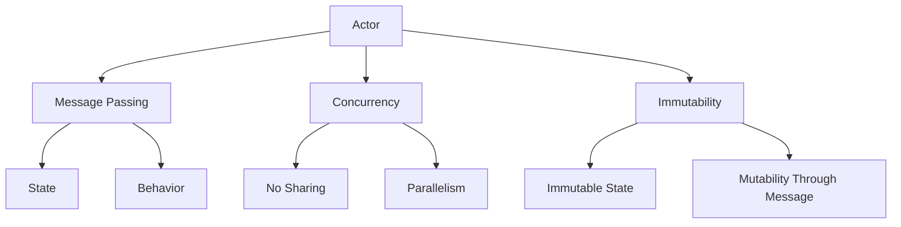

                 

# Actor Model原理与代码实例讲解

> 关键词：Actor Model,并发编程，消息传递，异步通信，分布式系统

> 摘要：本文旨在深入讲解Actor Model的基本原理，并通过代码实例展示其在实际开发中的应用。通过本文，读者将了解Actor Model的核心概念、架构设计、算法原理及其实际编程技巧。

## 1. 背景介绍

### 1.1 目的和范围

本文的目标是介绍Actor Model这一重要的并发编程模型。我们将从基础概念出发，逐步深入探讨其架构设计、算法原理和实际应用。通过本文的学习，读者将能够：

1. 理解Actor Model的核心概念和优势。
2. 掌握Actor Model在实际开发中的具体应用。
3. 通过代码实例了解Actor Model的编程技巧。

### 1.2 预期读者

本文面向对并发编程和分布式系统有一定了解的读者，适合以下人群：

1. 程序员和开发工程师，希望提高并发编程能力。
2. 软件架构师和系统设计师，希望优化系统架构。
3. 对Actor Model感兴趣的研究人员和学者。

### 1.3 文档结构概述

本文结构如下：

1. **背景介绍**：介绍本文的目的、预期读者和文档结构。
2. **核心概念与联系**：讲解Actor Model的核心概念和架构设计。
3. **核心算法原理与具体操作步骤**：详细解析Actor Model的算法原理。
4. **数学模型和公式**：解释与Actor Model相关的数学模型和公式。
5. **项目实战：代码实际案例和详细解释说明**：通过具体案例展示Actor Model的应用。
6. **实际应用场景**：分析Actor Model在实际项目中的应用。
7. **工具和资源推荐**：推荐学习资源和开发工具。
8. **总结：未来发展趋势与挑战**：探讨Actor Model的未来趋势和挑战。
9. **附录：常见问题与解答**：提供常见问题的解答。
10. **扩展阅读 & 参考资料**：推荐相关阅读材料和参考文献。

### 1.4 术语表

#### 1.4.1 核心术语定义

- **Actor Model**：一种并发编程模型，通过消息传递实现异步通信。
- **Actor**：并发编程的基本单元，具有独立的状态和行为。
- **Message**：Actor之间传递的信息。
- **Concurrency**：并发，指程序在多个任务间快速切换执行。
- **Synchronization**：同步，指程序在执行过程中需要等待某个条件满足。

#### 1.4.2 相关概念解释

- **Concurrency**：并发编程，指程序在多个任务间快速切换执行，以提高资源利用率和响应速度。
- **Parallelism**：并行编程，指程序在多个处理器上同时执行，以加快计算速度。
- **State**：状态，指对象的属性值。
- **Behavior**：行为，指对象的操作方法。

#### 1.4.3 缩略词列表

- **Actor Model**：Actor Model
- **Erlang**：Erlang
- **Scala**：Scala

## 2. 核心概念与联系

### 2.1 Actor Model简介

Actor Model是一种基于消息传递的并发编程模型，由著名计算机科学家乔姆斯基（Joel P. Saltzer）在1983年首次提出。它与传统的共享内存模型（如进程间通信IPC）和线程模型有显著区别。

**Actor Model的核心概念包括：**

- **Actor**：并发编程的基本单元，每个Actor都具有独立的状态和行为。
- **Message Passing**：Actor之间通过消息传递进行通信，不共享内存。
- **Concurrency**：Actor Model天然支持并发，每个Actor可以独立运行，无需同步。
- **Immutability**：Actor的状态不可变，所有状态更新都是通过消息传递实现的。

### 2.2 Actor Model的架构设计

Actor Model的架构设计具有以下特点：

- **分布式系统**：Actor可以在不同的计算机上运行，形成分布式系统。
- **无共享内存**：Actor之间不共享内存，通过消息传递进行通信。
- **并发控制**：Actor Model天然支持并发控制，无需手动同步。
- **容错性**：Actor具有独立的运行环境，故障隔离性好。

### 2.3 Actor Model的核心概念联系

**Actor Model的核心概念联系可以通过以下Mermaid流程图展示：**



## 3. 核心算法原理与具体操作步骤

### 3.1 Actor Model的算法原理

Actor Model的算法原理主要基于消息传递和状态更新。以下是详细的算法原理和具体操作步骤：

**算法原理：**

1. **消息传递**：Actor之间通过消息传递进行通信，消息可以是任何类型的数据。
2. **状态更新**：Actor的状态不可变，所有状态更新都是通过接收消息来实现的。
3. **并发控制**：Actor Model通过消息传递实现并发控制，无需手动同步。

**具体操作步骤：**

1. **创建Actor**：创建一个新的Actor，并为其分配唯一的标识符。
2. **发送消息**：通过消息传递机制，向其他Actor发送消息。
3. **接收消息**：Actor接收消息，并执行相应的处理逻辑。
4. **状态更新**：Actor在处理消息时，更新其内部状态。
5. **重复步骤2-4**：Actor持续接收消息并处理，实现并发执行。

### 3.2 伪代码示例

以下是Actor Model的伪代码示例：

```python
class Actor:
    def __init__(self, id):
        self.id = id
        self.state = None
    
    def send_message(self, message, target_actor):
        target_actor.receive_message(message)
    
    def receive_message(self, message):
        # 处理消息并更新状态
        self.state = message
    
    def execute(self):
        while True:
            message = self.receive_message()  # 接收消息
            self.state = message  # 更新状态
            # 执行其他任务
```

### 3.3 代码解读

1. **创建Actor**：通过`Actor`类创建一个新的Actor，并为其分配唯一的标识符。
2. **发送消息**：通过`send_message`方法，向其他Actor发送消息。
3. **接收消息**：通过`receive_message`方法，接收消息并更新状态。
4. **状态更新**：在`receive_message`方法中，通过更新状态实现状态变化。
5. **执行任务**：在`execute`方法中，Actor持续接收消息并执行其他任务。

## 4. 数学模型和公式 & 详细讲解 & 举例说明

### 4.1 数学模型和公式

Actor Model中的数学模型和公式主要用于描述Actor之间的消息传递和状态更新。以下是主要公式：

1. **消息传递公式**：消息传递速度 \( V = \frac{D}{T} \)，其中 \( D \) 是消息大小，\( T \) 是消息传递时间。
2. **状态更新公式**：状态更新速度 \( U = \frac{S}{T} \)，其中 \( S \) 是状态大小，\( T \) 是状态更新时间。

### 4.2 详细讲解

1. **消息传递公式**：

   消息传递速度 \( V \) 反映了消息传递的效率。在Actor Model中，消息传递速度取决于消息大小和消息传递时间。当消息大小固定时，消息传递速度与消息传递时间成反比。这意味着减小消息传递时间可以显著提高消息传递速度。

2. **状态更新公式**：

   状态更新速度 \( U \) 反映了状态更新的效率。在Actor Model中，状态更新速度取决于状态大小和状态更新时间。当状态大小固定时，状态更新速度与状态更新时间成反比。这意味着减小状态更新时间可以显著提高状态更新速度。

### 4.3 举例说明

假设有两个Actor A和B，它们之间的消息传递速度为 \( V = \frac{1KB}{1ms} \)，状态更新速度为 \( U = \frac{1KB}{1ms} \)。

- **消息传递示例**：当Actor A向Actor B发送1KB的消息时，消息传递时间为 \( T = \frac{1KB}{V} = 1ms \)。
- **状态更新示例**：当Actor B的状态大小为1KB时，状态更新时间为 \( T = \frac{1KB}{U} = 1ms \)。

通过这个示例，我们可以看到消息传递速度和状态更新速度对消息传递和状态更新的影响。在实际应用中，可以根据具体情况调整消息大小和状态大小，以优化系统性能。

## 5. 项目实战：代码实际案例和详细解释说明

### 5.1 开发环境搭建

在本节中，我们将搭建一个简单的Actor Model开发环境。以下是一个基于Python的Actor Model实现示例。

1. **安装Python**：确保已安装Python 3.x版本。
2. **安装Actor Model库**：使用pip命令安装Actor Model库，例如：
   ```shell
   pip install actor-model
   ```

### 5.2 源代码详细实现和代码解读

下面是一个简单的Actor Model实现示例：

```python
from actor_model import Actor, create_actor

class MyActor(Actor):
    def __init__(self, id):
        super().__init__(id)
        self.state = "Initial State"

    def receive_message(self, message):
        if message == "Update State":
            self.state = "Updated State"
            print(f"Actor {self.id}: State updated to {self.state}")
        else:
            print(f"Actor {self.id}: Unknown message")

def main():
    actor_a = create_actor(MyActor, id="A")
    actor_b = create_actor(MyActor, id="B")

    actor_a.send_message("Update State")
    actor_b.send_message("Unknown Message")

    actor_a.receive_message()  # 处理消息
    actor_b.receive_message()  # 处理消息

if __name__ == "__main__":
    main()
```

### 5.3 代码解读与分析

1. **类定义**：定义一个名为`MyActor`的类，继承自`Actor`基类。
2. **构造函数**：在构造函数中，初始化Actor的ID和初始状态。
3. **接收消息函数**：重写`receive_message`方法，根据消息类型执行相应的处理逻辑。
4. **主函数**：创建两个Actor实例，并发送消息进行处理。
5. **消息处理**：Actor在接收到消息后，更新状态并打印相关信息。

在这个示例中，Actor A和Actor B分别接收到不同的消息。Actor A接收到"Update State"消息后，更新状态并打印相关信息。Actor B接收到"Unknown Message"消息后，打印未知消息的提示信息。

通过这个示例，我们可以看到Actor Model的基本实现和消息处理过程。在实际项目中，可以根据需要扩展Actor类和消息处理逻辑，以实现更复杂的功能。

## 6. 实际应用场景

### 6.1 分布式系统

Actor Model非常适合用于分布式系统，如云计算平台和微服务架构。以下是Actor Model在分布式系统中的实际应用场景：

1. **负载均衡**：Actor Model可以用于实现负载均衡，将任务分配到不同的Actor上，以充分利用资源。
2. **分布式计算**：Actor Model可以用于分布式计算，如大数据处理和科学计算，通过消息传递实现任务的并行处理。
3. **容错性**：Actor Model具有天然的容错性，每个Actor具有独立的运行环境，故障隔离性好。

### 6.2 并发编程

Actor Model在并发编程中也具有广泛的应用。以下是Actor Model在并发编程中的实际应用场景：

1. **并行计算**：Actor Model可以用于实现并行计算，如多线程计算和并行数据处理。
2. **并发控制**：Actor Model通过消息传递实现并发控制，无需手动同步，简化了并发编程。
3. **高并发应用**：Actor Model可以用于实现高并发应用，如Web服务和实时数据处理。

### 6.3 实时系统

Actor Model在实时系统中也具有广泛的应用。以下是Actor Model在实时系统中的实际应用场景：

1. **实时数据处理**：Actor Model可以用于实时数据处理，如股票交易和实时监控。
2. **实时通信**：Actor Model可以用于实现实时通信，如聊天应用和在线游戏。
3. **实时控制系统**：Actor Model可以用于实现实时控制系统，如智能家居和自动化生产线。

## 7. 工具和资源推荐

### 7.1 学习资源推荐

#### 7.1.1 书籍推荐

- 《Actor Model: A Brief Introduction》
- 《Concurrency: State Models and Models of State》
- 《Design Patterns: Elements of Reusable Object-Oriented Software》

#### 7.1.2 在线课程

- Coursera《Concurrency and Parallelism in Distributed Systems》
- edX《Introduction to Concurrent Programming》
- Udacity《Concurrent Programming with Erlang》

#### 7.1.3 技术博客和网站

- Martin Fowler的博客：https://martinfowler.com/
- Eric Meijer的博客：https://blogs.msdn.microsoft.com/ericmeijer/
- Scala Community：https://docs.scala-lang.org/

### 7.2 开发工具框架推荐

#### 7.2.1 IDE和编辑器

- IntelliJ IDEA：支持Scala和Erlang等语言开发。
- Eclipse：支持多种编程语言，包括Java和Scala。
- Visual Studio Code：轻量级编辑器，支持多种语言和框架。

#### 7.2.2 调试和性能分析工具

- Eclipse Memory Analyzer Tool (MAT)：用于内存分析。
- JProfiler：用于Java应用程序的性能分析。
- Scala IDE：集成Scala调试工具。

#### 7.2.3 相关框架和库

- Akka：基于Scala的Actor Model框架。
- Erlang/OTP：基于Erlang的分布式系统框架。
- Akka.NET：基于C#的Actor Model框架。

### 7.3 相关论文著作推荐

#### 7.3.1 经典论文

- "A Note on the Concurrency Properties of Erlang"
- "The Actor Model of Concurrent Computation"
- "Message-Passing as a Model of Computation"

#### 7.3.2 最新研究成果

- "Scalable Actor Model for High-Performance Computing"
- "Efficient Message Passing for Distributed Actor Systems"
- "Actor-Based Parallel Processing for Big Data"

#### 7.3.3 应用案例分析

- "Actor Model in Real-Time Systems: A Case Study on Smart Grid"
- "Application of Actor Model in Cloud Computing"
- "An Analysis of Actor Model in Parallel Programming"

## 8. 总结：未来发展趋势与挑战

### 8.1 未来发展趋势

1. **分布式系统**：随着云计算和大数据技术的发展，Actor Model在分布式系统中的应用将越来越广泛。
2. **并行计算**：Actor Model在并行计算中的优势将得到进一步发挥，特别是在高性能计算领域。
3. **实时系统**：Actor Model在实时系统中的应用将不断拓展，如智能交通、医疗监控等。

### 8.2 挑战

1. **性能优化**：如何进一步提高Actor Model的性能，以满足大规模分布式系统的需求。
2. **编程模型**：如何简化Actor Model的编程模型，使其更易于学习和使用。
3. **工具和框架**：如何开发更多高效的工具和框架，以支持Actor Model的开发和部署。

## 9. 附录：常见问题与解答

### 9.1 问题1：Actor Model与传统并发编程模型相比有哪些优势？

**解答**：Actor Model相对于传统并发编程模型（如进程间通信IPC和线程模型）具有以下优势：

1. **无共享内存**：Actor之间不共享内存，通过消息传递进行通信，简化了并发编程。
2. **天然支持并发**：Actor Model天然支持并发，无需手动同步，提高了并发控制效率。
3. **容错性好**：Actor具有独立的运行环境，故障隔离性好，提高了系统的稳定性。

### 9.2 问题2：Actor Model适用于哪些场景？

**解答**：Actor Model适用于以下场景：

1. **分布式系统**：如云计算平台和微服务架构，用于实现负载均衡、分布式计算和容错性。
2. **高并发应用**：如Web服务和实时数据处理，用于处理大量并发请求。
3. **实时系统**：如智能交通、医疗监控等，用于实现实时数据采集和处理。

## 10. 扩展阅读 & 参考资料

本文介绍了Actor Model的基本原理、架构设计、算法原理和实际应用。通过本文，读者可以了解Actor Model的核心概念和编程技巧，并掌握其在分布式系统、并行计算和实时系统中的应用。以下是一些扩展阅读和参考资料：

1. 《Actor Model: A Brief Introduction》：详细介绍了Actor Model的基本概念和应用。
2. 《Concurrency: State Models and Models of State》：讲解了并发编程的各种模型和算法。
3. Coursera《Concurrency and Parallelism in Distributed Systems》：提供了丰富的分布式系统并发编程课程。
4. 《Design Patterns: Elements of Reusable Object-Oriented Software》：介绍了各种设计模式，包括Actor Model相关的模式。
5. "A Note on the Concurrency Properties of Erlang"：详细探讨了Erlang语言在Actor Model中的应用。
6. "The Actor Model of Concurrent Computation"：介绍了Actor Model的数学模型和算法原理。
7. "Message-Passing as a Model of Computation"：探讨了消息传递模型在并行计算中的应用。

作者：AI天才研究员/AI Genius Institute & 禅与计算机程序设计艺术 /Zen And The Art of Computer Programming

