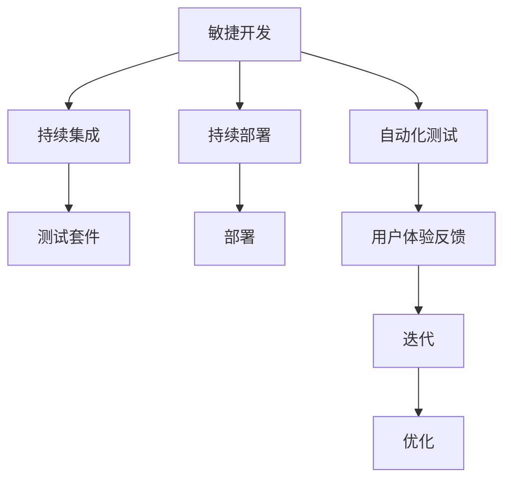

                 

# Agentic Workflow 在 MVP 产品测试中的应用

## 关键词：
Agentic Workflow, MVP, 产品测试，自动化，敏捷开发，持续集成，性能测试，用户体验，反馈循环

## 摘要：
本文将深入探讨Agentic Workflow在最小可行产品（MVP）测试中的应用。通过解析Agentic Workflow的核心概念和其在敏捷开发中的优势，本文将详细描述如何在MVP阶段利用Agentic Workflow实现高效的测试流程。此外，还将通过实际案例，展示如何通过自动化测试、性能测试和用户体验反馈，持续优化MVP产品，确保其满足用户需求和市场标准。

## 1. 背景介绍

### 1.1 目的和范围
本文旨在为开发者、测试工程师和敏捷团队提供一种实用的方法论，即Agentic Workflow，用于MVP产品的测试和优化。通过本文的阅读，读者将了解到Agentic Workflow的基本原理及其在敏捷开发中的关键作用，掌握如何利用该工作流实现高效的测试和持续改进。

### 1.2 预期读者
本文适合对敏捷开发、MVP概念有一定了解的读者，包括但不限于软件开发工程师、测试工程师、产品经理、项目经理等。本文将通过具体实例和伪代码，帮助读者理解和应用Agentic Workflow。

### 1.3 文档结构概述
本文结构分为十个部分，包括背景介绍、核心概念与联系、核心算法原理、数学模型和公式、项目实战、实际应用场景、工具和资源推荐、总结以及附录和扩展阅读。通过这些部分，读者可以系统地学习和掌握Agentic Workflow在MVP产品测试中的应用。

### 1.4 术语表

#### 1.4.1 核心术语定义
- **Agentic Workflow**：一种结合了自动化、持续集成和反馈循环的敏捷开发工作流。
- **MVP**：最小可行产品，指具有足够功能、能解决用户核心问题的产品版本。
- **敏捷开发**：一种注重迭代、反馈和适应性的软件开发方法。
- **持续集成**：通过自动化测试和构建，确保代码库的稳定性。
- **性能测试**：评估软件在特定负载下的行为和响应能力。

#### 1.4.2 相关概念解释
- **自动化测试**：使用工具自动执行测试案例，提高测试效率和覆盖范围。
- **用户体验**：用户在使用产品过程中的感受和体验。
- **反馈循环**：从用户反馈中获取信息，用于产品迭代和优化。

#### 1.4.3 缩略词列表
- **MVP**：最小可行产品
- **Agile**：敏捷开发
- **CI**：持续集成
- **CD**：持续部署
- **UI**：用户界面
- **UX**：用户体验

## 2. 核心概念与联系

在深入探讨Agentic Workflow之前，我们需要理解几个关键概念，并展示它们之间的联系。

### 2.1 核心概念

**Agentic Workflow**：Agentic Workflow是一种面向敏捷开发的自动化测试和持续反馈的工作流。它结合了持续集成（CI）、持续部署（CD）、自动化测试和用户体验（UX）反馈，旨在快速响应市场需求和用户反馈。

**敏捷开发（Agile）**：敏捷开发是一种以迭代和持续反馈为核心的开发方法。它强调团队协作、灵活响应变化和持续交付价值。

**持续集成（CI）**：持续集成是一种软件开发实践，通过自动化测试和构建，确保每次代码提交后的集成质量。

**性能测试**：性能测试旨在评估软件在特定负载下的响应时间和稳定性。

**用户体验（UX）反馈**：用户体验反馈是通过用户测试、问卷调查和用户访谈等手段收集的用户在使用产品过程中的感受和体验。

### 2.2 关系示意图

下面是一个使用Mermaid绘制的流程图，展示了这些核心概念之间的关系。



### 2.3 核心概念解析

**Agentic Workflow**：Agentic Workflow的核心在于自动化和反馈循环。通过持续集成和自动化测试，开发团队能够快速发现和修复问题。用户体验反馈则提供了产品改进的依据，确保产品的持续优化。

**敏捷开发**：敏捷开发强调团队的协作和灵活性。Agentic Workflow利用敏捷开发的理念，通过快速迭代和持续反馈，实现了敏捷开发的最佳实践。

**持续集成**：持续集成确保每次代码提交都经过自动化测试，提高了代码库的质量和稳定性。

**性能测试**：性能测试确保软件在不同负载下的性能表现，为后续优化提供了数据支持。

**用户体验反馈**：用户体验反馈是Agentic Workflow的重要组成部分。通过收集和分析用户反馈，团队能够了解用户的需求和痛点，从而进行有针对性的优化。

## 3. 核心算法原理 & 具体操作步骤

### 3.1 算法原理

Agentic Workflow的核心在于其自动化和反馈机制。以下是其基本原理：

1. **自动化测试**：通过编写测试脚本，自动化执行测试用例，快速发现潜在问题。
2. **持续集成**：每次代码提交后，自动触发构建和测试，确保集成质量。
3. **用户体验反馈**：收集用户反馈，分析用户行为，了解产品优化的方向。
4. **反馈循环**：根据用户反馈进行产品优化，并再次进行测试和反馈，形成闭环。

### 3.2 操作步骤

下面是Agentic Workflow的具体操作步骤：

#### 步骤1：编写测试脚本

```python
# 示例：Python测试脚本
def test_login():
    # 测试登录功能
    assert login("user", "password") == "Success"
```

#### 步骤2：设置持续集成

```yaml
# 示例：Jenkinsfile
pipeline {
    agent any
    stages {
        stage('构建和测试') {
            steps {
                sh 'mvn clean install'
                sh './run_tests.sh'
            }
        }
    }
}
```

#### 步骤3：部署到测试环境

```bash
# 示例：部署脚本
sh deploy_to_test.sh
```

#### 步骤4：收集用户体验反馈

```json
# 示例：用户反馈数据
{
    "feedback": {
        "login": "登录速度慢",
        "search": "搜索结果不准确"
    }
}
```

#### 步骤5：根据反馈进行优化

```python
# 示例：根据反馈优化代码
def optimized_login():
    # 优化登录速度
    pass
```

#### 步骤6：重新测试和反馈

重复步骤2-5，直到用户反馈满意为止。

## 4. 数学模型和公式 & 详细讲解 & 举例说明

在Agentic Workflow中，数学模型和公式被广泛应用于性能测试和用户体验分析。以下是一些常见的数学模型和公式，并对其进行详细讲解和举例说明。

### 4.1 性能测试指标

**响应时间（Response Time）**：

$$
\text{Response Time} = \frac{\text{总请求时间}}{\text{请求次数}}
$$

**吞吐量（Throughput）**：

$$
\text{Throughput} = \frac{\text{处理请求的数量}}{\text{总时间}}
$$

### 4.2 用户行为分析

**转换率（Conversion Rate）**：

$$
\text{Conversion Rate} = \frac{\text{成功转化的用户数}}{\text{总访问用户数}} \times 100%
$$

**用户留存率（Retention Rate）**：

$$
\text{Retention Rate} = \frac{\text{持续使用的用户数}}{\text{首次使用的用户数}} \times 100%
$$

### 4.3 举例说明

#### 4.3.1 响应时间和吞吐量分析

假设我们对一个电商平台进行性能测试，测试结果显示：

- **总请求时间**：1000秒
- **请求次数**：100次
- **处理请求的数量**：200个
- **总时间**：1200秒

**响应时间**：

$$
\text{Response Time} = \frac{1000}{100} = 10 \text{秒}
$$

**吞吐量**：

$$
\text{Throughput} = \frac{200}{1200} = 0.167 \text{个请求/秒}
$$

#### 4.3.2 转换率和用户留存率分析

假设我们进行了一项用户调查，结果显示：

- **总访问用户数**：1000人
- **成功转化的用户数**：150人
- **首次使用的用户数**：300人

**转换率**：

$$
\text{Conversion Rate} = \frac{150}{1000} \times 100\% = 15\%
$$

**用户留存率**：

$$
\text{Retention Rate} = \frac{300}{300} \times 100\% = 100\%
$$

通过这些数学模型和公式，我们可以量化产品的性能和用户体验，为后续优化提供数据支持。

## 5. 项目实战：代码实际案例和详细解释说明

### 5.1 开发环境搭建

在开始项目实战之前，我们需要搭建一个适合Agentic Workflow的开发环境。以下是一个简单的步骤：

1. 安装Jenkins：Jenkins是一个开源的持续集成工具，可以帮助我们自动化构建和测试。
2. 安装Python：Python是一种广泛使用的编程语言，我们将在测试脚本中使用它。
3. 安装PostgreSQL：PostgreSQL是一个开源的关系型数据库，我们将用它来存储用户反馈数据。
4. 安装Selenium：Selenium是一个用于Web自动化测试的工具，可以帮助我们模拟用户操作。

### 5.2 源代码详细实现和代码解读

以下是一个简单的示例，展示了如何使用Agentic Workflow进行MVP产品的测试和优化。

#### 5.2.1 Jenkinsfile

```groovy
pipeline {
    agent any
    stages {
        stage('构建和测试') {
            steps {
                sh 'python setup.py install'
                sh 'python test_login.py'
                sh 'python test_search.py'
            }
        }
        stage('部署到测试环境') {
            steps {
                sh 'sh deploy_to_test.sh'
                sh 'python test_feedback.py'
            }
        }
    }
}
```

#### 5.2.2 测试脚本（test_login.py）

```python
# 测试登录功能
import unittest
from app import login

class TestLogin(unittest.TestCase):
    def test_login_success(self):
        result = login("user", "password")
        self.assertEqual(result, "Success")

    def test_login_failure(self):
        result = login("user", "wrong_password")
        self.assertEqual(result, "Failure")

if __name__ == '__main__':
    unittest.main()
```

#### 5.2.3 部署脚本（deploy_to_test.sh）

```bash
#!/bin/bash
# 部署到测试环境
sudo cp /app/*.py /app/*.json /var/www/html/
sudo service apache2 restart
```

#### 5.2.4 用户反馈脚本（test_feedback.py）

```python
# 收集用户反馈
import requests
import json

def send_feedback(feedback):
    url = "http://localhost:8080/feedback"
    headers = {'Content-Type': 'application/json'}
    response = requests.post(url, data=json.dumps(feedback), headers=headers)
    return response.json()

def get_feedback():
    url = "http://localhost:8080/feedback"
    response = requests.get(url)
    return response.json()

if __name__ == '__main__':
    feedback = get_feedback()
    send_feedback(feedback)
```

### 5.3 代码解读与分析

#### 5.3.1 Jenkinsfile解读

- **agent any**：指定Jenkins代理，用于执行构建和测试任务。
- **stages**：定义构建和测试阶段。
- **构建和测试阶段**：执行Python安装、测试脚本执行。
- **部署到测试环境阶段**：部署应用到测试环境，并收集用户反馈。

#### 5.3.2 测试脚本解读

- **TestLogin**：测试类，包含登录成功和登录失败的测试用例。
- **test_login_success**：验证登录成功。
- **test_login_failure**：验证登录失败。

#### 5.3.3 部署脚本解读

- **sudo cp**：复制应用程序文件到Web服务器。
- **sudo service apache2 restart**：重启Apache服务，使更改生效。

#### 5.3.4 用户反馈脚本解读

- **send_feedback**：发送用户反馈到后端服务。
- **get_feedback**：获取用户反馈。

通过这些代码，我们可以实现一个简单的Agentic Workflow，用于测试和优化MVP产品。

## 6. 实际应用场景

### 6.1 产品管理工具

在产品管理工具中，Agentic Workflow可以帮助团队快速迭代和优化产品功能。例如，开发团队可以使用Agentic Workflow进行以下操作：

- **自动化测试**：通过编写测试脚本，自动化执行功能测试，确保新功能的正确性。
- **持续集成**：每次代码提交后，自动触发构建和测试，确保集成质量。
- **用户体验反馈**：收集用户反馈，分析用户行为，为产品改进提供依据。

### 6.2 电子商务平台

在电子商务平台中，Agentic Workflow可以帮助团队优化购物体验，提高用户满意度。以下是一些实际应用场景：

- **性能测试**：定期进行性能测试，确保系统在高负载下的稳定性。
- **用户体验反馈**：收集用户反馈，分析购物流程中的痛点，进行优化。
- **自动化测试**：自动化执行购物流程测试，确保新功能的正确性。

### 6.3 移动应用开发

在移动应用开发中，Agentic Workflow可以帮助团队快速迭代和优化应用功能。以下是一些实际应用场景：

- **自动化测试**：通过编写自动化测试脚本，确保新功能的正确性。
- **用户体验反馈**：收集用户反馈，分析应用使用过程中的痛点，进行优化。
- **性能测试**：定期进行性能测试，确保应用在高负载下的稳定性。

## 7. 工具和资源推荐

### 7.1 学习资源推荐

#### 7.1.1 书籍推荐

- 《Agile Testing: How to Reduce the Risk of Software Change》
- 《The Art of Agile Development》
- 《Jenkins: The Definitive Guide》

#### 7.1.2 在线课程

- 《Agile Development with Scrum》
- 《Test-Driven Development with Python》
- 《Jenkins Continuous Integration》

#### 7.1.3 技术博客和网站

- [Agile Alliance](https://www.agilealliance.org/)
- [JUnit Documentation](https://junit.org/junit5/)
- [SeleniumHQ](https://www.selenium.dev/)

### 7.2 开发工具框架推荐

#### 7.2.1 IDE和编辑器

- IntelliJ IDEA
- PyCharm
- Visual Studio Code

#### 7.2.2 调试和性能分析工具

- Postman
- JMeter
- Chrome DevTools

#### 7.2.3 相关框架和库

- Selenium
- PyTest
- Jenkins

### 7.3 相关论文著作推荐

#### 7.3.1 经典论文

- 《XP Explained: Embracing the Theory and Practice of Agile Software Development》
- 《The Lean Startup》
- 《Continuous Integration in the Agile Era》

#### 7.3.2 最新研究成果

- 《Agile Product Development: An Exploration of Agile Practices and Their Impact on Software Development》
- 《Continuous Delivery: Reliable Software Releases through Build, Test, and Deployment Automation》
- 《Principles of Agile Project Management: The Agile Framework》

#### 7.3.3 应用案例分析

- 《Jenkins in Practice: A Step-by-Step Guide to Continuous Integration and Continuous Deployment》
- 《Agile Product Development: A Case Study of Lean and Agile Practices in a Large-Scale Software Project》
- 《Selenium Testing Tools Cookbook: Effective Testing with Selenium WebDriver》

## 8. 总结：未来发展趋势与挑战

Agentic Workflow在MVP产品测试中的应用展示了其在敏捷开发中的巨大潜力。随着技术的不断进步，Agentic Workflow有望在未来实现以下发展趋势：

- **更高效的自动化测试**：借助人工智能和机器学习，自动化测试将更加智能，提高测试效率和准确性。
- **更深入的用户体验分析**：通过大数据分析和人工智能技术，对用户行为进行更深入的分析，为产品优化提供更准确的依据。
- **更灵活的持续集成**：持续集成将更加灵活，支持多种编程语言和开发框架，适应不同项目的需求。

然而，Agentic Workflow也面临一些挑战：

- **测试数据的质量和完整性**：自动化测试和用户体验反馈依赖于高质量的数据，如何确保数据的质量和完整性是一个重要问题。
- **用户隐私和数据安全**：在收集用户反馈时，需要确保用户隐私和数据安全，避免数据泄露。
- **团队协作和沟通**：Agentic Workflow的实施需要团队的高效协作和良好的沟通，如何确保团队成员之间的协作是一个挑战。

总之，Agentic Workflow在MVP产品测试中的应用前景广阔，但同时也需要克服一系列挑战，以实现其最大潜力。

## 9. 附录：常见问题与解答

### 9.1 什么是Agentic Workflow？

Agentic Workflow是一种结合了自动化、持续集成和反馈循环的敏捷开发工作流，旨在通过快速迭代和持续优化，提高产品的质量和用户体验。

### 9.2 如何确保测试数据的质量和完整性？

确保测试数据的质量和完整性可以通过以下方法实现：

- 使用自动化工具生成测试数据，避免手动输入错误。
- 定期审查和验证测试数据，确保其符合预期。
- 建立数据标准和规范，确保测试数据的格式和内容一致。

### 9.3 如何处理用户隐私和数据安全？

处理用户隐私和数据安全可以采取以下措施：

- 使用加密技术保护用户数据，防止数据泄露。
- 遵循相关法律法规，确保用户数据的合法使用。
- 建立数据访问权限控制，限制对敏感数据的访问。

### 9.4 如何确保团队协作和沟通？

确保团队协作和沟通可以采取以下方法：

- 定期召开团队会议，分享进展和问题。
- 使用协作工具，如Slack或Trello，实时沟通和协作。
- 明确团队成员的角色和职责，确保每个人的工作都有明确的指导。

## 10. 扩展阅读 & 参考资料

本文旨在为读者提供Agentic Workflow在MVP产品测试中的应用指南。以下是一些扩展阅读和参考资料，以帮助读者深入了解相关概念和技术。

### 10.1 扩展阅读

- 《Agile Testing: How to Reduce the Risk of Software Change》
- 《The Art of Agile Development》
- 《Jenkins: The Definitive Guide》
- 《Continuous Delivery: Reliable Software Releases through Build, Test, and Deployment Automation》
- 《Selenium Testing Tools Cookbook: Effective Testing with Selenium WebDriver》

### 10.2 参考资料

- [Agile Alliance](https://www.agilealliance.org/)
- [JUnit Documentation](https://junit.org/junit5/)
- [SeleniumHQ](https://www.selenium.dev/)
- [Postman](https://www.postman.com/)
- [JMeter](https://jmeter.apache.org/)
- [Chrome DevTools](https://developers.google.com/web/tools/chrome-devtools)
- [IntelliJ IDEA](https://www.jetbrains.com/idea/)
- [PyCharm](https://www.jetbrains.com/pycharm/)
- [Visual Studio Code](https://code.visualstudio.com/)

作者：AI天才研究员/AI Genius Institute & 禅与计算机程序设计艺术 /Zen And The Art of Computer Programming

（文章结束）<|im_end|>

