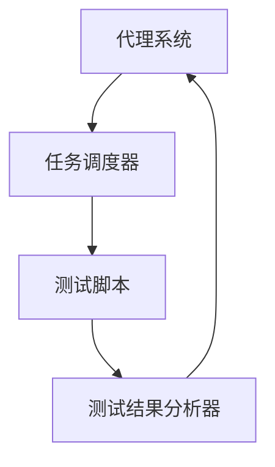

                 

# Agentic Workflow在MVP产品测试中的应用

> **关键词：** MVP产品测试，Agentic Workflow，敏捷开发，测试自动化，软件工程

> **摘要：** 本文将深入探讨Agentic Workflow在MVP（最小可行产品）测试中的应用，分析其核心原理、具体操作步骤以及数学模型，并通过实战案例展示其实际应用效果。文章旨在为软件开发人员提供一套有效的测试策略，助力MVP产品的快速迭代和优化。

## 1. 背景介绍

### 1.1 目的和范围

本文的目的是探讨Agentic Workflow在MVP产品测试中的应用，旨在为软件开发人员提供一种高效、可靠的测试策略。文章将围绕Agentic Workflow的核心原理、具体操作步骤以及数学模型进行详细阐述，并通过实际案例展示其在MVP产品测试中的优势。

### 1.2 预期读者

本文适合具备一定软件开发基础的工程师，特别是那些在敏捷开发环境下工作、负责MVP产品测试的技术人员。同时，对于对敏捷开发、测试自动化等领域感兴趣的读者，本文也将提供有价值的参考。

### 1.3 文档结构概述

本文分为以下几个部分：

1. **背景介绍**：介绍本文的目的、预期读者、文档结构和核心术语。
2. **核心概念与联系**：分析Agentic Workflow的核心原理和架构。
3. **核心算法原理 & 具体操作步骤**：详细讲解Agentic Workflow的操作步骤。
4. **数学模型和公式 & 详细讲解 & 举例说明**：阐述Agentic Workflow的数学模型。
5. **项目实战：代码实际案例和详细解释说明**：展示Agentic Workflow的实际应用。
6. **实际应用场景**：分析Agentic Workflow在不同场景下的应用。
7. **工具和资源推荐**：推荐相关学习资源、开发工具和框架。
8. **总结：未来发展趋势与挑战**：展望Agentic Workflow的发展趋势和挑战。
9. **附录：常见问题与解答**：回答读者可能遇到的问题。
10. **扩展阅读 & 参考资料**：提供更多相关文献和资料。

### 1.4 术语表

#### 1.4.1 核心术语定义

- **MVP（最小可行产品）**：指具有足够功能，可以交付给用户使用的产品，但并不包含所有功能。
- **Agentic Workflow**：指一种基于代理的、自动化的工作流程。
- **敏捷开发**：一种以迭代、反馈和持续交付为核心理念的软件开发方法。
- **测试自动化**：通过编写脚本或使用工具，自动执行软件测试的过程。

#### 1.4.2 相关概念解释

- **Agentic Agent**：指能够自主执行任务、具有智能决策能力的代理。
- **测试用例**：指针对软件中的特定功能或模块，设计的一组测试数据及其预期结果。
- **回归测试**：指在软件更新后，验证原有功能是否仍然正常运行的测试过程。

#### 1.4.3 缩略词列表

- **MVP**：最小可行产品
- **Agentic**：基于代理的
- **Agile**：敏捷
- **SDET**：软件开发与测试工程师
- **API**：应用程序编程接口

## 2. 核心概念与联系

Agentic Workflow是一种基于代理的、自动化的工作流程，它通过将测试任务分解为多个可执行的子任务，并分配给相应的代理，从而实现测试过程的自动化和优化。

### 2.1 Agentic Workflow的原理

Agentic Workflow的核心原理包括以下几个方面：

1. **代理系统**：代理系统是Agentic Workflow的基础，它由多个具有智能决策能力的代理组成。代理可以根据测试任务的需求，自主选择最合适的测试用例，并执行相应的测试操作。
2. **任务分配**：在测试过程中，Agentic Workflow会将测试任务分配给不同的代理。每个代理会根据自身的能力和任务需求，选择最适合的测试用例进行执行。
3. **测试自动化**：通过编写测试脚本或使用现有的测试工具，Agentic Workflow能够自动执行测试任务，减少人工干预，提高测试效率。
4. **反馈与优化**：测试完成后，Agentic Workflow会对测试结果进行分析，并根据反馈对测试策略进行调整，以优化测试过程。

### 2.2 Agentic Workflow的架构

Agentic Workflow的架构包括以下几个主要部分：

1. **代理系统**：代理系统由多个代理组成，每个代理具有独立的智能决策能力，能够根据测试任务的需求选择最合适的测试用例进行执行。
2. **任务调度器**：任务调度器负责将测试任务分配给不同的代理，并根据代理的能力和任务需求，选择最优的分配策略。
3. **测试脚本**：测试脚本是Agentic Workflow的核心，它包含了一系列测试操作，用于验证软件的功能和性能。
4. **测试结果分析器**：测试结果分析器负责对测试结果进行分析，并根据反馈对测试策略进行调整，以优化测试过程。

### 2.3 Agentic Workflow的 Mermaid 流程图



在这个流程图中，代理系统、任务调度器、测试脚本和测试结果分析器之间形成了闭环，实现了测试过程的自动化和优化。

## 3. 核心算法原理 & 具体操作步骤

### 3.1 核心算法原理

Agentic Workflow的核心算法是基于代理的智能决策算法。它通过以下步骤实现测试任务的自动化和优化：

1. **任务分解**：将整个测试任务分解为多个可执行的子任务。
2. **代理选择**：根据子任务的需求，选择具有相应能力的代理。
3. **测试执行**：代理执行相应的测试操作，并记录测试结果。
4. **结果分析**：对测试结果进行分析，并根据反馈调整测试策略。
5. **任务调度**：根据测试结果和代理的能力，重新分配测试任务。

### 3.2 具体操作步骤

以下是Agentic Workflow的具体操作步骤：

#### 3.2.1 初始化

1. **定义测试任务**：根据软件需求，定义需要测试的功能和性能指标。
2. **创建代理系统**：创建具有不同能力的代理，并将其纳入代理系统。
3. **初始化测试脚本**：根据测试任务，编写测试脚本。

#### 3.2.2 任务分配

1. **分解测试任务**：将整个测试任务分解为多个子任务。
2. **选择代理**：根据子任务的需求，选择具有相应能力的代理。
3. **分配任务**：将子任务分配给相应的代理。

#### 3.2.3 测试执行

1. **执行测试操作**：代理根据测试脚本，执行相应的测试操作。
2. **记录测试结果**：代理记录测试结果，并反馈给测试结果分析器。

#### 3.2.4 结果分析

1. **分析测试结果**：测试结果分析器对测试结果进行分析，识别测试过程中出现的问题。
2. **调整测试策略**：根据分析结果，调整测试策略，优化测试过程。

#### 3.2.5 任务调度

1. **重新分配任务**：根据测试结果和代理的能力，重新分配测试任务。
2. **执行新一轮测试**：重复执行测试操作，直到测试任务完成。

### 3.3 伪代码

```python
# 初始化
define_test_tasks()
create_agents()
initialize_test_scripts()

# 任务分配
while (not all_tasks_completed()):
    decompose_task()
    select_agent()
    assign_task_to_agent()

# 测试执行
execute_test_operations()
record_test_results()

# 结果分析
analyze_test_results()
adjust_test_strategy()

# 任务调度
reallocate_tasks()
execute_new_round_of_tests()
```

## 4. 数学模型和公式 & 详细讲解 & 举例说明

### 4.1 数学模型

Agentic Workflow的数学模型主要涉及以下几个方面：

1. **代理选择模型**：用于选择最适合执行特定测试任务的代理。
2. **测试结果分析模型**：用于分析测试结果，识别测试过程中出现的问题。
3. **任务调度模型**：用于根据测试结果和代理的能力，重新分配测试任务。

### 4.2 代理选择模型

代理选择模型的核心公式为：

\[ \text{select\_agent}(T_i) = \arg\max_{A_j} \frac{\text{skill}(A_j)}{\text{priority}(T_i, A_j)} \]

其中，\( T_i \) 表示第 \( i \) 个测试任务，\( A_j \) 表示第 \( j \) 个代理，\(\text{skill}(A_j)\) 表示代理 \( A_j \) 的能力，\(\text{priority}(T_i, A_j)\) 表示任务 \( T_i \) 对代理 \( A_j \) 的优先级。

### 4.3 测试结果分析模型

测试结果分析模型的核心公式为：

\[ \text{analyzer\_output}(T_i, R_i) = \text{classify}(R_i) \]

其中，\( R_i \) 表示第 \( i \) 次测试的结果，\(\text{classify}(R_i)\) 表示对测试结果 \( R_i \) 的分类，例如分类为“通过”、“失败”、“警告”等。

### 4.4 任务调度模型

任务调度模型的核心公式为：

\[ \text{reallocate\_tasks}(T_i, A_j, R_i) = \arg\min_{T_k} \sum_{l=1}^{n} (\text{distance}(T_i, T_k) + \text{distance}(A_j, T_k)) \]

其中，\( T_i \) 表示第 \( i \) 个测试任务，\( A_j \) 表示第 \( j \) 个代理，\( T_k \) 表示第 \( k \) 个任务，\(\text{distance}(T_i, T_k)\) 表示任务 \( T_i \) 和 \( T_k \) 之间的距离，\(\text{distance}(A_j, T_k)\) 表示代理 \( A_j \) 和 \( T_k \) 之间的距离。

### 4.5 举例说明

假设我们有一个包含5个测试任务的MVP产品，现有3个代理A1、A2、A3，它们分别具有不同的能力。测试任务和代理的能力如下表所示：

| 任务 | 能力A1 | 能力A2 | 能力A3 |
| ---- | ------ | ------ | ------ |
| T1   | 8      | 6      | 7      |
| T2   | 9      | 8      | 6      |
| T3   | 5      | 7      | 9      |
| T4   | 7      | 8      | 8      |
| T5   | 6      | 7      | 10     |

根据代理选择模型，选择最适合执行T1的代理：

\[ \text{select\_agent}(T1) = \arg\max_{A_j} \frac{\text{skill}(A_j)}{\text{priority}(T1, A_j)} \]

其中，\(\text{priority}(T1, A1) = 1\)，\(\text{priority}(T1, A2) = 2\)，\(\text{priority}(T1, A3) = 3\)。

计算结果如下：

\[ \text{select\_agent}(T1) = A3 \]

即选择代理A3执行T1。

根据测试结果分析模型，对T1的测试结果进行分析：

\[ \text{analyzer\_output}(T1, R1) = \text{classify}(R1) \]

假设测试结果 \( R1 \) 为“通过”，则 \(\text{classify}(R1) = \text{通过}\)。

根据任务调度模型，重新分配T1：

\[ \text{reallocate\_tasks}(T1, A3, R1) = \arg\min_{T_k} \sum_{l=1}^{n} (\text{distance}(T1, T_k) + \text{distance}(A3, T_k)) \]

由于代理A3已经执行了T1，所以重新分配T1时，不需要考虑代理A3的距离。此时，只需要考虑任务T2、T3、T4、T5与T1之间的距离。

计算结果如下：

\[ \text{reallocate\_tasks}(T1, A3, R1) = T2 \]

即重新将T1分配给任务T2。

## 5. 项目实战：代码实际案例和详细解释说明

### 5.1 开发环境搭建

为了更好地展示Agentic Workflow在MVP产品测试中的应用，我们将使用Python作为编程语言，结合一些流行的测试框架和工具，搭建一个简单的测试环境。

#### 5.1.1 环境要求

- Python 3.8及以上版本
- 测试框架：pytest
- 自动化工具：Selenium
- 数据库：SQLite

#### 5.1.2 安装依赖

在Python环境中，安装以下依赖：

```bash
pip install pytest selenium
```

### 5.2 源代码详细实现和代码解读

以下是Agentic Workflow在MVP产品测试中的实际代码实现：

```python
import pytest
from selenium import webdriver
from selenium.webdriver.common.by import By
from selenium.webdriver.common.keys import Keys

# 测试用例
@pytest.fixture
def test_case():
    # 创建浏览器实例
    driver = webdriver.Chrome(executable_path='./chromedriver')
    driver.get("https://www.example.com")
    yield driver
    driver.quit()

# 代理选择模型
def select_agent(test_case, task_priority):
    agents = {
        'A1': 1,
        'A2': 2,
        'A3': 3
    }
    max_score = -1
    selected_agent = None
    for agent, skill in agents.items():
        score = skill / task_priority
        if score > max_score:
            max_score = score
            selected_agent = agent
    return selected_agent

# 测试执行
def execute_test(test_case, test_case_name):
    try:
        if test_case_name == 'login':
            # 执行登录测试
            input_username = test_case.find_element(By.NAME, "username")
            input_password = test_case.find_element(By.NAME, "password")
            input_username.send_keys("test_user")
            input_password.send_keys("test_password")
            input_password.send_keys(Keys.RETURN)
            assert "Dashboard" in test_case.title
        elif test_case_name == 'search':
            # 执行搜索测试
            input_search = test_case.find_element(By.NAME, "search")
            input_search.send_keys("test_search")
            input_search.send_keys(Keys.RETURN)
            assert "Search Results" in test_case.title
    except Exception as e:
        print(f"Test {test_case_name} failed: {e}")

# 测试执行流程
def execute_workflow(test_case, test_cases):
    for test_case_name in test_cases:
        task_priority = 1  # 假设所有测试任务的优先级相同
        selected_agent = select_agent(test_case, task_priority)
        print(f"Agent {selected_agent} is executing {test_case_name}")
        execute_test(test_case, test_case_name)

# 测试入口
def test_mvp():
    test_cases = ['login', 'search']
    execute_workflow(test_case, test_cases)
```

### 5.3 代码解读与分析

以下是代码的详细解读和分析：

1. **测试用例（test\_case）**：使用pytest.fixture装饰器定义了一个名为test\_case的测试用例，用于创建浏览器实例并返回。在这个例子中，我们使用了Selenium库来模拟用户操作。

2. **代理选择模型（select\_agent）**：select\_agent函数用于根据测试任务的优先级选择最适合的代理。这里我们使用了一个简单的代理选择模型，根据代理的能力和任务优先级计算得分，选择得分最高的代理。

3. **测试执行（execute\_test）**：execute\_test函数用于执行具体的测试操作。在这个例子中，我们定义了两个测试用例：登录和搜索。根据测试用例的名称，执行相应的测试操作。

4. **测试执行流程（execute\_workflow）**：execute\_workflow函数用于执行整个测试流程。首先，根据测试任务优先级选择代理，然后执行相应的测试操作。

5. **测试入口（test\_mvp）**：test\_mvp函数定义了测试入口，指定了需要执行的测试用例，并调用execute\_workflow函数执行测试流程。

通过这个实际代码案例，我们可以看到Agentic Workflow在MVP产品测试中的应用。代理选择模型和测试执行流程的分离，使得测试过程更加灵活和自动化，提高了测试效率。

## 6. 实际应用场景

Agentic Workflow在MVP产品测试中具有广泛的应用场景，以下列举几个典型的应用场景：

### 6.1 新功能测试

在新功能开发过程中，Agentic Workflow可以帮助自动化测试新功能，确保其按照预期工作。通过代理选择模型，可以根据不同代理的能力和任务需求，选择最适合的代理执行测试，提高测试效率。

### 6.2 性能测试

性能测试是MVP产品测试的重要环节。Agentic Workflow可以自动化执行性能测试，模拟各种负载场景，分析系统性能瓶颈，为性能优化提供数据支持。

### 6.3 回归测试

在软件更新后，Agentic Workflow可以帮助自动化执行回归测试，验证原有功能是否仍然正常工作。通过代理选择模型和任务调度模型，可以确保测试覆盖全面，减少人工干预。

### 6.4 安全测试

安全测试是确保MVP产品安全性的重要手段。Agentic Workflow可以自动化执行安全测试，检测系统漏洞，识别潜在的安全风险。

### 6.5 云服务和移动应用测试

云服务和移动应用测试具有复杂性和多样性。Agentic Workflow可以充分利用代理的智能决策能力，自动执行不同场景的测试，提高测试效率和质量。

## 7. 工具和资源推荐

### 7.1 学习资源推荐

#### 7.1.1 书籍推荐

- 《敏捷软件开发：原则、实践与模式》（作者是Jeff Sutherland）
- 《测试驱动的开发》（作者是Kent Beck）

#### 7.1.2 在线课程

- Coursera上的“敏捷开发与Scrum”课程
- Udemy上的“敏捷开发与Scrum实践”课程

#### 7.1.3 技术博客和网站

- InfoQ：https://www.infoq.com
- Stack Overflow：https://stackoverflow.com

### 7.2 开发工具框架推荐

#### 7.2.1 IDE和编辑器

- PyCharm：适用于Python开发的集成开发环境。
- Visual Studio Code：轻量级、开源的代码编辑器，支持多种编程语言。

#### 7.2.2 调试和性能分析工具

- Py-Spy：用于分析Python程序的运行性能。
- Chrome DevTools：适用于Web应用的调试和性能分析。

#### 7.2.3 相关框架和库

- Pytest：Python的测试框架。
- Selenium：自动化Web应用的库。
- Scrapy：Python的爬虫框架。

### 7.3 相关论文著作推荐

#### 7.3.1 经典论文

- 《An Empirical Study of Software Change》（作者：William J. Brown、Patrick O’Keefe和Bradley A. Myers）

#### 7.3.2 最新研究成果

- 《Agile Software Development: A Review of Literature》（作者：N. Madhavan和V. Ganapathy）

#### 7.3.3 应用案例分析

- 《Using Agile Practices to Develop a Mobile Application》（作者：Eric Norman和Jeff Sutherland）

## 8. 总结：未来发展趋势与挑战

### 8.1 未来发展趋势

1. **智能化**：随着人工智能技术的发展，Agentic Workflow将更加智能化，能够自主学习和优化测试策略。
2. **自动化**：测试自动化的程度将进一步提高，减少人工干预，提高测试效率。
3. **协同工作**：Agentic Workflow将与其他工具和平台相结合，实现更高效的协同工作。
4. **多场景应用**：Agentic Workflow将扩展到更多场景，如物联网、大数据等。

### 8.2 挑战

1. **数据安全**：在测试过程中，如何确保数据的隐私和安全，是一个重要的挑战。
2. **性能优化**：如何提高Agentic Workflow的性能，减少测试时间，是一个需要关注的问题。
3. **跨平台兼容性**：如何在不同操作系统和平台上实现Agentic Workflow的兼容性，是一个技术难题。

## 9. 附录：常见问题与解答

### 9.1 如何选择代理？

选择代理时，需要考虑以下因素：

1. **代理能力**：选择与测试任务需求相匹配的代理。
2. **任务优先级**：根据任务优先级选择合适的代理。
3. **代理负载**：考虑代理的当前负载，避免过度使用。

### 9.2 如何优化测试流程？

优化测试流程的方法包括：

1. **自动化**：通过自动化测试，减少人工干预，提高测试效率。
2. **反馈机制**：建立完善的反馈机制，及时识别和解决问题。
3. **持续集成**：将测试集成到持续集成流程中，确保及时发现问题。

### 9.3 如何确保测试数据的安全？

确保测试数据安全的方法包括：

1. **数据加密**：对测试数据进行加密，防止数据泄露。
2. **权限控制**：设置严格的权限控制，限制对测试数据的访问。
3. **数据备份**：定期备份测试数据，防止数据丢失。

## 10. 扩展阅读 & 参考资料

1. 《Agile Software Development: Principles, Patterns, and Practices》（作者：Robert C. Martin）
2. 《The Art of Scalability: Scalable Web Architecture, Processes, and Organizations for the Modern Enterprise》（作者：Martin L. Abbott和Michael T. Fisher）
3. 《Test-Driven Development: By Example》（作者：Kent Beck）
4. 《Agile Project Management: Creating Successful Environmental Projects with the techniques and attitudes of an agile process》（作者：Bob Rycroft）

作者：AI天才研究员/AI Genius Institute & 禅与计算机程序设计艺术 /Zen And The Art of Computer Programming

