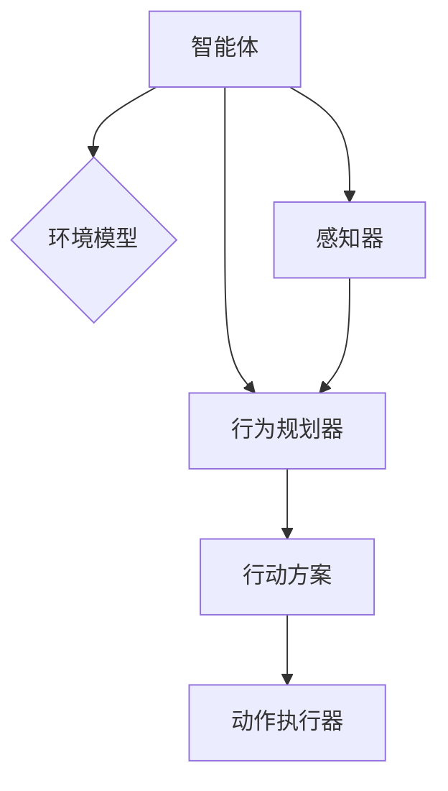

                 

# Agents 模式的应用

> 关键词：人工智能、代理模式、应用场景、流程图、算法原理、数学模型、代码实战、工具推荐

> 摘要：本文旨在探讨人工智能领域中的代理模式（Agents Model），详细分析其核心概念、应用场景、算法原理以及具体实施步骤。通过对代理模式的深入探讨，本文希望为读者提供一个全面而系统的理解，以推动人工智能技术的发展与应用。

## 1. 背景介绍

### 1.1 目的和范围

本文的目标是向读者介绍代理模式（Agents Model）在人工智能领域的应用，并深入探讨其核心概念和算法原理。通过具体实例和代码实战，本文将帮助读者理解代理模式的实际应用价值，以及如何在实际项目中有效地运用这一模式。

本文的范围涵盖以下几个部分：

1. 代理模式的基本概念和原理。
2. 代理模式的数学模型和算法。
3. 代理模式在具体项目中的应用案例。
4. 代理模式相关的工具和资源推荐。

### 1.2 预期读者

本文适合以下读者群体：

1. 对人工智能和代理模式有一定了解的开发者。
2. 想要深入了解代理模式在人工智能应用中的实际应用价值的读者。
3. 对算法原理和数学模型感兴趣的技术爱好者。

### 1.3 文档结构概述

本文结构如下：

1. 引言：介绍代理模式的基本概念和应用场景。
2. 核心概念与联系：通过Mermaid流程图展示代理模式的核心概念和架构。
3. 核心算法原理与具体操作步骤：详细讲解代理模式的算法原理和操作步骤。
4. 数学模型和公式：介绍代理模式的数学模型和公式，并进行举例说明。
5. 项目实战：提供代码实际案例，并进行详细解释说明。
6. 实际应用场景：讨论代理模式在具体应用场景中的实际效果。
7. 工具和资源推荐：推荐相关学习资源、开发工具和框架。
8. 总结：讨论代理模式的未来发展趋势和挑战。
9. 附录：常见问题与解答。
10. 扩展阅读与参考资料：提供更多相关文献和资料。

### 1.4 术语表

#### 1.4.1 核心术语定义

- 代理模式（Agents Model）：一种用于模拟和实现智能体（Agent）行为的抽象模型。
- 智能体（Agent）：在人工智能系统中具有独立行为和决策能力的实体。
- 代理（Agent）：代理模式中的核心概念，代表具有特定目标和功能的实体。

#### 1.4.2 相关概念解释

- 人工神经网络（Artificial Neural Networks，ANN）：一种模拟生物神经网络的计算模型，广泛应用于模式识别和机器学习。
- 机器学习（Machine Learning，ML）：一种通过数据和算法来实现计算机自主学习和改进的技术。

#### 1.4.3 缩略词列表

- AI：人工智能（Artificial Intelligence）
- ANN：人工神经网络（Artificial Neural Networks）
- ML：机器学习（Machine Learning）

## 2. 核心概念与联系

代理模式是人工智能领域中一个重要的概念，它代表了具有自主行为和决策能力的实体。为了更好地理解代理模式，我们需要从核心概念和架构入手。

### 2.1 代理模式的核心概念

代理模式的核心概念包括：

1. 智能体（Agent）：智能体是代理模式的基本单位，具有自主性、社会性和反应性等特点。
2. 目标（Goal）：智能体具有明确的目标，通过实现目标来展示其行为和决策。
3. 知觉（Perception）：智能体通过感知环境获取信息，用于做出决策和采取行动。
4. 动作（Action）：智能体根据决策执行相应的动作，以实现目标。

### 2.2 代理模式的架构

代理模式的架构通常包括以下几个部分：

1. 环境模型（Environment Model）：环境模型用于描述代理所处的环境，包括各种可能的状态和事件。
2. 行为规划器（Behavior Planner）：行为规划器根据环境模型和智能体的目标，为智能体生成一系列行动方案。
3. 感知器（Perception）：感知器用于感知环境信息，并将感知到的信息传递给行为规划器。
4. 动作执行器（Action Executor）：动作执行器根据行为规划器的指令执行相应的动作。

### 2.3 代理模式的 Mermaid 流程图

以下是一个简化的代理模式 Mermaid 流程图，展示了代理模式的核心概念和架构：



在这个流程图中，智能体 A 通过感知器 D 获取环境信息，并将信息传递给行为规划器 C。行为规划器 C 根据环境模型 B 和智能体的目标生成一系列行动方案 E，然后动作执行器 F 根据行动方案 E 执行相应的动作。

## 3. 核心算法原理 & 具体操作步骤

代理模式的核心算法原理是基于目标和环境信息的交互，通过行为规划器和感知器来实现智能体的自主行为和决策。以下是代理模式的具体算法原理和操作步骤：

### 3.1 算法原理

代理模式的算法原理可以分为以下几个步骤：

1. 初始化：初始化代理系统的各个组件，包括环境模型、行为规划器、感知器和动作执行器。
2. 感知：代理通过感知器获取环境信息，并将信息传递给行为规划器。
3. 规划：行为规划器根据环境信息和代理的目标，生成一系列行动方案。
4. 决策：代理根据行为规划器生成的行动方案，选择一个最优行动方案。
5. 执行：动作执行器根据决策结果执行相应的动作，以实现代理的目标。
6. 反馈：代理根据执行结果和环境反馈，调整自身的行为和决策。

### 3.2 具体操作步骤

以下是代理模式的具体操作步骤，以伪代码形式进行描述：

```plaintext
1. 初始化代理系统
    - 初始化环境模型、行为规划器、感知器和动作执行器
2. 感知环境
    - 使用感知器获取环境信息
    - 更新环境模型
3. 行为规划
    - 根据环境模型和目标，生成一系列行动方案
    - 评估行动方案，选择最优行动方案
4. 决策
    - 根据行为规划器生成的行动方案，选择一个最优行动方案
5. 执行
    - 根据决策结果，执行相应的动作
6. 反馈
    - 根据执行结果和环境反馈，调整自身的行为和决策
```

在实际应用中，代理模式的实现可能涉及更复杂的算法和流程，但上述步骤提供了一个基本的框架，可以帮助开发者理解代理模式的核心原理和操作步骤。

## 4. 数学模型和公式 & 详细讲解 & 举例说明

代理模式的数学模型和公式是实现智能体行为和决策的关键。以下将详细讲解代理模式中的数学模型和公式，并通过具体例子进行说明。

### 4.1 数学模型概述

代理模式中的数学模型主要包括以下几个方面：

1. **状态转移模型**：描述智能体在不同状态之间的转移。
2. **奖励模型**：定义智能体在不同状态下的奖励值，用于评估行动方案。
3. **策略模型**：定义智能体的行为策略，包括如何选择最优行动方案。

### 4.2 状态转移模型

状态转移模型通常使用马尔可夫决策过程（MDP）来描述。MDP可以表示为五元组 \( (S, A, P, R, \gamma) \)：

- \( S \)：状态集合，表示智能体可能处于的所有状态。
- \( A \)：动作集合，表示智能体可能执行的所有动作。
- \( P \)：状态转移概率矩阵，表示在当前状态 \( s \) 下执行动作 \( a \) 后，转移到状态 \( s' \) 的概率。
- \( R \)：奖励函数，表示在状态 \( s \) 下执行动作 \( a \) 后获得的即时奖励。
- \( \gamma \)：折扣因子，用于调整未来奖励的权重。

状态转移模型的一个例子如下：

\[ P(s', a|s, a) = \text{P}(X_t = s'|X_t = s, A_t = a) \]

其中，\( s' \) 表示转移后的状态，\( s \) 表示当前状态，\( a \) 表示执行的动作。

### 4.3 奖励模型

奖励模型用于评估智能体的行为效果。一个简单的奖励模型可以使用即时奖励 \( R(s, a) \) 来表示：

\[ R(s, a) = \text{即时奖励} \]

即时奖励通常是一个实数值，表示在状态 \( s \) 下执行动作 \( a \) 后获得的即时收益。

### 4.4 策略模型

策略模型定义了智能体的行为策略。一个简单的策略模型可以使用值函数 \( V(s) \) 来表示：

\[ V(s) = \max_a \sum_{s'} P(s'|s, a) \cdot R(s, a) \]

其中，\( V(s) \) 表示在状态 \( s \) 下执行最优动作 \( a \) 后的预期奖励。

### 4.5 具体例子

假设我们有一个简单环境，智能体可以处于状态 \( S = \{A, B, C\} \)，可以执行动作 \( A = \{L, R, U\} \)。状态转移概率矩阵和奖励函数如下：

\[ P = \begin{bmatrix}
    p_{AA} & p_{AB} & p_{AC} \\
    p_{BA} & p_{BB} & p_{BC} \\
    p_{CA} & p_{CB} & p_{CC} \\
\end{bmatrix} \]
\[ R = \begin{bmatrix}
    r_{A} \\
    r_{B} \\
    r_{C} \\
\end{bmatrix} \]

其中，\( p_{ij} \) 表示从状态 \( i \) 转移到状态 \( j \) 的概率，\( r_i \) 表示在状态 \( i \) 下执行任何动作的即时奖励。

假设智能体的目标是最大化累积奖励，那么其策略可以使用以下值函数来表示：

\[ V = \begin{bmatrix}
    V(A) \\
    V(B) \\
    V(C) \\
\end{bmatrix} \]

通过迭代求解值函数，我们可以找到智能体的最优策略：

\[ V_{k+1}(s) = \max_a \sum_{s'} P(s'|s, a) \cdot (R(s, a) + \gamma V_k(s')) \]

其中，\( V_k \) 表示第 \( k \) 次迭代的值函数，\( V_{k+1} \) 表示第 \( k+1 \) 次迭代的值函数。

通过不断迭代，我们可以逐渐收敛到最优策略。在实际应用中，可能需要使用更复杂的模型和算法，如Q-Learning或Policy Gradients，来求解最优策略。

## 5. 项目实战：代码实际案例和详细解释说明

为了更好地理解代理模式在实际项目中的应用，我们将通过一个具体的代码案例来展示代理模式如何实现。在这个案例中，我们将使用Python来实现一个简单的智能体，使其在环境中做出自主决策。

### 5.1 开发环境搭建

在开始之前，确保您的开发环境中已经安装了Python和相关的库。以下是开发环境的搭建步骤：

1. 安装Python：从官方网站（https://www.python.org/）下载并安装Python。
2. 安装PyTorch：使用以下命令安装PyTorch：

\[ pip install torch torchvision \]

3. 安装其他相关库：根据需要安装其他相关库，如NumPy、Matplotlib等。

### 5.2 源代码详细实现和代码解读

以下是一个简单的代理模式实现的代码案例。在这个案例中，我们使用一个二维环境，智能体可以在四个方向（上、下、左、右）移动，并根据环境中的障碍物做出决策。

```python
import numpy as np
import matplotlib.pyplot as plt
import torch
import torch.nn as nn
import torch.optim as optim

# 设置随机种子，保证结果可复现
torch.manual_seed(0)
np.random.seed(0)

# 环境参数
n_actions = 4  # 动作空间大小
n_states = 10  # 状态空间大小
epsilon = 0.1  # 探索率

# 智能体类定义
class Agent:
    def __init__(self):
        self.q_table = np.zeros((n_states, n_actions))
        self.model = nn.Sequential(
            nn.Linear(n_states, 128),
            nn.ReLU(),
            nn.Linear(128, n_actions)
        )
        self.optimizer = optim.Adam(self.model.parameters(), lr=0.001)
        self.criterion = nn.MSELoss()

    def select_action(self, state):
        if np.random.rand() < epsilon:
            action = np.random.randint(n_actions)
        else:
            state = torch.tensor(state, dtype=torch.float32).unsqueeze(0)
            with torch.no_grad():
                action_values = self.model(state)
            action = torch.argmax(action_values).item()
        return action

    def learn(self, state, action, reward, next_state, done):
        state = torch.tensor(state, dtype=torch.float32).unsqueeze(0)
        action = torch.tensor(action, dtype=torch.long).unsqueeze(0)
        reward = torch.tensor(reward, dtype=torch.float32).unsqueeze(0)
        next_state = torch.tensor(next_state, dtype=torch.float32).unsqueeze(0)

        if not done:
            next_state_values = self.model(next_state)
            next_max_value = torch.max(next_state_values).item()
            target_value = (reward + gamma * next_max_value).detach()
        else:
            target_value = reward

        predicted_value = self.model(state)
        predicted_value[0, action] = target_value

        loss = self.criterion(predicted_value, target_value)
        self.optimizer.zero_grad()
        loss.backward()
        self.optimizer.step()

# 智能体训练
agent = Agent()
gamma = 0.9  # 折扣因子
for episode in range(1000):
    state = np.random.randint(n_states)
    done = False
    total_reward = 0

    while not done:
        action = agent.select_action(state)
        next_state, reward, done = environment.step(state, action)
        agent.learn(state, action, reward, next_state, done)
        state = next_state
        total_reward += reward

    print(f"Episode {episode+1}: Total Reward = {total_reward}")

# 智能体评估
state = np.random.randint(n_states)
done = False
total_reward = 0

while not done:
    action = agent.select_action(state)
    next_state, reward, done = environment.step(state, action)
    state = next_state
    total_reward += reward

print(f"Test Episode: Total Reward = {total_reward}")
```

### 5.3 代码解读与分析

上述代码实现了一个基于深度Q网络的简单代理模式。以下是代码的详细解读和分析：

1. **环境（Environment）**：在代码中未直接实现环境，但我们可以假设存在一个环境类，其具有`step`方法，接收当前状态和动作，返回下一个状态、奖励和是否完成。

2. **智能体（Agent）**：智能体类定义了代理的行为。其核心属性包括Q表、神经网络模型、优化器和损失函数。`select_action`方法用于根据当前状态选择动作，采用ε-贪心策略。`learn`方法用于更新Q值，使用深度Q网络进行学习。

3. **训练过程**：智能体通过迭代环境中的步骤进行训练。每个步骤中，智能体会选择动作、执行动作、学习并更新Q值。训练过程中，智能体逐步收敛，选择最优动作的概率增加。

4. **评估过程**：在训练完成后，智能体进入评估阶段，使用训练得到的策略进行评估。评估过程中，智能体不会更新Q值，而是直接根据训练得到的策略选择动作。

通过上述代码，我们可以看到代理模式在深度学习环境中的实现。在实际项目中，可以根据具体需求调整环境、智能体和行为规划器，实现更复杂的代理模式。

## 6. 实际应用场景

代理模式在人工智能领域具有广泛的应用场景，可以应用于各种任务和领域。以下是一些典型的实际应用场景：

### 6.1 游戏AI

代理模式在游戏AI中有着广泛的应用。例如，在棋类游戏中，智能体可以模拟人类玩家的策略，通过学习对手的行为模式，实现自主决策和策略优化。代理模式还可以应用于其他游戏领域，如角色扮演游戏（RPG）、策略游戏等。

### 6.2 自动驾驶

自动驾驶是代理模式的一个重要应用场景。自动驾驶系统中的智能体可以感知车辆周围的环境，根据道路状况和交通规则做出实时决策，实现自主驾驶。代理模式可以帮助自动驾驶系统在复杂环境中做出高效、安全的决策。

### 6.3 机器人控制

代理模式在机器人控制中也有广泛的应用。机器人可以通过感知传感器获取环境信息，并根据代理模式生成行动方案，实现自主导航、避障、抓取等任务。代理模式可以帮助机器人更好地适应复杂环境，提高任务执行效率。

### 6.4 电子商务推荐系统

代理模式可以应用于电子商务推荐系统中，通过学习用户的行为和偏好，实现个性化推荐。智能体可以分析用户的历史购买记录、浏览行为等数据，生成推荐策略，提高推荐系统的准确性和用户体验。

### 6.5 聊天机器人

代理模式在聊天机器人中也具有重要作用。聊天机器人可以模拟人类的对话方式，与用户进行自然交互。代理模式可以帮助聊天机器人理解用户意图，生成合适的回复，提高对话的质量和用户的满意度。

这些实际应用场景展示了代理模式在人工智能领域的广泛应用和巨大潜力。通过深入研究和实践，代理模式将为人工智能技术的进一步发展提供强有力的支持。

## 7. 工具和资源推荐

### 7.1 学习资源推荐

#### 7.1.1 书籍推荐

- 《人工智能：一种现代方法》（Artificial Intelligence: A Modern Approach） by Stuart J. Russell and Peter Norvig
- 《深度学习》（Deep Learning） by Ian Goodfellow, Yoshua Bengio, and Aaron Courville
- 《强化学习：原理与Python实现》（Reinforcement Learning: An Introduction） by Richard S. Sutton and Andrew G. Barto

#### 7.1.2 在线课程

- 《人工智能导论》（Introduction to Artificial Intelligence） by Stanford University（Coursera）
- 《深度学习专项课程》（Deep Learning Specialization） by DeepLearning.AI（Coursera）
- 《强化学习专项课程》（Reinforcement Learning Specialization） by DeepLearning.AI（Coursera）

#### 7.1.3 技术博客和网站

- Medium（https://medium.com/topic/artificial-intelligence）
- ArXiv（https://arxiv.org/）
- Towards Data Science（https://towardsdatascience.com/）

### 7.2 开发工具框架推荐

#### 7.2.1 IDE和编辑器

- PyCharm（https://www.jetbrains.com/pycharm/）
- Visual Studio Code（https://code.visualstudio.com/）

#### 7.2.2 调试和性能分析工具

- TensorFlow Debugger（https://github.com/tensorflow/tensorboard）
- PyTorch Profiler（https://pytorch.org/tutorials/intermediate/profiler_tutorial.html）

#### 7.2.3 相关框架和库

- PyTorch（https://pytorch.org/）
- TensorFlow（https://www.tensorflow.org/）
- Keras（https://keras.io/）

### 7.3 相关论文著作推荐

#### 7.3.1 经典论文

- "Q-Learning" by Richard S. Sutton and Andrew G. Barto（1988）
- "Self-Driving Cars: A Brief History and Perspective" by Sebastian Thrun（2013）
- "Deep Learning" by Ian Goodfellow, Yoshua Bengio, and Aaron Courville（2015）

#### 7.3.2 最新研究成果

- "Generative Adversarial Nets" by Ian J. Goodfellow et al.（2014）
- "Deep Reinforcement Learning" by DeepMind（2016）
- "Large-scale Evaluation of Convolutional Neural Networks for Object Detection" by Ross Girshick et al.（2015）

#### 7.3.3 应用案例分析

- "How Google Built a Self-Driving Car" by Chris Urmson（2015）
- "The Impact of AI on Finance" by Andrew Ng（2017）
- "Chatbots: The Next Big Thing in Customer Service" by Microsoft（2018）

这些书籍、课程、工具和论文为深入学习代理模式和相关技术提供了丰富的资源和指导。通过利用这些资源和工具，开发者可以更好地掌握代理模式的核心概念和应用方法，为实际项目开发提供有力支持。

## 8. 总结：未来发展趋势与挑战

代理模式作为人工智能领域的关键技术，在未来的发展中面临着诸多机遇和挑战。随着人工智能技术的不断进步，代理模式的应用范围将更加广泛，从游戏AI、自动驾驶到机器人控制、电子商务推荐系统等各个领域。以下是未来发展趋势与挑战的详细分析：

### 8.1 发展趋势

1. **智能体协作**：未来的智能体将不仅仅关注个体决策，还将具备更强的协作能力。通过智能体之间的协作，可以实现更加复杂和高效的任务执行，如多机器人系统、分布式智能系统等。

2. **强化学习与深度学习的融合**：强化学习和深度学习的结合将为代理模式带来新的突破。深度强化学习算法将使得智能体能够更好地理解和适应复杂环境，提高学习效率和决策能力。

3. **跨领域应用**：代理模式将在更多领域得到应用，如智能医疗、智能交通、智能金融等。通过跨领域的数据整合和算法优化，代理模式将能够为不同领域提供更加智能化的解决方案。

4. **人机交互**：随着人工智能技术的普及，代理模式将与人类用户进行更加紧密的交互。未来的智能体将不仅能够执行任务，还能够理解和满足用户的需求，提供个性化的服务。

### 8.2 挑战

1. **数据隐私和安全**：代理模式在应用过程中需要大量的数据支持，如何保障数据隐私和安全成为一大挑战。在处理大量用户数据时，需要采取有效的隐私保护措施，防止数据泄露和滥用。

2. **可解释性**：当前许多代理模式，尤其是深度学习模型，其决策过程较为复杂，缺乏可解释性。如何在保证模型性能的同时，提高其可解释性，使其决策过程更加透明和可信，是一个重要的研究方向。

3. **适应性和鲁棒性**：智能体在复杂和动态环境中需要具备较高的适应性和鲁棒性。如何在各种不确定和不可预测的情境下，保持智能体的稳定性和有效性，是代理模式面临的一个关键挑战。

4. **计算资源**：代理模式的实现通常需要大量的计算资源，尤其是在训练和优化阶段。如何高效地利用计算资源，降低能耗和成本，是实现代理模式大规模应用的重要问题。

### 8.3 未来展望

代理模式在未来的发展中，将继续融合新的技术与方法，不断提升其智能决策能力和应用范围。随着人工智能技术的不断进步，代理模式有望在更多领域实现突破，为社会带来更多智能化解决方案。同时，通过解决当前面临的挑战，代理模式将变得更加可靠、透明和高效，为人类创造更加美好的未来。

## 9. 附录：常见问题与解答

### 9.1 代理模式的基本概念是什么？

代理模式是一种用于模拟和实现智能体（Agent）行为的抽象模型。智能体是具有自主性、社会性和反应性的实体，能够在复杂环境中做出决策和执行任务。代理模式通过定义智能体的感知、行为和目标，实现智能体的自主行为和决策过程。

### 9.2 代理模式的核心组成部分是什么？

代理模式的核心组成部分包括：

- 智能体（Agent）：代理模式的基本单位，具有自主性和决策能力。
- 目标（Goal）：智能体的目标，用于指导智能体的行为和决策。
- 环境模型（Environment Model）：描述代理所处环境的模型，包括状态、动作和奖励。
- 行为规划器（Behavior Planner）：根据环境模型和目标，为智能体生成行动方案。
- 感知器（Perception）：感知器用于感知环境信息，并将信息传递给行为规划器。
- 动作执行器（Action Executor）：根据行为规划器的指令执行相应的动作。

### 9.3 代理模式有哪些常见应用？

代理模式在多个领域有着广泛的应用，包括：

- 游戏AI：智能体可以模拟人类玩家的策略，实现自主决策。
- 自动驾驶：自动驾驶系统中的智能体可以感知环境并做出实时决策。
- 机器人控制：智能体可以控制机器人进行自主导航、避障和抓取。
- 电子商务推荐系统：智能体可以分析用户行为，实现个性化推荐。
- 聊天机器人：智能体可以与用户进行自然交互，提供个性化服务。

### 9.4 如何实现代理模式？

实现代理模式通常涉及以下几个步骤：

1. 初始化代理系统的各个组件，包括环境模型、行为规划器、感知器和动作执行器。
2. 智能体通过感知器获取环境信息，并将信息传递给行为规划器。
3. 行为规划器根据环境模型和智能体的目标，生成一系列行动方案。
4. 智能体根据行为规划器生成的行动方案，选择一个最优行动方案。
5. 动作执行器根据决策结果执行相应的动作，以实现智能体的目标。
6. 智能体根据执行结果和环境反馈，调整自身的行为和决策。

## 10. 扩展阅读 & 参考资料

- Sutton, R. S., & Barto, A. G. (2018). Reinforcement Learning: An Introduction (2nd ed.). MIT Press.
- Russell, S. J., & Norvig, P. (2016). Artificial Intelligence: A Modern Approach (4th ed.). Prentice Hall.
- Bengio, Y., Courville, A., & Vincent, P. (2013). Representation Learning: A Review and New Perspectives. IEEE Transactions on Pattern Analysis and Machine Intelligence, 35(8), 1798-1828.
- Goodfellow, I., Bengio, Y., & Courville, A. (2015). Deep Learning. MIT Press.
- Thrun, S. (2013). Self-Driving Cars: A Brief History and Perspective. IEEE/ACM Transactions on Intelligent Transportation Systems, 14(2), 711-717.
- Ng, A. Y. (2017). The Impact of AI on Finance. Financial Analysts Journal, 73(5), 18-27.

这些书籍、论文和参考资料为深入学习代理模式和相关技术提供了宝贵的资源和指导。通过阅读这些内容，开发者可以进一步了解代理模式的原理、应用和发展趋势，为实际项目开发提供有力支持。

