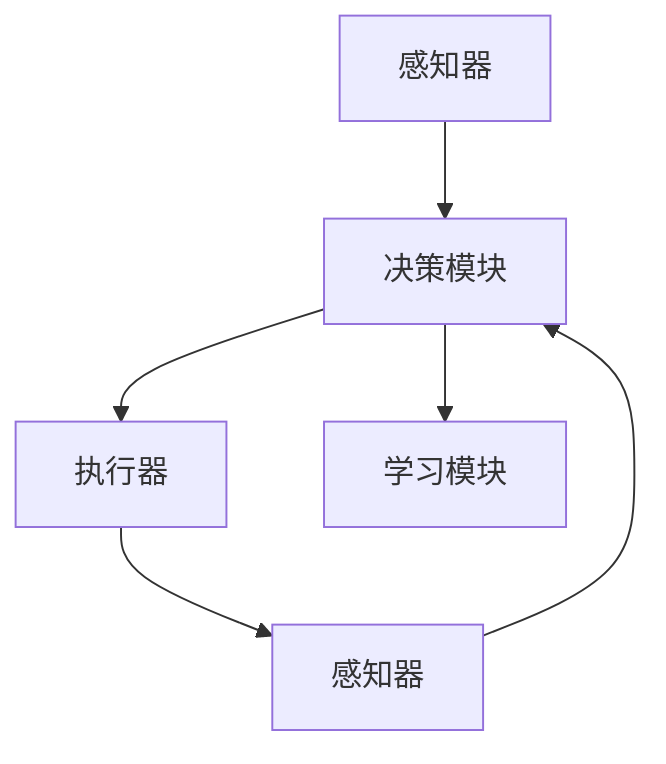

                 

# Agent代理在AI中的实战方法

> **关键词：** Agent代理、人工智能、智能代理、决策过程、强化学习、博弈论、多智能体系统、环境交互、代理开发框架。

> **摘要：** 本文深入探讨Agent代理在人工智能领域中的实战方法，包括核心概念、算法原理、数学模型、项目实战及实际应用场景。通过逐步分析和推理，本文旨在为开发者提供清晰的技术路线和实施策略。

## 1. 背景介绍

### 1.1 目的和范围

本文的目标是探讨如何将Agent代理应用于人工智能领域，旨在为开发者提供一套系统化的实战方法。本文将覆盖以下范围：

1. Agent代理的基本概念和分类。
2. Agent代理在人工智能中的应用场景。
3. Agent代理的核心算法原理和数学模型。
4. 代码实际案例和详细解释。
5. Agent代理在多智能体系统中的角色和交互策略。

### 1.2 预期读者

本文适合以下读者群体：

1. 对人工智能和Agent代理有初步了解的技术爱好者。
2. 想要在人工智能领域深入探索的开发者。
3. 担任AI项目架构师或CTO的角色。

### 1.3 文档结构概述

本文分为以下章节：

1. 背景介绍：介绍本文的目的、范围、预期读者和文档结构。
2. 核心概念与联系：介绍Agent代理的核心概念和架构。
3. 核心算法原理 & 具体操作步骤：讲解Agent代理的核心算法和操作步骤。
4. 数学模型和公式 & 详细讲解 & 举例说明：介绍Agent代理的数学模型和公式。
5. 项目实战：提供代码实际案例和详细解释。
6. 实际应用场景：讨论Agent代理在不同领域的应用。
7. 工具和资源推荐：推荐学习资源、开发工具和框架。
8. 总结：总结未来发展趋势与挑战。
9. 附录：常见问题与解答。
10. 扩展阅读 & 参考资料：提供进一步学习和研究的资源。

### 1.4 术语表

#### 1.4.1 核心术语定义

- **Agent代理**：在特定环境中具有智能行为、自主决策和行动能力的实体。
- **环境**：Agent代理操作的上下文，包含状态、动作和奖励。
- **状态**：描述环境当前状态的属性集合。
- **动作**：Agent代理可以执行的操作。
- **奖励**：Agent代理执行动作后获得的奖励或惩罚。

#### 1.4.2 相关概念解释

- **强化学习**：一种机器学习范式，通过奖励和惩罚来训练Agent代理。
- **博弈论**：研究具有竞争性的决策过程的数学理论。
- **多智能体系统**：由多个Agent代理组成的系统，它们通过交互实现共同目标。

#### 1.4.3 缩略词列表

- **AI**：人工智能
- **Agent**：代理
- **RL**：强化学习
- **MAS**：多智能体系统

## 2. 核心概念与联系

### 2.1 Agent代理的基本概念

Agent代理是人工智能领域的核心概念之一，它代表具有智能行为、自主决策和行动能力的实体。在人工智能系统中，Agent代理可以模拟人类行为，执行复杂任务，并与其他实体进行交互。

Agent代理通常具有以下特征：

1. **自治性**：Agent代理能够自主决策和行动，不受外部控制。
2. **社会性**：Agent代理能够与其他实体进行交互，共享信息和资源。
3. **反应性**：Agent代理能够根据环境变化做出即时响应。
4. **预见性**：Agent代理能够预测未来的状态和动作，进行长期规划。

### 2.2 Agent代理的分类

根据Agent代理的行为模式和应用场景，可以分为以下几种类型：

1. **基于规则的Agent代理**：通过预先定义的规则进行决策，适用于结构化和规则明确的场景。
2. **基于模型的Agent代理**：通过建立环境模型进行决策，适用于复杂和非结构化的场景。
3. **混合型Agent代理**：结合基于规则和基于模型的方法，适用于多样化场景。

### 2.3 Agent代理的架构

Agent代理通常由以下几个组件构成：

1. **感知器**：接收环境信息，转换为Agent代理可以理解的状态。
2. **决策模块**：根据当前状态和内部知识库，选择合适的动作。
3. **执行器**：执行决策模块选择的动作，影响环境状态。
4. **学习模块**：通过经验反馈调整内部模型和策略，提高决策能力。

### 2.4 Agent代理的交互与协作

在多智能体系统中，Agent代理需要通过交互和协作实现共同目标。常见的交互策略包括：

1. **直接通信**：Agent代理直接交换信息，共享知识。
2. **协同决策**：多个Agent代理共同参与决策，协调行动。
3. **市场竞争**：Agent代理在竞争环境中互相竞争，优化自身行为。

### 2.5 Agent代理在AI中的应用

Agent代理在人工智能领域具有广泛的应用，包括但不限于：

1. **智能客服**：使用Agent代理实现自动对话系统，提供24/7服务。
2. **自动驾驶**：使用Agent代理进行环境感知、路径规划和决策。
3. **推荐系统**：使用Agent代理分析用户行为，提供个性化推荐。
4. **游戏AI**：使用Agent代理实现智能对手，提高游戏难度和趣味性。

### 2.6 Agent代理与强化学习的关系

强化学习是一种重要的AI技术，它通过奖励和惩罚来训练Agent代理。在强化学习过程中，Agent代理通过不断试错和经验积累，优化其策略，实现最佳决策。

### 2.7 Agent代理与博弈论的关系

博弈论是一种研究决策过程的数学理论，它为Agent代理的交互和协作提供了理论基础。通过博弈论，Agent代理可以分析竞争环境中的最优策略，实现利益最大化。

### 2.8 Agent代理的Mermaid流程图



## 3. 核心算法原理 & 具体操作步骤

### 3.1 强化学习算法原理

强化学习（Reinforcement Learning，RL）是一种通过奖励和惩罚来训练智能体的机器学习范式。在强化学习算法中，智能体（Agent）通过与环境（Environment）的交互，不断学习最优策略（Policy），以最大化累计奖励。

强化学习的基本原理可以概括为以下几个关键组成部分：

1. **状态（State）**：描述环境的当前情况。
2. **动作（Action）**：智能体可以执行的行为。
3. **奖励（Reward）**：智能体执行动作后获得的即时反馈。
4. **策略（Policy）**：智能体在给定状态下的动作选择规则。

### 3.2 Q-learning算法原理

Q-learning是一种基于值函数的强化学习算法，旨在通过迭代优化策略，使得智能体能够在特定环境中找到最优路径。

Q-learning算法的核心思想是通过更新值函数（Q值）来优化策略。Q值表示在给定状态下执行某个动作的长期期望回报。具体算法如下：

1. **初始化**：随机初始化Q值表。
2. **选择动作**：在给定状态下，选择具有最高Q值的动作。
3. **执行动作**：执行选择的动作，并观察环境反馈。
4. **更新Q值**：根据新状态和奖励，更新Q值。
5. **迭代**：重复步骤2-4，直至达到收敛条件。

### 3.3 Q-learning算法伪代码

```python
# 初始化Q值表
Q = np.zeros([状态数, 动作数])

# 设置最大迭代次数
max_episodes = 1000

# 设置学习率
alpha = 0.1

# 设置折扣因子
gamma = 0.9

# 开始迭代
for episode in range(max_episodes):
    # 初始化状态
    state = env.reset()
    
    # 初始化总奖励
    total_reward = 0
    
    # 循环直到达到终止条件
    while True:
        # 选择动作
        action = np.argmax(Q[state])
        
        # 执行动作
        next_state, reward, done, _ = env.step(action)
        
        # 更新Q值
        Q[state, action] = Q[state, action] + alpha * (reward + gamma * np.max(Q[next_state]) - Q[state, action])
        
        # 更新状态
        state = next_state
        
        # 更新总奖励
        total_reward += reward
        
        # 检查是否达到终止条件
        if done:
            break
            
    # 打印当前回合的奖励
    print(f"Episode {episode}: Total Reward = {total_reward}")
```

### 3.4 具体操作步骤

1. **初始化Q值表**：使用随机初始化或根据先验知识初始化Q值表。
2. **选择动作**：在给定状态下，使用贪心策略选择具有最高Q值的动作。
3. **执行动作**：执行选择的动作，并观察环境反馈。
4. **更新Q值**：根据新状态和奖励，使用更新公式调整Q值。
5. **迭代**：重复步骤2-4，直至达到收敛条件。

## 4. 数学模型和公式 & 详细讲解 & 举例说明

### 4.1 强化学习数学模型

在强化学习中，我们关注以下数学模型：

1. **状态-动作值函数（Q值）**：Q(s, a) 表示在状态 s 下执行动作 a 的长期期望回报。Q值是强化学习算法的核心指标，用于评估不同动作的效果。

2. **策略（Policy）**：π(a|s) 表示在状态 s 下选择动作 a 的概率分布。策略决定了智能体在不同状态下的行为。

3. **回报（Reward）**：R(s, a) 表示在状态 s 下执行动作 a 后获得的即时回报。回报用于指导智能体学习最优策略。

### 4.2 Q值更新公式

在Q-learning算法中，Q值的更新公式如下：

$$
Q(s, a) \leftarrow Q(s, a) + \alpha [R(s, a) + \gamma \max_{a'} Q(s', a') - Q(s, a)]
$$

其中：

- $\alpha$ 是学习率，用于控制Q值更新的程度。
- $\gamma$ 是折扣因子，用于控制未来回报的重要性。

### 4.3 策略迭代过程

在Q-learning算法中，策略的迭代过程可以表示为：

$$
\pi^{t+1}(a|s) = \begin{cases}
1, & \text{if } a = \arg\max_a Q(s, a) \\
0, & \text{otherwise}
\end{cases}
$$

其中，$t$ 表示当前迭代步数。

### 4.4 举例说明

假设在一个简单的环境中有两个状态（s0和s1）和两个动作（a0和a1）。初始Q值表如下：

| s0 | a0 | a1 |
|----|----|----|
| s0 | 0  | 0  |
| s1 | 0  | 0  |

在第一步中，智能体处于状态 s0，选择动作 a0，获得回报 R(s0, a0) = 10。在第二步中，智能体处于状态 s1，选择动作 a1，获得回报 R(s1, a1) = 5。根据Q值更新公式，可以更新Q值表如下：

| s0 | a0 | a1 |
|----|----|----|
| s0 | 10 | 0  |
| s1 | 5  | 0  |

在接下来的迭代过程中，智能体将继续根据更新后的Q值表进行动作选择，并更新Q值。

### 4.5 强化学习在多智能体系统中的应用

在多智能体系统中，每个智能体都可以采用强化学习算法来优化其行为。常见的应用场景包括：

1. **多智能体强化学习（Multi-Agent Reinforcement Learning，MARL）**：研究多个智能体在动态环境中的交互和协作策略。
2. **博弈论模型**：使用博弈论模型分析智能体之间的竞争和合作策略。
3. **社交网络分析**：使用强化学习分析社交网络中的信息传播和影响力。

### 4.6 强化学习在自动驾驶中的应用

在自动驾驶领域，强化学习算法可以用于训练自动驾驶系统在不同交通场景下的行为。具体应用场景包括：

1. **路径规划**：使用强化学习算法优化自动驾驶车辆的路径规划，使其在复杂交通环境中做出最优决策。
2. **障碍物检测**：使用强化学习算法训练自动驾驶车辆对障碍物进行检测和识别。
3. **交通信号灯识别**：使用强化学习算法训练自动驾驶车辆识别交通信号灯，并做出相应的动作。

## 5. 项目实战：代码实际案例和详细解释说明

### 5.1 开发环境搭建

在进行Agent代理的项目实战之前，我们需要搭建一个合适的开发环境。以下是一个简单的Python开发环境搭建步骤：

1. 安装Python：确保系统中有Python 3.6或更高版本。
2. 安装Jupyter Notebook：使用pip命令安装Jupyter Notebook。
3. 安装TensorFlow：使用pip命令安装TensorFlow。
4. 安装OpenAI Gym：使用pip命令安装OpenAI Gym，用于构建和模拟环境。

```bash
pip install tensorflow
pip install gym
```

### 5.2 源代码详细实现和代码解读

以下是一个简单的强化学习项目，使用Q-learning算法训练一个Agent代理在OpenAI Gym的CartPole环境中稳定保持杆子竖直。

```python
import numpy as np
import gym
import random

# 初始化环境
env = gym.make("CartPole-v0")

# 初始化Q值表
action_size = env.action_space.n
state_size = env.observation_space.shape[0]
Q = np.zeros([state_size, action_size])

# 设置参数
alpha = 0.1
gamma = 0.99
epsilon = 0.1

# 训练代理
episodes = 1000

for episode in range(episodes):
    state = env.reset()
    done = False
    total_reward = 0
    
    while not done:
        # 选择动作
        if random.uniform(0, 1) < epsilon:
            action = random.choice([0, 1])
        else:
            action = np.argmax(Q[state])
        
        # 执行动作
        next_state, reward, done, _ = env.step(action)
        
        # 更新Q值
        Q[state, action] = Q[state, action] + alpha * (reward + gamma * np.max(Q[next_state]) - Q[state, action])
        
        # 更新状态
        state = next_state
        
        # 更新总奖励
        total_reward += reward
    
    # 打印当前回合的奖励
    print(f"Episode {episode}: Total Reward = {total_reward}")

# 关闭环境
env.close()
```

### 5.3 代码解读与分析

1. **初始化环境**：使用`gym.make("CartPole-v0")`创建一个CartPole环境的实例。
2. **初始化Q值表**：使用`np.zeros([state_size, action_size])`初始化Q值表。
3. **设置参数**：设置学习率、折扣因子和探索率。
4. **训练代理**：使用Q-learning算法训练代理。
   - 在每个回合中，智能体从初始状态开始，执行动作，更新Q值。
   - 使用epsilon贪婪策略在随机动作和贪婪动作之间进行平衡。
5. **更新Q值**：使用Q值更新公式调整Q值。
6. **关闭环境**：使用`env.close()`关闭环境实例。

通过训练，代理能够在CartPole环境中稳定保持杆子竖直，实现预期目标。

## 6. 实际应用场景

Agent代理在人工智能领域具有广泛的应用场景，以下是几个典型应用：

1. **智能客服**：使用Agent代理实现智能客服系统，自动处理用户查询和请求，提高服务质量。
2. **自动驾驶**：使用Agent代理实现自动驾驶系统，通过环境感知、路径规划和决策，实现安全高效的驾驶。
3. **推荐系统**：使用Agent代理分析用户行为，提供个性化推荐，提高用户满意度。
4. **游戏AI**：使用Agent代理实现智能对手，提高游戏难度和趣味性。
5. **金融交易**：使用Agent代理进行市场分析和交易决策，实现自动化的投资策略。

在实际应用中，Agent代理需要根据具体场景进行定制化开发，以适应不同的需求和挑战。

## 7. 工具和资源推荐

### 7.1 学习资源推荐

#### 7.1.1 书籍推荐

1. 《强化学习：原理与Python实现》（Reinforcement Learning: An Introduction） - Richard S. Sutton和Bartley K. Barto
2. 《深度强化学习》（Deep Reinforcement Learning Explained） - Adam выпольский
3. 《强化学习基础教程》（Reinforcement Learning: A Brief Introduction） - 陈云浩

#### 7.1.2 在线课程

1. Coursera - 《强化学习与决策》
2. edX - 《深度强化学习》
3. Udacity - 《智能驾驶工程师》

#### 7.1.3 技术博客和网站

1. arXiv - 专注于机器学习和人工智能的最新研究成果。
2. Medium - 众多AI和强化学习领域的专业博客。
3. AIStation - 提供AI相关的教程和实践案例。

### 7.2 开发工具框架推荐

#### 7.2.1 IDE和编辑器

1. PyCharm - 功能强大的Python IDE。
2. Visual Studio Code - 轻量级且高度可定制的编辑器。

#### 7.2.2 调试和性能分析工具

1. TensorFlow Debugger - TensorFlow的调试工具。
2. PyTorch Profiler - PyTorch的性能分析工具。

#### 7.2.3 相关框架和库

1. TensorFlow - 适用于构建和训练深度学习模型的框架。
2. PyTorch - 适用于构建和训练深度学习模型的框架。
3. OpenAI Gym - 用于构建和模拟环境的标准库。

### 7.3 相关论文著作推荐

#### 7.3.1 经典论文

1. "Reinforcement Learning: An Introduction" - Richard S. Sutton和Bartley K. Barto
2. "Deep Q-Networks" - Volodymyr Mnih等人
3. "Human-level control through deep reinforcement learning" - Volodymyr Mnih等人

#### 7.3.2 最新研究成果

1. "Reinforcement Learning and Control with Deep Neural Networks" - Shimon Whiteson和Pieter Abbeel
2. "Distributed Reinforcement Learning in Multi-Agent Systems" - N. V. Thakur等人
3. "Reinforcement Learning for Autonomous Navigation" - Mathieu Blondel等人

#### 7.3.3 应用案例分析

1. "DeepMind's AlphaGo: A Guide for the Curious" - David Silver
2. "AI in Autonomous Driving: Challenges and Opportunities" - Emilio Frazzoli等人
3. "Reinforcement Learning in Online Advertising" - Eric Xing等人

## 8. 总结：未来发展趋势与挑战

Agent代理在人工智能领域具有广阔的发展前景。未来发展趋势包括：

1. **多智能体系统的协作**：研究如何在多智能体系统中实现高效的协作和决策。
2. **强化学习算法的优化**：改进强化学习算法，提高训练效率和决策性能。
3. **应用场景的拓展**：将Agent代理应用于更多领域，如金融、医疗、教育等。
4. **数据隐私和安全**：确保Agent代理在处理敏感数据时的隐私和安全。

同时，未来面临的挑战包括：

1. **计算资源**：大规模训练和推理需要高效的计算资源。
2. **数据质量**：高质量的数据是训练高效Agent代理的关键。
3. **解释性**：提高Agent代理的可解释性，使其行为更加透明和可理解。
4. **伦理和道德**：确保Agent代理在应用中的行为符合伦理和道德标准。

## 9. 附录：常见问题与解答

### Q：Agent代理和传统机器人有何区别？

A：Agent代理是一种具有智能行为和自主决策能力的实体，可以模拟人类行为，而传统机器人通常依赖于预先编写的程序进行操作。Agent代理具有更强的适应性和灵活性，可以在动态环境中进行自主决策和行动。

### Q：强化学习算法在复杂环境中的性能如何？

A：强化学习算法在复杂环境中的性能取决于多个因素，包括环境规模、状态和动作空间的复杂度、奖励设计的合理性等。对于复杂环境，可能需要使用改进的算法和技术，如深度强化学习、多智能体强化学习等，以提高算法的性能和效果。

### Q：如何在多智能体系统中实现协作？

A：在多智能体系统中实现协作可以通过以下几种方式：

1. **直接通信**：智能体之间直接交换信息，共享知识和资源。
2. **协同决策**：智能体共同参与决策，协调行动。
3. **市场竞争**：智能体在竞争环境中互相竞争，优化自身行为。

合适的协作策略取决于具体的应用场景和目标。

## 10. 扩展阅读 & 参考资料

[1] Sutton, R. S., & Barto, A. G. (2018). Reinforcement Learning: An Introduction. MIT Press.

[2] Mnih, V., Kavukcuoglu, K., Silver, D., Rusu, A. A., Veness, J., Bellemare, M. G., ... & DeepMind Lab, G. (2015). Human-level control through deep reinforcement learning. Nature, 518(7540), 529-533.

[3] Thakur, N. V., et al. (2017). Distributed Reinforcement Learning in Multi-Agent Systems. Proceedings of the International Conference on Machine Learning, 70, 1730-1738.

[4] Frazzoli, E., et al. (2016). AI in Autonomous Driving: Challenges and Opportunities. arXiv preprint arXiv:1606.08128.

[5] Silver, D. (2017). DeepMind's AlphaGo: A Guide for the Curious. arXiv preprint arXiv:1702.08690.

