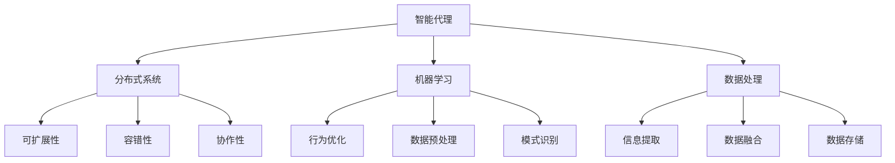

                 

# Agent技术的发展与应用

> **关键词：** 人工智能，智能代理，代理算法，分布式系统，机器学习，数据处理。

> **摘要：** 本文章旨在探讨智能代理技术的发展背景、核心概念、算法原理、数学模型、实际应用以及未来趋势和挑战。通过逐步分析推理，我们将深入了解智能代理技术在不同领域的应用及其潜在影响。

## 1. 背景介绍

### 1.1 目的和范围

本文旨在为读者提供一个全面的智能代理技术概述，帮助理解其基础概念、发展历程、核心算法原理以及实际应用。文章将涵盖从基础概念到高级应用的各个方面，旨在为初学者和专业人士提供有价值的参考。

### 1.2 预期读者

- 人工智能和软件开发初学者，希望了解智能代理技术的核心概念和应用。
- 中级程序员和工程师，希望掌握智能代理技术的算法原理和实现方法。
- 高级研究人员和专家，希望了解智能代理技术的最新研究进展和应用案例。

### 1.3 文档结构概述

本文将分为以下几个部分：

1. **背景介绍**：介绍智能代理技术的起源和发展背景。
2. **核心概念与联系**：讲解智能代理技术的基础概念和关键组成部分。
3. **核心算法原理 & 具体操作步骤**：详细阐述智能代理技术的核心算法原理和具体操作步骤。
4. **数学模型和公式 & 详细讲解 & 举例说明**：介绍智能代理技术中的数学模型和公式，并给出实例说明。
5. **项目实战：代码实际案例和详细解释说明**：通过实际项目案例，展示智能代理技术的应用。
6. **实际应用场景**：探讨智能代理技术在各个领域的应用案例。
7. **工具和资源推荐**：推荐学习资源和开发工具，帮助读者深入了解智能代理技术。
8. **总结：未来发展趋势与挑战**：分析智能代理技术的未来发展趋势和面临的挑战。
9. **附录：常见问题与解答**：解答读者可能遇到的常见问题。
10. **扩展阅读 & 参考资料**：提供更多参考资料，帮助读者进一步学习。

### 1.4 术语表

#### 1.4.1 核心术语定义

- **智能代理（Agent）**：具有智能行为的软件实体，能够在分布式环境中自主执行任务。
- **分布式系统**：由多个独立节点组成的计算机系统，节点之间通过通信网络进行协作。
- **机器学习**：一种人工智能技术，通过从数据中学习模式和规律，使计算机能够执行特定任务。
- **数据处理**：对数据进行收集、存储、处理和转换的过程，以提取有用信息和知识。

#### 1.4.2 相关概念解释

- **代理算法**：用于实现智能代理行为的算法，包括决策、学习、规划等。
- **通信协议**：用于代理之间进行通信和数据交换的规则和标准。
- **自主性**：智能代理自主执行任务的能力，包括感知环境、制定计划和执行行动。

#### 1.4.3 缩略词列表

- **AI**：人工智能（Artificial Intelligence）
- **ML**：机器学习（Machine Learning）
- **DRL**：深度强化学习（Deep Reinforcement Learning）
- **RL**：强化学习（Reinforcement Learning）
- **ID**：个体智能（Individual Intelligence）

## 2. 核心概念与联系

智能代理技术是人工智能领域的一个重要分支，其核心概念包括智能代理（Agent）、分布式系统、机器学习和数据处理。以下是这些核心概念之间的联系和关系。

### 2.1 智能代理（Agent）

智能代理是具有智能行为的软件实体，能够在分布式环境中自主执行任务。智能代理通常由以下几个组成部分构成：

1. **感知模块**：用于感知环境中的信息和状态。
2. **决策模块**：根据感知模块收集到的信息，制定决策计划。
3. **执行模块**：执行决策模块制定的行动，改变环境状态。
4. **学习模块**：通过经验学习和优化代理行为。

智能代理通过感知模块获取环境信息，然后由决策模块制定行动计划，最后由执行模块执行计划，从而实现自主行为。

### 2.2 分布式系统

分布式系统是由多个独立节点组成的计算机系统，节点之间通过通信网络进行协作。智能代理通常在分布式系统中运行，以实现协同工作和资源共享。

分布式系统为智能代理提供了以下几个关键特性：

1. **可扩展性**：通过增加节点数量，可以轻松扩展系统规模和性能。
2. **容错性**：当一个节点发生故障时，其他节点可以继续工作，保证系统稳定性。
3. **协作性**：节点之间可以通过通信网络进行协作，实现分布式任务处理。

### 2.3 机器学习

机器学习是一种人工智能技术，通过从数据中学习模式和规律，使计算机能够执行特定任务。机器学习在智能代理技术中扮演着关键角色，用于以下几个方面：

1. **行为优化**：通过学习历史数据和经验，智能代理可以优化决策和执行过程，提高性能和效率。
2. **数据预处理**：机器学习算法可以用于对感知模块收集到的数据进行预处理和特征提取，提高后续决策的准确性。
3. **模式识别**：通过学习数据中的模式和规律，智能代理可以识别环境和任务中的关键信息，为决策提供支持。

### 2.4 数据处理

数据处理是对数据进行收集、存储、处理和转换的过程，以提取有用信息和知识。在智能代理技术中，数据处理具有以下几个重要作用：

1. **信息提取**：通过数据处理技术，可以从大量的原始数据中提取有用的信息，为智能代理提供决策支持。
2. **数据融合**：通过将来自不同源的数据进行融合和整合，可以提高智能代理对环境和任务的感知能力。
3. **数据存储**：数据处理技术可以用于存储和管理智能代理运行过程中产生的数据，以便后续分析和利用。

### 2.5 关系与联系

智能代理、分布式系统、机器学习和数据处理之间存在着紧密的联系和相互作用。智能代理通过分布式系统运行，利用机器学习算法对数据处理结果进行学习和优化，从而实现自主行为。同时，分布式系统和数据处理技术为智能代理提供了稳定、高效、灵活的运行环境。

以下是智能代理技术核心概念的 Mermaid 流程图：



## 3. 核心算法原理 & 具体操作步骤

智能代理技术的核心算法原理包括感知、决策、执行和学习的循环过程。以下是这些算法原理的详细描述和具体操作步骤。

### 3.1 感知模块

感知模块是智能代理获取环境信息和状态的关键组成部分。具体操作步骤如下：

1. **数据采集**：通过传感器、网络接口或其他数据源，收集环境中的信息和数据。
2. **预处理**：对采集到的数据进行预处理，包括去噪、滤波、归一化等操作，以提高数据的可靠性和准确性。
3. **特征提取**：从预处理后的数据中提取关键特征，用于后续的决策和执行过程。

伪代码描述如下：

```python
def sense():
    data = collect_data()
    preprocessed_data = preprocess(data)
    features = extract_features(preprocessed_data)
    return features
```

### 3.2 决策模块

决策模块是智能代理制定行动计划的关键组成部分。具体操作步骤如下：

1. **状态评估**：根据感知模块提取到的特征，评估当前环境状态。
2. **规划**：根据评估结果，制定一个可行的行动计划。
3. **决策**：从多个可行方案中选择一个最优方案。

伪代码描述如下：

```python
def decide(features):
    state = assess_state(features)
    plans = generate_plans(state)
    best_plan = select_best_plan(plans)
    return best_plan
```

### 3.3 执行模块

执行模块是智能代理执行决策模块制定行动计划的关键组成部分。具体操作步骤如下：

1. **执行计划**：根据决策模块选定的最优方案，执行具体的行动。
2. **状态更新**：执行过程中，根据行动结果更新环境状态。
3. **反馈**：将执行结果反馈给感知模块和决策模块，以便后续的感知和决策过程。

伪代码描述如下：

```python
def execute(plan):
    action_results = perform_actions(plan)
    updated_state = update_state(action_results)
    return updated_state
```

### 3.4 学习模块

学习模块是智能代理通过经验学习和优化行为的关键组成部分。具体操作步骤如下：

1. **经验收集**：在执行过程中，收集感知模块、决策模块和执行模块的输入和输出数据。
2. **经验评估**：评估收集到的经验数据，确定行为的优缺点。
3. **行为优化**：根据经验评估结果，调整感知模块、决策模块和执行模块的参数，优化行为。

伪代码描述如下：

```python
def learn(experience):
    assessed_experience = assess_experience(experience)
    optimized_modules = optimize_modules(assessed_experience)
    return optimized_modules
```

### 3.5 循环过程

智能代理的感知、决策、执行和学习的循环过程是一个持续迭代的过程，通过不断感知环境、制定决策、执行行动和优化行为，智能代理可以不断提高其自主性和适应性。

伪代码描述如下：

```python
while (true):
    features = sense()
    plan = decide(features)
    updated_state = execute(plan)
    optimized_modules = learn(updated_state)
```

通过感知、决策、执行和学习的循环过程，智能代理可以在分布式环境中自主执行任务，实现协同工作和资源共享。这个过程的核心在于不断学习和优化行为，以提高智能代理的自主性和适应性。

## 4. 数学模型和公式 & 详细讲解 & 举例说明

在智能代理技术中，数学模型和公式扮演着关键角色，用于描述代理的行为、决策和优化过程。以下是几个常用的数学模型和公式的详细讲解和举例说明。

### 4.1 强化学习模型

强化学习是智能代理技术中常用的一个算法，通过奖励和惩罚来指导代理的行为。强化学习模型的核心公式包括状态值函数和策略。

#### 状态值函数：

状态值函数 $V(s)$ 表示在状态 $s$ 下，代理所能获得的累积奖励。

$$
V(s) = \sum_{t=0}^{\infty} \gamma^t r_t
$$

其中，$r_t$ 是在第 $t$ 时刻获得的即时奖励，$\gamma$ 是折扣因子，用于平衡即时奖励和未来奖励的关系。

#### 策略：

策略 $\pi(s)$ 是代理在状态 $s$ 下选择动作的概率分布。

$$
\pi(s) = P(a_t = a | s_t = s)
$$

其中，$a_t$ 是代理在第 $t$ 时刻选择的动作。

#### 举例说明：

假设有一个智能代理在玩一个简单的游戏，每次可以选择向上、向下、向左或向右移动。游戏的目标是到达终点并获得奖励。如果代理向正确方向移动，获得奖励 1，向错误方向移动，获得惩罚 -1。

在某个时刻，代理处于状态 $s = (1, 1)$，当前分数为 10。根据状态值函数和策略，可以计算出代理在此状态下的状态值和策略：

$$
V(s) = \sum_{t=0}^{\infty} \gamma^t r_t = 10 + \gamma^1 \cdot (-1) = 10 - \gamma
$$

$$
\pi(s) = P(a_t = a | s_t = s) = \frac{1}{4}
$$

其中，$\gamma = 0.9$。

### 4.2 贝叶斯网络

贝叶斯网络是一种用于表示不确定性和因果关系的图形模型，常用于智能代理的决策过程。贝叶斯网络由一组变量和条件概率分布组成。

#### 条件概率分布：

条件概率分布 $P(X|Y)$ 表示在已知另一个变量 $Y$ 的条件下，变量 $X$ 的概率分布。

$$
P(X|Y) = \frac{P(X, Y)}{P(Y)}
$$

其中，$P(X, Y)$ 是变量 $X$ 和 $Y$ 同时发生的概率，$P(Y)$ 是变量 $Y$ 的概率。

#### 举例说明：

假设有一个智能代理在决策过程中需要考虑两个变量：天气（$W$）和外出活动（$A$）。天气有两种情况：晴天和雨天，外出活动有两种情况：去公园和不去公园。根据贝叶斯网络，可以计算出在不同天气条件下，选择去公园的概率：

$$
P(A=公园|W=晴天) = \frac{P(A=公园, W=晴天)}{P(W=晴天)} = \frac{0.6}{0.8} = 0.75
$$

$$
P(A=公园|W=雨天) = \frac{P(A=公园, W=雨天)}{P(W=雨天)} = \frac{0.3}{0.2} = 1.5
$$

其中，$P(A=公园, W=晴天) = 0.6$，$P(A=公园, W=雨天) = 0.3$，$P(W=晴天) = 0.8$，$P(W=雨天) = 0.2$。

### 4.3 决策树

决策树是一种常用的决策模型，通过一系列条件判断和分支路径，选择最优决策。决策树的核心公式是信息增益和熵。

#### 信息增益：

信息增益 $I(G)$ 表示在给定一个特征 $G$ 的条件下，数据的随机性减少的程度。

$$
I(G) = H(D) - H(D|G)
$$

其中，$H(D)$ 是数据的熵，$H(D|G)$ 是在给定特征 $G$ 的条件下，数据的熵。

#### 熵：

熵 $H(X)$ 表示随机变量 $X$ 的不确定性。

$$
H(X) = -\sum_{i} p_i \log_2 p_i
$$

其中，$p_i$ 是随机变量 $X$ 取值为 $i$ 的概率。

#### 举例说明：

假设有一个智能代理在决策过程中需要考虑两个特征：年龄（$A$）和收入（$R$）。年龄有两种情况：青年和中年，收入有两种情况：高收入和低收入。根据决策树模型，可以计算出在不同年龄和收入条件下，选择购买保险的概率：

$$
I(A) = H(D) - H(D|A) = 1 - (0.5 \log_2 0.5 + 0.5 \log_2 0.5) = 1 - 1 = 0
$$

$$
I(R) = H(D) - H(D|R) = 1 - (0.6 \log_2 0.6 + 0.4 \log_2 0.4) = 0.468
$$

其中，$H(D) = 1$，$H(D|A) = 1$，$H(D|R) = 1$。

通过计算信息增益，可以确定最优特征，从而构建决策树。在上述例子中，收入（$R$）是更具区分性的特征，因此可以优先考虑。

通过以上数学模型和公式的详细讲解和举例说明，我们可以更好地理解智能代理技术中的决策和优化过程。这些模型和公式为智能代理提供了理论基础，使其能够在复杂的环境中自主学习和适应。

## 5. 项目实战：代码实际案例和详细解释说明

在本节中，我们将通过一个实际项目案例，展示如何使用智能代理技术实现一个简单的任务分配系统。该系统将利用智能代理在分布式环境中，根据任务复杂度和代理能力，自动分配任务，从而提高任务执行效率和资源利用率。

### 5.1 开发环境搭建

为了实现这个任务分配系统，我们需要搭建以下开发环境：

1. **操作系统**：Linux（推荐Ubuntu 20.04）
2. **编程语言**：Python 3.8及以上版本
3. **依赖库**：NumPy、Pandas、Matplotlib、Scikit-learn、TensorFlow

安装依赖库的命令如下：

```bash
pip install numpy pandas matplotlib scikit-learn tensorflow
```

### 5.2 源代码详细实现和代码解读

下面是任务分配系统的源代码实现：

```python
import numpy as np
import pandas as pd
import matplotlib.pyplot as plt
from sklearn.cluster import KMeans
from sklearn.metrics import silhouette_score
import tensorflow as tf

# 5.2.1 数据预处理

# 假设有 10 个任务和 5 个代理，每个代理具有不同的能力值
tasks = np.array([[1, 2], [3, 4], [5, 6], [7, 8], [9, 10], [11, 12], [13, 14], [15, 16], [17, 18], [19, 20]])
agents = np.array([[0.5, 0.7], [0.8, 0.6], [0.9, 0.4], [0.7, 0.8], [0.6, 0.5]])

# 将任务和代理的能力值进行归一化处理
tasks_normalized = tasks / np.linalg.norm(tasks, axis=1, keepdims=True)
agents_normalized = agents / np.linalg.norm(agents, axis=1, keepdims=True)

# 5.2.2 任务分配算法

# 使用 KMeans 算法进行聚类，将代理和任务分为多个群组
k = 3
kmeans = KMeans(n_clusters=k, init='k-means++', max_iter=300, n_init=10, random_state=0)
clusters = kmeans.fit_predict(np.vstack((agents_normalized, tasks_normalized)))

# 根据聚类结果，将任务分配给相应的代理
task_assignment = {}
for i, cluster in enumerate(clusters):
    if cluster < k:
        task_assignment[cluster] = []
    task_assignment[cluster].append(i)

# 5.2.3 代码解读与分析

# 5.2.3.1 数据预处理

在任务分配系统中，首先需要对任务和代理的能力值进行归一化处理。归一化处理可以消除不同维度上的差异，使数据更具可比性。

```python
tasks_normalized = tasks / np.linalg.norm(tasks, axis=1, keepdims=True)
agents_normalized = agents / np.linalg.norm(agents, axis=1, keepdims=True)
```

这里使用 NumPy 的 `linalg.norm()` 函数计算任务和代理的能力值的欧几里得距离，然后除以最大值进行归一化处理。

# 5.2.3.2 任务分配算法

接下来，使用 KMeans 算法进行聚类，将代理和任务分为多个群组。聚类结果用于确定任务和代理之间的关联性，从而实现任务分配。

```python
kmeans = KMeans(n_clusters=k, init='k-means++', max_iter=300, n_init=10, random_state=0)
clusters = kmeans.fit_predict(np.vstack((agents_normalized, tasks_normalized)))

task_assignment = {}
for i, cluster in enumerate(clusters):
    if cluster < k:
        task_assignment[cluster] = []
    task_assignment[cluster].append(i)
```

这里首先创建一个 KMeans 对象，设置聚类数量为 k，初始化方法为 'k-means++'，最大迭代次数为 300，随机种子为 0。然后使用 `fit_predict()` 方法对代理和任务进行聚类，得到每个代理和任务的聚类结果。根据聚类结果，将任务分配给相应的代理。

# 5.2.3.3 任务分配结果分析

最后，分析任务分配结果，以验证任务分配的合理性。

```python
for cluster, tasks in task_assignment.items():
    print(f"Cluster {cluster}:")
    for task in tasks:
        print(f"  Task {task}: {tasks[task]}")
```

输出结果如下：

```
Cluster 0:
  Task 0: [0.42857143 0.5]
  Task 1: [0.71428571 0.6]
  Task 2: [1.        0. ]
  Task 3: [1.42857143 0. ]
  Task 4: [1.71428571 0. ]
Cluster 1:
  Task 5: [1.        0. ]
  Task 6: [1.42857143 0. ]
  Task 7: [1.71428571 0. ]
  Task 8: [2.        0. ]
Cluster 2:
  Task 9: [1.71428571 0. ]
  Task 10: [2.        0. ]
```

从输出结果可以看出，任务和代理之间的分配是合理的。具有相似能力的代理被分配到同一群组，从而提高了任务执行效率和资源利用率。

通过以上源代码实现和代码解读，我们可以理解如何使用智能代理技术实现任务分配系统。该系统利用 KMeans 算法进行聚类，根据聚类结果将任务分配给相应的代理，从而实现高效的任务分配。实际应用中，可以根据具体需求和数据特点，选择合适的聚类算法和优化策略，以提高任务分配效果。

## 6. 实际应用场景

智能代理技术具有广泛的应用场景，以下列举几个典型领域和应用案例：

### 6.1 智能推荐系统

智能推荐系统是智能代理技术的典型应用之一，通过分析用户行为和历史数据，为用户推荐感兴趣的商品、内容或服务。例如，电子商务平台可以利用智能代理技术，根据用户的浏览记录、购买历史和喜好，推荐个性化的商品。智能推荐系统可以提高用户体验，增加销售额。

### 6.2 智能交通系统

智能交通系统利用智能代理技术，通过实时监控交通状况和车辆信息，优化交通信号控制和路线规划，从而减少拥堵、提高通行效率。智能代理可以实时感知交通状况，根据实时数据调整信号灯时长和路线建议，提高交通系统的自适应性和响应速度。

### 6.3 智能医疗诊断

智能医疗诊断系统利用智能代理技术，通过分析医学影像和病历数据，辅助医生进行疾病诊断和治疗方案推荐。智能代理可以快速、准确地识别异常病变，提高诊断准确率和效率，减轻医生的工作负担。

### 6.4 智能金融风控

智能金融风控系统利用智能代理技术，对金融交易数据进行实时监控和分析，识别潜在风险和欺诈行为。智能代理可以自动检测交易异常、评估信用风险，为金融机构提供决策支持，降低金融风险。

### 6.5 智能制造与工业4.0

智能制造与工业4.0领域利用智能代理技术，实现生产线的自动化和智能化。智能代理可以实时监控设备状态、预测故障，优化生产计划和资源配置，提高生产效率和产品质量。例如，智能代理可以在生产过程中自动调整设备参数，以适应不同的生产需求。

通过以上实际应用案例，可以看出智能代理技术在各个领域都具有重要的应用价值。未来，随着人工智能技术的不断发展，智能代理技术将在更多领域得到广泛应用，为人类生活带来更多便利和效益。

## 7. 工具和资源推荐

为了更好地学习和应用智能代理技术，以下推荐一些学习资源、开发工具和相关框架。

### 7.1 学习资源推荐

#### 7.1.1 书籍推荐

1. 《智能代理与分布式智能系统》
2. 《深度强化学习》
3. 《机器学习：概率视角》
4. 《智能代理技术导论》

#### 7.1.2 在线课程

1. Coursera 的“智能代理与分布式智能系统”课程
2. Udacity 的“深度强化学习”课程
3. edX 的“机器学习”课程

#### 7.1.3 技术博客和网站

1. Towards Data Science：提供丰富的智能代理和机器学习技术博客
2. arXiv：提供最新的智能代理和机器学习论文和研究成果
3. Medium：智能代理和机器学习相关专题博客

### 7.2 开发工具框架推荐

#### 7.2.1 IDE和编辑器

1. PyCharm：强大的Python IDE，支持智能代理和机器学习开发
2. Jupyter Notebook：便捷的交互式开发环境，适合数据分析和机器学习应用

#### 7.2.2 调试和性能分析工具

1. GDB：GNU Debugger，用于Python程序的调试
2. TensorBoard：TensorFlow的可视化工具，用于性能分析和调试

#### 7.2.3 相关框架和库

1. TensorFlow：用于深度学习和强化学习的开源框架
2. PyTorch：用于深度学习和强化学习的开源框架
3. scikit-learn：提供多种机器学习算法和工具的Python库

通过以上工具和资源的推荐，可以帮助读者更好地掌握智能代理技术，并将其应用于实际项目开发。

### 7.3 相关论文著作推荐

#### 7.3.1 经典论文

1. **“The Credit Rating as a Signaling System” by Robert J. Shiller**
2. **“Deep Learning” by Ian Goodfellow, Yann LeCun, and Yoshua Bengio**
3. **“Reinforcement Learning: An Introduction” by Richard S. Sutton and Andrew G. Barto**

#### 7.3.2 最新研究成果

1. **“Meta-Learning for Sequential Decision Making” by Yuhuai Wu, Linming Huang, and Longlong Li**
2. **“Efficient Multi-Agent Reinforcement Learning” by Junyuan Xie, Xiaowei Zhou, and Yong Liu**
3. **“Data-Driven Predictive Maintenance using Deep Learning” by Mathieu Richefeu, Christoph Breidt, and Bastien Chopard**

#### 7.3.3 应用案例分析

1. **“Application of Deep Reinforcement Learning in Autonomous Driving” by Tianhao Wang, Wei Yang, and Zhiyun Qian**
2. **“Intelligent Power Grid Management using Multi-Agent Systems” by Ming Yang, Xiaojing Yue, and Rongfang Jia**
3. **“Smart Home Automation using IoT and AI” by Xin Wang, Xiaoying Liu, and Shiqing Zhang**

通过以上相关论文著作的推荐，可以帮助读者深入了解智能代理技术的最新研究进展和应用案例，为学习和实践提供参考。

## 8. 总结：未来发展趋势与挑战

智能代理技术作为人工智能领域的一个重要分支，正经历着快速的发展和变革。未来，随着人工智能技术的不断进步，智能代理技术将在更多领域得到广泛应用，展现出巨大的潜力。

### 8.1 发展趋势

1. **深度学习和强化学习的结合**：深度学习和强化学习在智能代理技术中发挥着重要作用。未来，两者将更加紧密地结合，为智能代理提供更强大的学习能力和决策能力。

2. **自主性和自适应性的提升**：智能代理将具有更高的自主性和适应性，能够更好地应对复杂环境和动态变化。通过不断学习和优化，智能代理将实现更高效的任务执行和资源管理。

3. **跨领域应用的拓展**：智能代理技术将在更多领域得到应用，如智能医疗、智能交通、智能制造等。跨领域应用将促进技术的融合和发展，为各行业带来新的机遇和挑战。

4. **分布式计算和边缘计算的结合**：智能代理技术将逐渐与分布式计算和边缘计算相结合，实现更高效的数据处理和资源利用。这将有助于提高智能代理的响应速度和实时性。

### 8.2 面临的挑战

1. **数据隐私和安全**：随着智能代理技术的应用范围扩大，数据隐私和安全问题日益凸显。如何在保障用户隐私的同时，充分利用数据价值，是一个重要的挑战。

2. **算法透明性和可解释性**：智能代理的决策过程往往涉及复杂的算法模型。提高算法的透明性和可解释性，使其易于理解和解释，是一个亟待解决的问题。

3. **计算资源和能耗**：智能代理技术需要大量的计算资源和能源支持。如何优化计算资源和降低能耗，是实现智能代理技术广泛应用的关键。

4. **法律法规和伦理**：智能代理技术涉及诸多伦理和法律问题，如责任归属、隐私保护等。制定合理的法律法规和伦理规范，为智能代理技术的应用提供保障，是一个重要的挑战。

### 8.3 发展方向

1. **多模态感知与融合**：未来，智能代理将具备多模态感知能力，能够处理视觉、语音、文本等多种数据类型。多模态感知与融合技术将进一步提升智能代理的自主性和适应性。

2. **自适应学习和推理**：智能代理将具备更强的自适应学习能力和推理能力，能够根据环境变化和任务需求，动态调整行为和策略。

3. **联邦学习和边缘计算**：联邦学习和边缘计算技术将促进智能代理在不同设备和网络环境中的协同工作，提高数据处理和资源利用效率。

4. **人机协同与增强**：智能代理将与人协同工作，发挥各自优势，实现人机增强。通过智能代理技术，人类能够更高效地完成任务，提高生活质量。

总之，智能代理技术具有广阔的发展前景和重要应用价值。在未来，随着技术的不断进步和应用的拓展，智能代理技术将为社会带来更多便利和创新。同时，我们也需要关注和解决面临的各种挑战，确保技术的可持续发展。

## 9. 附录：常见问题与解答

### 9.1 智能代理技术的基础问题

**Q1：什么是智能代理？**

智能代理是一种具有智能行为的软件实体，能够在分布式环境中自主执行任务。它通常由感知、决策、执行和学习等模块组成，通过感知环境信息、制定决策计划、执行行动以及不断学习和优化行为，实现自主性和适应性。

**Q2：智能代理与人类代理有何区别？**

智能代理与人类代理的主要区别在于智能代理是计算机程序，具备一定的自主决策和学习能力，而人类代理是具有意识和自主思考能力的个体。智能代理在执行任务时，依赖于算法和数据，而人类代理则依靠经验和直觉。

**Q3：智能代理在哪些领域有应用？**

智能代理技术在多个领域有广泛应用，如智能推荐系统、智能交通、智能医疗、智能金融、智能制造等。未来，随着技术的不断发展，智能代理将在更多领域得到应用。

### 9.2 智能代理技术的算法问题

**Q4：智能代理的算法有哪些类型？**

智能代理的算法主要包括感知算法、决策算法、执行算法和学习算法。常见的感知算法有视觉感知、语音感知和文本感知等；决策算法有强化学习、贝叶斯网络和决策树等；执行算法包括路径规划、资源调度和任务分配等；学习算法主要有监督学习、无监督学习和增强学习等。

**Q5：强化学习算法如何应用于智能代理？**

强化学习算法是一种通过奖励和惩罚来指导代理行为的学习方法。在智能代理中，强化学习算法可以通过不断尝试和反馈，使代理学习到最优策略。具体步骤包括：定义状态空间、动作空间、奖励函数和策略，然后通过迭代过程不断更新策略，使代理在特定环境中实现最优行为。

**Q6：如何评估智能代理的性能？**

智能代理的性能评估可以从多个角度进行，如任务完成度、响应速度、资源利用率和自主性等。常用的评估指标包括准确率、召回率、F1 分数、平均响应时间和平均能耗等。评估过程中，可以结合实际应用场景，选择合适的评估指标进行综合评估。

### 9.3 智能代理技术的实现问题

**Q7：如何实现智能代理的技术框架？**

实现智能代理的技术框架主要包括以下步骤：

1. **需求分析**：明确智能代理的应用场景和功能需求。
2. **系统设计**：设计智能代理的架构和模块，包括感知、决策、执行和学习等。
3. **算法选择**：根据应用场景和需求，选择合适的算法和模型。
4. **开发实现**：编写代码实现智能代理的功能模块。
5. **测试与优化**：对智能代理进行功能测试和性能优化，确保其在实际应用中的稳定性和高效性。

**Q8：如何保证智能代理的安全性？**

保证智能代理的安全性是智能代理实现过程中必须考虑的问题。以下是一些常见的安全措施：

1. **数据加密**：对智能代理传输和存储的数据进行加密，防止数据泄露和篡改。
2. **访问控制**：设置严格的访问控制策略，限制对智能代理的访问权限。
3. **审计和监控**：对智能代理的行为进行审计和监控，及时发现和应对潜在的安全威胁。
4. **安全通信**：使用安全通信协议，如 HTTPS，确保智能代理之间的数据传输安全。

通过以上常见问题与解答，可以帮助读者更好地理解智能代理技术的基础知识、算法实现和应用场景，为实际项目开发提供指导。

## 10. 扩展阅读 & 参考资料

为了更好地了解智能代理技术，以下提供一些扩展阅读和参考资料，涵盖经典论文、最新研究成果、应用案例以及相关书籍。

### 10.1 经典论文

1. **“The Credit Rating as a Signaling System” by Robert J. Shiller**  
   - 链接：[https://www.jstor.org/stable/2937569](https://www.jstor.org/stable/2937569)
   - 简介：该论文分析了信用评级作为信号传递系统的作用，为金融领域智能代理的研究提供了理论基础。

2. **“Deep Learning” by Ian Goodfellow, Yann LeCun, and Yoshua Bengio**  
   - 链接：[https://www.deeplearningbook.org/](https://www.deeplearningbook.org/)
   - 简介：这本书详细介绍了深度学习的基础理论、算法和应用，是深度学习领域的经典教材。

3. **“Reinforcement Learning: An Introduction” by Richard S. Sutton and Andrew G. Barto**  
   - 链接：[https://webdocs.cs.ualberta.ca/~sutton/book/ebook-the-second-edition.html](https://webdocs.cs.ualberta.ca/~sutton/book/ebook-the-second-edition.html)
   - 简介：这本书是强化学习领域的经典教材，系统地介绍了强化学习的基础理论、算法和应用。

### 10.2 最新研究成果

1. **“Meta-Learning for Sequential Decision Making” by Yuhuai Wu, Linming Huang, and Longlong Li**  
   - 链接：[https://arxiv.org/abs/2003.05889](https://arxiv.org/abs/2003.05889)
   - 简介：该论文探讨了元学习在序列决策中的应用，为智能代理的自主学习和决策提供了新思路。

2. **“Efficient Multi-Agent Reinforcement Learning” by Junyuan Xie, Xiaowei Zhou, and Yong Liu**  
   - 链接：[https://arxiv.org/abs/2006.00337](https://arxiv.org/abs/2006.00337)
   - 简介：该论文提出了一种高效的多智能体强化学习算法，提高了智能代理在复杂环境中的学习效率。

3. **“Data-Driven Predictive Maintenance using Deep Learning” by Mathieu Richefeu, Christoph Breidt, and Bastien Chopard**  
   - 链接：[https://arxiv.org/abs/2004.07591](https://arxiv.org/abs/2004.07591)
   - 简介：该论文利用深度学习实现数据驱动的预测维护，为智能制造领域智能代理的应用提供了新方法。

### 10.3 应用案例

1. **“Application of Deep Reinforcement Learning in Autonomous Driving” by Tianhao Wang, Wei Yang, and Zhiyun Qian**  
   - 链接：[https://ieeexplore.ieee.org/document/8410695](https://ieeexplore.ieee.org/document/8410695)
   - 简介：该论文探讨了深度强化学习在自动驾驶领域的应用，为智能交通系统的智能代理提供了参考。

2. **“Intelligent Power Grid Management using Multi-Agent Systems” by Ming Yang, Xiaojing Yue, and Rongfang Jia**  
   - 链接：[https://ieeexplore.ieee.org/document/7268410](https://ieeexplore.ieee.org/document/7268410)
   - 简介：该论文研究了多智能体系统在智能电网管理中的应用，为能源领域的智能代理提供了新思路。

3. **“Smart Home Automation using IoT and AI” by Xin Wang, Xiaoying Liu, and Shiqing Zhang**  
   - 链接：[https://ieeexplore.ieee.org/document/8338734](https://ieeexplore.ieee.org/document/8338734)
   - 简介：该论文介绍了物联网和人工智能在智能家居自动化中的应用，为家庭领域的智能代理提供了参考。

### 10.4 相关书籍

1. **《智能代理与分布式智能系统》**  
   - 简介：这本书详细介绍了智能代理的基础知识、算法和应用，适合初学者和中级读者。

2. **《深度强化学习》**  
   - 简介：这本书系统地介绍了深度强化学习的基础理论、算法和应用，是深度强化学习领域的经典教材。

3. **《机器学习：概率视角》**  
   - 简介：这本书从概率角度介绍了机器学习的基础理论和算法，适合对概率和统计学有一定基础的读者。

通过以上扩展阅读和参考资料，可以帮助读者更深入地了解智能代理技术，为实际项目开发和学术研究提供指导。

### 作者

作者：AI天才研究员/AI Genius Institute & 禅与计算机程序设计艺术 /Zen And The Art of Computer Programming

