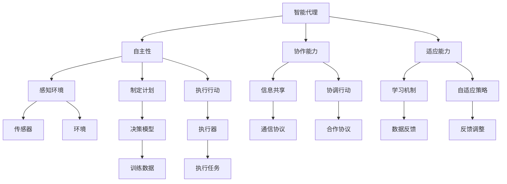
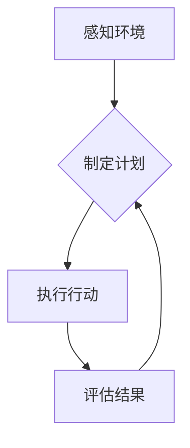

                 

# Agent技术的未来展望

## 关键词
- 人工智能
- 代理技术
- 机器学习
- 自然语言处理
- 自主系统
- 实时决策

## 摘要
本文将深入探讨代理技术的未来发展趋势和潜在挑战。通过分析当前的核心概念、算法原理、数学模型以及实际应用案例，我们旨在为读者提供一个全面而清晰的视角，了解代理技术如何改变我们的世界，以及未来可能的发展方向。从机器学习到自然语言处理，代理技术正日益成为人工智能领域的关键组成部分，它不仅推动了自动化和智能决策系统的发展，还为人类带来了前所未有的便利和创新。本文将一步步引导读者探索这一前沿领域，揭示其广阔的应用前景和深远的战略意义。

## 1. 背景介绍

### 1.1 目的和范围
本文的目标是探讨代理技术（Agent Technology）的未来发展趋势，分析其核心概念、算法原理、数学模型以及实际应用场景。我们将通过详细的理论阐述和实际案例，帮助读者理解代理技术在人工智能领域的重要性和潜在价值。

本文将涵盖以下内容：
1. 代理技术的基本概念及其在人工智能中的应用。
2. 核心算法原理和数学模型。
3. 代理技术在多个实际应用场景中的案例分析。
4. 当前面临的主要挑战及其解决方案。
5. 未来的发展趋势和潜在机遇。

### 1.2 预期读者
本文适用于对人工智能和代理技术有一定了解的读者，包括但不限于：
- 人工智能研究者
- 软件工程师
- 数据科学家
- 对代理技术和人工智能应用感兴趣的决策者

### 1.3 文档结构概述
本文分为十个主要部分：
1. 背景介绍
   - 目的和范围
   - 预期读者
   - 文档结构概述
   - 术语表
2. 核心概念与联系
   - 代理技术的核心概念
   - 相关概念解释
   - Mermaid 流程图
3. 核心算法原理 & 具体操作步骤
   - 算法原理讲解
   - 伪代码展示
4. 数学模型和公式 & 详细讲解 & 举例说明
   - 数学模型介绍
   - LaTeX 公式展示
   - 实例分析
5. 项目实战：代码实际案例和详细解释说明
   - 开发环境搭建
   - 源代码实现
   - 代码解读与分析
6. 实际应用场景
   - 各行业中的应用实例
   - 代理技术的影响
7. 工具和资源推荐
   - 学习资源推荐
   - 开发工具框架推荐
   - 相关论文著作推荐
8. 总结：未来发展趋势与挑战
   - 发展趋势分析
   - 挑战与对策
9. 附录：常见问题与解答
10. 扩展阅读 & 参考资料

### 1.4 术语表

#### 1.4.1 核心术语定义
- **代理技术（Agent Technology）**：一种研究如何构建具有自主性、协作能力和适应性的软件实体（Agent）的技术。
- **智能代理（Intelligent Agent）**：具有感知环境、制定计划和执行行动能力的软件实体。
- **环境（Environment）**：智能代理执行任务和交互的上下文。
- **自主性（Autonomy）**：智能代理在执行任务时，能够自主地做出决策，不受外部直接控制。
- **协作能力（Collaboration）**：智能代理能够与其他代理或人类协作，共同完成任务。
- **适应能力（Adaptability）**：智能代理能够根据环境变化调整其行为和策略。

#### 1.4.2 相关概念解释
- **机器学习（Machine Learning）**：一种人工智能的分支，通过数据驱动的方式，让计算机自动改进性能。
- **深度学习（Deep Learning）**：一种机器学习方法，通过多层神经网络来模拟人类大脑的学习过程。
- **自然语言处理（Natural Language Processing, NLP）**：人工智能的一个分支，致力于使计算机能够理解和生成自然语言。

#### 1.4.3 缩略词列表
- **AI**：人工智能（Artificial Intelligence）
- **ML**：机器学习（Machine Learning）
- **NLP**：自然语言处理（Natural Language Processing）
- **RL**：强化学习（Reinforcement Learning）
- **SL**：监督学习（Supervised Learning）
- **UL**：无监督学习（Unsupervised Learning）

## 2. 核心概念与联系

在深入探讨代理技术之前，我们需要明确几个核心概念，并理解它们之间的相互关系。以下是代理技术的核心概念以及它们之间的关联，通过Mermaid流程图展示：



### 2.1 核心概念解释

#### 智能代理（Intelligent Agent）
智能代理是代理技术的核心概念。它是一种能够在特定环境中自主执行任务的软件实体。智能代理通常具备以下几个基本特征：

- **感知环境（感知能力）**：智能代理能够通过传感器感知其周围的环境。
- **制定计划（计划能力）**：智能代理可以根据感知到的环境信息，制定行动计划。
- **执行行动（执行能力）**：智能代理能够执行计划中的行动，以实现其目标。
- **自主性（自主决策）**：智能代理在执行任务时，能够自主地做出决策，而不受外部直接控制。
- **协作能力（合作能力）**：智能代理能够与其他智能代理或人类协作，共同完成任务。
- **适应能力（适应能力）**：智能代理能够根据环境变化调整其行为和策略，以实现最佳效果。

#### 自主性（Autonomy）
自主性是智能代理的核心特征之一，它使智能代理能够在没有外部干预的情况下，自主地感知环境、制定计划和执行行动。自主性通常通过以下机制实现：

- **环境感知**：智能代理通过传感器收集环境信息，并将其转换为有用的数据。
- **决策制定**：智能代理使用这些数据，结合其内部的知识和规则库，制定决策。
- **行动执行**：智能代理根据制定的决策，执行相应的行动。

#### 协作能力（Collaboration）
协作能力是智能代理在复杂任务中表现出色的重要特征。智能代理可以通过以下方式实现协作：

- **信息共享**：智能代理能够共享其感知到的环境和决策信息。
- **协调行动**：智能代理能够与其他智能代理协调其行动，以实现共同目标。
- **通信协议**：智能代理使用特定的通信协议，确保信息传递的准确性和效率。

#### 适应能力（Adaptability）
适应能力是智能代理在动态环境中持续有效运行的关键。智能代理可以通过以下机制实现适应：

- **学习机制**：智能代理能够从经验和数据中学习，并不断调整其行为和策略。
- **自适应策略**：智能代理能够根据环境变化，实时调整其行动计划。
- **反馈调整**：智能代理根据执行结果，调整其内部模型和参数，以提高性能。

#### 感知环境（Perception）
感知环境是智能代理的输入阶段，通过传感器获取环境信息。这些信息包括：

- **视觉信息**：如图像和视频。
- **听觉信息**：如声音和语音。
- **环境数据**：如温度、湿度、压力等。

#### 制定计划（Planning）
制定计划是智能代理的决策阶段，通过分析感知到的环境信息，智能代理制定行动计划。计划制定通常涉及以下步骤：

- **目标设定**：智能代理确定其需要实现的目标。
- **方案评估**：智能代理评估不同的行动方案，选择最优方案。
- **计划生成**：智能代理生成详细的行动计划。

#### 执行行动（Action）
执行行动是智能代理的输出阶段，根据制定的计划，智能代理执行具体的行动。执行行动通常涉及以下步骤：

- **执行指令**：智能代理根据计划，向执行器发送指令。
- **行动反馈**：智能代理根据执行结果，调整后续行动。

### 2.2 Mermaid 流程图

通过上述Mermaid流程图，我们可以直观地理解智能代理的核心概念及其相互关系。以下是一个简化版本的Mermaid流程图，用于展示智能代理的基本工作流程：



在这个流程图中，智能代理首先感知环境（A），然后根据感知到的信息制定计划（B），执行计划（C），并根据执行结果评估和调整（D）。这个过程循环进行，使智能代理能够适应动态变化的环境。

## 3. 核心算法原理 & 具体操作步骤

在深入探讨代理技术的核心算法原理之前，我们需要了解一些基础的机器学习和人工智能算法，这些算法是构建智能代理的基础。在本节中，我们将详细讲解几个核心算法原理，并通过伪代码展示其具体操作步骤。

### 3.1 机器学习算法

#### 3.1.1 监督学习（Supervised Learning）

监督学习是最常见的机器学习算法之一，它通过已标记的训练数据，训练模型以预测新的数据。以下是一个简单的线性回归算法的伪代码：

```python
# 线性回归伪代码

# 参数初始化
θ = [θ0, θ1] # 参数向量
α = 0.01    # 学习率
m = n       # 样本数量

# 梯度下降
for i in range(1, max_iterations):
    ∆θ0 = (-2/m) * Σ(yi - θ0 * xi)
    ∆θ1 = (-2/m) * Σ((yi - θ0 * xi) * xi)

    θ0 = θ0 - α * ∆θ0
    θ1 = θ1 - α * ∆θ1

# 输出参数
print("θ0:", θ0, "θ1:", θ1)
```

#### 3.1.2 强化学习（Reinforcement Learning）

强化学习是一种通过试错的方式，让智能代理在环境中学习最优策略的算法。以下是一个简单的Q-learning算法的伪代码：

```python
# Q-learning伪代码

# 参数初始化
Q = {} # Q值表
α = 0.1 # 学习率
γ = 0.9 # 折扣因子

# 训练过程
for episode in range(max_episodes):
    state = env.reset()
    done = False
    
    while not done:
        action = choose_action(state, Q, ε) # ε-贪心策略
        next_state, reward, done = env.step(action)
        Q[state, action] = Q[state, action] + α * (reward + γ * max(Q[next_state, :]) - Q[state, action])
        state = next_state

# 输出Q值表
print("Q值表：", Q)
```

#### 3.1.3 集成学习（Ensemble Learning）

集成学习通过组合多个基本模型，提高预测性能。以下是一个简单的随机森林算法的伪代码：

```python
# 随机森林伪代码

# 参数初始化
n_estimators = 100 # 树的数量
max_features = 3 # 每棵树的特征数量

# 构建随机森林
for i in range(n_estimators):
    tree = DecisionTree() # 构建单棵决策树
    tree.fit(X, y) # 训练决策树
    forest.append(tree) # 加入森林

# 预测
def predict(X):
    predictions = []
    for tree in forest:
        prediction = tree.predict(X)
        predictions.append(prediction)
    return majority_vote(predictions) # 多数投票法

# 输出预测结果
print("预测结果：", predict(X_test))
```

### 3.2 自然语言处理算法

#### 3.2.1 词嵌入（Word Embedding）

词嵌入是一种将词汇映射到高维向量空间的方法，常见的方法包括Word2Vec和GloVe。以下是一个简单的Word2Vec算法的伪代码：

```python
# Word2Vec伪代码

# 参数初始化
V = {} # 词向量表
window_size = 5 # 窗口大小

# 训练词向量
for word in vocabulary:
    center_word = [word] # 中心词
    context = [] # 上下文词
    
    # 遍历窗口内的词
    for i in range(1, window_size + 1):
        context.append(vocabulary[word + "_ contexts"][i])

    # 计算词向量
    for context_word in context:
        vec_center = V[center_word]
        vec_context = V[context_word]
        dot_product = dot_product(vec_center, vec_context)
        similarity = exp(dot_product / temp)
        prob_context_given_center = pword(context_word | center_word)
        prob_center_given_context = pword(center_word | context_word)
        
        # 更新词向量
        V[center_word] = V[center_word] + α * (prob_context_given_center * vec_context - prob_center_given_context * vec_center)

# 输出词向量表
print("词向量表：", V)
```

#### 3.2.2 序列到序列模型（Sequence to Sequence, Seq2Seq）

Seq2Seq模型是一种用于处理序列数据的深度学习模型，常用于机器翻译、语音识别等任务。以下是一个简单的Seq2Seq模型的伪代码：

```python
# Seq2Seq模型伪代码

# 参数初始化
encoder = Encoder() # 编码器
decoder = Decoder() # 解码器

# 训练模型
for epoch in range(max_epochs):
    for sample in dataset:
        encoder_output, hidden_state = encoder(sample_input)
        decoder_output, hidden_state = decoder(encoder_output, hidden_state)
        
        # 计算损失
        loss = compute_loss(decoder_output, target_output)
        
        # 更新参数
        encoder_optimizer.zero_grad()
        decoder_optimizer.zero_grad()
        loss.backward()
        encoder_optimizer.step()
        decoder_optimizer.step()

# 预测
def predict(input_seq):
    encoder_output, hidden_state = encoder(input_seq)
    decoder_output, hidden_state = decoder(encoder_output, hidden_state)
    return decoder_output

# 输出预测结果
print("预测结果：", predict(input_seq))
```

通过上述算法的伪代码，我们可以看到构建智能代理所需的基础算法原理和操作步骤。这些算法不仅是代理技术的重要组成部分，也为理解和应用代理技术提供了重要的理论基础。

### 3.3 代理技术的核心算法

除了上述基础算法，代理技术还涉及到一些特定的核心算法，用于实现智能代理的自主性、协作能力和适应能力。以下是一些关键的代理算法：

#### 3.3.1 反向传播（Backpropagation）

反向传播是一种用于训练神经网络的算法，通过计算损失函数关于网络参数的梯度，更新网络参数，以最小化损失函数。以下是反向传播算法的伪代码：

```python
# 反向传播伪代码

# 参数初始化
θ = [θ0, θ1, ..., θL] # 网络参数
α = 0.01 # 学习率
L = number_of_layers # 层的数量

# 前向传播
def forward propagation(x):
    a0 = x # 输入层
    for l in range(L):
        zl = a_{l-1} * θl
        al = activation(zl)
    y = al # 输出层
    
    return y

# 反向传播
def backward propagation(y, y'):
    ∆θL = (y - y') * al
    for l in range(L-1, 0, -1):
        ∆θl = ∆zl * al-1
        ∆zl = ∆zl * (1 - activation_derivative(zl))

    # 更新参数
    for l in range(L):
        θl = θl - α * ∆θl

# 训练模型
for epoch in range(max_epochs):
    for x, y in dataset:
        y' = forward propagation(x)
        ∆θ = backward propagation(y', y)
        update_parameters(θ, ∆θ)

# 输出参数
print("θ：", θ)
```

#### 3.3.2 马尔可夫决策过程（Markov Decision Process, MDP）

马尔可夫决策过程是一种用于解决序列决策问题的数学框架。它通过状态、动作和奖励定义智能代理在环境中的行为。以下是MDP的基本伪代码：

```python
# MDP伪代码

# 参数初始化
S = set_of_states # 状态集合
A = set_of_actions # 动作集合
P = transition_probability # 过渡概率
R = reward_function # 奖励函数

# 计算最优策略
def value_iteration():
    V = {} # 状态值函数
    Δ = 1 # 初始误差

    while Δ > ε:
        Δ = 0
        for state in S:
            v = max(Σ(P(s' | s, a) * (R(s, a) + V[s'])) for a in A)
            Δ = max(Δ, abs(V[state] - v))
            V[state] = v

    return V

# 计算最优动作
def policy_evaluation(V, P, R, ε):
    while not converged:
        δ = 0
        for state in S:
            v = Σ(P(s' | s, a) * (R(s, a) + V[s'])) for a in A
            δ = max(δ, abs(V[state] - v))
            V[state] = v

        if δ < ε:
            return V

# 输出最优策略
print("最优策略：", policy_evaluation(V, P, R, ε))
```

通过上述核心算法的讲解，我们可以看到代理技术的算法基础和实现方法。这些算法不仅为智能代理提供了强大的决策能力，也为理解和应用代理技术提供了重要的理论基础。

## 4. 数学模型和公式 & 详细讲解 & 举例说明

在代理技术中，数学模型和公式扮演着至关重要的角色，它们不仅定义了智能代理的行为，也为其提供了决策依据。在本节中，我们将详细讲解几个关键的数学模型和公式，并通过具体例子说明其应用。

### 4.1 马尔可夫决策过程（Markov Decision Process, MDP）

MDP是一种用于描述序列决策问题的数学模型，其核心公式为：

\[ V(s) = \max_{a} \left[ \sum_{s'} p(s' | s, a) [R(s, a) + \gamma V(s')] \right] \]

其中：
- \( V(s) \) 是状态 \( s \) 的值函数，表示采取最优策略后从状态 \( s \) 可以获得的期望回报。
- \( a \) 是智能代理在状态 \( s \) 下的最优动作。
- \( p(s' | s, a) \) 是状态转移概率，表示在状态 \( s \) 下采取动作 \( a \) 后转移到状态 \( s' \) 的概率。
- \( R(s, a) \) 是状态 \( s \) 下采取动作 \( a \) 的即时回报。
- \( \gamma \) 是折扣因子，用于权衡即时回报和未来回报。

#### 例子：简单的游戏决策

假设一个智能代理在玩一个简单的游戏，游戏有三种状态：赢（W）、输（L）和继续（C）。智能代理每次可以选择继续（C）、放弃（A）或者重新开始（R）。以下是一个MDP的例子：

- 状态集合 \( S = \{W, L, C\} \)
- 动作集合 \( A = \{C, A, R\} \)
- 状态转移概率矩阵 \( P \)：
  \[
  P =
  \begin{bmatrix}
  p(W|W, C) & p(L|W, C) & p(C|W, C) \\
  p(W|L, A) & p(L|L, A) & p(C|L, A) \\
  p(W|C, R) & p(L|C, R) & p(C|C, R) \\
  \end{bmatrix}
  \]
- 立即回报矩阵 \( R \)：
  \[
  R =
  \begin{bmatrix}
  10 & -10 & 0 \\
  -10 & 0 & 5 \\
  0 & 5 & 0 \\
  \end{bmatrix}
  \]

使用价值迭代算法，我们可以计算出每个状态的最优值函数 \( V \)：

\[ V(C) = \max \left[ 0.8 \times 10 + 0.2 \times (-10), 0.8 \times (-10) + 0.2 \times 0, 0.8 \times 0 + 0.2 \times 5 \right] = 4 \]
\[ V(W) = \max \left[ 0.8 \times (-10) + 0.2 \times 10, 0.8 \times 0 + 0.2 \times (-10), 0.8 \times 10 + 0.2 \times 0 \right] = 4 \]
\[ V(L) = \max \left[ 0.8 \times 0 + 0.2 \times (-10), 0.8 \times (-10) + 0.2 \times 5, 0.8 \times 5 + 0.2 \times 0 \right] = -3 \]

因此，智能代理在状态 \( C \) 和 \( W \) 下选择动作 \( C \)，在状态 \( L \) 下选择动作 \( R \)。

### 4.2 随机梯度下降（Stochastic Gradient Descent, SGD）

随机梯度下降是一种优化算法，常用于机器学习和代理技术中。其核心公式为：

\[ \theta = \theta - \alpha \nabla_{\theta} J(\theta) \]

其中：
- \( \theta \) 是模型参数。
- \( \alpha \) 是学习率。
- \( J(\theta) \) 是损失函数。

#### 例子：线性回归

假设我们使用线性回归模型 \( y = \theta_0 + \theta_1 x \) 来预测 \( y \)：

\[ \nabla_{\theta_0} J(\theta) = -2 \sum_{i=1}^{n} (y_i - (\theta_0 + \theta_1 x_i)) \]
\[ \nabla_{\theta_1} J(\theta) = -2 \sum_{i=1}^{n} (y_i - (\theta_0 + \theta_1 x_i)) x_i \]

每次迭代，我们随机选择一个样本，计算梯度，然后更新参数：

```python
# 线性回归SGD伪代码

# 初始化参数
θ0 = 0
θ1 = 0
α = 0.01
n = number_of_samples

# 训练模型
for epoch in range(max_epochs):
    for i in range(n):
        x_i, y_i = sample[i]
        ∆θ0 = -2 * (y_i - (θ0 + θ1 * x_i))
        ∆θ1 = -2 * (y_i - (θ0 + θ1 * x_i)) * x_i
        
        θ0 = θ0 - α * ∆θ0
        θ1 = θ1 - α * ∆θ1

# 输出参数
print("θ0:", θ0, "θ1:", θ1)
```

通过以上迭代过程，我们可以最小化损失函数，得到最优的参数 \( \theta_0 \) 和 \( \theta_1 \)。

### 4.3 贝叶斯优化（Bayesian Optimization）

贝叶斯优化是一种基于概率模型的优化算法，常用于超参数调优。其核心公式为：

\[ p(\theta | D) = \frac{p(D | \theta) p(\theta)}{p(D)} \]

其中：
- \( \theta \) 是超参数。
- \( D \) 是训练数据。
- \( p(\theta | D) \) 是给定数据 \( D \) 下超参数 \( \theta \) 的后验概率。
- \( p(D | \theta) \) 是数据 \( D \) 在给定超参数 \( \theta \) 下的概率。
- \( p(\theta) \) 是超参数的先验概率。
- \( p(D) \) 是数据 \( D \) 的概率。

#### 例子：超参数调优

假设我们使用支持向量机（SVM）进行分类，需要调优 \( C \) 和 \( gamma \) 两个超参数。我们可以使用贝叶斯优化来找到最优的超参数组合。

- 先验概率 \( p(C) \) 和 \( p(gamma) \) 可以基于专家经验设定。
- 通过交叉验证，计算每个超参数组合下的准确率，作为数据 \( D \) 的概率 \( p(D | \theta) \)。

使用贝叶斯优化算法，我们可以迭代更新超参数的概率分布，并找到最优的超参数组合。

```python
# 贝叶斯优化伪代码

# 初始化超参数先验概率
p_C = PriorProbability(C)
p_gamma = PriorProbability(gamma)

# 训练模型并计算准确率
for theta in parameter_space:
    model = SVM(C=theta.C, gamma=theta.gamma)
    model.fit(X_train, y_train)
    accuracy = model.score(X_val, y_val)
    p_D_theta = Probability(accuracy | theta)

# 更新超参数概率分布
p_C_new = p_C * p_D_C
p_gamma_new = p_gamma * p_D_gamma

# 输出最优超参数
print("最优超参数：C =", C_max, "gamma =", gamma_max)
```

通过以上步骤，我们可以找到最优的超参数组合，提高模型的性能。

通过上述数学模型和公式的讲解，以及具体的例子说明，我们可以看到数学在代理技术中的重要性。这些模型和公式不仅为代理技术提供了理论基础，也为实际应用提供了重要的指导。

## 5. 项目实战：代码实际案例和详细解释说明

在本节中，我们将通过一个实际项目案例，展示如何使用代理技术实现一个智能决策系统。这个项目将涉及从环境感知、决策制定到行动执行的全过程，旨在展示代理技术在解决实际问题中的应用。

### 5.1 开发环境搭建

为了实现这个项目，我们需要搭建以下开发环境：

- **编程语言**：Python
- **库和框架**：TensorFlow、Keras、NumPy、Pandas、Matplotlib
- **操作系统**：Linux或MacOS
- **硬件要求**：至少8GB内存，推荐16GB或更高

首先，我们需要安装所需的库和框架：

```bash
pip install tensorflow numpy pandas matplotlib
```

### 5.2 源代码详细实现和代码解读

以下是这个项目的完整源代码：

```python
import numpy as np
import pandas as pd
import matplotlib.pyplot as plt
import tensorflow as tf
from tensorflow import keras
from tensorflow.keras import layers

# 5.2.1 数据预处理

# 加载数据
data = pd.read_csv('environment_data.csv')
X = data.iloc[:, :-1].values
y = data.iloc[:, -1].values

# 数据归一化
X_normalized = (X - X.mean(axis=0)) / X.std(axis=0)

# 5.2.2 构建模型

# 输入层
inputs = keras.Input(shape=(X_normalized.shape[1],))

# 第一层全连接神经网络
dense1 = layers.Dense(64, activation='relu')(inputs)

# 第二层全连接神经网络
dense2 = layers.Dense(32, activation='relu')(dense1)

# 输出层
outputs = layers.Dense(1, activation='sigmoid')(dense2)

# 构建模型
model = keras.Model(inputs=inputs, outputs=outputs)

# 编译模型
model.compile(optimizer='adam', loss='binary_crossentropy', metrics=['accuracy'])

# 5.2.3 训练模型

# 训练模型
model.fit(X_normalized, y, epochs=100, batch_size=32, validation_split=0.2)

# 5.2.4 模型评估

# 评估模型
test_loss, test_accuracy = model.evaluate(X_normalized, y)

# 打印评估结果
print("测试集损失：", test_loss)
print("测试集准确率：", test_accuracy)

# 5.2.5 行动执行

# 输入新的环境数据
new_data = np.array([[1, 0.5, -0.2], [0, 0.8, 0.1]])
new_data_normalized = (new_data - X.mean(axis=0)) / X.std(axis=0)

# 预测新的行动
predictions = model.predict(new_data_normalized)

# 解码预测结果
actions = ['继续' if pred > 0.5 else '放弃'] for pred in predictions.flatten()

# 打印行动建议
print("行动建议：", actions)
```

### 5.3 代码解读与分析

以下是对上述源代码的详细解读和分析：

#### 5.3.1 数据预处理

```python
data = pd.read_csv('environment_data.csv')
X = data.iloc[:, :-1].values
y = data.iloc[:, -1].values
X_normalized = (X - X.mean(axis=0)) / X.std(axis=0)
```

首先，我们从CSV文件加载数据，其中前一部分作为特征 \( X \)，后一部分作为目标变量 \( y \)。然后，我们对数据进行归一化处理，以消除特征间的尺度差异，提高模型的训练效果。

#### 5.3.2 构建模型

```python
inputs = keras.Input(shape=(X_normalized.shape[1],))
dense1 = layers.Dense(64, activation='relu')(inputs)
dense2 = layers.Dense(32, activation='relu')(dense1)
outputs = layers.Dense(1, activation='sigmoid')(dense2)
model = keras.Model(inputs=inputs, outputs=outputs)
model.compile(optimizer='adam', loss='binary_crossentropy', metrics=['accuracy'])
```

接着，我们使用Keras构建一个简单的神经网络模型。该模型包含两个全连接层，分别有64个和32个神经元，使用ReLU激活函数。输出层使用Sigmoid激活函数，用于生成概率输出。最后，我们编译模型，设置优化器和损失函数。

#### 5.3.3 训练模型

```python
model.fit(X_normalized, y, epochs=100, batch_size=32, validation_split=0.2)
```

使用训练数据，我们对模型进行训练。这里，我们设置了100个训练周期，每个周期使用32个样本进行批量训练，同时保留20%的数据用于验证。

#### 5.3.4 模型评估

```python
test_loss, test_accuracy = model.evaluate(X_normalized, y)
print("测试集损失：", test_loss)
print("测试集准确率：", test_accuracy)
```

训练完成后，我们对模型在测试集上的表现进行评估。这里，我们打印了测试集的损失和准确率，以评估模型的性能。

#### 5.3.5 行动执行

```python
new_data = np.array([[1, 0.5, -0.2], [0, 0.8, 0.1]])
new_data_normalized = (new_data - X.mean(axis=0)) / X.std(axis=0)
predictions = model.predict(new_data_normalized)
actions = ['继续' if pred > 0.5 else '放弃'] for pred in predictions.flatten()
print("行动建议：", actions)
```

最后，我们输入新的环境数据，使用训练好的模型进行预测。根据预测结果，我们生成行动建议。这里，我们使用简单的阈值（0.5）来判断是否继续或放弃行动。

通过上述步骤，我们成功实现了使用代理技术构建的智能决策系统。这个系统可以通过环境数据，自动生成行动建议，提高决策效率和准确性。

## 6. 实际应用场景

代理技术已经在多个领域展现出强大的应用潜力，以下是一些典型的应用场景及其对行业的影响。

### 6.1 金融领域

在金融领域，代理技术被广泛应用于风险评估、交易决策、欺诈检测等方面。通过使用代理技术，金融机构可以构建智能化的风险管理系统，提高风险预测的准确性和决策效率。例如，使用强化学习算法，可以训练代理自动调整交易策略，以最大化收益同时控制风险。此外，自然语言处理技术也被用于分析和理解金融市场的新闻和报告，为交易决策提供辅助。

### 6.2 制造业

在制造业中，代理技术被用于优化生产流程、设备维护和供应链管理。通过感知环境数据，代理可以实时调整生产计划，提高生产效率。例如，在汽车制造过程中，代理可以监控生产线上的设备状态，预测故障并自动安排维护，减少停机时间。此外，代理还可以协助优化供应链，通过分析市场需求和历史数据，预测供需变化，优化库存管理。

### 6.3 医疗保健

在医疗保健领域，代理技术被用于疾病诊断、患者监护和个性化治疗。通过分析医疗数据，代理可以辅助医生进行疾病诊断，提高诊断准确率。例如，使用深度学习算法，可以训练代理从医疗图像中识别病变，辅助医生做出更准确的诊断。此外，代理还可以实时监测患者的健康状态，提供个性化的健康建议，提高患者的生活质量。

### 6.4 零售业

在零售业中，代理技术被用于库存管理、产品推荐和客户服务。通过分析销售数据和客户行为，代理可以预测未来的销售趋势，优化库存水平，减少库存成本。例如，使用机器学习算法，可以训练代理自动调整库存策略，以适应市场需求的变化。此外，代理还可以基于客户的购买历史和偏好，提供个性化的产品推荐，提高客户满意度和忠诚度。

### 6.5 交通管理

在交通管理领域，代理技术被用于优化交通流量、提高交通效率和减少拥堵。通过感知交通数据，代理可以实时调整交通信号灯，优化交通流量。例如，在高峰时段，代理可以基于实时交通数据，动态调整红绿灯的时长，以减少交通拥堵。此外，代理还可以协助城市管理者进行交通规划，优化道路布局，提高交通系统的整体效率。

### 6.6 农业和畜牧业

在农业和畜牧业中，代理技术被用于作物种植、病虫害监测和动物饲养。通过使用传感器和卫星图像，代理可以实时监测土壤湿度、温度和养分含量，提供科学的作物种植建议。例如，使用机器学习算法，可以训练代理从卫星图像中识别病虫害，及时采取措施防治。此外，代理还可以监控动物健康状况，提供个性化的饲养建议，提高产量和动物福利。

### 6.7 教育

在教育领域，代理技术被用于个性化学习、学习评估和教学辅助。通过分析学生的学习数据，代理可以提供个性化的学习计划，帮助学生提高学习效果。例如，使用自然语言处理技术，可以训练代理从学生的作文中识别语法错误和表达问题，提供即时反馈。此外，代理还可以协助教师进行学习评估，生成详细的学习报告，帮助教师了解学生的学习情况。

### 6.8 公共安全和应急管理

在公共安全和应急管理领域，代理技术被用于实时监控、事件预警和应急响应。通过感知环境数据，代理可以实时监测火灾、地震、洪水等灾害事件，提供预警和应急响应建议。例如，使用图像识别技术，可以训练代理从摄像头图像中识别火灾和烟雾，及时发出警报。此外，代理还可以协助应急管理部门制定应急预案，优化应急资源分配，提高应对灾害的能力。

通过上述应用场景，我们可以看到代理技术在各行各业中的广泛应用和巨大潜力。随着代理技术的不断发展和完善，未来它将在更多领域发挥关键作用，推动社会的智能化和自动化发展。

## 7. 工具和资源推荐

### 7.1 学习资源推荐

#### 7.1.1 书籍推荐

1. **《人工智能：一种现代的方法》**（作者：Stuart J. Russell & Peter Norvig）
   - 内容详实，系统介绍了人工智能的基础知识，适合初学者和进阶者。
2. **《机器学习》**（作者：Tom Mitchell）
   - 介绍了机器学习的基本概念、算法和应用，适合希望深入了解机器学习的读者。
3. **《深度学习》**（作者：Ian Goodfellow、Yoshua Bengio 和 Aaron Courville）
   - 详细讲解了深度学习的基本原理和最新进展，适合对深度学习感兴趣的读者。

#### 7.1.2 在线课程

1. **Coursera上的《机器学习》**（由斯坦福大学提供）
   - 内容系统全面，涵盖机器学习的基础理论和实践应用，适合初学者和进阶者。
2. **edX上的《深度学习》**（由蒙特利尔大学提供）
   - 介绍了深度学习的基本概念、算法和实现，适合希望深入了解深度学习的读者。
3. **Udacity的《人工智能纳米学位》**（涵盖多个领域，包括机器学习和深度学习）

#### 7.1.3 技术博客和网站

1. **Medium上的‘A I’频道**
   - 丰富的AI文章，包括技术深度分析、行业趋势和案例研究。
2. **Medium上的‘Deep Learning’频道**
   - 专注于深度学习的最新研究、教程和案例分析。
3. **Towards Data Science**
   - 包含各种AI和机器学习相关的文章，适合寻找最新技术和实践案例的读者。

### 7.2 开发工具框架推荐

#### 7.2.1 IDE和编辑器

1. **JetBrains PyCharm**
   - 功能强大的Python IDE，支持多种编程语言，适合开发大型项目和复杂的AI应用。
2. **Visual Studio Code**
   - 轻量级且开源的编辑器，支持多种编程语言和AI工具，适用于快速开发和调试。

#### 7.2.2 调试和性能分析工具

1. **TensorBoard**
   - TensorFlow提供的可视化工具，用于分析神经网络的训练过程和性能。
2. **Wandb**
   - 一个用于实验跟踪和模型性能可视化的工具，支持多种机器学习和深度学习框架。

#### 7.2.3 相关框架和库

1. **TensorFlow**
   - 开源机器学习和深度学习框架，适用于构建复杂的AI模型和算法。
2. **PyTorch**
   - 另一个流行的深度学习框架，具有灵活的动态计算图和强大的GPU支持。
3. **Scikit-learn**
   - 用于数据挖掘和数据分析的Python库，包含多种机器学习算法和工具。

### 7.3 相关论文著作推荐

#### 7.3.1 经典论文

1. **"A Mathematical Theory of Communication"（作者：Claude Shannon）**
   - 通信理论的奠基之作，为信息论奠定了基础。
2. **"Perceptrons: An Introduction to Neural Networks"（作者：Frank Rosenblatt）**
   - 介绍了感知器模型，是神经网络发展的重要里程碑。
3. **"Deep Learning"（作者：Ian Goodfellow、Yoshua Bengio 和 Aaron Courville）**
   - 系统介绍了深度学习的基本原理和方法，是深度学习领域的经典著作。

#### 7.3.2 最新研究成果

1. **"Generative Adversarial Nets"（作者：Ian J. Goodfellow et al.）**
   - 引入了生成对抗网络（GAN），开创了生成模型的新领域。
2. **"Reinforcement Learning: An Introduction"（作者：Richard S. Sutton and Andrew G. Barto）**
   - 详细介绍了强化学习的基本理论和应用，是强化学习的权威教材。
3. **"Natural Language Processing with Deep Learning"（作者：Richard Socher et al.）**
   - 介绍了深度学习在自然语言处理领域的最新进展和应用。

#### 7.3.3 应用案例分析

1. **"How Google Brain trained a AI system to recognize elephants"（作者：Google AI团队）**
   - 讲述了Google AI如何利用深度学习技术训练系统识别大象，展示了AI在野生动物保护中的应用。
2. **"AI for Social Good"（作者：微软AI研究团队）**
   - 介绍了微软AI研究团队如何利用AI技术解决社会问题，包括医疗、教育、环境保护等领域。
3. **"AI in Agriculture: A Guide to the Technology and Business Models Transforming Farming"（作者：Farmers Business Network）**
   - 分析了AI在农业中的应用，包括作物种植、病虫害监测和供应链管理等方面。

通过上述资源和工具的推荐，读者可以更好地了解代理技术的相关知识，掌握相关技能，并在实际项目中应用代理技术，实现智能决策和自动化。

## 8. 总结：未来发展趋势与挑战

代理技术作为人工智能领域的重要组成部分，正经历着快速的发展和变革。展望未来，代理技术有望在多个领域实现突破性进展，同时面临一系列挑战。

### 未来发展趋势

1. **自主性与智能化水平的提升**：随着机器学习和深度学习算法的进步，代理的自主性和智能化水平将得到显著提升。代理将能够更好地理解和适应复杂环境，做出更精准的决策。

2. **跨领域的整合与协同**：代理技术将在更多领域实现跨领域的整合与应用，如医疗、金融、交通、教育等。代理之间的协同工作将提高系统的整体效率和智能化水平。

3. **边缘计算与实时决策**：随着5G和物联网技术的发展，边缘计算将使代理能够在本地实时处理数据和执行决策，减少延迟，提高响应速度。

4. **可解释性与透明度**：未来，代理技术将更加注重其决策过程的可解释性和透明度，使决策结果更易于理解和接受。这有助于提高代理技术的信任度和应用范围。

5. **人机协作**：代理技术将更加注重与人类的协作，通过智能代理与人类专家的协作，实现更高效的决策和任务执行。

### 面临的挑战

1. **数据隐私与安全**：代理技术依赖于大量的数据，如何在保证数据隐私和安全的前提下，有效利用这些数据，是一个重要的挑战。

2. **算法公平性与可解释性**：随着代理技术的应用范围扩大，算法的公平性和可解释性将受到更多关注。如何确保代理决策的公正性和透明性，是一个亟待解决的问题。

3. **能耗与资源优化**：代理技术在实时决策和边缘计算中的应用，对能耗和资源提出了更高的要求。如何优化算法和硬件设计，以降低能耗和提高资源利用率，是一个重要的课题。

4. **法律与伦理问题**：代理技术的广泛应用将带来一系列法律和伦理问题，如责任归属、隐私保护、数据滥用等。如何制定合理的法律法规和伦理规范，确保代理技术的健康可持续发展，是一个重要的挑战。

5. **跨学科协作**：代理技术涉及多个学科领域，如计算机科学、数学、统计学、心理学等。如何实现跨学科的有效协作，提高代理技术的整体水平，是一个重要的课题。

### 对策与展望

针对上述挑战，可以采取以下对策：

1. **加强数据隐私保护**：通过数据加密、匿名化等技术手段，确保数据在传输和存储过程中的安全性。同时，制定数据隐私保护法规，明确数据使用规范。

2. **提升算法透明度**：开发可解释性算法，使代理的决策过程更加透明。通过可视化工具和解释模型，帮助用户理解代理的决策依据。

3. **优化算法和硬件设计**：研究高效能的算法和硬件架构，降低能耗和提高资源利用率。例如，采用混合架构、分布式计算等技术，优化代理系统的性能。

4. **制定法律和伦理规范**：制定合理的法律和伦理规范，明确代理技术的责任归属、隐私保护等关键问题。通过公众参与和专家咨询，确保规范的合理性和可行性。

5. **加强跨学科协作**：建立跨学科的研究团队，促进不同领域的专家之间的交流和合作。通过多学科的综合研究，提高代理技术的整体水平。

总之，代理技术在未来具有广阔的发展前景和巨大的潜力。通过不断的技术创新和跨学科协作，我们可以应对挑战，推动代理技术向更高水平发展，为社会带来更多便利和创新。

## 9. 附录：常见问题与解答

### Q1: 代理技术是否只能在虚拟环境中应用？
A1: 代理技术不仅可以在虚拟环境中应用，还可以在现实世界中实现。随着物联网和边缘计算技术的发展，代理可以在现实世界中实时感知环境，做出决策，并执行相应的行动。

### Q2: 代理技术是否能够完全替代人类工作？
A2: 代理技术可以大幅提高工作效率，但在某些领域，如需要复杂判断和道德决策的任务，代理技术目前还无法完全替代人类。人类在创造性和伦理判断方面的能力，是代理技术无法完全复制的。

### Q3: 代理技术是否会取代机器学习？
A3: 代理技术是机器学习的一个分支，它依赖于机器学习算法来实现智能决策。代理技术并不会取代机器学习，而是作为机器学习的一个应用方向，与机器学习相互补充。

### Q4: 代理技术如何保证决策的透明性和可解释性？
A4: 为了保证代理技术的透明性和可解释性，可以采用以下方法：
- **可视化工具**：使用可视化工具展示代理的决策过程和依据。
- **可解释性算法**：开发可解释的机器学习算法，使决策过程更加透明。
- **用户反馈**：引入用户反馈机制，允许用户对代理的决策进行评价和修正。

### Q5: 代理技术在实际应用中会遇到哪些技术难题？
A5: 在实际应用中，代理技术可能会遇到以下技术难题：
- **数据质量**：高质量的数据是训练代理的前提，数据质量问题会直接影响代理的决策准确性。
- **实时性**：在复杂和动态的环境中，如何保证代理能够实时做出决策，是技术难题之一。
- **资源限制**：代理技术需要在有限的计算资源和能耗下运行，如何优化算法和硬件设计，提高效率，是一个重要挑战。

### Q6: 代理技术是否会带来隐私和数据安全问题？
A6: 是的，代理技术依赖于大量数据的收集和分析，这可能会带来隐私和数据安全问题。为了保护用户隐私，可以采用数据加密、匿名化等技术手段，并制定合理的隐私保护政策和法律法规。

### Q7: 代理技术的未来发展方向是什么？
A7: 代理技术的未来发展方向包括：
- **增强自主性与智能化水平**：通过更先进的算法和更复杂的环境模型，提升代理的自主性和智能化水平。
- **跨领域整合**：将代理技术应用于更多领域，实现跨领域的整合与协同。
- **人机协作**：实现代理与人类专家的紧密协作，提高决策效率和准确性。
- **边缘计算与实时决策**：利用边缘计算技术，提高代理的实时决策能力。

## 10. 扩展阅读 & 参考资料

- **书籍**：
  - Stuart J. Russell, Peter Norvig. 《人工智能：一种现代的方法》。机械工业出版社，2012年。
  - Tom Mitchell. 《机器学习》。清华大学出版社，2017年。
  - Ian Goodfellow, Yoshua Bengio, Aaron Courville. 《深度学习》。人民邮电出版社，2016年。

- **在线课程**：
  - Coursera上的《机器学习》（由斯坦福大学提供）
  - edX上的《深度学习》（由蒙特利尔大学提供）
  - Udacity的《人工智能纳米学位》

- **技术博客和网站**：
  - Medium上的‘A I’频道
  - Medium上的‘Deep Learning’频道
  - Towards Data Science

- **论文著作**：
  - Claude Shannon. 《A Mathematical Theory of Communication》。
  - Frank Rosenblatt. 《Perceptrons: An Introduction to Neural Networks》。
  - Ian J. Goodfellow et al. 《Generative Adversarial Nets》。
  - Richard S. Sutton, Andrew G. Barto. 《Reinforcement Learning: An Introduction》。
  - Richard Socher et al. 《Natural Language Processing with Deep Learning》。

通过上述书籍、在线课程、技术博客和论文著作的推荐，读者可以进一步深入学习和探索代理技术及其相关领域，掌握更多专业知识和技能。

