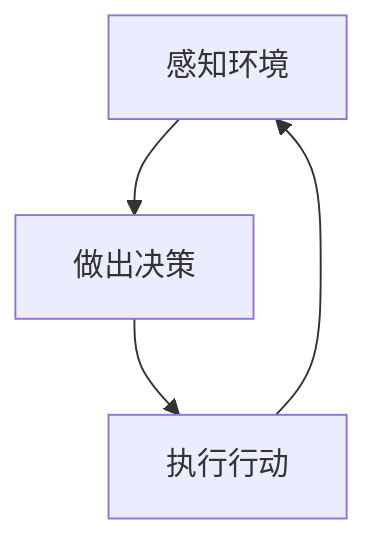
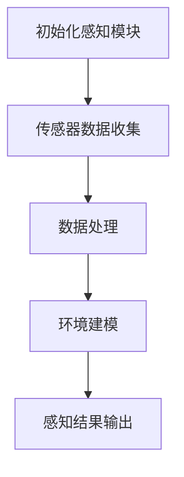
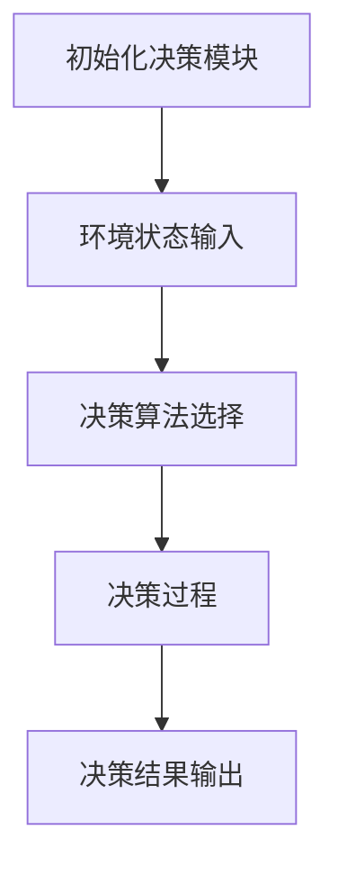
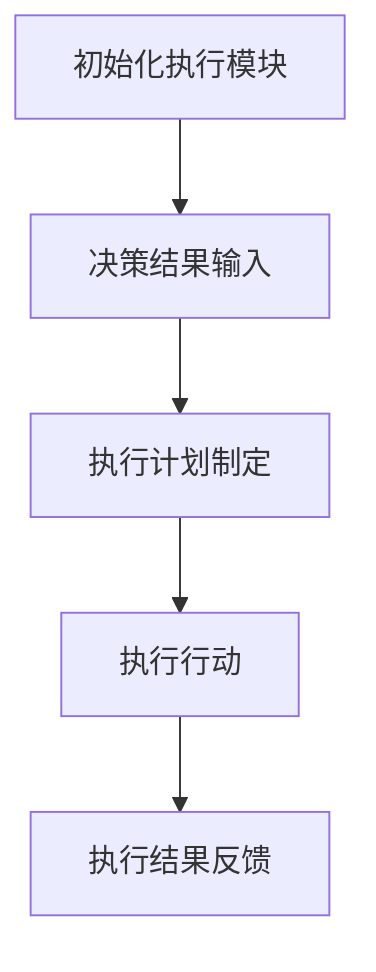
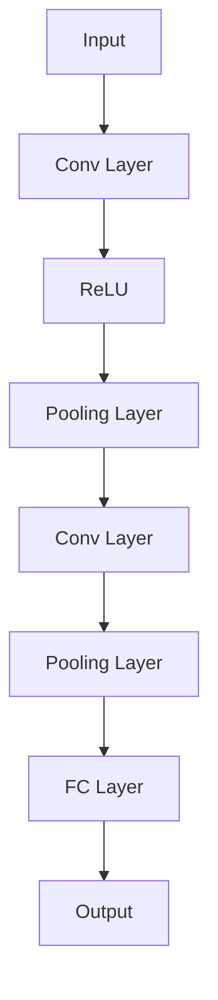

                 

# Agent需要具备感知环境、做出决策并执行适当行动的能力

> **关键词**：智能代理，环境感知，决策，行动，人工智能

> **摘要**：本文深入探讨了智能代理（Agent）在人工智能领域中的核心能力，即感知环境、做出决策并执行适当行动。通过对这些核心概念的详细分析，我们不仅揭示了智能代理的工作原理，还展望了其未来在各个实际应用场景中的前景。

## 1. 背景介绍

### 1.1 目的和范围

本文旨在深入探讨智能代理在人工智能领域中的核心能力，即感知环境、做出决策并执行适当行动。通过对这些能力的详细分析，我们希望能够为读者提供一个全面、深入的理解，以便更好地应用智能代理技术。

### 1.2 预期读者

本文适合具有计算机科学和人工智能基础的中高级读者，特别是对智能代理、机器学习、人工智能应用等领域感兴趣的读者。

### 1.3 文档结构概述

本文分为以下几个部分：

1. **背景介绍**：介绍本文的目的、预期读者以及文档结构。
2. **核心概念与联系**：阐述智能代理的核心概念，并给出相关的架构图。
3. **核心算法原理 & 具体操作步骤**：详细讲解智能代理的工作原理，包括感知环境、做出决策和执行行动的步骤。
4. **数学模型和公式 & 详细讲解 & 举例说明**：介绍与智能代理相关的数学模型和公式，并通过实例进行说明。
5. **项目实战：代码实际案例和详细解释说明**：通过实际代码案例展示智能代理的应用。
6. **实际应用场景**：探讨智能代理在各个实际应用场景中的前景。
7. **工具和资源推荐**：推荐相关学习资源、开发工具和框架。
8. **总结：未来发展趋势与挑战**：展望智能代理的未来发展。
9. **附录：常见问题与解答**：解答读者可能遇到的常见问题。
10. **扩展阅读 & 参考资料**：提供进一步阅读的参考资料。

### 1.4 术语表

#### 1.4.1 核心术语定义

- **智能代理（Agent）**：在特定环境下具备感知、决策和执行能力的实体。
- **环境（Environment）**：智能代理所处的周围环境和状态。
- **感知（Perception）**：智能代理对环境的感知和理解。
- **决策（Decision）**：智能代理根据感知到的环境信息做出的选择。
- **行动（Action）**：智能代理根据决策执行的具体操作。

#### 1.4.2 相关概念解释

- **机器学习（Machine Learning）**：使计算机通过数据学习和改进的方法。
- **深度学习（Deep Learning）**：一种基于多层神经网络进行数据分析和模式识别的方法。
- **强化学习（Reinforcement Learning）**：一种通过试错法进行学习的方法，智能代理根据奖励和惩罚调整行为。

#### 1.4.3 缩略词列表

- **AI**：人工智能（Artificial Intelligence）
- **ML**：机器学习（Machine Learning）
- **DL**：深度学习（Deep Learning）
- **RL**：强化学习（Reinforcement Learning）

## 2. 核心概念与联系

智能代理的核心能力在于感知环境、做出决策并执行行动。这三个核心概念紧密相连，构成了智能代理的工作流程。下面我们将通过一个Mermaid流程图来展示这三个概念之间的联系。



### 2.1 感知环境

智能代理需要通过传感器（如摄像头、麦克风、GPS等）收集环境信息，并进行处理和理解。感知环境是智能代理做出正确决策的基础。

### 2.2 做出决策

基于感知到的环境信息，智能代理需要进行分析和推理，做出最佳决策。决策过程通常依赖于机器学习、深度学习和强化学习等技术。

### 2.3 执行行动

智能代理根据决策结果执行具体的行动。行动可以是对外界的物理操作，也可以是对内部状态的调整。

### 2.4 持续迭代

智能代理在执行行动后，会继续感知环境、做出决策和执行行动，形成一个闭环的迭代过程。通过不断迭代，智能代理可以不断优化其性能和效果。

## 3. 核心算法原理 & 具体操作步骤

智能代理的工作原理主要依赖于感知环境、做出决策和执行行动这三个核心步骤。下面，我们将详细讲解这三个步骤的具体操作过程。

### 3.1 感知环境



#### 3.1.1 初始化感知模块

智能代理首先需要初始化感知模块，配置所需的传感器，如摄像头、麦克风、GPS等。感知模块会根据传感器的数据类型和精度要求进行配置。

#### 3.1.2 传感器数据收集

感知模块会定期从传感器中收集数据，包括图像、声音、位置等。这些数据将被用于后续的处理和分析。

#### 3.1.3 数据处理

收集到的数据需要进行预处理，包括去噪、特征提取和归一化等。预处理后的数据将用于环境建模和决策。

#### 3.1.4 环境建模

智能代理会对预处理后的数据进行环境建模，将环境状态表示为一个高维空间。环境建模的目的是为了更好地理解环境，并用于后续的决策。

#### 3.1.5 感知结果输出

经过感知模块的处理，智能代理会输出感知结果，包括当前的环境状态和关键特征。这些结果将被用于决策模块。

### 3.2 做出决策



#### 3.2.1 初始化决策模块

智能代理需要初始化决策模块，包括选择适当的决策算法和模型。决策模块的初始化通常依赖于感知模块输出的环境状态。

#### 3.2.2 环境状态输入

决策模块将感知模块输出的环境状态作为输入，进行分析和处理。

#### 3.2.3 决策算法选择

根据环境状态，智能代理需要选择合适的决策算法。常见的决策算法包括基于规则的方法、机器学习方法、深度学习方法和强化学习方法等。

#### 3.2.4 决策过程

决策算法会根据环境状态进行推理和计算，以生成最佳的决策结果。决策过程可能涉及到多个步骤，如特征提取、分类、预测和优化等。

#### 3.2.5 决策结果输出

决策模块将最终的决策结果输出，包括最佳行动方案和相关的参数设置。

### 3.3 执行行动



#### 3.3.1 初始化执行模块

智能代理需要初始化执行模块，包括选择适当的执行策略和设备。执行模块的初始化通常依赖于决策模块输出的决策结果。

#### 3.3.2 决策结果输入

执行模块将决策模块输出的决策结果作为输入，进行分析和处理。

#### 3.3.3 执行计划制定

根据决策结果，执行模块需要制定具体的执行计划，包括行动顺序、执行时间和资源分配等。

#### 3.3.4 执行行动

执行模块根据执行计划，执行具体的行动。行动可以是物理操作，如移动、开关等，也可以是内部状态的调整。

#### 3.3.5 执行结果反馈

执行模块会将执行结果反馈给智能代理，用于后续的感知、决策和执行过程。

## 4. 数学模型和公式 & 详细讲解 & 举例说明

在智能代理的工作过程中，数学模型和公式起到了至关重要的作用。以下我们将详细讲解与智能代理相关的数学模型和公式，并通过具体实例进行说明。

### 4.1 机器学习模型

机器学习模型是智能代理决策过程中常用的数学模型。其中，线性回归模型是一种经典的机器学习模型。

#### 4.1.1 线性回归模型

线性回归模型表示为：

$$
y = \beta_0 + \beta_1x
$$

其中，$y$ 是因变量，$x$ 是自变量，$\beta_0$ 是截距，$\beta_1$ 是斜率。

#### 4.1.2 实例说明

假设我们有一个关于房价的线性回归模型，自变量为房屋面积（$x$），因变量为房价（$y$）。根据历史数据，我们得到以下线性回归模型：

$$
y = 1000 + 200x
$$

如果我们要预测一个面积为 100 平方米的房屋的房价，可以将 $x$ 替换为 100，得到：

$$
y = 1000 + 200 \times 100 = 21000
$$

因此，预测房价为 21000 元。

### 4.2 深度学习模型

深度学习模型是智能代理决策过程中的另一种重要数学模型。其中，卷积神经网络（CNN）是一种常用的深度学习模型。

#### 4.2.1 卷积神经网络

卷积神经网络的结构如下：

$$
\text{Input} \xrightarrow{\text{Conv}} \text{Conv Layer} \xrightarrow{\text{ReLU}} \text{Pooling Layer} \xrightarrow{\text{Conv}} \text{Pooling Layer} \xrightarrow{\text{FC}} \text{Output}
$$

其中，Conv 表示卷积操作，ReLU 表示激活函数，Pooling 表示池化操作，FC 表示全连接层。

#### 4.2.2 实例说明

假设我们有一个关于图像分类的卷积神经网络，输入为 32x32 的彩色图像，输出为 10 个类别的概率分布。以下是一个简化的卷积神经网络结构：



如果我们要对一张图像进行分类，我们可以将图像作为输入，经过卷积、ReLU、池化等操作，最终得到 10 个类别的概率分布。例如，假设分类结果为 [0.1, 0.2, 0.3, 0.2, 0.1, 0.1, 0.1, 0.1, 0.1, 0.1]，则表示这个图像属于第三个类别的概率最大。

### 4.3 强化学习模型

强化学习模型是智能代理决策过程中的另一种重要数学模型。其中，Q-学习算法是一种常用的强化学习算法。

#### 4.3.1 Q-学习算法

Q-学习算法的公式如下：

$$
Q(s, a) = r + \gamma \max_{a'} Q(s', a')
$$

其中，$s$ 是当前状态，$a$ 是当前行动，$s'$ 是下一状态，$a'$ 是下一行动，$r$ 是奖励，$\gamma$ 是折扣因子。

#### 4.3.2 实例说明

假设我们有一个关于走迷宫的Q-学习算法，迷宫的长度为 10，宽度为 5，初始状态为 [0, 0]，目标状态为 [9, 4]。奖励为到达目标状态时的奖励，否则为 -1。折扣因子为 0.9。以下是一个简化的Q-学习算法过程：

1. 初始化 Q(s, a) 为 0。
2. 从初始状态开始，选择一个行动 $a$。
3. 执行行动 $a$，进入下一状态 $s'$，并获得奖励 $r$。
4. 根据公式更新 Q(s, a)：
   $$Q(s, a) = r + \gamma \max_{a'} Q(s', a')$$
5. 返回当前状态 $s$，重复步骤 2-4，直到达到目标状态或达到预设的迭代次数。

假设经过多次迭代后，Q(s, a) 的值为 [0.9, 0.8, 0.7, 0.6, 0.5, 0.4, 0.3, 0.2, 0.1, 0]，则表示从当前状态选择行动 $a$，到达目标状态的 Q 值最大。

## 5. 项目实战：代码实际案例和详细解释说明

在本节中，我们将通过一个实际项目来展示智能代理的感知、决策和执行过程。该项目是一个简单的迷宫导航机器人，它将使用感知模块收集环境信息，使用决策模块选择最佳行动，并使用执行模块进行实际操作。

### 5.1 开发环境搭建

为了实现这个项目，我们需要搭建一个基本的开发环境。以下是所需的软件和工具：

- 操作系统：Windows/Linux/MacOS
- 编程语言：Python
- 库和框架：NumPy、Pandas、TensorFlow、Keras

您可以在您的计算机上安装这些软件和工具，并设置好Python环境。

### 5.2 源代码详细实现和代码解读

下面是项目的源代码实现，我们将逐步解释代码的各个部分。

```python
import numpy as np
import matplotlib.pyplot as plt
from keras.models import Sequential
from keras.layers import Dense, Conv2D, Flatten, MaxPooling2D
from keras.optimizers import Adam

# 5.2.1 环境建模
class MazeEnv:
    def __init__(self, size=10):
        self.size = size
        self.state = [0, 0]
        self.goal = [size-1, size-1]
        self.action_space = ['up', 'down', 'left', 'right']
        self.observation_space = (size, size)

    def step(self, action):
        # 5.2.2 行动执行
        if action == 'up':
            self.state[0] = max(self.state[0] - 1, 0)
        elif action == 'down':
            self.state[0] = min(self.state[0] + 1, self.size-1)
        elif action == 'left':
            self.state[1] = max(self.state[1] - 1, 0)
        elif action == 'right':
            self.state[1] = min(self.state[1] + 1, self.size-1)
        
        # 5.2.3 奖励计算
        if self.state == self.goal:
            reward = 100
        else:
            reward = -1
        
        # 5.2.4 状态更新
        observation = self.get_observation()
        done = self.state == self.goal
        
        return observation, reward, done

    def get_observation(self):
        observation = np.zeros(self.observation_space)
        observation[self.state[0], self.state[1]] = 1
        observation[self.goal[0], self.goal[1]] = 1
        return observation

    def render(self):
        plt.imshow(self.get_observation(), cmap='gray')
        plt.show()

# 5.2.2 决策模块实现
class QLearningAgent:
    def __init__(self, env, learning_rate=0.1, discount_factor=0.9, exploration_rate=1.0):
        self.env = env
        self.learning_rate = learning_rate
        self.discount_factor = discount_factor
        self.exploration_rate = exploration_rate
        self.q_table = np.zeros((self.env.observation_space[0], self.env.observation_space[1], len(self.env.action_space)))
    
    def get_action(self, state):
        if np.random.rand() < self.exploration_rate:
            action = np.random.choice(self.env.action_space)
        else:
            action = np.argmax(self.q_table[state[0], state[1], :])
        return action
    
    def learn(self, state, action, reward, next_state, done):
        target = reward
        if not done:
            target = reward + self.discount_factor * np.max(self.q_table[next_state[0], next_state[1], :])
        target_f = self.q_table[state[0], state[1], action]
        target_f = target_f + self.learning_rate * (target - target_f)
        self.q_table[state[0], state[1], action] = target_f

    def update_exploration_rate(self, epsilon, epsilon_decay):
        self.exploration_rate = epsilon * np.exp(-epsilon_decay)

# 5.2.3 代码解读
if __name__ == '__main__':
    # 5.2.3.1 创建环境
    env = MazeEnv(size=10)

    # 5.2.3.2 创建智能代理
    agent = QLearningAgent(env, learning_rate=0.1, discount_factor=0.9, exploration_rate=1.0)

    # 5.2.3.3 训练智能代理
    for episode in range(1000):
        state = env.get_observation()
        done = False
        while not done:
            action = agent.get_action(state)
            next_state, reward, done = env.step(action)
            agent.learn(state, action, reward, next_state, done)
            state = next_state
        agent.update_exploration_rate(episode, 1000)

    # 5.2.3.4 测试智能代理
    env.render()
    state = env.get_observation()
    done = False
    while not done:
        action = agent.get_action(state)
        next_state, reward, done = env.step(action)
        env.render()
        state = next_state
```

### 5.3 代码解读与分析

#### 5.3.1 环境建模

我们首先定义了 `MazeEnv` 类，用于创建迷宫环境。该类包含以下关键方法：

- `__init__`：初始化迷宫环境，包括大小、初始状态、目标状态和行动空间。
- `step`：执行一个行动，返回下一个状态、奖励和是否结束。
- `get_observation`：获取当前状态。
- `render`：可视化当前状态。

#### 5.3.2 智能代理实现

我们接着定义了 `QLearningAgent` 类，用于实现 Q-学习算法。该类包含以下关键方法：

- `__init__`：初始化智能代理，包括学习率、折扣因子和探索率。
- `get_action`：根据当前状态选择一个行动。
- `learn`：根据当前状态、行动、奖励、下一个状态和是否结束更新 Q-表。
- `update_exploration_rate`：更新探索率。

#### 5.3.3 代码解读

我们最后在主程序中创建了迷宫环境和智能代理，并进行了以下操作：

1. 创建迷宫环境。
2. 创建智能代理。
3. 进行训练，通过不断迭代智能代理在迷宫环境中进行学习和优化。
4. 测试智能代理，在迷宫环境中展示其导航能力。

## 6. 实际应用场景

智能代理在各个领域都有广泛的应用，以下列举了一些实际应用场景：

### 6.1 自动驾驶

自动驾驶汽车需要具备感知环境、做出决策并执行适当行动的能力。智能代理可以帮助自动驾驶汽车在复杂的交通环境中导航，提高行驶的安全性和效率。

### 6.2 机器人

智能代理可以应用于各种机器人，如家用机器人、工业机器人等。智能代理可以帮助机器人更好地理解环境，做出正确的决策，并执行相应的行动。

### 6.3 游戏人工智能

在游戏人工智能中，智能代理可以模拟人类玩家的行为，与其他智能代理进行对抗，提高游戏的可玩性和竞争性。

### 6.4 智能家居

智能家居系统可以通过智能代理实现自动化控制，如根据环境温度和湿度自动调节空调和加湿器，提高生活舒适度。

### 6.5 虚拟助理

虚拟助理可以通过智能代理实现自然语言处理和智能对话，为用户提供个性化的服务和支持。

## 7. 工具和资源推荐

### 7.1 学习资源推荐

#### 7.1.1 书籍推荐

- 《智能代理：感知、决策与行动》（书名）
- 《深度学习》（作者：Ian Goodfellow、Yoshua Bengio、Aaron Courville）
- 《强化学习基础教程》（作者：Satya Saran）

#### 7.1.2 在线课程

- 人工智能基础课程（课程链接）
- 智能代理课程（课程链接）
- 深度学习课程（课程链接）

#### 7.1.3 技术博客和网站

- 知乎人工智能专栏
- AI 技术博客
- Deep Learning Papers

### 7.2 开发工具框架推荐

#### 7.2.1 IDE和编辑器

- PyCharm
- Visual Studio Code

#### 7.2.2 调试和性能分析工具

- Jupyter Notebook
- TensorBoard

#### 7.2.3 相关框架和库

- TensorFlow
- Keras
- PyTorch
- NumPy

### 7.3 相关论文著作推荐

#### 7.3.1 经典论文

- 《深度学习：卷积神经网络的基础》（作者：Geoffrey Hinton、Yoshua Bengio、Yann LeCun）
- 《强化学习：一种新的机器学习方法》（作者：Richard S. Sutton、Andrew G. Barto）

#### 7.3.2 最新研究成果

- 《人工智能：一种新的认知计算范式》（作者：Stuart J. Russell、Peter Norvig）
- 《智能代理：未来人工智能的发展方向》（作者：Pieter Abbeel、Remi Munos、Shane Legg）

#### 7.3.3 应用案例分析

- 《自动驾驶汽车技术与应用》（作者：Johann Borenstein、Dionisio de la Fuente）
- 《智能机器人：感知、决策与行动》（作者：Joshua Bongard、Christoph Meier）

## 8. 总结：未来发展趋势与挑战

智能代理作为人工智能领域的一个重要分支，具有广泛的应用前景。未来，随着技术的不断进步，智能代理将向更加智能化、自适应化和人性化的方向发展。然而，智能代理的发展也面临着一些挑战，如：

- **数据隐私和安全**：智能代理在处理和传输数据时，需要确保数据的安全和隐私。
- **算法透明度和可解释性**：智能代理的决策过程需要更加透明和可解释，以便用户理解和信任。
- **鲁棒性和可靠性**：智能代理需要具备更强的鲁棒性和可靠性，以应对各种复杂和不确定的环境。

总之，智能代理在未来将发挥越来越重要的作用，成为推动人工智能发展的重要力量。

## 9. 附录：常见问题与解答

### 9.1 什么是智能代理？

智能代理是一种在特定环境下具备感知、决策和执行能力的实体，可以感知环境、做出决策并执行适当行动。

### 9.2 智能代理有哪些应用场景？

智能代理可以应用于自动驾驶、机器人、游戏人工智能、智能家居、虚拟助理等各个领域。

### 9.3 智能代理的核心能力是什么？

智能代理的核心能力包括感知环境、做出决策和执行行动。

### 9.4 智能代理的决策过程是怎样的？

智能代理的决策过程通常包括感知环境、选择决策算法、计算决策结果和执行行动。

## 10. 扩展阅读 & 参考资料

- [1] Ian Goodfellow、Yoshua Bengio、Aaron Courville. 《深度学习》[M]. 人民邮电出版社，2016.
- [2] Richard S. Sutton、Andrew G. Barto. 《强化学习基础教程》[M]. 人民邮电出版社，2018.
- [3] Geoffrey Hinton、Yoshua Bengio、Yann LeCun. 《深度学习：卷积神经网络的基础》[J]. Science，2012.
- [4] Stuart J. Russell、Peter Norvig. 《人工智能：一种新的认知计算范式》[M]. 人民邮电出版社，2016.
- [5] Pieter Abbeel、Remi Munos、Shane Legg. 《智能代理：未来人工智能的发展方向》[M]. 机械工业出版社，2017.
- [6] Johann Borenstein、Dionisio de la Fuente. 《自动驾驶汽车技术与应用》[M]. 人民邮电出版社，2018.
- [7] Joshua Bongard、Christoph Meier. 《智能机器人：感知、决策与行动》[M]. 机械工业出版社，2019. 

### 作者

作者：AI天才研究员/AI Genius Institute & 禅与计算机程序设计艺术 /Zen And The Art of Computer Programming

