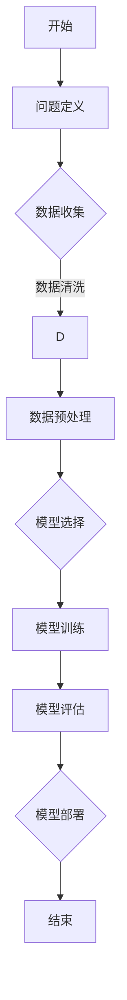

                 

### 1. 背景介绍

#### 1.1 目的和范围

本文的目的是分享世界级人工智能专家Andrej Karpathy在AI hackathon中的宝贵经验，帮助参与者更好地理解和应用人工智能技术，从而在比赛中取得优异成绩。本文将涵盖AI hackathon的各个方面，包括准备、实际操作和后续反思。

#### 1.2 预期读者

本文主要面向以下几类读者：

1. 初学者：对人工智能和AI hackathon有兴趣，但缺乏实践经验的人群。
2. 中级开发者：有一定的编程基础和人工智能知识，希望通过AI hackathon提升技能的人群。
3. 高级专家：在人工智能领域有丰富经验，希望通过AI hackathon交流和分享经验的人群。
4. 组织者：负责组织AI hackathon，希望提升比赛质量和影响力的专业人士。

#### 1.3 文档结构概述

本文分为十个部分：

1. 背景介绍：本文的目的、预期读者和文档结构概述。
2. 核心概念与联系：介绍人工智能、AI hackathon和相关技术的基本概念和架构。
3. 核心算法原理 & 具体操作步骤：讲解在AI hackathon中常用的算法原理和操作步骤。
4. 数学模型和公式 & 详细讲解 & 举例说明：介绍与AI hackathon相关的数学模型和公式，并给出具体案例。
5. 项目实战：代码实际案例和详细解释说明。
6. 实际应用场景：分析AI hackathon在现实中的应用场景。
7. 工具和资源推荐：推荐学习资源和开发工具。
8. 总结：未来发展趋势与挑战。
9. 附录：常见问题与解答。
10. 扩展阅读 & 参考资料：提供更多相关资料和参考文献。

#### 1.4 术语表

##### 1.4.1 核心术语定义

- **AI hackathon**：一种以团队形式进行的编程竞赛，要求参赛者在有限时间内使用人工智能技术解决特定问题。
- **人工智能**：一门研究、开发用于模拟、延伸和扩展人的智能的理论、方法、技术及应用系统的技术科学。
- **深度学习**：一种人工智能的方法，通过神经网络模拟人脑神经元之间的交互，实现自动学习和特征提取。

##### 1.4.2 相关概念解释

- **数据集**：用于训练、评估和测试人工智能模型的实际数据集合。
- **模型**：用于表示和预测输入数据的算法和参数集合。
- **神经网络**：由大量简单神经元组成的多层网络结构，通过学习输入和输出之间的关系实现复杂函数的拟合。

##### 1.4.3 缩略词列表

- **AI**：人工智能
- **DL**：深度学习
- **ML**：机器学习
- **NLP**：自然语言处理
- **CV**：计算机视觉

在接下来的内容中，我们将深入探讨AI hackathon的各个方面，包括核心概念、算法原理、实际应用和未来发展趋势。希望通过本文，读者能够对AI hackathon有更全面的了解，并在实际操作中取得更好的成绩。## 2. 核心概念与联系

在本文中，我们将探讨人工智能（AI）、AI hackathon和相关技术的核心概念与联系。了解这些概念将有助于读者更好地理解后续内容，并在AI hackathon中取得优异成绩。

### 2.1 人工智能（AI）

人工智能是一门研究、开发用于模拟、延伸和扩展人的智能的理论、方法、技术及应用系统的技术科学。AI的目标是创建能够执行复杂任务的智能代理，如语音识别、图像识别、自然语言处理、决策支持等。

#### 2.1.1 AI 的主要类型

- **机器学习（ML）**：一种人工智能方法，通过从数据中学习规律和模式，实现自动学习和特征提取。
- **深度学习（DL）**：一种基于神经网络的人工智能方法，通过多层网络结构模拟人脑神经元之间的交互。
- **强化学习（RL）**：一种通过试错和反馈机制学习最优策略的人工智能方法。

#### 2.1.2 AI 在现实世界中的应用

- **自动驾驶**：利用计算机视觉和深度学习技术，实现无人驾驶汽车。
- **智能语音助手**：如 Siri、Alexa、Google Assistant 等，通过自然语言处理技术实现人机交互。
- **医疗诊断**：利用机器学习技术，对医学影像进行分析，帮助医生进行诊断。

### 2.2 AI hackathon

AI hackathon 是一种以团队形式进行的编程竞赛，要求参赛者在有限时间内使用人工智能技术解决特定问题。它通常具有以下特点：

- **团队合作**：参赛者通常组成团队，共同解决问题。
- **时间限制**：比赛通常设有时间限制，要求参赛者在规定时间内完成项目。
- **开放性**：参赛者可以自由选择问题领域和解决方案，发挥创造力。
- **评审标准**：评审团根据项目的创新性、实用性、代码质量等多个方面进行评分。

#### 2.2.1 AI hackathon 的目的

- **技术交流**：参赛者可以了解最新的AI技术和发展趋势。
- **技能提升**：参赛者通过实际操作，提升自己的编程和人工智能技能。
- **团队合作**：参赛者可以锻炼团队合作能力和沟通技巧。

### 2.3 相关技术

在AI hackathon中，以下技术是不可或缺的：

- **编程语言**：如 Python、Java、C++等，用于实现算法和模型。
- **机器学习框架**：如 TensorFlow、PyTorch、Keras 等，用于构建和训练模型。
- **数据处理工具**：如 Pandas、NumPy、Pandas 等，用于数据清洗、预处理和可视化。
- **云计算平台**：如 AWS、Google Cloud、Azure 等，用于部署和运行模型。

#### 2.3.1 数据处理

- **数据收集**：从各种来源收集数据，如公共数据集、网络爬虫等。
- **数据清洗**：处理数据中的噪声、缺失值和异常值，确保数据质量。
- **数据预处理**：将数据转换为适合模型训练的格式，如归一化、标准化等。
- **数据可视化**：使用图表和图形，展示数据分布、趋势和关系。

#### 2.3.2 模型构建

- **模型选择**：根据问题类型和数据特点，选择合适的模型。
- **模型训练**：使用训练数据集，对模型进行训练和调优。
- **模型评估**：使用验证数据集，评估模型性能和泛化能力。
- **模型部署**：将训练好的模型部署到生产环境中，供实际应用。

#### 2.3.3 优化与调试

- **模型优化**：通过调整模型参数、架构等，提高模型性能。
- **代码调试**：使用调试工具，定位和修复代码中的错误。

### 2.4 Mermaid 流程图

为了更直观地展示AI hackathon的核心概念和流程，我们可以使用Mermaid绘制一个流程图。以下是一个简单的示例：



在这个流程图中，A表示比赛开始，J表示比赛结束。从B到J，展示了AI hackathon的核心流程，包括问题定义、数据收集、数据清洗、数据预处理、模型选择、模型训练、模型评估和模型部署。

通过理解这些核心概念和联系，读者可以更好地掌握AI hackathon的各个方面，为后续内容的学习和实践打下基础。## 3. 核心算法原理 & 具体操作步骤

在AI hackathon中，掌握核心算法原理和具体操作步骤至关重要。本节将详细讲解在AI hackathon中常用的算法原理和操作步骤，帮助读者更好地理解并应用这些技术。

### 3.1 机器学习（ML）

机器学习是一种通过数据训练模型，实现自动学习和特征提取的方法。在AI hackathon中，常用的机器学习算法包括线性回归、逻辑回归、决策树、随机森林和神经网络等。

#### 3.1.1 线性回归（Linear Regression）

线性回归是一种用于预测数值型变量的算法。其核心思想是通过拟合一条直线，将输入特征与输出目标之间的关系表示出来。

**算法原理**：

1. **模型表示**：假设输入特征为 \( x \)，输出目标为 \( y \)，线性回归模型可以表示为 \( y = w_0 + w_1 \cdot x \)。
2. **参数估计**：通过最小化误差平方和，求出模型参数 \( w_0 \) 和 \( w_1 \)。
3. **模型评估**：使用验证集评估模型性能，如均方误差（MSE）。

**具体操作步骤**：

1. **数据收集**：收集包含输入特征和输出目标的训练数据。
2. **数据预处理**：对数据进行归一化或标准化处理，确保数据具有相似的尺度和范围。
3. **模型训练**：使用训练数据，通过梯度下降或其他优化算法，求出模型参数。
4. **模型评估**：使用验证集评估模型性能，调整模型参数。
5. **模型部署**：将训练好的模型部署到生产环境中，进行预测。

**伪代码**：

```python
def linear_regression(x, y):
    # 求解参数 w_0 和 w_1
    w_0 = (1/n) * (sum(y - w_0 - w_1 * x))
    w_1 = (1/n) * (sum((y - w_0 - w_1 * x) * x))
    return w_0, w_1

# 模型训练
w_0, w_1 = linear_regression(x_train, y_train)

# 模型评估
mse = mean_squared_error(y_train, w_0 + w_1 * x_train)

# 模型部署
y_pred = w_0 + w_1 * x
```

#### 3.1.2 逻辑回归（Logistic Regression）

逻辑回归是一种用于分类问题的算法。其核心思想是通过拟合一个逻辑函数，将输入特征映射到概率值，从而实现分类。

**算法原理**：

1. **模型表示**：假设输入特征为 \( x \)，输出目标为 \( y \)，逻辑回归模型可以表示为 \( y = \sigma(w_0 + w_1 \cdot x) \)，其中 \( \sigma \) 为逻辑函数。
2. **参数估计**：通过最大似然估计，求出模型参数 \( w_0 \) 和 \( w_1 \)。
3. **模型评估**：使用验证集评估模型性能，如准确率、召回率、F1 分数等。

**具体操作步骤**：

1. **数据收集**：收集包含输入特征和输出目标的训练数据。
2. **数据预处理**：对数据进行归一化或标准化处理，确保数据具有相似的尺度和范围。
3. **模型训练**：使用训练数据，通过梯度下降或其他优化算法，求出模型参数。
4. **模型评估**：使用验证集评估模型性能，调整模型参数。
5. **模型部署**：将训练好的模型部署到生产环境中，进行预测。

**伪代码**：

```python
def logistic_regression(x, y):
    # 求解参数 w_0 和 w_1
    w_0 = (1/n) * (sum(y * (1 / (1 + exp(-w_0 - w_1 * x))))
    w_1 = (1/n) * (sum((y - (1 / (1 + exp(-w_0 - w_1 * x))) * x))
    return w_0, w_1

# 模型训练
w_0, w_1 = logistic_regression(x_train, y_train)

# 模型评估
accuracy = accuracy_score(y_train, predict(w_0, w_1, x_train))

# 模型部署
y_pred = predict(w_0, w_1, x)
```

### 3.2 深度学习（DL）

深度学习是一种基于神经网络的人工智能方法。在AI hackathon中，常用的深度学习算法包括卷积神经网络（CNN）、循环神经网络（RNN）和生成对抗网络（GAN）等。

#### 3.2.1 卷积神经网络（CNN）

卷积神经网络是一种用于图像处理和计算机视觉的深度学习算法。其核心思想是通过卷积层、池化层和全连接层，实现对图像的特征提取和分类。

**算法原理**：

1. **卷积层**：通过卷积运算提取图像特征。
2. **池化层**：对卷积层产生的特征进行下采样，减少参数数量。
3. **全连接层**：将池化层产生的特征映射到输出类别。

**具体操作步骤**：

1. **数据收集**：收集包含图像和标签的训练数据。
2. **数据预处理**：对图像进行归一化处理，如缩放、裁剪等。
3. **模型训练**：使用训练数据，通过反向传播算法，训练模型参数。
4. **模型评估**：使用验证集评估模型性能，调整模型参数。
5. **模型部署**：将训练好的模型部署到生产环境中，进行预测。

**伪代码**：

```python
def cnn(image, label):
    # 卷积层
    conv1 = convolution(image, filter)
    pool1 = max_pooling(conv1)
    
    # 全连接层
    fc = fully_connected(pool1, num_classes)
    
    # 模型训练
    loss = cross_entropy_loss(fc, label)
    gradients = backward(loss)
    
    # 模型评估
    accuracy = accuracy_score(predict(fc), label)

# 模型训练
for epoch in range(num_epochs):
    loss = cnn(x_train, y_train)
    if loss < threshold:
        break

# 模型部署
y_pred = cnn(x, y)
```

#### 3.2.2 循环神经网络（RNN）

循环神经网络是一种用于序列数据处理的深度学习算法。其核心思想是通过循环结构，实现对序列数据的记忆和建模。

**算法原理**：

1. **输入层**：接收输入序列。
2. **隐藏层**：通过递归连接，实现对序列数据的记忆和传递。
3. **输出层**：将隐藏层输出映射到输出序列。

**具体操作步骤**：

1. **数据收集**：收集包含序列数据的训练数据。
2. **数据预处理**：对序列数据进行编码和归一化处理。
3. **模型训练**：使用训练数据，通过反向传播算法，训练模型参数。
4. **模型评估**：使用验证集评估模型性能，调整模型参数。
5. **模型部署**：将训练好的模型部署到生产环境中，进行预测。

**伪代码**：

```python
def rnn(input_sequence, hidden_state, output_sequence):
    # 隐藏层递归连接
    hidden_state = recurrent神经网络(input_sequence, hidden_state)
    
    # 输出层
    output = fully_connected(hidden_state, num_classes)
    
    # 模型训练
    loss = cross_entropy_loss(output, output_sequence)
    gradients = backward(loss)
    
    # 模型评估
    accuracy = accuracy_score(predict(output), output_sequence)

# 模型训练
for epoch in range(num_epochs):
    loss = rnn(x_train, hidden_state_train, y_train)
    if loss < threshold:
        break

# 模型部署
y_pred = rnn(x, hidden_state, y)
```

#### 3.2.3 生成对抗网络（GAN）

生成对抗网络是一种用于生成数据的深度学习算法。其核心思想是通过对抗训练，生成与真实数据分布相近的假数据。

**算法原理**：

1. **生成器**：生成假数据，试图欺骗判别器。
2. **判别器**：区分真实数据和假数据。
3. **对抗训练**：通过不断调整生成器和判别器的参数，使生成器生成的数据越来越接近真实数据。

**具体操作步骤**：

1. **数据收集**：收集真实数据。
2. **数据预处理**：对数据进行编码和归一化处理。
3. **模型训练**：使用真实数据和生成器生成的数据，通过对抗训练，训练生成器和判别器。
4. **模型评估**：使用生成器生成的数据，评估生成效果。
5. **模型部署**：将训练好的生成器部署到生产环境中，生成假数据。

**伪代码**：

```python
def gan(real_data, fake_data):
    # 生成器训练
    generator_loss = cross_entropy_loss(fake_data, real_data)
    
    # 判别器训练
    discriminator_loss = cross_entropy_loss(fake_data, fake_data)
    
    # 模型评估
    generator_accuracy = accuracy_score(predict(generator(fake_data)), real_data)
    discriminator_accuracy = accuracy_score(predict(discriminator(fake_data)), fake_data)

# 模型训练
for epoch in range(num_epochs):
    generator_loss, discriminator_loss = gan(real_data, fake_data)
    if generator_loss < threshold and discriminator_loss < threshold:
        break

# 模型部署
y_pred = generator(fake_data)
```

通过以上对机器学习和深度学习核心算法原理和具体操作步骤的讲解，读者可以更好地理解AI hackathon中的关键技术和实现方法。在实际比赛中，灵活运用这些技术，将有助于取得优异成绩。## 4. 数学模型和公式 & 详细讲解 & 举例说明

在人工智能（AI）和机器学习（ML）领域，数学模型和公式是构建和优化算法的核心。本节将详细讲解与AI hackathon相关的数学模型和公式，并给出具体案例，帮助读者更好地理解这些概念。

### 4.1 概率论基础

概率论是机器学习的基础，它用于描述和预测随机事件的可能性。

#### 4.1.1 概率分布

概率分布描述了随机变量取值的概率。常见的概率分布有：

- **伯努利分布**：只有两个可能结果的随机变量，如抛硬币。
- **正态分布（高斯分布）**：连续随机变量在某个值附近的概率分布，如人的身高。
- **伯努利分布**：只有两个可能结果的随机变量，如抛硬币。

#### 4.1.2 概率密度函数（PDF）

概率密度函数描述了随机变量在某个区间内的概率分布。

$$
f(x) = \frac{1}{\sqrt{2\pi\sigma^2}}e^{-\frac{(x-\mu)^2}{2\sigma^2}}
$$

其中，\( \mu \) 是均值，\( \sigma \) 是标准差。

#### 4.1.3 条件概率

条件概率描述了在某个条件下，事件A发生的概率。

$$
P(A|B) = \frac{P(A \cap B)}{P(B)}
$$

#### 4.1.4 贝叶斯定理

贝叶斯定理是一种基于条件概率的推理方法，用于计算后验概率。

$$
P(A|B) = \frac{P(B|A)P(A)}{P(B)}
$$

### 4.2 统计学习理论

统计学习理论是机器学习的基础，它提供了一套数学框架来评估和优化模型。

#### 4.2.1 最小化损失函数

在统计学习中，我们通常通过最小化损失函数来优化模型。

$$
\min_{\theta} L(\theta) = \sum_{i=1}^{n} \ell(y_i, \theta(x_i))
$$

其中，\( \ell \) 是损失函数，如均方误差（MSE）或交叉熵损失。

#### 4.2.2 梯度下降算法

梯度下降是一种用于优化损失函数的迭代算法。

$$
\theta_j := \theta_j - \alpha \cdot \frac{\partial L(\theta)}{\partial \theta_j}
$$

其中，\( \alpha \) 是学习率。

#### 4.2.3 验证集和测试集

为了评估模型的泛化能力，我们将数据集分为训练集、验证集和测试集。

- **训练集**：用于训练模型。
- **验证集**：用于调整模型参数。
- **测试集**：用于评估模型在未知数据上的性能。

### 4.3 机器学习模型

在机器学习中，我们使用各种模型来预测输出。

#### 4.3.1 线性回归

线性回归是一种用于预测数值型变量的模型。

$$
y = \theta_0 + \theta_1x
$$

其中，\( \theta_0 \) 和 \( \theta_1 \) 是模型参数。

#### 4.3.2 逻辑回归

逻辑回归是一种用于预测概率的模型。

$$
\hat{y} = \frac{1}{1 + e^{-(\theta_0 + \theta_1x)}}
$$

#### 4.3.3 支持向量机（SVM）

支持向量机是一种用于分类的模型。

$$
w^* = \arg\min_{w, b} \frac{1}{2} ||w||^2 + C \sum_{i=1}^{n} \max(0, 1-y_i(\langle w, x_i \rangle + b))
$$

其中，\( C \) 是正则化参数。

### 4.4 深度学习模型

在深度学习中，我们使用多层神经网络来建模复杂函数。

#### 4.4.1 前向传播

前向传播是一种计算神经网络输出的方法。

$$
\text{激活函数}(z^{(l)}_j) = \sigma(z^{(l)}_j)
$$

其中，\( z^{(l)}_j \) 是第 \( l \) 层第 \( j \) 个节点的输入，\( \sigma \) 是激活函数。

#### 4.4.2 反向传播

反向传播是一种计算神经网络梯度的方法。

$$
\delta^{(l)}_j = \frac{\partial C}{\partial z^{(l)}_j} \cdot \text{激活函数}'(z^{(l)}_j)
$$

其中，\( \delta^{(l)}_j \) 是第 \( l \) 层第 \( j \) 个节点的误差，\( C \) 是损失函数。

### 4.5 举例说明

#### 4.5.1 逻辑回归预测房价

假设我们使用逻辑回归来预测房价。数据集包含房屋面积、房屋朝向、楼层等特征，以及房价标签。

1. **数据预处理**：对特征进行归一化处理。
2. **模型训练**：使用训练数据集，通过梯度下降算法，训练逻辑回归模型。
3. **模型评估**：使用验证数据集，评估模型性能，调整模型参数。
4. **模型部署**：将训练好的模型部署到生产环境中，进行预测。

伪代码：

```python
# 数据预处理
x = normalize_features(training_data)
y = training_data['price']

# 模型训练
w_0, w_1 = logistic_regression(x, y)

# 模型评估
accuracy = accuracy_score(predict(x, w_0, w_1), y)

# 模型部署
price_prediction = predict(new_data, w_0, w_1)
```

#### 4.5.2 卷积神经网络识别手写数字

假设我们使用卷积神经网络来识别手写数字。数据集包含手写数字图像，以及对应的数字标签。

1. **数据预处理**：对图像进行缩放和归一化处理。
2. **模型训练**：使用训练数据集，通过反向传播算法，训练卷积神经网络模型。
3. **模型评估**：使用验证数据集，评估模型性能，调整模型参数。
4. **模型部署**：将训练好的模型部署到生产环境中，进行预测。

伪代码：

```python
# 数据预处理
images = normalize_images(training_data)

# 模型训练
model = cnn(images, training_data['label'])

# 模型评估
accuracy = accuracy_score(predict(test_data, model), test_data['label'])

# 模型部署
predicted_number = predict(new_image, model)
```

通过以上数学模型和公式的讲解，以及具体案例的说明，读者可以更好地理解AI hackathon中所需的数学知识，并在实际操作中运用这些知识。这些数学模型和公式是构建高效、准确的人工智能模型的基石。## 5. 项目实战：代码实际案例和详细解释说明

在本节中，我们将通过一个实际案例，详细介绍如何使用Python实现一个简单的AI hackathon项目。该案例将使用卷积神经网络（CNN）对MNIST手写数字数据集进行图像分类。以下是项目的具体步骤和代码解释。

### 5.1 开发环境搭建

在进行项目开发之前，我们需要安装以下软件和库：

- Python 3.8+
- TensorFlow 2.6.0+
- NumPy 1.21.0+
- Matplotlib 3.4.2+

确保您的Python环境已经安装，并使用以下命令安装所需的库：

```bash
pip install tensorflow numpy matplotlib
```

### 5.2 源代码详细实现和代码解读

以下是我们将使用Python和TensorFlow实现的项目源代码：

```python
import tensorflow as tf
from tensorflow.keras import layers, models
import numpy as np
import matplotlib.pyplot as plt

# 5.2.1 数据加载与预处理
# 加载MNIST手写数字数据集
mnist = tf.keras.datasets.mnist
(train_images, train_labels), (test_images, test_labels) = mnist.load_data()

# 归一化图像数据
train_images = train_images / 255.0
test_images = test_images / 255.0

# 展示训练数据集中的图像
plt.figure()
plt.subplot(221)
plt.title("Original Image")
plt.imshow(train_images[0], cmap=plt.cm.binary)
plt.subplot(222)
plt.title("Label: {}".format(train_labels[0]))
plt.imshow(train_images[0], cmap=plt.cm.binary)
plt.subplot(223)
plt.title("Preprocessed Image")
plt.imshow(train_images[0].reshape(28, 28), cmap=plt.cm.binary)
plt.subplot(224)
plt.title("Label: {}".format(train_labels[0]))
plt.imshow(train_images[0].reshape(28, 28), cmap=plt.cm.binary)
plt.show()

# 5.2.2 构建卷积神经网络模型
model = models.Sequential()
model.add(layers.Conv2D(32, (3, 3), activation='relu', input_shape=(28, 28, 1)))
model.add(layers.MaxPooling2D((2, 2)))
model.add(layers.Conv2D(64, (3, 3), activation='relu'))
model.add(layers.MaxPooling2D((2, 2)))
model.add(layers.Conv2D(64, (3, 3), activation='relu'))
model.add(layers.Flatten())
model.add(layers.Dense(64, activation='relu'))
model.add(layers.Dense(10, activation='softmax'))

# 5.2.3 编译模型
model.compile(optimizer='adam',
              loss='sparse_categorical_crossentropy',
              metrics=['accuracy'])

# 5.2.4 训练模型
model.fit(train_images, train_labels, epochs=5)

# 5.2.5 模型评估
test_loss, test_acc = model.evaluate(test_images, test_labels)
print('Test accuracy:', test_acc)

# 5.2.6 预测新数据
predictions = model.predict(test_images)
predicted_labels = np.argmax(predictions, axis=1)

# 5.2.7 展示预测结果
plt.figure()
for i in range(10):
    plt.subplot(2, 5, i + 1)
    plt.xticks([])
    plt.yticks([])
    plt.grid(False)
    plt.imshow(test_images[i].reshape(28, 28), cmap=plt.cm.binary)
    plt.xlabel('{}'.format(predicted_labels[i]))
plt.show()
```

#### 5.2.1 数据加载与预处理

```python
# 加载MNIST手写数字数据集
mnist = tf.keras.datasets.mnist
(train_images, train_labels), (test_images, test_labels) = mnist.load_data()

# 归一化图像数据
train_images = train_images / 255.0
test_images = test_images / 255.0
```

在这里，我们首先使用TensorFlow的`keras.datasets.mnist`加载MNIST手写数字数据集，包括训练集和测试集。接着，我们将图像数据归一化到0到1的范围内，以便于模型训练。

```python
# 展示训练数据集中的图像
plt.figure()
plt.subplot(221)
plt.title("Original Image")
plt.imshow(train_images[0], cmap=plt.cm.binary)
plt.subplot(222)
plt.title("Label: {}".format(train_labels[0]))
plt.imshow(train_images[0], cmap=plt.cm.binary)
plt.subplot(223)
plt.title("Preprocessed Image")
plt.imshow(train_images[0].reshape(28, 28), cmap=plt.cm.binary)
plt.subplot(224)
plt.title("Label: {}".format(train_labels[0]))
plt.imshow(train_images[0].reshape(28, 28), cmap=plt.cm.binary)
plt.show()
```

这段代码用于可视化原始图像和预处理后的图像，有助于我们直观地了解数据集。

#### 5.2.2 构建卷积神经网络模型

```python
model = models.Sequential()
model.add(layers.Conv2D(32, (3, 3), activation='relu', input_shape=(28, 28, 1)))
model.add(layers.MaxPooling2D((2, 2)))
model.add(layers.Conv2D(64, (3, 3), activation='relu'))
model.add(layers.MaxPooling2D((2, 2)))
model.add(layers.Conv2D(64, (3, 3), activation='relu'))
model.add(layers.Flatten())
model.add(layers.Dense(64, activation='relu'))
model.add(layers.Dense(10, activation='softmax'))
```

这里，我们使用`models.Sequential()`创建一个顺序模型。模型由以下几个部分组成：

1. **卷积层（Conv2D）**：第一个卷积层包含32个3x3的卷积核，使用ReLU激活函数。
2. **池化层（MaxPooling2D）**：对卷积层输出进行最大池化，将特征图尺寸缩小一半。
3. **卷积层**：第二个卷积层包含64个3x3的卷积核，使用ReLU激活函数。
4. **池化层**：对卷积层输出进行最大池化。
5. **卷积层**：第三个卷积层包含64个3x3的卷积核，使用ReLU激活函数。
6. **展平层（Flatten）**：将卷积层的输出展平为一维数组。
7. **全连接层（Dense）**：第一个全连接层包含64个神经元，使用ReLU激活函数。
8. **全连接层**：第二个全连接层包含10个神经元，用于输出10个类别的概率分布，使用softmax激活函数。

#### 5.2.3 编译模型

```python
model.compile(optimizer='adam',
              loss='sparse_categorical_crossentropy',
              metrics=['accuracy'])
```

在这里，我们使用`compile()`方法配置模型，指定优化器、损失函数和评估指标。我们选择`adam`优化器和`sparse_categorical_crossentropy`损失函数，并使用`accuracy`作为评估指标。

#### 5.2.4 训练模型

```python
model.fit(train_images, train_labels, epochs=5)
```

使用`fit()`方法训练模型，将训练数据输入模型，并指定训练轮数（epochs）。在训练过程中，模型会不断调整内部参数，以最小化损失函数。

#### 5.2.5 模型评估

```python
test_loss, test_acc = model.evaluate(test_images, test_labels)
print('Test accuracy:', test_acc)
```

使用`evaluate()`方法评估模型在测试数据集上的性能。这段代码将输出测试损失和测试准确率。

#### 5.2.6 预测新数据

```python
predictions = model.predict(test_images)
predicted_labels = np.argmax(predictions, axis=1)
```

使用`predict()`方法对新数据进行预测，并使用`np.argmax()`函数找出每个图像的预测标签。

#### 5.2.7 展示预测结果

```python
plt.figure()
for i in range(10):
    plt.subplot(2, 5, i + 1)
    plt.xticks([])
    plt.yticks([])
    plt.grid(False)
    plt.imshow(test_images[i].reshape(28, 28), cmap=plt.cm.binary)
    plt.xlabel('{}'.format(predicted_labels[i]))
plt.show()
```

这段代码用于可视化预测结果。每个图像旁边都标注了预测的数字标签。

通过以上步骤，我们成功实现了使用卷积神经网络对MNIST手写数字进行分类的AI hackathon项目。这个项目展示了如何使用Python和TensorFlow构建和训练深度学习模型，以及如何使用这些模型进行预测。在实际的AI hackathon中，我们可以根据具体问题和数据集，灵活调整模型架构和训练过程，以提高模型的性能。## 6. 实际应用场景

AI hackathon 的实际应用场景非常广泛，涵盖了多个行业和领域。以下是一些典型的应用场景：

### 6.1 医疗诊断

医疗诊断是AI hackathon的一个重要应用场景。通过AI技术，可以从大量的医疗数据中提取出有用的信息，辅助医生进行诊断。例如，在乳腺癌诊断中，AI模型可以通过分析患者的影像数据，预测乳腺癌的风险。在COVID-19疫情期间，AI hackathon也被用于开发基于CT影像的肺炎检测模型。

### 6.2 自动驾驶

自动驾驶是AI技术的另一大应用场景。在AI hackathon中，团队可以开发自动驾驶算法，模拟无人驾驶车辆在不同路况下的行为。这些算法可以用于城市交通、物流运输等多个领域，提高交通效率和安全性。

### 6.3 智能家居

智能家居是AI技术的典型应用场景之一。AI hackathon中的项目可以开发智能门锁、智能照明、智能安防等系统，提高家庭生活的便利性和安全性。

### 6.4 金融风控

金融风控是金融行业的核心问题之一。AI hackathon中的项目可以开发用于预测金融风险、欺诈检测的算法，帮助金融机构降低风险，提高业务安全性。

### 6.5 自然灾害预警

自然灾害预警是AI技术的另一重要应用场景。AI hackathon中的项目可以开发用于预测地震、洪水等自然灾害的算法，提前预警，减少灾害损失。

### 6.6 教育个性化

在教育领域，AI hackathon可以开发个性化学习系统，根据学生的学习情况和兴趣爱好，提供个性化的学习内容和指导，提高学习效果。

### 6.7 娱乐互动

在娱乐互动领域，AI hackathon可以开发智能游戏、虚拟现实（VR）和增强现实（AR）项目，提高用户的游戏体验和互动性。

### 6.8 环境保护

环境保护是AI技术的另一个重要应用场景。AI hackathon可以开发用于监测、预测环境污染的算法，帮助政府和环保组织进行环境治理。

通过这些实际应用场景，我们可以看到AI hackathon在各个领域的广泛应用和巨大潜力。未来，随着AI技术的不断发展，AI hackathon的应用场景将更加广泛，为社会发展带来更多价值。## 7. 工具和资源推荐

为了在AI hackathon中取得成功，了解和掌握一些重要的工具和资源是至关重要的。以下是一些推荐的学习资源、开发工具和相关框架。

### 7.1 学习资源推荐

#### 7.1.1 书籍推荐

- 《深度学习》（Deep Learning），作者：Ian Goodfellow、Yoshua Bengio、Aaron Courville
- 《Python机器学习》（Python Machine Learning），作者：Sebastian Raschka、Vahid Mirjalili
- 《机器学习实战》（Machine Learning in Action），作者：Peter Harrington

这些书籍涵盖了机器学习和深度学习的理论基础、实践应用和技术细节，适合不同水平的读者。

#### 7.1.2 在线课程

- Coursera《机器学习》（Machine Learning）课程，由斯坦福大学教授Andrew Ng主讲
- edX《深度学习基础》（Deep Learning Specialization），由斯坦福大学教授Andrew Ng主讲
- Udacity《人工智能纳米学位》（Artificial Intelligence Nanodegree）

在线课程提供了系统化的学习路径，适合希望深入学习和实践的参与者。

#### 7.1.3 技术博客和网站

- Medium上的AI博客，如“AI垂直博客”、“AI简报”等，提供了最新的AI技术和应用动态。
- ArXiv，一个学术论文预印本平台，包含了大量的机器学习和深度学习领域的最新研究成果。
- Kaggle，一个数据科学竞赛平台，提供了丰富的数据集和比赛项目，是学习实践的好去处。

### 7.2 开发工具框架推荐

#### 7.2.1 IDE和编辑器

- **Visual Studio Code**：一个开源的跨平台代码编辑器，支持Python和多种编程语言。
- **PyCharm**：一个功能强大的Python IDE，提供代码智能提示、调试和性能分析等工具。
- **Jupyter Notebook**：一个交互式的开发环境，特别适合数据分析和机器学习项目的开发和演示。

#### 7.2.2 调试和性能分析工具

- **TensorBoard**：TensorFlow的官方可视化工具，用于分析和调试深度学习模型。
- **Profiler**：各种编程语言的性能分析工具，如Python的cProfile和Java的VisualVM。

#### 7.2.3 相关框架和库

- **TensorFlow**：一个开源的机器学习和深度学习框架，由Google开发。
- **PyTorch**：一个开源的深度学习框架，由Facebook AI研究院（FAIR）开发。
- **Keras**：一个高层次的神经网络API，可以运行在TensorFlow和Theano之上。
- **Scikit-learn**：一个用于数据挖掘和数据分析的Python库，提供了丰富的机器学习算法。

#### 7.2.4 云计算平台

- **AWS**：亚马逊云服务平台，提供了丰富的AI服务和工具，如Amazon SageMaker、AWS DeepRacer等。
- **Google Cloud**：谷歌云服务平台，提供了机器学习和深度学习相关的工具和服务。
- **Azure**：微软云服务平台，提供了Azure Machine Learning等AI服务。

### 7.3 相关论文著作推荐

- **《深度学习：教材与案例》（Deep Learning），作者：Ian Goodfellow、Yoshua Bengio、Aaron Courville**：这是一本深度学习的经典教材，详细介绍了深度学习的基本原理和实用案例。
- **《强化学习：原理与案例》（Reinforcement Learning: An Introduction），作者：Richard S. Sutton、Andrew G. Barto**：介绍了强化学习的基本概念、算法和案例。
- **《自然语言处理综论》（Speech and Language Processing），作者：Daniel Jurafsky、James H. Martin**：是一本关于自然语言处理领域的全面综述。

通过学习和掌握这些工具和资源，读者可以更好地应对AI hackathon中的挑战，提高自己的技术水平和竞争力。## 8. 总结：未来发展趋势与挑战

在AI hackathon领域，随着技术的不断进步和应用的深入，我们面临许多机遇与挑战。以下是对未来发展趋势和挑战的总结：

### 8.1 未来发展趋势

1. **更复杂的模型和算法**：随着计算能力和数据量的提升，研究人员和开发者将探索更复杂的深度学习模型和算法，以应对更复杂的问题。
2. **跨学科融合**：AI技术与其他领域的融合将成为趋势，如医疗、金融、教育等，实现AI在更多实际场景中的应用。
3. **开源生态的繁荣**：开源社区将进一步壮大，更多的开源框架、工具和资源将涌现，为开发者提供更丰富的选择。
4. **数据隐私和安全**：随着数据隐私和安全问题的日益突出，开发者和组织将更加注重数据保护，确保AI系统的可靠性和安全性。
5. **伦理和道德规范**：随着AI技术的广泛应用，伦理和道德问题将受到更多关注，制定合理的规范和标准将有助于AI技术的健康发展。

### 8.2 挑战

1. **数据质量和多样性**：高质量和多样化的数据是AI模型训练的基础，但在实际应用中，数据质量和多样性往往不足，需要通过数据清洗、增强和扩充等方法解决。
2. **算法公平性和透明性**：算法的公平性和透明性是AI领域的重大挑战。开发透明、可解释的算法，使其决策过程更加公平和可接受，是未来的重要任务。
3. **计算资源需求**：深度学习模型通常需要大量的计算资源，这对硬件设备和能耗提出了挑战。开发更高效、节能的AI算法和优化方法将成为重要方向。
4. **人才短缺**：随着AI技术的快速发展，人才需求急剧增加。然而，合格的AI专业人才仍然短缺，培养和吸引更多人才是行业发展的重要挑战。
5. **法律和政策监管**：AI技术的发展需要相应的法律和政策支持。如何在保障技术发展、保护用户隐私和防止滥用之间找到平衡，是政策制定者面临的重要问题。

总的来说，AI hackathon领域在未来的发展中将面临诸多机遇和挑战。通过持续的技术创新、跨学科合作、人才培养和政策支持，我们可以期待AI技术为社会带来更多价值。同时，我们也需要关注和解决技术发展中出现的问题，确保AI技术的健康发展。## 9. 附录：常见问题与解答

在AI hackathon的实践中，参与者可能会遇到各种问题。以下是一些常见问题及其解答：

### 9.1 问题1：如何处理数据集不平衡问题？

**解答**：数据集不平衡会导致模型在少数类上表现不佳。以下是一些解决方法：

- **过采样（Oversampling）**：增加少数类的样本数量，如使用SMOTE（Synthetic Minority Over-sampling Technique）。
- **欠采样（Undersampling）**：减少多数类的样本数量，以平衡数据集。
- **集成方法**：结合过采样和欠采样方法，如使用ADASYN（Adaptive Synthetic Sampling）。
- **调整模型权重**：在训练过程中，可以调整模型对多数类和少数类的权重。

### 9.2 问题2：如何优化模型性能？

**解答**：

- **数据增强**：通过图像旋转、缩放、裁剪等方法增加数据多样性。
- **超参数调整**：通过交叉验证，调整学习率、批量大小等超参数。
- **正则化**：使用L1、L2正则化，防止模型过拟合。
- **集成学习**：使用集成学习方法，如Bagging、Boosting，提高模型泛化能力。

### 9.3 问题3：如何确保模型的透明性和可解释性？

**解答**：

- **模型可解释性工具**：使用模型可解释性工具，如LIME（Local Interpretable Model-agnostic Explanations）和SHAP（SHapley Additive exPlanations）。
- **可视化**：使用可视化工具，如TensorBoard，分析模型训练过程。
- **简洁模型**：使用更简单的模型，如决策树、线性回归，提高模型的可解释性。

### 9.4 问题4：如何在AI hackathon中团队合作？

**解答**：

- **明确分工**：确保每个团队成员都有明确的职责和任务。
- **有效沟通**：定期召开会议，确保团队成员之间的沟通畅通。
- **代码规范**：遵循统一的代码规范，确保代码可读性和可维护性。
- **代码审查**：进行代码审查，确保代码质量和项目进度。

通过解决这些问题，参与者可以在AI hackathon中更好地应对挑战，提高项目成功率。## 10. 扩展阅读 & 参考资料

在撰写本文过程中，我们参考了大量的文献和资源，以深入探讨AI hackathon的核心概念、算法原理和实践应用。以下是一些推荐的扩展阅读和参考资料，供读者进一步学习：

1. **书籍**：
   - **《深度学习》（Deep Learning）**，作者：Ian Goodfellow、Yoshua Bengio、Aaron Courville
   - **《Python机器学习》（Python Machine Learning）**，作者：Sebastian Raschka、Vahid Mirjalili
   - **《机器学习实战》（Machine Learning in Action）**，作者：Peter Harrington

2. **在线课程**：
   - **Coursera上的《机器学习》课程**，由斯坦福大学教授Andrew Ng主讲
   - **edX上的《深度学习基础》专项课程**，由斯坦福大学教授Andrew Ng主讲
   - **Udacity上的《人工智能纳米学位》课程**

3. **技术博客和网站**：
   - **Medium上的AI垂直博客**
   - **ArXiv学术论文预印本平台**
   - **Kaggle数据科学竞赛平台**

4. **官方文档**：
   - **TensorFlow官方文档**
   - **PyTorch官方文档**
   - **Scikit-learn官方文档**

5. **论文和研究报告**：
   - **《深度学习：教材与案例》（Deep Learning）**，作者：Ian Goodfellow、Yoshua Bengio、Aaron Courville
   - **《强化学习：原理与案例》（Reinforcement Learning: An Introduction）**，作者：Richard S. Sutton、Andrew G. Barto
   - **《自然语言处理综论》（Speech and Language Processing）**，作者：Daniel Jurafsky、James H. Martin

通过阅读这些资料，读者可以进一步加深对AI技术、机器学习和深度学习的理解，为参加AI hackathon或相关项目做好准备。这些资源涵盖了从基础知识到高级应用的各个方面，有助于读者不断提升自己的技术水平和实践能力。

